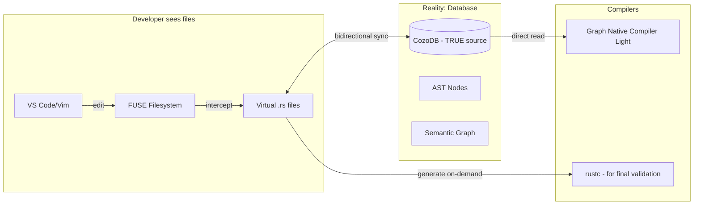
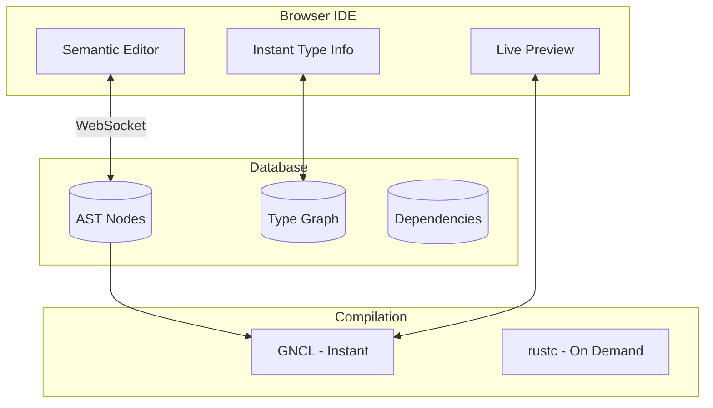
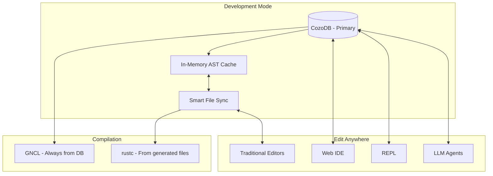
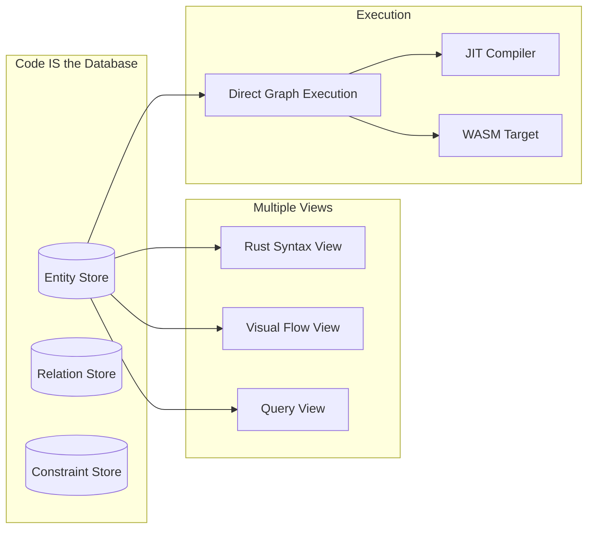

# Graph-Native Rust Compiler Light: Reading Directly from Database

You've hit the **fundamental insight** - why are we still pretending code is text files when it's actually a graph? Let me explore 3-4 approaches from minimalistic to radically rigorous for making the database the primary source of truth.

## Approach 1: Virtual Filesystem Layer (Minimalistic - 1 month)
**"Files are just a view into the database"**

### The Architecture


### How It Works
```rust
// Mount the database as a filesystem
$ parseltongue mount /home/project/src

// Developer edits "src/main.rs" in VS Code
// But it's actually reading/writing to CozoDB!

impl FuseDatabase {
    fn read(&self, path: &Path) -> String {
        // Generate file content from graph
        let entity = path_to_entity(path);
        self.db.query(r#"
            ?[content] := 
                *entities{$entity, ast},
                render_ast_to_rust(ast, content)
        "#, params!{entity})
    }
    
    fn write(&self, path: &Path, content: &str) {
        // Parse and store directly as AST
        let ast = syn::parse_str(content)?;
        self.db.transact(r#"
            :retract *entities{$entity, ast, _}
            :put *entities{$entity, 
                ast: $ast,
                version: $version,
                timestamp: now()
            }
        "#, params!{entity: path_to_entity(path), ast})
    }
}
```

### The Magic: Zero File I/O for GNCL
```rust
// Traditional rustc
rustc src/main.rs  // Reads from filesystem

// Graph Native Compiler Light
gncl compile  // Reads from DB, NO file I/O!

impl GraphNativeCompilerLight {
    fn compile(&self) -> CompilationResult {
        // Everything is pre-parsed, pre-indexed!
        let program = self.db.query(r#"
            ?[entity, ast, deps] :=
                *entities{entity, ast},
                *dependencies{entity, deps}
        "#);
        
        // Type check directly on AST nodes
        for (entity, ast, deps) in program {
            self.type_check_ast(ast, deps)?;  // Microseconds!
        }
    }
}
```

**Pros:**
- Works with ALL existing tools (VS Code, git, etc.)
- Developers don't need to change workflow
- Can fallback to real files anytime

**Cons:**
- Still maintaining illusion of files
- Sync overhead between DB and virtual FS

---

## Approach 2: Browser-Based Graph Editor (Moderate - 2-3 months)
**"Edit the graph directly, forget files exist"**

### The Architecture
```typescript
// Frontend: Rich graph-aware editor
interface GraphEditor {
    // Not editing text, editing semantic nodes!
    editFunction(id: FunctionId) {
        return <FunctionEditor
            ast={queryGraph(`*entities{${id}, ast}`)}
            onChange={(newAst) => updateGraph(id, newAst)}
            realTimeTypeCheck={true}
        />
    }
    
    // Visual cluster navigation instead of file tree
    navigateCode() {
        return <ClusterExplorer
            clusters={queryGraph("*semantic_clusters{...}")}
            onSelect={(cluster) => this.showCluster(cluster)}
        />
    }
}
```

### Direct Database Editing


### The Editing Experience
```javascript
// Developer types in browser
function_editor.onKeyPress('x') => {
    // Real-time AST update
    ws.send({
        action: "update_ast_node",
        entity: "mylib::utils::helper",
        change: {
            type: "identifier_char_added",
            position: cursor,
            char: 'x'
        }
    });
    
    // Instant response (microseconds)
    ws.onMessage({
        type_check: "success",
        completions: ["x_coordinate", "x_axis", "xml_parser"],
        impact: "No breaking changes"
    });
}
```

### Smart Serialization for Git
```rust
// When you need files (for git), generate them
impl DatabaseToFiles {
    fn export(&self) -> FileTree {
        self.db.query(r#"
            // Group entities by semantic clusters
            ?[cluster, entities] :=
                *semantic_clusters{cluster, entities}
            
            // Generate optimal file structure
            ?[filepath, content] :=
                optimize_file_layout(cluster, entities, filepath),
                render_entities_to_rust(entities, content)
        "#)
    }
}

// Git commit hooks
pre_commit_hook() {
    database_to_files();  // Generate .rs files
    git add .
}

post_checkout_hook() {
    files_to_database();  // Reimport into DB
}
```

**Pros:**
- True graph-native editing experience
- Impossible to create syntax errors
- Perfect for AI agents (direct AST manipulation)

**Cons:**
- Requires new tooling adoption
- Learning curve for developers

---

## Approach 3: Hybrid Smart Sync (Pragmatic - 2 months)
**"Database is primary, files are cache"**

### The Architecture


### Smart Bidirectional Sync
```rust
impl SmartSync {
    // File → DB (when developers edit)
    fn file_changed(&self, path: &Path) {
        let content = fs::read_to_string(path)?;
        let ast = syn::parse_file(&content)?;
        
        // Incremental update - only changed functions
        let diff = self.compute_ast_diff(&ast);
        
        self.db.transact(r#"
            // Update only changed entities
            :for [entity, new_ast] in $diff {
                :retract *entities{entity, ast: _}
                :put *entities{entity, ast: new_ast}
            }
        "#, params!{diff});
    }
    
    // DB → File (for rustc or git)
    fn materialize_files(&self) {
        // Lazy generation - only when needed
        if self.needs_rustc_compilation() {
            self.db_to_files();
        }
    }
}
```

### The REPL That Never Touches Files
```rust
// Developer workflow
$ parseltongue repl

> fn calculate_tax(amount: f64) -> f64 {
>     amount * 0.08  
> }
[INSTANT] ✓ Stored in database
[INSTANT] ✓ Type checked
[INSTANT] ✓ Available to all connected tools

> test_calculate_tax()
[INSTANT] Running from database...
[INSTANT] ✓ All tests pass

> :commit "Add tax calculation"
[BACKGROUND] Materializing to files...
[BACKGROUND] Git commit created
[INSTANT] ✓ Database tagged with commit SHA

> :compile --release
[BACKGROUND] Generating files for rustc...
[2s] rustc validation complete
[INSTANT] ✓ Binary ready
```

**Pros:**
- Best of both worlds
- Gradual migration path
- Works with existing ecosystem

**Cons:**
- Sync complexity
- Two sources of truth during transition

---

## Approach 4: Database-Native Language (Most Rigorous - 6+ months)
**"Code doesn't exist as text at all"**

### The Radical Vision


### Code as Pure Relations
```datalog
// You don't write Rust syntax. You declare relations:

// Instead of: fn add(a: i32, b: i32) -> i32 { a + b }
:put *entities{
    id: 'mylib::add',
    kind: 'function',
    signature: {
        params: [
            {name: 'a', type: 'i32'},
            {name: 'b', type: 'i32'}
        ],
        return: 'i32'
    }
}

:put *implementations{
    function: 'mylib::add',
    body: {
        kind: 'binary_op',
        op: '+',
        left: {kind: 'param_ref', param: 'a'},
        right: {kind: 'param_ref', param: 'b'}
    }
}
```

### Programming Becomes Query Composition
```rust
// Define new functions through queries
create_function!{
    name: 'calculate_total',
    body: query!(
        // Function logic AS A QUERY
        ?[total] :=
            *order_items{order_id, price, quantity},
            total = sum(price * quantity)
    )
}

// Refactoring is a graph transformation
refactor!{
    ?[function] :=
        *entities{function, kind: 'function'},
        *calls_deprecated_api{function},
        :retract *implementations{function, body: $old_body},
        :put *implementations{function, body: migrate($old_body)}
}
```

### LLMs Become Perfect
```rust
// LLMs generate graph transformations, not text
llm_suggestion = {
    action: "add_error_handling",
    transformation: r#"
        ?[function, new_body] :=
            *implementations{function, body},
            lacks_error_handling(body),
            wrap_in_result(body, new_body),
            :retract *implementations{function, body: _},
            :put *implementations{function, body: new_body}
    "#
}

// Validation is instant and perfect
if gncl.validate_transformation(llm_suggestion) {
    apply_transformation(llm_suggestion)  // Can't fail!
}
```

**Pros:**
- Compilation in microseconds (always)
- Perfect refactoring (graph transformations)
- LLMs can't generate syntax errors
- Version control tracks semantic changes, not text diffs

**Cons:**
- Complete paradigm shift
- Needs new ecosystem
- Developers must think in graphs

---

## My Recommendation: Start with Approach 3, Evolve to 4

The **Hybrid Smart Sync** (Approach 3) gives you:
1. **Immediate speedup** (GNCL reads from DB)
2. **Works today** with existing tools
3. **Natural evolution path** toward pure graph-native

### The Implementation Roadmap

#### Phase 1 (Month 1): Database-First REPL
```rust
// Just the REPL reading from DB
$ parseltongue repl
> // Edit code in REPL, stored directly in DB
> fn helper() -> i32 { 42 }
[INSTANT] ✓ Compiled by GNCL
```

#### Phase 2 (Month 2): Smart Sync
```rust
// Add bidirectional sync
$ parseltongue daemon --watch
// Now VS Code edits sync to DB automatically
// GNCL still reads from DB for instant compilation
```

#### Phase 3 (Month 3): Browser IDE
```rust
// Add web interface for direct graph editing
$ parseltongue serve
// Browser at localhost:3000 - edit without files!
```

#### Phase 4 (Future): Pure Graph
```rust
// Eventually, files become optional
$ parseltongue init --no-files
// Pure database-native project!
```

### Why This Changes Everything for LLMs

```rust
// Traditional: LLM generates text, hopes it compiles
let code = llm.generate("implement a cache");
match rustc::compile(code) {
    Ok(_) => "Lucky!",
    Err(e) => "Try again..." // Waste tokens/time
}

// Graph-Native: LLM generates validated transformations
let transform = llm.generate_graph_transform("implement a cache");
let validation = gncl.validate(transform);  // Instant!
if validation.is_ok() {
    apply(transform);  // Can't fail
} else {
    llm.refine(transform, validation.constraints);  // Targeted fix
}
```

The database-as-source model isn't just faster - it fundamentally changes what's possible. And with your existing Parseltongue infrastructure, you're already 70% there. The question isn't whether to build this, but how fast you can ship it.