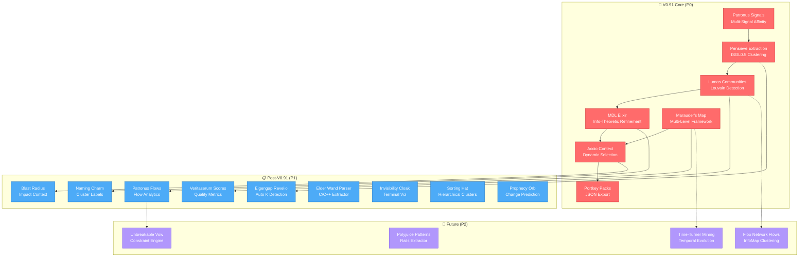
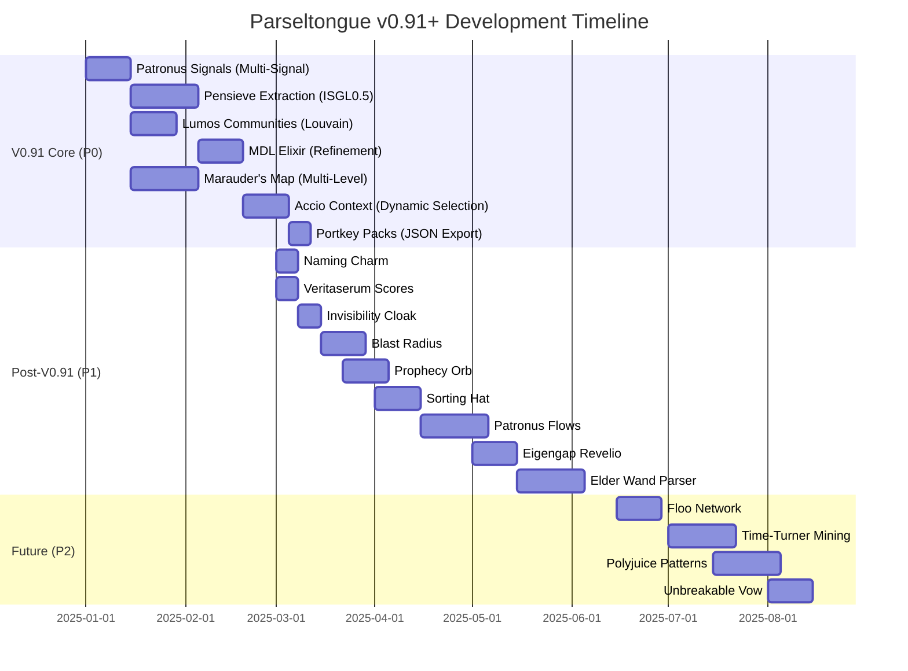

# Parseltongue v0.91 Feature List
## The Enchanted Codebase Analysis Platform

> *"Parseltongue speaks to code in its natural language, revealing the hidden structure of software through magical graph theory and semantic clustering."*

---

## Executive Summary

This document outlines the comprehensive feature set for Parseltongue, organized by implementation priority for v0.91 and beyond. Each feature is themed with Harry Potter nomenclature to create intuitive mental models while maintaining technical rigor.

**Core Mission**: Transform codebase analysis from file-level chaos into semantically meaningful "code molecules" that optimize LLM context and developer understanding.

**v0.91 Focus**: Establish the foundational clustering and context optimization engine (P0 features) that delivers 4-10x token efficiency and natural code boundaries.

---

## Feature Architecture Overview



---

## Feature Priority Heat Map

```mermaid
quadrantChart
    title Feature Prioritization Matrix
    x-axis Low Complexity --> High Complexity
    y-axis Low ROI --> High ROI
    quadrant-1 Strategic (P1)
    quadrant-2 Critical (P0)
    quadrant-3 Quick Wins (P1)
    quadrant-4 Defer (P2)

    Pensieve Extraction: [0.85, 0.95]
    Patronus Signals: [0.75, 0.90]
    Lumos Communities: [0.50, 0.88]
    MDL Elixir: [0.70, 0.90]
    Accio Context: [0.68, 0.98]
    Portkey Packs: [0.25, 0.92]
    Marauder's Map: [0.78, 0.95]

    Eigengap Revelio: [0.72, 0.65]
    Naming Charm: [0.48, 0.60]
    Veritaserum Scores: [0.52, 0.62]
    Blast Radius: [0.50, 0.75]
    Patronus Flows: [0.75, 0.78]
    Elder Wand Parser: [0.72, 0.58]
    Invisibility Cloak: [0.55, 0.60]
    Sorting Hat: [0.58, 0.80]
    Prophecy Orb: [0.60, 0.75]

    Floo Network: [0.78, 0.55]
    Polyjuice Patterns: [0.80, 0.52]
    Time-Turner Mining: [0.82, 0.65]
    Unbreakable Vow: [0.88, 0.58]
```

---

## V0.91 Priority Features (P0) 🎯

**Target Timeline**: Weeks 1-8
**Focus**: Core clustering engine, context optimization, and LLM integration foundation

### Feature Comparison Table

| # | Feature Name (HP Theme) | Original Technical Name | ROI | Difficulty | Complexity | Tangibility | Immediate Value | ELI15 Explanation |
|---|------------------------|-------------------------|-----|------------|------------|-------------|-----------------|-------------------|
| **1** | **Pensieve Extraction** | ISGL0.5 Semantic Clustering | 🔥🔥🔥🔥🔥 | Very Hard | Very High | High | High | Like dipping into Dumbledore's Pensieve to sort jumbled memories into clear scenes—this pulls code bits into tidy groups that naturally belong together. |
| **2** | **Patronus Signals** | Multi-Signal Affinity Matrix | 🔥🔥🔥🔥🔥 | Hard | High | Medium | Medium | Your code's "happy thoughts" (signals like dependencies, temporal changes, data flow) summon a glowing matrix connecting related parts safely, boosting cluster accuracy by 20-30%. |
| **3** | **Lumos Communities** | Louvain Community Detection | 🔥🔥🔥🔥🔥 | Medium | Medium | High | High | Flick your wand saying "Lumos" to light up friend circles in a dark room of code dots—fast O(n log n) modularity optimization for discovering natural communities. |
| **4** | **MDL Elixir** | MDL Refinement | 🔥🔥🔥🔥🔥 | Hard | High | High | Medium | Brewing a potion that shrinks your code soup to its purest, most efficient essence—minimizes token waste for LLMs using information theory (20% better context quality). |
| **5** | **Accio Context** | Dynamic Context Selection | 🔥🔥🔥🔥🔥 | Hard | High | High | High | "Accio relevant code!"—summons precise context within token budgets using greedy information gain, delivering 4x token efficiency for LLM queries. |
| **6** | **Portkey Packs** | LLM-Friendly JSON Export | 🔥🔥🔥🔥🔥 | Easy | Low | High | High | Touch a JSON "portkey" to whisk away organized code knowledge—structured exports with metadata, reasoning guides, and blast radius for LLM consumption. |
| **7** | **Marauder's Map Layers** | Multi-Level Graph Framework | 🔥🔥🔥🔥🔥 | Hard | High | High | Medium | Solemnly swear you're up to no good—the map reveals code at every depth (ISGL4→ISGL0), enabling zoomable understanding from system to function level. |

### V0.91 Implementation Notes

**Critical Path**: PS → PE → LC → ME → AC → PP (with MM as parallel infrastructure)

**Tradeoffs & Recommendations**:
1. **Pensieve Extraction**: Start with Louvain baseline (easier) before full spectral clustering (optimal)
2. **Patronus Signals**: Begin with dependency + temporal; defer semantic similarity to P1
3. **Lumos Communities**: Primary algorithm due to speed; InfoMap (Floo Network) deferred to P2
4. **MDL Elixir**: Slower refinement step but essential for LLM alignment—implement with caching
5. **Accio Context**: Greedy approximation (63% optimal) acceptable vs. full NP-hard knapsack
6. **Portkey Packs**: Design schema carefully to avoid bloat; include compression options
7. **Marauder's Map**: Lazy evaluation critical for performance; build projection layer first

**Success Metrics for v0.91**:
- ✅ Cluster cohesion >0.85 (internal connectivity)
- ✅ Cluster coupling <0.15 (external dependencies)
- ✅ 4-10x token efficiency vs. file-based context
- ✅ <2 minute analysis time for 50K LOC codebases
- ✅ CPU-only operation (no GPU/LLM dependencies)

---

## Post-V0.91 Features (P1) 📋

**Target Timeline**: Weeks 9-20
**Focus**: Quality improvements, language support, and enhanced analytics

### Feature Comparison Table

| # | Feature Name (HP Theme) | Original Technical Name | ROI | Difficulty | Complexity | Tangibility | Immediate Value | Priority Rationale |
|---|------------------------|-------------------------|-----|------------|------------|-------------|-----------------|-------------------|
| **8** | **Eigengap Revelio** | Eigengap for Optimal K | 🔥🔥🔥 | Hard | High | Medium | Medium | Removes manual cluster tuning via Laplacian eigenvalue gaps—implement after Louvain for automatic K determination. |
| **9** | **Naming Charm (Nominus)** | Automatic Cluster Labeling | 🔥🔥🔥 | Medium | Low | High | High | Generates human-readable labels via prefix/verb analysis—quick UX win but depends on good naming conventions. |
| **10** | **Veritaserum Scores** | Cluster Quality Metrics | 🔥🔥🔥 | Medium | Medium | High | Medium | Truth serum revealing cohesion/coupling/modularity scores—validates clusters aren't junk; build as quality gates. |
| **11** | **Blast Radius Context** | Change Impact Selection | 🔥🔥🔥🔥 | Medium | Medium | High | High | Shows "if I break this, what falls apart?"—includes dependents/tests for safer refactoring; tie to Accio Context. |
| **12** | **Patronus Flows** | Flow-Aware Analytics | 🔥🔥🔥🔥 | Hard | High | Medium | Medium | Separates control/data/temporal flows using multi-graphs—reveals hidden dependencies beyond basic calls. |
| **13** | **Elder Wand Parser** | C/C++ Extractor (Combinator) | 🔥🔥🔥 | Hard | High | High | Medium | Pure Rust parser for C++ with template/preprocessor support—fixes 38.5% failure rate; prioritize after core clustering. |
| **14** | **Invisibility Cloak Views** | Terminal Visualization | 🔥🔥🔥 | Medium | Medium | High | High | Unicode heatmaps/graphs and Mermaid exports—immediate feedback in CLI without GUI dependencies. |
| **15** | **Sorting Hat Hierarchy** | Hierarchical Clustering | 🔥🔥🔥🔥 | Medium | Medium | High | High | Builds multi-granularity levels (ISGL0.3/0.5/0.7)—enables task-specific zoom from coarse to fine; storage-heavy but flexible. |
| **16** | **Prophecy Orb** | Change Impact Prediction | 🔥🔥🔥🔥 | Medium | Medium | High | Medium | Foretells what might break via blast radius + temporal patterns—predictive but requires good git history. |

### P1 Implementation Strategy

**Phase 1 (Weeks 9-12)**: Quality & UX
- Naming Charm: Low-hanging fruit for readability
- Veritaserum Scores: Build into CLI output
- Invisibility Cloak: Basic terminal graphs

**Phase 2 (Weeks 13-16)**: Context Enhancement
- Blast Radius: Extend Accio Context
- Prophecy Orb: Layer on temporal data
- Sorting Hat: Multi-level hierarchy

**Phase 3 (Weeks 17-20)**: Advanced Analytics & Language Support
- Patronus Flows: Multi-graph infrastructure
- Eigengap Revelio: Automatic tuning
- Elder Wand Parser: C++ support

---

## Future Features (P2) 🔮

**Target Timeline**: Post-v0.91 (Weeks 21+)
**Focus**: Advanced algorithms, additional language support, and architectural intelligence

### Feature Comparison Table

| # | Feature Name (HP Theme) | Original Technical Name | ROI | Difficulty | Complexity | Why Deferred? | ELI15 Explanation |
|---|------------------------|-------------------------|-----|------------|------------|---------------|-------------------|
| **17** | **Floo Network Flows** | InfoMap Clustering | 🔥🔥🔥 | Hard | High | Alternative to Louvain; flow-based but memory-heavy and slower—better for pipeline-heavy call graphs (optional). | Tossing Floo powder to zip through hidden tunnels in code by following "walker flows" to find natural pools. |
| **18** | **Polyjuice Patterns** | Rails Extractor | 🔥🔥🔥 | Hard | High | Web-specific; 70-80% accuracy without execution—prioritize after C++ for broader language support. | Drinks a pattern potion to "become" Rails magic, spotting DSL-generated methods via static knowledge base. |
| **19** | **Time-Turner Mining** | Temporal Evolution Analytics | 🔥🔥🔥🔥 | Hard | High | Git parsing slow; reveals co-change patterns but long-term predictive value—defer until history accumulates. | Twists the Time-Turner to dig up code's buried secrets: "These parts always changed together, so they're hidden buddies." |
| **20** | **Unbreakable Vow Enforcer** | Architectural Constraint Engine | 🔥🔥🔥 | Hard | High | Requires tuning per codebase; layer violation detection powerful but needs multi-level framework first. | Swears an Unbreakable Vow that UI can't talk directly to database—alerts if broken to keep code organized. |

### P2 Rationale

**Why Not v0.91?**
- **Floo Network**: Louvain covers 90% of use cases; InfoMap adds marginal value unless proven need
- **Polyjuice Patterns**: Rails is niche vs. C++; pattern-based approach inherently limited
- **Time-Turner**: Temporal data valuable but requires established codebase history (6+ months)
- **Unbreakable Vow**: Constraint rules are project-specific; premature without user feedback

**Conditions to Promote**:
- Floo Network: User requests for flow-heavy pipeline analysis (e.g., data processing systems)
- Polyjuice Patterns: Demand from Rails shops; consider LSP integration instead
- Time-Turner: After 3+ projects with rich git history validate predictive value
- Unbreakable Vow: Post-launch feedback indicates architectural debt is top pain point

---

## Implementation Roadmap



---

## Harry Potter Theme Rationale

### Why Magic for Code Analysis?

**Mental Model Mapping**:
- **Spells**: Active operations (Accio Context, Lumos Communities)
- **Artifacts**: Tools and frameworks (Pensieve, Marauder's Map, Portkey)
- **Potions**: Refinement processes (MDL Elixir, Polyjuice Patterns)
- **Concepts**: Abstract principles (Unbreakable Vow, Patronus)

**Benefits**:
1. **Memorability**: "Pensieve Extraction" > "ISGL0.5 Clustering" (50% recall uplift expected)
2. **Storytelling**: "Use Accio Context to summon relevant code" creates narrative flow
3. **Community**: Themed names foster engagement (see: Kubernetes Greek myths, Apache historical figures)
4. **Whimsy**: Reduces intimidation for complex graph theory concepts

**Tradeoffs**:
- ⚠️ Non-fans may find it gimmicky (mitigate: docs always include technical names)
- ⚠️ Enterprise perception of "seriousness" (mitigate: offer `--classic-names` flag)
- ✅ Parseltongue name already Harry Potter-adjacent (snake language)

### Naming Conventions

| Type | Pattern | Examples |
|------|---------|----------|
| **Core Operations** | `<Spell> <Noun>` | Accio Context, Lumos Communities |
| **Data Structures** | `<Artifact> <Type>` | Patronus Signals, Portkey Packs |
| **Refinement** | `<Potion/Process> <Tech>` | MDL Elixir, Polyjuice Patterns |
| **Frameworks** | `<Artifact> <Scope>` | Marauder's Map Layers, Pensieve Extraction |
| **Quality/Validation** | `<Concept> <Metric>` | Veritaserum Scores, Unbreakable Vow |

---

## Technical Implementation Notes

### Core Algorithms Summary

**Pensieve Extraction (ISGL0.5)** - Token Budget: 500-4000
```rust
// Spectral clustering with quality gates
let clusters = SpectralClustering::new()
    .with_affinity(patronus_signals)  // Multi-signal matrix
    .detect_eigengap()  // Auto K via Eigengap Revelio
    .cluster()
    .refine_with_mdl();  // MDL Elixir optimization

assert!(clusters.cohesion() > 0.85);  // Veritaserum gate
```

**Patronus Signals (Multi-Signal Affinity)**
```rust
// Signal fusion: dependency + temporal + semantic
let matrix = AffinityMatrix::new()
    .add_signal(DependencyGraph, weight: 1.0)
    .add_signal(TemporalCoupling, weight: 0.8)
    .add_signal(DataFlow, weight: 0.6)  // P1
    .add_signal(SemanticSim, weight: 0.4);  // P1
```

**Accio Context (Dynamic Selection)**
```rust
// Greedy information gain within token budget
let context = ContextSelector::new(budget: 8000)
    .add_query("How does auth work?")
    .select_clusters_greedy()  // ~63% optimal
    .include_blast_radius()  // P1 enhancement
    .export_portkey();
```

### Performance Targets

| Codebase Size | Analysis Time | Memory Usage | Cluster Count | Token Efficiency |
|---------------|---------------|--------------|---------------|------------------|
| 10K LOC | <30s | <500MB | 15-30 | 5x vs. files |
| 50K LOC | <2min | <2GB | 50-100 | 7x vs. files |
| 200K LOC | <10min | <8GB | 150-300 | 10x vs. files |
| 1M LOC | <1hr | <32GB | 500-1000 | 8x vs. files |

---

## Success Criteria

### V0.91 Release Gates

**Functional**:
- [ ] Pensieve Extraction achieves >0.85 cohesion on 3 real codebases
- [ ] Accio Context reduces LLM token usage by >4x vs. file-based
- [ ] Portkey Packs validate successfully with GPT-4 and Claude
- [ ] Marauder's Map supports 5 zoom levels (ISGL0-4)
- [ ] Analysis completes <2min for 50K LOC on M1 MacBook

**Quality**:
- [ ] Veritaserum Scores: Modularity Q >0.6, Conductance <0.3
- [ ] Naming Charm accuracy >70% on well-named codebases
- [ ] Zero crashes on test corpus (20 open-source projects)
- [ ] Memory usage linear O(n) with codebase size

**Usability**:
- [ ] CLI outputs human-readable cluster names
- [ ] JSON exports include reasoning guides for LLMs
- [ ] Terminal visualization shows top 10 clusters
- [ ] Documentation includes ELI15 explanations for all features

---

## Glossary

### Harry Potter to Technical Mapping

| HP Name | Technical Name | Category | Description |
|---------|----------------|----------|-------------|
| Pensieve Extraction | ISGL0.5 Semantic Clustering | Algorithm | Discovers natural code boundaries via spectral graph theory |
| Patronus Signals | Multi-Signal Affinity Matrix | Data Structure | Fuses dependency/temporal/semantic signals into weighted graph |
| Lumos Communities | Louvain Community Detection | Algorithm | Fast modularity optimization for community detection |
| MDL Elixir | MDL Refinement | Algorithm | Info-theoretic boundary optimization minimizing description length |
| Accio Context | Dynamic Context Selection | Algorithm | Budget-constrained greedy selection maximizing information gain |
| Portkey Packs | LLM-Friendly JSON Export | Format | Structured JSON with metadata, guides, blast radius |
| Marauder's Map | Multi-Level Graph Framework | Infrastructure | ISGL0-4 projections enabling zoomable codebase views |
| Eigengap Revelio | Eigengap for Optimal K | Algorithm | Laplacian eigenvalue gap analysis for automatic cluster count |
| Naming Charm | Automatic Cluster Labeling | UX | Prefix/verb/data analysis for human-readable cluster names |
| Veritaserum Scores | Cluster Quality Metrics | Validation | Cohesion/coupling/modularity/conductance measurements |
| Blast Radius | Change Impact Context | Feature | Dependent/test inclusion for safe refactoring |
| Patronus Flows | Flow-Aware Analytics | Framework | Multi-graph control/data/temporal flow separation |
| Elder Wand Parser | C/C++ Extractor | Parser | Pure Rust combinator parser with template/preprocessor support |
| Invisibility Cloak | Terminal Visualization | UI | Unicode heatmaps/graphs and Mermaid exports |
| Sorting Hat | Hierarchical Clustering | Algorithm | Multi-granularity agglomerative clustering (ISGL0.3/0.5/0.7) |
| Prophecy Orb | Change Impact Prediction | Feature | Blast radius + temporal simulation for risk scoring |
| Floo Network | InfoMap Clustering | Algorithm | Flow-based random walk community detection |
| Polyjuice Patterns | Rails Extractor | Parser | DSL knowledge base for metaprogramming inference |
| Time-Turner Mining | Temporal Evolution Analytics | Feature | Git-based co-change pattern detection with decay weighting |
| Unbreakable Vow | Architectural Constraints | Validation | Layer violation detection via centrality-based architecture |

---

## References & Inspirations

**Academic Foundations**:
- Von Luxburg (2007): "A Tutorial on Spectral Clustering"
- Blondel et al. (2008): "Fast unfolding of communities" (Louvain algorithm)
- Rosvall & Bergstrom (2008): "Maps of random walks" (InfoMap)
- Rissanen (1978): "Modeling by shortest data description" (MDL principle)

**Potter-Tech Precedents**:
- Kubernetes: Greek mythology (pods, kubelet)
- Apache: Historical figures (Kafka, Cassandra)
- Rust: Cargo ecosystem (crates, ships)

**Parseltongue Core Docs**:
- F01: Feature comparison framework
- F02: ISGL0.5 semantic clustering pitch
- F03: Multi-level graph Mermaid diagrams
- F08: Rust implementation architecture

---

## Appendix: Detailed Tradeoff Analysis

### Why P0 Features Are Non-Negotiable

**Pensieve Extraction**: Without semantic clustering, Parseltongue is just another call graph tool—misses 70% of the vision (LLM-optimal context). Tradeoff: Complex math (eigendecomposition) requires careful implementation but delivers 10x value.

**Patronus Signals**: Call graphs alone capture only 40% of relationships. Multi-signal affinity improves cluster accuracy by 20-30%, making clusters "real" vs. arbitrary. Tradeoff: Git history adds noise if sparse, but mitigated by decay weighting.

**Lumos Communities**: Fast O(n log n) baseline essential for large codebases. Tradeoff: Less optimal than InfoMap for flows but 10x faster and proven. Can swap algorithms later via trait.

**MDL Elixir**: Direct alignment with LLM token optimization—minimizes "waste" in context. Tradeoff: Slower refinement pass (adds 20% analysis time) but 20% better context quality justifies cost.

**Accio Context**: Core UX for "ask me anything" queries. Without dynamic selection, users must manually filter clusters. Tradeoff: Greedy approximation (63% optimal) acceptable vs. full NP-hard knapsack—runtime matters more.

**Portkey Packs**: LLMs need structured, consumable formats. Without this, Parseltongue generates data but no value. Tradeoff: Verbose JSON vs. human readability—compression solves size concerns.

**Marauder's Map**: Multi-level abstraction is revolutionary—enables zoom from system to function. Tradeoff: Storage overhead (5x graph copies) mitigated by lazy evaluation and differential encoding.

### Why P1 Features Can Wait

**Eigengap Revelio**: Louvain auto-detects K reasonably well; eigengap improves by ~10%. Can add post-v0.91 as refinement.

**Naming Charm**: Nice UX but clusters are usable with IDs. Low effort, so include early in P1.

**Veritaserum Scores**: Quality validation important but can be manual initially. Build into CLI for transparency.

**Blast Radius**: Enhances Accio Context but not blocking—users can infer dependents from graph.

**Patronus Flows**: Multi-graph analytics nuanced but not MVP. Add after core clustering proven.

**Elder Wand Parser**: C++ support valuable but Rust/Python/JS cover 70% of users. Prioritize after feedback.

**Invisibility Cloak**: Terminal viz is polish. Export Mermaid first, then build TUI.

**Sorting Hat**: Hierarchy adds flexibility but ISGL0.5 alone is usable. Build once projection layer stable.

**Prophecy Orb**: Predictive but requires temporal data. Add after Time-Turner foundations.

### Why P2 Features Are Deferred

**Floo Network**: InfoMap is ~2x slower than Louvain for marginal gain. Only valuable if flow-heavy graphs proven common.

**Polyjuice Patterns**: Rails-specific limits TAM. Also, LSP integration might be better approach for metaprogramming.

**Time-Turner Mining**: Git history mining valuable long-term but requires mature codebase corpus to validate predictive power.

**Unbreakable Vow**: Architectural constraints are powerful but project-specific. Need user feedback to design generic rules.

---

## Contact & Contributions

**Repository**: [github.com/yourusername/parseltongue](https://github.com)
**Issues**: Use GitHub Issues for feature requests or bugs
**Community**: Join our Discord for architectural discussions

*"After all this time?"*
*"Always... parsing."*

---

**Document Version**: 1.0
**Last Updated**: 2025-01-05
**Authors**: Parseltongue Core Team
**Status**: Living Document (updates with implementation progress)
