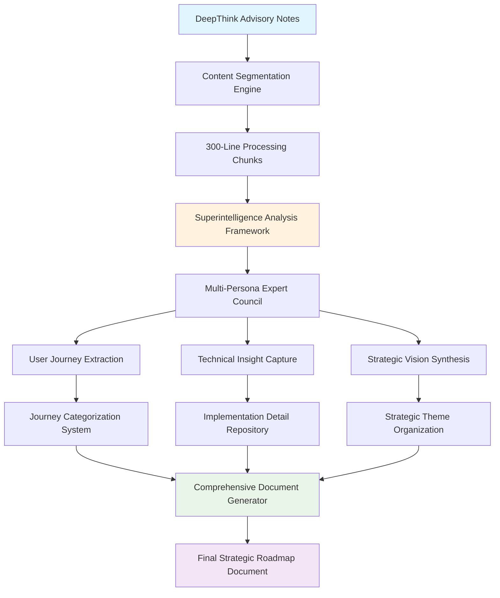

# Design Document

## Overview

This design outlines a systematic approach for extracting comprehensive future parseltongue workflows from the DeepThink Advisory notes. The system will methodically process the advisory content in 300-line increments, apply rigorous analytical frameworks, and synthesize insights into a definitive strategic document that captures user journeys, technical implementations, and strategic vision with Shreyas-level depth.

## Architecture

### High-Level Architecture



### Processing Pipeline Architecture

The system follows a four-phase processing pipeline:

1. **Content Ingestion & Segmentation**: Break down advisory notes into manageable 300-line chunks
2. **Analytical Processing**: Apply superintelligence framework with expert persona councils
3. **Insight Extraction & Categorization**: Extract and organize user journeys, technical details, and strategic insights
4. **Synthesis & Documentation**: Generate comprehensive final document with strategic roadmap

## Components and Interfaces

### 1. Content Processing Methodology

**Purpose**: Systematically process DeepThink Advisory notes in 300-line increments

**Process**:
- Read each advisory note file sequentially
- Process content in 300-line chunks with 20-line overlap for context continuity
- Track progress through each file to ensure complete coverage
- Maintain reading log with chunk identifiers and line ranges

**Deliverables**:
- Content chunk inventory with source mapping
- Progress tracking log
- Context overlap management for seamless analysis

### 2. Superintelligence Analysis Application

**Purpose**: Apply rigorous analytical methodology to each content chunk using the provided framework

**Process**:
1. **Deconstruct & Clarify**: Identify core objectives, assumptions, and complexity in each chunk
2. **Cognitive Staging**: Activate 3-5 expert personas including mandatory Skeptical Engineer
3. **Multi-Perspective Exploration**: Use conceptual blending and structured debate
4. **Verification**: Generate 5-10 fact-checkable questions per major claim

**Expert Personas to Activate**:
- Technical Architect (parseltongue internals and Rust ecosystem)
- Product Strategist (developer experience and market positioning)
- DevOps Engineer (CI/CD integration and operational concerns)
- Developer Experience Specialist (workflow optimization and tooling)
- Skeptical Engineer (challenge assumptions and identify risks)

### 3. User Journey Extraction Process

**Purpose**: Identify and categorize user journeys by persona and workflow type

**Extraction Criteria**:
- Developer persona identification (Individual Developer, Team Lead, DevOps Engineer, Platform Engineer)
- Workflow type classification (Development, CI/CD, Architecture Analysis, LLM Integration, Testing, Security)
- Current pain points and proposed solutions
- Success metrics and expected outcomes
- Tool integration requirements

**Output Structure**:
```markdown
## User Journey: [Title]
**Persona**: [Developer Type]
**Workflow Type**: [Category]
**Current Pain Points**: 
- [Pain point 1]
- [Pain point 2]

**Proposed Solution**: [Description]
**Success Metrics**: [Measurable outcomes]
**Integration Tools**: [Required tools/technologies]
**Expected Outcomes**: [Business/technical benefits]
```

### 4. Technical Insight Capture Framework

**Purpose**: Extract detailed technical specifications and implementation requirements

**Capture Categories**:
- Architecture patterns and design decisions
- Technology stack recommendations
- Performance requirements and benchmarks
- Integration patterns and protocols
- Security considerations and threat models
- API specifications and data formats

**Documentation Format**:
```markdown
## Technical Insight: [Title]
**Description**: [Detailed explanation]
**Architecture**: [Design patterns and components]
**Technology Stack**: [Languages, frameworks, databases]
**Performance Requirements**: [Latency, throughput, memory]
**Integration Patterns**: [APIs, protocols, data flow]
**Security Considerations**: [Threats and mitigations]
**Linked User Journeys**: [References to related journeys]
```

### 5. Strategic Theme Organization

**Purpose**: Organize insights by strategic themes and competitive advantages

**Theme Categories**:
- Developer Productivity Enhancement
- AI/LLM Integration and Zero-Hallucination Context
- Ecosystem Integration and Positioning
- Performance and Scalability
- Security and Compliance
- Community and Extensibility

**Strategic Analysis Framework**:
```markdown
## Strategic Theme: [Theme Name]
**Competitive Advantages**: [Unique value propositions]
**Ecosystem Positioning**: [Market position and differentiation]
**Adoption Pathways**: [How developers/teams adopt this]
**ROI Metrics**: [Measurable business value]
**Implementation Priority**: [Critical/High/Medium/Low]
**Dependencies**: [Prerequisites and blockers]
```

### 6. Cross-Reference and Synthesis System

**Purpose**: Ensure coherent integration of insights across all advisory notes

**Cross-Reference Process**:
- Link related user journeys across different personas
- Connect technical insights to their corresponding strategic themes
- Identify workflow dependencies and integration opportunities
- Map competitive advantages to specific technical capabilities
- Validate consistency of performance claims and benchmarks

**Synthesis Methodology**:
- Group related insights into coherent workflow narratives
- Identify gaps or contradictions requiring resolution
- Prioritize insights by strategic impact and implementation feasibility
- Create unified vision that spans all advisory note content

## Data Models

### Content Processing Structure

**Processing Session Tracking**:
- Session identifier and timestamp
- Source file inventory (DTNote01.md, DTNote02.md, DTNotes03.md)
- Chunk processing log with line ranges
- Extracted insight inventory
- Verification and quality assurance results

**Insight Collection Organization**:
- User journeys categorized by developer persona
- Technical insights grouped by domain area
- Strategic themes organized by competitive advantage
- Cross-references linking related concepts
- Source traceability for all extracted content

### Final Document Structure

**Strategic Roadmap Components**:
```markdown
# Comprehensive Future Parseltongue Workflows: Strategic Roadmap

## Executive Summary
[High-level strategic vision and key findings]

## Strategic Themes
### Theme 1: [Name]
[Competitive advantages, ecosystem positioning, ROI metrics]

### Theme 2: [Name]
[Implementation priority, adoption pathways, dependencies]

## User Journey Catalog
### Individual Developer Workflows
[Journeys for solo developers]

### Team Lead Workflows  
[Journeys for team leadership scenarios]

### DevOps Engineer Workflows
[CI/CD and operational workflows]

### Platform Engineer Workflows
[Large-scale and infrastructure workflows]

## Technical Architecture
### Core Technology Integrations
[Detailed technical specifications]

### Performance and Scalability
[Benchmarks and scaling strategies]

### Security and Compliance
[Threat models and mitigations]

## Implementation Roadmap
### Phase 1: Foundation
[Critical path items]

### Phase 2: Integration
[Ecosystem connections]

### Phase 3: Advanced Features
[Innovation and differentiation]

## Appendices
### Source Material Analysis
[Traceability to advisory notes]

### Verification Results
[Quality assurance outcomes]
```

## Error Handling

### Quality Assurance and Validation

**Content Processing Validation**:
- Verify complete coverage of all advisory note content
- Ensure no 300-line chunks are skipped or duplicated
- Validate context overlap maintains narrative continuity
- Check that all source material is properly attributed

**Analysis Quality Checks**:
- Confirm superintelligence framework is properly applied to each chunk
- Verify that expert personas are activated and contribute meaningfully
- Ensure conceptual blending produces novel and valuable insights
- Validate that verification questions are answered with supporting evidence

**Output Integrity Verification**:
- Cross-check that extracted user journeys are complete and actionable
- Verify technical insights include sufficient implementation detail
- Ensure strategic themes are coherent and well-supported
- Validate that cross-references maintain logical consistency

### Quality Assurance Framework

The system implements multiple layers of quality assurance:

1. **Input Validation**: Verify content integrity and format
2. **Analysis Verification**: Use the superintelligence framework's built-in verification system
3. **Cross-Reference Validation**: Ensure consistency across extracted insights
4. **Output Quality Checks**: Validate final document structure and completeness

## Testing Strategy

### Content Coverage Validation

**Systematic Processing Verification**:
- Confirm all three advisory note files are processed completely
- Verify 300-line chunking covers entire content without gaps
- Validate that context overlap maintains narrative flow
- Ensure progress tracking accurately reflects completion status

### Analysis Quality Assurance

**Superintelligence Framework Application**:
- Verify each chunk receives full analytical treatment
- Confirm expert persona activation and meaningful contribution
- Validate conceptual blending produces innovative insights
- Ensure verification questions are comprehensive and answered

### Output Quality Validation

**Insight Extraction Completeness**:
- Validate user journeys are actionable and well-specified
- Confirm technical insights include sufficient implementation detail
- Verify strategic themes are coherent and evidence-based
- Ensure cross-references maintain logical consistency

### Final Document Integrity

**Strategic Roadmap Completeness**:
- Confirm all required sections are present and comprehensive
- Validate executive summary captures key strategic themes
- Verify implementation roadmap is prioritized and actionable
- Ensure source traceability is maintained throughout

The testing strategy ensures comprehensive coverage of source material while maintaining analytical rigor and producing a coherent, actionable strategic document that captures the full depth of insights from the DeepThink Advisory notes.