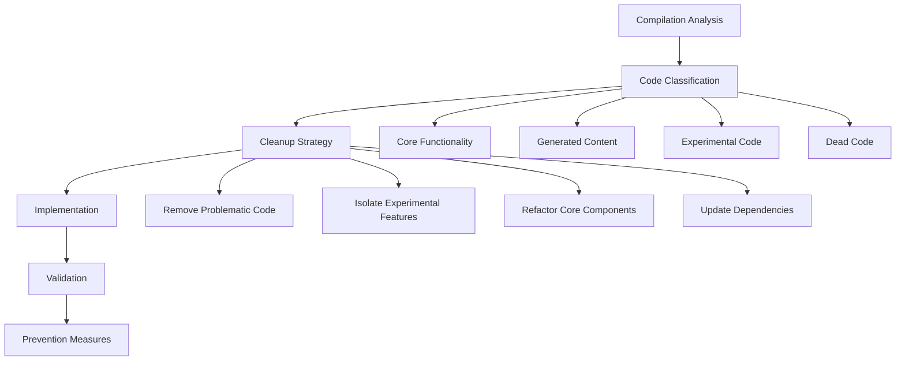

# Design Document

## Overview

This design addresses the compilation failures in the Parseltongue codebase by implementing a systematic cleanup approach that removes problematic generated content, isolates experimental code, and establishes maintainable build processes. The solution focuses on restoring compilation while preserving valuable functionality and preventing future build regressions.

## Architecture

The cleanup strategy follows a layered approach:



### Core Principles

1. **Minimal Disruption**: Preserve working functionality while removing problematic code
2. **Incremental Cleanup**: Address issues in small, verifiable steps
3. **Future Prevention**: Establish processes to prevent similar issues
4. **Maintainability**: Ensure changes support long-term codebase health

## Components and Interfaces

### 1. Compilation Diagnostics Module

**Purpose**: Analyze and categorize compilation errors

**Interface**:
```rust
pub trait CompilationAnalyzer {
    fn analyze_errors(&self) -> Result<ErrorReport, AnalysisError>;
    fn categorize_issues(&self, errors: &[CompilationError]) -> IssueCategories;
    fn suggest_fixes(&self, categories: &IssueCategories) -> Vec<FixSuggestion>;
}

pub struct ErrorReport {
    pub compilation_errors: Vec<CompilationError>,
    pub warning_count: usize,
    pub affected_modules: Vec<ModulePath>,
}

pub struct IssueCategories {
    pub generated_content_issues: Vec<GeneratedContentIssue>,
    pub experimental_code_issues: Vec<ExperimentalCodeIssue>,
    pub dependency_issues: Vec<DependencyIssue>,
    pub dead_code_issues: Vec<DeadCodeIssue>,
}
```

### 2. Code Classification System

**Purpose**: Identify different types of code and their cleanup requirements

**Interface**:
```rust
pub trait CodeClassifier {
    fn classify_file(&self, path: &Path) -> CodeClassification;
    fn identify_generated_content(&self, content: &str) -> Vec<GeneratedSection>;
    fn detect_experimental_markers(&self, content: &str) -> Vec<ExperimentalMarker>;
}

pub enum CodeClassification {
    CoreFunctionality,
    GeneratedContent { generator: String, safe_to_remove: bool },
    ExperimentalCode { feature_flag: Option<String> },
    DeadCode { last_used: Option<DateTime<Utc>> },
    TestCode,
}
```

### 3. Cleanup Orchestrator

**Purpose**: Coordinate the cleanup process with safety checks

**Interface**:
```rust
pub trait CleanupOrchestrator {
    async fn execute_cleanup_plan(&self, plan: &CleanupPlan) -> Result<CleanupResult, CleanupError>;
    fn create_backup(&self) -> Result<BackupId, BackupError>;
    fn validate_cleanup(&self, result: &CleanupResult) -> ValidationResult;
    fn rollback_if_needed(&self, backup_id: BackupId) -> Result<(), RollbackError>;
}

pub struct CleanupPlan {
    pub files_to_remove: Vec<PathBuf>,
    pub files_to_modify: Vec<FileModification>,
    pub dependencies_to_update: Vec<DependencyUpdate>,
    pub feature_flags_to_add: Vec<FeatureFlag>,
}
```

### 4. Build Validation System

**Purpose**: Ensure cleanup doesn't break functionality

**Interface**:
```rust
pub trait BuildValidator {
    async fn validate_compilation(&self) -> Result<CompilationResult, ValidationError>;
    async fn run_test_suite(&self) -> Result<TestResult, ValidationError>;
    async fn check_performance_regression(&self) -> Result<PerformanceResult, ValidationError>;
}

pub struct CompilationResult {
    pub success: bool,
    pub warnings: Vec<Warning>,
    pub build_time: Duration,
}
```

## Data Models

### Core Data Structures

```rust
#[derive(Debug, Clone, PartialEq)]
pub struct CompilationError {
    pub file_path: PathBuf,
    pub line_number: u32,
    pub column: u32,
    pub error_code: String,
    pub message: String,
    pub severity: ErrorSeverity,
}

#[derive(Debug, Clone)]
pub struct GeneratedContentIssue {
    pub file_path: PathBuf,
    pub content_range: Range<usize>,
    pub generator_signature: String,
    pub interference_type: InterferenceType,
}

#[derive(Debug, Clone)]
pub struct FileModification {
    pub path: PathBuf,
    pub modification_type: ModificationType,
    pub content_changes: Vec<ContentChange>,
}

#[derive(Debug, Clone)]
pub enum ModificationType {
    RemoveGeneratedContent,
    AddFeatureFlag { flag_name: String },
    RefactorCode { reason: String },
    UpdateImports,
}
```

### Configuration Models

```rust
#[derive(Debug, Deserialize)]
pub struct CleanupConfig {
    pub preserve_patterns: Vec<String>,
    pub experimental_feature_prefix: String,
    pub backup_directory: PathBuf,
    pub validation_timeout: Duration,
}

#[derive(Debug, Deserialize)]
pub struct BuildConfig {
    pub target_features: Vec<String>,
    pub test_timeout: Duration,
    pub performance_thresholds: PerformanceThresholds,
}
```

## Error Handling

### Error Hierarchy

```rust
#[derive(Error, Debug)]
pub enum CleanupError {
    #[error("Compilation analysis failed: {0}")]
    AnalysisFailed(#[from] AnalysisError),
    
    #[error("File operation failed: {path} - {cause}")]
    FileOperationFailed { path: PathBuf, cause: String },
    
    #[error("Backup creation failed: {0}")]
    BackupFailed(#[from] BackupError),
    
    #[error("Validation failed: {0}")]
    ValidationFailed(#[from] ValidationError),
    
    #[error("Rollback required but failed: {0}")]
    RollbackFailed(String),
}

#[derive(Error, Debug)]
pub enum ValidationError {
    #[error("Compilation still failing after cleanup")]
    CompilationStillFailing,
    
    #[error("Test failures introduced: {count} tests failing")]
    TestFailures { count: usize },
    
    #[error("Performance regression detected: {metric} degraded by {percentage}%")]
    PerformanceRegression { metric: String, percentage: f64 },
}
```

## Testing Strategy

### Unit Testing Approach

1. **Compilation Analysis Tests**
   - Test error parsing and categorization
   - Validate fix suggestion generation
   - Test edge cases in error detection

2. **Code Classification Tests**
   - Test generated content detection
   - Validate experimental code identification
   - Test classification accuracy

3. **Cleanup Operation Tests**
   - Test file modification operations
   - Validate backup and rollback functionality
   - Test cleanup plan execution

### Integration Testing Approach

1. **End-to-End Cleanup Tests**
   - Test complete cleanup workflow
   - Validate compilation success after cleanup
   - Test rollback scenarios

2. **Build Validation Tests**
   - Test compilation validation
   - Test suite execution validation
   - Performance regression detection

### Property-Based Testing

```rust
proptest! {
    #[test]
    fn cleanup_preserves_functionality(
        original_code in valid_rust_code_strategy(),
        generated_content in generated_content_strategy()
    ) {
        let mixed_code = inject_generated_content(original_code, generated_content);
        let cleaned_code = cleanup_generated_content(mixed_code);
        
        // Property: Cleanup should preserve original functionality
        prop_assert!(compiles_successfully(cleaned_code));
        prop_assert!(preserves_behavior(original_code, cleaned_code));
    }
}
```

### Performance Testing

```rust
#[tokio::test]
async fn test_cleanup_performance_contract() {
    let large_codebase = create_test_codebase_with_issues(1000).await;
    
    let start = Instant::now();
    let result = execute_cleanup(&large_codebase).await.unwrap();
    let elapsed = start.elapsed();
    
    // Performance contract: Cleanup should complete within reasonable time
    assert!(elapsed < Duration::from_secs(30), 
            "Cleanup took {:?}, expected <30s", elapsed);
    assert!(result.compilation_success);
}
```

## Implementation Phases

### Phase 1: Analysis and Planning
- Implement compilation error analysis
- Develop code classification system
- Create cleanup planning logic

### Phase 2: Safe Cleanup Operations
- Implement backup and rollback mechanisms
- Develop file modification operations
- Create validation systems

### Phase 3: Automation and Prevention
- Implement automated cleanup workflows
- Create CI integration for build validation
- Establish code quality gates

### Phase 4: Monitoring and Maintenance
- Implement cleanup metrics collection
- Create maintenance dashboards
- Establish ongoing cleanup processes