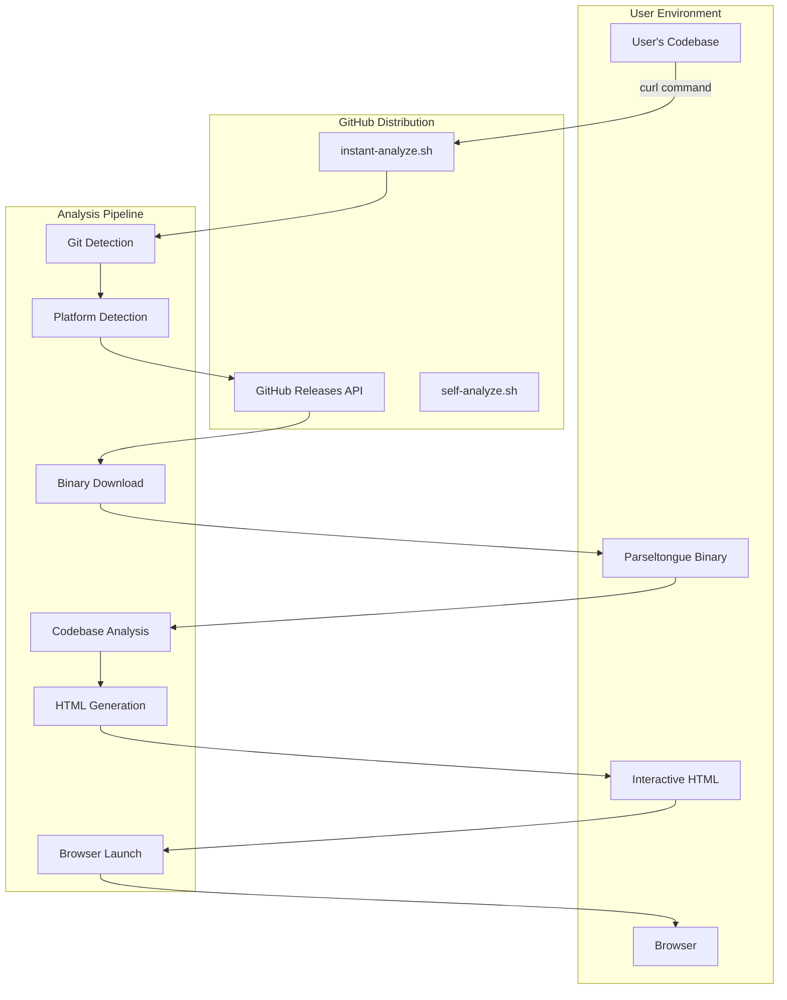
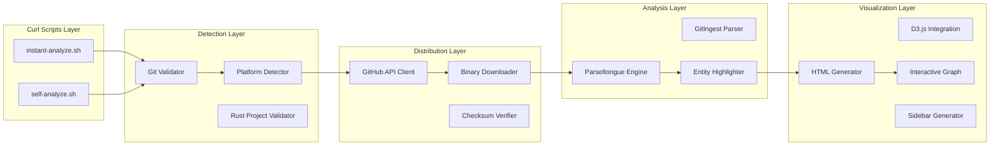
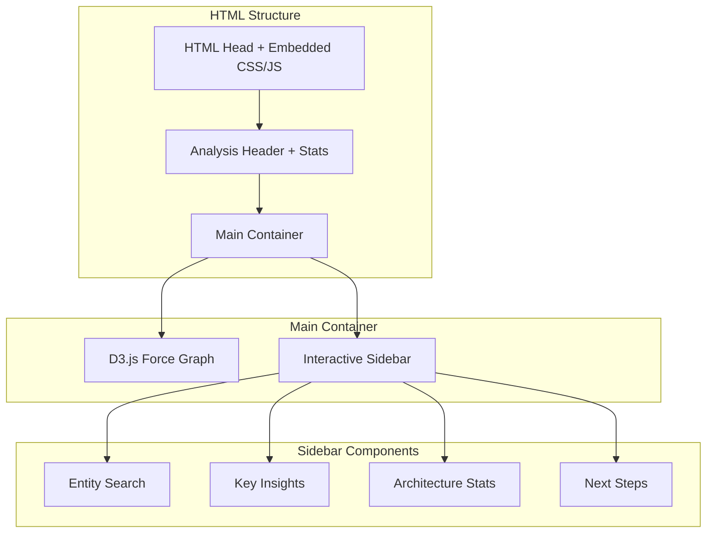
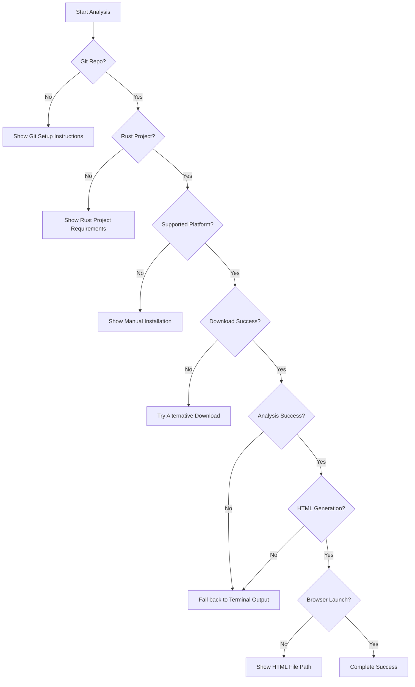

# Design Document: Instant Onboarding Experience

## Overview

The Instant Onboarding Experience creates a "curl moment" for parseltongue adoption by providing immediate visual architectural insights through GitHub-hosted scripts. This design addresses two distinct user segments with different time constraints and jobs-to-be-done:

1. **Tool Users**: Developers evaluating parseltongue for their codebases (2-minute visual wow)
2. **Tool Contributors**: Developers wanting to contribute to parseltongue itself (60-second architecture understanding)

The solution transforms the traditional 20+ minute onboarding process into a 2-minute visual experience that opens an interactive HTML architecture map in the user's browser.

## Architecture

### High-Level System Architecture



### Component Architecture



## Components and Interfaces

### 1. GitHub-Hosted Curl Scripts

#### instant-analyze.sh
**Purpose**: Entry point for tool users analyzing their own codebases
**Interface**:
```bash
# Standard usage
curl -sSL https://raw.githubusercontent.com/user/parseltongue/main/scripts/instant-analyze.sh | bash

# GitIngest format
curl -sSL https://raw.githubusercontent.com/user/parseltongue/main/scripts/instant-analyze.sh | bash -s -- --gitingest mycode.txt
```

**Responsibilities**:
- Git repository detection and validation
- Rust project validation
- Platform detection (macOS Intel/ARM, Linux x86_64)
- Binary download orchestration
- Analysis execution
- HTML generation and browser launch
- Cleanup management

#### self-analyze.sh
**Purpose**: Entry point for contributors analyzing parseltongue itself
**Interface**:
```bash
curl -sSL https://raw.githubusercontent.com/user/parseltongue/main/scripts/self-analyze.sh | bash
```

**Responsibilities**:
- Parseltongue repository detection
- Contributor-focused analysis configuration
- Architecture visualization with contribution opportunities
- Development setup guidance

### 2. Platform Detection Module

**Interface**:
```bash
detect_platform() -> (os_type, arch_type, binary_name)
```

**Supported Platforms**:
- Linux x86_64: `parseltongue-linux-x86_64`
- macOS Intel: `parseltongue-macos-intel`
- macOS ARM: `parseltongue-macos-arm64`

**Design Rationale**: Focus on primary developer platforms (macOS/Linux) to maximize adoption while keeping complexity manageable.

### 3. GitHub API Integration

**Interface**:
```bash
get_latest_release() -> release_info
download_binary(platform, target_dir) -> binary_path
verify_checksum(binary_path, expected_checksum) -> bool
```

**Design Decisions**:
- Use GitHub's public API (no authentication required)
- Implement retry logic for network failures
- Verify binary integrity with checksums
- Handle rate limiting gracefully

### 4. Analysis Engine Integration

**Interface**:
```bash
parseltongue analyze --output-format html --instant-mode [--self-analysis] <target>
```

**New Command Line Options**:
- `--output-format html`: Generate self-contained HTML visualization
- `--instant-mode`: Optimize for speed over completeness
- `--self-analysis`: Enable contributor-focused analysis mode

**Design Rationale**: Extend existing parseltongue CLI rather than creating separate tools to maintain consistency and leverage existing analysis capabilities.

### 5. Interactive HTML Generator

**Architecture**:


**Interface**:
```rust
pub struct HtmlGenerator {
    pub fn generate_interactive_html(
        analysis_result: &AnalysisResult,
        mode: VisualizationMode,
    ) -> Result<String, HtmlGenerationError>
}

pub enum VisualizationMode {
    ToolUser,
    Contributor,
}
```

## Data Models

### Analysis Result Structure

```rust
#[derive(Debug, Serialize)]
pub struct InstantAnalysisResult {
    pub metadata: AnalysisMetadata,
    pub entities: Vec<EntityInfo>,
    pub relationships: Vec<RelationshipInfo>,
    pub key_insights: KeyInsights,
    pub architecture_patterns: Vec<ArchitecturePattern>,
}

#[derive(Debug, Serialize)]
pub struct AnalysisMetadata {
    pub codebase_name: String,
    pub analysis_duration: Duration,
    pub file_count: usize,
    pub entity_count: usize,
    pub relationship_count: usize,
    pub analysis_mode: AnalysisMode,
}

#[derive(Debug, Serialize)]
pub struct EntityInfo {
    pub id: String,
    pub name: String,
    pub entity_type: EntityType,
    pub file_path: String,
    pub line_number: Option<usize>,
    pub relationship_count: usize,
    pub centrality_score: f64,
    pub is_key_entity: bool,
}

#[derive(Debug, Serialize)]
pub struct KeyInsights {
    pub entry_points: Vec<EntityInfo>,
    pub most_connected: Vec<EntityInfo>,
    pub architecture_patterns: Vec<String>,
    pub contribution_opportunities: Option<Vec<ContributionOpportunity>>,
}

#[derive(Debug, Serialize)]
pub struct ContributionOpportunity {
    pub area: String,
    pub description: String,
    pub file_path: String,
    pub difficulty: ContributionDifficulty,
}
```

### HTML Visualization Data

```typescript
interface VisualizationData {
    nodes: Node[];
    links: Link[];
    metadata: AnalysisMetadata;
    insights: KeyInsights;
}

interface Node {
    id: string;
    name: string;
    type: EntityType;
    size: number;
    color: string;
    filePath: string;
    relationshipCount: number;
    isKeyEntity: boolean;
}

interface Link {
    source: string;
    target: string;
    type: RelationshipType;
    strength: number;
}
```

## Error Handling

### Comprehensive Error Hierarchy

```rust
#[derive(Error, Debug)]
pub enum InstantOnboardingError {
    #[error("Git repository not found in current directory")]
    NoGitRepository,
    
    #[error("Not a Rust project: {reason}")]
    NotRustProject { reason: String },
    
    #[error("Unsupported platform: {platform}")]
    UnsupportedPlatform { platform: String },
    
    #[error("GitHub API error: {status} - {message}")]
    GitHubApi { status: u16, message: String },
    
    #[error("Binary download failed: {url} - {cause}")]
    DownloadFailed { url: String, cause: String },
    
    #[error("Checksum verification failed: expected {expected}, got {actual}")]
    ChecksumMismatch { expected: String, actual: String },
    
    #[error("Analysis failed: {cause}")]
    AnalysisFailed { cause: String },
    
    #[error("HTML generation failed: {cause}")]
    HtmlGenerationFailed { cause: String },
    
    #[error("Browser launch failed: {cause}")]
    BrowserLaunchFailed { cause: String },
    
    #[error("GitIngest parsing failed: {line} - {cause}")]
    GitIngestParsing { line: usize, cause: String },
}
```

### Error Recovery Strategies



## Testing Strategy

### Test Categories

#### 1. Unit Tests
```rust
#[cfg(test)]
mod tests {
    use super::*;
    
    #[test]
    fn test_platform_detection() {
        // Test platform detection logic
    }
    
    #[test]
    fn test_github_api_parsing() {
        // Test GitHub API response parsing
    }
    
    #[test]
    fn test_html_generation() {
        // Test HTML generation with mock data
    }
    
    #[tokio::test]
    async fn test_gitingest_parsing() {
        // Test GitIngest format parsing
    }
}
```

#### 2. Integration Tests
```rust
#[tokio::test]
async fn test_end_to_end_analysis() {
    // Test complete analysis pipeline with test repository
}

#[tokio::test]
async fn test_github_api_integration() {
    // Test actual GitHub API calls (with rate limiting)
}

#[test]
fn test_cross_platform_compatibility() {
    // Test platform detection and binary selection
}
```

#### 3. Performance Tests
```rust
#[tokio::test]
async fn test_analysis_speed_contract() {
    let start = Instant::now();
    let result = run_instant_analysis(test_codebase).await.unwrap();
    let elapsed = start.elapsed();
    
    // Tool users: <2 minutes
    assert!(elapsed < Duration::from_secs(120));
    
    // Contributors: <60 seconds for self-analysis
    if result.mode == AnalysisMode::SelfAnalysis {
        assert!(elapsed < Duration::from_secs(60));
    }
}
```

#### 4. Browser Compatibility Tests
```javascript
// Test HTML compatibility across browsers
describe('Interactive Visualization', () => {
    test('D3.js graph renders correctly', () => {
        // Test graph rendering
    });
    
    test('Sidebar interactions work', () => {
        // Test search, filtering, navigation
    });
    
    test('Responsive design works', () => {
        // Test different screen sizes
    });
});
```

### Test Data Strategy

```rust
pub struct TestDataGenerator;

impl TestDataGenerator {
    pub fn create_test_rust_project() -> TempDir {
        // Generate realistic Rust project structure
    }
    
    pub fn create_gitingest_file() -> String {
        // Generate GitIngest format test data
    }
    
    pub fn create_parseltongue_self_analysis() -> AnalysisResult {
        // Generate self-analysis test data
    }
}
```

## Implementation Phases

### Phase 1: Core Infrastructure (Week 1-2)
**Goal**: Basic curl script functionality with binary download

**Components**:
- Platform detection logic
- GitHub API integration
- Binary download and verification
- Basic error handling and fallbacks

**Success Criteria**:
- Scripts successfully download correct binary for platform
- Graceful handling of network failures
- Clear error messages for unsupported scenarios

### Phase 2: Analysis Integration (Week 3-4)
**Goal**: Integration with parseltongue analysis engine

**Components**:
- CLI flag additions (`--output-format html`, `--instant-mode`)
- Git repository validation
- Rust project detection
- GitIngest format parsing
- Basic HTML output generation

**Success Criteria**:
- Analysis completes within time constraints
- HTML output contains structured data
- GitIngest format properly parsed

### Phase 3: Interactive Visualization (Week 5-6)
**Goal**: Rich HTML visualization with D3.js

**Components**:
- Self-contained HTML with embedded D3.js
- Force-directed graph layout
- Interactive sidebar with search and insights
- Entity highlighting and categorization
- Browser auto-launch functionality

**Success Criteria**:
- Interactive graph renders correctly across browsers
- Visual "wow factor" achieved
- Performance meets user experience goals

### Phase 4: Polish and Optimization (Week 7-8)
**Goal**: Production-ready experience with comprehensive testing

**Components**:
- Cross-platform testing and refinement
- Performance optimization for large codebases
- Comprehensive error handling
- Documentation and examples
- Contributor-focused self-analysis mode

**Success Criteria**:
- All test scenarios pass
- Performance contracts met
- User feedback validates "wow factor"
- Ready for public release

## Design Decisions and Rationales

### 1. GitHub-Hosted Distribution
**Decision**: Use GitHub raw URLs instead of custom domain
**Rationale**: 
- Zero infrastructure cost and maintenance
- Leverages existing GitHub reliability
- Familiar pattern for developers
- Automatic HTTPS and global CDN

### 2. Self-Contained HTML Output
**Decision**: Embed all dependencies (D3.js, CSS) in single HTML file
**Rationale**:
- Works offline after generation
- Easy to share with team members
- No external dependencies or CDN failures
- Consistent experience across environments

### 3. Platform-Specific Binaries
**Decision**: Pre-built binaries for macOS/Linux only
**Rationale**:
- Target primary developer platforms
- Avoid Windows complexity for MVP
- Faster download and execution
- Consistent user experience

### 4. Force-Directed Graph Visualization
**Decision**: Use D3.js force-directed layout for architecture map
**Rationale**:
- Intuitive representation of relationships
- Interactive exploration capabilities
- Proven pattern for code visualization
- Scales well with entity count

### 5. Dual-Mode Analysis
**Decision**: Separate modes for tool users vs contributors
**Rationale**:
- Different time constraints (2min vs 60sec)
- Different information needs
- Tailored insights and next steps
- Optimized user experience per segment

### 6. GitIngest Format Support
**Decision**: Support GitIngest as alternative input method
**Rationale**:
- Enables analysis without Git repository
- Supports shared code samples
- Flexible input for various workflows
- Maintains same visual output quality

### 7. Instant Mode Optimization
**Decision**: Trade analysis completeness for speed
**Rationale**:
- Prioritize "wow factor" over comprehensive analysis
- Users can run full analysis after being convinced
- Focus on architectural insights, not exhaustive details
- Maintain confidence-building accuracy

## Security Considerations

### 1. Binary Verification
- Checksum validation for all downloaded binaries
- HTTPS-only downloads from GitHub
- Clear error messages for verification failures

### 2. Input Validation
- Git repository validation before analysis
- File size limits for GitIngest format
- Sanitization of user-provided paths

### 3. Execution Safety
- No arbitrary code execution from downloaded content
- Temporary file cleanup after analysis
- Clear permission requirements for binary execution

### 4. Privacy Protection
- No data transmission to external services
- Local-only analysis and HTML generation
- User control over generated file sharing

## Performance Contracts

### Time Constraints
- **Tool Users**: Complete analysis and browser launch <2 minutes
- **Contributors**: Self-analysis and visualization <60 seconds
- **HTML Generation**: <10 seconds for typical codebase
- **Binary Download**: <30 seconds on typical connection

### Resource Limits
- **Memory Usage**: <500MB during analysis
- **Disk Usage**: <100MB for binary and temporary files
- **HTML File Size**: <5MB for self-contained visualization
- **GitIngest Support**: Files up to 50MB

### Scalability Targets
- **Codebase Size**: Up to 1000 Rust files
- **Entity Count**: Up to 10,000 entities in visualization
- **Relationship Count**: Up to 50,000 relationships
- **Browser Performance**: Smooth interaction with 500+ nodes

## Success Metrics

### Primary Metrics
- **Time-to-Visual-Wow**: <2 minutes from curl to browser opening
- **Exploration Engagement**: >3 minutes spent in HTML visualization
- **Conversion Rate**: >30% proceed to full onboarding after instant analysis
- **Cross-Platform Success**: >95% success rate on macOS/Linux

### Quality Metrics
- **Analysis Accuracy**: Correctly identifies key architectural patterns
- **Visual Impact**: Users report "impressive" or "wow" reactions
- **Sharing Behavior**: >20% share generated HTML with team members
- **Error Recovery**: <5% of users encounter unrecoverable errors

### Technical Metrics
- **Performance Compliance**: 100% of analyses meet time constraints
- **Browser Compatibility**: Works in Chrome, Firefox, Safari
- **Platform Coverage**: Supports all target platforms
- **Reliability**: <1% failure rate for supported scenarios