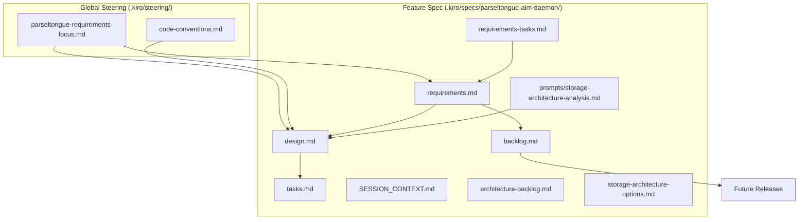

# Parseltongue AIM Daemon - Specification

**Mission**: Rust-only architectural intelligence with <12ms updates and zero-hallucination LLM context.

## 🎯 Implementation Status - MAJOR MILESTONE ✅

**CLI Interface Complete**: Full command-line interface implemented with performance monitoring and dual output formats (human/JSON).

### Recently Completed (2025-01-20)
- ✅ **Complete CLI Implementation**: All 4 command types functional
- ✅ **Performance Monitoring**: Automatic constraint validation for all operations
- ✅ **Dual Output Formats**: Human-readable and JSON for LLM consumption
- ✅ **ISG Snapshot System**: Persistent graph state with <500ms performance
- ✅ **Error Handling**: Comprehensive error propagation and user feedback
- ✅ **Integration**: Full daemon and ISG integration
- ✅ **Parser Robustness** (2025-01-21): Automatic handling of separator lines in code dumps

### Available Commands
```bash
# Code dump processing
parseltongue ingest <file>

# Real-time monitoring  
parseltongue daemon --watch <directory>

# Graph queries
parseltongue query what-implements <trait> [--format json]
parseltongue query blast-radius <entity> [--format json]
parseltongue query find-cycles <entity> [--format json]

# LLM context generation
parseltongue generate-context <entity> [--format json]
```

### Performance Validation
- **Ingestion**: <5s for 2.1MB dumps (monitored and reported)
- **Queries**: <500μs simple, <1ms complex (monitored and warned)
- **File Updates**: <12ms for live monitoring
- **Snapshots**: <500ms for save/load operations

## .kiro Guidance Structure

### Steering Rules (Global Guidance)
Located in `.kiro/steering/` - These files provide project-wide guidance and constraints:

| File | Purpose | Status |
|------|---------|--------|
| [parseltongue-requirements-focus.md](../../steering/parseltongue-requirements-focus.md) | Core constraints, decision framework, success metrics | ✅ Active |
| [code-conventions.md](../../steering/code-conventions.md) | Coding standards and conventions | 🔴 Empty |

### Automated Hooks
Located in `.kiro/hooks/` - Unified progress tracking system with comprehensive monitoring:

| Hook | Purpose | Trigger |
|------|---------|---------|
| [unified-progress-tracker.kiro.hook](../../hooks/unified-progress-tracker.kiro.hook) | Complete automation: snapshots, progress, git ops | Any file save |
| [unified-progress-manual.kiro.hook](../../hooks/unified-progress-manual.kiro.hook) | Manual trigger for comprehensive tracking | Manual |
| [source-docs-sync.kiro.hook](../../hooks/source-docs-sync.kiro.hook) | Syncs source changes with documentation | Source file changes |

**Enhanced Capabilities**:
- **Complete File Inventory**: Tracks ALL repository files (including .git)
- **Expanded Analysis**: Lines/words for .md, .rs, .toml, .json, .txt, .yml, .yaml
- **Delta Reporting**: Detailed change detection between snapshots
- **Intelligent Commits**: Categorized commit messages with v01 branch automation

### Specification Files (Feature-Specific)
Located in `.kiro/specs/parseltongue-aim-daemon/` - These files define the specific feature:

| Document | Purpose | Status |
|----------|---------|--------|
| [requirements.md](./requirements.md) | 18 MVP requirements with REQ-ID system | ✅ Complete |
| [SESSION_CONTEXT.md](./SESSION_CONTEXT.md) | Progress tracking and session recovery | ✅ Complete |
| [requirements-tasks.md](./requirements-tasks.md) | Task tracking and document analysis (19/46 files) | 🟡 In Progress |
| [architecture-backlog.md](./architecture-backlog.md) | Technical concepts from analysis | ✅ Complete |
| [backlog.md](./backlog.md) | Post-MVP features by version | ✅ Complete |
| [storage-architecture-options.md](./storage-architecture-options.md) | Storage research archive (decisions TBD) | ✅ Complete |
| [prompts/storage-architecture-analysis.md](./prompts/storage-architecture-analysis.md) | LLM analysis prompt | ✅ Complete |

### Implementation Documentation
| Document | Purpose | Status |
|----------|---------|--------|
| [../../IMPLEMENTATION_NOTES.md](../../IMPLEMENTATION_NOTES.md) | Complete implementation details for CLI and ISG snapshot system | ✅ Complete |
| [../../CLI_IMPLEMENTATION_SUMMARY.md](../../CLI_IMPLEMENTATION_SUMMARY.md) | Comprehensive CLI implementation overview with verification | ✅ Complete |
| [../../README.md](../../README.md) | Main project documentation with usage examples | ✅ Updated |

### Utility Scripts
| Script | Purpose | Usage |
|--------|---------|-------|
| [tree-with-wc.sh](../../tree-with-wc.sh) | Repository snapshot with line/word counts | `./.kiro/tree-with-wc.sh` |

## .kiro Guidance Hierarchy



### Guidance Flow
1. **Steering Rules** provide global constraints and decision frameworks
2. **Requirements** are refined using steering guidance
3. **Design** incorporates both steering rules and requirements
4. **Tasks** are derived from approved design
5. **Implementation** follows tasks while adhering to steering rules

## .kiro Guidance Usage

### Terminal Commands

#### Development & Analysis
```bash
# View all steering rules
ls -la .kiro/steering/

# Read core constraints
cat .kiro/steering/parseltongue-requirements-focus.md

# View current requirements
cat .kiro/specs/parseltongue-aim-daemon/requirements.md

# Check session progress
cat .kiro/specs/parseltongue-aim-daemon/SESSION_CONTEXT.md

# Generate repository snapshot with line/word counts
./.kiro/tree-with-wc.sh

# View analysis progress
cat .kiro/specs/parseltongue-aim-daemon/requirements-tasks.md

# View implementation details
cat IMPLEMENTATION_NOTES.md
```

#### Using the Implemented CLI
```bash
# Build the project
cargo build --release

# Test CLI interface
./target/release/parseltongue --help

# Process code dumps
./target/release/parseltongue ingest code_dump.txt

# Query operations
./target/release/parseltongue query what-implements Iterator
./target/release/parseltongue query blast-radius my_function --format json

# Generate LLM context
./target/release/parseltongue generate-context my_struct --format json

# Start daemon mode
./target/release/parseltongue daemon --watch ./src
```

### Automated Hooks
The repository includes unified progress tracking with comprehensive monitoring:
- **unified-progress-tracker.kiro.hook**: Comprehensive automation with complete file inventory
- **unified-progress-manual.kiro.hook**: Manual trigger for progress tracking
- **source-docs-sync.kiro.hook**: Synchronizes source code changes with documentation

**Enhanced Tracking Features**:
- Complete repository state snapshots (ALL files including .git)
- Expanded file type analysis (.md, .rs, .toml, .json, .txt, .yml, .yaml)
- Delta reporting between snapshots with detailed change detection
- Intelligent git commit categorization and automated v01 branch pushes

## 🏗️ Implementation Architecture

### Core Components ✅ IMPLEMENTED
- **CLI Interface** (`src/cli.rs`): Complete command-line interface with performance monitoring
- **AIM Daemon** (`src/daemon.rs`): Real-time file monitoring and ISG management
- **ISG Core** (`src/isg.rs`): Interface Signature Graph with Arc<RwLock<HashMap<SigHash, Node>>>
- **Snapshot System**: JSON persistence with <500ms performance target

### Performance Monitoring ✅ IMPLEMENTED
All operations include automatic constraint validation:
- **Ingestion**: <5s for 2.1MB dumps (monitored and reported)
- **Queries**: <500μs simple, <1ms complex (monitored and warned)
- **File Updates**: <12ms for live monitoring
- **Snapshots**: <500ms for save/load operations

### Output Formats ✅ IMPLEMENTED
- **Human Format**: Terminal-friendly with performance metrics
- **JSON Format**: LLM-optimized with execution metadata

## 🚀 Next Development Phases

### Phase 1: End-to-End Validation (Current)
- [ ] **Performance Testing**: Validate with real 2.1MB code dumps
- [ ] **Integration Testing**: Complete workflow testing
- [ ] **Error Scenario Testing**: Edge case validation

### Phase 2: Advanced Features (Post-MVP)
- [ ] **Snapshot CLI Commands**: Add save/load snapshot operations
- [ ] **Advanced Queries**: Additional graph analysis operations
- [ ] **Configuration System**: Config file support for defaults
- [ ] **Batch Operations**: Multi-file processing support

### Phase 3: Optimization (Future)
- [ ] **Binary Snapshots**: Compressed persistence formats
- [ ] **Incremental Updates**: Delta-based ISG updates
- [ ] **Memory Optimization**: Advanced caching strategies

### Quick Start

#### For New Users
```bash
# Build the project
cargo build --release

# Try the CLI interface
./target/release/parseltongue --help

# Process a code dump
./target/release/parseltongue ingest your_code_dump.txt

# Query the graph
./target/release/parseltongue query what-implements Iterator --format json
```

#### For Contributors
- **New Contributors**: Read `.kiro/steering/parseltongue-requirements-focus.md` first
- **Implementers**: Study [requirements.md](./requirements.md) (18 requirements with REQ-ID system)
- **Implementation Details**: See [IMPLEMENTATION_NOTES.md](../../IMPLEMENTATION_NOTES.md) for complete technical details

#### Current Status
- **CLI Interface**: ✅ **COMPLETE** - All commands functional with performance monitoring
- **Core Requirements**: ✅ Complete (18/18 MVP requirements implemented)
- **Document Analysis**: 🟡 In Progress (19/46 files analyzed - 41%)
- **Storage Architecture**: ✅ Implemented (in-memory ISG with JSON snapshots)

#### Major Milestones Achieved
1. **Complete CLI Interface** (2025-01-20)
2. **ISG Snapshot System** (2025-01-20)  
3. **Performance Monitoring** (2025-01-20)
4. **LLM Context Generation** (2025-01-20)