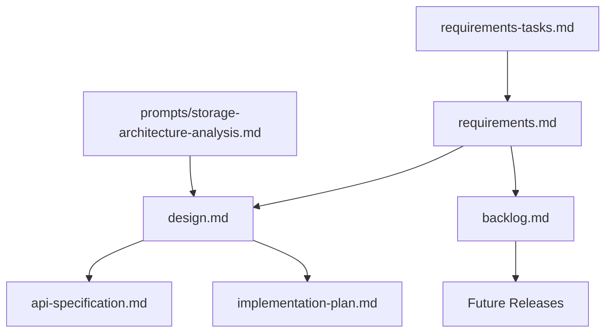

# Parseltongue AIM Daemon - Specification Documentation

## Overview

This directory contains the complete specification for Parseltongue AIM Daemon, a revolutionary Rust-only development tool that transforms code analysis from probabilistic text searches to deterministic, graph-based architectural navigation.

**Core Mission**: Enable sub-millisecond architectural queries and zero-hallucination LLM context generation through Interface Signature Graphs (ISG).

## Table of Contents

### 📋 Core Specification Documents

| Document | Purpose | Status | Last Updated |
|----------|---------|--------|--------------|
| [requirements.md](./requirements.md) | **MVP 1.0 Requirements** - 18 core requirements with detailed acceptance criteria | ✅ Complete | 2025-01-19 |
| [backlog.md](./backlog.md) | **Post-MVP Features** - Advanced features organized by release version | ✅ Complete | 2025-01-19 |
| [requirements-tasks.md](./requirements-tasks.md) | **Task Tracking** - Document analysis progress and quality gates | 🟡 In Progress | 2025-01-19 |

### 🎯 Analysis & Planning Documents

| Document | Purpose | Status | Description |
|----------|---------|--------|-------------|
| [prompts/storage-architecture-analysis.md](./prompts/storage-architecture-analysis.md) | **LLM Prompt** - Comprehensive storage options analysis | ✅ Complete | Evaluates SQLite, graph databases, hybrid approaches |

### 🏗️ Architecture & Design (Future)

| Document | Purpose | Status | Description |
|----------|---------|--------|-------------|
| `design.md` | **Technical Architecture** | 🔴 Pending | Detailed system design based on finalized requirements |
| `api-specification.md` | **API Design** | 🔴 Pending | CLI, HTTP, gRPC interface specifications |
| `implementation-plan.md` | **Development Roadmap** | 🔴 Pending | Phased implementation strategy with task breakdown |

## Document Relationships

## Key Constraints & Principles

### Core Constraints (Non-Negotiable)
- **Rust-Only Focus**: Exclusively designed for Rust codebases using `syn` crate
- **High-Speed Updates**: <12ms total pipeline latency from file save to query readiness
- **LLM-Terminal Integration**: Optimized for AI tools querying from terminal

### Success Metrics
- **Update Latency**: <12ms from file save to query readiness
- **Query Performance**: <500μs for simple graph traversals
- **Memory Efficiency**: <25MB for 100K LOC Rust codebase
- **Compression Ratio**: >95% from raw code to architectural essence

## Development Phases

### MVP 1.0 (Current Focus)
**Scope**: Core functionality with 18 requirements
- Basic Rust parsing with `syn` crate
- Simple file monitoring with `notify` crate
- Essential queries (who-implements, blast-radius, find-cycles)
- LLM context generation with basic compression
- CLI interface for terminal usage
- SQLite persistence with basic schema

### v1.5 (Performance & Usability)
**Scope**: Enhanced user experience
- Intelligent file discovery
- Code convention validation
- Performance optimizations for larger codebases
- Enhanced CLI with better UX

### v2.0 (Advanced Features)
**Scope**: Enterprise capabilities
- Advanced SigHash and verification
- Extensibility and plugin architecture
- Machine-readable export formats
- Property-based testing integration

### v3.0 (Enterprise Scale)
**Scope**: Distributed and advanced
- Multi-source input handling
- Distributed analysis capabilities
- Enterprise integration features
- Advanced graph databases

## Quality Gates

### Requirements Quality Gate ✅
**Status**: PASSED
- [x] All 18 requirements have detailed, measurable acceptance criteria
- [x] Performance targets are specific and testable
- [x] Rust-specific patterns and constraints are fully specified
- [x] LLM integration requirements are complete and actionable
- [x] All requirements align with core constraints

### Design Quality Gate 🔴
**Status**: PENDING
- [ ] Technical architecture addresses all requirements
- [ ] API specifications are complete and consistent
- [ ] Performance design meets all latency targets
- [ ] Concurrency and thread safety design is sound
- [ ] Error handling and resilience design is comprehensive

### Implementation Quality Gate 🔴
**Status**: PENDING
- [ ] All core requirements are implemented and tested
- [ ] Performance targets are met in benchmarks
- [ ] Error handling works as specified
- [ ] API is stable and documented
- [ ] System is production-ready for initial users

## Contributing Guidelines

### Document Updates
1. **Requirements Changes**: Must maintain MVP 1.0 scope, advanced features go to backlog
2. **Design Decisions**: Document rationale and trade-offs
3. **Performance Targets**: Include specific measurements and benchmarks
4. **Rust Integration**: Ensure all solutions leverage Rust ecosystem

### Review Process
1. **Technical Review**: Validate against core constraints
2. **Performance Review**: Verify latency and memory targets
3. **Simplicity Review**: Ensure solutions follow code conventions
4. **Integration Review**: Check LLM-terminal optimization

## Quick Start

### For Reviewers
1. Start with [requirements.md](./requirements.md) for complete MVP scope
2. Check [backlog.md](./backlog.md) for post-MVP features
3. Review [requirements-tasks.md](./requirements-tasks.md) for current progress

### For Implementers
1. Understand requirements and constraints in [requirements.md](./requirements.md)
2. Wait for design.md completion (pending requirements approval)
3. Follow implementation plan when available

### For Architects
1. Use [prompts/storage-architecture-analysis.md](./prompts/storage-architecture-analysis.md) for storage decisions
2. Contribute to design.md based on requirements
3. Validate all decisions against performance targets

## Contact & Support

- **Specification Questions**: Review requirements.md and backlog.md
- **Technical Decisions**: Use provided LLM prompts for analysis
- **Implementation Guidance**: Follow code conventions and performance targets

---

**Last Updated**: 2025-01-19  
**Version**: MVP 1.0 Specification  
**Status**: Requirements Complete, Design Pending