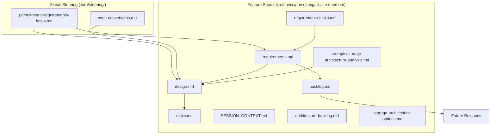

# Parseltongue AIM Daemon - Specification

**Mission**: Rust-only architectural intelligence with <12ms updates and zero-hallucination LLM context.

## .kiro Guidance Structure

### Steering Rules (Global Guidance)
Located in `.kiro/steering/` - These files provide project-wide guidance and constraints:

| File | Purpose | Status |
|------|---------|--------|
| [parseltongue-requirements-focus.md](../../steering/parseltongue-requirements-focus.md) | Core constraints, decision framework, success metrics | ✅ Active |
| [code-conventions.md](../../steering/code-conventions.md) | Coding standards and conventions | 🔴 Empty |

### Automated Hooks
Located in `.kiro/hooks/` - Unified progress tracking system with comprehensive monitoring:

| Hook | Purpose | Trigger |
|------|---------|---------|
| [unified-progress-tracker.kiro.hook](../../hooks/unified-progress-tracker.kiro.hook) | Complete automation: snapshots, progress, git ops | Any file save |
| [unified-progress-manual.kiro.hook](../../hooks/unified-progress-manual.kiro.hook) | Manual trigger for comprehensive tracking | Manual |
| [source-docs-sync.kiro.hook](../../hooks/source-docs-sync.kiro.hook) | Syncs source changes with documentation | Source file changes |

**Enhanced Capabilities**:
- **Complete File Inventory**: Tracks ALL repository files (including .git)
- **Expanded Analysis**: Lines/words for .md, .rs, .toml, .json, .txt, .yml, .yaml
- **Delta Reporting**: Detailed change detection between snapshots
- **Intelligent Commits**: Categorized commit messages with v01 branch automation

### Specification Files (Feature-Specific)
Located in `.kiro/specs/parseltongue-aim-daemon/` - These files define the specific feature:

| Document | Purpose | Status |
|----------|---------|--------|
| [requirements.md](./requirements.md) | 18 MVP requirements with REQ-ID system | ✅ Complete |
| [SESSION_CONTEXT.md](./SESSION_CONTEXT.md) | Progress tracking and session recovery | ✅ Complete |
| [requirements-tasks.md](./requirements-tasks.md) | Task tracking and document analysis (19/46 files) | 🟡 In Progress |
| [architecture-backlog.md](./architecture-backlog.md) | Technical concepts from analysis | ✅ Complete |
| [backlog.md](./backlog.md) | Post-MVP features by version | ✅ Complete |
| [storage-architecture-options.md](./storage-architecture-options.md) | Storage research archive (decisions TBD) | ✅ Complete |
| [prompts/storage-architecture-analysis.md](./prompts/storage-architecture-analysis.md) | LLM analysis prompt | ✅ Complete |

### Utility Scripts
| Script | Purpose | Usage |
|--------|---------|-------|
| [tree-with-wc.sh](../../tree-with-wc.sh) | Repository snapshot with line/word counts | `./.kiro/tree-with-wc.sh` |

## .kiro Guidance Hierarchy



### Guidance Flow
1. **Steering Rules** provide global constraints and decision frameworks
2. **Requirements** are refined using steering guidance
3. **Design** incorporates both steering rules and requirements
4. **Tasks** are derived from approved design
5. **Implementation** follows tasks while adhering to steering rules

## .kiro Guidance Usage

### Terminal Commands
```bash
# View all steering rules
ls -la .kiro/steering/

# Read core constraints
cat .kiro/steering/parseltongue-requirements-focus.md

# View current requirements
cat .kiro/specs/parseltongue-aim-daemon/requirements.md

# Check session progress
cat .kiro/specs/parseltongue-aim-daemon/SESSION_CONTEXT.md

# Generate repository snapshot with line/word counts
./.kiro/tree-with-wc.sh

# View analysis progress
cat .kiro/specs/parseltongue-aim-daemon/requirements-tasks.md
```

### Automated Hooks
The repository includes unified progress tracking with comprehensive monitoring:
- **unified-progress-tracker.kiro.hook**: Comprehensive automation with complete file inventory
- **unified-progress-manual.kiro.hook**: Manual trigger for progress tracking
- **source-docs-sync.kiro.hook**: Synchronizes source code changes with documentation

**Enhanced Tracking Features**:
- Complete repository state snapshots (ALL files including .git)
- Expanded file type analysis (.md, .rs, .toml, .json, .txt, .yml, .yaml)
- Delta reporting between snapshots with detailed change detection
- Intelligent git commit categorization and automated v01 branch pushes

### Quick Start
- **New Contributors**: Read `.kiro/steering/parseltongue-requirements-focus.md` first
- **Implementers**: Study [requirements.md](./requirements.md) (18 requirements with REQ-ID system)
- **Current Status**: Requirements complete, Task 1 document analysis 19/46 files complete (41%)
- **Storage Decisions**: Marked as TBD - see [storage-architecture-options.md](./storage-architecture-options.md)