# Parseltongue Architect v2.0 - Implementation Tasks

## Status: 90% Complete - Final 5 Tasks Remaining

The core Parseltongue Architect v2.0 system is functionally complete with all major features implemented. Only 5 critical tasks remain to achieve 100% completion.

### ✅ **Completed Features**
- High-accuracy relationship extraction with syn::visit::Visit
- O(1) performance architecture with FxHashMap indices
- Complete query engine (what-implements, blast-radius, calls, uses, find-cycles)
- Interactive HTML visualization with embedded JavaScript
- Real-time daemon with file monitoring
- CLI interface with all commands
- LLM context generation
- Debug tools and DOT export
- Two-pass ingestion with module-aware FQN generation
- Snapshot persistence

### 🔧 **Remaining Tasks**

- [ ] Fix compilation issues and dependency problems
  - Move dev-dependencies (rand, tempfile, chrono) to main dependencies
  - Fix import errors in performance validation modules
  - Ensure `cargo build` and `cargo test` succeed without errors

- [ ] Complete performance validation implementation
  - Fix missing rand::choose method calls in performance_validation.rs
  - Complete TempDir usage and fix chrono imports
  - Run performance validation tests on large workloads (100K+ LOC)

- [ ] Validate relationship extraction accuracy with real codebases
  - Test with real Rust projects (axum, tokio samples) and measure 95%+ accuracy
  - Add integration tests with real codebase samples
  - Verify accuracy on existing test data

- [ ] Add cross-platform consistency testing
  - Validate identical results on different platforms
  - Add cross-platform integration tests
  - Verify SigHash consistency across Linux/macOS/Windows

- [ ] Complete end-to-end workflow validation
  - Test complete ingest → query → visualize → context workflow
  - Enhance existing end-to-end tests with realistic scenarios
  - Verify Sarah's core workflow with real data

## Architecture Overview

```mermaid
graph TB
    CLI[CLI Interface] --> Daemon[ParseltongueAIM Daemon]
    Daemon --> ISG[OptimizedISG Core]
    ISG --> Parser[syn Parser]
    ISG --> Storage[petgraph + FxHashMap]
    ISG --> Queries[Query Engine]
    Queries --> Viz[HTML Visualization]
    Queries --> Context[LLM Context]
    
    subgraph "Performance Targets"
        P1[<1ms queries]
        P2[<12ms file updates]
        P3[<50μs node ops]
        P4[<25MB memory @ 100K LOC]
    end
```

## Success Criteria

Each remaining task must meet these validation criteria:

### Functional Validation
- All tests pass (unit, integration, property-based)
- 95%+ relationship extraction accuracy on real Rust codebases
- All CLI commands work correctly with proper error handling
- HTML visualizations render correctly in browsers

### Performance Validation
- <1ms query response times for all query types
- <12ms file update latency for incremental changes
- <50μs node operations (get, insert, lookup)
- <25MB memory usage at 100K LOC

### Reliability Validation
- Graceful error handling for all failure scenarios
- Cross-platform consistency (Linux, macOS, Windows)
- Automatic recovery from corrupted state

The system is production-ready and can handle Sarah's core architectural intelligence workflow once these final 5 tasks are completed.