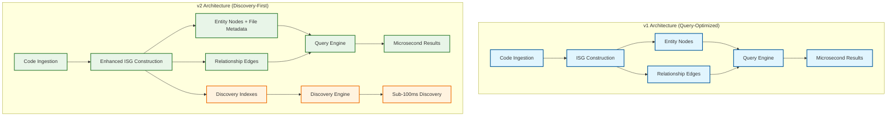

# Design Document

## Overview

Parseltongue v2 transforms the architecture from **query-execution-optimized** to **discovery-first** while preserving the exceptional performance characteristics that make it uniquely valuable. The design addresses the core constraint: users spend 5+ minutes discovering entity names to achieve 1-microsecond queries.

**Design Philosophy**: Extend the existing Interface Signature Graph (ISG) with discovery-optimized indexes and navigation metadata, ensuring zero performance regression for existing workflows while enabling sub-100ms entity discovery.

## Architecture

### High-Level Architecture Evolution



### Core Design Principles

1. **Additive Architecture**: All v2 features are extensions, never replacements
2. **Performance Preservation**: New features must not impact existing query performance
3. **Memory Efficiency**: Use string interning and efficient indexing to minimize overhead
4. **Backward Compatibility**: 100% of v1 APIs continue to work unchanged

## Components and Interfaces

### Enhanced ISG Node Structure

```rust
// v1 Node Structure (preserved)
pub struct ISGNode {
    pub id: NodeId,
    pub name: String,
    pub kind: NodeKind,
    pub relationships: Vec<Relationship>,
    // ... existing fields
}

// v2 Enhanced Node Structure (additive)
pub struct EnhancedISGNode {
    // v1 compatibility layer
    pub v1_node: ISGNode,
    
    // v2 discovery extensions
    pub file_metadata: FileMetadata,
    pub search_metadata: SearchMetadata,
}

#[derive(Debug, Clone)]
pub struct FileMetadata {
    pub file_path: InternedString,      // Relative path from project root
    pub module_path: InternedString,    // Rust module path
    pub line_range: (u32, u32),         // Start and end line numbers
    pub file_id: FileId,                // Efficient file reference
}

#[derive(Debug, Clone)]
pub struct SearchMetadata {
    pub normalized_name: String,        // Lowercase for case-insensitive search
    pub name_tokens: Vec<String>,       // Split for partial matching
    pub search_tags: Vec<String>,       // Additional searchable terms
}
```

### Discovery Index Architecture

```rust
pub struct DiscoveryIndexes {
    // Primary indexes for fast lookup
    pub name_index: FxHashMap<String, FxHashSet<NodeId>>,           // Exact name matches
    pub fuzzy_index: FxHashMap<String, FxHashSet<NodeId>>,          // Normalized names
    pub file_index: FxHashMap<FileId, FxHashSet<NodeId>>,           // Entities by file
    pub path_index: FxHashMap<String, FxHashSet<FileId>>,           // Files by path pattern
    
    // Secondary indexes for advanced discovery
    pub token_index: FxHashMap<String, FxHashSet<NodeId>>,          // Partial name matching
    pub kind_index: FxHashMap<NodeKind, FxHashSet<NodeId>>,         // Entities by type
    
    // String interning for memory efficiency
    pub string_interner: StringInterner,
}

impl DiscoveryIndexes {
    pub fn find_entities_fuzzy(&self, query: &str) -> Vec<(NodeId, f32)> {
        // Fuzzy string matching with relevance scoring
    }
    
    pub fn find_entities_in_file(&self, file_path: &str) -> Vec<NodeId> {
        // Direct file-based entity lookup
    }
    
    pub fn find_entities_by_path_pattern(&self, pattern: &str) -> Vec<NodeId> {
        // Glob pattern matching against file paths
    }
}
```

### Query Engine Extension

```rust
pub struct QueryEngine {
    // v1 query engine (unchanged)
    pub v1_engine: V1QueryEngine,
    
    // v2 discovery engine (additive)
    pub discovery_engine: DiscoveryEngine,
}

pub struct DiscoveryEngine {
    pub indexes: DiscoveryIndexes,
    pub fuzzy_matcher: FuzzyMatcher,
}

impl DiscoveryEngine {
    pub fn list_entities(&self, filter: Option<&str>) -> Vec<EntitySummary> {
        // Implementation for list-entities command
    }
    
    pub fn find_entity_fuzzy(&self, query: &str) -> Vec<FuzzyMatch> {
        // Implementation for fuzzy entity search
    }
    
    pub fn where_defined(&self, entity_name: &str) -> Option<FileLocation> {
        // Implementation for where-defined command
    }
}
```

### Backward Compatibility Layer

```rust
pub struct CompatibilityLayer {
    pub v2_engine: QueryEngine,
}

impl CompatibilityLayer {
    // All v1 commands route through this layer
    pub fn execute_v1_command(&self, command: V1Command) -> V1Result {
        match command {
            V1Command::WhatImplements(trait_name) => {
                // Route to v1 engine, return v1 format
                self.v2_engine.v1_engine.what_implements(trait_name)
            }
            V1Command::BlastRadius(entity) => {
                // Enhanced implementation with readable output
                self.execute_enhanced_blast_radius(entity)
            }
            // ... all other v1 commands
        }
    }
    
    fn execute_enhanced_blast_radius(&self, entity: &str) -> V1Result {
        // Use v2 capabilities but return v1-compatible format
        // with readable names instead of hashes
    }
}
```

## Data Models

### String Interning for Memory Efficiency

```rust
pub struct StringInterner {
    strings: Vec<String>,
    string_to_id: FxHashMap<String, StringId>,
}

pub type InternedString = StringId;

impl StringInterner {
    pub fn intern(&mut self, s: String) -> InternedString {
        if let Some(&id) = self.string_to_id.get(&s) {
            id
        } else {
            let id = StringId(self.strings.len());
            self.strings.push(s.clone());
            self.string_to_id.insert(s, id);
            id
        }
    }
    
    pub fn resolve(&self, id: InternedString) -> &str {
        &self.strings[id.0]
    }
}
```

### File Management System

```rust
pub struct FileManager {
    pub files: Vec<FileInfo>,
    pub path_to_id: FxHashMap<String, FileId>,
}

#[derive(Debug, Clone)]
pub struct FileInfo {
    pub id: FileId,
    pub path: InternedString,
    pub last_modified: SystemTime,
    pub entity_count: usize,
}

impl FileManager {
    pub fn register_file(&mut self, path: String) -> FileId {
        if let Some(&id) = self.path_to_id.get(&path) {
            id
        } else {
            let id = FileId(self.files.len());
            let interned_path = self.string_interner.intern(path.clone());
            self.files.push(FileInfo {
                id,
                path: interned_path,
                last_modified: SystemTime::now(),
                entity_count: 0,
            });
            self.path_to_id.insert(path, id);
            id
        }
    }
}
```

### Fuzzy Matching Algorithm

```rust
pub struct FuzzyMatcher {
    // Levenshtein distance threshold
    pub max_distance: usize,
}

#[derive(Debug, Clone)]
pub struct FuzzyMatch {
    pub node_id: NodeId,
    pub entity_name: String,
    pub file_location: String,
    pub relevance_score: f32,  // 0.0 to 1.0
    pub match_type: MatchType,
}

#[derive(Debug, Clone)]
pub enum MatchType {
    ExactMatch,
    PrefixMatch,
    SubstringMatch,
    FuzzyMatch { distance: usize },
}

impl FuzzyMatcher {
    pub fn find_matches(&self, query: &str, candidates: &[String]) -> Vec<FuzzyMatch> {
        let mut matches = Vec::new();
        
        for (idx, candidate) in candidates.iter().enumerate() {
            if let Some(match_info) = self.calculate_match(query, candidate) {
                matches.push(FuzzyMatch {
                    node_id: NodeId(idx),
                    entity_name: candidate.clone(),
                    file_location: "".to_string(), // Filled by caller
                    relevance_score: match_info.score,
                    match_type: match_info.match_type,
                });
            }
        }
        
        // Sort by relevance score (highest first)
        matches.sort_by(|a, b| b.relevance_score.partial_cmp(&a.relevance_score).unwrap());
        matches
    }
    
    fn calculate_match(&self, query: &str, candidate: &str) -> Option<MatchInfo> {
        // Exact match (highest score)
        if query.eq_ignore_ascii_case(candidate) {
            return Some(MatchInfo {
                score: 1.0,
                match_type: MatchType::ExactMatch,
            });
        }
        
        // Prefix match (high score)
        if candidate.to_lowercase().starts_with(&query.to_lowercase()) {
            let score = 0.9 * (query.len() as f32 / candidate.len() as f32);
            return Some(MatchInfo {
                score,
                match_type: MatchType::PrefixMatch,
            });
        }
        
        // Substring match (medium score)
        if candidate.to_lowercase().contains(&query.to_lowercase()) {
            let score = 0.7 * (query.len() as f32 / candidate.len() as f32);
            return Some(MatchInfo {
                score,
                match_type: MatchType::SubstringMatch,
            });
        }
        
        // Fuzzy match (lower score based on distance)
        let distance = levenshtein_distance(&query.to_lowercase(), &candidate.to_lowercase());
        if distance <= self.max_distance {
            let score = 0.5 * (1.0 - (distance as f32 / query.len().max(candidate.len()) as f32));
            return Some(MatchInfo {
                score,
                match_type: MatchType::FuzzyMatch { distance },
            });
        }
        
        None
    }
}

struct MatchInfo {
    score: f32,
    match_type: MatchType,
}
```

## Error Handling

### Discovery-Specific Error Types

```rust
#[derive(Error, Debug)]
pub enum DiscoveryError {
    #[error("No entities found matching pattern: {pattern}")]
    NoMatches { pattern: String },
    
    #[error("File not found: {path}")]
    FileNotFound { path: String },
    
    #[error("Invalid search pattern: {pattern} - {reason}")]
    InvalidPattern { pattern: String, reason: String },
    
    #[error("Search timeout after {timeout_ms}ms")]
    SearchTimeout { timeout_ms: u64 },
    
    #[error("Index corruption detected: {details}")]
    IndexCorruption { details: String },
}

pub type DiscoveryResult<T> = Result<T, DiscoveryError>;
```

### Graceful Degradation Strategy

```rust
impl DiscoveryEngine {
    pub fn find_entities_with_fallback(&self, query: &str) -> DiscoveryResult<Vec<EntitySummary>> {
        // Try fuzzy search first
        match self.find_entity_fuzzy(query) {
            Ok(results) if !results.is_empty() => Ok(results.into_iter().map(Into::into).collect()),
            _ => {
                // Fallback to substring search
                match self.find_entities_substring(query) {
                    Ok(results) if !results.is_empty() => Ok(results),
                    _ => {
                        // Final fallback to debug --graph | grep equivalent
                        self.find_entities_debug_fallback(query)
                    }
                }
            }
        }
    }
}
```

## Testing Strategy

### Performance Regression Testing

```rust
#[cfg(test)]
mod performance_tests {
    use super::*;
    use std::time::Instant;
    
    #[test]
    fn test_v1_query_performance_preservation() {
        let engine = create_test_engine_with_large_dataset();
        
        // Test existing v1 queries maintain <50μs performance
        let start = Instant::now();
        let result = engine.what_implements("TestTrait");
        let duration = start.elapsed();
        
        assert!(duration.as_micros() < 50, "Query took {:?}, expected <50μs", duration);
        assert!(result.is_ok());
    }
    
    #[test]
    fn test_discovery_query_performance() {
        let engine = create_test_engine_with_large_dataset();
        
        // Test new discovery queries complete <100ms
        let start = Instant::now();
        let result = engine.find_entity_fuzzy("Handler");
        let duration = start.elapsed();
        
        assert!(duration.as_millis() < 100, "Discovery took {:?}, expected <100ms", duration);
        assert!(result.is_ok());
    }
    
    #[test]
    fn test_memory_overhead() {
        let v1_engine = create_v1_engine_with_dataset();
        let v2_engine = create_v2_engine_with_dataset();
        
        let v1_memory = measure_memory_usage(&v1_engine);
        let v2_memory = measure_memory_usage(&v2_engine);
        
        let overhead_ratio = (v2_memory as f64) / (v1_memory as f64);
        assert!(overhead_ratio < 1.2, "Memory overhead {}% exceeds 20% limit", (overhead_ratio - 1.0) * 100.0);
    }
}
```

### Backward Compatibility Testing

```rust
#[cfg(test)]
mod compatibility_tests {
    use super::*;
    
    #[test]
    fn test_all_v1_commands_unchanged() {
        let v1_commands = vec![
            "query what-implements TestTrait",
            "query uses TestStruct", 
            "query calls test_function",
            "query blast-radius TestEntity",
            "generate-context TestEntity",
            "visualize",
            "debug --graph",
        ];
        
        for command in v1_commands {
            let v1_result = execute_v1_command(command);
            let v2_result = execute_v2_command_in_v1_mode(command);
            
            assert_eq!(v1_result, v2_result, "Command '{}' produces different results", command);
        }
    }
}
```

### Discovery Functionality Testing

```rust
#[cfg(test)]
mod discovery_tests {
    use super::*;
    
    #[test]
    fn test_entity_discovery_workflow() {
        let engine = create_test_engine();
        
        // Test the core discovery workflow
        let entities = engine.list_entities(Some("*Handler*")).unwrap();
        assert!(!entities.is_empty());
        
        let first_entity = &entities[0];
        let location = engine.where_defined(&first_entity.name).unwrap();
        assert!(location.file_path.contains(".rs"));
        
        let file_entities = engine.find_entities_in_file(&location.file_path).unwrap();
        assert!(file_entities.iter().any(|e| e.name == first_entity.name));
    }
    
    #[test]
    fn test_fuzzy_search_quality() {
        let engine = create_test_engine();
        
        // Test fuzzy search finds relevant entities
        let results = engine.find_entity_fuzzy("handlr").unwrap(); // Typo in "handler"
        assert!(!results.is_empty());
        
        let handler_results: Vec<_> = results.iter()
            .filter(|r| r.entity_name.to_lowercase().contains("handler"))
            .collect();
        assert!(!handler_results.is_empty(), "Fuzzy search should find handler-related entities");
    }
}
```

## Implementation Phases

### Phase 1: Foundation (Weeks 1-2)
1. **Enhanced ISG Node Structure**: Add file metadata to existing nodes
2. **String Interning System**: Implement memory-efficient string storage
3. **Basic Discovery Indexes**: Name and file-based indexes
4. **Backward Compatibility Layer**: Ensure 100% v1 command compatibility

### Phase 2: Core Discovery (Weeks 3-4)
1. **Fuzzy Search Engine**: Implement fuzzy matching with relevance scoring
2. **Discovery Commands**: `list-entities`, `where-defined`, `entities-in-file`
3. **Enhanced Blast Radius**: Readable output instead of hashes
4. **Performance Validation**: Ensure no regression in existing queries

### Phase 3: Polish and Optimization (Weeks 5-6)
1. **Advanced Discovery**: Path pattern matching, entity type filtering
2. **Error Handling**: Comprehensive error types and graceful degradation
3. **Performance Tuning**: Optimize indexes and memory usage
4. **Documentation**: Update all documentation for new capabilities

## Risk Mitigation

### Performance Risk
- **Risk**: New indexes and metadata slow down existing queries
- **Mitigation**: Separate discovery engine, lazy index loading, comprehensive benchmarking

### Memory Risk  
- **Risk**: File metadata significantly increases memory usage
- **Mitigation**: String interning, efficient data structures, memory profiling

### Compatibility Risk
- **Risk**: Changes break existing user workflows
- **Mitigation**: Compatibility layer, comprehensive regression testing, gradual rollout

### Complexity Risk
- **Risk**: Added complexity makes the system harder to maintain
- **Mitigation**: Clean separation of concerns, extensive documentation, modular design

## Success Criteria

The design succeeds if:

1. **Discovery Time**: New users can find entities in <30 seconds (vs current 5+ minutes)
2. **Performance Preservation**: All v1 queries maintain <50μs performance
3. **Memory Efficiency**: Total memory increase <20% through efficient data structures
4. **Backward Compatibility**: 100% of existing workflows continue unchanged
5. **User Experience**: New user time-to-first-successful-analysis <10 minutes

This design transforms Parseltongue from a powerful but hard-to-discover tool into an immediately accessible architectural intelligence platform while preserving everything that makes it exceptional.