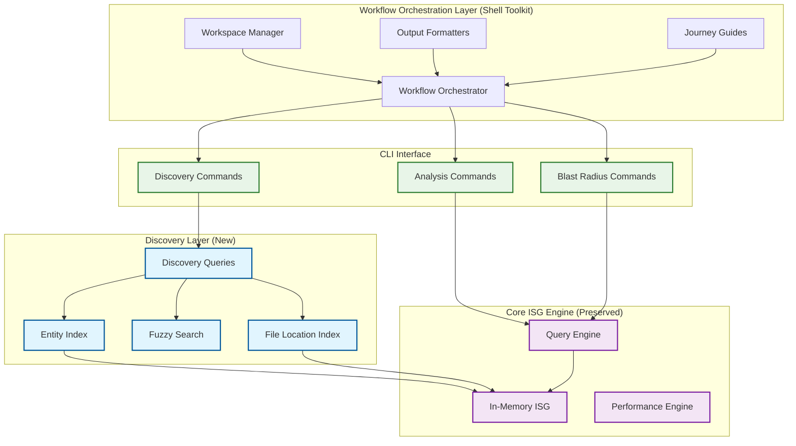
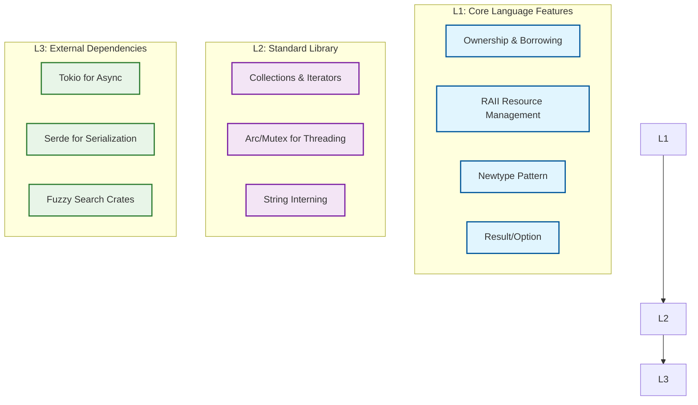

# Design Document: Parseltongue v2 Discovery-First Architecture

## Overview

Parseltongue v2 transforms from an **analysis-first tool with discovery friction** into a **discovery-first architectural intelligence tool**. The core insight driving this redesign is that users spend 5+ minutes discovering entity names to achieve 1-microsecond queries—a 300,000:1 ratio that represents the primary constraint on adoption.

### Strategic Mission
Transform the user experience from "I need to know exact entity names to get value" to "I can see what entities exist, then leverage exceptional analysis capabilities."

### Design Philosophy - Shreyas Doshi Constraint Analysis
- **Core Constraint**: Users don't know what entities exist (not fuzzy matching)
- **80/20 Solution**: Simple entity listing solves 80% of discovery friction
- **Performance Preservation**: Maintain microsecond query performance as core differentiator
- **MVP-First**: Ship entity listing first, add fuzzy search only if users ask for it

## Architecture

### High-Level System Architecture



### Core Design Decisions

#### Decision 1: File Location as Entity Attributes (Not Separate Nodes)
**Rationale**: Files are containers, not semantic entities. Embedding file paths as attributes preserves O(1) performance while enabling file-based navigation.

**Implementation**: Each entity node includes `file_path` as a required attribute using string interning (FileId) for memory efficiency.

**Alternative Rejected**: Separate file nodes would require additional graph traversals and degrade performance.

#### Decision 2: Discovery Layer as Thin Index Over ISG
**Rationale**: Avoid duplicating data structures. Build discovery capabilities as efficient indexes over the existing ISG rather than parallel data stores.

**Implementation**: Discovery queries translate to optimized ISG traversals with caching for common patterns.

**Alternative Rejected**: Separate discovery database would increase complexity and memory usage.

#### Decision 3: Preserve Existing Query Engine Unchanged
**Rationale**: Existing microsecond performance is the core competitive advantage. Any changes risk regression.

**Implementation**: Discovery layer sits above existing query engine, translating discovery requests to existing query patterns.

## Components and Interfaces

### 1. Discovery Query Interface - MVP Focus

```rust
/// Discovery-focused query interface - solving the ACTUAL constraint
pub trait DiscoveryEngine {
    /// List all entities (the core constraint solver)
    async fn list_all_entities(
        &self,
        entity_type: Option<EntityType>,
        max_results: usize,
    ) -> Result<Vec<EntityInfo>, DiscoveryError>;
    
    /// List all entities in a specific file
    async fn entities_in_file(
        &self,
        file_path: &str,
    ) -> Result<Vec<EntityInfo>, DiscoveryError>;
    
    /// Find exact file location for an entity (once they know the name)
    async fn where_defined(
        &self,
        entity_name: &str,
    ) -> Result<Option<FileLocation>, DiscoveryError>;
    
    // REMOVED: Fuzzy search - not solving the core constraint
    // REMOVED: Pattern matching - premature optimization
}

// REMOVED: EntityMatch - fuzzy search complexity not needed for MVP

#[derive(Debug, Clone)]
pub struct EntityInfo {
    pub name: String,
    pub file_path: String,
    pub entity_type: EntityType,
    pub line_number: Option<u32>,
}

#[derive(Debug, Clone)]
pub struct FileLocation {
    pub file_path: String,
    pub line_number: Option<u32>,
    pub column: Option<u32>,
}
```

### 2. Enhanced ISG Node Structure

```rust
/// Extended ISG node with file location attributes
#[derive(Debug, Clone)]
pub struct EnhancedIsgNode {
    pub sig_hash: SigHash,
    pub name: InternedString,
    pub entity_type: EntityType,
    
    // New: File location attributes (not separate nodes)
    pub file_path: FileId, // String interning for memory efficiency
    pub line_number: Option<u32>,
    pub column: Option<u32>,
    
    // Existing fields preserved
    pub signature: InternedString,
    pub relationships: Vec<Relationship>,
}

/// String interning for file paths to minimize memory overhead
#[derive(Debug, Clone, Copy, PartialEq, Eq, Hash)]
pub struct FileId(u32);

pub struct FileInterner {
    paths: Vec<String>,
    path_to_id: HashMap<String, FileId>,
}
```

### 3. Discovery Index Structures - MVP Simplicity

```rust
/// Simple indexes solving the actual constraint
pub struct DiscoveryIndexes {
    /// All entities sorted by name (for simple listing)
    pub all_entities: Vec<EntityInfo>,
    
    /// File-based index for file location queries
    pub file_index: HashMap<FileId, Vec<SigHash>>,
    
    /// Entity type index for filtered listing
    pub type_index: HashMap<EntityType, Vec<EntityInfo>>,
}

// REMOVED: FuzzyIndex - complex solution to wrong problem
// REMOVED: PatternIndex - premature optimization
// REMOVED: FuzzyAlgorithm - not solving core constraint
```

### 4. Workflow Orchestration Interface

```rust
/// Complete user journey workflows built on discovery primitives
pub trait WorkflowOrchestrator {
    /// Complete onboarding workflow: ingest → overview → routes → contexts
    async fn onboard_workflow(
        &self,
        workspace_path: &str,
    ) -> Result<OnboardingResult, WorkflowError>;
    
    /// Feature planning workflow: impact → scope → guidance
    async fn feature_start_workflow(
        &self,
        entities: &[String],
        functions: &[String],
    ) -> Result<FeaturePlanResult, WorkflowError>;
    
    /// Debug workflow: traces → usage → minimal scope
    async fn debug_workflow(
        &self,
        target_function: &str,
    ) -> Result<DebugResult, WorkflowError>;
    
    /// Refactor safety workflow: risk → checklist → guidance
    async fn refactor_check_workflow(
        &self,
        target_entity: &str,
    ) -> Result<RefactorResult, WorkflowError>;
}

#[derive(Debug, Clone)]
pub struct OnboardingResult {
    pub architecture_html_path: String,
    pub route_table: Vec<RouteInfo>,
    pub key_contexts: Vec<EntityContext>,
    pub next_steps: Vec<String>,
}

#[derive(Debug, Clone)]
pub struct FeaturePlanResult {
    pub impact_scope: BlastRadiusResult,
    pub change_checklist: Vec<String>,
    pub test_recommendations: Vec<String>,
    pub risk_level: RiskLevel,
}

#[derive(Debug, Clone)]
pub struct DebugResult {
    pub caller_trace: Vec<CallerInfo>,
    pub usage_sites: Vec<UsageInfo>,
    pub minimal_change_scope: Vec<String>,
}
```

### 5. Workspace State Management

```rust
/// Persistent analysis workspace for iterative discovery
pub struct WorkspaceManager {
    workspace_root: PathBuf,
    current_analysis: Option<AnalysisSession>,
}

#[derive(Debug, Clone)]
pub struct AnalysisSession {
    pub timestamp: DateTime<Utc>,
    pub session_id: String,
    pub analysis_path: PathBuf,
    pub entities_discovered: usize,
    pub last_updated: DateTime<Utc>,
}

impl WorkspaceManager {
    /// Create or reuse analysis session
    pub async fn get_or_create_session(
        &mut self,
        force_refresh: bool,
    ) -> Result<AnalysisSession, WorkspaceError>;
    
    /// Store workflow results for reuse
    pub async fn store_workflow_result<T: Serialize>(
        &self,
        workflow_type: &str,
        result: &T,
    ) -> Result<(), WorkspaceError>;
    
    /// Retrieve cached workflow results
    pub async fn get_cached_result<T: DeserializeOwned>(
        &self,
        workflow_type: &str,
    ) -> Result<Option<T>, WorkspaceError>;
}
```

### 6. Output Integration Interface

```rust
/// Machine-readable and human-readable output formatting
pub trait OutputFormatter {
    /// Format for human consumption (terminal, documentation)
    fn format_human(&self, data: &WorkflowResult) -> String;
    
    /// Format for machine consumption (JSON, tooling integration)
    fn format_json(&self, data: &WorkflowResult) -> serde_json::Value;
    
    /// Format for PR integration (markdown, summary)
    fn format_pr_summary(&self, data: &WorkflowResult) -> String;
    
    /// Format for CI/CD integration (structured, actionable)
    fn format_ci_output(&self, data: &WorkflowResult) -> CiOutput;
}

#[derive(Debug, Clone, Serialize)]
pub struct CiOutput {
    pub risk_level: RiskLevel,
    pub impact_count: usize,
    pub test_recommendations: Vec<String>,
    pub reviewer_suggestions: Vec<String>,
    pub actionable_items: Vec<ActionItem>,
}
```

### 7. Readable Impact Analysis

```rust
/// Enhanced blast radius analysis with human-readable output
pub struct BlastRadiusAnalyzer {
    isg: Arc<InMemoryIsg>,
    discovery: Arc<DiscoveryEngine>,
}

#[derive(Debug, Clone)]
pub struct BlastRadiusResult {
    pub target_entity: EntityInfo,
    pub impacts: Vec<ImpactGroup>,
    pub risk_level: RiskLevel,
    pub summary: ImpactSummary,
}

#[derive(Debug, Clone)]
pub struct ImpactGroup {
    pub relationship_type: RelationshipType, // CALLS, USES, IMPLEMENTS
    pub entities: Vec<EntityInfo>,
    pub file_locations: Vec<FileLocation>,
}

#[derive(Debug, Clone)]
pub enum RiskLevel {
    Low,    // 1-5 impacts
    Medium, // 6-20 impacts
    High,   // 21-50 impacts
    Critical, // 50+ impacts
}

#[derive(Debug, Clone)]
pub struct ImpactSummary {
    pub total_entities: usize,
    pub production_files: usize,
    pub test_files: usize,
    pub risk_assessment: String,
}
```

## Data Models

### Entity Storage Model

```rust
/// Core entity representation with embedded file information
#[derive(Debug, Clone, Serialize, Deserialize)]
pub struct Entity {
    pub id: EntityId,
    pub name: String,
    pub entity_type: EntityType,
    pub signature: String,
    
    // File location embedded as attributes
    pub file_path: String,
    pub line_number: Option<u32>,
    pub column: Option<u32>,
    
    // Semantic relationships
    pub relationships: Vec<Relationship>,
    
    // Metadata for discovery
    pub visibility: Visibility,
    pub module_path: Option<String>,
}

#[derive(Debug, Clone, Copy, PartialEq, Eq)]
pub enum EntityType {
    Function,
    Struct,
    Enum,
    Trait,
    Impl,
    Module,
    Constant,
    Static,
    Macro,
}

#[derive(Debug, Clone, Copy, PartialEq, Eq)]
pub enum Visibility {
    Public,
    Private,
    Crate,
    Super,
}
```

### Discovery Query Models - MVP Focus

```rust
/// Simple query patterns solving the core constraint
#[derive(Debug, Clone)]
pub enum DiscoveryQuery {
    /// List all entities (the main constraint solver)
    ListAll {
        entity_type: Option<EntityType>,
        max_results: usize,
    },
    
    /// List entities in specific file
    EntitiesInFile {
        file_path: String,
        entity_types: Option<Vec<EntityType>>,
    },
    
    /// Find definition location (once they know the name)
    WhereDefinedExact {
        entity_name: String,
    },
}

// REMOVED: FuzzyName - not the core constraint
// REMOVED: ListPattern - premature optimization

/// Simple results for MVP
#[derive(Debug, Clone)]
pub struct DiscoveryResult {
    pub query: DiscoveryQuery,
    pub entities: Vec<EntityInfo>, // Simple, no fuzzy matching complexity
    pub execution_time: Duration,
    pub total_entities: usize,
}
```

## Error Handling

### Structured Error Hierarchy

```rust
/// Comprehensive error handling for discovery operations
#[derive(Error, Debug)]
pub enum DiscoveryError {
    #[error("Entity not found: {name}")]
    EntityNotFound { name: String },
    
    #[error("File not found: {path}")]
    FileNotFound { path: String },
    
    #[error("Invalid pattern: {pattern} - {reason}")]
    InvalidPattern { pattern: String, reason: String },
    
    #[error("Fuzzy search failed: {algorithm} - {cause}")]
    FuzzySearchFailed { algorithm: String, cause: String },
    
    #[error("Query timeout: {query} took longer than {limit:?}")]
    QueryTimeout { query: String, limit: Duration },
    
    #[error("Index corruption detected: {index_type}")]
    IndexCorruption { index_type: String },
    
    #[error("Performance contract violation: {operation} took {actual:?}, expected <{limit:?}")]
    PerformanceViolation {
        operation: String,
        actual: Duration,
        limit: Duration,
    },
    
    #[error("ISG error: {0}")]
    IsgError(#[from] IsgError),
}

/// Application-level error context
pub type DiscoveryResult<T> = Result<T, DiscoveryError>;

/// Context-rich error handling for CLI
pub fn add_discovery_context(
    result: DiscoveryResult<impl std::fmt::Debug>,
    context: &str,
) -> anyhow::Result<impl std::fmt::Debug> {
    result.with_context(|| format!("Discovery operation failed: {}", context))
}
```

## Testing Strategy

### Performance Contract Testing

```rust
/// Validate performance contracts for discovery operations
#[cfg(test)]
mod performance_tests {
    use super::*;
    use std::time::Instant;
    
    #[tokio::test]
    async fn test_discovery_query_performance_contract() {
        let discovery = create_test_discovery_engine().await;
        
        // Load realistic test data
        load_test_codebase(&discovery, "test_data/large_codebase.dump").await;
        
        let start = Instant::now();
        let result = discovery.find_entities_fuzzy("Handler", 50).await.unwrap();
        let elapsed = start.elapsed();
        
        // Performance contract: <100ms for discovery queries
        assert!(elapsed < Duration::from_millis(100), 
                "Discovery query took {:?}, expected <100ms", elapsed);
        
        // Validate result quality
        assert!(!result.is_empty(), "Should find entities matching 'Handler'");
        assert!(result.len() <= 50, "Should respect max_results limit");
    }
    
    #[tokio::test]
    async fn test_existing_query_performance_preserved() {
        let system = create_test_system().await;
        
        let start = Instant::now();
        let result = system.execute_blast_radius_query("SomeEntity").await.unwrap();
        let elapsed = start.elapsed();
        
        // Critical: Existing performance must be preserved
        assert!(elapsed < Duration::from_micros(50), 
                "Existing query took {:?}, expected <50μs", elapsed);
    }
}
```

### Discovery Accuracy Testing

```rust
/// Validate discovery query accuracy and completeness
#[cfg(test)]
mod discovery_accuracy_tests {
    use super::*;
    
    #[tokio::test]
    async fn test_fuzzy_search_accuracy() {
        let discovery = create_test_discovery_engine().await;
        
        // Test cases with expected matches
        let test_cases = vec![
            ("handlr", vec!["Handler", "MessageHandler", "RequestHandler"]),
            ("usr", vec!["User", "UserService", "UserRepository"]),
            ("msg", vec!["Message", "MessageQueue", "MessageProcessor"]),
        ];
        
        for (query, expected) in test_cases {
            let results = discovery.find_entities_fuzzy(query, 10).await.unwrap();
            
            for expected_match in expected {
                assert!(
                    results.iter().any(|r| r.name.contains(expected_match)),
                    "Query '{}' should find entity containing '{}'", query, expected_match
                );
            }
        }
    }
    
    #[tokio::test]
    async fn test_file_location_accuracy() {
        let discovery = create_test_discovery_engine().await;
        
        let entities = discovery.entities_in_file("src/handlers/mod.rs").await.unwrap();
        
        // Validate all entities have correct file path
        for entity in entities {
            assert_eq!(entity.file_path, "src/handlers/mod.rs");
            assert!(entity.line_number.is_some(), "Should have line number");
        }
    }
}
```

### Integration Testing

```rust
/// End-to-end workflow validation
#[cfg(test)]
mod integration_tests {
    use super::*;
    
    #[tokio::test]
    async fn test_discovery_to_analysis_workflow() {
        let system = create_test_system().await;
        
        // Step 1: Discover entities
        let discoveries = system.find_entities_fuzzy("Handler", 5).await.unwrap();
        assert!(!discoveries.is_empty(), "Should discover Handler entities");
        
        // Step 2: Get exact location
        let first_entity = &discoveries[0];
        let location = system.where_defined(&first_entity.name).await.unwrap();
        assert!(location.is_some(), "Should find exact location");
        
        // Step 3: Perform blast radius analysis
        let blast_radius = system.calculate_blast_radius(&first_entity.name).await.unwrap();
        
        // Validate readable output (no hash values)
        for impact in blast_radius.impacts {
            for entity in impact.entities {
                assert!(!entity.name.starts_with("0x"), 
                        "Entity name should be readable, not hash: {}", entity.name);
                assert!(!entity.file_path.is_empty(), 
                        "Should have file path for navigation");
            }
        }
    }
}
```

### Property-Based Testing

```rust
/// Validate invariants across input space
#[cfg(test)]
mod property_tests {
    use super::*;
    use proptest::prelude::*;
    
    proptest! {
        #[test]
        fn discovery_query_never_panics(
            pattern in "[a-zA-Z0-9_]{1,50}",
            max_results in 1usize..1000
        ) {
            let rt = tokio::runtime::Runtime::new().unwrap();
            rt.block_on(async {
                let discovery = create_test_discovery_engine().await;
                
                // Should never panic, even with arbitrary input
                let result = discovery.find_entities_fuzzy(&pattern, max_results).await;
                
                match result {
                    Ok(entities) => {
                        prop_assert!(entities.len() <= max_results);
                        for entity in entities {
                            prop_assert!(!entity.name.is_empty());
                            prop_assert!(!entity.file_path.is_empty());
                            prop_assert!(entity.confidence_score >= 0.0);
                            prop_assert!(entity.confidence_score <= 1.0);
                        }
                    }
                    Err(_) => {
                        // Errors are acceptable, panics are not
                    }
                }
            });
        }
    }
}
```

## Implementation Architecture

### Layered Implementation Strategy



### Memory Layout Optimization

```rust
/// Optimized memory layout for discovery indexes
#[repr(C)]
pub struct CompactEntityInfo {
    pub name_id: u32,        // String interning
    pub file_id: u32,        // String interning
    pub entity_type: u8,     // Enum as u8
    pub visibility: u8,      // Enum as u8
    pub line_number: u32,    // 0 = None
    pub sig_hash: u128,      // Direct hash value
}

// Total size: 24 bytes per entity (vs ~200 bytes with String fields)

/// Memory-efficient fuzzy search index
pub struct CompactFuzzyIndex {
    /// Trigram index for fast fuzzy matching
    trigrams: HashMap<[u8; 3], Vec<u32>>, // entity_id references
    
    /// Entity metadata for result construction
    entities: Vec<CompactEntityInfo>,
    
    /// String interner for names and paths
    strings: StringInterner,
}
```

### Concurrency Model

```rust
/// Thread-safe discovery engine with read-optimized locking
pub struct ConcurrentDiscoveryEngine {
    /// Core ISG (read-heavy, occasional updates)
    isg: Arc<RwLock<InMemoryIsg>>,
    
    /// Discovery indexes (read-heavy, rebuilt on ISG updates)
    indexes: Arc<RwLock<DiscoveryIndexes>>,
    
    /// String interner (append-only, lock-free reads)
    strings: Arc<StringInterner>,
}

impl ConcurrentDiscoveryEngine {
    /// Read-optimized discovery queries
    pub async fn find_entities_fuzzy(
        &self,
        pattern: &str,
        max_results: usize,
    ) -> DiscoveryResult<Vec<EntityMatch>> {
        // Read lock only, no blocking writes
        let indexes = self.indexes.read().await;
        
        // CPU-intensive fuzzy search in background thread
        let pattern = pattern.to_string();
        let results = tokio::task::spawn_blocking(move || {
            indexes.name_index.fuzzy_search(&pattern, max_results)
        }).await?;
        
        Ok(results)
    }
}
```

## Performance Optimization Strategy

### Critical Performance Contracts

1. **Discovery Queries**: <100ms for interactive responsiveness
2. **Existing Queries**: <50μs (no regression from v1)
3. **Memory Usage**: <20% increase from v1
4. **Index Rebuild**: <5 seconds for large codebases

### Optimization Techniques

```rust
/// Performance-critical path optimizations
impl DiscoveryEngine {
    /// Zero-allocation entity filtering
    pub fn filter_entities_by_type<'a>(
        &'a self,
        entities: &'a [EntityInfo],
        entity_type: EntityType,
    ) -> impl Iterator<Item = &'a EntityInfo> {
        entities.iter().filter(move |e| e.entity_type == entity_type)
    }
    
    /// Batch processing for multiple queries
    pub async fn batch_discovery_queries(
        &self,
        queries: Vec<DiscoveryQuery>,
    ) -> Vec<DiscoveryResult<Vec<EntityMatch>>> {
        // Process queries in parallel with bounded concurrency
        let semaphore = Arc::new(Semaphore::new(4)); // Max 4 concurrent
        
        let futures = queries.into_iter().map(|query| {
            let semaphore = Arc::clone(&semaphore);
            let engine = self.clone();
            
            async move {
                let _permit = semaphore.acquire().await.unwrap();
                engine.execute_discovery_query(query).await
            }
        });
        
        futures::future::join_all(futures).await
    }
}
```

## Migration Strategy

### Backward Compatibility

```rust
/// Wrapper to maintain v1 API compatibility
pub struct LegacyQueryAdapter {
    discovery_engine: Arc<DiscoveryEngine>,
    legacy_isg: Arc<InMemoryIsg>,
}

impl LegacyQueryAdapter {
    /// Existing v1 query interface (unchanged)
    pub async fn execute_query(&self, query: &str) -> Result<QueryResult, IsgError> {
        // Route to existing ISG engine - zero changes
        self.legacy_isg.execute_query(query).await
    }
    
    /// New discovery interface (additive)
    pub async fn discover_entities(&self, pattern: &str) -> DiscoveryResult<Vec<EntityMatch>> {
        self.discovery_engine.find_entities_fuzzy(pattern, 50).await
    }
}
```

### Incremental Rollout Plan

1. **Phase 1**: Add discovery layer without changing existing code
2. **Phase 2**: Enhance ISG nodes with file location attributes
3. **Phase 3**: Implement readable blast radius output
4. **Phase 4**: Optimize performance and memory usage
5. **Phase 5**: Full integration testing and validation

## Success Metrics Validation

### Automated Metric Collection

```rust
/// Built-in metrics collection for success validation
pub struct DiscoveryMetrics {
    pub entity_discovery_time: Histogram,
    pub query_success_rate: Counter,
    pub performance_violations: Counter,
    pub user_workflow_completion: Counter,
}

impl DiscoveryMetrics {
    pub fn record_discovery_time(&self, duration: Duration) {
        self.entity_discovery_time.observe(duration.as_secs_f64());
        
        // Validate success criteria: <30 seconds
        if duration > Duration::from_secs(30) {
            self.performance_violations.inc();
            warn!("Discovery time exceeded target: {:?}", duration);
        }
    }
    
    pub fn record_query_success(&self, success: bool) {
        if success {
            self.query_success_rate.inc();
        }
    }
}
```

This design document addresses all requirements from the requirements specification while maintaining the core architectural principles of performance preservation and discovery-first user experience. The implementation strategy follows the layered Rust architecture pattern and includes comprehensive testing strategies to validate both functional correctness and performance contracts.