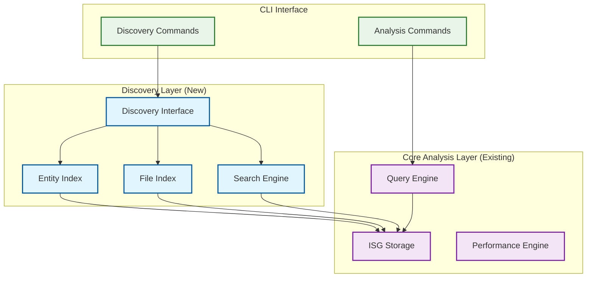

# Parseltongue v2 Design Document

## Overview

Parseltongue v2 transforms from an **analysis-first tool with discovery friction** into a **discovery-first architectural intelligence tool**. The core insight driving this redesign is that users spend 5+ minutes discovering entity names to achieve 1-microsecond queries—a 300,000:1 ratio that represents the primary constraint on adoption.

### Design Philosophy

**Discovery-First Architecture**: Every component prioritizes entity discoverability while preserving the exceptional performance that makes Parseltongue unique. The design follows the constraint theory principle: optimize the primary constraint (entity discovery) rather than secondary capabilities (analysis speed, which is already excellent).

### Success Metrics
- **Entity discovery time**: <30 seconds (from current 5+ minutes)
- **Query success rate**: 90%+ (from current ~30% for generic names)
- **Performance preservation**: <50μs for existing queries (no regression)

## Architecture

### High-Level System Architecture



### Layered Architecture Design

Following the L1→L2→L3 pattern from the design principles:

- **L1 Core**: ISG data structures, entity relationships, hash-based lookups (no_std compatible)
- **L2 Standard**: Discovery indices, file mappings, string processing, collections
- **L3 External**: CLI framework (clap), fuzzy matching (fuse), serialization (serde)

## Components and Interfaces

### 1. Discovery Interface (New Component)

**Purpose**: Primary entry point for all entity discovery operations, bridging the gap between user intent and precise entity identification.

```rust
/// Discovery interface for entity exploration and navigation
pub trait DiscoveryInterface {
    /// List entities matching a pattern with file context
    async fn list_entities(&self, pattern: &str) -> Result<Vec<EntityMatch>, DiscoveryError>;
    
    /// Find entities in a specific file
    async fn entities_in_file(&self, file_path: &str) -> Result<Vec<EntityLocation>, DiscoveryError>;
    
    /// Fuzzy search for entity names
    async fn fuzzy_search(&self, query: &str, limit: usize) -> Result<Vec<FuzzyMatch>, DiscoveryError>;
    
    /// Get exact file location for an entity
    async fn where_defined(&self, entity_name: &str) -> Result<Option<FileLocation>, DiscoveryError>;
}

#[derive(Debug, Clone)]
pub struct EntityMatch {
    pub name: String,
    pub entity_type: EntityType,
    pub file_location: FileLocation,
    pub relevance_score: f32,
}

#[derive(Debug, Clone)]
pub struct FileLocation {
    pub file_path: String,
    pub line_start: u32,
    pub line_end: u32,
    pub column_start: u32,
    pub column_end: u32,
}
```

**Design Rationale**: Trait-based design enables testing with mock implementations while providing a clean abstraction over the underlying indices.

### 2. Entity Index (New Component)

**Purpose**: Fast lookup structure for entity names with pattern matching and fuzzy search capabilities.

```rust
/// High-performance entity index with multiple access patterns
pub struct EntityIndex {
    /// Primary hash map for exact lookups (existing performance)
    exact_lookup: HashMap<String, EntityId>,
    
    /// Trie structure for prefix matching
    prefix_trie: Trie<EntityId>,
    
    /// Inverted index for substring searches
    substring_index: InvertedIndex,
    
    /// Fuzzy search engine
    fuzzy_engine: FuzzySearchEngine,
    
    /// String interning for memory efficiency
    string_interner: StringInterner,
}

impl EntityIndex {
    /// O(1) exact lookup (preserves existing performance)
    pub fn get_exact(&self, name: &str) -> Option<EntityId> {
        self.exact_lookup.get(name).copied()
    }
    
    /// O(k) prefix search where k is number of matches
    pub fn find_by_prefix(&self, prefix: &str) -> Vec<EntityMatch> {
        self.prefix_trie.find_with_prefix(prefix)
    }
    
    /// O(log n) substring search with ranking
    pub fn find_by_substring(&self, substring: &str) -> Vec<EntityMatch> {
        self.substring_index.search(substring)
    }
    
    /// O(n) fuzzy search with configurable threshold
    pub fn fuzzy_search(&self, query: &str, threshold: f32) -> Vec<FuzzyMatch> {
        self.fuzzy_engine.search(query, threshold)
    }
}
```

**Design Rationale**: Multiple index structures optimize for different search patterns while preserving O(1) exact lookups. String interning reduces memory overhead for repeated entity names.

### 3. File Index (New Component)

**Purpose**: Bidirectional mapping between entities and their file locations for immediate navigation.

```rust
/// Bidirectional file-entity mapping for navigation
pub struct FileIndex {
    /// File path -> entities defined in that file
    file_to_entities: HashMap<String, Vec<EntityLocation>>,
    
    /// Entity ID -> file location
    entity_to_file: HashMap<EntityId, FileLocation>,
    
    /// Directory structure for hierarchical browsing
    directory_tree: DirectoryTree,
}

impl FileIndex {
    /// Get all entities defined in a specific file
    pub fn entities_in_file(&self, file_path: &str) -> Option<&[EntityLocation]> {
        self.file_to_entities.get(file_path).map(|v| v.as_slice())
    }
    
    /// Get file location for a specific entity
    pub fn file_location(&self, entity_id: EntityId) -> Option<&FileLocation> {
        self.entity_to_file.get(&entity_id)
    }
    
    /// List all files containing entities matching a pattern
    pub fn files_containing_pattern(&self, pattern: &str) -> Vec<String> {
        self.file_to_entities
            .keys()
            .filter(|path| path.contains(pattern))
            .cloned()
            .collect()
    }
}
```

**Design Rationale**: Bidirectional mapping enables both "what's in this file?" and "where is this entity?" queries with O(1) lookup performance.

### 4. Enhanced ISG Storage (Modified Component)

**Purpose**: Extend existing ISG with file location metadata while preserving performance.

```rust
/// Enhanced ISG node with file location metadata
#[derive(Debug, Clone)]
pub struct EnhancedNode {
    /// Existing node data (preserved)
    pub core_data: NodeData,
    
    /// File location information (new)
    pub file_location: Option<FileLocation>,
    
    /// Entity metadata for discovery (new)
    pub metadata: EntityMetadata,
}

#[derive(Debug, Clone)]
pub struct EntityMetadata {
    pub entity_type: EntityType,
    pub visibility: Visibility,
    pub module_path: Vec<String>,
    pub documentation: Option<String>,
}

/// Enhanced ISG with discovery capabilities
pub struct EnhancedISG {
    /// Core ISG functionality (preserved)
    core_isg: ISG,
    
    /// Discovery indices (new)
    entity_index: EntityIndex,
    file_index: FileIndex,
    
    /// Performance monitoring
    metrics: PerformanceMetrics,
}
```

**Design Rationale**: Composition over inheritance preserves existing ISG performance while adding discovery capabilities. Optional file locations maintain backward compatibility.

### 5. Readable Output Formatter (New Component)

**Purpose**: Transform hash-based output into human-readable results with file context.

```rust
/// Formats analysis results for human consumption
pub struct ReadableFormatter {
    entity_resolver: EntityResolver,
    file_resolver: FileResolver,
    output_config: OutputConfig,
}

impl ReadableFormatter {
    /// Convert blast radius hashes to readable entity names
    pub fn format_blast_radius(&self, result: BlastRadiusResult) -> ReadableBlastRadius {
        ReadableBlastRadius {
            center_entity: self.resolve_entity_name(result.center_hash),
            impacts: result.impacts
                .into_iter()
                .map(|impact| ReadableImpact {
                    entity_name: self.resolve_entity_name(impact.hash),
                    file_location: self.resolve_file_location(impact.hash),
                    relationship_type: impact.relationship_type,
                    impact_level: self.calculate_impact_level(impact.distance),
                })
                .collect(),
            risk_assessment: self.assess_risk_level(result.impacts.len()),
        }
    }
}

#[derive(Debug)]
pub struct ReadableBlastRadius {
    pub center_entity: String,
    pub impacts: Vec<ReadableImpact>,
    pub risk_assessment: RiskLevel,
}

#[derive(Debug)]
pub enum RiskLevel {
    Low,      // 1-5 impacts
    Medium,   // 6-20 impacts
    High,     // 21-50 impacts
    Critical, // 50+ impacts
}
```

**Design Rationale**: Separate formatting layer enables different output formats (JSON, human-readable, IDE integration) without affecting core analysis performance.

## Data Models

### Core Entity Types

```rust
/// Comprehensive entity type enumeration
#[derive(Debug, Clone, PartialEq, Eq, Hash, Serialize, Deserialize)]
pub enum EntityType {
    // Rust-specific entities
    Struct,
    Enum,
    Trait,
    Function,
    Method,
    Module,
    Impl,
    Macro,
    Const,
    Static,
    Type,
    
    // Generic programming constructs
    Generic,
    Associated,
    Lifetime,
}

/// Entity visibility levels
#[derive(Debug, Clone, PartialEq, Eq)]
pub enum Visibility {
    Public,
    PublicCrate,
    PublicSuper,
    Private,
}
```

### Discovery Data Structures

```rust
/// Optimized trie for prefix searches
pub struct Trie<T> {
    root: TrieNode<T>,
    size: usize,
}

struct TrieNode<T> {
    children: HashMap<char, Box<TrieNode<T>>>,
    values: Vec<T>,
    is_terminal: bool,
}

/// Inverted index for substring searches
pub struct InvertedIndex {
    /// Substring -> list of entity IDs containing it
    index: HashMap<String, Vec<EntityId>>,
    
    /// Minimum substring length for indexing
    min_length: usize,
    
    /// Maximum number of results per query
    max_results: usize,
}

/// Fuzzy search configuration
pub struct FuzzySearchEngine {
    /// Levenshtein distance threshold
    distance_threshold: usize,
    
    /// Jaro-Winkler similarity threshold
    similarity_threshold: f32,
    
    /// Cached distance calculations
    distance_cache: LruCache<(String, String), usize>,
}
```

**Design Rationale**: Specialized data structures optimize for different search patterns while maintaining memory efficiency through caching and configurable limits.

## Error Handling

### Comprehensive Error Hierarchy

```rust
/// Discovery-specific errors with actionable context
#[derive(Error, Debug)]
pub enum DiscoveryError {
    #[error("Entity not found: '{name}'. Try fuzzy search with --fuzzy flag")]
    EntityNotFound { name: String },
    
    #[error("File not found: '{path}'. Check if file exists in the analyzed codebase")]
    FileNotFound { path: String },
    
    #[error("Search pattern too broad: '{pattern}' matches {count} entities. Use more specific pattern")]
    PatternTooBroad { pattern: String, count: usize },
    
    #[error("Search pattern too narrow: '{pattern}' matches no entities. Try fuzzy search")]
    PatternTooNarrow { pattern: String },
    
    #[error("Index not ready: {reason}. Run 'parseltongue ingest' first")]
    IndexNotReady { reason: String },
    
    #[error("Performance constraint violated: {operation} took {actual:?}, limit {limit:?}")]
    PerformanceViolation {
        operation: String,
        actual: Duration,
        limit: Duration,
    },
    
    #[error("Core ISG error: {0}")]
    CoreISG(#[from] ISGError),
}

/// Application-level error handling with context
pub type DiscoveryResult<T> = Result<T, DiscoveryError>;

/// Error context for debugging and user guidance
#[derive(Debug)]
pub struct ErrorContext {
    pub operation: String,
    pub entity_name: Option<String>,
    pub file_path: Option<String>,
    pub suggestions: Vec<String>,
}
```

**Design Rationale**: Structured errors provide actionable guidance to users while maintaining programmatic error handling for API consumers.

## Testing Strategy

### Multi-Layer Testing Approach

#### 1. Unit Tests (Component Isolation)
```rust
#[cfg(test)]
mod entity_index_tests {
    use super::*;
    
    #[test]
    fn test_exact_lookup_performance() {
        let index = create_test_index_with_entities(10_000);
        
        let start = Instant::now();
        let result = index.get_exact("TestEntity");
        let elapsed = start.elapsed();
        
        assert!(elapsed < Duration::from_micros(50));
        assert!(result.is_some());
    }
    
    #[test]
    fn test_prefix_search_accuracy() {
        let index = create_test_index();
        let results = index.find_by_prefix("Handler");
        
        assert!(results.iter().all(|m| m.name.starts_with("Handler")));
        assert!(results.len() > 0);
    }
}
```

#### 2. Integration Tests (Component Interaction)
```rust
#[tokio::test]
async fn test_discovery_to_analysis_workflow() {
    let system = create_test_system().await;
    
    // Discovery phase
    let entities = system.discovery()
        .list_entities("*Handler*")
        .await
        .unwrap();
    
    assert!(!entities.is_empty());
    
    // Analysis phase using discovered entity
    let entity_name = &entities[0].name;
    let blast_radius = system.analysis()
        .calculate_blast_radius(entity_name)
        .await
        .unwrap();
    
    // Verify readable output
    assert!(!blast_radius.center_entity.contains("hash"));
    assert!(blast_radius.impacts.iter().all(|i| !i.entity_name.contains("hash")));
}
```

#### 3. Property-Based Tests (Invariant Validation)
```rust
use proptest::prelude::*;

proptest! {
    #[test]
    fn discovery_performance_contract(
        pattern in "[a-zA-Z*]{1,20}",
        entity_count in 1000usize..50000
    ) {
        let rt = tokio::runtime::Runtime::new().unwrap();
        rt.block_on(async {
            let system = create_test_system_with_entities(entity_count).await;
            
            let start = Instant::now();
            let results = system.discovery().list_entities(&pattern).await.unwrap();
            let elapsed = start.elapsed();
            
            // Discovery must complete within 100ms regardless of pattern or entity count
            prop_assert!(elapsed < Duration::from_millis(100));
            
            // Results must be relevant to pattern
            if !pattern.contains('*') {
                prop_assert!(results.iter().all(|r| r.name.contains(&pattern)));
            }
        });
    }
}
```

#### 4. Performance Contract Tests
```rust
#[test]
fn test_memory_usage_contract() {
    let initial_memory = get_memory_usage();
    let system = create_large_test_system(100_000); // 100K entities
    let final_memory = get_memory_usage();
    
    let memory_increase = final_memory - initial_memory;
    let max_allowed = initial_memory * 1.2; // 20% increase limit
    
    assert!(memory_increase < max_allowed, 
            "Memory usage increased by {:.1}%, limit is 20%", 
            (memory_increase as f64 / initial_memory as f64) * 100.0);
}

#[test]
fn test_existing_query_performance_preservation() {
    let system = create_test_system();
    
    // Test existing query performance is unchanged
    let start = Instant::now();
    let result = system.core_isg().execute_simple_query("TestEntity");
    let elapsed = start.elapsed();
    
    assert!(elapsed < Duration::from_micros(50), 
            "Existing query performance degraded: {:?}", elapsed);
}
```

### Test Data Strategy

```rust
/// Realistic test data generation
pub struct TestDataGenerator {
    entity_patterns: Vec<String>,
    file_patterns: Vec<String>,
    relationship_patterns: Vec<RelationshipType>,
}

impl TestDataGenerator {
    /// Generate test data matching real Rust codebase patterns
    pub fn generate_realistic_codebase(&self, size: CodebaseSize) -> TestCodebase {
        match size {
            CodebaseSize::Small => self.generate_entities(1_000),
            CodebaseSize::Medium => self.generate_entities(10_000),
            CodebaseSize::Large => self.generate_entities(100_000),
        }
    }
    
    /// Generate entities with realistic naming patterns
    fn generate_entities(&self, count: usize) -> Vec<TestEntity> {
        // Generate entities following real Rust naming conventions
        // Include common patterns like Handler, Service, Manager, etc.
        // Create realistic file hierarchies (src/lib.rs, src/handlers/, etc.)
        // Generate appropriate relationships between entities
    }
}
```

**Design Rationale**: Multi-layer testing ensures both component correctness and system-level behavior while validating performance contracts at every level.

## Performance Considerations

### Memory Optimization Strategy

#### String Interning for Entity Names
```rust
/// Memory-efficient string storage for repeated entity names
pub struct StringInterner {
    strings: Vec<String>,
    indices: HashMap<String, StringId>,
    next_id: StringId,
}

impl StringInterner {
    pub fn intern(&mut self, s: &str) -> StringId {
        if let Some(&id) = self.indices.get(s) {
            id
        } else {
            let id = self.next_id;
            self.strings.push(s.to_string());
            self.indices.insert(s.to_string(), id);
            self.next_id = StringId(self.next_id.0 + 1);
            id
        }
    }
    
    pub fn resolve(&self, id: StringId) -> &str {
        &self.strings[id.0 as usize]
    }
}
```

#### Lazy Loading for Large Codebases
```rust
/// Lazy-loaded indices for memory efficiency
pub struct LazyEntityIndex {
    core_index: EntityIndex,
    extended_indices: HashMap<IndexType, Option<Box<dyn ExtendedIndex>>>,
    loading_strategy: LoadingStrategy,
}

impl LazyEntityIndex {
    pub fn get_fuzzy_search(&mut self) -> &dyn FuzzySearchEngine {
        self.extended_indices
            .entry(IndexType::FuzzySearch)
            .or_insert_with(|| {
                Some(Box::new(self.load_fuzzy_index()))
            })
            .as_ref()
            .unwrap()
    }
}
```

### Query Optimization

#### Multi-Level Caching Strategy
```rust
/// Hierarchical caching for discovery queries
pub struct DiscoveryCache {
    /// L1: Exact entity lookups (hot cache)
    exact_cache: LruCache<String, EntityId>,
    
    /// L2: Pattern-based searches (warm cache)
    pattern_cache: LruCache<String, Vec<EntityMatch>>,
    
    /// L3: Fuzzy search results (cold cache)
    fuzzy_cache: LruCache<(String, f32), Vec<FuzzyMatch>>,
    
    /// Cache statistics for optimization
    stats: CacheStats,
}
```

#### Parallel Processing for Large Results
```rust
/// Parallel processing for discovery operations
impl DiscoveryInterface for ParallelDiscoveryEngine {
    async fn list_entities(&self, pattern: &str) -> Result<Vec<EntityMatch>, DiscoveryError> {
        let chunks = self.partition_search_space(pattern);
        
        let results = futures::future::join_all(
            chunks.into_iter().map(|chunk| {
                tokio::spawn(async move {
                    self.search_chunk(chunk).await
                })
            })
        ).await;
        
        let mut combined_results = Vec::new();
        for result in results {
            combined_results.extend(result??);
        }
        
        // Sort by relevance and apply limits
        combined_results.sort_by(|a, b| b.relevance_score.partial_cmp(&a.relevance_score).unwrap());
        combined_results.truncate(self.max_results);
        
        Ok(combined_results)
    }
}
```

**Design Rationale**: Performance optimizations focus on the critical path (discovery queries) while preserving existing analysis performance through careful architectural separation.

## Implementation Phases

### Phase 1: Core Discovery Infrastructure (Weeks 1-2)
- Entity Index implementation with exact/prefix/substring search
- File Index with bidirectional mapping
- Basic CLI commands for entity discovery
- Performance contract validation

### Phase 2: Enhanced Search Capabilities (Weeks 3-4)
- Fuzzy search engine integration
- Readable output formatting
- Comprehensive error handling with user guidance
- Integration with existing ISG

### Phase 3: Optimization and Polish (Weeks 5-6)
- Memory optimization with string interning
- Lazy loading for large codebases
- Parallel processing for complex queries
- Comprehensive testing and documentation

**Design Rationale**: Phased approach enables early validation of core concepts while building complexity incrementally. Each phase delivers user value independently.

## Migration Strategy

### Backward Compatibility
- Existing CLI commands remain unchanged
- Core ISG API preserved
- Performance characteristics maintained
- Existing test suites continue to pass

### New Command Integration
```bash
# New discovery commands (additive)
parseltongue query list-entities --filter "*Handler*"
parseltongue query entities-in-file src/handlers/mod.rs
parseltongue query find-entity "handlr" --fuzzy
parseltongue query where-defined MessageHandler

# Enhanced existing commands (improved output)
parseltongue query blast-radius MessageHandler  # Now returns readable names
```

### Data Migration
- Existing ISG files remain compatible
- New metadata added during next ingestion
- Incremental index building for large codebases
- Graceful degradation when indices unavailable

**Design Rationale**: Zero-disruption migration ensures existing users can adopt v2 without workflow changes while gaining immediate benefits from enhanced discovery capabilities.