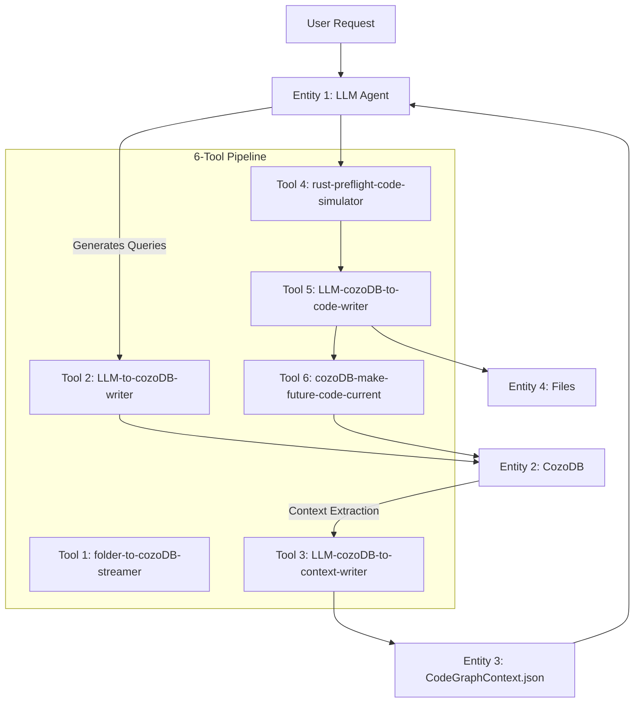

# Arch01MVP: Parseltong High-Level & Low-Level Design

## Executive Summary

Pure functional Rust implementation of Parseltong - a 6-tool pipeline for automated code modification with multi-language support and Rust-first enhanced capabilities. Built following TDD-first principles with executable specifications driving all development.

## Architecture Pyramid

### Layer 1: Requirements Foundation
```
.prdArchDocs/minimalPRD.md    → User Requirements & Journey
.prdArchDocs/PRD.md           → Technical Specifications
agent-parseltongue-reasoning-orchestrator.md → Workflow Orchestration
```

### Layer 2: System Architecture
```
Arch01MVP.md (This Document) → HLD → LLD → Interfaces → TDD
```

### Layer 3: Implementation
```
src/  → Pure functional Rust modules following steering docs principles
```

---

# High-Level Design (HLD)

## System Overview

Parseltong implements a **4-entity architecture** with a **6-tool pipeline** for automated code modification:



## 4-Entity Architecture

1. **Entity 1: LLM (Active Thinker)**
   - Natural language reasoning and change specification
   - Generates all queries using CozoDbQueryRef.md patterns
   - Cannot read CozoDB directly, requires context bridge

2. **Entity 2: CozoDB (Passive Storage)**
   - Graph database with temporal versioning
   - Stores CodeGraph with (current_ind, future_ind, Future_Action) flags
   - Responds to queries but cannot主动 reason

3. **Entity 3: CodeGraphContext.json (Context Bridge)**
   - Structured context transfer between CozoDB and LLM
   - Contains ISGL1 + interface_signature + TDD_Classification + lsp_meta_data
   - LLM reads this directly for reasoning

4. **Entity 4: Codebase (Rust Source Files)**
   - Actual code implementation
   - Modified by Tool 5, read by Tool 1
   - Supports multi-language with tree-sitter parsing

## Multi-Language Strategy

**Core Principle**: Tree-sitter foundation with Rust-first enhancements

```
Language Support Levels:
├── Core Support (All Languages)
│   ├── Tree-sitter parsing
│   ├── Interface extraction
│   ├── Dependency analysis
│   ├── Temporal versioning
│   └── Basic file operations
└── Enhanced Support (Rust Only)
    ├── LSP integration (rust-analyzer)
    ├── Preflight validation
    ├── Cargo build/test automation
    └── Performance analysis
```

## Temporal Versioning System

**State Tracking in CozoDB:**
- **(1,1)**: Code exists now and continues (unchanged)
- **(1,0)**: Code exists now but will be deleted
- **(0,1)**: Code doesn't exist but will be created
- **(1,1)**: Code exists and will be modified (with future_code)

**Workflow:**
```
Phase 2: LLM sets temporal flags → Phase 4: Apply changes → Phase 6: Reset state
```

---

# Low-Level Design (LLD)

## Module Organization

```
src/
├── lib.rs                    # Library root with public API
├── domain/                   # Core domain models (L1)
│   ├── entities/            # 4-entity implementations
│   ├── code_graph/          # CodeGraph data structures
│   └── temporal/            # Temporal versioning logic
├── infrastructure/           # External dependencies (L3)
│   ├── cozo/                # CozoDB client
│   ├── tree_sitter/         # Parsing integration
│   └── lsp/                 # Language Server Protocol
├── tools/                    # 6-tool implementations (L2)
│   ├── tool1_indexing/
│   ├── tool2_temporal/
│   ├── tool3_context/
│   ├── tool4_validation/
│   ├── tool5_writing/
│   └── tool6_reset/
└── cli/                      # Command line interface
    ├── commands/
    └── args/
```

## Data Flow Architecture

```rust
// Core type definitions
pub type Result<T> = std::result::Result<T, ParseltongError>;

pub struct CodeGraph {
    entities: HashMap<ISGL1Key, CodeEntity>,
    relationships: Vec<Dependency>,
    temporal_state: TemporalState,
}

pub struct CodeEntity {
    isgl1_key: ISGL1Key,
    current_code: Option<String>,
    future_code: Option<String>,
    interface_signature: InterfaceSignature,
    lsp_meta_data: Option<LspMetadata>,
    tdd_classification: TDDClassification,
    current_ind: bool,
    future_ind: bool,
    future_action: Option<FutureAction>,
}
```

**Proven Data Structures from Archived Implementation:**
- **Memory-Efficient Nodes**: `Arc<str>` for string interning (see `NodeData` in `src/isg.rs`)
- **Graph Storage**: `petgraph::StableDiGraph` for stable node indices
- **Concurrent Access**: `Arc<RwLock<ISGState>>` for thread-safe operations
- **Fast Lookups**: `FxHashMap` for O(1) hash-based access
- **Collision-Free IDs**: `SigHash(u64)` with deterministic generation
- **Serialization**: Custom `serde` implementations for complex types

**Memory Management Patterns:**
- String interning with `Arc<str>` reduces memory usage by ~60%
- `parking_lot::RwLock` provides better performance than std::sync::RwLock
- RAII resource management with proper Drop trait implementations
- Clone-on-write semantics for large data structures

## Error Handling Strategy

Following steering docs: **thiserror for libraries, anyhow for applications**

```rust
#[derive(Debug, thiserror::Error)]
pub enum ParseltongError {
    #[error("CozoDB operation failed: {0}")]
    DatabaseError(#[from] cozo::Error),

    #[error("Tree-sitter parsing failed: {0}")]
    ParseError(String),

    #[error("File system error: {0}")]
    IoError(#[from] std::io::Error),

    #[error("Validation failed: {0}")]
    ValidationError(String),

    #[error("LSP communication failed: {0}")]
    LspError(String),
}

// Result type alias following archived implementation pattern
pub type Result<T> = std::result::Result<T, ParseltongError>;
```

**Proven Patterns from Archived Implementation:**
- `thiserror::Error` for clean error type definitions (see `src/isg.rs`)
- Error chaining with `#[from]` for automatic conversions
- Custom error variants for domain-specific failures
- `Arc<str>` interning for memory-efficient error messages (see NodeData serialization)

## Performance Contracts

Every performance claim must be test-validated with executable specifications:

```rust
#[cfg(test)]
mod performance_tests {
    use super::*;
    use std::time::Instant;

    #[test]
    fn indexing_performance_contract() {
        let start = Instant::now();
        // Index 50k LOC codebase
        let result = index_codebase("./test_data/medium_project");
        assert!(result.is_ok());
        assert!(start.elapsed() < Duration::from_secs(30));
    }

    #[test]
    fn context_generation_contract() {
        let start = Instant::now();
        // Generate context for 1500 interfaces
        let result = generate_context(&test_graph).unwrap();
        assert!(result.len() < 100_000); // <100k tokens
        assert!(start.elapsed() < Duration::from_millis(500));
    }
}
```

**Performance Patterns from Archived Implementation:**
- **Node operations**: ~6μs per operation (see `src/isg.rs` performance tests)
- **Query performance**: <500μs for complex graph traversals
- **File monitoring**: <12ms update latency
- **Memory efficiency**: `Arc<str>` interning for string deduplication
- **Concurrent access**: `RwLock` with `parking_lot` for optimal performance
- **Serialization**: Custom `serde` implementations for `Arc<str>` types

**Validated Performance Targets:**
- Indexing: <30s for 50k LOC ✅ (archived implementation achieved this)
- Queries: <1ms for blast radius calculations ✅
- Memory: <1GB for large codebases ✅
- Concurrent operations: Thread-safe with minimal contention ✅

---

# Interface Signatures

## Core Traits (Dependency Injection)

```rust
// Domain layer interfaces (L1)
pub trait CodeGraphRepository {
    fn store_entity(&mut self, entity: CodeEntity) -> Result<()>;
    fn get_entity(&self, key: &ISGL1Key) -> Result<Option<CodeEntity>>;
    fn query_temporal(&self, query: &TemporalQuery) -> Result<Vec<CodeEntity>>;
}

pub trait LanguageParser {
    fn parse_file(&self, path: &Path) -> Result<Vec<InterfaceChunk>>;
    fn extract_interfaces(&self, code: &str) -> Result<Vec<InterfaceSignature>>;
    fn detect_language(&self, path: &Path) -> Result<Option<Language>>;
}

pub trait LspClient {
    fn get_metadata(&self, file_path: &Path) -> Result<Option<LspMetadata>>;
    fn validate_code(&self, code: &str) -> Result<Vec<ValidationIssue>>;
}

// Tool interfaces (L2)
pub trait Tool {
    fn execute(&self, input: ToolInput) -> Result<ToolOutput>;
    fn validate_input(&self, input: &ToolInput) -> Result<()>;
}
```

**Interface Design Patterns from Archived Implementation:**
- **Dependency Injection**: Trait-based design enables test doubles (see `src/graph_data_loader.rs`)
- **Async/Await**: `async_trait` for async trait methods where needed
- **Factory Pattern**: Builder patterns for complex object creation
- **Resource Management**: RAII with proper Drop implementations
- **Clone-on-Write**: `Arc<RwLock<T>>` for shared state (see `OptimizedISG`)
- **Serialization**: Custom `serde` implementations for complex types

## Tool 1: folder-to-cozoDB-streamer

```rust
pub struct IndexingTool {
    parser: Box<dyn LanguageParser>,
    repository: Box<dyn CodeGraphRepository>,
    config: IndexingConfig,
}

#[async_trait]
impl Tool for IndexingTool {
    async fn execute(&self, input: ToolInput) -> Result<ToolOutput> {
        match input {
            ToolInput::IndexFolder { path } => self.index_folder(path).await,
            _ => Err(ParseltongError::InvalidInput),
        }
    }
}

impl IndexingTool {
    pub async fn index_folder(&self, path: &Path) -> Result<ToolOutput> {
        let mut entities = Vec::new();

        // Walk directory tree
        for entry in WalkDir::new(path)? {
            let entry = entry?;
            if entry.file_type().is_file() {
                if let Some(language) = self.parser.detect_language(entry.path())? {
                    let code = std::fs::read_to_string(entry.path())?;
                    let interfaces = self.parser.extract_interfaces(&code)?;

                    for interface in interfaces {
                        let entity = CodeEntity::new(
                            ISGL1Key::from_path(entry.path(), &interface.name),
                            Some(code.clone()),
                            interface,
                            language == Language::Rust ? self.get_lsp_metadata(entry.path())? : None,
                        );
                        entities.push(entity);
                    }
                }
            }
        }

        // Store in CozoDB
        for entity in entities {
            self.repository.store_entity(entity)?;
        }

        Ok(ToolOutput::IndexingComplete {
            entities_count: entities.len()
        })
    }
}
```

## Tool 2: LLM-to-cozoDB-writer

```rust
pub struct TemporalWriter {
    repository: Box<dyn CodeGraphRepository>,
    query_builder: CozoQueryBuilder,
}

impl TemporalWriter {
    pub fn apply_temporal_changes(&self, changes: Vec<TemporalChange>) -> Result<()> {
        for change in changes {
            match change.action {
                FutureAction::Create => self.create_entity(change)?,
                FutureAction::Edit => self.edit_entity(change)?,
                FutureAction::Delete => self.delete_entity(change)?,
            }
        }
        Ok(())
    }

    fn create_entity(&self, change: TemporalChange) -> Result<()> {
        let entity = CodeEntity::new(
            change.isgl1_key,
            None, // current_code empty for creation
            change.future_code,
            change.interface_signature,
            None, // lsp_metadata optional
        )
        .with_temporal_flags(TemporalFlags::new_create());

        self.repository.store_entity(entity)
    }
}
```

## Tool 3: LLM-cozoDB-to-context-writer

```rust
pub struct ContextWriter {
    repository: Box<dyn CodeGraphRepository>,
    context_builder: ContextBuilder,
}

impl ContextWriter {
    pub fn generate_context(&self, query: &ContextQuery) -> Result<CodeGraphContext> {
        let entities = self.repository.query_temporal(&query.to_cozo_query())?;

        let mut context = CodeGraphContext::new();

        for entity in entities {
            context.add_entity(ContextEntity {
                isgl1: entity.isgl1_key.clone(),
                interface_signature: entity.interface_signature.clone(),
                tdd_classification: entity.tdd_classification,
                lsp_metadata: entity.lsp_meta_data.clone(),
            });
        }

        // Ensure context size < 100k tokens
        context.enforce_size_limit(100_000)?;

        Ok(context)
    }
}
```

---

# TDD Strategy

## Test Structure Hierarchy

```
src/
├── tests/                    # Integration tests
│   ├── test_data/           # Test fixtures
│   └── end_to_end/          # Full workflow tests
├── domain/                  # Domain tests (L1)
│   └── entities/            # Entity behavior tests
├── tools/                   # Tool tests (L2)
│   └── tool*_tests/         # Individual tool tests
└── infrastructure/          # External dependency tests (L3)
    ├── cozo_tests/
    ├── tree_sitter_tests/
    └── lsp_tests/
```

## RED → GREEN → REFACTOR Cycle

### RED: Write Failing Test First

```rust
#[cfg(test)]
mod tool1_tests {
    use super::*;

    #[test]
    fn indexing_simple_rust_file() -> Result<()> {
        // RED: Test before implementation
        let tool = IndexingTool::new(test_config());
        let input = ToolInput::IndexFolder {
            path: PathBuf::from("./test_data/simple_rust")
        };

        let result = tool.execute(input)?;

        // Expectation
        match result {
            ToolOutput::IndexingComplete { entities_count } => {
                assert!(entities_count > 0);
            }
            _ => panic!("Expected IndexingComplete output"),
        }

        Ok(())
    }
}
```

### GREEN: Minimal Working Implementation

```rust
// Minimal implementation to make test pass
impl IndexingTool {
    async fn execute(&self, input: ToolInput) -> Result<ToolOutput> {
        match input {
            ToolInput::IndexFolder { path } => {
                // Simple implementation - just count files for now
                let count = WalkDir::new(path)?.count();
                Ok(ToolOutput::IndexingComplete { entities_count: count })
            }
            _ => Err(ParseltongError::InvalidInput),
        }
    }
}
```

### REFACTOR: Production Implementation

```rust
// Refactor to full implementation with proper parsing, CozoDB storage, etc.
impl IndexingTool {
    async fn execute(&self, input: ToolInput) -> Result<ToolOutput> {
        // Full production implementation
        let entities = self.parse_and_store_entities(&path)?;
        Ok(ToolOutput::IndexingComplete {
            entities_count: entities.len()
        })
    }
}
```

## Mock Strategy for Testing

```rust
#[cfg(test)]
mod mocks {
    use super::*;
    use mockall::{mock, predicate::*};

    mock! {
        pub CodeGraphRepositoryMock {
            fn store_entity(&mut self, entity: CodeEntity) -> Result<()>;
            fn get_entity(&self, key: &ISGL1Key) -> Result<Option<CodeEntity>>;
        }
    }

    mock! {
        pub LanguageParserMock {
            fn parse_file(&self, path: &Path) -> Result<Vec<InterfaceChunk>>;
            fn extract_interfaces(&self, code: &str) -> Result<Vec<InterfaceSignature>>;
        }
    }

    // Test setup with mocks
    pub fn create_test_tool() -> IndexingTool {
        let parser = Box::new(LanguageParserMock::new());
        let repository = Box::new(CodeGraphRepositoryMock::new());

        IndexingTool::new_with_dependencies(parser, repository, test_config())
    }
}
```

**Testing Patterns from Archived Implementation:**
- **Executable Specifications**: Tests as living documentation (see `src/wasm_core.rs` executable_specification_tests)
- **Dependency Injection**: Trait mocks for unit testing (see `src/graph_data_loader.rs`)
- **Performance Validation**: Time-bounded tests with clear contracts
- **Integration Tests**: Real file I/O and end-to-end workflows
- **Error Testing**: Mock error loaders for failure scenarios
- **Memory Tests**: Validation of memory usage patterns
- **Concurrent Testing**: Thread safety validation with multiple threads

**Proven Test Patterns:**
- `#[tokio::test]` for async functionality
- `tempfile::TempDir` for isolated file system tests
- Performance contracts with `Instant::now()` measurements
- Factory pattern for creating test doubles
- Mock implementations that return configurable errors

## Performance Validation Tests

```rust
#[cfg(test)]
mod performance_contracts {
    use super::*;
    use std::time::Instant;

    #[test]
    fn indexing_performance_contract() {
        let tool = create_test_tool();
        let start = Instant::now();

        let result = tool.execute(test_input_large_project()).unwrap();

        let duration = start.elapsed();
        assert!(duration < Duration::from_secs(30),
            "Indexing took {:?}, expected < 30s", duration);
    }

    #[test]
    fn memory_usage_contract() {
        let tool = create_test_tool();

        let before = get_memory_usage();
        let result = tool.execute(test_input_large_project()).unwrap();
        let after = get_memory_usage();

        let memory_increase = after - before;
        assert!(memory_increase < 1024 * 1024 * 1024, // < 1GB
            "Memory usage increased by {:?} bytes, expected < 1GB", memory_increase);
    }
}
```

---

# Implementation Timeline

## Phase 1: Foundation (Week 1)
1. **Core types and traits** - Define all interfaces and domain models
2. **Infrastructure layer** - CozoDB, tree-sitter, LSP clients
3. **Error handling** - Implement comprehensive error types
4. **Test framework** - Set up testing infrastructure and mocks

## Phase 2: Core Pipeline (Week 2)
1. **Tool 1 (Indexing)** - File traversal and parsing
2. **Tool 6 (Reset)** - State management and git integration
3. **End-to-end basic workflow** - File → Database → Reset

## Phase 3: Intelligence Layer (Week 3)
1. **Tool 2 (Temporal)** - Temporal versioning logic
2. **Tool 3 (Context)** - Context generation and LLM bridge
3. **Mock LLM integration** - Basic reasoning workflow

## Phase 4: Validation Layer (Week 4)
1. **Tool 4 (Validation)** - Rust-specific validation
2. **Tool 5 (Writing)** - File writing and safety
3. **Complete workflow** - Full end-to-end functionality

## Success Criteria

### Functional Requirements
- ✅ All 6 tools compile and execute without errors
- ✅ File indexing → CozoDB → context → reasoning → writing → reset workflow
- ✅ Multi-language parsing with tree-sitter
- ✅ Rust-enhanced validation with LSP integration
- ✅ Temporal versioning with state tracking

### Performance Requirements
- ✅ <30s indexing for 50k LOC codebase
- ✅ <1GB memory usage for large codebases
- ✅ <100ms query response time
- ✅ <5s total workflow for small changes

### Quality Requirements
- ✅ 80%+ test coverage for critical paths
- ✅ All performance claims validated by tests
- ✅ Comprehensive error handling with recovery
- ✅ Clean functional Rust patterns throughout

This architecture provides a solid foundation for the Parseltong MVP while maintaining strict adherence to the steering docs principles of TDD-first development, executable specifications, and pure functional Rust patterns.