# P00: Parseltongue System - Complete Visual Architecture

**Purpose**: Multi-level workflow visualization from high-level phases to exquisite implementation detail.

**Navigation**:
- **Level 1** (below): Phase-only overview - executive summary
- **Level 3** (scroll down): Ultra-detailed workflow - complete implementation guide

---

## Level 1: Phase-Only User Flow (High-Level Overview)

```mermaid
---
config:
  flowchart:
    defaultRenderer: "dagre"
  themeVariables:
    primaryColor: "#f0f9ff"
    primaryTextColor: "#0c4a6e"
    primaryBorderColor: "#7dd3fc"
    lineColor: "#38bdf8"
    secondaryColor: "#f0fdf4"
    tertiaryColor: "#fef3e2"
    background: "#fafafa"
    fontFamily: "Arial, sans-serif"
    fontSize: "18px"
---
flowchart TB
    Start([User invokes agent]) --> Setup["⚙️ SETUP<br/><br/>Download binary + agent<br/>Confirm repository"]

    Setup --> Phase1["📊 PHASE 1<br/>CODE INDEXING<br/><br/>Tool 1: folder-to-cozoDB-streamer<br/>Parse codebase → CozoDB<br/><30s for 50k LOC"]

    Phase1 --> Phase2["🔍 PHASE 2<br/>MICRO-PRD REFINEMENT<br/><br/>Tool 3: Extract signatures only<br/>NO current_code, NO future_code<br/>User refines microPRD (2 iterations)"]

    Phase2 --> Phase3["🔄 PHASE 3<br/>TEMPORAL SIMULATION<br/><br/>Tool 2: Write temporal changes<br/>Tool 3: Read context<br/>Loop: A01→A02→B01→B02<br/>Until confidence ≥80%"]

    Phase3 --> ConfidenceGate{Confidence<br/>≥80%?}
    ConfidenceGate -->|Refine| Phase3
    ConfidenceGate -->|Proceed| Phase4

    Phase4["✅ PHASE 4<br/>PRE-FLIGHT & FILE WRITING<br/><br/>Tool 4: Syntax check future_code<br/>(interface-level validation)<br/>Tool 5: Generate CodeDiff.json<br/>LLM applies → cargo build + test"]

    Phase4 --> ValidationGate{Validation?}
    ValidationGate -->|"Syntax ✗"| Phase3
    ValidationGate -->|"Build ✗"| Phase3
    ValidationGate -->|"Test ✗"| Phase3
    ValidationGate -->|"Pass ✓"| Phase5

    Phase5["🔄 PHASE 5<br/>STATE RESET<br/><br/>Tool 6: Delete + re-index<br/>Git commit changes"]

    Phase5 --> UserSatisfied{Satisfied?}
    UserSatisfied -->|No| Phase3
    UserSatisfied -->|Yes| Complete["🎉 COMPLETE<br/><br/>Bug fixed & committed"]

    Complete --> NextAction{Continue?}
    NextAction -->|"New bug"| Setup
    NextAction -->|"Done"| End([Session ends])

    %% Styling - Soothing colors
    classDef phaseStyle fill:#e0f2fe,stroke:#0891b2,stroke-width:2px,color:#0c4a6e,font-weight:bold
    classDef decisionStyle fill:#fef3c7,stroke:#f59e0b,stroke-width:2px,color:#78350f
    classDef successStyle fill:#d1fae5,stroke:#10b981,stroke-width:2px,color:#065f46

    class Setup,Phase1,Phase2,Phase3,Phase4,Phase5 phaseStyle
    class ConfidenceGate,ValidationGate,UserSatisfied,NextAction decisionStyle
    class Complete successStyle
```



### Level 1 Key Points

**Critical Loops:**
1. **Phase 3 Internal Loop**: Unlimited iterations until LLM confidence ≥80%
2. **Validation Failure Loop**: Phase 4 validation failures → back to Phase 3
3. **User Dissatisfaction Loop**: Phase 5 user review → back to Phase 3 if unsatisfied

**Phase Transitions:**
- Setup → Phase 1: One-time per session
- Phase 1 → Phase 2: After indexing completes (~10 min)
- Phase 2 → Phase 3: After microPRD finalized (2 iterations)
- Phase 3 → Phase 4: When confidence gate passes (≥80%)
- Phase 4 → Phase 5: When all validations pass (syntax + build + test)
- Phase 5 → Complete: When user approves changes

**Tool Usage by Phase:**
- **Phase 1**: Tool 1 only (folder-to-cozoDB-streamer)
- **Phase 2**: Tool 3 (LLM-cozoDB-to-context-writer) - Extract signatures ONLY
- **Phase 3**: Tools 2 & 3 (iterative read-edit cycle with temporal state)
- **Phase 4**: Tool 4 (pre-flight syntax check on future_code), Tool 5 (diff generation), cargo build/test
- **Phase 5**: Tool 6 (cozoDB-make-future-code-current), git

**Phase 2 Context Optimization:**
- CodeGraphContext.json contains ONLY: isgl1_key, interface_signature, TDD_classification, lsp_meta_data
- NO current_code, NO future_code (prevents 500k+ token bloat)
- User defines microPRD by iterating with LLM in context of interface signatures
- Result: ~37.5k tokens for 1500 entities (manageable context)

---

## Level 3: Complete System Workflow - Ultra-Detailed Visualization

```mermaid
---
config:
  flowchart:
    defaultRenderer: "dagre"
  themeVariables:
    primaryColor: "#f0f9ff"
    primaryTextColor: "#0c4a6e"
    primaryBorderColor: "#0ea5e9"
    lineColor: "#38bdf8"
    secondaryColor: "#ecfdf5"
    tertiaryColor: "#fef9c3"
    quaternaryColor: "#ffe4e6"
    background: "#ffffff"
    fontFamily: "Arial, sans-serif"
    fontSize: "16px"
---
flowchart TB
    %% Entry Point
    UserStart([User starts in Git repository]) --> DownloadBinary[Download parseltongue binary<br/>from GitHub releases]
    DownloadBinary --> SetupAgent[Create .claude/agents/<br/>reasoning-orchestrator.md]
    SetupAgent --> InvokeAgent["@agent-parseltongue-reasoning-orchestrator<br/>'Fix panic in GitHub #1234'"]

    %% ============================================================================
    %% SETUP & INITIALIZATION
    %% ============================================================================
    subgraph Setup ["⚙️ SETUP & INITIALIZATION"]
        InvokeAgent --> ConfirmRepo{Repository<br/>confirmed?}
        ConfirmRepo -->|No| AskPath["Agent: Share absolute path<br/>User provides path<br/>cd to directory"]
        AskPath --> ConfirmRepo
        ConfirmRepo -->|Yes| StartIndexing["Agent: 'Code indexing begun<br/>will take ~10 minutes'"]
    end

    %% ============================================================================
    %% PHASE 1: CODE INDEXING (TOOL 1)
    %% ============================================================================
    subgraph Phase1 ["📊 PHASE 1: CODE INDEXING - Tool 1"]
        StartIndexing --> Tool1Cmd["<b>COMMAND:</b><br/>folder-to-cozoDB-streamer ./src<br/>--parsing-library tree-sitter<br/>--chunking ISGL1<br/>--output-db ./parseltongue.db"]

        subgraph Tool1Details ["Tool 1 Processing Steps"]
            Tool1Cmd --> TreeSitter["1. Tree-sitter parsing<br/>Multi-language support<br/>(Rust, Python, JS, TS, Go, C++, Java)"]
            TreeSitter --> ExtractISG["2. Extract interface signatures<br/>Functions, structs, traits, enums, impls"]
            ExtractISG --> GenerateKeys["3. Generate ISGL1 keys<br/><b>LINE-BASED FORMAT</b><br/>{lang}:{type}:{name}:{path}:{start}-{end}<br/>Example: rust:fn:calculate_sum:src_lib_rs:42-56"]
            GenerateKeys --> ClassifyTDD["4. TDD Classification<br/>TEST_IMPLEMENTATION or<br/>CODE_IMPLEMENTATION"]
            ClassifyTDD --> CheckRust{Rust files<br/>detected?}
            CheckRust -->|Yes| CallLSP["5. Call rust-analyzer LSP<br/>Extract type metadata<br/>Store in lsp_meta_data column"]
            CheckRust -->|No| SkipLSP["5. Skip LSP metadata<br/>(non-Rust languages)"]
            CallLSP --> WriteDB["6. Write to CozoDB:<br/>- isgl1_key (primary key)<br/>- Current_Code (full code)<br/>- interface_signature<br/>- TDD_classification<br/>- current_ind = 1<br/>- lsp_meta_data (optional)<br/>- Future_Code = empty<br/>- future_ind = 0<br/>- Future_Action = None"]
            SkipLSP --> WriteDB
        end

        WriteDB --> IndexComplete["✅ Indexing complete<br/><b>Performance:</b> <30s for 50k LOC<br/>(Currently: 16ms for 45 entities)<br/><b>Analytics:</b> Total entities, file count"]

        subgraph ParallelPrep ["🔄 PARALLEL: User Preparation"]
            StartIndexing -.->|"User prepares<br/>while indexing"| UserThinks["User reads GitHub issue<br/>or examines error.log<br/>or describes memory leak"]
            UserThinks -.-> IndexComplete
        end
    end

    %% ============================================================================
    %% PHASE 2: MICRO-PRD REFINEMENT
    %% ============================================================================
    subgraph Phase2Init ["🔍 PHASE 2: MICRO-PRD REFINEMENT"]
        IndexComplete --> ShareAnalytics["Agent shares analytics:<br/>- Total entities indexed<br/>- Languages detected<br/>- File structure overview"]
        ShareAnalytics --> UserDescribes["User describes bug:<br/><b>Examples:</b><br/>• 'Fix panic in GitHub #1234'<br/>• 'Fix segfault from error.log'<br/>• 'Fix memory leak in connection pool'"]

        UserDescribes --> Tool3Initial["<b>COMMAND:</b><br/>LLM-cozoDB-to-context-writer<br/>--query 'SELECT * EXCEPT (current_code, future_code)<br/>&nbsp;&nbsp;FROM Code_Graph WHERE current_ind=1'<br/>--database ./parseltongue.db<br/>--output-context CodeGraphContext.json"]

        Tool3Initial --> ContextJSON1["CodeGraphContext.json created:<br/>- ISGL1 keys + interface_signature<br/>- TDD_classification + lsp_meta_data<br/><b>NO current_code</b> (bloat prevention)<br/><b>TOKEN COUNT:</b> ~37.5k for 1500 entities<br/>(vs 500k+ if current_code included)"]

        ContextJSON1 --> LLMAnalyze["LLM analyzes bug with context:<br/>- Reads CodeGraphContext.json<br/>- Identifies affected interfaces<br/>- Suggests micro-PRD refinements"]

        LLMAnalyze --> Iteration1{Iteration<br/>count}
        Iteration1 -->|"1 of 2"| RefineReq1["LLM suggests clarifications:<br/>• Test requirements?<br/>• Behavior expectations?<br/>• Functionality changes?"]
        RefineReq1 --> UserRefines1["User provides additional context"]
        UserRefines1 --> Iteration1

        Iteration1 -->|"2 of 2"| MicroPRDFinal["✅ Micro-PRD finalized<br/>Clear requirements documented"]

        MicroPRDFinal --> ResetContext["Agent: 'Reset context to prevent overflow<br/>Isolating final micro-PRD for processing'"]
    end

    %% ============================================================================
    %% PHASE 3: TEMPORAL CODE SIMULATION (ITERATIVE CYCLE)
    %% ============================================================================
    subgraph Phase3 ["🔄 PHASE 3: TEMPORAL CODE SIMULATION (ITERATIVE)"]

        ResetContext --> ReadCycleStart["<b>READ-EDIT-READ-EDIT CYCLE BEGINS</b>"]

        %% ------------------------------------------------------------------------
        %% STEP A: ISG-LEVEL SIMULATION (INTERFACE CHANGES)
        %% ------------------------------------------------------------------------
        subgraph StepA ["📐 STEP A: ISG-LEVEL SIMULATION"]
            ReadCycleStart --> StepA01["<b>STEP A01:</b> Test Interface Changes"]

            subgraph A01Details ["A01: Test Interface Temporal Updates"]
                StepA01 --> A01Identify["LLM identifies test changes needed:<br/>• New tests to add (Create)<br/>• Existing tests to modify (Edit)<br/>• Obsolete tests to remove (Delete)"]

                A01Identify --> A01Generate["LLM generates Tool 2 commands:<br/><b>CREATE:</b> current_ind=0, future_ind=1, Future_Action='Create'<br/><b>EDIT:</b> current_ind=1, future_ind=1, Future_Action='Edit'<br/><b>DELETE:</b> current_ind=1, future_ind=0, Future_Action='Delete'<br/><br/><b>🔑 DUAL KEY STRATEGY:</b><br/>• Existing: rust:fn:name:path:42-56 (line-based)<br/>• New: src_lib_rs-new_feature-fn-abc12345 (hash-based)"]

                A01Generate --> Tool2A01["<b>COMMAND:</b><br/>LLM-to-cozoDB-writer<br/>--database ./parseltongue.db<br/>--query-temporal 'INSERT INTO Code_Graph<br/>&nbsp;&nbsp;{isgl1_key, current_ind, future_ind, Future_Action, ...}<br/>&nbsp;&nbsp;VALUES (...)'"]

                Tool2A01 --> A01Written["✅ Test interface changes written to CozoDB<br/>Temporal state updated"]
            end

            A01Written --> StepA02["<b>STEP A02:</b> Non-Test Interface Changes"]

            subgraph A02Details ["A02: Implementation Interface Changes"]
                StepA02 --> A02Analyze["LLM analyzes test changes:<br/>- Which code needs modification?<br/>- What new functions/structs required?<br/>- What can be deleted?"]

                A02Analyze --> A02Hopping["<b>HOPPING & BLAST RADIUS:</b><br/>LLM generates dependency queries:<br/>SELECT entity, hop_distance<br/>FROM dependency_graph<br/>WHERE base_entity IN (test_changes)<br/>AND hop_distance <= 3"]

                A02Hopping --> A02Dependencies["Identify affected code:<br/>• 1-hop: Direct dependencies<br/>• 2-hop: Transitive dependencies<br/>• 3-hop: Wider impact zone"]

                A02Dependencies --> Tool2A02["<b>COMMAND:</b><br/>LLM-to-cozoDB-writer<br/>--database ./parseltongue.db<br/>--query-temporal 'INSERT INTO Code_Graph ...'<br/><b>Updates:</b> current_ind, future_ind, Future_Action"]

                Tool2A02 --> A02Written["✅ Non-test interface changes written<br/>Complete interface-level plan in CozoDB"]
            end
        end

        %% ------------------------------------------------------------------------
        %% STEP B: CODE SIMULATION (GENERATE ACTUAL CODE)
        %% ------------------------------------------------------------------------
        subgraph StepB ["💻 STEP B: CODE SIMULATION"]
            A02Written --> StepB01["<b>STEP B01:</b> Future Code Generation"]

            subgraph B01Details ["B01: Context-Optimized Code Writing"]
                StepB01 --> B01Filter["<b>FILTER QUERY:</b><br/>SELECT * FROM Code_Graph<br/>WHERE Future_Action IS NOT NULL"]

                B01Filter --> B01Strategy["<b>CONTEXT OPTIMIZATION STRATEGY:</b><br/>• Load ONLY rows being changed<br/>• Include future_code for changing rows<br/>• Include current_code ONLY when needed<br/>• Exclude all other current_code (bloat prevention)"]

                B01Strategy --> Tool3B01["<b>COMMAND:</b><br/>LLM-cozoDB-to-context-writer<br/>--query 'SELECT * FROM Code_Graph<br/>&nbsp;&nbsp;WHERE Future_Action IS NOT NULL'<br/>--database ./parseltongue.db<br/>--output-context CodeGraphContext_Changes.json"]

                Tool3B01 --> ContextB01["CodeGraphContext_Changes.json:<br/>• ONLY changing entities<br/>• Minimal token usage<br/>• current_code available if needed"]

                ContextB01 --> B01LLM["LLM generates future_code:<br/>- Writes actual Rust implementation<br/>- Uses hopping for additional context<br/>- Blast radius queries for dependencies"]

                B01LLM --> Tool2B01Write["<b>COMMAND:</b><br/>LLM-to-cozoDB-writer<br/>--database ./parseltongue.db<br/>--query-temporal 'UPDATE Code_Graph<br/>&nbsp;&nbsp;SET future_code = {generated_code}<br/>&nbsp;&nbsp;WHERE isgl1_key = ...'"]

                Tool2B01Write --> B01Complete["✅ future_code written for all<br/>Create/Edit operations"]
            end

            B01Complete --> StepB02["<b>STEP B02:</b> Rubber Duck Debugging"]

            subgraph B02Details ["B02: Iterative Reasoning & Confidence"]
                StepB02 --> B02Read["<b>READ:</b> Extract updated context<br/>LLM-cozoDB-to-context-writer<br/>with filter(Future_Action != None)"]

                B02Read --> B02Analyze["<b>ANALYZE:</b> LLM reviews changes:<br/>• Does future_code solve the bug?<br/>• Are tests comprehensive?<br/>• Are dependencies correct?<br/>• Any edge cases missed?"]

                B02Analyze --> B02Edit["<b>EDIT:</b> LLM refines temporal state<br/>LLM-to-cozoDB-writer with corrections"]

                B02Edit --> B02ReadAgain["<b>READ:</b> Extract context again<br/>Verify improvements"]

                B02ReadAgain --> B02Confidence{LLM Confidence<br/>threshold}

                B02Confidence -->|"<80%<br/>Not confident"| B02UserConsult["LLM asks user:<br/>'Need additional context or web help<br/>Current understanding: [MD file]'"]

                B02UserConsult --> B02UserInput["User provides:<br/>• Additional requirements<br/>• Web research results<br/>• Domain knowledge"]

                B02UserInput --> B02Refine{Refine from<br/>which step?}
                B02Refine -->|"Major changes"| StepA01
                B02Refine -->|"Minor changes"| StepB01

                B02Confidence -->|"≥80%<br/>Confident"| B02Success["✅ Confident in solution<br/>Ready for validation"]
            end
        end

        %% Iteration counter
        StepA01 -.->|"May repeat<br/>A01→A02→B01→B02<br/>multiple times"| StepB02
    end

    %% ============================================================================
    %% PHASE 4: PRE-FLIGHT & FILE WRITING
    %% ============================================================================
    subgraph Phase4 ["✅ PHASE 4: PRE-FLIGHT & FILE WRITING"]

        B02Success --> StepC["<b>STEP C:</b> Pre-Flight Syntax Check (Tool 4)"]

        subgraph Tool4Validation ["Tool 4: rust-preflight-code-simulator (Pre-Flight)"]
            StepC --> Tool4Cmd["<b>COMMAND:</b><br/>rust-preflight-code-simulator<br/>validation_output.json<br/>--validation-type all"]

            Tool4Cmd --> Tool4Scope["<b>PRE-FLIGHT SCOPE:</b><br/>• Tree-sitter syntax check on future_code<br/>• Interface-level validation ONLY<br/>• <20ms for typical changes (50 entities)<br/><b>DOES NOT VALIDATE:</b><br/>× Types (cargo build handles)<br/>× Imports (cargo build handles)<br/>× Lifetimes (cargo build handles)<br/>× Logic (cargo test handles)"]

            Tool4Scope --> Tool4Check["Check future_code syntax:<br/>• Missing brackets?<br/>• Malformed expressions?<br/>• Keyword typos?"]

            Tool4Check --> Tool4Result{Syntax<br/>errors?}

            Tool4Result -->|"Yes<br/>Errors found"| Tool4Errors["Return errors with:<br/>• File path<br/>• Line/column numbers<br/>• Error descriptions"]
            Tool4Errors --> StepA01

            Tool4Result -->|"No<br/>Syntax valid"| Tool4Pass["✅ Syntax validation passed<br/>Proceed to file writing"]
        end

        Tool4Pass --> StepD["<b>STEP D:</b> Code Diff Generation & File Writing"]

        subgraph StepDDetails ["Step D: File Operations (Tool 5 + LLM)"]
            StepD --> D01["<b>D01:</b> Extract entities for writing"]
            D01 --> D01Query["Query CozoDB:<br/>SELECT isgl1_key, file_path,<br/>&nbsp;&nbsp;Future_Action, future_code<br/>FROM Code_Graph<br/>WHERE Future_Action IS NOT NULL"]

            D01Query --> D02["<b>D02:</b> Generate CodeDiff.json"]
            D02 --> Tool5Cmd["<b>COMMAND:</b><br/>LLM-cozodb-to-diff-writer<br/>--database ./parseltongue.db<br/>--output CodeDiff.json"]

            Tool5Cmd --> Tool5MVP["<b>MVP ULTRA-MINIMALIST:</b><br/>• NO backup options<br/>• NO multiple safety levels<br/>• NO configuration complexity<br/>• SINGLE PURPOSE: Generate JSON for LLM<br/>• EASY DEBUGGING: Inspectable JSON"]

            Tool5MVP --> CodeDiffJSON["CodeDiff.json structure:<br/>{<br/>&nbsp;&nbsp;'entities': [<br/>&nbsp;&nbsp;&nbsp;&nbsp;{<br/>&nbsp;&nbsp;&nbsp;&nbsp;&nbsp;&nbsp;'isgl1_key': '...',<br/>&nbsp;&nbsp;&nbsp;&nbsp;&nbsp;&nbsp;'operation': 'Create|Edit|Delete',<br/>&nbsp;&nbsp;&nbsp;&nbsp;&nbsp;&nbsp;'file_path': 'src/lib.rs',<br/>&nbsp;&nbsp;&nbsp;&nbsp;&nbsp;&nbsp;'line_range': {start: 42, end: 56},<br/>&nbsp;&nbsp;&nbsp;&nbsp;&nbsp;&nbsp;'future_code': '...'<br/>&nbsp;&nbsp;&nbsp;&nbsp;}<br/>&nbsp;&nbsp;]<br/>}"]

            CodeDiffJSON --> D03["<b>D03:</b> LLM applies changes to files"]
            D03 --> LLMRead["LLM reads CodeDiff.json"]
            LLMRead --> LLMApply["LLM applies operations:<br/><b>Create:</b> Write new file/function<br/><b>Edit:</b> Replace lines in existing file<br/><b>Delete:</b> Remove code section"]

            LLMApply --> FilesWritten["✅ Files modified:<br/>- New functions created<br/>- Existing code updated<br/>- Dead code removed"]

            FilesWritten --> D04["<b>D04:</b> Build validation"]
            D04 --> CargoBuild["<b>COMMAND:</b><br/>cargo build"]

            CargoBuild --> BuildResult{Build<br/>result?}
            BuildResult -->|"Failed<br/>Compilation errors"| BuildErrors["Collect errors:<br/>• Type mismatches<br/>• Missing imports<br/>• Lifetime issues"]
            BuildErrors --> StepA01

            BuildResult -->|"Success<br/>Compiles clean"| D05["<b>D05:</b> Test validation"]

            D05 --> CargoTest["<b>COMMAND:</b><br/>cargo test"]

            CargoTest --> TestResult{Test<br/>result?}
            TestResult -->|"Failed<br/>Tests failing"| TestErrors["Collect failures:<br/>• Which tests failed?<br/>• Assertion details<br/>• Stack traces"]
            TestErrors --> StepB01

            TestResult -->|"Success<br/>All tests pass"| ValidationComplete["✅ VALIDATION COMPLETE<br/>Build ✓ | Tests ✓<br/>Ready for commit"]
        end
    end

    %% ============================================================================
    %% PHASE 5: STATE RESET & COMPLETION
    %% ============================================================================
    subgraph Phase5 ["🔄 PHASE 5: STATE RESET & COMPLETION"]
        ValidationComplete --> AskUser{User satisfied<br/>with changes?}

        AskUser -->|"No<br/>Needs changes"| UserFeedback["User describes issues:<br/>• What's wrong?<br/>• What needs adjustment?"]
        UserFeedback --> StepA01

        AskUser -->|"Yes<br/>Approve"| Tool6["<b>STEP E:</b> Database State Reset (Tool 6)"]

        subgraph Tool6Details ["Tool 6: cozoDB-make-future-code-current"]
            Tool6 --> Tool6Cmd["<b>COMMAND:</b><br/>cozoDB-make-future-code-current<br/>--project-path .<br/>--database ./parseltongue.db"]

            Tool6Cmd --> Tool6MVP["<b>MVP ULTRA-MINIMALIST:</b><br/>• NO backup metadata files<br/>• NO configuration options<br/>• NO complex state management<br/>• ULTRA-SIMPLE: Delete table + re-index"]

            Tool6MVP --> Tool6Delete["1. Delete CodeGraph table<br/>DROP TABLE Code_Graph"]

            Tool6Delete --> Tool6Reindex["2. Re-trigger Tool 1:<br/>folder-to-cozoDB-streamer ./src<br/>--output-db ./parseltongue.db"]

            Tool6Reindex --> Tool6Transition["<b>KEY TRANSITION:</b><br/>• Hash-based keys (Create) →<br/>&nbsp;&nbsp;Line-based keys (after re-index)<br/>• future_code becomes current_code<br/>• Fresh temporal state"]

            Tool6Transition --> Tool6Complete["✅ Database reset complete<br/>Ready for next iteration"]
        end

        Tool6Complete --> GitCommit["<b>STEP F:</b> Git commit"]

        subgraph GitCommitDetails ["Automated Git Commit"]
            GitCommit --> GitStatus["git status<br/>Detect modified files"]
            GitStatus --> GitAdd["git add {modified_files}"]
            GitAdd --> GitMsg["Generate commit message:<br/>'fix: resolve {bug_description}<br/>&nbsp;&nbsp;({n} files edited, {m} tests added)<br/><br/>🤖 Generated with Claude Code<br/>Co-Authored-By: Claude <noreply@anthropic.com>'"]
            GitMsg --> GitCommitCmd["git commit -m {message}"]
            GitCommitCmd --> CommitDone["✅ Commit created<br/>Changes persisted"]
        end

        CommitDone --> WorkflowComplete["🎉 WORKFLOW COMPLETE"]

        WorkflowComplete --> NextAction{User next action?}
        NextAction -->|"New bug fix"| InvokeAgent
        NextAction -->|"Done"| EndSession([Session ends])
    end

    %% ============================================================================
    %% STYLING
    %% ============================================================================
    classDef toolNode fill:#bfdbfe,stroke:#1e40af,stroke-width:3px,color:#1e3a8a
    classDef decisionNode fill:#fef3c7,stroke:#ca8a04,stroke-width:2px,color:#854d0e
    classDef successNode fill:#bbf7d0,stroke:#15803d,stroke-width:2px,color:#14532d
    classDef errorNode fill:#fecaca,stroke:#b91c1c,stroke-width:2px,color:#7f1d1d
    classDef dataNode fill:#e9d5ff,stroke:#7c3aed,stroke-width:2px,color:#5b21b6
    classDef phaseNode fill:#ddd6fe,stroke:#6d28d9,stroke-width:3px,color:#4c1d95

    class Tool1Cmd,Tool2A01,Tool2A02,Tool2B01Write,Tool3Initial,Tool3B01,Tool4Cmd,Tool5Cmd,Tool6Cmd toolNode
    class ConfirmRepo,AgentReady,CheckRust,Iteration1,B02Confidence,Tool4Result,BuildResult,TestResult,AskUser,NextAction decisionNode
    class IndexComplete,A01Written,A02Written,B01Complete,B02Success,Tool4Pass,ValidationComplete,Tool6Complete,CommitDone,WorkflowComplete successNode
    class Tool4Errors,BuildErrors,TestErrors errorNode
    class ContextJSON1,CodeDiffJSON,ContextB01 dataNode
```

---

## Diagram Key & Navigation Guide

### Phase Breakdown

| Phase | Focus | Key Tools | Decision Points | Iteration Possible? |
|-------|-------|-----------|----------------|-------------------|
| **Setup** | Initialize environment | Binary + Agent | Repository confirmation | No |
| **Phase 1** | Index codebase | Tool 1 | Rust detection (LSP) | No (one-time per codebase) |
| **Phase 2** | MicroPRD refinement | Tool 3 (read signatures only) | MicroPRD iterations (2x) | Yes (2 iterations) |
| **Phase 3** | Temporal simulation | Tools 2 & 3 (edit + read) | Confidence ≥80% | **YES** (unlimited A→B cycles) |
| **Phase 4** | Pre-flight & file writing | Tool 4 (syntax), Tool 5 (diffs), cargo | Syntax/build/test validation | Loops back to Phase 3 on failure |
| **Phase 5** | State reset | Tool 6, git | User satisfaction | Loops back to Phase 3 if unsatisfied |

### Critical Loops & Iteration Points

1. **MicroPRD Refinement** (Phase 2): Fixed 2 iterations to clarify requirements with CodeGraphContext (signatures only, NO code)
2. **Temporal Simulation Cycle** (Phase 3): Unlimited A01→A02→B01→B02 loops until LLM confidence ≥80%
3. **Validation Failures** (Phase 4):
   - Syntax errors → Back to Phase 3 Step A01 (interface-level changes)
   - Build errors → Back to Phase 3 Step A01 (type/import issues)
   - Test failures → Back to Phase 3 Step B01 (code-level fixes)
4. **User Dissatisfaction** (Phase 5): Back to Phase 3 Step A01 for major rework

### Context Optimization Strategy

```
┌─────────────────────────────────────────────────────────────┐
│ CONTEXT BLOAT PREVENTION (Critical for LLM performance)    │
├─────────────────────────────────────────────────────────────┤
│ PHASE 2 (MicroPRD Refinement):                             │
│   SELECT * EXCEPT (current_code, future_code)              │
│   → Load ONLY: isgl1_key, interface_signature,             │
│                TDD_classification, lsp_meta_data           │
│   → Result: ~37.5k tokens for 1500 entities                │
│   → User defines microPRD iteratively with this context    │
├─────────────────────────────────────────────────────────────┤
│ PHASE 3, STEP B01 (Code Generation):                       │
│   SELECT * FROM Code_Graph WHERE Future_Action IS NOT NULL │
│   → Load ALL columns BUT ONLY for rows being changed       │
│   → Result: Minimal subset, typically <10k additional tokens│
├─────────────────────────────────────────────────────────────┤
│ DANGER ZONE (NEVER DO THIS):                               │
│   SELECT * FROM Code_Graph  ← Loads all current_code       │
│   → Result: 500k+ tokens → Context overflow → FAILS        │
└─────────────────────────────────────────────────────────────┘
```

### Dual ISGL1 Key Strategy

```
┌─────────────────────────────────────────────────────────────┐
│ EXISTING ENTITIES (Tool 1 indexing)                        │
├─────────────────────────────────────────────────────────────┤
│ Format: {lang}:{type}:{name}:{sanitized_path}:{start}-{end}│
│ Example: rust:fn:calculate_sum:src_lib_rs:42-56            │
│ Rationale: Precise location tracking with stable line refs │
└─────────────────────────────────────────────────────────────┘

┌─────────────────────────────────────────────────────────────┐
│ NEW ENTITIES (Tool 2 Create operations)                    │
├─────────────────────────────────────────────────────────────┤
│ Format: {sanitized_filepath}-{entity_name}-{type}-{hash8}  │
│ Example: src_lib_rs-new_feature-fn-abc12345                │
│ Algorithm: SHA-256(filepath + name + type + timestamp)     │
│            → Take first 8 hex chars                         │
│ Rationale: No line numbers yet, hash provides stable ID    │
│ Transition: After Tool 6 reset, re-indexed with line-based │
└─────────────────────────────────────────────────────────────┘
```

### Tool Responsibilities Summary

| Tool | Purpose | Input | Output | MVP Principle |
|------|---------|-------|--------|---------------|
| **1** | Index codebase | Source files | CozoDB (line-based keys) | Multi-language tree-sitter |
| **2** | LLM→CozoDB writes | LLM-generated queries | CozoDB temporal updates | Hash-based keys for Create |
| **3** | CozoDB→LLM reads | LLM-generated queries | CodeGraphContext.json | **Excludes current_code** |
| **4** | Syntax validation | future_code entities | Syntax errors or ✓ | **Tree-sitter ONLY** (<20ms) |
| **5** | Diff generation | CozoDB (Future_Action≠None) | CodeDiff.json for LLM | **NO backups, single JSON** |
| **6** | State reset | CozoDB + codebase | Fresh database | **Delete table + re-index** |

### Performance Contracts

- **Tool 1 Indexing**: <30s for 50k LOC (current: 16ms for 45 entities, scales linearly)
- **Tool 3 Context**: <100k tokens (current: ~37.5k for 1500 entities with bloat prevention)
- **Tool 4 Validation**: <20ms for typical change set (50 entities, syntax-only)
- **Tool 5 Generation**: <500ms for CodeDiff.json creation
- **Tool 6 Reset**: <30s for re-indexing (same as Tool 1)
- **Phase 3 Iteration**: No time limit (confidence-driven, not time-driven)

### Ultra-Minimalist MVP Principles (~10 users)

```
┌─────────────────────────────────────────────────────────────┐
│ TOOL 5 (LLM-cozodb-to-diff-writer) - MINIMALIST           │
├─────────────────────────────────────────────────────────────┤
│ ✓ Single reliable operation: Generate CodeDiff.json        │
│ ✗ NO backup options (MVP doesn't need them)                │
│ ✗ NO multiple safety levels (complex to debug)             │
│ ✗ NO configuration complexity (one reliable path)          │
│ → FOCUS: Provide LLM with exactly what changes to apply    │
└─────────────────────────────────────────────────────────────┘

┌─────────────────────────────────────────────────────────────┐
│ TOOL 6 (cozoDB-make-future-code-current) - MINIMALIST     │
├─────────────────────────────────────────────────────────────┤
│ ✓ Ultra-simple: Delete table + re-trigger indexing         │
│ ✗ NO backup metadata files (unnecessary complexity)        │
│ ✗ NO configuration options (reset is deterministic)        │
│ ✗ NO temporal state management (fresh rebuild instead)     │
│ → FOCUS: Simplest operation = fewest failure points        │
└─────────────────────────────────────────────────────────────┘
```

### Common User Scenarios

| Scenario | Typical Time | Critical Path | Iteration Count |
|----------|--------------|---------------|----------------|
| **Panic/Segfault** | 3-5 min | Tool 1 (10min) → Phase 3 (1 cycle) → Phase 4 (build/test) | 1-2 cycles |
| **Logic Error** | 10-15 min | Tool 1 (10min) → Phase 3 (2-3 cycles) → Phase 4 (test refinement) | 2-4 cycles |
| **Memory Leak** | 5-10 min | Tool 1 (10min) → Phase 3 (1-2 cycles) → Phase 4 (validation) | 1-3 cycles |
| **Refactoring** | 15-25 min | Tool 1 (10min) → Phase 3 (3-5 cycles) → Phase 4 (extensive testing) | 3-6 cycles |

---

## Implementation Status (as of 2025-10-30)

**OVERALL: 85% Complete | 5.5/6 Tools Functional | 88/88 Tests Passing**

| Component | Status | Notes |
|-----------|--------|-------|
| **Tool 1** | ✅ **100%** | Production-ready: Indexes codebase, ISGL1 keys, CozoDB storage |
| **Tool 2** | ✅ **100%** | Production-ready: Temporal state, hash-based key generation |
| **Tool 3** | ✅ **100%** | Production-ready: Context extraction, <100k tokens, excludes current_code |
| **Tool 4** | ✅ **95%** | Production-ready: Multi-level Rust validation (syntax → build → test) |
| **Tool 5** | ⚠️ **30%** | **CRITICAL BLOCKER**: Binary is stub, CozoDB query not implemented |
| **Tool 6** | ✅ **100%** | Production-ready: State reset, table deletion, re-indexing |
| **Agent** | ❌ **0%** | `@agent-parseltongue-reasoning-orchestrator` not connected |

**Critical Path to MVP**: Complete Tool 5 binary (6h) + Agent integration (4h) = **~10 hours to full MVP**

---

## Related Documents

- **P01PRDL1Minimal.md**: Minimal PRD with step-by-step user journey (source for this diagram)
- **P02PRDL2Detailed.md**: Detailed architecture with 4-entity model and phase breakdown
- **P03PRDL3VisualWorkflow.md**: Existing visual workflow (simpler, high-level)
- **P04PRDL4VisualJTBD.md**: Jobs-to-be-done and implementation status
- **P05PRDL5CommandsList.md**: Command reference and usage examples
- **P06PRDL6AgentTruthSource.md**: Agent orchestrator specification

---

## Design Philosophy

This diagram embodies **exquisite detail with phase-based organization**:

1. **Comprehensive Coverage**: Every step from P01 minimal PRD (191 lines) represented visually
2. **Phase-Based Clustering**: Logical subgraphs separate concerns (Setup → Index → Analyze → Simulate → Validate → Reset)
3. **Multi-PRD Integration**: Commands from P05, context rules from P01/P02, temporal states from P02
4. **Iterative Clarity**: Clear loops for Phase 3 (unlimited A→B cycles) and validation failures
5. **Ultra-Minimalist Principles**: Tool 5 & 6 simplicity highlighted throughout
6. **Performance Contracts**: Token counts, timing targets, and validation scope clearly documented

**Target Audience**: System architects, senior developers, and stakeholders who need to understand the complete end-to-end workflow with all decision points, loops, and edge cases.
