# P00: Parseltongue System - Complete Visual Architecture

**Purpose**: Multi-level workflow visualization from high-level phases to exquisite implementation detail.

**Navigation**:
- **Level 1** (below): Phase-only overview - executive summary
- **Level 3** (scroll down): Ultra-detailed workflow - complete implementation guide

---

## Level 1: Phase-Only User Flow (High-Level Overview)

```mermaid
---
config:
  flowchart:
    defaultRenderer: "dagre"
  themeVariables:
    primaryColor: "#f0f9ff"
    primaryTextColor: "#0c4a6e"
    primaryBorderColor: "#0ea5e9"
    lineColor: "#38bdf8"
    secondaryColor: "#f0fdf4"
    tertiaryColor: "#fefce8"
    quaternaryColor: "#fff7ed"
    background: "#ffffff"
    fontFamily: "Arial, sans-serif"
    fontSize: "13px"
---
flowchart TD
    Start([User discovers parseltongue]) --> Phase0["<b>Phase 0:</b> Installation<br/>curl | bash downloads binary<br/>Creates .claude/ structure<br/>Initializes .parseltongue/db"]

    Phase0 --> Setup["Agent Invocation<br/>@parseltongue-reasoning-orchestrator<br/>Confirm repository location"]

    Setup --> Phase1["<b>Phase 1:</b> ISG Creation<br/>(Interface Signature Graph)<br/>parseltongue folder-to-cozodb-streamer<br/>Parse codebase → CozoDB<br/><30s for 50k LOC"]

    Phase1 --> Phase2["<b>Phase 2:</b> MicroPRD Refinement<br/>LLM-cozoDB-to-context-writer<br/>Extract signatures only<br/>(NO current_code, NO future_code)<br/>User refines microPRD iteratively<br/>(2 iterations, ~37.5k tokens)"]

    Phase2 --> Phase3["<b>Phase 3:</b> Temporal Simulation<br/>LLM-to-cozoDB-writer (write changes)<br/>LLM-cozoDB-to-context-writer (read context)<br/>Iterative loop: A01→A02→B01→B02<br/>Until confidence ≥80%"]

    Phase3 --> ConfidenceGate{Confidence<br/>≥ 80%?}
    ConfidenceGate --> |"No<br/>Refine"| Phase3
    ConfidenceGate --> |"Yes<br/>Proceed"| Phase4

    Phase4["<b>Phase 4:</b> Pre-Flight & File Writing<br/>rust-preflight-code-simulator<br/>(syntax check future_code, <20ms)<br/>LLM-cozodb-to-diff-writer<br/>(generate CodeDiff.json)<br/>LLM applies → cargo build + test"]

    Phase4 --> ValidationGate{Validation<br/>Result?}
    ValidationGate --> |"Syntax ✗"| Phase3
    ValidationGate --> |"Build ✗"| Phase3
    ValidationGate --> |"Test ✗"| Phase3
    ValidationGate --> |"Pass ✓"| Phase5

    Phase5["<b>Phase 5:</b> State Reset<br/>cozoDB-make-future-code-current<br/>Delete table + re-index<br/>Git commit with changes"]

    Phase5 --> UserSatisfied{User<br/>Satisfied?}
    UserSatisfied --> |"No"| Phase3
    UserSatisfied --> |"Yes"| Complete["Workflow Complete<br/>Bug fixed & committed"]

    Complete --> NextAction{Continue?}
    NextAction --> |"New bug"| Setup
    NextAction --> |"Done"| End([Session ends])
```



### Level 1 Key Points

**Critical Loops:**
1. **Phase 3 Internal Loop**: Unlimited iterations until LLM confidence ≥80%
2. **Validation Failure Loop**: **Phase 4** validation failures → back to **Phase 3**
3. **User Dissatisfaction Loop**: **Phase 5** user review → back to **Phase 3** if unsatisfied

**Phase Transitions:**
- **Phase 0** → Agent Invocation: One-time installation via curl | bash
- Agent Invocation → **Phase 1**: After repository confirmed
- **Phase 1** → **Phase 2**: After indexing completes (~10 min)
- **Phase 2** → **Phase 3**: After microPRD finalized (2 iterations)
- **Phase 3** → **Phase 4**: When confidence gate passes (≥80%)
- **Phase 4** → **Phase 5**: When all validations pass (syntax + build + test)
- **Phase 5** → Complete: When user approves changes

**Commands by Phase:**
- **Phase 0**: `curl -sSL github.com/.../install.sh | bash` (one-time setup)
- **Phase 1**: `parseltongue folder-to-cozodb-streamer` (ISG creation)
- **Phase 2**: `parseltongue llm-cozodb-to-context-writer` (extract signatures only)
- **Phase 3**: `parseltongue llm-to-cozodb-writer` + `parseltongue llm-cozodb-to-context-writer` (iterative read-edit cycle)
- **Phase 4**: `parseltongue rust-preflight-code-simulator` (pre-flight syntax), `parseltongue llm-cozodb-to-diff-writer` (diff generation), cargo build/test
- **Phase 5**: `parseltongue cozodb-make-future-code-current` (state reset), git

**Phase 2 Context Optimization:**
- CodeGraphContext.json contains ONLY: isgl1_key, interface_signature, TDD_classification, lsp_meta_data
- NO current_code, NO future_code (prevents 500k+ token bloat)
- User defines microPRD by iterating with LLM in context of interface signatures
- Result: ~37.5k tokens for 1500 entities (manageable context)

---

## Level 3: Complete System Workflow - Ultra-Detailed Visualization

```mermaid
---
config:
  flowchart:
    defaultRenderer: "dagre"
  themeVariables:
    primaryColor: "#f0f9ff"
    primaryTextColor: "#0c4a6e"
    primaryBorderColor: "#0ea5e9"
    lineColor: "#38bdf8"
    secondaryColor: "#ecfdf5"
    tertiaryColor: "#fef9c3"
    quaternaryColor: "#ffe4e6"
    background: "#ffffff"
    fontFamily: "Arial, sans-serif"
    fontSize: "16px"
---
flowchart TB
    %% ============================================================================
    %% PHASE 0: INSTALLATION (ONE-TIME SETUP)
    %% ============================================================================
    subgraph Phase0 ["📦 <b>PHASE 0:</b> INSTALLATION (One-Time Setup)"]
        UserStart([User discovers parseltongue]) --> CurlBash["curl -sSL github.com/.../install.sh | bash"]

        CurlBash --> DetectOS["Detect OS/Architecture<br/>(macOS arm64, Linux x64)"]

        DetectOS --> DownloadBinary["Download parseltongue binary<br/>→ ~/.parseltongue/bin/parseltongue"]

        DownloadBinary --> AddPath["Add to PATH (~/.zshrc)"]

        AddPath --> CreateDirs["mkdir .claude/agents/ .claude/hooks/"]

        CreateDirs --> DownloadAgent["Download from GitHub raw:<br/>→ .claude/agents/parseltongue-reasoning-orchestrator.md"]

        DownloadAgent --> DownloadHooks["Download from GitHub raw:<br/>→ .claude/hooks/pipeline-orchestrator.py<br/>→ .claude/hooks/tool-state-tracker.py"]

        DownloadHooks --> CreateSettings["Create .claude/settings.local.json<br/>(permissions + hook registration)"]

        CreateSettings --> InitDB["mkdir .parseltongue/<br/>touch parseltongue.db"]

        InitDB --> InstallComplete["✅ Installation Complete"]
    end

    %% ============================================================================
    %% AGENT INVOCATION & REPOSITORY CONFIRMATION
    %% ============================================================================
    subgraph Setup ["⚙️ AGENT INVOCATION"]
        InstallComplete --> InvokeAgent["User in Git repository:<br/>@parseltongue-reasoning-orchestrator<br/>'Fix panic in GitHub #1234'"]

        InvokeAgent --> ConfirmRepo{Repository<br/>confirmed?}
        ConfirmRepo -->|No| AskPath["Agent: Share absolute path<br/>User provides path<br/>cd to directory"]
        AskPath --> ConfirmRepo
        ConfirmRepo -->|Yes| StartIndexing["Agent: 'Code indexing begun<br/>will take ~10 minutes'"]
    end

    %% ============================================================================
    %% PHASE 1: CODE INDEXING (TOOL 1)
    %% ============================================================================
    subgraph Phase1 ["📊 <b>PHASE 1:</b> CODE INDEXING - Tool 1"]
        StartIndexing --> Tool1Cmd["<b>COMMAND:</b><br/>folder-to-cozoDB-streamer ./src<br/>--parsing-library tree-sitter<br/>--chunking ISGL1<br/>--output-db ./parseltongue.db"]

        subgraph Tool1Details ["Tool 1 Processing Steps"]
            Tool1Cmd --> TreeSitter["1. Tree-sitter parsing<br/>Multi-language support<br/>(Rust, Python, JS, TS, Go, C++, Java)"]
            TreeSitter --> ExtractISG["2. Extract interface signatures<br/>Functions, structs, traits, enums, impls"]
            ExtractISG --> GenerateKeys["3. Generate ISGL1 keys<br/><b>LINE-BASED FORMAT</b><br/>{lang}:{type}:{name}:{path}:{start}-{end}<br/>Example: rust:fn:calculate_sum:src_lib_rs:42-56"]
            GenerateKeys --> ClassifyTDD["4. TDD Classification<br/>TEST_IMPLEMENTATION or<br/>CODE_IMPLEMENTATION"]
            ClassifyTDD --> CheckRust{Rust files<br/>detected?}
            CheckRust -->|Yes| CallLSP["5. Call rust-analyzer LSP<br/>Extract type metadata<br/>Store in lsp_meta_data column"]
            CheckRust -->|No| SkipLSP["5. Skip LSP metadata<br/>(non-Rust languages)"]
            CallLSP --> WriteDB["6. Write to CozoDB:<br/>- isgl1_key (primary key)<br/>- Current_Code (full code)<br/>- interface_signature<br/>- TDD_classification<br/>- current_ind = 1<br/>- lsp_meta_data (optional)<br/>- Future_Code = empty<br/>- future_ind = 0<br/>- Future_Action = None"]
            SkipLSP --> WriteDB
        end

        WriteDB --> IndexComplete["✅ Indexing complete<br/><b>Performance:</b> <30s for 50k LOC<br/>(Currently: 16ms for 45 entities)<br/><b>Analytics:</b> Total entities, file count"]

        subgraph ParallelPrep ["🔄 PARALLEL: User Preparation"]
            StartIndexing -.->|"User prepares<br/>while indexing"| UserThinks["User reads GitHub issue<br/>or examines error.log<br/>or describes memory leak"]
            UserThinks -.-> IndexComplete
        end
    end

    %% ============================================================================
    %% PHASE 2: MICRO-PRD REFINEMENT
    %% ============================================================================
    subgraph Phase2Init ["🔍 <b>PHASE 2:</b> MICRO-PRD REFINEMENT"]
        IndexComplete --> ShareAnalytics["Agent shares analytics:<br/>- Total entities indexed<br/>- Languages detected<br/>- File structure overview"]
        ShareAnalytics --> UserDescribes["User describes bug:<br/><b>Examples:</b><br/>• 'Fix panic in GitHub #1234'<br/>• 'Fix segfault from error.log'<br/>• 'Fix memory leak in connection pool'"]

        UserDescribes --> Tool3Initial["<b>COMMAND:</b><br/>LLM-cozoDB-to-context-writer<br/>--query 'SELECT * EXCEPT (current_code, future_code)<br/>&nbsp;&nbsp;FROM Code_Graph WHERE current_ind=1'<br/>--database ./parseltongue.db<br/>--output-context CodeGraphContext.json"]

        Tool3Initial --> ContextJSON1["CodeGraphContext.json created:<br/>- ISGL1 keys + interface_signature<br/>- TDD_classification + lsp_meta_data<br/><b>NO current_code</b> (bloat prevention)<br/><b>TOKEN COUNT:</b> ~37.5k for 1500 entities<br/>(vs 500k+ if current_code included)"]

        ContextJSON1 --> LLMAnalyze["LLM analyzes bug with context:<br/>- Reads CodeGraphContext.json<br/>- Identifies affected interfaces<br/>- Suggests micro-PRD refinements"]

        LLMAnalyze --> Iteration1{Iteration<br/>count}
        Iteration1 -->|"1 of 2"| RefineReq1["LLM suggests clarifications:<br/>• Test requirements?<br/>• Behavior expectations?<br/>• Functionality changes?"]
        RefineReq1 --> UserRefines1["User provides additional context"]
        UserRefines1 --> Iteration1

        Iteration1 -->|"2 of 2"| MicroPRDFinal["✅ Micro-PRD finalized<br/>Clear requirements documented"]

        MicroPRDFinal --> ResetContext["Agent: 'Reset context to prevent overflow<br/>Isolating final micro-PRD for processing'"]
    end

    %% ============================================================================
    %% PHASE 3: TEMPORAL CODE SIMULATION (ITERATIVE CYCLE)
    %% ============================================================================
    subgraph Phase3 ["🔄 <b>PHASE 3:</b> TEMPORAL CODE SIMULATION (ITERATIVE)"]

        ResetContext --> ReadCycleStart["<b>READ-EDIT-READ-EDIT CYCLE BEGINS</b>"]

        %% ------------------------------------------------------------------------
        %% STEP A: ISG-LEVEL SIMULATION (INTERFACE CHANGES)
        %% ------------------------------------------------------------------------
        subgraph StepA ["📐 STEP A: ISG-LEVEL SIMULATION"]
            ReadCycleStart --> StepA01["<b>STEP A01:</b> Test Interface Changes"]

            subgraph A01Details ["A01: Test Interface Temporal Updates"]
                StepA01 --> A01Identify["LLM identifies test changes needed:<br/>• New tests to add (Create)<br/>• Existing tests to modify (Edit)<br/>• Obsolete tests to remove (Delete)"]

                A01Identify --> A01Generate["LLM generates Tool 2 commands:<br/><b>CREATE:</b> current_ind=0, future_ind=1, Future_Action='Create'<br/><b>EDIT:</b> current_ind=1, future_ind=1, Future_Action='Edit'<br/><b>DELETE:</b> current_ind=1, future_ind=0, Future_Action='Delete'<br/><br/><b>🔑 DUAL KEY STRATEGY:</b><br/>• Existing: rust:fn:name:path:42-56 (line-based)<br/>• New: src_lib_rs-new_feature-fn-abc12345 (hash-based)"]

                A01Generate --> Tool2A01["<b>COMMAND:</b><br/>LLM-to-cozoDB-writer<br/>--database ./parseltongue.db<br/>--query-temporal 'INSERT INTO Code_Graph<br/>&nbsp;&nbsp;{isgl1_key, current_ind, future_ind, Future_Action, ...}<br/>&nbsp;&nbsp;VALUES (...)'"]

                Tool2A01 --> A01Written["✅ Test interface changes written to CozoDB<br/>Temporal state updated"]
            end

            A01Written --> StepA02["<b>STEP A02:</b> Non-Test Interface Changes"]

            subgraph A02Details ["A02: Implementation Interface Changes"]
                StepA02 --> A02Analyze["LLM analyzes test changes:<br/>- Which code needs modification?<br/>- What new functions/structs required?<br/>- What can be deleted?"]

                A02Analyze --> A02Hopping["<b>HOPPING & BLAST RADIUS:</b><br/>LLM generates dependency queries:<br/>SELECT entity, hop_distance<br/>FROM dependency_graph<br/>WHERE base_entity IN (test_changes)<br/>AND hop_distance <= 3"]

                A02Hopping --> A02Dependencies["Identify affected code:<br/>• 1-hop: Direct dependencies<br/>• 2-hop: Transitive dependencies<br/>• 3-hop: Wider impact zone"]

                A02Dependencies --> Tool2A02["<b>COMMAND:</b><br/>LLM-to-cozoDB-writer<br/>--database ./parseltongue.db<br/>--query-temporal 'INSERT INTO Code_Graph ...'<br/><b>Updates:</b> current_ind, future_ind, Future_Action"]

                Tool2A02 --> A02Written["✅ Non-test interface changes written<br/>Complete interface-level plan in CozoDB"]
            end
        end

        %% ------------------------------------------------------------------------
        %% STEP B: CODE SIMULATION (GENERATE ACTUAL CODE)
        %% ------------------------------------------------------------------------
        subgraph StepB ["💻 STEP B: CODE SIMULATION"]
            A02Written --> StepB01["<b>STEP B01:</b> Future Code Generation"]

            subgraph B01Details ["B01: Context-Optimized Code Writing"]
                StepB01 --> B01Filter["<b>FILTER QUERY:</b><br/>SELECT * FROM Code_Graph<br/>WHERE Future_Action IS NOT NULL"]

                B01Filter --> B01Strategy["<b>CONTEXT OPTIMIZATION STRATEGY:</b><br/>• Load ONLY rows being changed<br/>• Include future_code for changing rows<br/>• Include current_code ONLY when needed<br/>• Exclude all other current_code (bloat prevention)"]

                B01Strategy --> Tool3B01["<b>COMMAND:</b><br/>LLM-cozoDB-to-context-writer<br/>--query 'SELECT * FROM Code_Graph<br/>&nbsp;&nbsp;WHERE Future_Action IS NOT NULL'<br/>--database ./parseltongue.db<br/>--output-context CodeGraphContext_Changes.json"]

                Tool3B01 --> ContextB01["CodeGraphContext_Changes.json:<br/>• ONLY changing entities<br/>• Minimal token usage<br/>• current_code available if needed"]

                ContextB01 --> B01LLM["LLM generates future_code:<br/>- Writes actual Rust implementation<br/>- Uses hopping for additional context<br/>- Blast radius queries for dependencies"]

                B01LLM --> Tool2B01Write["<b>COMMAND:</b><br/>LLM-to-cozoDB-writer<br/>--database ./parseltongue.db<br/>--query-temporal 'UPDATE Code_Graph<br/>&nbsp;&nbsp;SET future_code = {generated_code}<br/>&nbsp;&nbsp;WHERE isgl1_key = ...'"]

                Tool2B01Write --> B01Complete["✅ future_code written for all<br/>Create/Edit operations"]
            end

            B01Complete --> StepB02["<b>STEP B02:</b> Rubber Duck Debugging"]

            subgraph B02Details ["B02: Iterative Reasoning & Confidence"]
                StepB02 --> B02Read["<b>READ:</b> Extract updated context<br/>LLM-cozoDB-to-context-writer<br/>with filter(Future_Action != None)"]

                B02Read --> B02Analyze["<b>ANALYZE:</b> LLM reviews changes:<br/>• Does future_code solve the bug?<br/>• Are tests comprehensive?<br/>• Are dependencies correct?<br/>• Any edge cases missed?"]

                B02Analyze --> B02Edit["<b>EDIT:</b> LLM refines temporal state<br/>LLM-to-cozoDB-writer with corrections"]

                B02Edit --> B02ReadAgain["<b>READ:</b> Extract context again<br/>Verify improvements"]

                B02ReadAgain --> B02Confidence{LLM Confidence<br/>threshold}

                B02Confidence -->|"<80%<br/>Not confident"| B02UserConsult["LLM asks user:<br/>'Need additional context or web help<br/>Current understanding: [MD file]'"]

                B02UserConsult --> B02UserInput["User provides:<br/>• Additional requirements<br/>• Web research results<br/>• Domain knowledge"]

                B02UserInput --> B02Refine{Refine from<br/>which step?}
                B02Refine -->|"Major changes"| StepA01
                B02Refine -->|"Minor changes"| StepB01

                B02Confidence -->|"≥80%<br/>Confident"| B02Success["✅ Confident in solution<br/>Ready for validation"]
            end
        end

        %% Iteration counter
        StepA01 -.->|"May repeat<br/>A01→A02→B01→B02<br/>multiple times"| StepB02
    end

    %% ============================================================================
    %% PHASE 4: PRE-FLIGHT & FILE WRITING
    %% ============================================================================
    subgraph Phase4 ["✅ <b>PHASE 4:</b> PRE-FLIGHT & FILE WRITING"]

        B02Success --> StepC["<b>STEP C:</b> Pre-Flight Syntax Check (Tool 4)"]

        subgraph Tool4Validation ["Tool 4: rust-preflight-code-simulator (Pre-Flight)"]
            StepC --> Tool4Cmd["<b>COMMAND:</b><br/>rust-preflight-code-simulator<br/>validation_output.json<br/>--validation-type all"]

            Tool4Cmd --> Tool4Scope["<b>PRE-FLIGHT SCOPE:</b><br/>• Tree-sitter syntax check on future_code<br/>• Interface-level validation ONLY<br/>• <20ms for typical changes (50 entities)<br/><b>DOES NOT VALIDATE:</b><br/>× Types (cargo build handles)<br/>× Imports (cargo build handles)<br/>× Lifetimes (cargo build handles)<br/>× Logic (cargo test handles)"]

            Tool4Scope --> Tool4Check["Check future_code syntax:<br/>• Missing brackets?<br/>• Malformed expressions?<br/>• Keyword typos?"]

            Tool4Check --> Tool4Result{Syntax<br/>errors?}

            Tool4Result -->|"Yes<br/>Errors found"| Tool4Errors["Return errors with:<br/>• File path<br/>• Line/column numbers<br/>• Error descriptions"]
            Tool4Errors --> StepA01

            Tool4Result -->|"No<br/>Syntax valid"| Tool4Pass["✅ Syntax validation passed<br/>Proceed to file writing"]
        end

        Tool4Pass --> StepD["<b>STEP D:</b> Code Diff Generation & File Writing"]

        subgraph StepDDetails ["Step D: File Operations (Tool 5 + LLM)"]
            StepD --> D01["<b>D01:</b> Extract entities for writing"]
            D01 --> D01Query["Query CozoDB:<br/>SELECT isgl1_key, file_path,<br/>&nbsp;&nbsp;Future_Action, future_code<br/>FROM Code_Graph<br/>WHERE Future_Action IS NOT NULL"]

            D01Query --> D02["<b>D02:</b> Generate CodeDiff.json"]
            D02 --> Tool5Cmd["<b>COMMAND:</b><br/>LLM-cozodb-to-diff-writer<br/>--database ./parseltongue.db<br/>--output CodeDiff.json"]

            Tool5Cmd --> Tool5MVP["<b>MVP ULTRA-MINIMALIST:</b><br/>• NO backup options<br/>• NO multiple safety levels<br/>• NO configuration complexity<br/>• SINGLE PURPOSE: Generate JSON for LLM<br/>• EASY DEBUGGING: Inspectable JSON"]

            Tool5MVP --> CodeDiffJSON["CodeDiff.json structure:<br/>{<br/>&nbsp;&nbsp;'entities': [<br/>&nbsp;&nbsp;&nbsp;&nbsp;{<br/>&nbsp;&nbsp;&nbsp;&nbsp;&nbsp;&nbsp;'isgl1_key': '...',<br/>&nbsp;&nbsp;&nbsp;&nbsp;&nbsp;&nbsp;'operation': 'Create|Edit|Delete',<br/>&nbsp;&nbsp;&nbsp;&nbsp;&nbsp;&nbsp;'file_path': 'src/lib.rs',<br/>&nbsp;&nbsp;&nbsp;&nbsp;&nbsp;&nbsp;'line_range': {start: 42, end: 56},<br/>&nbsp;&nbsp;&nbsp;&nbsp;&nbsp;&nbsp;'future_code': '...'<br/>&nbsp;&nbsp;&nbsp;&nbsp;}<br/>&nbsp;&nbsp;]<br/>}"]

            CodeDiffJSON --> D03["<b>D03:</b> LLM applies changes to files"]
            D03 --> LLMRead["LLM reads CodeDiff.json"]
            LLMRead --> LLMApply["LLM applies operations:<br/><b>Create:</b> Write new file/function<br/><b>Edit:</b> Replace lines in existing file<br/><b>Delete:</b> Remove code section"]

            LLMApply --> FilesWritten["✅ Files modified:<br/>- New functions created<br/>- Existing code updated<br/>- Dead code removed"]

            FilesWritten --> D04["<b>D04:</b> Build validation"]
            D04 --> CargoBuild["<b>COMMAND:</b><br/>cargo build"]

            CargoBuild --> BuildResult{Build<br/>result?}
            BuildResult -->|"Failed<br/>Compilation errors"| BuildErrors["Collect errors:<br/>• Type mismatches<br/>• Missing imports<br/>• Lifetime issues"]
            BuildErrors --> StepA01

            BuildResult -->|"Success<br/>Compiles clean"| D05["<b>D05:</b> Test validation"]

            D05 --> CargoTest["<b>COMMAND:</b><br/>cargo test"]

            CargoTest --> TestResult{Test<br/>result?}
            TestResult -->|"Failed<br/>Tests failing"| TestErrors["Collect failures:<br/>• Which tests failed?<br/>• Assertion details<br/>• Stack traces"]
            TestErrors --> StepB01

            TestResult -->|"Success<br/>All tests pass"| ValidationComplete["✅ VALIDATION COMPLETE<br/>Build ✓ | Tests ✓<br/>Ready for commit"]
        end
    end

    %% ============================================================================
    %% PHASE 5: STATE RESET & COMPLETION
    %% ============================================================================
    subgraph Phase5 ["🔄 <b>PHASE 5:</b> STATE RESET & COMPLETION"]
        ValidationComplete --> AskUser{User satisfied<br/>with changes?}

        AskUser -->|"No<br/>Needs changes"| UserFeedback["User describes issues:<br/>• What's wrong?<br/>• What needs adjustment?"]
        UserFeedback --> StepA01

        AskUser -->|"Yes<br/>Approve"| Tool6["<b>STEP E:</b> Database State Reset (Tool 6)"]

        subgraph Tool6Details ["Tool 6: cozoDB-make-future-code-current"]
            Tool6 --> Tool6Cmd["<b>COMMAND:</b><br/>cozoDB-make-future-code-current<br/>--project-path .<br/>--database ./parseltongue.db"]

            Tool6Cmd --> Tool6MVP["<b>MVP ULTRA-MINIMALIST:</b><br/>• NO backup metadata files<br/>• NO configuration options<br/>• NO complex state management<br/>• ULTRA-SIMPLE: Delete table + re-index"]

            Tool6MVP --> Tool6Delete["1. Delete CodeGraph table<br/>DROP TABLE Code_Graph"]

            Tool6Delete --> Tool6Reindex["2. Re-trigger Tool 1:<br/>folder-to-cozoDB-streamer ./src<br/>--output-db ./parseltongue.db"]

            Tool6Reindex --> Tool6Transition["<b>KEY TRANSITION:</b><br/>• Hash-based keys (Create) →<br/>&nbsp;&nbsp;Line-based keys (after re-index)<br/>• future_code becomes current_code<br/>• Fresh temporal state"]

            Tool6Transition --> Tool6Complete["✅ Database reset complete<br/>Ready for next iteration"]
        end

        Tool6Complete --> GitCommit["<b>STEP F:</b> Git commit"]

        subgraph GitCommitDetails ["Automated Git Commit"]
            GitCommit --> GitStatus["git status<br/>Detect modified files"]
            GitStatus --> GitAdd["git add {modified_files}"]
            GitAdd --> GitMsg["Generate commit message:<br/>'fix: resolve {bug_description}<br/>&nbsp;&nbsp;({n} files edited, {m} tests added)<br/><br/>🤖 Generated with Claude Code<br/>Co-Authored-By: Claude <noreply@anthropic.com>'"]
            GitMsg --> GitCommitCmd["git commit -m {message}"]
            GitCommitCmd --> CommitDone["✅ Commit created<br/>Changes persisted"]
        end

        CommitDone --> WorkflowComplete["🎉 WORKFLOW COMPLETE"]

        WorkflowComplete --> NextAction{User next action?}
        NextAction -->|"New bug fix"| InvokeAgent
        NextAction -->|"Done"| EndSession([Session ends])
    end

    %% ============================================================================
    %% STYLING
    %% ============================================================================
    classDef toolNode fill:#bfdbfe,stroke:#1e40af,stroke-width:3px,color:#1e3a8a
    classDef decisionNode fill:#fef3c7,stroke:#ca8a04,stroke-width:2px,color:#854d0e
    classDef successNode fill:#bbf7d0,stroke:#15803d,stroke-width:2px,color:#14532d
    classDef errorNode fill:#fecaca,stroke:#b91c1c,stroke-width:2px,color:#7f1d1d
    classDef dataNode fill:#e9d5ff,stroke:#7c3aed,stroke-width:2px,color:#5b21b6
    classDef phaseNode fill:#ddd6fe,stroke:#6d28d9,stroke-width:3px,color:#4c1d95

    class Tool1Cmd,Tool2A01,Tool2A02,Tool2B01Write,Tool3Initial,Tool3B01,Tool4Cmd,Tool5Cmd,Tool6Cmd toolNode
    class ConfirmRepo,AgentReady,CheckRust,Iteration1,B02Confidence,Tool4Result,BuildResult,TestResult,AskUser,NextAction decisionNode
    class IndexComplete,A01Written,A02Written,B01Complete,B02Success,Tool4Pass,ValidationComplete,Tool6Complete,CommitDone,WorkflowComplete successNode
    class Tool4Errors,BuildErrors,TestErrors errorNode
    class ContextJSON1,CodeDiffJSON,ContextB01 dataNode
```

---

## Diagram Key & Navigation Guide

### Phase Breakdown

| Phase | Focus | Commands | Decision Points | Iteration Possible? |
|-------|-------|----------|----------------|-------------------|
| **Phase 0** | Installation | `curl \| bash` | OS detection | No (one-time ever) |
| **Agent Invocation** | Repository confirmation | `@parseltongue-reasoning-orchestrator` | Repository location | No |
| **Phase 1** | ISG Creation | `parseltongue folder-to-cozodb-streamer` | Rust detection (LSP) | No (one-time per codebase) |
| **Phase 2** | MicroPRD refinement | `parseltongue llm-cozodb-to-context-writer` | MicroPRD iterations (2x) | Yes (2 iterations) |
| **Phase 3** | Temporal simulation | `parseltongue llm-to-cozodb-writer`, `parseltongue llm-cozodb-to-context-writer` | Confidence ≥80% | **YES** (unlimited A→B cycles) |
| **Phase 4** | Pre-flight & file writing | `parseltongue rust-preflight-code-simulator`, `parseltongue llm-cozodb-to-diff-writer`, cargo | Syntax/build/test validation | Loops back to **Phase 3** on failure |
| **Phase 5** | State reset | `parseltongue cozodb-make-future-code-current`, git | User satisfaction | Loops back to **Phase 3** if unsatisfied |

### Critical Loops & Iteration Points

1. **MicroPRD Refinement** (**Phase 2**): Fixed 2 iterations to clarify requirements with CodeGraphContext (signatures only, NO code)
2. **Temporal Simulation Cycle** (**Phase 3**): Unlimited A01→A02→B01→B02 loops until LLM confidence ≥80%
3. **Validation Failures** (**Phase 4**):
   - Syntax errors → Back to **Phase 3** Step A01 (interface-level changes)
   - Build errors → Back to **Phase 3** Step A01 (type/import issues)
   - Test failures → Back to **Phase 3** Step B01 (code-level fixes)
4. **User Dissatisfaction** (**Phase 5**): Back to **Phase 3** Step A01 for major rework

### Context Optimization Strategy

```
┌─────────────────────────────────────────────────────────────┐
│ CONTEXT BLOAT PREVENTION (Critical for LLM performance)    │
├─────────────────────────────────────────────────────────────┤
│ PHASE 2 (MicroPRD Refinement):                             │
│   SELECT * EXCEPT (current_code, future_code)              │
│   → Load ONLY: isgl1_key, interface_signature,             │
│                TDD_classification, lsp_meta_data           │
│   → Result: ~37.5k tokens for 1500 entities                │
│   → User defines microPRD iteratively with this context    │
├─────────────────────────────────────────────────────────────┤
│ PHASE 3, STEP B01 (Code Generation):                       │
│   SELECT * FROM Code_Graph WHERE Future_Action IS NOT NULL │
│   → Load ALL columns BUT ONLY for rows being changed       │
│   → Result: Minimal subset, typically <10k additional tokens│
├─────────────────────────────────────────────────────────────┤
│ DANGER ZONE (NEVER DO THIS):                               │
│   SELECT * FROM Code_Graph  ← Loads all current_code       │
│   → Result: 500k+ tokens → Context overflow → FAILS        │
└─────────────────────────────────────────────────────────────┘
```

### Dual ISGL1 Key Strategy

```
┌─────────────────────────────────────────────────────────────┐
│ EXISTING ENTITIES (Tool 1 indexing)                        │
├─────────────────────────────────────────────────────────────┤
│ Format: {lang}:{type}:{name}:{sanitized_path}:{start}-{end}│
│ Example: rust:fn:calculate_sum:src_lib_rs:42-56            │
│ Rationale: Precise location tracking with stable line refs │
└─────────────────────────────────────────────────────────────┘

┌─────────────────────────────────────────────────────────────┐
│ NEW ENTITIES (Tool 2 Create operations)                    │
├─────────────────────────────────────────────────────────────┤
│ Format: {sanitized_filepath}-{entity_name}-{type}-{hash8}  │
│ Example: src_lib_rs-new_feature-fn-abc12345                │
│ Algorithm: SHA-256(filepath + name + type + timestamp)     │
│            → Take first 8 hex chars                         │
│ Rationale: No line numbers yet, hash provides stable ID    │
│ Transition: After Tool 6 reset, re-indexed with line-based │
└─────────────────────────────────────────────────────────────┘
```

### Command Responsibilities Summary

| Command | Purpose | Input | Output | MVP Principle |
|---------|---------|-------|--------|---------------|
| `folder-to-cozoDB-streamer` | ISG creation | Source files | CozoDB (line-based keys) | Multi-language tree-sitter |
| `LLM-to-cozoDB-writer` | LLM→CozoDB writes | LLM-generated queries | CozoDB temporal updates | Hash-based keys for Create |
| `LLM-cozoDB-to-context-writer` | CozoDB→LLM reads | LLM-generated queries | CodeGraphContext.json | **Excludes current_code** |
| `rust-preflight-code-simulator` | Pre-flight syntax check | future_code entities | Syntax errors or ✓ | **Tree-sitter ONLY** (<20ms) |
| `LLM-cozodb-to-diff-writer` | Diff generation | CozoDB (Future_Action≠None) | CodeDiff.json for LLM | **NO backups, single JSON** |
| `cozoDB-make-future-code-current` | State reset | CozoDB + codebase | Fresh database | **Delete table + re-index** |

### Performance Contracts

- **`folder-to-cozoDB-streamer`**: <30s for 50k LOC (current: 16ms for 45 entities, scales linearly)
- **`LLM-cozoDB-to-context-writer`**: <100k tokens (current: ~37.5k for 1500 entities with bloat prevention)
- **`rust-preflight-code-simulator`**: <20ms for typical change set (50 entities, syntax-only)
- **`LLM-cozodb-to-diff-writer`**: <500ms for CodeDiff.json creation
- **`cozoDB-make-future-code-current`**: <30s for re-indexing (same as folder-to-cozoDB-streamer)
- **Phase 3 Iteration**: No time limit (confidence-driven, not time-driven)

### Ultra-Minimalist MVP Principles (~10 users)

```
┌─────────────────────────────────────────────────────────────┐
│ LLM-cozodb-to-diff-writer - MINIMALIST                    │
├─────────────────────────────────────────────────────────────┤
│ ✓ Single reliable operation: Generate CodeDiff.json        │
│ ✗ NO backup options (MVP doesn't need them)                │
│ ✗ NO multiple safety levels (complex to debug)             │
│ ✗ NO configuration complexity (one reliable path)          │
│ → FOCUS: Provide LLM with exactly what changes to apply    │
└─────────────────────────────────────────────────────────────┘

┌─────────────────────────────────────────────────────────────┐
│ cozoDB-make-future-code-current - MINIMALIST              │
├─────────────────────────────────────────────────────────────┤
│ ✓ Ultra-simple: Delete table + re-trigger indexing         │
│ ✗ NO backup metadata files (unnecessary complexity)        │
│ ✗ NO configuration options (reset is deterministic)        │
│ ✗ NO temporal state management (fresh rebuild instead)     │
│ → FOCUS: Simplest operation = fewest failure points        │
└─────────────────────────────────────────────────────────────┘
```

### Common User Scenarios

| Scenario | Typical Time | Critical Path | Iteration Count |
|----------|--------------|---------------|----------------|
| **Panic/Segfault** | 3-5 min | **Phase 1** ISG (10min) → **Phase 3** (1 cycle) → **Phase 4** (build/test) | 1-2 cycles |
| **Logic Error** | 10-15 min | **Phase 1** ISG (10min) → **Phase 3** (2-3 cycles) → **Phase 4** (test refinement) | 2-4 cycles |
| **Memory Leak** | 5-10 min | **Phase 1** ISG (10min) → **Phase 3** (1-2 cycles) → **Phase 4** (validation) | 1-3 cycles |
| **Refactoring** | 15-25 min | **Phase 1** ISG (10min) → **Phase 3** (3-5 cycles) → **Phase 4** (extensive testing) | 3-6 cycles |

---

## Implementation Status (as of 2025-10-31)

**OVERALL: 100% Complete | 6/6 Commands Functional | All Binaries Production-Ready**

| Component | Status | Notes |
|-----------|--------|-------|
| `folder-to-cozodb-streamer` | ✅ **100%** | Production-ready: ISG creation, ISGL1 keys, CozoDB storage |
| `llm-to-cozodb-writer` | ✅ **100%** | Production-ready: Temporal state, hash-based key generation |
| `llm-cozodb-to-context-writer` | ✅ **100%** | Production-ready: Context extraction, <100k tokens, excludes current_code |
| `rust-preflight-code-simulator` | ✅ **100%** | Production-ready: Simplified syntax validation (tree-sitter only, <20ms) |
| `llm-cozodb-to-diff-writer` | ✅ **100%** | Production-ready: CodeDiff.json generation, ultra-minimalist (NO backups) |
| `cozodb-make-future-code-current` | ✅ **100%** | Production-ready: State reset, table deletion, optional re-indexing |
| **Agent** | ❌ **0%** | `@agent-parseltongue-reasoning-orchestrator` not connected |

**Critical Path to MVP**: Agent integration only (~4 hours)

---

## Installation Structure

### Installed by `curl | bash` Script

**Binary Location** (`~/.parseltongue/bin/`):
- `parseltongue` - Single unified binary (Cargo workspace) exposing 6 subcommands:
  - `parseltongue folder-to-cozodb-streamer` - Index codebase using tree-sitter, create ISGL1 keys in CozoDB
  - `parseltongue llm-to-cozodb-writer` - Accept LLM-generated queries to update CozoDB with temporal versioning
  - `parseltongue llm-cozodb-to-context-writer` - Extract optimized context JSON from CozoDB for LLM reasoning
  - `parseltongue rust-preflight-code-simulator` - Validate future_code syntax using tree-sitter (<20ms)
  - `parseltongue llm-cozodb-to-diff-writer` - Generate CodeDiff.json from CozoDB for LLM to apply changes
  - `parseltongue cozodb-make-future-code-current` - Reset temporal state by deleting CodeGraph table and re-indexing

**Claude Code Orchestration** (`.claude/`):
- `.claude/agents/parseltongue-reasoning-orchestrator.md` - Main agent coordinating 6-tool pipeline with hook-aware workflow
- `.claude/hooks/pipeline-orchestrator.py` - PostToolUse hook enforcing deterministic pipeline sequencing and validation loops
- `.claude/hooks/tool-state-tracker.py` - PostToolUse hook logging all tool invocations and CozoDB state changes
- `.claude/settings.local.json` - Permissions config and hook registration for Claude Code

**Database Initialization** (`.parseltongue/`):
- `.parseltongue/parseltongue.db` - Empty CozoDB database (populated by Tool 1 on first run)
- `.parseltongue/pipeline.log` - Hook execution log for debugging orchestration flow
- `.parseltongue/usage.log` - Tool invocation history for analytics

### Already in Repository (NOT Duplicated by Installer)

**Documentation Folders** (version-controlled knowledge base):
- `.steeringDocs/` - Project principles, coding conventions, TDD architecture, idiomatic Rust patterns
- `.domainDocs/` - Domain research, architectural decisions, methodology documentation
- `.prdArchDocs/` - PRD documentation hierarchy (P00 system overview → P06 agent specification)
- `.journalDocs/` - Development journals, TDD implementation trackers, session notes
- `.langRefDocs/` - Language-specific reference documentation and best practices

**Root Files**:
- `CLAUDE.md` - Auto-loaded project context for all Claude Code sessions
- `TDD-Tracker.md` - Implementation status and task tracking (referenced by agent)

**Rationale**: Clear separation between orchestration layer (installed) and knowledge base (version-controlled).

### Installation Flow Summary

**Single Command Installation**:
```bash
curl -sSL https://github.com/your-org/parseltongue/releases/latest/download/install.sh | bash
```

**What Gets Installed (**Phase 0** - see Level 1 & Level 3 diagrams above)**:

| Step | Action | Destination | Source |
|------|--------|-------------|--------|
| 1 | Download binary | `~/.parseltongue/bin/parseltongue` | GitHub Releases (platform-specific) |
| 2 | Update PATH | `~/.zshrc` | installer script |
| 3 | Create directories | `.claude/agents/`, `.claude/hooks/` | installer script |
| 4 | Download agent | `.claude/agents/parseltongue-reasoning-orchestrator.md` | GitHub raw |
| 5 | Download hooks | `.claude/hooks/pipeline-orchestrator.py`<br/>`.claude/hooks/tool-state-tracker.py` | GitHub raw |
| 6 | Create config | `.claude/settings.local.json` | installer script |
| 7 | Initialize database | `.parseltongue/parseltongue.db` (empty) | installer script |

**Single Binary Architecture**:
- **Binary**: `parseltongue` (Cargo workspace unified binary)
- **Subcommands**: `parseltongue folder-to-cozodb-streamer`, `parseltongue llm-to-cozodb-writer`, etc.
- **Orchestration**: Downloaded from GitHub raw (.claude/agents/, .claude/hooks/)
- **Docs**: Already in repo (version-controlled, NOT installed)

**Architecture Details**: `.domainDocs/D11-hook-orchestrated-agent-architecture.md`

---

## Related Documents

- **P01PRDL1Minimal.md**: Minimal PRD with step-by-step user journey (source for this diagram)
- **P02PRDL2Detailed.md**: Detailed architecture with 4-entity model and phase breakdown
- **P03PRDL3VisualWorkflow.md**: Existing visual workflow (simpler, high-level)
- **P04PRDL4VisualJTBD.md**: Jobs-to-be-done and implementation status
- **P05PRDL5CommandsList.md**: Command reference and usage examples
- **P06PRDL6AgentTruthSource.md**: Agent orchestrator specification

---

## Design Philosophy

This diagram embodies **exquisite detail with phase-based organization**:

1. **Comprehensive Coverage**: Every step from P01 minimal PRD (191 lines) represented visually
2. **Phase-Based Clustering**: Logical subgraphs separate concerns (Setup → Index → Analyze → Simulate → Validate → Reset)
3. **Multi-PRD Integration**: Commands from P05, context rules from P01/P02, temporal states from P02
4. **Iterative Clarity**: Clear loops for Phase 3 (unlimited A→B cycles) and validation failures
5. **Ultra-Minimalist Principles**: Tool 5 & 6 simplicity highlighted throughout
6. **Performance Contracts**: Token counts, timing targets, and validation scope clearly documented

**Target Audience**: System architects, senior developers, and stakeholders who need to understand the complete end-to-end workflow with all decision points, loops, and edge cases.
