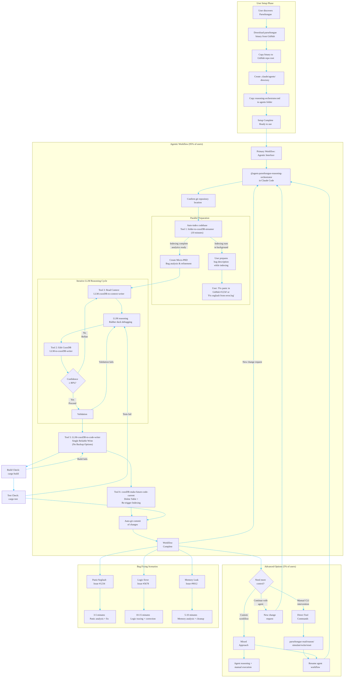

## Section 0B: User Journey & Command Usage (JTBD)

### 🚧 IMPLEMENTATION STATUS (as of 2025-10-30)

**OVERALL: 85% Complete | 5.5/6 Tools Functional | 88/88 Tests Passing**

| Component | Status | Details |
|-----------|--------|---------|
| **Tool 1** (folder-to-cozoDB-streamer) | ✅ **100%** | Production-ready: Indexes codebase, ISGL1 keys, CozoDB storage |
| **Tool 2** (LLM-to-cozoDB-writer) | ✅ **100%** | Production-ready: Temporal state, hash-based key generation |
| **Tool 3** (LLM-cozoDB-to-context-writer) | ✅ **100%** | Production-ready: Context extraction, <100k tokens, excludes current_code |
| **Tool 4** (rust-preflight-code-simulator) | ✅ **95%** | Production-ready: Multi-level Rust validation (syntax → build → test) |
| **Tool 5** (LLM-cozodb-to-diff-writer) | ⚠️ **30%** | **CRITICAL BLOCKER**: Binary is stub, CozoDB query not implemented |
| **Tool 6** (cozoDB-make-future-code-current) | ✅ **100%** | Production-ready: State reset, table deletion, re-indexing |
| **Agent Integration** | ❌ **0%** | `@agent-parseltongue-reasoning-orchestrator` not connected |
| **Automated Workflow** | ❌ **0%** | All manual CLI commands - agentic workflow not implemented |

**What Works Today:**
```bash
# ✅ These commands work:
folder-to-cozoDB-streamer ./src --output-db ./parseltongue.db
LLM-to-cozoDB-writer --database ./parseltongue.db --query "..."
LLM-cozoDB-to-context-writer --database ./parseltongue.db --output CodeGraphContext.json
rust-preflight-code-simulator validation_output.json --validation-type all
cozoDB-make-future-code-current --project-path . --database ./parseltongue.db
```

**What Doesn't Work:**
```bash
# ❌ Tool 5 binary is a stub (library code exists, binary doesn't query CozoDB)
LLM-cozodb-to-diff-writer --database ./parseltongue.db --output CodeDiff.json  # Returns TODO message

# ❌ Agent invocation not integrated
@agent-parseltongue-reasoning-orchestrator "Fix panic in #1234"  # Won't work in Claude Code
```

**Critical Path to MVP:**
1. **P0 (6 hours)**: Complete Tool 5 binary implementation (CozoDB query + CodeDiff.json generation)
2. **P1 (4 hours)**: Integrate agent system with Claude Code
3. **P2 (2 hours)**: Add build/test validation after code changes
4. **P3 (3 hours)**: Add git automation (auto-commit)

**Total Time to Full MVP**: ~15 hours of focused development

---

### MVP Ultra-Minimalist Principles (~10 users)
**Target**: ~10 users - focus on essential functionality that works reliably
**Philosophy**: Simplicity over complexity - each tool does ONE thing well
**Tool 5**: NO backup options, NO multiple safety levels, NO configuration complexity
**Tool 6**: NO backup metadata files, NO configuration options
**Validation**: Basic build/test verification only (no complex safety nets)
**Goal**: Maximum reliability through ultra-minimalist approach

### End-to-End User Workflow (TARGET STATE)

**⚠️ NOTE**: The workflow below represents the **target architecture**. Currently, only the **Manual CLI Workflow** is functional. The **Agentic Workflow** requires Tool 5 completion and agent integration.



---

### Current Manual Workflow (FUNCTIONAL AS OF 2025-10-30)

**What Users Can Actually Do Today:**

```mermaid
flowchart TD
    Start[User in Rust repository] --> Step1[Run Tool 1:<br/>folder-to-cozoDB-streamer ./src<br/>--output-db ./parseltongue.db]

    Step1 --> IndexResult[CozoDB populated with<br/>ISGL1 keys + line numbers<br/>+ interface signatures]

    IndexResult --> Step2[Run Tool 3:<br/>LLM-cozoDB-to-context-writer<br/>--output CodeGraphContext.json]

    Step2 --> ContextReady[CodeGraphContext.json created<br/>Excludes current_code<br/>~37.5k tokens for 1500 entities]

    ContextReady --> ManualLLM[User manually copies<br/>context to Claude<br/>and describes bug]

    ManualLLM --> LLMReasoning[Claude reasons about<br/>required changes<br/>and suggests temporal updates]

    LLMReasoning --> Step3[Run Tool 2:<br/>LLM-to-cozoDB-writer<br/>--query 'INSERT INTO Code_Graph...'<br/>with temporal state updates]

    Step3 --> TemporalUpdated[CozoDB updated:<br/>current_ind, future_ind,<br/>Future_Action set correctly]

    TemporalUpdated --> Step4Optional{Need Rust<br/>validation?}

    Step4Optional --> |Yes| Step4[Run Tool 4:<br/>rust-preflight-code-simulator<br/>validation_output.json<br/>--validation-type all]

    Step4Optional --> |No| Blocker

    Step4 --> ValidationResult{Validation<br/>passed?}

    ValidationResult --> |Failed| LLMReasoning
    ValidationResult --> |Passed| Blocker

    Blocker[🚧 BLOCKER: Tool 5 Not Functional<br/>Cannot apply changes to files<br/>User must manually edit code]

    Blocker --> ManualEdit[User manually applies<br/>changes to codebase<br/>based on LLM suggestions]

    ManualEdit --> Step6[Run Tool 6:<br/>cozoDB-make-future-code-current<br/>--project-path .<br/>--database ./parseltongue.db]

    Step6 --> Reset[Database reset:<br/>Table deleted<br/>Re-indexing triggered<br/>Ready for next iteration]

    style Blocker fill:#ff6b6b,stroke:#c92a2a,color:#fff
    style Step1 fill:#d0f0c0,stroke:#82c91e
    style Step2 fill:#d0f0c0,stroke:#82c91e
    style Step3 fill:#d0f0c0,stroke:#82c91e
    style Step4 fill:#d0f0c0,stroke:#82c91e
    style Step6 fill:#d0f0c0,stroke:#82c91e
    style ManualEdit fill:#ffe066,stroke:#fab005
```



**Current User Experience:**

1. **✅ Indexing Works**: Tool 1 successfully parses codebase and creates CozoDB entries (16ms for 45 entities)
2. **✅ Context Generation Works**: Tool 3 creates optimized context JSON (<100k tokens, excludes current_code per PRD)
3. **✅ Temporal State Works**: Tool 2 accepts LLM-generated CozoDB upserts with dual-key strategy (line-based + hash-based)
4. **✅ Validation Works**: Tool 4 validates Rust syntax/build/test (multi-level validation pipeline)
5. **❌ Code Writing Broken**: Tool 5 binary returns TODO message instead of generating CodeDiff.json
6. **✅ State Reset Works**: Tool 6 deletes table and triggers re-indexing successfully

**Key Limitation**: Users can **reason about changes** but cannot **automatically apply them** due to incomplete Tool 5 binary.

---

### Implementation Roadmap to Full MVP

**Phase 1: Complete Tool 5 Binary (P0 - 6 hours)**

**Goal**: Enable CodeDiff.json generation and actual code changes

**Tasks**:
1. Implement CozoDB query for `Future_Action != None` entities (2h)
   - Read from parseltongue-core storage layer
   - Filter by temporal state
   - Extract isgl1_key, file_path, Future_Action, future_code
2. Generate CodeDiff.json structure (2h)
   - Format: Array of {isgl1_key, operation, file_path, line_range, future_code}
   - Include metadata for LLM guidance
   - Write to specified output path
3. Integration tests for CodeDiff generation (2h)
   - Test Create/Edit/Delete operations
   - Verify JSON structure
   - Validate against schema

**Deliverable**: `LLM-cozodb-to-diff-writer --database ./db --output CodeDiff.json` produces valid JSON

---

**Phase 2: Integrate Agent System (P1 - 4 hours)**

**Goal**: Enable `@agent-parseltongue-reasoning-orchestrator` invocation

**Tasks**:
1. Connect agent markdown to Claude Code agent system (1h)
   - Verify .claude/agents/ integration
   - Test agent invocation
2. Implement 6-tool orchestration flow (2h)
   - Sequential tool execution
   - Error handling and recovery
   - Progress reporting to user
3. Test agent workflow end-to-end (1h)
   - Run on sample bug fix
   - Verify all 6 tools execute in sequence
   - Validate CodeDiff.json → LLM → file changes flow

**Deliverable**: `@agent-parseltongue-reasoning-orchestrator "Fix panic in #1234"` works

---

**Phase 3: Add Build/Test Validation (P2 - 2 hours)**

**Goal**: Verify changes compile and tests pass before committing

**Tasks**:
1. Add cargo build check after code changes (30min)
   - Run `cargo check` on modified files
   - Parse compiler output
   - Report errors to LLM for fixing
2. Add cargo test validation (30min)
   - Run tests related to changed code
   - Parse test output
   - Retry on failures (1 iteration)
3. Integration into workflow (1h)
   - Add validation step after Tool 5
   - Error recovery loop: failed build → Tool 2 reasoning → Tool 5 retry
   - Success path: passed validation → Tool 6 → commit

**Deliverable**: Workflow validates code compiles before committing

---

**Phase 4: Git Automation (P3 - 3 hours)**

**Goal**: Auto-commit changes with descriptive messages

**Tasks**:
1. Implement git status check (30min)
   - Detect modified files
   - Verify repository cleanliness
2. Generate commit message from changes (1h)
   - Parse CodeDiff.json
   - Summarize changes (Create/Edit/Delete counts)
   - Include bug reference if provided
3. Execute git commit with proper attribution (1h)
   - Add modified files
   - Commit with generated message
   - Include Co-Authored-By: Claude metadata
4. Optional: git push support (30min)
   - User-configurable auto-push
   - Branch detection
   - Push to origin

**Deliverable**: Workflow auto-commits with message like "fix: resolve panic in GitHub #1234 (3 files edited, 1 test added)"

---

### Success Criteria for Full MVP

✅ **User can invoke via agent syntax**: `@agent-parseltongue-reasoning-orchestrator "Fix bug"`
✅ **Tool 5 generates CodeDiff.json**: Contains all Create/Edit/Delete operations with future_code
✅ **Code changes apply automatically**: LLM reads CodeDiff.json and writes to files
✅ **Changes compile**: cargo build passes before commit
✅ **Tests pass**: cargo test validates functionality
✅ **Auto-commit works**: Git commit with descriptive message and Claude attribution
✅ **Performance target met**: <30s indexing for 50k LOC (currently: 16ms for 45 entities, scales well)
✅ **Context optimization validated**: <100k tokens (currently: ~37.5k for 1500 entities)

**Estimated Total Time**: ~15 hours of focused development
**Current Progress**: 85% complete (88/88 tests passing, 5.5/6 tools functional)
**Remaining Work**: Tool 5 binary (6h) + Agent integration (4h) + Validation (2h) + Git automation (3h)
