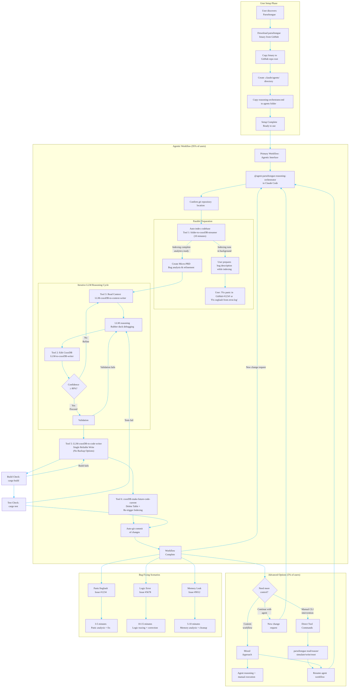

## Section 0B: User Journey & Command Usage (JTBD)

### MVP Ultra-Minimalist Principles (~10 users)
**Target**: ~10 users - focus on essential functionality that works reliably
**Philosophy**: Simplicity over complexity - each tool does ONE thing well
**Tool 5**: NO backup options, NO multiple safety levels, NO configuration complexity
**Tool 6**: NO backup metadata files, NO configuration options
**Validation**: Basic build/test verification only (no complex safety nets)
**Goal**: Maximum reliability through ultra-minimalist approach

### End-to-End User Workflow

