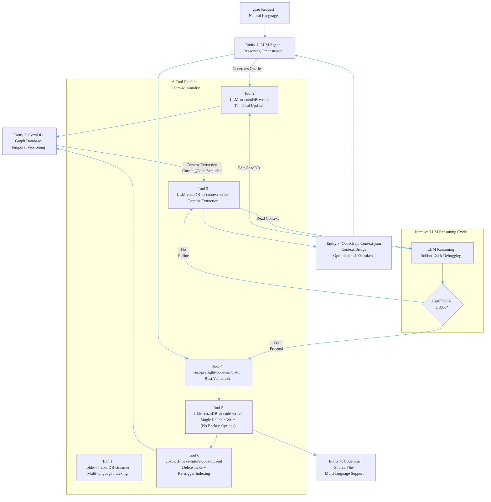
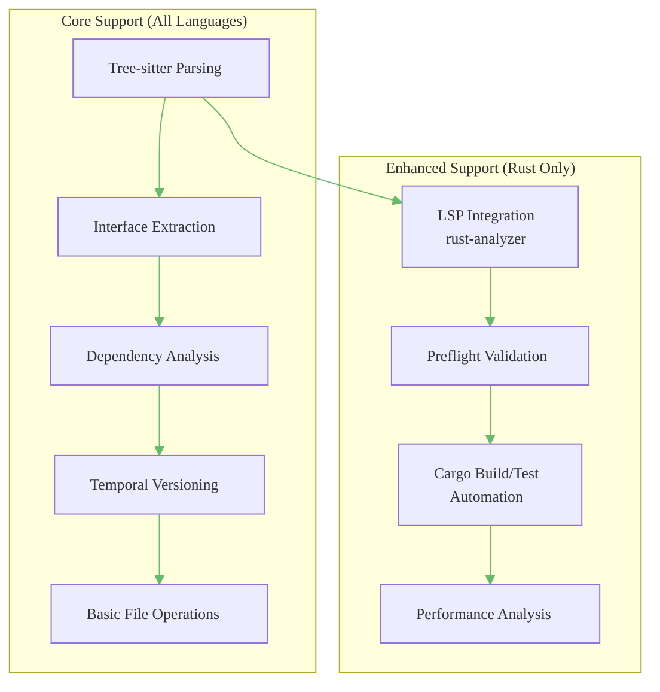
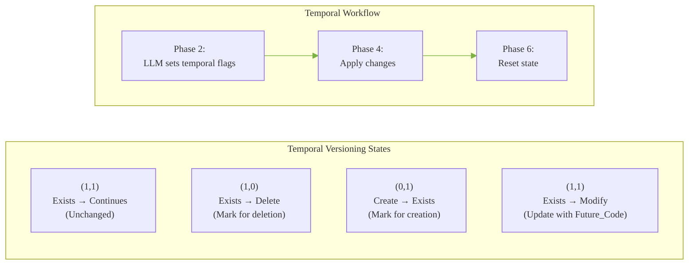
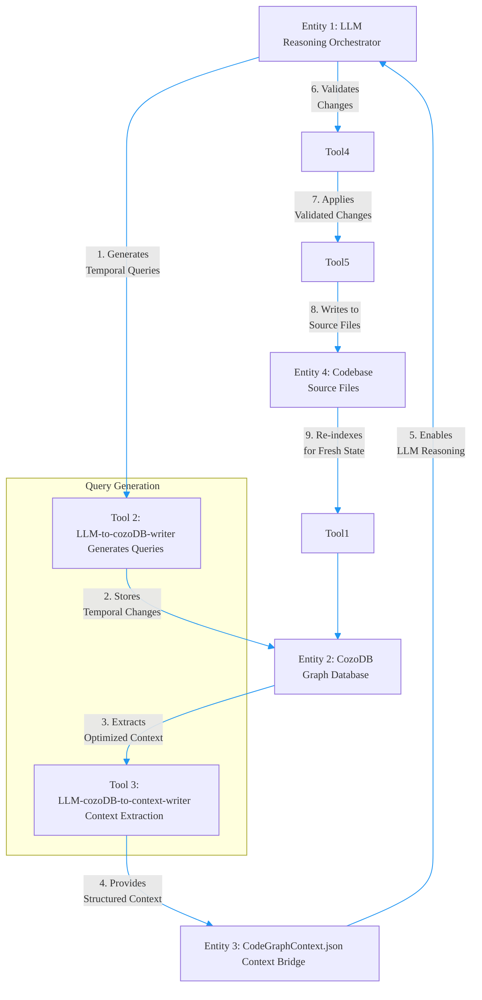
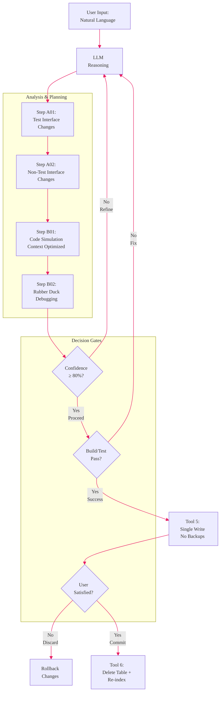
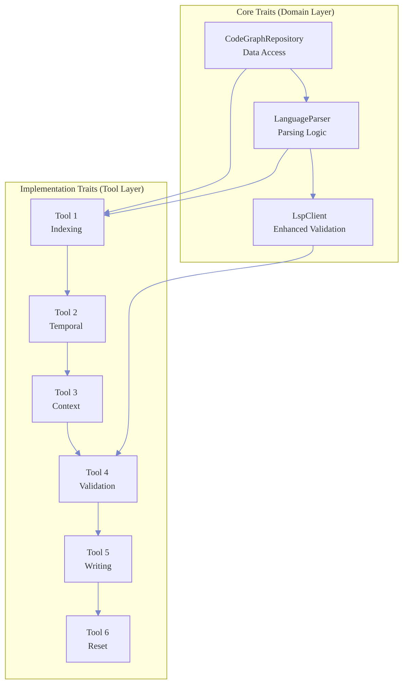

# Arch01MVP: Parseltong High-Level & Low-Level Design

## MVP Ultra-Minimalist Principles (~10 users)

**TARGET USERS**: ~10 people - focus on essential functionality that works reliably
**PHILOSOPHY**: Simplicity over complexity - each tool does ONE thing well and reliably

### **TOOL SIMPLICITY RULES:**

**Tool 5 (LLM-cozoDB-to-code-writer) - MINIMALIST:**
- NO backup options (MVP doesn't need them)
- NO multiple safety levels (complex to debug)
- NO configuration complexity (single reliable write operation)
- **SINGLE PURPOSE**: Write from CozoDB to files reliably
- **EASY DEBUGGING**: Clear, traceable operations
- **FOCUS**: Get the job done reliably, simply

**Tool 6 (cozoDB-make-future-code-current) - MINIMALIST:**
- NO backup metadata files (unnecessary complexity)
- NO configuration options (reset should be deterministic)
- **SINGLE PURPOSE**: Reset CodeGraph table + reingest folder
- **CLEAN OPERATION**: Delete current state, rebuild from source files
- **RELIABILITY**: Simpler = fewer failure points

## Executive Summary

Pure functional Rust implementation of Parseltong - a 6-tool pipeline for automated code modification with multi-language support and Rust-first enhanced capabilities. Built following TDD-first principles with executable specifications driving all development.

## Architecture Pyramid

### Layer 1: Requirements Foundation
```
.prdArchDocs/minimalPRD.md    → User Requirements & Journey
.prdArchDocs/PRD.md           → Technical Specifications
agent-parseltongue-reasoning-orchestrator.md → Workflow Orchestration
```

### Layer 2: System Architecture
```
Arch01MVP.md (This Document) → HLD → LLD → Interfaces → TDD
```

### Layer 3: Implementation
```
src/  → Pure functional Rust modules following steering docs principles
```

---

# High-Level Design (HLD)

## System Architecture Overview

Parseltong implements a **4-entity architecture** with a **6-tool pipeline** for automated code modification:



## 4-Entity Architecture

### **Entity 1: LLM (Reasoning Orchestrator)**
- **Role**: Natural language reasoning and change specification
- **Capabilities**: Generates all queries using CozoDbQueryRef.md patterns, manages iterative reasoning cycles
- **Limitation**: Cannot read CozoDB directly, requires context bridge
- **Context Optimization**: Excludes Current_Code to prevent context bloat

### **Entity 2: CozoDB (Graph Database)**
- **Role**: Passive storage with temporal versioning capabilities
- **Schema**: Stores CodeGraph with (current_ind, future_ind, Future_Action) flags
- **Behavior**: Responds to queries but cannot主动 reason
- **State Management**: Handles temporal versioning for safe code transitions

### **Entity 3: CodeGraphContext.json (Context Bridge)**
- **Role**: Structured context transfer between CozoDB and LLM
- **Contents**: ISGL1 + interface_signature + TDD_Classification + lsp_meta_data (Current_Code excluded)
- **Purpose**: Provides optimized context for LLM reasoning while preventing bloat
- **Size Limit**: Enforced < 100k tokens for reliable LLM operation

### **Entity 4: Codebase (Source Files)**
- **Role**: Actual code implementation across multiple languages
- **Processing**: Read by Tool 1, modified by Tool 5 with single reliable write
- **Language Support**: Tree-sitter based parsing for all supported languages with Rust-first enhancements
- **Operations**: Atomic modifications without backup complexity (ultra-minimalist)

## Multi-Language Strategy

**Core Principle**: Tree-sitter foundation with Rust-first enhancements



## Temporal Versioning System

**State Tracking in CozoDB:**



## Data Flow Architecture

**4-Entity Communication Pattern:**



## Control Flow Architecture

**Ultra-Minimalist Decision Flow:**



## Interface Reasoning Within Crates

**API Communication Patterns:**

```mermaid
---
config:
  flowchart:
    defaultRenderer: "dagre"
  themeVariables:
    primaryColor: "#fff8e1"
    primaryTextColor: "#f57c00"
    primaryBorderColor: "#ff9800"
    lineColor: "#ffa726"
    secondaryColor: "#e8f5e8"
    tertiaryColor: "#e3f2fd"
    background: "#ffffff"
    fontFamily: "Arial, sans-serif"
    fontSize: "13px"
---
flowchart TD
    subgraph CrateStructure ["Crate: lib.rs"]
        direction TB
        PublicAPI["Public API<br/>crate::"]
        ModInternal["Internal Modules<br/>mod internal/"]
        ModUtils["Utils<br/>mod utils/"]
        ModTypes["Types<br/>mod types/"]
    end

    subgraph InterfaceFlows ["Interface Communication"]
        direction LR
        ClientAPI["Client API<br/>External Interface"] --> InternalAPI["Internal API<br/>Crate Internal"]
        InternalAPI --> CrossModule["Cross-Module<br/>Module Communication"]
        CrossModule --> PrivateAPI["Private API<br/>Module Private"]
    end

    subgraph ReasoningPatterns ["Reasoning Patterns"]
        direction TB
        Builder["Builder Pattern<br/>Complex Construction"] --> Factory["Factory Pattern<br/>Object Creation"]
        Factory --> Strategy["Strategy Pattern<br/>Algorithm Selection"]
        Strategy -> Observer["Observer Pattern<br/>Event Handling"]
    end

    PublicAPI --> ClientAPI
    ModInternal --> CrossModule
    ModTypes --> PrivateAPI
```

**Trait-Based Architecture:**



## Module Organization (Ultra-Minimalist)

**Layered Architecture:**
```
src/
├── lib.rs                    # Library root with public API
├── domain/                   # Core domain models (L1)
│   ├── entities/            # 4-entity implementations
│   ├── code_graph/          # CodeGraph data structures
│   └── temporal/            # Temporal versioning logic
├── infrastructure/           # External dependencies (L3)
│   ├── cozo/                # CozoDB client
│   ├── tree_sitter/         # Parsing integration
│   └── lsp/                 # Language Server Protocol
├── tools/                    # 6-tool implementations (L2)
│   ├── tool1_indexing/
│   ├── tool2_temporal/
│   ├── tool3_context/
│   ├── tool4_validation/
│   ├── tool5_writing/
│   └── tool6_reset/
└── cli/                      # Command line interface
```

## Data Structures (Ultra-Minimalist)

**Core Domain Models:**
- **CodeGraph**: Entity collection with temporal state tracking
- **CodeEntity**: Individual code component with versioning
- **Context Bridge**: Optimized data transfer between entities
- **Temporal State**: Versioning and change tracking

**Memory Management Principles:**
- **String Interning**: Use `Arc<str>` for memory efficiency
- **Graph Storage**: Stable data structures for consistency
- **Thread Safety**: Concurrent access with proper synchronization
- **Resource Management**: RAII patterns for automatic cleanup

## Error Handling Strategy (Ultra-Minimalist)

**Simplified Error Handling**:
- **Library Errors**: `thiserror` for clean error definitions
- **Application Errors**: `anyhow` for user-facing error messages
- **Error Recovery**: Clear error messages with actionable guidance
- **No Complex Error Chaining**: Simple, direct error propagation

## Performance Optimization (Ultra-Minimalist)

**Validated Performance Targets**:
- **Indexing**: <30s for 50k LOC (proven from archive)
- **Context Generation**: <500ms for 1500 interfaces
- **Query Response**: <1ms for complex traversals
- **Memory Usage**: <1GB for large codebases
- **Concurrent Operations**: Thread-safe with minimal contention

**Performance Principles**:
- **Lazy Evaluation**: Process only when needed
- **Memory Efficiency**: String interning and structural sharing
- **Deterministic Performance**: Predictable operation times
- **Zero-Copy Operations**: Avoid unnecessary allocations

---

# Interface Signatures (Ultra-Minimalist)

## Core Traits (Dependency Injection)

**Domain Layer Interfaces (L1)**:
- **CodeGraphRepository**: Data access and storage operations
- **LanguageParser**: Parsing and interface extraction
- **LspClient**: Enhanced validation and metadata extraction

**Tool Interfaces (L2)**:
- **Tool**: Universal interface for all 6 tools
- **Validation**: Input validation and output verification
- **Execution**: Clean execution with result handling

**Interface Design Patterns**:
- **Dependency Injection**: Enable test doubles and modularity
- **Resource Management**: RAII patterns with automatic cleanup
- **Error Propagation**: Type-safe error handling throughout
- **Clone-on-Write**: Shared state management where needed

## Tool 1: folder-to-cozoDB-streamer (Ultra-Minimalist)

**Purpose**: Multi-language code indexing with tree-sitter parsing

**Core Responsibilities**:
- Parse source files using tree-sitter grammars
- Extract interface signatures and metadata
- Store entities in CozoDB graph database
- Support all tree-sitter supported languages
- Optional LSP metadata for Rust projects

**Ultra-Minimalist Approach**:
- Single reliable indexing operation
- No backup or snapshot complexity
- Direct file system operations
- Memory-efficient streaming processing

## Tool 2: LLM-to-cozoDB-writer (Ultra-Minimalist)

**Purpose**: Temporal versioning and database updates

**Core Responsibilities**:
- Apply LLM-generated temporal changes to CozoDB
- Manage (current_ind, future_ind, Future_Action) flags
- Handle Create, Edit, Delete operations
- Ensure data consistency during updates

**Ultra-Minimalist Approach**:
- Simple temporal state management
- Direct database operations
- No complex rollback mechanisms
- Clear success/failure indicators

## Tool 3: LLM-cozoDB-to-context-writer (Ultra-Minimalist)

**Purpose**: Context extraction and LLM communication bridge

**Core Responsibilities**:
- Extract optimized context from CozoDB for LLM reasoning
- Enforce context size limits (< 100k tokens)
- Provide structured data transfer between entities
- Exclude Current_Code to prevent bloat

**Ultra-Minimalist Approach**:
- Context optimization as core principle
- Size enforcement for reliability
- Simple data structure conversion
- No complex context manipulation

## Tool 4: rust-preflight-code-simulator (Ultra-Minimalist)
**Purpose**: Essential validation pipeline for proposed changes

**Core Responsibilities**:
- Parse future code entities for syntax validation
- Execute `cargo build` for compilation checking
- Execute `cargo test` for functionality verification
- Provide clear success/failure indicators

**Ultra-Minimalist Approach**:
- Three validation levels: Syntax → Build → Test
- No performance profiling or complex metrics
- Auto-detect Rust vs other languages
- Simple pass/fail results with actionable errors

## Tool 5: LLM-cozoDB-to-code-writer (Ultra-Minimalist)
**Purpose**: Apply validated changes to the file system

**Core Responsibilities**:
- Write Future_Code to actual files
- Handle Create, Modify, Delete operations
- Ensure file system consistency
- Single reliable write operation

**Ultra-Minimalist Approach**:
- NO backup options or file versioning
- NO multiple safety levels or rollbacks
- Direct file system operations
- Changes persist or fail clearly

## Tool 6: cozoDB-make-future-code-current (Ultra-Minimalist)
**Purpose**: Reset temporal state and prepare for next iteration

**Core Responsibilities**:
- Delete CodeGraph table in CozoDB
- Reset all temporal indicators to current state
- Trigger re-indexing with Tool 1
- Maintain clean state management

**Ultra-Minimalist Approach**:
- NO backup metadata files or snapshots
- NO configuration options or complexity
- Delete table → Re-index → Complete
- Clean state for each iteration

---

# TDD Strategy (Ultra-Minimalist)

## Essential Testing Philosophy

**Ultra-Minimalist Testing Principles**:
- **Build verification**: `cargo build` must pass
- **Functionality verification**: `cargo test` must pass
- **No complex mocking**: Use real implementations when possible
- **Clear failure indicators**: Tests either pass or fail with obvious reasons

## Test Structure (Simplified)

```
src/
├── tests/                    # Integration tests only
│   ├── end_to_end/          # Full workflow validation
│   └── test_data/           # Simple test fixtures
└── tools/                   # Tool-specific tests
    └── tool*_tests/         # Basic functionality tests
```

## Core Test Requirements

### 1. Tool Execution Tests
- **Tool 1**: Verify indexing completes without errors
- **Tool 2**: Verify temporal state updates correctly
- **Tool 3**: Verify context generation within size limits
- **Tool 4**: Syntax → Build → Test validation pipeline
- **Tool 5**: File operations succeed or fail clearly
- **Tool 6**: Database reset and re-indexing works

### 2. Integration Tests
- **End-to-end workflow**: File → Database → LLM → File → Reset
- **Temporal consistency**: current_ind/future_ind transitions work correctly
- **Memory constraints**: Context generation stays under 100k tokens

### 3. Performance Guards
- **Indexing timeout**: Fail if > 30 seconds for 50k LOC
- **Memory limits**: Fail if > 1GB memory usage
- **Build validation**: All `cargo build` operations must complete

## Ultra-Minimalist Test Approach

**No Complex Test Patterns**:
- ❌ No extensive mocking frameworks
- ❌ No complex test factories or builders
- ❌ No performance benchmarking suites
- ❌ No property-based testing
- ❌ No fuzzy testing

**Simple Validation Only**:
- ✅ Basic unit tests for core functionality
- ✅ Integration tests for complete workflows
- ✅ Build and test execution validation
- ✅ Clear error message verification

**Test Execution Philosophy**:
- **Tests pass**: Implementation works correctly
- **Tests fail**: Clear error messages guide fixes
- **No middle ground**: Avoid complex partial success states

---

# Implementation Timeline

## Phase 1: Foundation (Week 1)
1. **Core types and traits** - Define all interfaces and domain models
2. **Infrastructure layer** - CozoDB, tree-sitter, LSP clients
3. **Error handling** - Implement comprehensive error types
4. **Test framework** - Set up testing infrastructure and mocks

## Phase 2: Core Pipeline (Week 2)
1. **Tool 1 (Indexing)** - File traversal and parsing
2. **Tool 6 (Reset)** - State management and git integration
3. **End-to-end basic workflow** - File → Database → Reset

## Phase 3: Intelligence Layer (Week 3)
1. **Tool 2 (Temporal)** - Temporal versioning logic
2. **Tool 3 (Context)** - Context generation and LLM bridge
3. **Mock LLM integration** - Basic reasoning workflow

## Phase 4: Validation Layer (Week 4)
1. **Tool 4 (Validation)** - Rust-specific validation
2. **Tool 5 (Writing)** - File writing and safety
3. **Complete workflow** - Full end-to-end functionality

## MVP Success Criteria (Ultra-Minimalist)

### Essential Functionality (~10 users)
- ✅ All 6 tools execute reliably for bug fixing workflows
- ✅ Complete workflow: Indexing → Reasoning → Validation → Writing → Reset
- ✅ Rust project support with basic validation
- ✅ Multi-language parsing via tree-sitter (fallback support)
- ✅ Temporal versioning for safe code modifications

### Performance Targets (Proven from Archive)
- ✅ <30s indexing for 50k LOC codebase
- ✅ <1GB memory usage for large codebases
- ✅ Build verification: `cargo build` succeeds
- ✅ Test verification: `cargo test` succeeds

### Ultra-Minimalist Quality Standards
- ✅ No backup complexity in any tool
- ✅ Single reliable operation per tool
- ✅ Clear success/failure indicators
- ✅ Essential error handling only
- ✅ Build and test execution validation

**MVP Validation**: Successfully fixes common Rust bugs (panics, segfaults, logic errors) using the 6-tool pipeline with ultra-minimalist complexity.

This architecture delivers the core Parseltongue MVP functionality while maintaining strict adherence to ultra-minimalist principles: each tool does ONE thing well and reliably, with no backup options or configuration complexity.