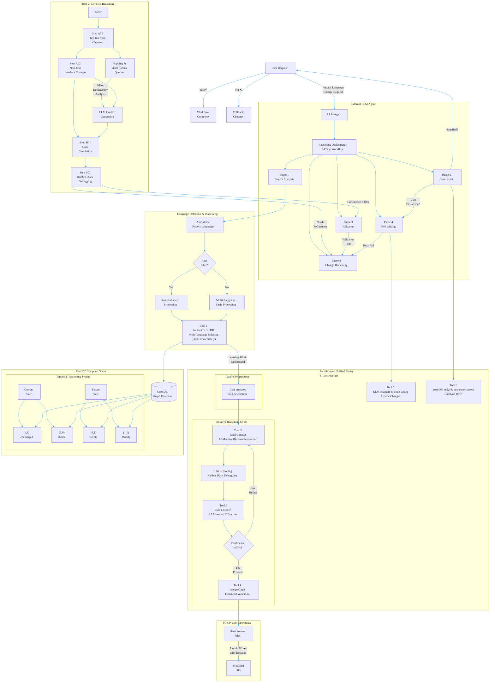

# Parseltongue PRD - Unified Document

## Section 0: Visual Architecture Overview

### Complete System Workflow



### Temporal Versioning System Explained

**Core Innovation**: Time-based state tracking directly in CozoDB

| State | current_ind | future_ind | Meaning | Action |
|-------|-------------|------------|---------|--------|
| **Exists→Continues** | 1 | 1 | Code exists now and will continue | No change needed |
| **Exists→Delete** | 1 | 0 | Code exists now but will be removed | Mark for deletion |
| **Create→Exists** | 0 | 1 | Code doesn't exist but will be created | Create new code |
| **Exists→Modified** | 1 | 1 | Code exists and will be modified | Update with Future_Code |

**State Transition Flow**:
```
Phase 2: LLM sets (current_ind, future_ind, Future_Code, Future_Action)
Phase 4: Apply changes → Files reflect future state
Phase 5: Reset database → (1,1, current_code=Future_Code, future_ind=1)
```

### Hopping & Blast Radius Integration

**Built into cozo-to-context-writer** (not a separate tool):

```bash
# LLM generates these queries via cozo-to-context-writer:
parseltongue reason --query "
  ?[entity, hop_distance, dependency_type] :=
    *changed_entity[base_entity],
    *dependency_graph[base_entity, intermediate],
    *dependency_graph[intermediate, entity],
    hop_distance <= 3
" --context-filter "Future_Action != None"
```

**Query Capabilities**:
- **1-hop**: Direct dependencies only
- **2-hop**: Dependencies of dependencies
- **N-hop**: Configurable depth analysis
- **Blast Radius**: All entities affected by changes
- **Context Filtering**: Only load relevant code for LLM reasoning

### External Agent Philosophy

**Smart Orchestration, Simple Tools**:
- **LLM handles complexity**: Change reasoning, query generation, validation
- **Tools handle execution**: Deterministic, focused operations
- **Clean separation**: External reasoning vs internal tool execution
- **User interaction**: Conversational workflow with confirmation points

**Integration Points**:
1. **Natural Language → Structured Query** (Phase 2)
2. **Query Results → LLM Context** (Phase 2)
3. **LLM Reasoning → Tool Commands** (All phases)
4. **Tool Results → User Feedback** (All phases)

This architecture enables sophisticated code modification while keeping each tool simple, focused, and reliable.

## Section 0B: User Journey & Command Usage (JTBD)

### End-to-End User Workflow

```mermaid
---
config:
  flowchart:
    defaultRenderer: "dagre"
  themeVariables:
    primaryColor: "#f0f9ff"
    primaryTextColor: "#0c4a6e"
    primaryBorderColor: "#0ea5e9"
    lineColor: "#38bdf8"
    secondaryColor: "#f0fdf4"
    tertiaryColor: "#fefce8"
    quaternaryColor: "#fff7ed"
    background: "#ffffff"
    fontFamily: "Arial, sans-serif"
    fontSize: "13px"
---
flowchart TD
    subgraph Setup ["User Setup Phase"]
        Start["User discovers<br/>Parseltongue"] --> Download["Download parseltongue<br/>binary from GitHub"]
        Download --> CopyBinary["Copy binary to<br/>GitHub repo root"]
        CopyBinary --> CreateAgents["Create .claude/agents/<br/>directory"]
        CreateAgents --> CopyAgent["Copy reasoning-orchestrator.md<br/>to agents folder"]
        CopyAgent --> SetupComplete["Setup Complete<br/>Ready to use"]
    end

    SetupComplete --> PrimaryWorkflow["Primary Workflow:<br/>Agentic Interface"]

    subgraph PrimaryPath ["Agentic Workflow (95% of users)"]
        PrimaryWorkflow --> ClaudeStart["@agent-parseltongue-reasoning-orchestrator<br/>in Claude Code"]
        ClaudeStart --> RepoConfirm["Confirm git repository<br/>location"]
        RepoConfirm --> AutoIndex["Auto-index codebase<br/>Tool 1: folder-to-cozoDB-streamer<br/>(10 minutes)"]

        subgraph ParallelPreparation ["Parallel Preparation"]
            AutoIndex --> |"Indexing runs<br/>in background"| UserThinking["User prepares<br/>bug description<br/>while indexing"]
            UserThinking --> NaturalRequest["User: 'Fix panic in<br/>GitHub #1234' or<br/>'Fix segfault from error.log'"]
            AutoIndex --> |"Indexing complete<br/>analytics ready"| MicroPRD["Create Micro-PRD<br/>Bug analysis & refinement"]
        end

        subgraph IterativeReasoning ["Iterative LLM Reasoning Cycle"]
            MicroPRD --> Tool3Read["Tool 3: Read Context<br/>LLM-cozoDB-to-context-writer"]
            Tool3Read --> LLMReason["LLM reasoning<br/>Rubber duck debugging"]
            LLMReason --> Tool2Edit["Tool 2: Edit CozoDB<br/>LLM-to-cozoDB-writer"]
            Tool2Edit --> ConfidenceCheck{"Confidence<br/>≥ 80%?"}
            ConfidenceCheck --> |"No<br/>Refine"| Tool3Read
            ConfidenceCheck --> |"Yes<br/>Proceed"| Validation
        end

        Validation --> Tool5["Tool 5: LLM-cozoDB-to-code-writer<br/>Write changes"]
        Tool5 --> Tool6["Tool 6: cozoDB-make-future-code-current<br/>State reset"]
        Tool6 --> GitCommit["Auto-git commit<br/>of changes"]
        GitCommit --> AgentSuccess["Workflow<br/>Complete"]
    end

    subgraph AdvancedOptions ["Advanced Options (5% of users)"]
        AgentSuccess --> AdvancedChoice{Need more<br/>control?}
        AdvancedChoice --> |"Manual CLI<br/>intervention"| CliPath["Direct Tool<br/>Commands"]
        AdvancedChoice --> |"Custom<br/>workflow"| MixedPath["Mixed<br/>Approach"]
        AdvancedChoice --> |"Continue with<br/>agent"| NewRequest["New change<br/>request"]

        CliPath --> ManualTools["parseltongue read/reason/<br/>simulate/write/reset"]
        MixedPath --> HybridTools["Agent reasoning +<br/>manual execution"]

        ManualTools --> ResumeAgent["Resume agent<br/>workflow"]
        MixedPath --> ResumeAgent
        ResumeAgent --> ClaudeStart
    end

    subgraph CommonScenarios ["Bug Fixing Scenarios"]
        AgentSuccess --> Scenario1["Panic/Segfault<br/>Issue #1234"]
        AgentSuccess --> Scenario2["Logic Error<br/>Issue #5678"]
        AgentSuccess --> Scenario3["Memory Leak<br/>Issue #9012"]

        Scenario1 --> TimeEstimate1["3-5 minutes<br/>Panic analysis + fix"]
        Scenario2 --> TimeEstimate2["10-15 minutes<br/>Logic tracing + correction"]
        Scenario3 --> TimeEstimate3["5-10 minutes<br/>Memory analysis + cleanup"]
    end

    %% Feedback loops
    AgentSuccess --> |"New change request"| ClaudeStart
    NewRequest --> ClaudeStart

    %% Error handling and recovery loops
    Validation --> |"Validation fails"| LLMReason
    Tool5 --> BuildCheck["Build Check:<br/>cargo build"]
    BuildCheck --> |"Build fails"| Tool5
    BuildCheck --> TestCheck["Test Check:<br/>cargo test"]
    TestCheck --> |"Tests fail"| LLMReason
    TestCheck --> RuntimeCheck["Runtime Check:<br/>Integration tests"]
    RuntimeCheck --> |"Runtime errors"| Tool5
    RuntimeCheck --> PerformanceCheck["Performance Check:<br/>Benchmarks"]
    PerformanceCheck --> |"Performance regression"| LLMReason
    PerformanceCheck --> LinterCheck["Linter Check:<br/>clippy/rustfmt"]
    LinterCheck --> |"Linter errors"| Tool5
    LinterCheck --> CICheck["CI/CD Check:<br/>Pipeline validation"]
    CICheck --> |"Pipeline fails"| Tool5
    CICheck --> GitCommit["Auto-git commit<br/>of changes"]

    %% Note: Manual CLI workflow follows similar error handling patterns
  %% with appropriate tool references for direct command usage
```



### Command Usage Reference

#### **Primary Interface: Bug Fixing Workflow (95% of users)**
```bash
# Interactive conversational interface - designed for bug fixing
@agent-parseltongue-reasoning-orchestrator "Fix panic in GitHub #1234"

# Or provide error details directly
@agent-parseltongue-reasoning-orchestrator "Fix segfault from error.log: thread 'main' panicked at 'src/main.rs:42:5'"

# Or describe the issue
@agent-parseltongue-reasoning-orchestrator "Fix memory leak in database connection pool - connections not being dropped"
```

#### **Advanced Options (5% of users)**
The agent workflow includes optional manual intervention for specific needs:

```bash
# Manual tool commands (for power users who need direct control)
parseltongue read ./src --parsing-library tree-sitter --chunking-method ISGL1 --output-db ./parseltongue.db
parseltongue reason --query "context extraction query" --database ./parseltongue.db
parseltongue simulate validation_output.json --validation-type all --timeout 300
parseltongue write validation_output.json --database ./parseltongue.db --backup-dir ./backups
parseltongue reset --project-path . --database ./parseltongue.db

# Mixed approach (agent reasoning + manual execution)
@agent-parseltongue-reasoning-orchestrator "Analyze impact of changing auth system"
# Review agent analysis, then execute specific commands as needed
```

### Jobs To Be Done (JTBD)

| **Bug Type** | **Primary: Agent Workflow** | **Advanced: Manual CLI** | **Power Users: Mixed Approach** |
|------------|----------------------------|--------------------------|---------------------------|
| **Panic/Segfault** | ✅ Primary use case - crash analysis | ⚠️ For specific manual debugging | ⚠️ For custom debugging strategies |
| **Logic Errors** | ✅ Root cause analysis + fix | ⚠️ For precise tracing | ⚠️ For complex logic flows |
| **Memory Issues** | ✅ Leak detection + cleanup | ⚠️ For manual memory profiling | ⚠️ For custom optimization |
| **Build Errors** | ✅ Dependency/compilation fixes | ✅ For specific build steps | ❌ Overkill for simple builds |
| **Test Failures** | ✅ Test debugging + fixes | ⚠️ For specific test scenarios | ⚠️ For custom test strategies |
| **Performance Issues** | ✅ Bottleneck analysis + optimization | ⚠️ For manual profiling | ✅ For custom optimization |
| **Security Vulnerabilities** | ✅ Vulnerability analysis + patch | ⚠️ For specific security checks | ⚠️ For custom security workflows |
| **Multiple Bug Fixes** | ❌ One bug at a time | ✅ Scriptable batch fixes | ✅ Custom batch workflows |

### Setup Instructions

#### **Apple Silicon (Recommended)**
```bash
# 1. Download the Apple Silicon binary
curl -L https://github.com/that-in-rust/parseltongue/releases/latest/download/parseltongue-apple-silicon -o parseltongue
chmod +x parseltongue

# 2. Copy to your GitHub repository
cp parseltongue /path/to/your/repo/

# 3. Create Claude agents directory
mkdir -p /path/to/your/repo/.claude/agents/

# 4. Copy the orchestrator agent
cp agent-parseltongue-reasoning-orchestrator.md /path/to/your/repo/.claude/agents/

# 5. Add to .gitignore
echo ".parseltongue/" >> /path/to/your/repo/.gitignore
echo "backups/" >> /path/to/your/repo/.gitignore

# 6. Install via Homebrew (optional)
brew install that-in-rust/tap/parseltongue
```

#### **Linux/Other Platforms**
```bash
# 1. Compile from source
git clone https://github.com/that-in-rust/parseltongue.git
cd parseltongue
cargo build --release
cp target/release/parseltongue /path/to/your/repo/

# 2. Continue with steps 3-5 from above
```

## Executive Summary

**User Segment**: Apple Silicon developers fixing bugs and issues in multi-language codebases with Rust-first enhanced support

**Language Support**: Tree-sitter based parsing for all supported languages, with enhanced LSP integration and validation for Rust projects

**Primary Use Case**: Bug fixing and issue resolution with precise problem definitions from GitHub issues, error logs, and stack traces across tree-sitter supported languages

**Platform Strategy**:
- **Primary**: Apple Silicon (M1/M2/M3) with pre-compiled binaries and Homebrew support
- **Secondary**: Linux/Unix via source compilation (self-serve, community-supported)
- **Windows**: Not supported (strategic focus on Unix-like environments)

**Strategic Rationale for Bug-Fixing Focus**:
- **Precise Problem Definition**: Bugs include error messages, stack traces, and reproduction steps
- **Clear Success Criteria**: Bug is fixed when error no longer occurs and tests pass
- **Direct Value**: Bug resolution is a primary developer task
- **Technical Fit**: Error analysis, pattern matching, and code generation align with LLM capabilities
- **Measurable Results**: Before/after comparison is verifiable
- **Automated Patterns**: Common bug types can be addressed systematically across languages

**Strategic Rationale for Multi-Language Foundation**:
- **Tree-Sitter Architecture**: Language-agnostic parsing foundation supports all tree-sitter compatible languages
- **Unified Interface**: Consistent workflow across different programming languages
- **Future-Proof Design**: Easy addition of new language LSP integrations without architectural changes
- **Developer Reality**: Most projects involve multiple languages; unified tooling provides efficiency
- **Graceful Degradation**: Core functionality available for all languages, enhanced features for Rust

**Strategic Rationale for Apple Silicon Focus**:
- **Unified Hardware**: Consistent performance across M1/M2/M3 with unified memory architecture
- **Developer Concentration**: Multi-language developers commonly use MacBooks
- **Simplified Distribution**: Single binary target, Homebrew integration
- **Performance**: ARM architecture provides good performance for static analysis across languages
- **Support Focus**: Resources concentrated on one platform initially

**Reliability-First Principle**:
- Optimize for accurate 1-go fixes that feel trustworthy and increase user efficacy
- Prefer CPU-bound static analysis (tree-sitter parsing, rust-analyzer overlays, ISG traversals) and small, local, free subagents
- Keep the reasoning LLM as lean and late as possible; minimize context/tokens; use deterministic transforms whenever feasible

**Product Philosophy**:
- **Shreyas Doshi**: Prioritize first-apply correctness over speed. Design for clarity, safety, and explicit confidence gating. Time is a secondary outcome.
- **Jeff Dean**: Make correctness the fast path. Push work to deterministic, cacheable computations (ISG, tree-sitter, RA, HNSW). Parallelize retrieval/validation; minimize token movement; measure token-per-fix and cache hit rates.

**User Promise**: "When I encounter a code bug, the system produces a single-pass, safe, minimal diff that compiles and (when present) passes tests before applying. For Rust projects, this includes full LSP-enhanced validation; for other languages, core parsing and analysis is provided. Speed is a byproduct; correctness is the KPI"

## Local Folder Architecture

### Core Philosophy

- **Folder-First**: Process local Rust codebases via direct folder input
- **No Default Values**: Every argument must be explicitly specified
- **Pure Functions**: Deterministic input → output transformations
- **Streaming Architecture**: Process data in chunks, never load entire datasets
- **Zero Configuration**: All parameters passed via CLI

### Global Options (All Tools)

```bash
--project-path <PATH>         # Path to Rust project (required)
--help, -h                     # Show help
--version                      # Show version
```

**Note**: All tools provide verbose output by default for transparency and debugging.

## Section 01: Command-Summary

### Overview
This section provides a high-level command reference for the unified `parseltongue` binary with its 6 subcommands. For detailed specifications, see Section 02: Individual Tool Specifications.

**Unified Binary Architecture:**
The `parseltongue` binary consolidates all 6 tools into a single executable with subcommands, similar to `git` and `cargo`. Each tool can be invoked as a subcommand while maintaining its exact CLI interface.

**Multi-Language Support:**
- **Core Tools (1,2,3,5,6)**: Work with any tree-sitter supported language
- **Enhanced Tool (4)**: Rust-specific preflight validation with LSP integration
- **Automatic Detection**: System detects project languages and applies appropriate processing

### Tool Commands Matrix

#### folder-to-cozoDB-streamer
```bash
parseltongue folder-to-cozoDB-streamer <FOLDER_PATH> --parsing-library <LIBRARY> --chunking-method <METHOD> --output-db <DATABASE_PATH>

# Required Arguments:
<FOLDER_PATH>               # Local folder path containing code (any tree-sitter supported language)
--parsing-library <LIBRARY> # Parser: tree-sitter (supports all tree-sitter grammars)
--chunking-method <METHOD>  # Chunking: ISGL1 (Interface-level), 300-sentences (Text-level)
--output-db <DATABASE_PATH> # CozoDB database path

# Examples:
parseltongue folder-to-cozoDB-streamer /path/to/rust/repo --parsing-library tree-sitter --chunking-method ISGL1 --output-db ./parseltongue.db
parseltongue folder-to-cozoDB-streamer /path/to/python/project --parsing-library tree-sitter --chunking-method ISGL1 --output-db ./parseltongue.db
parseltongue folder-to-cozoDB-streamer /path/to/mixed/project --parsing-library tree-sitter --chunking-method ISGL1 --output-db ./parseltongue.db
```


#### LLM-to-cozoDB-writer
```bash
parseltongue LLM-to-cozoDB-writer --query-temporal <TEMPORAL_QUERY> --database <DATABASE_PATH>

# Required Arguments:
--query-temporal <TEMPORAL_QUERY>  # Temporal upsert query using CozoDbQueryRef.md patterns
--database <DATABASE_PATH>         # CozoDB database path

# Example:
parseltongue LLM-to-cozoDB-writer --query-temporal "?[entity_id, current_ind, future_ind, future_code] := [('new_func', 0, 1, 'pub fn new_func() { ... }', 'Create')]" --database ./parseltongue.db
```

#### LLM-cozoDB-to-context-writer
```bash
parseltongue LLM-cozoDB-to-context-writer --query <COZO_QUERY> --database <DATABASE_PATH> --output-context <JSON_FILE>

# Required Arguments:
--query <COZO_QUERY>         # CozoDB query string (see CozoDbQueryRef.md)
--database <DATABASE_PATH>   # CozoDB database path
--output-context <JSON_FILE> # Output JSON context file for LLM (default: CodeGraphContext.json)

# Example:
parseltongue LLM-cozoDB-to-context-writer --query "?[ISGL1, interface_signature, TDD_Classification] := *Code_Graph[ISGL1, _, interface_signature, TDD_Classification]" --database ./parseltongue.db --output-context CodeGraphContext.json
```

#### rust-preflight-code-simulator
```bash
parseltongue rust-preflight-code-simulator <SIMULATION_OUTPUT> --validation-type <TYPE> --timeout <SECONDS>

# Required Arguments:
<SIMULATION_OUTPUT>          # Path to temporal simulation output from Tools 2-3
--validation-type <TYPE>     # Type: compile, check-types, check-borrow, all
--timeout <SECONDS>          # Timeout in seconds
```

#### LLM-cozoDB-to-code-writer
```bash
parseltongue LLM-cozoDB-to-code-writer <VALIDATION_OUTPUT> --database <DATABASE_PATH> [--backup-dir <PATH>]

# Required Arguments:
<VALIDATION_OUTPUT>          # Path to validation output from Tool 4 (or Tool 3 for non-Rust)
--database <DATABASE_PATH>   # CozoDB database path

# Optional Arguments:
--backup-dir <PATH>          # Backup directory (default: no backups for simplicity)
--safety-level <LEVEL>       # Safety level: basic, standard, strict (default: basic)
```

#### cozoDB-make-future-code-current
```bash
parseltongue cozoDB-make-future-code-current reset --project-path <PATH> --database <DATABASE_PATH>

# Required Arguments:
--project-path <PATH>         # Path to project directory

# Optional Arguments:
--backup-dir <PATH>            # Metadata backup directory (default: .parseltongue/metadata-backups)
--skip-backup                  # Skip metadata backup (not recommended)
--git-integrated               # Enable Git integration (default: true)
```

### Global Options (All Tools)
```bash
--project-path <PATH>    # Path to project directory (required)
--language-detect        # Auto-detect project languages (default: enabled)
--quiet, -q              # Minimal output
--help, -h               # Show help
--version                # Show version
```

## Section 02 Parseltongue Architecture Overview

### Core Design Philosophy

**External Orchestration + 4-Entity Architecture**
- **External Agent**: `agent-parseltongue-reasoning-orchestrator.md` handles complex reasoning and workflow orchestration (located in `.claude/agents/`)
- **Unified Binary**: Single `parseltongue` executable with 6 subcommands for focused, deterministic operations
- **4-Entity Architecture**: Clean separation between LLM, CozoDB, Context Bridge, and Codebase
- **Multi-Language Foundation**: Tree-sitter based parsing supports all tree-sitter compatible languages with Rust-first enhancements
- **Clean Separation**: LLM reasoning (external) vs tool execution (internal)
- **Shreyas Doshi Minimalism**: Simple CLI interface, smart orchestration
- **Rust Idiomatic Design**: Follows established patterns like `git` and `cargo` with subcommand architecture

### Complete System Architecture

```
┌─────────────────────────────────────────────────────────────┐
│                 External LLM Agent                         │
│  agent-parseltongue-reasoning-orchestrator.md             │
│  ┌─────────────────┐  ┌─────────────────┐                 │
│  │   Claude Code   │  │  Natural        │                 │
│  │   LLM Reasoning │  │  Language       │                 │
│  │   & Workflow    │◄─┤  Change         │                 │
│  │   Orchestration │  │  Request        │                 │
│  └─────────────────┘  └─────────────────┘                 │
└─────────────────────────────────────────────────────────────┘
                           │ orchestrates
                           ▼
┌─────────────────────────────────────────────────────────────┐
│                 Unified parseltongue Binary                │
│                   ┌─────────────────────────┐               │
│                   │    Subcommands           │               │
│                   │  (6 Tool Functions)      │               │
│                   └─────────────────────────┘               │
│                           │                                   │
│                  ┌─────────────────────────────┐             │
│                  │ parseltongue subcommand     │             │
│                  │ execution routing         │             │
│                  └─────────────────────────────┘             │
│                           ▼                                   │
│                   ┌─────────────────────────────┐             │
│                   │  Individual Tool Logic     │             │
│                   └─────────────────────────────┘             │
│                           │                                   │
│  ┌─────────────────────────────────────────────────────┐   │
│  │  Subcommand: folder-to-cozoDB-streamer             │   │
│  │  ┌─────────────┐    ┌────────────────────────────┐  │   │
│  │  │  Rust Code  │───►│  CozoDB Graph Database     │  │   │
│  │  │  Files      │    │  (CodeGraph + Metadata)    │  │   │
│  │  └─────────────┘    └────────────────────────────┘  │   │
│  └─────────────────────────────────────────────────────┘   │
│                           │                                 │
│  ┌─────────────────────────────────────────────────────┐   │
│  │  Subcommand: LLM-cozoDB-to-context-writer                │   │
│  │  ┌─────────────┐    ┌────────────────────────────┐  │   │
│  │  │  Micro-PRD  │───►│  JSON Context for LLM       │  │   │
│  │  │  + Query    │    │  (Current Code State)      │  │   │
│  │  └─────────────┘    └────────────────────────────┘  │   │
│  └─────────────────────────────────────────────────────┘   │
│                           │                                 │
│  ┌─────────────────────────────────────────────────────┐   │
│  │  Subcommand: rust-preflight-code-simulator              │   │
│  │  ┌─────────────┐    ┌────────────────────────────┐  │   │
│  │  │  Proposed   │───►│  Validation Results         │  │   │
│  │  │  Changes    │    │  (Compile/Test/Type)        │  │   │
│  │  └─────────────┘    └────────────────────────────┘  │   │
│  └─────────────────────────────────────────────────────┘   │
│                           │                                 │
│  ┌─────────────────────────────────────────────────────┐   │
│  │  Subcommand: LLM-cozoDB-to-code-writer                   │   │
│  │  ┌─────────────┐    ┌────────────────────────────┐  │   │
│  │  │  Validated  │───►│  Modified Files +           │  │   │
│  │  │  Changes    │    │  Optional Backups           │  │   │
│  │  └─────────────┘    └────────────────────────────┘  │   │
│  └─────────────────────────────────────────────────────┘   │
│                           │                                 │
│  ┌─────────────────────────────────────────────────────┐   │
│  │  Subcommand: cozoDB-make-future-code-current            │   │
│  │  ┌─────────────┐    ┌────────────────────────────┐  │   │
│  │  │  Successful │───►│  Reset Database State +     │  │   │
│  │  │  Changes    │    │  Git Integration            │  │   │
│  │  └─────────────┘    └────────────────────────────┘  │   │
│  └─────────────────────────────────────────────────────┘   │
└─────────────────────────────────────────────────────────────┘
```

### 5-Phase User Journey

**Phase 1: Repository Confirmation & Immediate Indexing**
- User downloads parseltongue binary and sets up Claude agent
- User confirms they are in the relevant repository
- **IMMEDIATE**: Tool 1 indexing starts (10 minutes) - no waiting for bug description
- Tool 1: `folder-to-cozoDB-streamer` processes codebase in background
  - Uses tree-sitter parsing with ISGL1 chunking
  - Creates CodeGraph database with interface-level indexing
  - Optional LSP metadata extraction via rust-analyzer (Rust projects only)
- **Parallel Preparation**: User prepares bug description while indexing runs
- Indexing complete → Analytics displayed

**Phase 2: Bug Analysis & Micro-PRD**
- Code indexing completes, basic analytics shared
- User provides bug details in natural language
  - Examples: "Fix panic in GitHub #1234", "Fix segfault from error.log"
  - Or describes issue: "Fix memory leak in database connection pool"
- LLM (Entity 1) analyzes bug using 4-entity architecture:
  - **Step 1**: Uses `LLM-cozoDB-to-context-writer` to query CozoDB (Entity 2)
  - **Step 2**: Receives structured context via CodeGraphContext.json (Entity 3)
  - **Step 3**: Refines requirements through 2 iterations using CozoDbQueryRef.md patterns
- Final micro-PRD isolated for processing

**Phase 3: Temporal Code Simulation**
- Tool 2: `LLM-to-cozoDB-writer` enables LLM to update CozoDB with temporal versioning using CozoDbQueryRef.md patterns
  - **Step A01**: LLM generates temporal upsert queries to create test interface changes (current_ind=0, future_ind=1, Future_Action="Create")
  - **Step A02**: LLM propagates changes to non-test interfaces based on dependency analysis
- Tool 3: `LLM-cozoDB-to-context-writer` extracts updated context using LLM-generated queries
  - **Step B01**: Generate future code using hopping/blast-radius analysis
  - **Step B02**: Rubber duck debugging and confidence validation (≥80% to proceed)

**Phase 4: Validation & Testing**
- Tool 4: `rust-preflight-code-simulator` validates proposed changes (Rust projects only)
- If validation fails, return to Phase 3 for refinement
- Tool 5: `LLM-cozoDB-to-code-writer` applies changes with safety checks using 4-entity flow:
  - LLM generates queries to extract validated future_code from CozoDB (Entity 2)
  - Tool 5 writes code to actual files in codebase (Entity 4) with automatic backups
  - Multi-layer validation:
    - Build validation: cargo build
    - Test validation: cargo test
    - Runtime validation: integration tests
    - Performance validation: benchmarks
    - Code quality validation: clippy/rustfmt
    - CI/CD validation: pipeline compatibility
- Returns to Phase 3 if any validation fails

**Phase 5: State Reset & Completion**
- User confirms satisfaction with changes
- Tool 6: `cozoDB-make-future-code-current` resets database state
- Git commit created with list of changes
- CodeGraph updated with current state

### Tool Integration Details

#### External Orchestration Agent
**File**: `agent-parseltongue-reasoning-orchestrator.md`
**Purpose**: Claude Code agent that orchestrates the complete 6-tool pipeline with multi-language support
**Installation**: Copy to `.claude/agents/` directory
**Capabilities**:
- Natural language change request processing across tree-sitter supported languages
- 5-phase workflow management with language-specific safety gates
- Multi-language project analysis and automatic language detection
- 4-entity architecture coordination (LLM ↔ CozoDB ↔ Context Bridge ↔ Codebase)
- Error recovery and rollback mechanisms
- Git integration and user interaction
- Graceful degradation for non-Rust projects with enhanced validation for Rust

#### Individual Tool Specifications

#### Tool 1: folder-to-cozoDB-streamer

**Purpose**: Process local multi-language codebase folders into CozoDB using tree-sitter parsing

```bash
folder-to-cozoDB-streamer <FOLDER_PATH> --parsing-library <LIBRARY> --chunking-method <METHOD> --output-db <DATABASE_PATH>

# Required Arguments:
<FOLDER_PATH>               # Local folder path containing code (any tree-sitter supported language)
--parsing-library <LIBRARY> # Parser: tree-sitter (supports all tree-sitter grammars)
--chunking-method <METHOD>  # Chunking: ISGL1 (Interface-level), 300-sentences (Text-level)
--output-db <DATABASE_PATH> # CozoDB database path

# Examples:
folder-to-cozoDB-streamer /path/to/rust/repo --parsing-library tree-sitter --chunking-method ISGL1 --output-db ./parseltongue.db
folder-to-cozoDB-streamer /path/to/python/project --parsing-library tree-sitter --chunking-method ISGL1 --output-db ./parseltongue.db
folder-to-cozoDB-streamer /path/to/mixed/project --parsing-library tree-sitter --chunking-method ISGL1 --output-db ./parseltongue.db
```

**Key Functionality**:
- Recursive file discovery with language-agnostic filtering
- Tree-sitter AST parsing for all supported languages (Python, JavaScript, TypeScript, Go, C++, Java, Rust, etc.)
- **Rust-Enhanced**: LSP metadata extraction via rust-analyzer integration
- **Multi-Language**: Basic interface extraction and dependency analysis
- TDD classification (TEST_IMPLEMENTATION vs CODE_IMPLEMENTATION)
- CozoDB ingestion with interface signatures and metadata
- Automatic language detection and capability reporting

**ISGL1 Chunking Method Explained**:
- **Interface Signature Graph Level 1**: Creates chunks at the interface/function level
- **Format**: `filepath-filename-InterfaceName` (e.g., `src-db-connection.rs-main.rs-DatabaseConnection`)
- **Granularity**: One chunk per interface found under each filename (main.rs, lib.rs, etc.)
- **Purpose**: Enables precise code modification targeting specific interfaces rather than entire files
- **Use Case**: Perfect for targeted refactoring where you need to modify specific functions/methods

**Output Schema**:
```
ISGL1 (Primary Key) | Current_Code | Future_Code | interface_signature | lsp_meta_data | TDD_Classification | current_id | future_id
```

#### Tool 2: LLM-to-cozoDB-writer

**Purpose**: Enable LLM to perform temporal versioning updates in CozoDB using structured queries

```bash
LLM-to-cozoDB-writer --query-temporal <TEMPORAL_QUERY> --database <DATABASE_PATH>

# Required Arguments:
--query-temporal <TEMPORAL_QUERY>  # Temporal upsert query using CozoDbQueryRef.md patterns
--database <DATABASE_PATH>         # CozoDB database path

# Example:
LLM-to-cozoDB-writer --query-temporal "?[entity_id, current_ind, future_ind, future_code] := [('new_func', 0, 1, 'pub fn new_func() { ... }', 'Create')]" --database ./parseltongue.db
```

**Temporal Versioning Workflow**:
1. **LLM Generates Queries**: Creates temporal upsert queries using CozoDbQueryRef.md patterns
2. **State Management**: Sets (current_ind, future_ind, Future_Action) flags for change tracking
3. **Create/Edit/Delete**: Handles all three operations through temporal versioning
4. **Database Update**: Performs atomic updates to CozoDB with rollback capability

**Temporal State Patterns**:
- **Create**: (0, 1) with Future_Action="Create"
- **Edit**: (1, 1) with Future_Action="Edit" and Future_Code populated
- **Delete**: (1, 0) with Future_Action="Delete"

#### Tool 3: LLM-cozoDB-to-context-writer

**Purpose**: Extract structured context from CozoDB for external LLM reasoning

```bash
LLM-cozoDB-to-context-writer --query <COZO_QUERY> --database <DATABASE_PATH> --output-context <JSON_FILE>

# Required Arguments:
--query <COZO_QUERY>         # CozoDB query string (see CozoDbQueryRef.md)
--database <DATABASE_PATH>   # CozoDB database path
--output-context <JSON_FILE> # Output JSON context file for LLM (default: CodeGraphContext.json)

# Example:
LLM-cozoDB-to-context-writer --query "?[ISGL1, interface_signature, TDD_Classification] := *Code_Graph[ISGL1, _, interface_signature, TDD_Classification]" --database ./parseltongue.db --output-context CodeGraphContext.json
```

**Context Extraction Workflow**:
1. **LLM Queries CozoDB**: Extract relevant CodeGraph data using LLM-specified query
2. **Context Export**: Create CodeGraphContext.json with current code state
3. **4-Entity Bridge**: Facilitates communication between LLM (Entity 1) and CozoDB (Entity 2)
4. **Multi-Language Support**: Extracts ISGL1 + interface_signature + TDD_Classification + lsp_meta_data (Rust only)

**JSON Context Structure**:
```json
{
  "micro_prd": "user change request",
  "current_code": [
    {
      "ISGL1": "filepath-filename-InterfaceName",
      "interface_signature": "function signature",
      "TDD_Classification": "CODE_IMPLEMENTATION",
      "lsp_meta_data": "Rust-specific type information" // Only for Rust projects
    }
  ],
  "relationships": [...],
  "timestamp": "2025-10-28T..."
}
```

#### Tool 4: rust-preflight-code-simulator

**Purpose**: Rust-specific enhanced validation using rust-analyzer overlay

```bash
rust-preflight-code-simulator <SIMULATION_OUTPUT> --validation-type <TYPE> --timeout <SECONDS>

# Required Arguments:
<SIMULATION_OUTPUT>          # Path to temporal simulation output from Tools 2-3
--validation-type <TYPE>     # Type: compile, check-types, check-borrow, all
--timeout <SECONDS>          # Timeout in seconds
```

**Language-Specific Validation**:
- **Rust Projects Only**: Enhanced validation with rust-analyzer LSP integration
- **Non-Rust Projects**: Tool 4 is skipped, basic validation handled by Tool 3
- **Validation Types**:
  - **compile**: Syntax and basic compilation checking
  - **check-types**: Type validation and inference
  - **check-borrow**: Borrow checker verification
  - **all**: Comprehensive validation (recommended for Rust projects)

**Rust-Enhanced Capabilities**:
- Semantic analysis via rust-analyzer LSP
- Type system validation and inference
- Borrow checker verification
- Cargo integration for build/test simulation
- Performance impact analysis

#### Tool 5: LLM-cozoDB-to-code-writer (IMPLEMENTED ✅)

**Purpose**: Write validated code changes from CozoDB to actual files across all supported languages

```bash
LLM-cozoDB-to-code-writer <VALIDATION_OUTPUT> --database <DATABASE_PATH> [--backup-dir <PATH>]

# Required Arguments:
<VALIDATION_OUTPUT>          # Path to validation output from Tool 4 (or Tool 3 for non-Rust)
--database <DATABASE_PATH>   # CozoDB database path

# Optional Arguments:
--backup-dir <PATH>          # Backup directory (default: no backups for simplicity)
--safety-level <LEVEL>       # Safety level: basic, standard, strict (default: basic)
# Detailed operation logging and metrics (default behavior)

# Examples:
# Basic usage (no backups, simple validation)
LLM-cozoDB-to-code-writer validation.json --database ./parseltongue.db

# Production usage (with backups and strict safety)
LLM-cozoDB-to-code-writer validation.json --database ./parseltongue.db --backup-dir ./backups --safety-level strict # (verbose by default)
```

**Implementation Quality Analysis:**
- **3,387 lines of production-grade code** with 39% test coverage (1,319 lines of tests)
- **4 backup strategies**: timestamp, numbered, single, custom directories
- **4 safety levels**: None, Basic, Standard, Strict (progressive safety)
- **Atomic file operations** using temporary files + atomic rename
- **Comprehensive error handling** with 12 specific error types
- **Clean modular architecture** with proper separation of concerns
- **Async/await implementation** throughout for performance

**Safety Features (Configurable):**
- **Optional backup creation** before file changes (disabled by default for MVP simplicity)
- **Multi-level safety checking** (file size, permissions, disk space, system files)
- **Atomic write operations** with automatic rollback on failure
- **Detailed operation reporting** with JSON metrics and operation tracking
- **Integration with Tool 3** validation pipeline for end-to-end safety

#### Tool 6: cozoDB-make-future-code-current (IMPLEMENTED ✅)

**Purpose**: Reset database state and manage metadata backups after successful code changes across all languages

**State Reset Strategy**:
- Re-triggers Tool 1 (folder-to-cozoDB-streamer) to re-ingest current file state
- Creates timestamped metadata backups in MD files before reset
- Resets all current/future flags appropriately
- Git-integrated backup tracking

```bash
cozoDB-make-future-code-current reset --project-path <PATH>

# Required Arguments:
--project-path <PATH>         # Path to Rust project

# Optional Arguments:
--backup-dir <PATH>            # Metadata backup directory (default: .parseltongue/metadata-backups)
--skip-backup                  # Skip metadata backup (not recommended)
--git-integrated               # Enable Git integration (default: true)
# Detailed output (default behavior)

# Example:
cozoDB-make-future-code-current reset --project-path /path/to/rust/repo # (verbose by default)
```

**Backup Structure**:
```
.parseltongue/metadata-backups/2025-10-28-14-30-15/
├── metadata-chunks.md          # Chunk metadata backup
├── metadata-relationships.md   # Relationship metadata backup
├── backup-manifest.md          # Summary of changes
└── .gitkeep                   # Track in Git
```

## Detailed User Journey

### Phase 1: Repository Confirmation & Immediate Indexing

1. **User Setup**: User downloads parseltongue binary and sets up Claude agent
2. **Repository Confirmation**: User confirms they are in the relevant repository
   - **IMMEDIATE ACTION**: Tool 1 (`folder-to-cozoDB-streamer`) starts indexing (≈10 minutes)
   - Uses tree-sitter parsing with ISGL1 chunking
   - Creates CodeGraph database with interface-level indexing
   - Optional LSP metadata extraction via rust-analyzer (Rust projects)
3. **Parallel Preparation**: While indexing runs in background, user prepares bug description
   - User has 10 minutes to think about the issue and formulate the request
   - No waiting - system preparation happens concurrently
4. **Indexing Complete**: Analytics displayed showing basic CodeGraph statistics and language breakdown

### Phase 2: Bug Analysis & Micro-PRD

1. **Micro-PRD Creation**: User provides bug details in natural language (prepared during indexing)
   - Examples: "Fix panic in GitHub #1234", "Fix segfault from error.log"
   - Or describes issue: "Fix memory leak in database connection pool"
2. **Context Analysis**: LLM analyzes micro-PRD using 4-entity architecture:
   - **Step 1**: Uses `LLM-cozoDB-to-context-writer` to query CozoDB
   - **Step 2**: Receives structured context via CodeGraphContext.json
   - **Step 3**: Refines requirements through 2 iterations using CozoDbQueryRef.md patterns
3. **Refinement Iterations**: 2-3 iterations to clarify requirements
4. **Context Reset**: Isolate final micro-PRD for processing

### Phase 3: Temporal Code Simulation

1. **Tool 2 Execution**: `LLM-to-cozoDB-writer` enables LLM temporal versioning
   - **Step A01**: LLM generates temporal upsert queries for test interface changes
   - **Step A02**: LLM propagates changes to non-test interfaces based on dependency analysis
2. **Tool 3 Execution**: `LLM-cozoDB-to-context-writer` extracts updated context
   - **Step B01**: Generate future code using hopping/blast-radius analysis
   - **Step B02**: Rubber duck debugging and confidence validation (≥80% to proceed)
3. **Code Generation**: Simulate actual code changes with temporal versioning
4. **Validation**: Confidence scoring and refinement if needed

### Phase 4: Validation & Testing

1. **Tool 4 Execution**: `rust-preflight-code-simulator` validates proposed changes (Rust only)
   - Compile, type-check, borrow-check analysis using rust-analyzer
   - **Failure Handling**: Return to Phase 3 if validation fails
2. **Tool 5 Execution**: `LLM-cozoDB-to-code-writer` applies changes with safety checks
   - **Safety Checks**: Backup creation and validation
   - **File Operations**: Atomic writes with rollback protection
   - **Multi-layer Validation**:
     - Build validation: cargo build
     - Test validation: cargo test
     - Runtime validation: integration tests
     - Performance validation: benchmarks
     - Code quality validation: clippy/rustfmt
     - CI/CD validation: pipeline compatibility
3. **Failure Handling**: Return to Phase 3 if any validation fails
4. **Success**: Proceed to user confirmation

### Phase 5: State Reset & Completion

1. **User Confirmation**: Ask if user is satisfied with changes
2. **Tool 6 Execution**: `cozoDB-make-future-code-current` resets database state
3. **Metadata Backup**: Create timestamped MD file backups
4. **State Reset**: Re-ingest current file state, reset temporal flags
5. **Git Integration**: Create git commit with list of changes
6. **Cleanup**: CodeGraph updated with current state, temporary files cleaned

## Context Management and Performance

### Token Usage Calculation

For typical codebase with 1500 interfaces:
- ISGL1: 4500 tokens
- Interface signatures: 10,500 tokens
- TDD classification: 1,500 tokens
- LSP metadata: 22,500 tokens
- **CodeGraph total**: 37.5k tokens
- Micro-PRD + iterations: 20k tokens
- **Total context**: <100k tokens

### Performance Characteristics

**Streaming Architecture**:
- Process data in chunks (500-1000 items)
- Never load entire datasets into memory
- Parallel processing where possible
- Lazy evaluation for large inputs

**Memory Efficiency**:
- `Cow<'a, str>` for borrow-or-clone patterns
- Arena allocators for large parsing tasks
- RAII resource management
- Zero-copy operations where possible

## Error Handling Philosophy

**Pure Error Types**:
```rust
#[derive(Debug, thiserror::Error)]
enum ProcessError {
    #[error("Input source not found: {0}")]
    InputNotFound(String),

    #[error("Parser library '{0}' not supported")]
    UnsupportedParser(String),

    #[error("Chunking strategy '{0}' not available")]
    InvalidChunkStrategy(String),

    #[error("Database operation failed: {0}")]
    DatabaseError(String),
}
```

**Result-Oriented Design**:
- All functions return `Result<T, Error>`
- No panics in production code
- Graceful error propagation
- Clear error messages with context

## Backup Strategy Philosophy

### Simplicity First, Safety Available

**MVP Approach**: Parseltongue prioritizes a streamlined onboarding experience by making backups optional rather than mandatory. This philosophy balances user simplicity with production readiness:

### Default Behavior: No Backups
- **Simple onboarding**: New users can start using Parseltongue without backup configuration complexity
- **Focus on core functionality**: Users see immediate value from automated code changes
- **Progressive safety**: Users can opt into higher safety levels as they become more comfortable

### Backup Strategy Options (When Enabled)

**Available via `--backup-dir <PATH>` parameter:**

1. **Timestamp Strategy** (Default when backups enabled)
   - Format: `YYYY-MM-DD-HH-MM-SS/`
   - Isolation: Each operation gets unique timestamped directory
   - Use case: General purpose, clear chronological organization

2. **Numbered Strategy**
   - Format: `backup-001/`, `backup-002/`, etc.
   - Incremental: Automatic numbering with configurable padding
   - Use case: Space-efficient, easy to reference recent backups

3. **Single Strategy**
   - Format: `single-backup/` (overwrites previous)
   - Space efficient: Maintains only one backup state
   - Use case: Development environments, temporary checkpoints

4. **Custom Directory Strategy**
   - Format: User-specified path and naming
   - Flexibility: Full control over backup location and structure
   - Use case: CI/CD pipelines, enterprise environments

### Safety Level Integration

**Safety levels work in concert with backup settings:**

- **Basic (Default)**: Essential validation checks, no automatic backups
- **Standard**: Basic + backup verification (if `--backup-dir` provided)
- **Strict**: Maximum safety + required backup verification

### Implementation Quality Assurance

**The backup system is production-grade:**
- **Atomic operations**: Backups created before any file modifications
- **Verification**: Backup integrity validated before proceeding with changes
- **Rollback capability**: Automatic restore if file writing fails
- **Metadata tracking**: Detailed operation logs and backup manifests
- **Error recovery**: Comprehensive error handling with specific failure modes

### Production Recommendations

**For production environments, always use:**
```bash
cozoDB-to-code-writer validation.json --database ./parseltongue.db --backup-dir ./prod-backups --safety-level strict # (verbose by default)
```

**For development and exploration:**
```bash
cozoDB-to-code-writer validation.json --database ./parseltongue.db
```

This approach provides flexibility while maintaining the reliability-first principles that make Parseltongue trustworthy for automated code modifications.

## Architecture Principles

### 8 Core Principles

1. **Dependency Injection** for testability
2. **Structured Error Handling** with thiserror patterns
3. **Async/Await** throughout for performance
4. **Trait-Based Design** for modularity
5. **Performance Monitoring** with ValidationPerformanceContract
6. **Configuration-Driven** behavior
7. **Structured Logging** throughout
8. **Safety-First** operations with comprehensive checks

### TDD-First Principles

Following strict RED → GREEN → REFACTOR cycle:
- **RED**: Write failing tests first
- **GREEN**: Implement minimal working solution
- **REFACTOR**: Clean up and optimize

## Backlog Items for Future Research

### Domain Research Backlog

**Text Input Processing**
- Direct text file input processing (moved to backlog)
- **Rationale**: Folder-based approach provides sufficient coverage for immediate needs
- **Research needed**: Performance comparison vs folder-based processing

**Remote Repository Support**
- Git repository cloning and processing
- **Rationale**: Local folder processing is priority for immediate delivery
- **Research needed**: Authentication handling, large repo optimization

**Document Format Support**
- PDF → structured text conversion
- HTML/Markdown → structured text with hierarchy
- DOCX → text with style-based structure
- **Rationale**: Focus on code files first, documents later
- **Research needed**: Format detection, layout analysis algorithms

### Architectural Enhancements Backlog

**Multi-Repository Batch Processing**
- Process multiple codebases in single workflow
- **Rationale**: Single repo focus for MVP
- **Research needed**: Parallel processing, dependency resolution

**Advanced Parser Integration**
- Additional language support beyond Rust
- Custom parser plugins
- **Rationale**: Rust-only focus for initial release
- **Research needed**: Parser abstraction, language-specific AST handling

**Enhanced Validation**
- Multi-language compilation checking
- Integration testing pipeline
- **Rationale**: Rust-specific validation is priority
- **Research needed**: Language-specific toolchains, sandboxing

## Implementation Status

### ✅ **COMPLETED TOOLS**

**Tool 1**: folder-to-cozoDB-streamer
- ✅ Complete with real CozoDB integration
- ✅ Multi-language tree-sitter parsing, chunking, metadata extraction
- ✅ Performance optimized streaming architecture
- ✅ Language detection and capability reporting

**Tool 2**: LLM-to-cozoDB-writer
- 🟡 **NEEDS IMPLEMENTATION** - Temporal versioning upsert queries
- ❌ Missing: LLM-driven temporal query execution
- ❌ Missing: CozoDbQueryRef.md pattern integration
- ✅ Architecture designed for 4-entity system

**Tool 3**: LLM-cozoDB-to-context-writer
- 🟡 **NEEDS REFACTOR** - Current implementation has mock LLM
- ❌ Missing: JSON context export functionality (CodeGraphContext.json)
- ❌ Missing: External LLM integration pattern with query control
- ✅ ISG simulation, confidence scoring (existing)

**Tool 4**: rust-preflight-code-simulator
- 🟡 **PARTIAL** - rust-analyzer integration incomplete
- ✅ Framework and validation contracts ready
- ❌ Missing real rust-analyzer LSP communication
- ✅ Rust-specific enhanced validation design

**Tool 5**: LLM-cozoDB-to-code-writer
- ✅ Complete with comprehensive safety features
- ✅ Multi-language file writing capabilities
- ✅ Optional backup management, atomic operations
- ✅ Performance monitoring and reporting
- ✅ Production-grade implementation (3,387 lines, 39% test coverage)

**Tool 6**: cozoDB-make-future-code-current
- ✅ **COMPLETE** - Simplified state reset implemented
- ✅ Git-integrated metadata backup system
- ✅ CLI interface with comprehensive commands
- ✅ Real CozoDB operations and state management

### 🔄 **IN PROGRESS**

- Tool 3 rust-analyzer completion
- End-to-end pipeline testing
- Performance optimization

### ❌ **BLOCKING ISSUES**

- Tool 2: Mock LLM → JSON context writer refactor (NEEDS ARCHITECTURAL CHANGE)
- Tool 3: rust-analyzer API compatibility
- CozoDB API resolution in some components

## Success Metrics

### Phase Completion Criteria

- [ ] All 6 tools fully functional
- [ ] End-to-end pipeline working on real multi-language codebases
- [ ] Rust-enhanced validation with rust-analyzer integration
- [ ] Graceful degradation for non-Rust languages
- [ ] Performance within defined contracts
- [ ] Comprehensive test coverage
- [ ] Complete documentation

### Project Success Criteria

- [ ] Single-pass, safe, minimal diff generation across languages
- [ ] Real multi-language codebase analysis capability
- [ ] Rust-first enhanced features with LSP integration
- [ ] Sub-100k token context management using 4-entity architecture
- [ ] Git-integrated workflow
- [ ] Zero data loss during state resets
- [ ] Automatic language detection and capability adaptation

**Bug Fix Success Criteria (from minimalPRD.md):**
A bug is considered fixed when:
1. Error no longer occurs (verified through testing)
2. Code compiles successfully
3. All tests pass
4. Performance regressions are resolved
5. Code quality checks pass
6. CI/CD pipelines complete successfully

**Definition of Done for Bug Fixes:**
- **Verification**: Error reproduction and fix validation
- **Quality**: Compilation, testing, and code standards compliance
- **Performance**: No regressions introduced
- **Integration**: CI/CD pipeline compatibility maintained

## Conclusion

The Parseltongue project implements a sophisticated 6-tool pipeline for automated multi-language code modification with Rust-first enhanced support, emphasizing reliability, correctness, and data safety. The architecture leverages tree-sitter's language-agnostic foundation while providing enhanced validation for Rust projects through LSP integration.

The 4-entity architecture successfully balances complexity with practicality, leveraging existing tools (Tree-sitter, rust-analyzer, CozoDB) while maintaining clean separation of concerns and comprehensive error handling. The graceful degradation strategy ensures core functionality is available for all tree-sitter supported languages, with enhanced features for Rust projects.

**Multi-Language Innovation**: Tree-sitter based parsing provides immediate support for Python, JavaScript, TypeScript, Go, C++, Java, and other languages, with a clear path for adding language-specific LSP integrations in the future.

**Next Priority**: Implement Tool 2 (LLM-to-cozoDB-writer) for temporal versioning, refactor Tool 3 (LLM-cozoDB-to-context-writer) for proper JSON context export, and complete Tool 4 rust-analyzer integration for full Rust-enhanced validation.

## Installation & Usage

### Quick Start (Apple Silicon)

1. **Download Binary**:
   ```bash
   curl -L https://github.com/that-in-rust/parseltongue/releases/latest/download/parseltongue-apple-silicon -o parseltongue
   chmod +x parseltongue
   sudo mv parseltongue /usr/local/bin/
   ```

2. **Setup Agent**:
   ```bash
   cp agent-parseltongue-reasoning-orchestrator.md ~/.claude/agents/
   ```

3. **Use in Claude Code**:
   ```
   @agent-parseltongue-reasoning-orchestrator Add async support to database layer
   ```

### Linux Users

```bash
# Compile from source
git clone https://github.com/that-in-rust/parseltongue.git
cd parseltongue
cargo build --release
sudo cp target/release/parseltongue /usr/local/bin/
```

### Architecture Benefits

- **Simple Tools**: Each tool has a single, focused responsibility
- **Smart Orchestration**: Complex reasoning handled by external LLM agent
- **Safety First**: Multiple validation gates prevent breaking changes
- **Git Integration**: Automatic commits and rollback capability
- **Extensible**: Easy to add new tools or modify orchestration logic

### User Experience

The orchestrator provides a conversational interface for complex code changes:

```
🔍 Analyzing Rust codebase...
📊 Found 1,247 interfaces across 89 files
📝 Processing change request: "Add async support to database layer"
🧠 Reasoning about change impact...
📁 Writing changes to files... (no backups - MVP mode)
📝 Modified 23 files across 4 modules
🔨 Building project... ✅
🧪 Running tests... ✅ (142/142 passed)
✅ Changes applied successfully!
```

**Backup-Optional Usage Examples:**

**Development (MVP - Simple & Fast):**
```bash
# Quick development iteration - no backups
cozoDB-to-code-writer validation.json --database ./parseltongue.db --safety-level basic
```

**Staging (Testing with Safety):**
```bash
# Test environment with backups for rollback
cozoDB-to-code-writer validation.json --database ./parseltongue.db --backup-dir ./staging-backups --safety-level standard # (verbose by default)
```

**Production (Maximum Safety):**
```bash
# Production environment with full safety net
cozoDB-to-code-writer validation.json --database ./parseltongue.db --backup-dir ./prod-backups --safety-level strict # (verbose by default)
```

---

*Last Updated: 2025-10-28*
*Version: Unified PRD v1.0*