# Parseltongue PRD - Unified Document

## Section 0: Visual Architecture Overview

### Complete System Workflow

```mermaid
---
config:
  flowchart:
    defaultRenderer: "dagre"
  themeVariables:
    primaryColor: "#f3f9ff"
    primaryTextColor: "#0d47a1"
    primaryBorderColor: "#2196f3"
    lineColor: "#42a5f5"
    secondaryColor: "#f1f8e9"
    tertiaryColor: "#fff3e0"
    background: "#ffffff"
    fontFamily: "Arial, sans-serif"
    fontSize: "14px"
---
flowchart TD
    User[User Request] --> |"Natural Language<br/>Change Request"| Claude[LLM Agent]

    subgraph ExternalAgent ["External LLM Agent"]
        Claude --> Orchestrator["Reasoning Orchestrator<br/>5-Phase Workflow"]
        Orchestrator --> Phase1["Phase 1<br/>Project Analysis"]
        Orchestrator --> Phase2["Phase 2<br/>Change Reasoning"]
        Orchestrator --> Phase3["Phase 3<br/>Validation"]
        Orchestrator --> Phase4["Phase 4<br/>File Writing"]
        Orchestrator --> Phase5["Phase 5<br/>State Reset"]
    end

    subgraph Tools ["Parseltongue Unified Binary"]
        Phase1 --> Tool1["Tool 1<br/>folder-to-cozoDB<br/>Code Indexing"]
        Phase2 --> Tool2["Tool 2<br/>cozo-to-context<br/>LLM Queries"]
        Phase3 --> Tool3["Tool 3<br/>rust-simulator<br/>Pre-flight Check"]
        Phase4 --> Tool4["Tool 4<br/>cozo-to-writer<br/>Atomic Changes"]
        Phase5 --> Tool5["Tool 5<br/>make-future-current<br/>Database Reset"]
    end

    subgraph Database ["CozoDB Temporal States"]
        Tool1 --> CozoDB[(CozoDB<br/>Graph Database)]

        subgraph Temporal ["Temporal Versioning System"]
            Current["Current<br/>State"]
            Future["Future<br/>State"]

            Current --> State11["(1,1)<br/>Unchanged"]
            Current --> State10["(1,0)<br/>Delete"]
            Future --> State01["(0,1)<br/>Create"]
            Future --> State11Edit["(1,1)<br/>Modify"]
        end

        CozoDB --> State11
        CozoDB --> State10
        CozoDB --> State01
        CozoDB --> State11Edit
    end

    subgraph FileSystem ["File System Operations"]
        Tool4 --> Files["Rust Source<br/>Files"]
        Files --> |"Atomic Writes<br/>with Backups"| Modified["Modified<br/>Files"]
    end

    subgraph Phase2Detail ["Phase 2: Detailed Reasoning"]
        Tool2 --> TestInterface["Step A01<br/>Test Interface<br/>Changes"]
        TestInterface --> NonTestInterface["Step A02<br/>Non-Test<br/>Interface Changes"]
        NonTestInterface --> CodeSim["Step B01<br/>Code<br/>Simulation"]
        CodeSim --> RubberDuck["Step B02<br/>Rubber Duck<br/>Debugging"]

        TestInterface --> Hopping["Hopping &<br/>Blast Radius<br/>Queries"]
        Hopping --> |"2-Hop<br/>Dependency<br/>Analysis"| Context["LLM Context<br/>Generation"]
        NonTestInterface --> Context
        Context --> CodeSim
    end

    %% Feedback Loops
    RubberDuck --> |"Confidence ≥ 80%"| Phase3
    RubberDuck --> |"Needs<br/>Refinement"| Phase2
    Phase3 --> |"Validation<br/>Fails"| Phase2
    Phase4 --> |"Tests Fail"| Phase2
    Phase5 --> |"User<br/>Dissatisfied"| Phase4

    %% User Interaction
    Phase5 --> |"Satisfied?"| User
    User --> |"Yes ✅"| Complete["Workflow<br/>Complete"]
    User --> |"No ❌"| Rollback["Rollback<br/>Changes"]
```



### Temporal Versioning System Explained

**Core Innovation**: Time-based state tracking directly in CozoDB

| State | current_ind | future_ind | Meaning | Action |
|-------|-------------|------------|---------|--------|
| **Exists→Continues** | 1 | 1 | Code exists now and will continue | No change needed |
| **Exists→Delete** | 1 | 0 | Code exists now but will be removed | Mark for deletion |
| **Create→Exists** | 0 | 1 | Code doesn't exist but will be created | Create new code |
| **Exists→Modified** | 1 | 1 | Code exists and will be modified | Update with Future_Code |

**State Transition Flow**:
```
Phase 2: LLM sets (current_ind, future_ind, Future_Code, Future_Action)
Phase 4: Apply changes → Files reflect future state
Phase 5: Reset database → (1,1, current_code=Future_Code, future_ind=1)
```

### Hopping & Blast Radius Integration

**Built into cozo-to-context-writer** (not a separate tool):

```bash
# LLM generates these queries via cozo-to-context-writer:
parseltongue reason --query "
  ?[entity, hop_distance, dependency_type] :=
    *changed_entity[base_entity],
    *dependency_graph[base_entity, intermediate],
    *dependency_graph[intermediate, entity],
    hop_distance <= 3
" --context-filter "Future_Action != None"
```

**Query Capabilities**:
- **1-hop**: Direct dependencies only
- **2-hop**: Dependencies of dependencies
- **N-hop**: Configurable depth analysis
- **Blast Radius**: All entities affected by changes
- **Context Filtering**: Only load relevant code for LLM reasoning

### External Agent Philosophy

**Smart Orchestration, Simple Tools**:
- **LLM handles complexity**: Change reasoning, query generation, validation
- **Tools handle execution**: Deterministic, focused operations
- **Clean separation**: External reasoning vs internal tool execution
- **User interaction**: Conversational workflow with confirmation points

**Integration Points**:
1. **Natural Language → Structured Query** (Phase 2)
2. **Query Results → LLM Context** (Phase 2)
3. **LLM Reasoning → Tool Commands** (All phases)
4. **Tool Results → User Feedback** (All phases)

This architecture enables sophisticated code modification while keeping each tool simple, focused, and reliable.

## Executive Summary

**User Segment**: Developers on large Rust codebases ONLY

**Reliability-First Principle**:
- Optimize for accurate 1-go fixes that feel trustworthy and increase user efficacy
- Prefer CPU-bound static analysis (rust-analyzer overlays, ISG traversals) and small, local, free subagents
- Keep the reasoning LLM as lean and late as possible; minimize context/tokens; use deterministic transforms whenever feasible

**Product Philosophy**:
- **Shreyas Doshi**: Prioritize first-apply correctness over speed. Design for clarity, safety, and explicit confidence gating. Time is a secondary outcome.
- **Jeff Dean**: Make correctness the fast path. Push work to deterministic, cacheable computations (ISG, RA, HNSW). Parallelize retrieval/validation; minimize token movement; measure token-per-fix and cache hit rates.

**User Promise**: "When I hit a Rust bug, the system produces a single-pass, safe, minimal diff that compiles and (when present) passes tests before applying. Speed is a byproduct; correctness is the KPI."

## Local Folder Architecture

### Core Philosophy

- **Folder-First**: Process local Rust codebases via direct folder input
- **No Default Values**: Every argument must be explicitly specified
- **Pure Functions**: Deterministic input → output transformations
- **Streaming Architecture**: Process data in chunks, never load entire datasets
- **Zero Configuration**: All parameters passed via CLI

### Global Options (All Tools)

```bash
--project-path <PATH>         # Path to Rust project (required)
--help, -h                     # Show help
--version                      # Show version
```

**Note**: All tools provide verbose output by default for transparency and debugging.

## Section 01: Command-Summary

### Overview
This section provides a high-level command reference for the unified `parseltongue` binary with its 5 subcommands. For detailed specifications, see Section 02: Individual Tool Specifications.

**Unified Binary Architecture:**
The `parseltongue` binary consolidates all 5 tools into a single executable with subcommands, similar to `git` and `cargo`. Each tool can be invoked as a subcommand while maintaining its exact CLI interface.

### Tool Commands Matrix

#### folder-to-cozoDB-streamer
```bash
parseltongue folder-to-cozoDB-streamer <FOLDER_PATH> --parsing-library <LIBRARY> --chunking-method <METHOD> --output-db <DATABASE_PATH>
```


#### cozoDB-to-context-writer
```bash
command-01: cozoDB-to-context-writer <MICRO_PRD> --database <DATABASE_PATH> --query <COZO_QUERY> --output-context <JSON_FILE>
```

#### rust-preflight-code-simulator
```bash
parseltongue rust-preflight-code-simulator <SIMULATION_OUTPUT> --validation-type <TYPE> --timeout <SECONDS>
```

#### cozoDB-to-code-writer
```bash
parseltongue cozoDB-to-code-writer <VALIDATION_OUTPUT> --database <DATABASE_PATH> [--backup-dir <PATH>]
```

#### cozoDB-make-future-code-current
```bash
parseltongue cozoDB-make-future-code-current reset --project-path <PATH> --database <DATABASE_PATH>
```

### Global Options (All Tools)
```bash
--project-path <PATH>    # Path to Rust project (required)
--quiet, -q              # Minimal output
--help, -h               # Show help
--version                # Show version
```

## Section 02 Parseltongue Architecture Overview

### Core Design Philosophy

**External Orchestration + Unified Binary**
- **External Agent**: `agent-parseltongue-reasoning-orchestrator.md` handles complex reasoning and workflow orchestration (located in `.claude/agents/`)
- **Unified Binary**: Single `parseltongue` executable with 5 subcommands for focused, deterministic operations
- **Clean Separation**: LLM reasoning (external) vs tool execution (internal)
- **Shreyas Doshi Minimalism**: Simple CLI interface, smart orchestration
- **Rust Idiomatic Design**: Follows established patterns like `git` and `cargo` with subcommand architecture

### Complete System Architecture

```
┌─────────────────────────────────────────────────────────────┐
│                 External LLM Agent                         │
│  agent-parseltongue-reasoning-orchestrator.md             │
│  ┌─────────────────┐  ┌─────────────────┐                 │
│  │   Claude Code   │  │  Natural        │                 │
│  │   LLM Reasoning │  │  Language       │                 │
│  │   & Workflow    │◄─┤  Change         │                 │
│  │   Orchestration │  │  Request        │                 │
│  └─────────────────┘  └─────────────────┘                 │
└─────────────────────────────────────────────────────────────┘
                           │ orchestrates
                           ▼
┌─────────────────────────────────────────────────────────────┐
│                 Unified parseltongue Binary                │
│                   ┌─────────────────────────┐               │
│                   │    Subcommands           │               │
│                   │  (5 Tool Functions)      │               │
│                   └─────────────────────────┘               │
│                           │                                   │
│                  ┌─────────────────────────────┐             │
│                  │ parseltongue subcommand     │             │
│                  │ execution routing         │             │
│                  └─────────────────────────────┘             │
│                           ▼                                   │
│                   ┌─────────────────────────────┐             │
│                   │  Individual Tool Logic     │             │
│                   └─────────────────────────────┘             │
│                           │                                   │
│  ┌─────────────────────────────────────────────────────┐   │
│  │  Subcommand: folder-to-cozoDB-streamer             │   │
│  │  ┌─────────────┐    ┌────────────────────────────┐  │   │
│  │  │  Rust Code  │───►│  CozoDB Graph Database     │  │   │
│  │  │  Files      │    │  (CodeGraph + Metadata)    │  │   │
│  │  └─────────────┘    └────────────────────────────┘  │   │
│  └─────────────────────────────────────────────────────┘   │
│                           │                                 │
│  ┌─────────────────────────────────────────────────────┐   │
│  │  Subcommand: cozo-to-context-writer                      │   │
│  │  ┌─────────────┐    ┌────────────────────────────┐  │   │
│  │  │  Micro-PRD  │───►│  JSON Context for LLM       │  │   │
│  │  │  + Query    │    │  (Current Code State)      │  │   │
│  │  └─────────────┘    └────────────────────────────┘  │   │
│  └─────────────────────────────────────────────────────┘   │
│                           │                                 │
│  ┌─────────────────────────────────────────────────────┐   │
│  │  Subcommand: rust-preflight-code-simulator              │   │
│  │  ┌─────────────┐    ┌────────────────────────────┐  │   │
│  │  │  Proposed   │───►│  Validation Results         │  │   │
│  │  │  Changes    │    │  (Compile/Test/Type)        │  │   │
│  │  └─────────────┘    └────────────────────────────┘  │   │
│  └─────────────────────────────────────────────────────┘   │
│                           │                                 │
│  ┌─────────────────────────────────────────────────────┐   │
│  │  Subcommand: cozoDB-to-code-writer                      │   │
│  │  ┌─────────────┐    ┌────────────────────────────┐  │   │
│  │  │  Validated  │───►│  Modified Files +           │  │   │
│  │  │  Changes    │    │  Optional Backups           │  │   │
│  │  └─────────────┘    └────────────────────────────┘  │   │
│  └─────────────────────────────────────────────────────┘   │
│                           │                                 │
│  ┌─────────────────────────────────────────────────────┐   │
│  │  Subcommand: cozoDB-make-future-code-current            │   │
│  │  ┌─────────────┐    ┌────────────────────────────┐  │   │
│  │  │  Successful │───►│  Reset Database State +     │  │   │
│  │  │  Changes    │    │  Git Integration            │  │   │
│  │  └─────────────┘    └────────────────────────────┘  │   │
│  └─────────────────────────────────────────────────────┘   │
└─────────────────────────────────────────────────────────────┘
```

### 5-Phase User Journey

**Phase 1: Project Analysis & Setup**
- Agent validates Rust project structure
- Triggers Tool 1 to index codebase into CozoDB
- Displays codebase statistics and complexity assessment

**Phase 2: Change Specification & Reasoning**
- Agent elicits clear change requirements from user
- Triggers Tool 2 to extract relevant code context as JSON
- Agent performs LLM reasoning on change requirements
- Generates structured change specification with confidence scoring

**Phase 3: Pre-flight Validation**
- Agent triggers Tool 3 to validate proposed changes
- Checks compilation, type safety, borrow checker
- Runs cargo test on simulated changes
- Returns to Phase 2 if validation fails

**Phase 4: File Writing & Testing**
- Agent triggers Tool 4 to write changes with safety checks
- Creates optional backups (if --backup-dir specified), applies changes atomically
- Runs cargo build and cargo test on real codebase
- Returns to Phase 2 if tests fail

**Phase 5: State Reset & Cleanup**
- Agent asks user for satisfaction confirmation
- Triggers Tool 5 to reset database state
- Creates Git commit with generated changes
- Cleans up temporary files and backups

### Tool Integration Details

#### External Orchestration Agent
**File**: `agent-parseltongue-reasoning-orchestrator.md`
**Purpose**: Claude Code agent that orchestrates the complete 5-tool pipeline
**Installation**: Copy to `.claude/agents/` directory
**Capabilities**:
- Natural language change request processing
- 5-phase workflow management with safety gates
- Error recovery and rollback mechanisms
- Git integration and user interaction

#### Individual Tool Specifications

#### Tool 1: folder-to-cozoDB-streamer

**Purpose**: Process local Rust codebase folders into CozoDB

```bash
folder-to-cozoDB-streamer <FOLDER_PATH> --parsing-library <LIBRARY> --chunking-method <METHOD> --output-db <DATABASE_PATH>

# Required Arguments:
<FOLDER_PATH>               # Local folder path containing Rust code
--parsing-library <LIBRARY> # Parser: tree-sitter, txt-parsing
--chunking-method <METHOD>  # Chunking: ISGL1 (Interface-level), 300-sentences (Text-level)
--output-db <DATABASE_PATH> # CozoDB database path

# Examples:
folder-to-cozoDB-streamer /path/to/rust/repo --parsing-library tree-sitter --chunking-method ISGL1 --output-db ./parseltongue.db
folder-to-cozoDB-streamer /path/to/rust/repo --parsing-library txt-parsing --chunking-method 300-sentences --output-db ./parseltongue.db
```

**Key Functionality**:
- Recursive file discovery with Rust-specific filtering
- Tree-sitter AST parsing with configurable chunking strategies
- LSP metadata extraction (optional rust-analyzer integration)
- TDD classification (TEST_IMPLEMENTATION vs CODE_IMPLEMENTATION)
- CozoDB ingestion with interface signatures and metadata

**ISGL1 Chunking Method Explained**:
- **Interface Signature Graph Level 1**: Creates chunks at the interface/function level
- **Format**: `filepath-filename-InterfaceName` (e.g., `src-db-connection.rs-main.rs-DatabaseConnection`)
- **Granularity**: One chunk per interface found under each filename (main.rs, lib.rs, etc.)
- **Purpose**: Enables precise code modification targeting specific interfaces rather than entire files
- **Use Case**: Perfect for targeted refactoring where you need to modify specific functions/methods

**Output Schema**:
```
ISGL1 (Primary Key) | Current_Code | Future_Code | interface_signature | lsp_meta_data | TDD_Classification | current_id | future_id
```

#### Tool 2: cozo-to-context-writer

**Purpose**: Query CozoDB and export JSON context files for external LLM reasoning

```bash
cozo-to-context-writer <MICRO_PRD> --database <DATABASE_PATH> --query <COZO_QUERY> --output-context <JSON_FILE>

# Required Arguments:
<MICRO_PRD>                  # Path to micro-PRD text file
--database <DATABASE_PATH>   # CozoDB database path
--query <COZO_QUERY>         # CozoDB query string (see CozoDbQueryRef.md)
--output-context <JSON_FILE> # Output JSON context file for LLM (default: CodeGraphContext.json)

# Example:
cozo-to-context-writer ./micro-prd.md --database ./parseltongue.db --query "?[interface_signature {...}]" --output-context CodeGraphContext.json
```

**LLM Integration Workflow**:
1. **Query CozoDB**: Extract relevant CodeGraph data using LLM-specified query
2. **Context Export**: Create CodeGraphContext.json with current code state
3. **External Reasoning**: LLM agent reads PRD.md + CodeGraphContext.json + CozoDbQueryRef.md
4. **Change Planning**: LLM performs reasoning and generates structured change specification

**JSON Context Structure**:
```json
{
  "micro_prd": "user change request",
  "current_code": [
    {
      "ISGL1": "filepath-filename-InterfaceName",
      "current_code": "existing implementation",
      "metadata": {...}
    }
  ],
  "relationships": [...],
  "timestamp": "2025-10-28T..."
}
```

#### Subcommand: rust-preflight-code-simulator

**Purpose**: Validate Rust code using rust-analyzer overlay

```bash
rust-preflight-code-simulator <SIMULATION_OUTPUT> --validation-type <TYPE> --timeout <SECONDS>

# Required Arguments:
<SIMULATION_OUTPUT>          # Path to simulation output from Tool 2
--validation-type <TYPE>     # Type: compile, check-types, check-borrow, all
--timeout <SECONDS>          # Timeout in seconds
```

**Validation Types**:
- **compile**: Syntax and basic compilation checking
- **check-types**: Type validation and inference
- **check-borrow**: Borrow checker verification
- **all**: Comprehensive validation (recommended)

#### Subcommand: cozoDB-to-code-writer (IMPLEMENTED ✅)

**Purpose**: Write validated code changes from CozoDB to actual files

```bash
cozoDB-to-code-writer <VALIDATION_OUTPUT> --database <DATABASE_PATH> [--backup-dir <PATH>]

# Required Arguments:
<VALIDATION_OUTPUT>          # Path to validation output from Tool 3
--database <DATABASE_PATH>   # CozoDB database path

# Optional Arguments:
--backup-dir <PATH>          # Backup directory (default: no backups for simplicity)
--safety-level <LEVEL>       # Safety level: basic, standard, strict (default: basic)
# Detailed operation logging and metrics (default behavior)

# Examples:
# Basic usage (no backups, simple validation)
cozoDB-to-code-writer validation.json --database ./parseltongue.db

# Production usage (with backups and strict safety)
cozoDB-to-code-writer validation.json --database ./parseltongue.db --backup-dir ./backups --safety-level strict # (verbose by default)
```

**Implementation Quality Analysis:**
- **3,387 lines of production-grade code** with 39% test coverage (1,319 lines of tests)
- **4 backup strategies**: timestamp, numbered, single, custom directories
- **4 safety levels**: None, Basic, Standard, Strict (progressive safety)
- **Atomic file operations** using temporary files + atomic rename
- **Comprehensive error handling** with 12 specific error types
- **Clean modular architecture** with proper separation of concerns
- **Async/await implementation** throughout for performance

**Safety Features (Configurable):**
- **Optional backup creation** before file changes (disabled by default for MVP simplicity)
- **Multi-level safety checking** (file size, permissions, disk space, system files)
- **Atomic write operations** with automatic rollback on failure
- **Detailed operation reporting** with JSON metrics and operation tracking
- **Integration with Tool 3** validation pipeline for end-to-end safety

#### Subcommand: cozoDB-make-future-code-current (IMPLEMENTED ✅)

**Purpose**: Reset database state and manage metadata backups after successful code changes

**State Reset Strategy**:
- Re-triggers Tool 1 (folder-to-cozoDB-streamer) to re-ingest current file state
- Creates timestamped metadata backups in MD files before reset
- Resets all current/future flags appropriately
- Git-integrated backup tracking

```bash
cozoDB-make-future-code-current reset --project-path <PATH>

# Required Arguments:
--project-path <PATH>         # Path to Rust project

# Optional Arguments:
--backup-dir <PATH>            # Metadata backup directory (default: .parseltongue/metadata-backups)
--skip-backup                  # Skip metadata backup (not recommended)
--git-integrated               # Enable Git integration (default: true)
# Detailed output (default behavior)

# Example:
cozoDB-make-future-code-current reset --project-path /path/to/rust/repo # (verbose by default)
```

**Backup Structure**:
```
.parseltongue/metadata-backups/2025-10-28-14-30-15/
├── metadata-chunks.md          # Chunk metadata backup
├── metadata-relationships.md   # Relationship metadata backup
├── backup-manifest.md          # Summary of changes
└── .gitkeep                   # Track in Git
```

## Detailed User Journey

### Phase 1: Code Indexing

1. **User Setup**: User arrives at Parseltongue repository
2. **Project Detection**: Ask if user is in relevant Rust repository
3. **Indexing Process**: Trigger Tool 1 for code indexing (≈10 minutes)
4. **Analytics Display**: Show basic CodeGraph statistics

### Phase 2: Change Specification

1. **Micro-PRD Creation**: User describes desired changes in text form
2. **Context Analysis**: LLM analyzes micro-PRD against CodeGraph metadata
3. **Refinement Iterations**: 2-3 iterations to clarify requirements
4. **Context Reset**: Isolate final micro-PRD for processing

### Phase 3: Code Simulation

1. **Tool 2 Execution**: Run cozo-code-simulation-sorcerer
2. **ISG Simulation**: Create future interface rows with proper flags
3. **Code Generation**: Simulate actual code changes
4. **Validation**: Rubber duck debugging and confidence scoring

### Phase 4: Validation

1. **Tool 3 Execution**: Run rust-preflight-code-simulator
2. **Rust Validation**: Compile, type-check, borrow-check analysis
3. **Failure Handling**: Return to Phase 3 if validation fails
4. **Success**: Proceed to file writing

### Phase 5: File Writing

1. **Tool 4 Execution**: Run cozoDB-to-code-writer
2. **Safety Checks**: Backup creation and validation
3. **File Operations**: Atomic writes with rollback protection
4. **Testing**: Run cargo build and cargo test
5. **Failure Handling**: Return to Phase 3 if tests fail

### Phase 6: State Reset (COMPLETED ✅)

1. **User Confirmation**: Ask if user is satisfied with changes
2. **Tool 5 Execution**: Run cozoDB-make-future-code-current
3. **Metadata Backup**: Create timestamped MD file backups
4. **State Reset**: Re-ingest current file state, reset flags
5. **Git Integration**: Commit backups to repository

## Context Management and Performance

### Token Usage Calculation

For typical codebase with 1500 interfaces:
- ISGL1: 4500 tokens
- Interface signatures: 10,500 tokens
- TDD classification: 1,500 tokens
- LSP metadata: 22,500 tokens
- **CodeGraph total**: 37.5k tokens
- Micro-PRD + iterations: 20k tokens
- **Total context**: <100k tokens

### Performance Characteristics

**Streaming Architecture**:
- Process data in chunks (500-1000 items)
- Never load entire datasets into memory
- Parallel processing where possible
- Lazy evaluation for large inputs

**Memory Efficiency**:
- `Cow<'a, str>` for borrow-or-clone patterns
- Arena allocators for large parsing tasks
- RAII resource management
- Zero-copy operations where possible

## Error Handling Philosophy

**Pure Error Types**:
```rust
#[derive(Debug, thiserror::Error)]
enum ProcessError {
    #[error("Input source not found: {0}")]
    InputNotFound(String),

    #[error("Parser library '{0}' not supported")]
    UnsupportedParser(String),

    #[error("Chunking strategy '{0}' not available")]
    InvalidChunkStrategy(String),

    #[error("Database operation failed: {0}")]
    DatabaseError(String),
}
```

**Result-Oriented Design**:
- All functions return `Result<T, Error>`
- No panics in production code
- Graceful error propagation
- Clear error messages with context

## Backup Strategy Philosophy

### Simplicity First, Safety Available

**MVP Approach**: Parseltongue prioritizes a streamlined onboarding experience by making backups optional rather than mandatory. This philosophy balances user simplicity with production readiness:

### Default Behavior: No Backups
- **Simple onboarding**: New users can start using Parseltongue without backup configuration complexity
- **Focus on core functionality**: Users see immediate value from automated code changes
- **Progressive safety**: Users can opt into higher safety levels as they become more comfortable

### Backup Strategy Options (When Enabled)

**Available via `--backup-dir <PATH>` parameter:**

1. **Timestamp Strategy** (Default when backups enabled)
   - Format: `YYYY-MM-DD-HH-MM-SS/`
   - Isolation: Each operation gets unique timestamped directory
   - Use case: General purpose, clear chronological organization

2. **Numbered Strategy**
   - Format: `backup-001/`, `backup-002/`, etc.
   - Incremental: Automatic numbering with configurable padding
   - Use case: Space-efficient, easy to reference recent backups

3. **Single Strategy**
   - Format: `single-backup/` (overwrites previous)
   - Space efficient: Maintains only one backup state
   - Use case: Development environments, temporary checkpoints

4. **Custom Directory Strategy**
   - Format: User-specified path and naming
   - Flexibility: Full control over backup location and structure
   - Use case: CI/CD pipelines, enterprise environments

### Safety Level Integration

**Safety levels work in concert with backup settings:**

- **Basic (Default)**: Essential validation checks, no automatic backups
- **Standard**: Basic + backup verification (if `--backup-dir` provided)
- **Strict**: Maximum safety + required backup verification

### Implementation Quality Assurance

**The backup system is production-grade:**
- **Atomic operations**: Backups created before any file modifications
- **Verification**: Backup integrity validated before proceeding with changes
- **Rollback capability**: Automatic restore if file writing fails
- **Metadata tracking**: Detailed operation logs and backup manifests
- **Error recovery**: Comprehensive error handling with specific failure modes

### Production Recommendations

**For production environments, always use:**
```bash
cozoDB-to-code-writer validation.json --database ./parseltongue.db --backup-dir ./prod-backups --safety-level strict # (verbose by default)
```

**For development and exploration:**
```bash
cozoDB-to-code-writer validation.json --database ./parseltongue.db
```

This approach provides flexibility while maintaining the reliability-first principles that make Parseltongue trustworthy for automated code modifications.

## Architecture Principles

### 8 Core Principles

1. **Dependency Injection** for testability
2. **Structured Error Handling** with thiserror patterns
3. **Async/Await** throughout for performance
4. **Trait-Based Design** for modularity
5. **Performance Monitoring** with ValidationPerformanceContract
6. **Configuration-Driven** behavior
7. **Structured Logging** throughout
8. **Safety-First** operations with comprehensive checks

### TDD-First Principles

Following strict RED → GREEN → REFACTOR cycle:
- **RED**: Write failing tests first
- **GREEN**: Implement minimal working solution
- **REFACTOR**: Clean up and optimize

## Backlog Items for Future Research

### Domain Research Backlog

**Text Input Processing**
- Direct text file input processing (moved to backlog)
- **Rationale**: Folder-based approach provides sufficient coverage for immediate needs
- **Research needed**: Performance comparison vs folder-based processing

**Remote Repository Support**
- Git repository cloning and processing
- **Rationale**: Local folder processing is priority for immediate delivery
- **Research needed**: Authentication handling, large repo optimization

**Document Format Support**
- PDF → structured text conversion
- HTML/Markdown → structured text with hierarchy
- DOCX → text with style-based structure
- **Rationale**: Focus on code files first, documents later
- **Research needed**: Format detection, layout analysis algorithms

### Architectural Enhancements Backlog

**Multi-Repository Batch Processing**
- Process multiple codebases in single workflow
- **Rationale**: Single repo focus for MVP
- **Research needed**: Parallel processing, dependency resolution

**Advanced Parser Integration**
- Additional language support beyond Rust
- Custom parser plugins
- **Rationale**: Rust-only focus for initial release
- **Research needed**: Parser abstraction, language-specific AST handling

**Enhanced Validation**
- Multi-language compilation checking
- Integration testing pipeline
- **Rationale**: Rust-specific validation is priority
- **Research needed**: Language-specific toolchains, sandboxing

## Implementation Status

### ✅ **COMPLETED TOOLS**

**Tool 1**: folder-to-cozoDB-streamer
- ✅ Complete with real CozoDB integration
- ✅ Tree-sitter parsing, chunking, metadata extraction
- ✅ Performance optimized streaming architecture

**Tool 2**: cozo-to-context-writer
- 🟡 **NEEDS REFACTOR** - Current implementation has mock LLM
- ❌ Missing: JSON context export functionality (CodeGraphContext.json)
- ❌ Missing: External LLM integration pattern with query control
- ✅ ISG simulation, confidence scoring (existing)

**Tool 3**: rust-preflight-code-simulator
- 🟡 **PARTIAL** - rust-analyzer integration incomplete
- ✅ Framework and validation contracts ready
- ❌ Missing real rust-analyzer LSP communication

**Tool 4**: cozoDB-to-code-writer
- ✅ Complete with comprehensive safety features
- ✅ Optional backup management, atomic operations
- ✅ Performance monitoring and reporting
- ✅ Production-grade implementation (3,387 lines, 39% test coverage)

**Tool 5**: cozoDB-make-future-code-current
- ✅ **COMPLETE** - Simplified state reset implemented
- ✅ Git-integrated metadata backup system
- ✅ CLI interface with comprehensive commands
- ✅ Real CozoDB operations and state management

### 🔄 **IN PROGRESS**

- Tool 3 rust-analyzer completion
- End-to-end pipeline testing
- Performance optimization

### ❌ **BLOCKING ISSUES**

- Tool 2: Mock LLM → JSON context writer refactor (NEEDS ARCHITECTURAL CHANGE)
- Tool 3: rust-analyzer API compatibility
- CozoDB API resolution in some components

## Success Metrics

### Phase Completion Criteria

- [ ] All 5 tools fully functional
- [ ] End-to-end pipeline working on real Rust codebases
- [ ] Performance within defined contracts
- [ ] Comprehensive test coverage
- [ ] Complete documentation

### Project Success Criteria

- [ ] Single-pass, safe, minimal diff generation
- [ ] Real Rust codebase analysis capability
- [ ] Sub-100k token context management
- [ ] Git-integrated workflow
- [ ] Zero data loss during state resets

## Conclusion

The Parseltongue project implements a sophisticated 5-tool pipeline for automated Rust code modification with strong emphasis on reliability, correctness, and data safety. The simplified Tool 5 implementation provides a practical foundation that can be enhanced based on real-world usage patterns.

The architecture successfully balances complexity with practicality, leveraging existing tools (Tree-sitter, rust-analyzer, CozoDB) while maintaining clean separation of concerns and comprehensive error handling.

**Next Priority**: Refactor Tool 2 from mock LLM to JSON context writer, then complete Tool 3 rust-analyzer integration.

## Installation & Usage

### Quick Start

1. **Build Tools**:
   ```bash
   cargo build --release --workspace
   export PATH="$PWD/target/release:$PATH"
   ```

2. **Setup Agent**:
   ```bash
   cp agent-parseltongue-reasoning-orchestrator.md ~/.claude/agents/
   ```

3. **Use in Claude Code**:
   ```
   @agent-parseltongue-reasoning-orchestrator Add async support to database layer
   ```

### Architecture Benefits

- **Simple Tools**: Each tool has a single, focused responsibility
- **Smart Orchestration**: Complex reasoning handled by external LLM agent
- **Safety First**: Multiple validation gates prevent breaking changes
- **Git Integration**: Automatic commits and rollback capability
- **Extensible**: Easy to add new tools or modify orchestration logic

### User Experience

The orchestrator provides a conversational interface for complex code changes:

```
🔍 Analyzing Rust codebase...
📊 Found 1,247 interfaces across 89 files
📝 Processing change request: "Add async support to database layer"
🧠 Reasoning about change impact...
📁 Writing changes to files... (no backups - MVP mode)
📝 Modified 23 files across 4 modules
🔨 Building project... ✅
🧪 Running tests... ✅ (142/142 passed)
✅ Changes applied successfully!
```

**Backup-Optional Usage Examples:**

**Development (MVP - Simple & Fast):**
```bash
# Quick development iteration - no backups
cozoDB-to-code-writer validation.json --database ./parseltongue.db --safety-level basic
```

**Staging (Testing with Safety):**
```bash
# Test environment with backups for rollback
cozoDB-to-code-writer validation.json --database ./parseltongue.db --backup-dir ./staging-backups --safety-level standard # (verbose by default)
```

**Production (Maximum Safety):**
```bash
# Production environment with full safety net
cozoDB-to-code-writer validation.json --database ./parseltongue.db --backup-dir ./prod-backups --safety-level strict # (verbose by default)
```

---

*Last Updated: 2025-10-28*
*Version: Unified PRD v1.0*