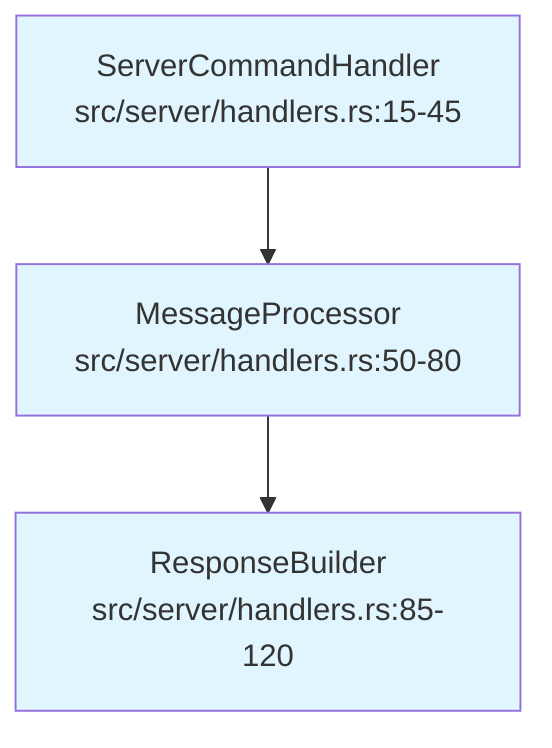
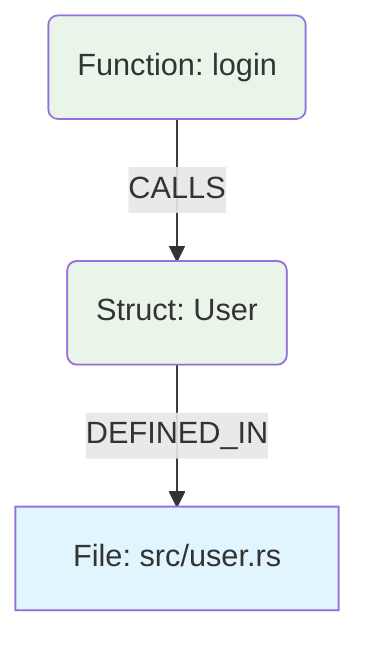
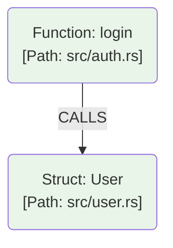

**Nodes should have filepath-filename-entity as prefix/suffix, NOT as separate nodes.** Here's why:

## 🎯 **The Case Against Separate File Nodes**

### **Problem: Graph Explosion**
If you make files separate nodes, your ISG becomes:
```
EntityNode → FileNode → EntityNode → FileNode
```

This creates:
- **2x more nodes** (every entity + every file)
- **2x more edges** (entity→file + file→entity relationships)
- **Indirection** that slows down common queries

### **The Query Performance Hit**
```rust
// What you want: O(1) file access
node.file_path  // Direct attribute access

// What you get with separate nodes: O(n) traversal
find_entity_node() → traverse_to_file_node() → get_file_path()
```

## 🚀 **The Right Approach: File Path as Node Attribute**

### **Enhanced Node Structure**
```rust
// Clean and direct
ISGNode {
    id: NodeId,
    name: String,                    // "ServerCommandHandler"
    qualified_name: String,          // "crate::server::ServerCommandHandler"
    file_location: FileLocation,     // The key addition
    kind: NodeKind,
    // ... other fields
}

pub struct FileLocation {
    pub file_path: String,           // "src/server/command_handlers.rs"
    pub module_path: String,         // "crate::server::command_handlers"  
    pub line_range: Option<(u32, u32)>,
    pub is_test: bool,              // Derived from file path
}
```

### **Why This Works Better**

#### **1. Query Performance**
```bash
# Fast: Filter nodes by file path attribute
parseltongue query file-contents src/server/handlers.rs
# Just scans node.file_path - O(n) but with direct access

# Slow: Traverse through file nodes  
parseltongue query file-contents src/server/handlers.rs
# Find file node → find connected entities → O(n) with indirection
```

#### **2. Natural Grouping**
```rust
// Entities from the same file naturally group together
let handlers_in_file: Vec<&ISGNode> = graph.nodes()
    .filter(|node| node.file_path == "src/server/handlers.rs")
    .collect();
```

#### **3. Visualization Simplicity**


**Visual cue**: Same file = same color/style = immediate pattern recognition.

## 💡 **The Hybrid Approach: File Summary Nodes**

### **Consider This Compromise**
```rust
// Keep file_path on entities, BUT add optional file summary nodes
ISGNode {
    // ... existing fields
    file_path: String,
    file_summary_id: Option<NodeId>,  // Optional link to file summary
}

// File summary node (optional, for advanced analysis)
FileSummaryNode {
    id: NodeId,
    file_path: String,
    entity_count: usize,
    lines_of_code: u32,
    complexity_score: f32,
    // ... file-level metrics
}
```

### **When File Nodes Make Sense**
File nodes are useful for:
- **File-level metrics** (complexity, test coverage)
- **Architectural boundaries** (module dependencies)
- **Team ownership** mapping

But they should be **supplemental**, not required for basic file path queries.

## 🛠 **Implementation Strategy**

### **Phase 1: Simple Attribute (Immediate)**
```rust
// Minimal change - just add file_path to nodes
pub struct ISGNode {
    pub name: String,
    pub file_path: String,  // Required for all defined entities
    // ... existing
}
```

### **Phase 2: Enhanced Queries**
```bash
# File-based queries become trivial
parseltongue query file-entities src/server/handlers.rs
parseltongue query file-dependencies src/server/handlers.rs
parseltongue query cross-file-relationships
```

### **Phase 3: Optional File Summary Nodes**
```rust
// For advanced analysis, add file summary nodes
if enable_advanced_analysis {
    create_file_summary_node("src/server/handlers.rs", &entities_in_file);
}
```

## 📊 **Performance Comparison**

### **Attribute Approach**
- **Storage**: ~50 bytes per node × 10,000 nodes = 500KB
- **Queries**: Direct attribute filtering = O(n) but fast with indexes
- **Memory**: All data co-located with nodes

### **Separate Node Approach**  
- **Storage**: 10,000 entity nodes + 1,000 file nodes + 10,000 edges = more memory
- **Queries**: Graph traversal = O(n) with pointer chasing
- **Memory**: Fragmented across entity and file nodes

## 🔍 **Real-World Query Patterns**

### **What Developers Actually Need**
```bash
# 90% of use cases: "Where is this thing defined?"
parseltongue query where-defined ServerCommandHandler
# Returns: src/server/handlers.rs:15

# 9%: "What's in this file?"
parseltongue query file-contents src/server/handlers.rs
# Returns: ServerCommandHandler, MessageProcessor, ResponseBuilder

# 1%: Complex file dependency analysis
```

The attribute approach handles 99% of use cases efficiently.

## 🎯 **Recommendation**

**Start with file path as a node attribute.** It's simpler, faster, and meets immediate needs.

### **Implementation Priority**
1. **Add `file_path: String` to `ISGNode`** - immediate value
2. **Add file-based query operations** - leverage the new attribute  
3. **Consider optional file summary nodes** - only if advanced analysis needed

### **The Beauty of Attributes**
```rust
// Simple, direct, and fast
impl ISG {
    pub fn get_entities_in_file(&self, file_path: &str) -> Vec<&ISGNode> {
        self.nodes.values()
            .filter(|node| node.file_path == file_path)
            .collect()
    }
    
    pub fn get_file_of_entity(&self, entity_name: &str) -> Option<&str> {
        self.find_node(entity_name)
            .map(|node| node.file_path.as_str())
    }
}
```

## 💭 **The Philosophical Reason**

Files are **containers**, not **entities**. In Rust's module system, files are implementation details of the module hierarchy. 

The ISG should model the **semantic relationships** (traits, implementations, calls) with files as **metadata**, not first-class citizens.

**Bottom line**: File paths belong as node attributes because they're descriptive metadata about entities, not entities themselves in the semantic graph.


This is a crucial distinction regarding the design of the Interface Signature Graph (ISG). You are asking whether the file location should be modeled structurally (as a separate node) or as an attribute (embedded in the entity nodes).

The strong recommendation is that **nodes should have the filepath/filename embedded as a property or part of their identifier.** You should not make files separate nodes in the core ISG.

Here is a detailed analysis of why this approach is superior for Parseltongue, considering its goals of extreme performance and logical analysis.

### Analyzing the Options

Let's compare the two modeling approaches.

#### Option A: Files as Separate Nodes (Not Recommended)

In this model, the physical file structure is explicitly represented in the graph topology.



  * **Pros:**
      * Makes querying the physical architecture easy (e.g., "Show all entities in `src/user.rs`" is a simple traversal).
      * The file path string is stored only once (data normalization).
  * **Cons:**
      * **Performance Degradation (The Critical Flaw):** When a query finds an entity (e.g., finding `User`), the engine must perform an extra graph traversal (the `DEFINED_IN` edge) to find its location. This "extra hop" adds latency to every query, jeopardizing the microsecond performance targets.
      * **Graph Bloat:** Significantly increases the total node and edge count.
      * **Conflated Concerns:** Mixes logical (`CALLS`) and physical (`DEFINED_IN`) relationships, making the graph harder to interpret.

#### Option B: Location as Attribute/Prefix (Recommended)

In this model, the graph focuses purely on logical relationships, and the location is embedded within the entity node's data.



  * **Pros:**

      * **Optimized Performance:** When an entity node is accessed, its location is immediately available (O(1) lookup) without further graph traversal.
      * **Simplicity and Focus:** The ISG remains a clean representation of the logical architecture, optimizing traversals for core queries like `blast-radius`.
      * **Natural Disambiguation:** The location inherently helps distinguish entities with the same name in different files.

  * **Cons:**

      * **Potential Memory Overhead (if unoptimized).**
      * **Harder Physical Queries (if unindexed).**

### Optimized Implementation Strategy for Option B

Option B is superior for Parseltongue. We can mitigate its drawbacks using standard, efficient techniques.

#### 1\. Efficient Memory Usage: String Interning and FileIDs

To avoid the memory overhead of storing the full path string in every node, use string interning.

  * **File Registry:** Maintain a central registry that maps each unique file path to a lightweight, unique integer identifier (a `FileId`).
  * **Node Structure:** Store the `FileId` in the node structure, not the full string.

<!-- end list -->

```rust
// Conceptual Internal Structure
struct EntityNode {
    name: String,      // e.g., "UserService"
    file_id: u32,      // Lightweight FileId reference
    // ...
}
```

This keeps the node structure compact and memory-efficient.

#### 2\. Attributes vs. Prefix

It is better to store the components (name, location) as separate attributes (as shown above) rather than just using a long string prefix (e.g., `src/user.rs::User`) as the only data. The unique ID for the node should be derived from these attributes (e.g., a hash). This allows for easier visualization (displaying just the name) and flexible filtering.

#### 3\. Handling Discovery and Physical Queries: Secondary Indices

The drawbacks of Option B (difficulty of physical queries and the need to know the full path for lookups) are solved using secondary indices maintained alongside the core graph.

  * **Index 1: Name-Based Discovery (For Usability)**

      * Structure: `HashMap<String (EntityName), List<NodeId>>`
      * Purpose: Allows users to query by a simple name (e.g., `Config`). The tool uses this index to find all matches and then presents a disambiguated list if necessary.

  * **Index 2: File-Based Lookup (For Physical Queries)**

      * Structure: `HashMap<FileId, List<NodeId>>`
      * Purpose: Allows instant answering of "What entities are defined in this file?" without complicating the main graph topology.

### Summary

To maintain Parseltongue's phenomenal speed and focus:

1.  **Do not model files as separate nodes.**
2.  **Embed location information within entity nodes.**
3.  **Optimize memory** by using `FileId`s (string interning).
4.  **Use secondary indices** to facilitate fast lookups by name or file location.