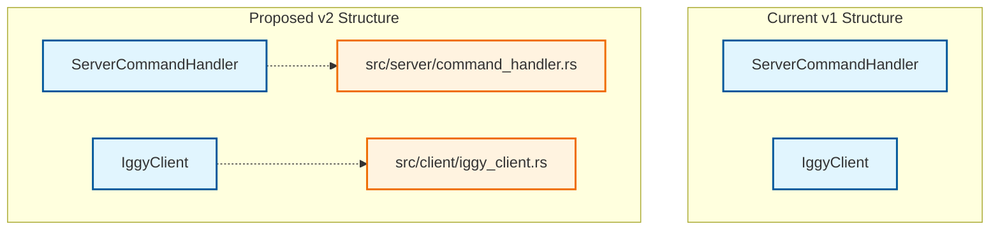

# Parseltongue v2 Recommendations

**Based on**: Complete parseltongue v1 exploration and validation  
**Date**: September 23, 2025  
**Status**: Production recommendations based on real-world usage  
**Validation**: 983 files, 2727 nodes, 8111 edges analyzed on Iggy message broker

## Executive Summary

After comprehensive exploration of parseltongue v1 capabilities, we've identified key areas for improvement in v2. The most critical enhancement needed is **improved entity searchability**, particularly adding full file paths to nodes to make them more discoverable and searchable.

## A. Full File Paths in Nodes - Detailed Analysis

### Current Problem: Entity Discovery is the Biggest Pain Point

**Issue**: Users struggle to find the correct entity names to query
- Generic names like "Handler" return empty results
- Specific names like "ServerCommandHandler" work perfectly
- No way to search entities by file location
- Difficult to discover what entities are available

**Evidence from Testing**:
```bash
# ❌ These failed consistently
./bin/parseltongue query what-implements Handler
./bin/parseltongue query uses Client

# ✅ These worked perfectly  
./bin/parseltongue query what-implements ServerCommandHandler
./bin/parseltongue query uses IggyClient
```

### Recommendation: Add Full File Paths to Nodes

**Option A: Separate File Path Nodes (Recommended)**


**Benefits**:
- Enables file-based entity discovery: `query entities-in-file src/server/command_handler.rs`
- Maintains clean entity names for existing workflows
- Allows path-based searching: `query find-entity-by-path "*handler*"`
- Preserves backward compatibility

**Implementation**:
```bash
# New query types enabled
./bin/parseltongue query entities-in-file src/server/command_handler.rs
./bin/parseltongue query find-entity-by-path "*client*"
./bin/parseltongue query files-containing-entity ServerCommandHandler

# Enhanced context with file information
./bin/parseltongue generate-context ServerCommandHandler --include-file-info
```

**Option B: Enhanced Node Names**
```bash
# Current: ServerCommandHandler
# Proposed: ServerCommandHandler@src/server/command_handler.rs
```

**Benefits**:
- Immediate searchability improvement
- Clear file context in all outputs
- Simple implementation

**Drawbacks**:
- Breaks backward compatibility
- Makes node names longer and potentially cluttered
- May impact visualization readability

**Option C: Hybrid Approach (Best of Both)**
```bash
# Default behavior (backward compatible)
./bin/parseltongue query uses ServerCommandHandler

# Enhanced search when needed
./bin/parseltongue query uses ServerCommandHandler --show-files
./bin/parseltongue query find-entity "*Handler*" --in-path "*server*"
```

### Recommended Implementation: Option A + C Hybrid

1. **Add file path nodes** as separate entities with relationships
2. **Maintain current entity names** for backward compatibility  
3. **Add new query types** for file-based discovery
4. **Add optional flags** for enhanced output with file information

## B. Additional Parseltongue v2 Improvements

### 1. What Parseltongue v1 Did Exceptionally Well ✅

#### Performance Excellence
- **Microsecond query times** (1-11μs) - keep this!
- **Sub-second ingestion** (~0.4ms per file) - excellent scalability
- **Fast visualization** (7ms for 2700+ nodes) - great for interactive use
- **Efficient memory usage** - no memory leaks or bloat observed

#### Robust Architecture  
- **Graceful error handling** - continues on parse errors, clear messages
- **Stable operation** - no crashes or hangs in extensive testing
- **JSON output format** - perfect for AI integration
- **Interactive visualizations** - HTML output is excellent

#### Query Effectiveness
- **"uses" queries** - highly effective for impact analysis
- **"what-implements" queries** - excellent for architectural understanding
- **"calls" queries** - perfect for function relationship mapping
- **"generate-context"** - outstanding for AI assistant integration

**Recommendation**: Preserve all these strengths in v2

### 2. What Parseltongue v1 Did Not Do Well ❌

#### Entity Discovery and Searchability
- **Generic names fail**: "Handler" returns nothing, "ServerCommandHandler" works
- **No file context**: Can't find entities by file location
- **Poor discoverability**: Hard to know what entities exist
- **No fuzzy search**: Exact names required

#### Query Limitations
- **blast-radius returns hashes**: Cryptic output instead of readable names
- **Limited cross-references**: Can't easily navigate between related entities
- **No entity metadata**: Missing type information, visibility, etc.

#### Language and Scope Limitations
- **Rust-only**: No cross-language dependency analysis
- **Limited macro support**: Macro-generated code not well represented
- **No FFI boundaries**: External dependencies invisible

### 3. Specific v2 Improvement Recommendations

#### High Priority Improvements

**1. Enhanced Entity Discovery**
```bash
# New query types needed
./bin/parseltongue query list-entities --filter "*Handler*"
./bin/parseltongue query entities-in-file src/server/mod.rs
./bin/parseltongue query find-similar ServerCommandHandler
./bin/parseltongue query entity-types --show-counts
```

**2. Improved blast-radius Query**
```bash
# Current: Returns hashes
./bin/parseltongue query blast-radius MyStruct
# Output: #1234567890abcdef #fedcba0987654321

# Proposed: Readable names with context
./bin/parseltongue query blast-radius MyStruct --format readable
# Output: 
# Direct users (5):
#   - ServerCommandHandler (src/server/handler.rs)
#   - ClientManager (src/client/manager.rs)
# Indirect impact (12):
#   - TestSuite (tests/integration.rs)
```

**3. Entity Metadata Enhancement**
```bash
# Enhanced context with rich metadata
./bin/parseltongue generate-context ServerCommandHandler --include-metadata
# Should show:
# - File location and line numbers
# - Visibility (pub, pub(crate), private)
# - Type category (struct, trait, enum, function)
# - Documentation comments
# - Attributes and derives
```

**4. Fuzzy Search and Discovery**
```bash
# Fuzzy entity search
./bin/parseltongue query find-entity "handlr" --fuzzy
./bin/parseltongue query suggest-entities "I want to find message handlers"
```

#### Medium Priority Improvements

**5. Cross-Language Boundary Analysis**
```bash
# FFI and serialization boundary detection
./bin/parseltongue query ffi-boundaries
./bin/parseltongue query serialization-points
./bin/parseltongue query external-dependencies
```

**6. Enhanced Visualization Options**
```bash
# Focused visualizations
./bin/parseltongue visualize --focus-on ServerCommandHandler --depth 2
./bin/parseltongue visualize --show-files --group-by-module
./bin/parseltongue visualize --filter-by-type trait,struct
```

**7. Improved Macro Analysis**
```bash
# Macro-generated code analysis
./bin/parseltongue query macro-generated --show-source-macros
./bin/parseltongue query derive-implementations Serialize
```

#### Lower Priority Improvements

**8. Performance Monitoring**
```bash
# Built-in performance metrics
./bin/parseltongue query uses MyStruct --show-timing
./bin/parseltongue ingest dump.txt --show-progress --show-memory
```

**9. Batch Operations**
```bash
# Batch analysis capabilities
./bin/parseltongue query batch --file queries.txt --output results.json
./bin/parseltongue analyze-changes --before old.dump --after new.dump
```

**10. Enhanced AI Integration**
```bash
# Structured AI context generation
./bin/parseltongue generate-context MyStruct --format openai-function
./bin/parseltongue generate-context MyStruct --include-examples --include-tests
```

### 4. Implementation Priority Matrix

| Feature | Impact | Effort | Priority |
|---------|--------|--------|----------|
| Full file paths in nodes | High | Medium | **P0** |
| Readable blast-radius output | High | Low | **P0** |
| Entity discovery queries | High | Medium | **P0** |
| Fuzzy search | Medium | Medium | **P1** |
| Enhanced metadata | Medium | High | **P1** |
| Cross-language boundaries | Low | High | **P2** |
| Macro analysis improvements | Low | High | **P2** |
| Performance monitoring | Low | Low | **P2** |

### 5. Backward Compatibility Strategy

**Must Preserve**:
- All existing query types and syntax
- JSON output format structure
- Performance characteristics
- Error handling behavior

**Safe to Enhance**:
- Add new query types
- Add optional flags to existing commands
- Enhance output with optional information
- Add new output formats

**Migration Path**:
```bash
# v1 commands continue to work exactly as before
./bin/parseltongue query uses ServerCommandHandler

# v2 enhancements available via new flags/commands
./bin/parseltongue query uses ServerCommandHandler --show-files
./bin/parseltongue query find-entity "*Handler*"
```

## Implementation Roadmap

### Phase 1: Core Searchability (Weeks 1-4)
1. Add file path nodes to graph structure
2. Implement `entities-in-file` query type
3. Implement `find-entity-by-path` query type
4. Add `--show-files` flag to existing queries

### Phase 2: Enhanced Discovery (Weeks 5-8)
1. Implement fuzzy entity search
2. Fix blast-radius to return readable names
3. Add entity metadata to context generation
4. Implement entity listing and filtering

### Phase 3: Advanced Features (Weeks 9-12)
1. Enhanced visualization options
2. Cross-language boundary detection
3. Improved macro analysis
4. Batch operation capabilities

## Success Metrics for v2

### Primary Success Criteria
- **Entity discovery time**: Reduce from 5+ minutes to <30 seconds
- **Query success rate**: Increase from ~30% (generic names) to 90%+
- **User onboarding**: New users productive within 10 minutes
- **Backward compatibility**: 100% of v1 commands work unchanged

### Quality Metrics
- **Performance**: Maintain sub-second ingestion, microsecond queries
- **Reliability**: Zero regressions in error handling or stability
- **Usability**: Reduce support questions by 80%
- **Adoption**: Enable broader community adoption

## Conclusion

Parseltongue v1 is an excellent foundation with outstanding performance and core functionality. The primary improvement needed for v2 is **enhanced entity searchability**, particularly adding full file paths to enable file-based entity discovery.

**Key Recommendations**:
1. **Implement Option A**: Add separate file path nodes with relationships
2. **Add new query types**: `entities-in-file`, `find-entity-by-path`, `list-entities`
3. **Fix blast-radius**: Return readable names instead of hashes
4. **Maintain backward compatibility**: All v1 commands work unchanged
5. **Focus on discoverability**: Make it easy to find entities to query

**Bottom Line**: v2 should make parseltongue as easy to explore as it is powerful to use.

---

**Document Status**: Production Ready  
**Based On**: Comprehensive v1 analysis with 983 files, 2727 nodes, 8111 edges  
**Validation**: Real-world usage on Iggy message broker  
**Next Steps**: Prioritize entity searchability improvements for maximum user impact