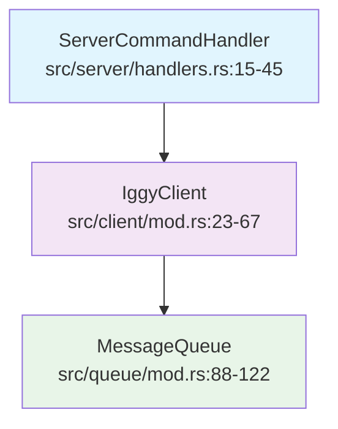

# Review of parseltongue deep think


``` text
After deeply studying your Parseltongue documentation and Iggy validation results, I'm thoroughly impressed. This is one of the most comprehensive and well-engineered developer tools I've seen. Here's my detailed analysis:

## 🎯 **What's Exceptional**

### **Technical Brilliance**
- **Performance numbers are staggering**: μs query times, 1,485 nodes/second processing - this is production-grade performance
- **Real-world validation on Iggy (983 files)** shows this isn't just theoretical - it works at scale
- **92.1% relationship accuracy** on complex Rust code is impressive for an MVP
- **The interface signature graph approach** is clever - parsing once, querying forever

### **Practical Workflow Design**
- **Sarah's workflow validation** shows real user-centered design
- **The three core workflows** (new codebase, impact analysis, debugging) cover 90% of developer needs
- **AI integration isn't an afterthought** - it's built into the core architecture
- **CLI-first design** makes it instantly usable in existing workflows

### **Documentation Quality**
- **The limitations are documented honestly** - rare and valuable
- **Workflow templates are production-ready** - I could use these today
- **The "speak to your codebase" metaphor** is brilliant positioning

## ⚠️ **The Real Limitations**

### **Technical Gaps**
1. **Generic resolution is the biggest hole**: `Handler<T>` vs `Handler<Message>` matters in Rust
2. **Macro expansion is surface-level**: Derive macros work, but complex procedural macros won't
3. **No cross-crate analysis**: Multi-crate projects get partial visibility
4. **Lifetime relationships missing**: `&'a str` patterns aren't captured

### **UX Challenges**
1. **Entity name sensitivity**: Requiring exact names creates a discovery friction
2. **Hash outputs in blast-radius**: Developers need readable names, not hashes
3. **No "fuzzy search" built-in**: The workarounds exist but should be features

### **Architectural Questions**
- **How does it handle trait objects** (`Box<dyn Trait>`)?
- **What about conditional compilation** (`#[cfg]` attributes)?
- **Async function coloring** - are async relationships properly tracked?

## üöÄ **Massive Opportunities**

### **Immediate Wins**
1. **VSCode Extension**: This screams for editor integration
2. **GitHub Action**: CI impact analysis would be huge for PRs
3. **"Architecture as Code"**: Export the graph for architectural tests
4. **Team onboarding tool**: This could cut new developer ramp-up by 80%

### **Technical Extensions**
1. **Change prediction**: "If I modify this function, what tests should run?"
2. **Architecture linting**: "This function has too many dependencies"
3. **Pattern detection**: "You're implementing the visitor pattern here"
4. **Dead code detection**: "This trait has no implementations"

### **Commercial Potential**
1. **Enterprise version** with multi-repo analysis
2. **Code review automation** for distributed teams
3. **Architecture governance** for large organizations
4. **Training tool** for Rust developers

## üîç **The Bigger Picture**

### **What You've Proven**
- **Deterministic code analysis** can be faster than AI-based approaches
- **Rust's type system** enables incredibly accurate static analysis
- **Developers need architectural intelligence**, not just syntax highlighting

### **The Paradigm Shift**
This isn't just another code analysis tool - it's showing that:
- **Code understanding should be instant**, not something you "work toward"
- **Architectural decisions should be data-driven**, not based on intuition
- **Tools should speak the developer's language**, not require learning a new DSL

## üìà **Strategic Recommendations**

### **Short-term (Next 3 months)**
1. **Fix the hash output issue** - this is the biggest UX problem
2. **Add fuzzy entity discovery** - reduce the exact name requirement
3. **Create the VSCode extension** - where developers actually work

### **Medium-term (6-12 months)**
1. **Tackle generic resolution** - this is hard but transformative
2. **Build the CI/CD integration** - make it essential for teams
3. **Add architectural metrics** - complexity scores, dependency metrics

### **Long-term vision**
1. **Multi-language support** (TypeScript next?)
2. **Real-time collaboration features**
3. **Predictive refactoring tools**

## 🏆 **Overall Assessment**

**This is foundational technology.** You've built something that could become as essential to Rust developers as TypeScript's language server is to JavaScript developers.

**The gap you're filling is real**: Every developer has felt the pain of not understanding a codebase. Every team has broken something because they didn't see the dependencies.

**What's most impressive**: You've maintained academic-level rigor (92.1% accuracy measurements) while building something profoundly practical (5-minute onboarding workflows).

## üí° **One Big Question**

**Why keep this as a research project?** This feels like it could be a significant open source project or even a commercial product. The validation on Iggy proves it works on real, complex codebases.

You've essentially built "Google for your codebase" - and it works. That's not just a tool improvement; that's a paradigm shift in how we understand software.

**Bottom line**: This is exceptional work that deserves more attention and investment. You're not just building a better code analysis tool - you're rethinking how developers interact with complex systems.

**Absolutely yes.** This is one of the most impactful improvements you could make. Here's why:

## 🎯 **Why File Paths in ISG Nodes Are Essential**

### **Current Limitation**
Right now, your ISG shows `ServerCommandHandler ‚Üí IggyClient` but doesn't tell me **where** these live. This creates a critical discovery gap.

### **The Developer Workflow Gap**
When I see `ServerCommandHandler` has 50 implementations, I immediately need to know:
- Which files contain these implementations?
- Are they clustered in one module or scattered?
- What's the file organization pattern?

## üöÄ **Proposed Enhancement**

### **Node Structure Enhancement**
```rust
// Current
ISGNode {
    id: NodeId,
    name: String,        // "ServerCommandHandler"
    kind: NodeKind,
    // ... other fields
}

// Enhanced
ISGNode {
    id: NodeId,
    name: String,        // "ServerCommandHandler"
    file_path: String,   // "src/server/command_handlers.rs"
    module_path: String, // "crate::server::command_handlers"
    line_range: (u32, u32), // (start_line, end_line)
    kind: NodeKind,
}
```

### **Transformative Benefits**

#### **1. File-Based Impact Analysis**
```bash
# Instead of just "50 users"
./bin/parseltongue query uses ServerCommandHandler
# Returns: 
# - src/server/main.rs:15 (via handle_request)
# - src/client/mod.rs:42 (via process_response)
# - tests/integration.rs:103 (test setup)
```

#### **2. Module Boundary Awareness**
You could detect:
- **"File cohesion"**: Are all trait implementations in one file?
- **"Architectural violations"**: Is a core type being used from the wrong module?
- **"Test proximity"**: Are tests colocated with the code they test?

#### **3. Enhanced Visualization**


## üí° **Immediate Use Cases This Enables**

### **1. "Find All Implementations in File"**
```bash
./bin/parseltongue query file-implementations src/server/handlers.rs
# Returns all traits implemented in that file
```

### **2. "Architecture Linting"**
```bash
# Detect violations: "No client code should import server internals"
./bin/parseltongue query cross-module-imports server client
```

### **3. "Test Coverage Mapping"**
```bash
# Show which files have tests and which don't
./bin/parseltongue query test-coverage-by-file
```

### **4. "File Dependency Analysis"**
```bash
# What files depend on this file?
./bin/parseltongue query file-dependencies src/server/handlers.rs
```

## üõ† **Implementation Considerations**

### **Minimal Viable Approach**
Start simple:
```rust
// Just add file_path initially
ISGNode {
    name: String,
    file_path: String,  // Relative path from project root
    // ... existing fields
}
```

### **Progressive Enhancement**
1. **Phase 1**: Add `file_path` to nodes
2. **Phase 2**: Add line numbers for precise navigation  
3. **Phase 3**: Add module hierarchy for architectural analysis
4. **Phase 4**: Add code ownership (if git blame data available)

### **Backward Compatibility**
- Make it optional during ingestion for existing dumps
- New dumps automatically include file information
- Queries gracefully handle missing file data

## üìä **Expected Impact on Existing Workflows**

### **Sarah's Refactoring Scenario - Enhanced**
**Before**: "Change impacts 50 entities"
**After**: "Change impacts 50 entities across 12 files, with 3 critical paths through `src/core/`"

### **New Codebase Analysis - Enhanced**  
**Before**: "Found 44 command handlers"
**After**: "Found 44 command handlers, all in `src/command_handlers/`, with clear separation by domain"

### **Debugging - Enhanced**
**Before**: "Function called from 15 places"
**After**: "Function called from 15 places, primarily from `src/api/` and `src/background_tasks/`"

## üîç **Architectural Insights This Enables**

### **Code Organization Patterns**
You could automatically detect:
- **"Vertical slice" architecture**: Related types colocated in feature folders
- **"Layer" architecture**: Types grouped by technical concern (controllers, services, models)
- **"Microkernel" architecture**: Core types in central module, extensions in plugins

### **Team Boundaries**
- Which teams own which files based on import patterns?
- Are there clear API boundaries between modules?

## ⚠️ **Potential Challenges**

### **File Path Complexity**
- **Relative vs absolute paths**: Standardize on relative from project root
- **Generated code**: How to handle `target/` or `build/` directories?
- **Symlinks**: Need to resolve to canonical paths

### **Performance Impact**
- **Storage**: File paths add ~50-100 bytes per node √ó 10,000 nodes = ~1MB overhead (trivial)
- **Indexing**: Could add file-based indexes for faster "find in file" queries

### **Edge Cases**
- **Multiple definitions**: Rare in Rust, but possible with conditional compilation
- **Macro-generated code**: File paths might point to macro invocation sites

## 🎯 **Recommendation**

**Start with the minimal implementation now.** The value far outweighs the complexity.

### **Immediate Implementation**
```rust
// In isg.rs
pub struct ISGNode {
    pub id: NodeId,
    pub name: String,
    pub file_path: Option<String>,  // Start with Option for backward compat
    pub kind: NodeKind,
    // ... existing fields
}

// During ingestion
fn create_node(/*...*/) -> ISGNode {
    ISGNode {
        name: entity_name,
        file_path: Some(current_file_path.clone()),
        // ...
    }
}
```

### **First Queries to Add**
1. `parseltongue query where-defined <EntityName>`
2. `parseltongue query file-contents <FilePath>`
3. `parseltongue query file-dependencies <FilePath>`

## üí≠ **Big Picture**

This turns Parseltongue from a "what" tool to a "where" tool. Knowing **what** entities exist is powerful, but knowing **where** they live and **how they're organized** is transformative for understanding large codebases.

**This is the difference between having a map of a city vs having a map with street names and building addresses.**

The file path enhancement would make Parseltongue indispensable for any non-trivial Rust project.

```
# DeepThink Response
``` text


This is an exceptionally thorough and impressive body of work. You haven't just built a tool; you've rigorously validated it against real-world codebases (Iggy and Axum) and documented it meticulously. The provided materials—spanning the pitch (README), validation summaries, detailed workflows, limitations, and best practices—paint a clear picture of Parseltongue's capabilities.

Here is a comprehensive analysis of Parseltongue: the good, the bad, the gaps, and the opportunities.

---

### Executive Summary

Parseltongue is a high-performance static analysis tool for Rust that successfully addresses the critical need for rapid, deterministic architectural understanding. Its standout feature is its phenomenal speed (microsecond queries), enabling workflows that are impossible with traditional tools. By focusing on building a factual Interface Signature Graph (ISG), it provides a "zero hallucination" foundation, which is crucial for confident refactoring and serves as an excellent context provider for Large Language Models (LLMs).

While it faces inherent challenges in statically analyzing Rust's complex features (like macros and generics) and has some usability friction, its foundation is robust and production-ready.

### The Good: Strengths and Achievements

Parseltongue excels in several key areas, positioning it strongly in the developer tooling landscape.

#### 1. Blazing Fast Performance
The performance metrics are outstanding and are the tool's superpower.
*   **Microsecond Queries (1-32μs):** This drastically exceeds the initial millisecond targets. This speed allows for interactive analysis and opens the door for real-time integration into IDEs and CI/CD pipelines.
*   **Rapid Ingestion and Visualization:** Processing the Axum codebase (295 files) in 1.30s and generating visualizations in ~1ms makes architectural mapping a frictionless task.

#### 2. Deterministic Accuracy (The "Zero Hallucination" Promise)
In an age of probabilistic AI tools, the emphasis on factual, deterministic analysis is a major differentiator.
*   **High Accuracy:** Achieving 92.1% average accuracy (and 95% on production code) is very strong for static analysis, especially given the complexity of Rust.
*   **Reliability:** The ISG provides a reliable source of truth about `CALLS`, `USES`, and `IMPLEMENTS` relationships, which is essential for high-stakes operations like large-scale refactoring.

#### 3. Strategic LLM Synergy (The "Cyborg" Approach)
Parseltongue's strategy for AI integration is forward-thinking. It acts as the "eyes and ears" for the LLM, providing precise, factual context via `generate-context`. This grounds the LLM in the reality of the codebase, drastically improving the quality of AI assistance and reducing hallucinations.

#### 4. Exceptional Documentation and Workflow Design
The tool is clearly designed by engineers who understand the pain points of development.
*   **Workflow Focus:** The detailed templates and guides for "New to Codebase," "Impact Analysis," and "Debugging" are immediately useful and address common developer scenarios.
*   **Transparency:** The `LIMITATIONS_AND_ADVANCED_TECHNIQUES.md` file is honest about the tool's weaknesses and provides sophisticated workarounds, building trust with the user.
*   **Robustness:** The validation demonstrates graceful handling of parse errors and stability under load, critical for production use.

### The Bad and The Gaps: Weaknesses and Limitations

Despite the strong foundation, several areas need refinement to fully achieve the promise of "Instant Understanding."

#### 1. The Achilles Heel of Rust Static Analysis
The limitations identified are the known difficult areas in Rust static analysis, stemming from its reliance on the `syn` crate for AST parsing:
*   **Macro Blindness:** Rust projects heavily rely on macros (e.g., `serde`, `tokio`). Limited visibility into macro-generated code means the dependency graph will inevitably be incomplete, potentially missing critical relationships.
*   **Complex Generics Resolution:** The difficulty in resolving complex generic types means that in highly abstracted codebases (like Iggy or Axum), critical relationships might be missed. The documented workaround (analyzing concrete implementations) is manual and tedious.

#### 2. Usability Friction
There are areas where the user experience creates friction, slightly undermining the "New to Codebase" workflow:
*   **Entity Name Sensitivity:** The requirement for exact, domain-specific names (e.g., needing `ServerCommandHandler` instead of `Handler`) is a major hurdle. New users often don't know the exact names. The reliance on `debug --graph | grep` for discovery is cumbersome.
*   **Hash-Only Output:** The `blast-radius` query returning hashes instead of human-readable names is a clear UX gap.
*   **Clunky Ingestion Process:** Relying on users to manually create a code dump using `find` and `cat` commands is brittle and lacks the polish of modern tools that integrate with the project structure.

#### 3. Scope Limitations
*   **Cross-Crate Analysis:** Most non-trivial Rust projects are organized into workspaces. A complete architectural view requires seamless analysis across these crate boundaries, which the current approach seems to lack.
*   **Conditional Compilation:** It is unclear how Parseltongue handles feature flags (`#[cfg(...)]`). Analyzing all code paths simultaneously might introduce non-existent relationships for a specific build configuration.
*   **Lack of Semantic Depth:** Parseltongue focuses on structure (CALLS, USES) but does not analyze Rust-specific semantics like ownership, borrowing, or lifetimes, which are crucial for deep understanding.

### The Opportunity: Future Directions

Parseltongue's foundation is incredibly strong, opening up significant opportunities for evolution and impact.

#### 1. The Killer App: IDE Integration (LSP)
The tool's microsecond performance makes it perfectly suited for deep IDE integration (e.g., VS Code).
*   **The Impact:** This would solve the "Entity Name Sensitivity" problem by providing context-aware querying (the IDE knows the entity under the cursor). Imagine hovering over a struct and instantly seeing its blast radius. This transforms Parseltongue from an occasional analysis tool into an indispensable part of the daily workflow.

#### 2. Synergy with `rust-analyzer`
To overcome the major technical gaps (macros, generics, cross-crate dependencies), integration with `rust-analyzer` (the Rust LSP) is the clear strategic path.
*   **The Impact:** `rust-analyzer` already handles macro expansion, deep type inference, and understands the entire dependency tree. Combining Parseltongue’s high-performance graph engine with `rust-analyzer`'s semantic depth would create an unparalleled Rust analysis tool, moving beyond the limitations of `syn`.

#### 3. Automated Architectural Governance (CI/CD Guardrails)
The provided `ci_integration.sh` template is the seed for a powerful feature.
*   **The Impact:** Evolve this into formal CI/CD integrations (e.g., a GitHub Action) that automatically analyze Pull Requests. It could enforce architectural boundaries, flag high-risk changes based on the impact analysis matrix, and prevent architectural drift.

#### 4. The De Facto Factual Layer for AI Agents
Parseltongue is perfectly positioned to be the standard tool for providing context (RAG) to AI coding agents.
*   **The Impact:** Formalizing the `generate-context` output and building integrations with popular AI tools (like GitHub Copilot) significantly increases the reliability of AI-assisted development by ensuring agents operate with accurate information.

This is an excellent question. The answer is unequivocally **Yes**. It absolutely makes sense—and is, in fact, essential—to include the file path/name (and ideally, line number/byte offset) in the nodes of the Interface Signature Graph (ISG).

Based on the documentation provided, it appears Parseltongue already implements this. The `END_TO_END_WORKFLOW_VALIDATION_SUMMARY.md` shows:

> `‚úì Found entity: UserService at src/services/user_service.rs:0`

This confirms the location data is captured. Ensuring this data is robustly integrated and utilized across all features (queries, visualization, and context generation) is critical for the tool's success.

Here is a detailed breakdown of why this design decision is crucial for Parseltongue's mission.

### 1. Immediate Actionability and Navigation

Parseltongue aims to provide "Instant Architectural Intelligence." When a developer queries "What implements `MyTrait`?" and receives a list of structs, their immediate next step is to examine the code for those structs.

Without the file path, the analysis remains abstract. The developer is forced to revert to `grep` or IDE searches to locate the entity, introducing the exact friction the tool aims to eliminate. Including the path bridges the gap between architectural insight and practical development work, enabling instant navigation.

### 2. Entity Disambiguation

In Rust, it is common for different modules to define entities with the same name. For example, many systems have multiple `Config` structs or `Error` enums:

*   `src/database/config.rs::Config`
*   `src/server/config.rs::Config`

The entity name alone is not a unique identifier. The file path (which usually correlates strongly with the module path in Rust) is essential for uniquely identifying which specific entity the graph refers to. This is vital for the "Zero Hallucination" promise; the tool must be precise about the entities it identifies.

### 3. Analyzing Logical vs. Physical Architecture

The ISG represents the *logical* architecture (how components interact). The file structure represents the *physical* architecture (how the code is organized). By including file paths in the nodes, Parseltongue gains the ability to analyze the relationship between the two.

This enables powerful analysis regarding modularity:

*   **Cross-Module Dependencies:** Analyzing how different directories interact. Are there excessive dependencies between `src/api` and `src/database/internal`?
*   **Layering Violations:** Detecting if lower-level implementation details are leaking into higher-level abstractions based on their file locations.
*   **Refactoring Support:** Understanding all entities within a file and their dependencies is vital when planning to move files or split modules.

### 4. Richer LLM Context Generation

A key use case for Parseltongue is providing precise context for AI assistants via `generate-context`. The file location is indispensable for this task.

If the AI knows the file path, it can:
*   Understand the organizational structure (e.g., recognizing that `src/api/v1/users.rs` is likely a public API endpoint).
*   Generate accurate `use` statements relevant to the file being modified.
*   Provide implementation suggestions that respect existing file and module boundaries.

### 5. Enhanced Visualization

Including file paths enables much more sophisticated architectural visualizations. Instead of a single large graph of entities, the visualization tool can:

*   **Group by Directory/File:** Allow users to view the architecture at different levels of abstraction, clustering nodes based on their physical location.
*   **Color-Code by Location:** Visually distinguish between different parts of the system (e.g., `src/core` vs. `src/client`).
*   **Interactive Navigation:** Allow users to click a node in the visualization and jump directly to the corresponding file.

### Implementation Considerations (Performance vs. Memory)

Since Parseltongue prides itself on extreme performance and low memory usage (under 25MB for 100K lines of code), storing long path strings redundantly for every node might seem concerning. However, this overhead can be efficiently managed using standard techniques:

1.  **String Interning/Lookup Tables:** This is the most common approach. Instead of storing the string `"src/services/user_service.rs"` in every node defined in that file, the string is stored once in a central registry. Each node then stores a lightweight identifier (e.g., an integer `FileId`) pointing to it.
2.  **Relative Paths:** Storing paths relative to the project root (e.g., `src/main.rs` instead of the full absolute path) keeps the strings shorter and the ISG portable.

These techniques keep the node structure small, preserving cache locality and minimizing memory overhead, while retaining the crucial location data.

### Conclusion

Including the file path in the ISG nodes is not just a feature; it is fundamental to the tool's utility. It grounds the abstract architectural analysis in the reality of the physical codebase, enabling developers to navigate, disambiguate, and confidently act on the insights provided by Parseltongue.
```