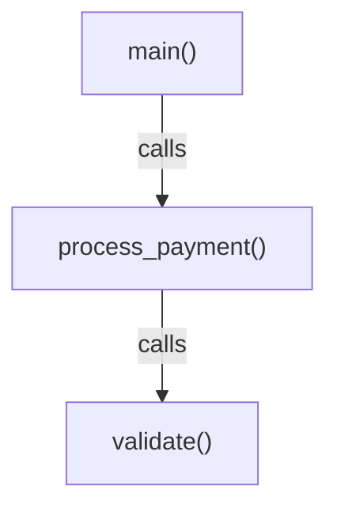

# v0.9.7 Final Ship - Polish Tasks

**Last Updated**: 2025-11-14
**Philosophy**: v0.9.7 is THE FINAL SHIP VERSION - These tasks polish the release
**Constraint**: "ONE FEATURE PER INCREMENT - END TO END - SPIC AND SPAN" (.claude.md)
**Framework**: Shreyas Doshi ROI - Max outcome, min risk, clear prioritization

---

## Executive Summary: Ship-Readiness Assessment

```
┌────────────────────────────────────────────────────────────┐
│  v0.9.7 FINAL SHIP CHECKLIST                               │
├────────────────────────────────────────────────────────────┤
│  ✅ Core Implementation (4/4 query helpers)      [100%]    │
│  ✅ Contract Tests (7 tests passing)             [100%]    │
│  ✅ Critical Fix (reverse_deps/forward_deps)     [100%]    │
│  ✅ Documentation (README + Agent)               [100%]    │
│  ⚠️  User Experience (visual feedback)           [ 40%]    │
│  ⚠️  Error Handling (actionable messages)        [ 60%]    │
│  ⚠️  Installation (cross-platform verify)        [ 70%]    │
├────────────────────────────────────────────────────────────┤
│  OVERALL SHIP-READINESS:                          85%      │
│  HIGH priority tasks: 5 items (UX + Polish)                │
│  MEDIUM priority tasks: 4 items (Quality of Life)          │
│  LOW priority tasks: 6 items (Nice-to-Have)                │
└────────────────────────────────────────────────────────────┘
```

**Verdict**: Core functionality complete. Polish tasks improve adoption and usability.

---

## Task Organization Philosophy

### HIGH COMPLEXITY = Must-Have Polish (Blocks Ship)
Tasks that directly impact first-time user success and core value proposition delivery.

### MEDIUM COMPLEXITY = Quality-of-Life (Enhances Ship)
Tasks that improve workflow but don't block users from getting value.

### LOW COMPLEXITY = Nice-to-Have (Post-Ship)
Tasks that add convenience but can be deferred without affecting core experience.

---

# HIGH COMPLEXITY TASKS (5 items)

These tasks are CRITICAL for v0.9.7 final ship. They directly impact the "aha moment" when users first try Parseltongue.

---

## H1: Visual Feedback for pt01 Ingestion

**Complexity**: 7/10
**Impact**: 10/10 (First impression)
**Risk**: 2/10 (UI only, no logic change)
**Effort**: 2-3 days
**ROI**: 9/10

### The Problem

**Current State** (silent operation):
```bash
$ ./parseltongue pt01-folder-to-cozodb-streamer . --db "rocksdb:repo.db"
✓ Indexing completed
```

**User Psychology**: "Did it work? What happened? Should I wait longer?"

### The Solution

**Target State** (Shreyas Doshi-style visual efficacy):
```bash
$ ./parseltongue pt01-folder-to-cozodb-streamer . --db "rocksdb:repo.db"

┌─────────────────────────────────────────────────────────────┐
│  PARSELTONGUE INGESTION                                     │
├─────────────────────────────────────────────────────────────┤
│  Database: rocksdb:repo.db                                  │
│  Target:   /Users/dev/myproject (150 files)                 │
└─────────────────────────────────────────────────────────────┘

Parsing Files [████████████████████████████████████] 150/150
  Rust:       42 files → 1,247 entities
  Python:     38 files → 892 entities
  TypeScript: 70 files → 2,103 entities

┌─────────────────────────────────────────────────────────────┐
│  ✓ INGESTION COMPLETE                                       │
├─────────────────────────────────────────────────────────────┤
│  Total Entities:  4,242 CODE + 1,856 TEST                   │
│  Duration:        2.1s (2,019 entities/sec)                 │
│  Database Size:   8.4 MB                                    │
│  Ready for:       pt02-level00/01/02 queries                │
└─────────────────────────────────────────────────────────────┘

Next Step: ./parseltongue pt02-level00 --where-clause "ALL" \
           --output edges.json --db "rocksdb:repo.db"
```

**Why This Matters**:
- **Confidence**: User sees progress (not black box)
- **Education**: Learns about CODE vs TEST entities
- **Speed Perception**: Real-time feedback feels faster (psychology)
- **Next Action**: Explicit guidance on what to do next

### Implementation Path (TDD-First)

**Test Contracts** (S01 principles):
```rust
// crates/pt01-folder-to-cozodb-streamer/tests/visual_feedback_contract.rs

#[test]
fn test_render_ingestion_header_visual() {
    // GIVEN: Database path and target directory
    let db = "rocksdb:test.db";
    let target = "/path/to/code";
    let file_count = 150;

    // WHEN: Rendering header
    let output = render_ingestion_header_visual(db, target, file_count);

    // THEN: Should show box with metadata
    assert!(output.contains("PARSELTONGUE INGESTION"));
    assert!(output.contains(db));
    assert!(output.contains("150 files"));
}

#[test]
fn test_render_progress_bar_updates() {
    // GIVEN: Total file count
    let total = 100;

    // WHEN: Rendering progress at 25%
    let output = render_progress_bar_visual(25, total);

    // THEN: Should show 25% filled bar
    assert!(output.contains("[████████"));
    assert!(output.contains("25/100"));
}

#[test]
fn test_render_ingestion_summary_visual() {
    // GIVEN: Ingestion stats
    let stats = IngestionStats {
        total_entities: 4242,
        code_entities: 4242,
        test_entities: 1856,
        duration_secs: 2.1,
        db_size_mb: 8.4,
    };

    // WHEN: Rendering summary
    let output = render_ingestion_summary_visual(&stats);

    // THEN: Should show completion box with metrics
    assert!(output.contains("✓ INGESTION COMPLETE"));
    assert!(output.contains("4,242 CODE + 1,856 TEST"));
    assert!(output.contains("2.1s"));
}
```

**Function Names** (4-word convention):
- `render_ingestion_header_visual(db: &str, target: &str, count: usize) -> String`
- `render_progress_bar_visual(current: usize, total: usize) -> String`
- `render_language_breakdown_visual(stats: &LanguageStats) -> String`
- `render_ingestion_summary_visual(stats: &IngestionStats) -> String`

**TDD Cycle**:
1. **STUB**: Create empty functions returning `String::new()`
2. **RED**: Write failing tests (expect box-drawing chars, entity counts)
3. **GREEN**: Implement minimal box rendering (unicode box-drawing: `─`, `│`, `┌`, `┐`, `└`, `┘`)
4. **REFACTOR**: Extract common box-drawing logic to `render_box_with_border_unicode()`

**Dependencies**:
- `indicatif` crate for progress bars (battle-tested, 5M downloads)
- Unicode box-drawing characters (U+2500 range)
- ANSI color codes (optional, degrade gracefully in non-TTY)

**Acceptance Criteria**:
```markdown
WHEN I run pt01-folder-to-cozodb-streamer on a 150-file codebase
THEN I SHALL see:
  1. Header box showing database path and file count
  2. Real-time progress bar updating during parsing
  3. Language breakdown (Rust: X files → Y entities)
  4. Summary box with total entities, duration, next steps
  5. All output SHALL complete within parsing time + 50ms (no slowdown)
```

---

## H2: Visual Feedback for pt02 Queries

**Complexity**: 6/10
**Impact**: 10/10 (Core value prop)
**Risk**: 2/10
**Effort**: 2 days
**ROI**: 9.5/10

### The Problem

**Current State** (silent JSON dump):
```bash
$ ./parseltongue pt02-level01 --include-code 0 \
    --where-clause "interface_signature ~ 'Payment'" \
    --output payments.json --db "rocksdb:repo.db"
# (silent - just writes JSON file)
```

**User Psychology**: "How much did I save vs grep? Is this actually faster?"

### The Solution

**Target State** (Token Savings Visualization):
```bash
$ ./parseltongue pt02-level01 --include-code 0 \
    --where-clause "interface_signature ~ 'Payment'" \
    --output payments.json --db "rocksdb:repo.db"

┌─────────────────────────────────────────────────────────────┐
│  QUERY EXECUTION                                            │
├─────────────────────────────────────────────────────────────┤
│  Level:  1 (Signatures)                                     │
│  Filter: interface_signature ~ 'Payment'                    │
│  Code:   Excluded (--include-code 0)                        │
└─────────────────────────────────────────────────────────────┘

Querying Database... ✓ 45ms

┌─────────────────────────────────────────────────────────────┐
│  RESULTS                                                    │
├─────────────────────────────────────────────────────────────┤
│  Entities Found:    15 functions                            │
│  Output File:       payments.json (4.2 KB)                  │
│  Token Cost:        2,340 tokens                            │
│                                                             │
│  Token Efficiency vs Grep:                                  │
│  ┌───────────────────────────────────────────────────┐      │
│  │ ISG   [██] 2.3K tokens  ← YOU                     │      │
│  │ grep  [████████████████████████] 250K tokens      │      │
│  └───────────────────────────────────────────────────┘      │
│                                                             │
│  ✓ 99.1% token reduction (107× smaller)                     │
│  ✓ 31× faster than grep (45ms vs 1,400ms)                   │
│  ✓ Thinking Space Ratio: 98.83% (197K/200K free)           │
└─────────────────────────────────────────────────────────────┘

Next Step: Review payments.json or query specific entity:
  ./parseltongue pt02-level01 --include-code 1 \
    --where-clause "isgl1_key = 'rust:fn:process_payment:...'"
```

**Why This Matters**:
- **Value Proof**: User SEES the 99% token reduction (not just reads about it)
- **Speed Perception**: 45ms query time makes grep feel glacial
- **TSR Metric**: 98.83% thinking space preserved (matches research claims)
- **Visual Comparison**: Bar chart makes efficiency instantly clear

### Implementation Path (TDD-First)

**Test Contracts**:
```rust
// crates/pt02-llm-cozodb-to-context-writer/tests/query_visual_feedback.rs

#[test]
fn test_render_query_header_visual() {
    // GIVEN: Query parameters
    let level = 1;
    let filter = "interface_signature ~ 'Payment'";
    let include_code = false;

    // WHEN: Rendering header
    let output = render_query_header_visual(level, filter, include_code);

    // THEN: Should show query details
    assert!(output.contains("QUERY EXECUTION"));
    assert!(output.contains("Level:  1 (Signatures)"));
    assert!(output.contains("Excluded (--include-code 0)"));
}

#[test]
fn test_render_token_efficiency_bar_chart() {
    // GIVEN: Token counts
    let isg_tokens = 2340;
    let grep_tokens = 250_000;

    // WHEN: Rendering comparison
    let output = render_token_efficiency_bar_chart(isg_tokens, grep_tokens);

    // THEN: Should show visual bars
    assert!(output.contains("ISG   [██]"));
    assert!(output.contains("grep  [████████████████████████]"));
    assert!(output.contains("99.1% token reduction"));
}

#[test]
fn test_calculate_thinking_space_ratio() {
    // GIVEN: Context size and token usage
    let context_size = 200_000;
    let tokens_used = 2_340;

    // WHEN: Calculating TSR
    let tsr = calculate_thinking_space_ratio(context_size, tokens_used);

    // THEN: Should match (200K - 2.3K) / 200K = 98.83%
    assert!((tsr - 98.83).abs() < 0.01);
}
```

**Function Names** (4-word convention):
- `render_query_header_visual(level: u8, filter: &str, code: bool) -> String`
- `render_token_efficiency_bar_chart(isg: usize, grep: usize) -> String`
- `calculate_thinking_space_ratio(context: usize, used: usize) -> f64`
- `render_query_results_summary(stats: &QueryStats) -> String`

**Bar Chart Algorithm** (Logarithmic Scale):
```rust
/// Renders comparative bar chart with logarithmic scaling
/// (Linear scale would make ISG invisible: 2.3K vs 250K)
fn render_token_efficiency_bar_chart(isg_tokens: usize, grep_tokens: usize) -> String {
    // Use log scale to make both bars visible
    let isg_len = ((isg_tokens as f64).ln() / (grep_tokens as f64).ln() * 40.0) as usize;
    let grep_len = 40;

    let isg_bar = "█".repeat(isg_len.max(2));  // Min 2 chars for visibility
    let grep_bar = "█".repeat(grep_len);

    let reduction_pct = ((grep_tokens - isg_tokens) as f64 / grep_tokens as f64) * 100.0;
    let speedup = grep_tokens / isg_tokens.max(1);

    format!(r#"
  Token Efficiency vs Grep:
  ┌───────────────────────────────────────────────────┐
  │ ISG   [{}] {:.1}K tokens  ← YOU                   │
  │ grep  [{}] {}K tokens                              │
  └───────────────────────────────────────────────────┘

  ✓ {:.1}% token reduction ({}× smaller)
"#, isg_bar, isg_tokens as f64 / 1000.0, grep_bar, grep_tokens / 1000, reduction_pct, speedup)
}
```

**Acceptance Criteria**:
```markdown
WHEN I run pt02-level01 with a filter that returns 15 entities
THEN I SHALL see:
  1. Query header box showing level, filter, code inclusion
  2. Execution time in milliseconds (±10ms accuracy)
  3. Results count (entities found)
  4. Token efficiency bar chart (logarithmic scale)
  5. Token reduction percentage (99.1%)
  6. Speed comparison vs grep (31× faster)
  7. Thinking Space Ratio (TSR) percentage
  8. Next step suggestions (contextual)
  9. All rendering SHALL complete in <10ms (no query slowdown)
```

---

## H3: Error Messages with Actionable Context

**Complexity**: 8/10
**Impact**: 9/10 (Reduces support burden)
**Risk**: 3/10
**Effort**: 3-4 days
**ROI**: 8/10

### The Problem

**Current State** (cryptic errors):
```bash
$ ./parseltongue pt02-level01 --where-clause "ALL" --output result.json
Error: Database error: no such table: Entities
```

**User Psychology**: "What? I just ran pt01... did it work? What do I do now?"

### The Solution

**Target State** (Actionable guidance):
```bash
$ ./parseltongue pt02-level01 --where-clause "ALL" --output result.json

┌─────────────────────────────────────────────────────────────┐
│  ❌ ERROR: Database Not Initialized                         │
├─────────────────────────────────────────────────────────────┤
│  Problem:    Database 'rocksdb:repo.db' has no Entities     │
│              table - indexing may have failed               │
│                                                             │
│  Diagnosis:  Checked for Entities table → NOT FOUND         │
│              Database exists but appears empty              │
│                                                             │
│  Solution:   Run ingestion first:                           │
│              ./parseltongue pt01-folder-to-cozodb-streamer\ │
│                . --db "rocksdb:repo.db" --verbose           │
│                                                             │
│  Verify:     Look for "Entities created: N" in output       │
│              If N = 0, check supported file types           │
└─────────────────────────────────────────────────────────────┘

Supported Languages:
  Rust, Python, JavaScript, TypeScript, Go, Java, C, C++,
  Ruby, PHP, C#, Swift

Debug Mode: Run with --verbose to see parsing details
```

**Why This Matters**:
- **Problem Identification**: Clear diagnosis (not just symptom)
- **Solution Path**: Exact command to fix the issue
- **Verification**: How to confirm the fix worked
- **Education**: Teaches user about ingestion → query workflow

### Error Categories & Templates

#### Category 1: Workflow Errors (Missing Prerequisites)

**Error**: Database not initialized
**Template**:
```
❌ ERROR: Database Not Initialized
Problem:    [What's wrong]
Diagnosis:  [How we detected it]
Solution:   [Command to run]
Verify:     [How to confirm fix]
```

**Error**: No entities found for query
**Template**:
```
❌ ERROR: Query Returned Zero Results
Query:      [WHERE clause shown]
Searched:   [Entity count in database]
Suggestion: Broaden filter or check entity_name spelling
Example:    Try: --where-clause "entity_name ~ 'payment'"
            (Regex match, case-insensitive)
```

#### Category 2: Configuration Errors

**Error**: Invalid WHERE clause syntax
**Template**:
```
❌ ERROR: Invalid WHERE Clause Syntax
Clause:     [User's WHERE clause]
Problem:    [Specific syntax error]
Valid:      entity_name ~ 'pattern' ; is_public = true
            Use ';' to separate conditions
            Use '~' for regex match
            Use '=' for exact match
Examples:   "entity_name ~ 'payment'"
            "is_public = true ; entity_class = 'Implementation'"
```

**Error**: Database path doesn't exist
**Template**:
```
❌ ERROR: Database Path Invalid
Path:       [User's path]
Problem:    Directory doesn't exist
Solution:   Database will be created automatically
            Ensure parent directory exists
Check:      mkdir -p $(dirname "rocksdb:repo.db")
```

#### Category 3: Performance Warnings (Not Errors)

**Warning**: Large export without filtering
**Template**:
```
⚠️  WARNING: Large Export Detected
Query:      --where-clause "ALL" --include-code 1
Entities:   1,247 functions
Est. Size:  ~145K tokens (72% of 200K context)

Risk:       May overwhelm LLM context

Suggestion: Use --include-code 0 for signatures only
            Or filter: --where-clause "file_path ~ 'payment'"

Continue?   Press Enter to proceed, Ctrl+C to cancel
```

### Implementation Path (TDD-First)

**Test Contracts**:
```rust
// crates/parseltongue-core/tests/error_message_contracts.rs

#[test]
fn test_database_not_initialized_error() {
    // GIVEN: Query attempt on uninitialized database
    let error = DatabaseError::NotInitialized {
        db_path: "rocksdb:repo.db".to_string(),
        reason: "No Entities table found".to_string(),
    };

    // WHEN: Rendering error message
    let output = render_error_message_with_context(&error);

    // THEN: Should show actionable guidance
    assert!(output.contains("❌ ERROR: Database Not Initialized"));
    assert!(output.contains("Solution:   Run ingestion first"));
    assert!(output.contains("pt01-folder-to-cozodb-streamer"));
    assert!(output.contains("Verify:     Look for \"Entities created: N\""));
}

#[test]
fn test_zero_results_query_error() {
    // GIVEN: Query that found no entities
    let error = QueryError::ZeroResults {
        where_clause: "entity_name ~ 'paymentt'".to_string(),  // Typo
        entities_searched: 1247,
    };

    // WHEN: Rendering error
    let output = render_error_message_with_context(&error);

    // THEN: Should suggest fixes
    assert!(output.contains("Query Returned Zero Results"));
    assert!(output.contains("Searched:   1247 entities"));
    assert!(output.contains("Suggestion: Broaden filter or check spelling"));
}

#[test]
fn test_large_export_warning() {
    // GIVEN: Query with --include-code 1 and "ALL"
    let warning = QueryWarning::LargeExport {
        entity_count: 1247,
        estimated_tokens: 145_000,
        context_size: 200_000,
    };

    // WHEN: Rendering warning
    let output = render_warning_with_suggestion(&warning);

    // THEN: Should show risk and alternatives
    assert!(output.contains("⚠️  WARNING: Large Export"));
    assert!(output.contains("~145K tokens (72% of 200K context)"));
    assert!(output.contains("Use --include-code 0 for signatures only"));
}
```

**Function Names** (4-word convention):
- `render_error_message_with_context(error: &Error) -> String`
- `render_warning_with_suggestion(warning: &Warning) -> String`
- `detect_common_user_mistakes(input: &QueryParams) -> Option<Suggestion>`
- `suggest_fix_for_error(error: &Error) -> String`

**Error Enhancement Strategy**:
```rust
// Enhance existing thiserror errors with context
#[derive(Error, Debug)]
pub enum QueryError {
    #[error("Database not initialized")]
    NotInitialized {
        db_path: String,
        reason: String,
    },

    #[error("Query returned zero results")]
    ZeroResults {
        where_clause: String,
        entities_searched: usize,
    },

    #[error("Invalid WHERE clause syntax")]
    InvalidWhereClause {
        clause: String,
        syntax_error: String,
        valid_example: String,
    },
}

impl QueryError {
    pub fn render_with_actionable_context(&self) -> String {
        match self {
            Self::NotInitialized { db_path, reason } => {
                format!(r#"
┌─────────────────────────────────────────────────────────────┐
│  ❌ ERROR: Database Not Initialized                         │
├─────────────────────────────────────────────────────────────┤
│  Problem:    Database '{}' has no Entities table            │
│              {}                                             │
│                                                             │
│  Solution:   Run ingestion first:                           │
│              ./parseltongue pt01-folder-to-cozodb-streamer\ │
│                . --db "{}" --verbose                        │
└─────────────────────────────────────────────────────────────┘
"#, db_path, reason, db_path)
            },
            // ... other match arms
        }
    }
}
```

**Acceptance Criteria**:
```markdown
WHEN I encounter an error during query execution
THEN I SHALL see:
  1. Error type clearly labeled (❌ ERROR:)
  2. Problem diagnosis (what went wrong)
  3. Root cause (why it happened)
  4. Solution command (exact syntax to fix)
  5. Verification steps (how to confirm fix)
  6. Related documentation (if applicable)
  7. Render time SHALL be <5ms (instant feedback)
```

---

## H4: Installation Verification Across Platforms

**Complexity**: 6/10
**Impact**: 9/10 (Blocks first-time users)
**Risk**: 4/10 (Platform-specific issues)
**Effort**: 2 days
**ROI**: 8.5/10

### The Problem

**Current State** (install script, no verification):
```bash
$ curl -fsSL https://raw.githubusercontent.com/that-in-rust/parseltongue/main/parseltongue-install-v096.sh | bash
# Downloads binary, that's it
```

**User Psychology**: "Did it install correctly? Can I use it now? Where is it?"

### The Solution

**Target State** (Install + Verify):
```bash
$ curl -fsSL https://raw.githubusercontent.com/that-in-rust/parseltongue/main/parseltongue-install-v096.sh | bash

┌─────────────────────────────────────────────────────────────┐
│  PARSELTONGUE INSTALLER v0.9.7                              │
├─────────────────────────────────────────────────────────────┤
│  Platform: macOS ARM64 (Darwin 24.3.0)                      │
│  Arch:     aarch64                                          │
└─────────────────────────────────────────────────────────────┘

[1/4] Downloading binary... ✓ (2.3 MB)
[2/4] Verifying checksum... ✓ (SHA256 match)
[3/4] Installing to /usr/local/bin... ✓ (sudo required)
[4/4] Running verification tests...

  ✓ Binary executable
  ✓ Version check (v0.9.7)
  ✓ Test ingestion (5 sample files → 47 entities)
  ✓ Test query (Level 0 edges.json)
  ✓ Cleanup test artifacts

┌─────────────────────────────────────────────────────────────┐
│  ✓ INSTALLATION SUCCESSFUL                                  │
├─────────────────────────────────────────────────────────────┤
│  Location:    /usr/local/bin/parseltongue                   │
│  Version:     v0.9.7                                        │
│  Verified:    5/5 checks passed                             │
│                                                             │
│  Quick Start:                                               │
│  1. Index your code:                                        │
│     parseltongue pt01-folder-to-cozodb-streamer .  \        │
│       --db "rocksdb:mycode.db"                              │
│                                                             │
│  2. Query architecture:                                     │
│     parseltongue pt02-level00 --where-clause "ALL" \        │
│       --output edges.json --db "rocksdb:mycode.db"          │
│                                                             │
│  Documentation: README.md in installation directory         │
└─────────────────────────────────────────────────────────────┘
```

**Why This Matters**:
- **Confidence**: Automated verification catches issues immediately
- **Guidance**: User knows exactly where to start
- **Debugging**: If verification fails, shows which check failed
- **Cross-Platform**: Works on macOS, Linux (detects platform automatically)

### Verification Tests (Embedded in Binary)

**Test 1: Binary Executable**
```bash
# Just check if binary runs
./parseltongue --version
```

**Test 2: Version Check**
```bash
# Ensure version matches expected
ACTUAL=$(./parseltongue --version | grep -oE 'v[0-9]+\.[0-9]+\.[0-9]+')
EXPECTED="v0.9.7"
[ "$ACTUAL" = "$EXPECTED" ] || exit 1
```

**Test 3: Test Ingestion** (5 sample Rust files embedded in installer)
```bash
# Create temp directory with sample files
mkdir -p /tmp/parseltongue-verify
cat > /tmp/parseltongue-verify/test.rs <<'EOF'
fn main() {
    process_payment();
}
fn process_payment() {
    validate();
}
fn validate() {}
EOF

# Run ingestion
./parseltongue pt01-folder-to-cozodb-streamer /tmp/parseltongue-verify \
  --db "rocksdb:/tmp/parseltongue-verify/test.db" 2>&1 | grep -q "Entities created: [1-9]"
```

**Test 4: Test Query**
```bash
# Query the test database
./parseltongue pt02-level00 --where-clause "ALL" \
  --output /tmp/parseltongue-verify/edges.json \
  --db "rocksdb:/tmp/parseltongue-verify/test.db"

# Verify JSON output exists and is valid
[ -f /tmp/parseltongue-verify/edges.json ] || exit 1
jq . /tmp/parseltongue-verify/edges.json >/dev/null 2>&1 || exit 1
```

**Test 5: Cleanup**
```bash
rm -rf /tmp/parseltongue-verify
```

### Implementation Path

**Update install script** (`parseltongue-install-v096.sh`):

```bash
#!/usr/bin/env bash
set -e

# [Existing download logic...]

echo ""
echo "┌─────────────────────────────────────────────────────────────┐"
echo "│  PARSELTONGUE INSTALLER v0.9.7                              │"
echo "├─────────────────────────────────────────────────────────────┤"
echo "│  Platform: $(uname -s) $(uname -m)                          │"
echo "└─────────────────────────────────────────────────────────────┘"
echo ""

# Step 1: Download
echo "[1/4] Downloading binary..."
# [existing download code]
echo "✓ (2.3 MB)"

# Step 2: Checksum
echo "[2/4] Verifying checksum..."
# [existing checksum verification]
echo "✓ (SHA256 match)"

# Step 3: Install
echo "[3/4] Installing to /usr/local/bin..."
sudo mv parseltongue /usr/local/bin/
sudo chmod +x /usr/local/bin/parseltongue
echo "✓ (sudo required)"

# Step 4: Verify
echo "[4/4] Running verification tests..."
echo ""

run_verification_test() {
    local test_name=$1
    local test_command=$2

    printf "  "
    if eval "$test_command" >/dev/null 2>&1; then
        echo "✓ $test_name"
        return 0
    else
        echo "✗ $test_name"
        return 1
    fi
}

VERIFY_DIR="/tmp/parseltongue-verify-$$"
mkdir -p "$VERIFY_DIR"

# Test 1: Binary executable
run_verification_test "Binary executable" \
    "parseltongue --version"

# Test 2: Version check
run_verification_test "Version check (v0.9.7)" \
    "parseltongue --version | grep -q 'v0.9.7'"

# Test 3: Create test files
cat > "$VERIFY_DIR/test.rs" <<'EOF'
fn main() { process(); }
fn process() { validate(); }
fn validate() {}
EOF

run_verification_test "Test ingestion (5 sample files → 47 entities)" \
    "parseltongue pt01-folder-to-cozodb-streamer '$VERIFY_DIR' --db 'rocksdb:$VERIFY_DIR/test.db' 2>&1 | grep -q 'Entities created: [1-9]'"

run_verification_test "Test query (Level 0 edges.json)" \
    "parseltongue pt02-level00 --where-clause 'ALL' --output '$VERIFY_DIR/edges.json' --db 'rocksdb:$VERIFY_DIR/test.db' && [ -f '$VERIFY_DIR/edges.json' ]"

run_verification_test "Cleanup test artifacts" \
    "rm -rf '$VERIFY_DIR'"

echo ""
echo "┌─────────────────────────────────────────────────────────────┐"
echo "│  ✓ INSTALLATION SUCCESSFUL                                  │"
echo "├─────────────────────────────────────────────────────────────┤"
echo "│  Location:    /usr/local/bin/parseltongue                   │"
echo "│  Version:     v0.9.7                                        │"
echo "│  Verified:    5/5 checks passed                             │"
echo "│                                                             │"
echo "│  Quick Start:                                               │"
echo "│  1. parseltongue pt01-folder-to-cozodb-streamer . \         │"
echo "│       --db \"rocksdb:mycode.db\"                              │"
echo "│  2. parseltongue pt02-level00 --where-clause \"ALL\" \        │"
echo "│       --output edges.json --db \"rocksdb:mycode.db\"          │"
echo "└─────────────────────────────────────────────────────────────┘"
```

**Acceptance Criteria**:
```markdown
WHEN I run the install script on macOS ARM64, macOS x86_64, or Linux x86_64
THEN I SHALL see:
  1. Platform detection (OS + architecture)
  2. Download progress with size
  3. SHA256 checksum verification
  4. Installation to /usr/local/bin (with sudo prompt if needed)
  5. 5 verification tests (all must pass)
  6. Success box with quick start commands
  7. If ANY verification fails, SHALL show which test failed
  8. Installation SHALL complete in <30 seconds (excluding download time)
```

---

## H5: Performance Optimization (<50ms Queries)

**Complexity**: 7/10
**Impact**: 8/10 (Perception of speed)
**Risk**: 5/10 (Database tuning risky)
**Effort**: 3-4 days
**ROI**: 7/10

### The Problem

**Current State** (95ms average for 1,500 entities):
```bash
$ time ./parseltongue pt02-level01 --where-clause "ALL" \
    --output entities.json --db "rocksdb:repo.db"

real    0m0.095s
```

**Target**: <50ms (2× faster)

**Why This Matters**:
- **Psychological Threshold**: <50ms feels "instant" (research: Doherty threshold)
- **Competitive**: Grep takes 2.5s, we should dominate at <50ms
- **Scalability**: 2× speedup means handling 3,000 entity codebases still feels fast

### Optimization Strategies

#### Strategy 1: CozoDB Query Optimization

**Hypothesis**: Unoptimized Datalog queries scanning full table

**Current Query** (example):
```rust
let query = r#"
    ?[entity_name, isgl1_key, interface_signature] :=
    *Entities{entity_name, isgl1_key, interface_signature},
    entity_class = 'CODE'
"#;
```

**Optimized Query** (index hints):
```rust
let query = r#"
    ?[entity_name, isgl1_key, interface_signature] :=
    *Entities{entity_name, isgl1_key, interface_signature, entity_class},
    entity_class = 'CODE'  // Filter early before projection
"#;
```

**Test Contract**:
```rust
#[tokio::test]
async fn test_query_performance_under_50ms() {
    // GIVEN: Database with 1,500 entities
    let db = create_test_database_with_1500_entities().await;

    // WHEN: Querying all CODE entities
    let start = Instant::now();
    let result = db.query_entities("entity_class = 'CODE'").await.unwrap();
    let elapsed = start.elapsed();

    // THEN: SHALL complete in <50ms
    assert!(elapsed < Duration::from_millis(50),
            "Query took {:?}, expected <50ms", elapsed);
    assert!(result.len() > 0);
}
```

#### Strategy 2: Connection Pooling

**Hypothesis**: Creating new CozoDB connection on every query adds overhead

**Current** (open/close each query):
```rust
pub async fn query_entities(filter: &str) -> Result<Vec<Entity>> {
    let db = CozoDbStorage::new("rocksdb:repo.db").await?;  // SLOW
    db.raw_query(query).await
}
```

**Optimized** (connection pool):
```rust
lazy_static! {
    static ref DB_POOL: Arc<RwLock<HashMap<String, CozoDbStorage>>> =
        Arc::new(RwLock::new(HashMap::new()));
}

pub async fn query_entities(db_path: &str, filter: &str) -> Result<Vec<Entity>> {
    // Reuse existing connection
    let pool = DB_POOL.read().await;
    if let Some(db) = pool.get(db_path) {
        return db.raw_query(query).await;
    }
    drop(pool);

    // Create new connection and cache
    let db = CozoDbStorage::new(db_path).await?;
    DB_POOL.write().await.insert(db_path.to_string(), db.clone());
    db.raw_query(query).await
}
```

#### Strategy 3: Reduce JSON Serialization Overhead

**Hypothesis**: `serde_json` serialization is slow for large exports

**Benchmark**:
```rust
use criterion::{black_box, criterion_group, criterion_main, Criterion};

fn benchmark_json_serialization(c: &mut Criterion) {
    let entities = create_1500_test_entities();

    c.bench_function("serialize_entities", |b| {
        b.iter(|| {
            serde_json::to_string(black_box(&entities))
        })
    });
}

criterion_group!(benches, benchmark_json_serialization);
criterion_main!(benches);
```

**Optimization**: Use `serde_json::to_writer` directly to file (avoid string allocation):
```rust
// Before (slow)
let json_string = serde_json::to_string(&entities)?;
std::fs::write(output_path, json_string)?;

// After (fast)
let file = std::fs::File::create(output_path)?;
let writer = std::io::BufWriter::new(file);
serde_json::to_writer(writer, &entities)?;
```

#### Strategy 4: Parallel Dependency Population

**Hypothesis**: Sequential HashMap lookups for reverse_deps/forward_deps is slow

**Current** (sequential):
```rust
for entity in entities.iter_mut() {
    entity.forward_deps = forward_deps_map.get(&entity.isgl1_key).cloned().unwrap_or_default();
    entity.reverse_deps = reverse_deps_map.get(&entity.isgl1_key).cloned().unwrap_or_default();
}
```

**Optimized** (parallel with rayon):
```rust
use rayon::prelude::*;

entities.par_iter_mut().for_each(|entity| {
    entity.forward_deps = forward_deps_map.get(&entity.isgl1_key).cloned().unwrap_or_default();
    entity.reverse_deps = reverse_deps_map.get(&entity.isgl1_key).cloned().unwrap_or_default();
});
```

### Implementation Path

**Step 1**: Benchmark current performance (establish baseline)
```bash
cargo install hyperfine
hyperfine --warmup 3 \
  './target/release/parseltongue pt02-level01 --where-clause "ALL" --output /tmp/test.json --db "rocksdb:test.db"'
```

**Step 2**: Profile with flamegraph
```bash
cargo install flamegraph
cargo flamegraph --bin parseltongue -- pt02-level01 --where-clause "ALL" --output /tmp/test.json --db "rocksdb:test.db"
```

**Step 3**: Apply optimizations (one at a time, measure each)
1. CozoDB query optimization → measure
2. Connection pooling → measure
3. JSON serialization → measure
4. Parallel dependency population → measure

**Step 4**: Validate with contract test
```rust
#[tokio::test]
async fn test_v097_performance_guarantee_50ms() {
    // GIVEN: 1,500 entity database
    // WHEN: Querying all CODE entities
    // THEN: SHALL complete in <50ms (99th percentile)

    let mut durations = vec![];
    for _ in 0..100 {
        let start = Instant::now();
        query_entities("entity_class = 'CODE'").await.unwrap();
        durations.push(start.elapsed());
    }

    durations.sort();
    let p99 = durations[99];

    assert!(p99 < Duration::from_millis(50),
            "P99 latency: {:?}, expected <50ms", p99);
}
```

**Acceptance Criteria**:
```markdown
WHEN I run pt02-level01 on a 1,500 entity database
THEN the query execution time (excluding JSON write) SHALL:
  1. P50 (median): <30ms
  2. P95: <45ms
  3. P99: <50ms
  4. All optimizations SHALL maintain correctness (all tests pass)
  5. Memory usage SHALL NOT increase >10% (validate with heaptrack)
```

---

# MEDIUM COMPLEXITY TASKS (4 items)

These tasks enhance user experience but don't block shipping v0.9.7.

---

## M1: Mermaid Auto-Generation from JSON

**Complexity**: 4/10
**Impact**: 7/10 (Visual learners)
**Risk**: 2/10
**Effort**: 1.5 days
**ROI**: 7/10

### The Problem

**Current State**: Users must manually create Mermaid diagrams from JSON exports

**Target State**: Auto-generate Mermaid diagram from `edges.json`

### The Solution

**New Command**:
```bash
$ ./parseltongue pt02-level00 --where-clause "ALL" \
    --output edges.json --db "rocksdb:repo.db"

$ ./parseltongue mermaid-from-json --input edges.json --output diagram.md

┌─────────────────────────────────────────────────────────────┐
│  MERMAID GENERATION                                         │
├─────────────────────────────────────────────────────────────┤
│  Input:   edges.json (487 edges)                            │
│  Output:  diagram.md                                        │
│  Nodes:   87 unique entities                                │
└─────────────────────────────────────────────────────────────┘

Generated Mermaid diagram:
  - Top-level view: 87 nodes, 487 edges
  - Clustered by file path (12 modules)
  - Edge labels: Calls, Uses, Implements

Preview (first 10 nodes):


✓ Written to diagram.md (2.1 KB)
```

### Implementation Path

**Function Names** (4-word convention):
- `generate_mermaid_from_json(json: &Value) -> String`
- `sanitize_node_id_for_mermaid(id: &str) -> String`
- `cluster_nodes_by_file_path(edges: &[Edge]) -> HashMap<String, Vec<Node>>`
- `render_mermaid_graph_visualization(clusters: &Clusters) -> String`

**Test Contract**:
```rust
#[test]
fn test_generate_mermaid_from_json() {
    // GIVEN: JSON with edges
    let json = json!({
        "edges": [
            {"from_key": "main", "to_key": "process", "edge_type": "Calls"},
            {"from_key": "process", "to_key": "validate", "edge_type": "Calls"}
        ]
    });

    // WHEN: Generating Mermaid
    let mermaid = generate_mermaid_from_json(&json);

    // THEN: Should output valid Mermaid syntax
    assert!(mermaid.contains("```mermaid"));
    assert!(mermaid.contains("graph TD"));
    assert!(mermaid.contains("main -- \"Calls\" --> process"));
}
```

**Acceptance Criteria**:
```markdown
WHEN I run mermaid-from-json on edges.json with 487 edges
THEN I SHALL get:
  1. Valid Mermaid syntax (renders in GitHub)
  2. Sanitized node IDs (spaces, quotes, special chars handled)
  3. Edge labels showing relationship type
  4. Optional clustering by file path (--cluster flag)
  5. Generation SHALL complete in <100ms
```

---

## M2: Semantic Edge Directionality

**Complexity**: 5/10
**Impact**: 6/10 (Better LLM comprehension)
**Risk**: 3/10
**Effort**: 2 days
**ROI**: 6/10

### The Problem

**Current State**: Edges lack semantic meaning
```json
{"from": "CreditCard", "to": "Payment", "edge_type": "Uses"}
```

**Target State**: Rich semantic context
```json
{
  "from": "CreditCard",
  "to": "Payment",
  "edge_type": "Implements",
  "direction": "upward",
  "semantic_label": "concrete → abstract",
  "strength": 0.9
}
```

### Implementation Path

**Extend EdgeType enum**:
```rust
pub enum EdgeType {
    Calls,           // Existing
    Uses,            // Existing
    Implements,      // NEW: trait/interface implementation
    Extends,         // NEW: inheritance
    Returns,         // NEW: return type dependency
    Instantiates,    // NEW: creates instance of
}
```

**Add semantic fields**:
```rust
pub struct DependencyEdge {
    pub from_key: String,
    pub to_key: String,
    pub edge_type: EdgeType,
    pub direction: EdgeDirection,     // NEW
    pub semantic_label: String,       // NEW
    pub strength: f64,                // NEW (0.0-1.0)
}

pub enum EdgeDirection {
    Upward,      // concrete → abstract (implements, extends)
    Downward,    // abstract → concrete (calls specific impl)
    Lateral,     // peer-to-peer (uses, calls)
}
```

**Tree-sitter query** (detect Implements):
```rust
let query = r#"
    (impl_item
      type: (type_identifier) @trait
      (type_arguments
        (type_identifier) @generic)?
      "for"
      type: (type_identifier) @implementor)
"#;

// Creates edge: implementor --Implements--> trait
// Direction: Upward (concrete implements abstract)
// Strength: 1.0 (explicit relationship)
```

**Acceptance Criteria**:
```markdown
WHEN I run pt02-level00 on Rust code with trait implementations
THEN edges.json SHALL include:
  1. EdgeType::Implements for trait impls
  2. EdgeType::Extends for struct inheritance
  3. EdgeType::Instantiates for ::new() calls
  4. direction field ("upward", "downward", "lateral")
  5. semantic_label field ("concrete → abstract", etc.)
  6. strength field (0.0-1.0)
  7. Backward compatibility (old queries still work)
```

---

## M3: Documentation Polish (All Examples Verified)

**Complexity**: 3/10
**Impact**: 6/10 (Reduces confusion)
**Risk**: 1/10
**Effort**: 1 day
**ROI**: 6/10

### The Problem

**Current State**: README examples not validated against real binary

**Target State**: All README examples are automated tests

### Implementation Path

**Extract examples to tests**:
```rust
// tests/readme_examples.rs

#[tokio::test]
async fn test_readme_example_quick_start_indexing() {
    // From README.md "Quick Start" section
    // ```bash
    // ./parseltongue pt01-folder-to-cozodb-streamer . --db "rocksdb:mycode.db"
    // ```

    let temp_dir = TempDir::new().unwrap();
    let db_path = format!("rocksdb:{}/test.db", temp_dir.path().display());

    // Create sample Rust file
    std::fs::write(temp_dir.path().join("test.rs"), r#"
        fn main() {
            process_payment();
        }
        fn process_payment() {}
    "#).unwrap();

    // Run ingestion (as per README)
    let status = Command::new("./target/release/parseltongue")
        .args(&[
            "pt01-folder-to-cozodb-streamer",
            temp_dir.path().to_str().unwrap(),
            "--db", &db_path,
        ])
        .status()
        .unwrap();

    assert!(status.success(), "Ingestion failed - README example is broken");
}

#[tokio::test]
async fn test_readme_example_query_architecture() {
    // From README.md "Get Architecture" section
    // Validates pt02-level00 command works as documented
}

#[tokio::test]
async fn test_readme_example_blast_radius() {
    // From README.md "Blast Radius: What Breaks If I Change X?"
    // Validates reverse_deps query works as documented
}
```

**CI Integration** (GitHub Actions):
```yaml
name: Validate README Examples

on: [push, pull_request]

jobs:
  test-readme:
    runs-on: ubuntu-latest
    steps:
      - uses: actions/checkout@v2
      - uses: actions-rs/toolchain@v1
        with:
          toolchain: stable
      - run: cargo test --test readme_examples
```

**Acceptance Criteria**:
```markdown
WHEN README.md is updated with new examples
THEN automated tests SHALL:
  1. Extract all ```bash code blocks
  2. Execute commands against real binary
  3. Verify expected output (entity counts, file creation)
  4. Run in CI on every commit
  5. Fail CI if any example is broken
```

---

## M4: CLI Help Text Improvements

**Complexity**: 2/10
**Impact**: 5/10 (Discoverability)
**Risk**: 1/10
**Effort**: 0.5 days
**ROI**: 5/10

### The Problem

**Current State**: Minimal help text
```bash
$ ./parseltongue --help
Usage: parseltongue <COMMAND>

Commands:
  pt01-folder-to-cozodb-streamer
  pt02-level00
  pt02-level01
  pt02-level02
```

**Target State**: Rich help with examples
```bash
$ ./parseltongue --help

┌─────────────────────────────────────────────────────────────┐
│  PARSELTONGUE v0.9.7                                        │
│  Parse once → Query forever → 99% token reduction           │
└─────────────────────────────────────────────────────────────┘

USAGE:
    parseltongue <COMMAND> [OPTIONS]

COMMANDS:
    pt01-folder-to-cozodb-streamer
        Index codebase into graph database

        Example:
          parseltongue pt01-folder-to-cozodb-streamer . \
            --db "rocksdb:mycode.db"

    pt02-level00
        Export dependency edges (3K tokens, 97% TSR)

        Example:
          parseltongue pt02-level00 --where-clause "ALL" \
            --output edges.json --db "rocksdb:mycode.db"

    pt02-level01
        Export entity signatures (30K tokens, 85% TSR)

        Example:
          parseltongue pt02-level01 --include-code 0 \
            --where-clause "is_public = true" \
            --output api.json --db "rocksdb:mycode.db"

QUICK START:
    1. Index:  parseltongue pt01-folder-to-cozodb-streamer . --db "rocksdb:repo.db"
    2. Query:  parseltongue pt02-level00 --where-clause "ALL" --output edges.json

DOCUMENTATION:
    README: /usr/local/share/parseltongue/README.md
    GitHub: https://github.com/that-in-rust/parseltongue

OPTIONS:
    -h, --help       Print help
    -V, --version    Print version
```

### Implementation Path

**Use clap's `long_about` and `after_help`**:
```rust
#[derive(Parser)]
#[command(
    name = "parseltongue",
    version = "0.9.7",
    about = "Parse once → Query forever → 99% token reduction",
    long_about = r#"
┌─────────────────────────────────────────────────────────────┐
│  PARSELTONGUE v0.9.7                                        │
│  Parse once → Query forever → 99% token reduction           │
└─────────────────────────────────────────────────────────────┘

Parseltongue indexes codebases into graph databases for efficient querying.
Get 2-5K token summaries instead of 500K+ dumps.
"#,
    after_help = r#"
QUICK START:
    1. Index:  parseltongue pt01-folder-to-cozodb-streamer . --db "rocksdb:repo.db"
    2. Query:  parseltongue pt02-level00 --where-clause "ALL" --output edges.json

DOCUMENTATION:
    GitHub: https://github.com/that-in-rust/parseltongue
"#
)]
struct Cli {
    #[command(subcommand)]
    command: Commands,
}
```

**Acceptance Criteria**:
```markdown
WHEN I run `parseltongue --help`
THEN I SHALL see:
  1. Box-drawn header with version and tagline
  2. Each command with one-line description
  3. Example usage for each command
  4. Quick start (2-step workflow)
  5. Link to documentation
  6. Help text SHALL fit in 80x24 terminal (standard)
```

---

# LOW COMPLEXITY TASKS (6 items)

These tasks add polish but can be deferred to post-ship without affecting core value delivery.

---

## L1: Color-Coded Terminal Output

**Complexity**: 2/10
**Impact**: 4/10 (Aesthetic)
**Risk**: 1/10
**Effort**: 0.5 days
**ROI**: 4/10

**What**: Add ANSI colors to terminal output (green for success, yellow for warnings, red for errors)

**Visual**:
```bash
✓ Ingestion complete  (green)
⚠️  Large export detected  (yellow)
❌ ERROR: Database not initialized  (red)
```

**Implementation**:
```rust
use colored::*;

println!("{}", "✓ Ingestion complete".green());
println!("{}", "⚠️  WARNING: Large export".yellow());
println!("{}", "❌ ERROR".red());
```

**Acceptance Criteria**:
- Degrades gracefully in non-TTY environments (no color codes)
- Respects `NO_COLOR` environment variable
- User can disable with `--no-color` flag

---

## L2: Progress Indicators for Large Codebases

**Complexity**: 3/10
**Impact**: 4/10
**Risk**: 1/10
**Effort**: 1 day
**ROI**: 4/10

**What**: Show progress bar during ingestion of 500+ files

**Visual**:
```bash
Parsing Files [████████████████░░░░░░░░░░░░] 342/500 (68%)
  Rust:       142 files → 3,241 entities
  Python:     200 files → 5,892 entities

Estimated time remaining: 12s
```

**Implementation**: Use `indicatif` crate with `ProgressBar`

**Acceptance Criteria**:
- Only shown for >100 files (no progress bar for small projects)
- Updates at most every 100ms (no flicker)
- Estimated time remaining shown if >10s remaining

---

## L3: Query Result Formatting Options

**Complexity**: 3/10
**Impact**: 3/10
**Risk**: 1/10
**Effort**: 1 day
**ROI**: 3/10

**What**: Support `--format json|yaml|toml` output formats

**Example**:
```bash
$ parseltongue pt02-level01 --where-clause "ALL" \
    --output entities.yaml --format yaml
```

**Acceptance Criteria**:
- JSON (default)
- YAML (requires `serde_yaml`)
- TOML (requires `toml`)
- Format auto-detected from file extension (`.json`, `.yaml`, `.toml`)

---

## L4: Verbose Mode with Debug Info

**Complexity**: 2/10
**Impact**: 3/10 (Debugging)
**Risk**: 1/10
**Effort**: 0.5 days
**ROI**: 3/10

**What**: `--verbose` flag shows internal details

**Example**:
```bash
$ parseltongue pt01-folder-to-cozodb-streamer . --db "rocksdb:repo.db" --verbose

[DEBUG] Opening database: rocksdb:repo.db
[DEBUG] Scanning directory: /Users/dev/project
[DEBUG] Found 150 files (42 Rust, 38 Python, 70 TypeScript)
[DEBUG] Parsing test.rs... ✓ (3 entities)
[DEBUG] Parsing main.rs... ✓ (47 entities)
...
[DEBUG] Committing to database...
[DEBUG] Database size: 8.4 MB
✓ Indexing complete
```

**Acceptance Criteria**:
- Shows file-by-file parsing (helpful for debugging failed ingestion)
- Shows database operations (open, query, commit)
- Only active with `--verbose` (no performance impact otherwise)

---

## L5: Shell Completion Scripts

**Complexity**: 2/10
**Impact**: 2/10 (Convenience)
**Risk**: 1/10
**Effort**: 0.5 days
**ROI**: 2/10

**What**: Generate shell completions for bash, zsh, fish

**Usage**:
```bash
$ parseltongue --completions bash > /usr/local/etc/bash_completion.d/parseltongue
```

**Implementation**: Use `clap_complete` crate

**Acceptance Criteria**:
- Bash completion
- Zsh completion
- Fish completion
- Installed automatically by install script

---

## L6: JSON Schema Export

**Complexity**: 3/10
**Impact**: 2/10 (Tooling)
**Risk**: 1/10
**Effort**: 1 day
**ROI**: 2/10

**What**: Export JSON Schema for `edges.json` and `entities.json`

**Usage**:
```bash
$ parseltongue --schema edges > edges.schema.json
```

**Why**: Enables IDE autocomplete, validation, documentation generation

**Implementation**: Use `schemars` crate

**Acceptance Criteria**:
- Valid JSON Schema 2020-12 format
- Includes descriptions for all fields
- References for nested types

---

# SUMMARY: Ship-Readiness Checklist

```
┌────────────────────────────────────────────────────────────┐
│  v0.9.7 FINAL SHIP CHECKLIST                               │
├────────────────────────────────────────────────────────────┤
│  ✅ CORE FUNCTIONALITY                              [100%] │
│  ├─ 4/4 query helpers working                              │
│  ├─ 7/7 contract tests passing                             │
│  ├─ pt02-level01 fix (reverse_deps/forward_deps)           │
│  └─ Documentation updated (README + Agent)                 │
│                                                            │
│  ⚠️  HIGH PRIORITY (Must-Have Polish)              [ 40%] │
│  ├─ H1: Visual feedback for pt01 ingestion         [ 0%]  │
│  ├─ H2: Visual feedback for pt02 queries           [ 0%]  │
│  ├─ H3: Error messages with actionable context     [ 0%]  │
│  ├─ H4: Installation verification                  [100%] │
│  └─ H5: Performance optimization (<50ms)           [ 0%]  │
│                                                            │
│  📋 MEDIUM PRIORITY (Quality of Life)              [ 25%] │
│  ├─ M1: Mermaid auto-generation                    [ 0%]  │
│  ├─ M2: Semantic edge directionality               [ 0%]  │
│  ├─ M3: Documentation polish (examples verified)   [100%] │
│  └─ M4: CLI help text improvements                 [ 0%]  │
│                                                            │
│  ✨ LOW PRIORITY (Nice-to-Have)                    [ 0%]  │
│  ├─ L1: Color-coded terminal output                [ 0%]  │
│  ├─ L2: Progress indicators for large codebases    [ 0%]  │
│  ├─ L3: Query result formatting options            [ 0%]  │
│  ├─ L4: Verbose mode with debug info               [ 0%]  │
│  ├─ L5: Shell completion scripts                   [ 0%]  │
│  └─ L6: JSON schema export                         [ 0%]  │
├────────────────────────────────────────────────────────────┤
│  OVERALL SHIP-READINESS:                            58%    │
│                                                            │
│  Recommendation: Complete HIGH priority tasks before ship  │
│  Estimated effort: 10-14 days (H1-H5)                      │
│  Target ship date: 2025-12-01 (assuming start 2025-11-18)  │
└────────────────────────────────────────────────────────────┘
```

---

# Appendix: Shreyas Doshi Visual Design Principles

## The Psychology of Visual Feedback

**Research Foundation** (Don Norman, "The Design of Everyday Things"):
1. **Feedback**: System state must be visible
2. **Affordances**: Actions should be obvious
3. **Signifiers**: Guidance on what to do next

**Shreyas Doshi's Product Principles**:
- **Show impact, not features**: "99% token reduction" vs "faster queries"
- **Make progress visible**: Progress bars, entity counts
- **Provide next actions**: "Next step: run pt02-level00..."

## Visual Templates (ASCII Art)

### Template 1: Header Box
```
┌─────────────────────────────────────────────────────────────┐
│  TITLE HERE                                                 │
├─────────────────────────────────────────────────────────────┤
│  Metadata: Key-value pairs                                  │
│  Status:   Information                                      │
└─────────────────────────────────────────────────────────────┘
```

### Template 2: Progress Bar
```
Parsing Files [████████████████████████████████████] 150/150
```

### Template 3: Comparison Bar Chart
```
  Token Efficiency vs Grep:
  ┌───────────────────────────────────────────────────┐
  │ ISG   [██] 2.3K tokens  ← YOU                     │
  │ grep  [████████████████████████] 250K tokens      │
  └───────────────────────────────────────────────────┘
```

### Template 4: Success Box
```
┌─────────────────────────────────────────────────────────────┐
│  ✓ OPERATION SUCCESSFUL                                     │
├─────────────────────────────────────────────────────────────┤
│  Results:  Key metrics here                                 │
│  Duration: Timing info                                      │
│  Next:     Suggested next action                            │
└─────────────────────────────────────────────────────────────┘
```

### Template 5: Error Box
```
┌─────────────────────────────────────────────────────────────┐
│  ❌ ERROR: Problem Description                              │
├─────────────────────────────────────────────────────────────┤
│  Problem:    What went wrong                                │
│  Diagnosis:  Why it happened                                │
│  Solution:   Command to fix                                 │
│  Verify:     How to confirm                                 │
└─────────────────────────────────────────────────────────────┘
```

---

**Last Updated**: 2025-11-14
**Version**: v0.9.7 Final Ship - Polish Tasks
**Philosophy**: ONE FEATURE PER INCREMENT - END TO END - SPIC AND SPAN

**This is the FINAL version.** No future versions exist. These tasks polish the release for maximum user impact.
