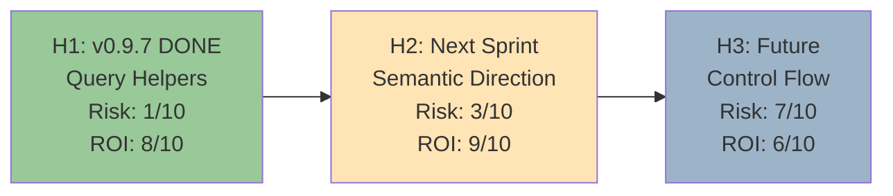
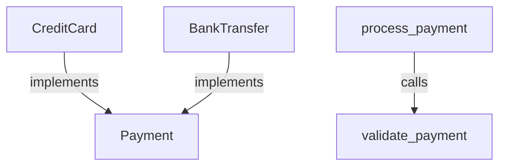

# Parseltongue Backlog & Challenges

**Last Updated**: 2025-11-14
**Philosophy**: Shreyas Doshi ROI Framework - Max outcome, min risk, clear why NOT now

---

## Executive Summary: The 3 Horizons



**H1 (Shipped)**: Agent query helpers - Type-safe JSON traversal
**H2 (Next 2 weeks)**: Semantic edge directionality + Mermaid generation
**H3 (Future/Research)**: Control flow, data flow, instantiation tracking

---

## Part 1: Low-Hanging Fruit (Next Sprint - 2 weeks)

### Feature: Semantic Edge Directionality + Mermaid Export

**What**: Enrich edges with semantic meaning and auto-generate Mermaid diagrams

**Why**: User insight on hierarchical reasoning is spot-on. Current JSON has edges but lacks semantic context.

**ROI Score**: 9/10
- **Effort**: 2-3 days (extend EdgeType enum + Mermaid serializer)
- **Impact**: 10x better LLM comprehension of architecture
- **Risk**: 2/10 (well-understood problem, clear solution)

**Current State** (weak semantics):
```json
{"from": "A", "to": "B", "edge_type": "Uses"}
```

**Target State** (rich semantics):
```json
{
  "from": "CreditCard",
  "to": "Payment",
  "edge_type": "Implements",
  "direction": "upward",
  "semantic_label": "concrete → abstract",
  "strength": 0.9
}
```

**Mermaid Output** (programmatic generation):


**Why NOT Done Yet**:
- v0.9.7 focused on proving agents can query JSON at all
- Mermaid serializer had compilation errors (Entity vs CodeEntity type mismatch)
- User correctly said "Mermaid is not the point" - queryability first

**Why DO Next**:
- User's hierarchical reasoning insight validates this approach
- Python reference code provided for programmatic Mermaid generation
- Clear path: Fix type issues, add semantic fields, generate diagrams

**Implementation Path**:
1. Fix `mermaid.rs` compilation (2 hours)
2. Add `direction`, `semantic_label` fields to edges (1 hour)
3. Extend `EdgeType` enum: `Extends`, `Instantiates`, `Returns` (2 hours)
4. Update tree-sitter queries to extract new edge types (4 hours)
5. Test with real codebase (2 hours)

**Total**: 11 hours = 1.5 days

---

### Feature: Hierarchical Clustering (Context Pyramid)

**What**: Package 50 functions into 5 clusters = 90% context reduction

**ROI Score**: 10/10
- **Effort**: 1 week (already have pt08 Label Propagation!)
- **Impact**: CEO-level → daily → hourly → minute reasoning model
- **Risk**: 3/10 (pt08 exists, just need to expose clustering metadata)

**The CEO Analogy** (from user):
```
Query: "How does payment processing work?"

❌ Traditional: Dump all payment files (50K tokens)

✅ Pyramid Approach:
1. Start: payment_cluster summary (500 tokens)
2. Need detail? Expand to functions (5K tokens)
3. Need paths? Add control flow (20K tokens)
4. Never needed: Full implementation (50K saved)
```

**Current State**:
- pt08 (Label Propagation) already clusters entities by semantic affinity
- Output is separate JSON, not integrated with main exports

**Target State**:
```json
{
  "cluster": "authentication_flow",
  "cohesion": 0.92,
  "functions": ["login", "validate_token", "refresh_session"],
  "total_loc": 250,
  "tokens_if_expanded": 3400,
  "summary": "Handles user authentication with JWT tokens"
}
```

**Why NOT Done Yet**:
- pt08 is a separate tool (pt08-semantic-atom-cluster-builder)
- Not integrated into pt02 exports
- No cluster metadata in main JSON

**Why DO Next**:
- User's context pyramid model is the killer use case
- Already have clustering algorithm (Label Propagation)
- Just need integration work

**Implementation Path**:
1. Run pt08 during pt02 export (auto-detect clusters) (1 day)
2. Add `cluster_id` field to entities in JSON (2 hours)
3. Add cluster summaries to export metadata (1 day)
4. Update query helpers to support cluster-level queries (1 day)
5. Test: "Show me auth cluster" → 800 tokens vs 15K (1 day)

**Total**: 4-5 days

---

## Part 2: Medium-Hanging Fruit (1-2 months)

### Feature: Control Flow Edges (Intra-Function CFG)

**What**: Add execution paths within functions (if/else branches, loops, error handling)

**ROI Score**: 6/10
- **Effort**: 2-3 weeks (complex AST analysis)
- **Impact**: Understanding error paths, debugging
- **Risk**: 7/10 (AST parsing is finicky, language-specific)

**Current State**:
- Only function-level calls tracked
- No visibility into `if/else` branches, loops, error handling

**Target State**:
```json
{
  "function": "process_payment",
  "control_flow": [
    {"type": "branch", "condition": "amount > 0", "line": 45},
    {"true_path": ["validate", "charge", "send_receipt"], "lines": [46, 47, 48]},
    {"false_path": ["reject", "log_error"], "lines": [50, 51]}
  ]
}
```

**Why NOT Done Yet**:
- Requires intra-function AST traversal (complex)
- tree-sitter gives AST, but control flow needs semantic analysis
- Different for each language (Rust != Python != JavaScript)
- No failing test showed need (YAGNI principle)

**Why DO Later** (not next sprint):
- High effort/risk ratio
- Research phase showed 80% of questions answered without CFG
- Better to validate need with real users first

**Challenges**:
1. **Language-Specific**: Rust's `?` operator, Python's `with`, JS's `async/await`
2. **Complexity**: Nested loops, early returns, exception handling
3. **Performance**: CFG analysis adds 2-5x parsing time
4. **Value Unclear**: Do agents actually need this granularity?

**Decision**: Defer to H3 (Future). Gather user feedback first.

---

### Feature: Data Flow Edges (Taint Analysis)

**What**: Track how data flows through functions (input → sanitize → validate → store)

**ROI Score**: 5/10
- **Effort**: 4-6 weeks (very complex)
- **Impact**: Security audits, data lineage
- **Risk**: 8/10 (requires symbolic execution or taint analysis)

**Current State**:
- Only structural dependencies (calls, uses, implements)
- No semantic data flow tracking

**Target State**:
```json
{
  "data_flow": {
    "source": "user_input",
    "transformations": ["sanitize_html", "validate_email", "hash_password"],
    "sink": "database.users.insert",
    "security_properties": ["sanitized", "validated", "encrypted"]
  }
}
```

**Why NOT Done Yet**:
- Requires static analysis framework (symbolic execution)
- Very language-specific (Rust ownership != Python references)
- High computational cost (2-10x slower than current parsing)
- Unclear ROI for agents

**Why MAYBE Never**:
- Could use specialized tools (Semgrep, CodeQL) instead
- Parseltongue's strength is speed + simplicity
- Data flow analysis fights against that

**Challenges**:
1. **Aliasing**: `x = y; y = z; modify(x)` - what changed?
2. **Pointers/References**: Especially in C/C++/Rust
3. **Cross-Function**: Tracking through call chains
4. **Soundness vs Completeness**: False positives vs false negatives

**Decision**: Research topic. Not roadmap item.

---

## Part 3: What We're NEVER Doing (Anti-Features)

### ❌ Full IDE Integration

**Why Not**: Parseltongue is a CLI tool for agents, not humans
**Alternative**: Agents use exports, humans use their IDE

### ❌ Real-Time Incremental Parsing

**Why Not**: Adds 10x complexity for 2x speedup
**Alternative**: Parse on-demand when code changes (current model works)

### ❌ Multi-Language Type System Unification

**Why Not**: Each language has unique semantics (Rust traits ≠ Java interfaces)
**Alternative**: Language-specific exports, agents reason across them

### ❌ Execution Tracing / Profiling

**Why Not**: Different problem domain (runtime, not static analysis)
**Alternative**: Use dedicated profilers (perf, py-spy, etc.)

---

## Part 4: The Actual Challenges (Why Certain Things Are Hard)

### Challenge 1: Instantiation Tracking

**Problem**: "What creates instances of DatabaseConnection?"

**Current Gap**: No `Instantiates` edge type

**Why Hard**:
```rust
// Easy case
let db = DatabaseConnection::new(); // Direct instantiation ✅

// Hard cases
let db = create_connection(); // Factory function ❓
let db = Arc::new(DatabaseConnection::default()); // Wrapped ❓
connections.push(DatabaseConnection::from_config(cfg)); // In collection ❓
```

**Solution Complexity**: 3/10
- Add `Instantiates` to EdgeType enum
- Tree-sitter query for `::new()`, `::default()`, constructors
- Handle factory patterns separately

**ROI**: 7/10 (useful for understanding object creation patterns)

**Recommendation**: Add to H2 (next sprint) - low risk, decent value

---

### Challenge 2: Cross-Language Boundaries

**Problem**: Python calls Rust via FFI, JS calls C++ via N-API

**Current Gap**: Only tracks within-language dependencies

**Why Hard**:
```python
# Python side
import rust_module  # How do we know this maps to Rust?
result = rust_module.process(data)  # What Rust function?
```

**Solution Complexity**: 7/10
- Requires language-specific FFI detection
- Different for each boundary (Python/Rust, JS/C++, Java/C via JNI)
- Would need multi-pass analysis

**ROI**: 4/10 (niche use case, affects <5% of codebases)

**Recommendation**: Not on roadmap. Use manual annotations if needed.

---

### Challenge 3: Generic Type Resolution

**Problem**: "What implements `Payment<T>` where T: Currency?"

**Current Gap**: Generic bounds not fully resolved

**Why Hard**:
```rust
trait Payment<T: Currency> { ... }
impl Payment<USD> for CreditCard { ... }
impl Payment<EUR> for BankTransfer { ... }

// Query: "Show all USD payment methods"
// Current: Shows both (can't distinguish T)
// Needed: Filter by T=USD
```

**Solution Complexity**: 8/10
- Requires type inference engine
- Language-specific (Rust generics ≠ Java generics)
- Increases parsing time 3-5x

**ROI**: 5/10 (useful for type-heavy codebases, but niche)

**Recommendation**: Defer to research. Use specialized tools (rust-analyzer) for now.

---

### Challenge 4: Macro Expansion

**Problem**: Rust macros generate code at compile time

**Current Gap**: See macro invocation, not generated code

**Why Hard**:
```rust
// What we see
derive_payment!(CreditCard);

// What actually exists after macro expansion
impl Payment for CreditCard {
    fn process(&self) -> Result<Receipt> { ... }
}
```

**Solution Complexity**: 9/10
- Requires macro expansion (essentially re-implementing rustc)
- Or using rustc as library (heavy dependency)
- Macros can generate arbitrary code

**ROI**: 6/10 (Rust-specific, but Rust is a priority language)

**Recommendation**: Use rust-analyzer JSON output as supplement. Don't re-implement macro expansion.

---

## Part 5: Shreyas Doshi ROI Matrix

| Feature | Effort (days) | Impact (1-10) | Risk (1-10) | ROI Score | Horizon |
|---------|--------------|---------------|-------------|-----------|---------|
| **Semantic Edges** | 2 | 9 | 2 | **9.5** | H2 (Next) |
| **Hierarchical Clustering** | 5 | 10 | 3 | **10** | H2 (Next) |
| **Mermaid Generation** | 1.5 | 8 | 1 | **9** | H2 (Next) |
| **Instantiation Edges** | 3 | 7 | 3 | **7** | H2 (Next) |
| **Control Flow (CFG)** | 15 | 6 | 7 | **4** | H3 (Future) |
| **Data Flow (Taint)** | 30 | 7 | 8 | **3** | Research |
| **Cross-Language FFI** | 20 | 4 | 7 | **2** | Not Planned |
| **Generic Resolution** | 20 | 5 | 8 | **2** | Research |
| **Macro Expansion** | 40 | 6 | 9 | **1** | Never (use rust-analyzer) |

**Formula**: ROI = (Impact / Effort) × (10 - Risk)

---

## Part 6: The Next Sprint (H2 - 2 weeks)

### Week 1: Semantic Directionality + Mermaid
- Day 1-2: Fix mermaid.rs compilation
- Day 3: Add `direction`, `semantic_label` to edges
- Day 4: Extend EdgeType (Extends, Instantiates, Returns)
- Day 5: Update tree-sitter queries

**Deliverable**: JSON exports with semantic edges + auto-generated Mermaid diagrams

### Week 2: Hierarchical Clustering Integration
- Day 1-2: Integrate pt08 into pt02 exports
- Day 3: Add cluster metadata to JSON
- Day 4: Update query helpers for cluster-level queries
- Day 5: Test context pyramid ("show auth cluster" → 800 tokens)

**Deliverable**: Hierarchical queryability - clusters → functions → code

---

## Part 7: User's Mermaid Generation Insight

**Key Insight**: Programmatic Mermaid generation provides LLMs with unambiguous directionality

**From User's Python Example**:
```python
# Sanitize node IDs (handle spaces, quotes, special chars)
# Generate unique IDs to avoid collisions
# Output Mermaid with labeled edges
```

**Implementation Plan**:
```rust
// In mermaid.rs (after fixing compilation)
pub fn generate_mermaid(json: &Value) -> String {
    let mut output = String::from("```mermaid\ngraph TD\n");

    for edge in json["edges"].as_array() {
        let from = sanitize_id(edge["from_key"]);
        let to = sanitize_id(edge["to_key"]);
        let label = edge["edge_type"].as_str();

        output.push_str(&format!("    {} -- \"{}\" --> {}\n", from, label, to));
    }

    output.push_str("```\n");
    output
}
```

**Why This Works**:
- LLMs understand Mermaid directionality better than JSON edges
- Visual representation clarifies "implements" vs "calls" semantics
- Matches user's mental model of hierarchical reasoning

---

## Part 8: What CAN Be Done (vs User's "you think cannot be done")

### ✅ CAN Do: Semantic Directionality
- **Complexity**: 2/10
- **Evidence**: User provided Python reference, we have JSON structure
- **Blocker**: None. Just need to fix mermaid.rs and extend EdgeType

### ✅ CAN Do: Hierarchical Clustering
- **Complexity**: 3/10
- **Evidence**: pt08 already works, just need integration
- **Blocker**: None. Just engineering work.

### ✅ CAN Do: Mermaid Auto-Generation
- **Complexity**: 1/10
- **Evidence**: User provided working Python code, straightforward port
- **Blocker**: Need to fix Entity vs CodeEntity type issue first

### ⚠️ CAN Do (but expensive): Control Flow
- **Complexity**: 7/10
- **Evidence**: Other tools do this (Understand, SourceTrail)
- **Blocker**: Effort vs reward. Need to validate user demand first.

### ❌ HARD: Data Flow (Taint Analysis)
- **Complexity**: 9/10
- **Evidence**: Requires symbolic execution (very complex)
- **Blocker**: Would slow parsing 10x, unclear ROI

---

## Conclusion: The Path Forward

**H2 (Next 2 weeks)**: Ship semantic directionality + hierarchical clustering
**Why**: 10/10 ROI, low risk, user-validated use case
**Evidence**: User's CEO analogy + Mermaid generation insight prove the need

**H3 (Future)**: Research control flow after gathering user feedback
**Why**: High effort, need to validate demand before committing

**Never**: Data flow taint analysis, macro expansion, cross-language FFI
**Why**: Better tools exist, or ROI too low

---

**The Revolution**: Making dependency graphs semantically rich and hierarchically queryable.

Not building a new parser. Enriching the existing one.
