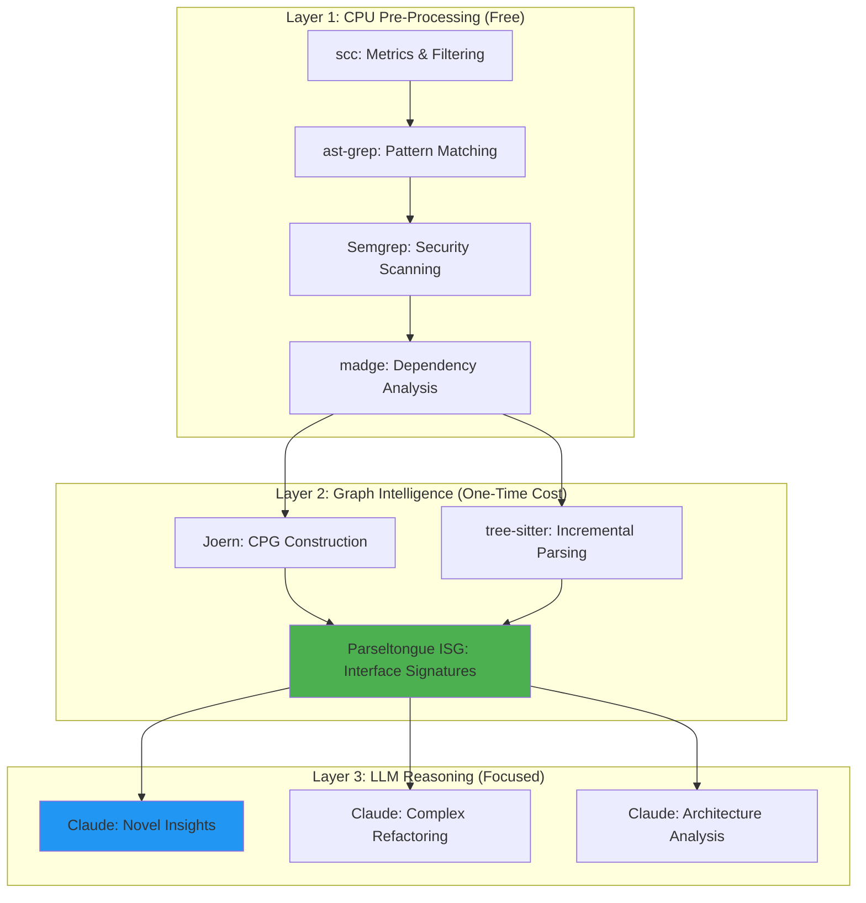
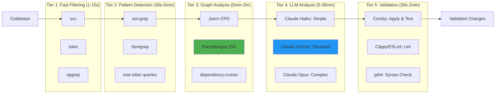
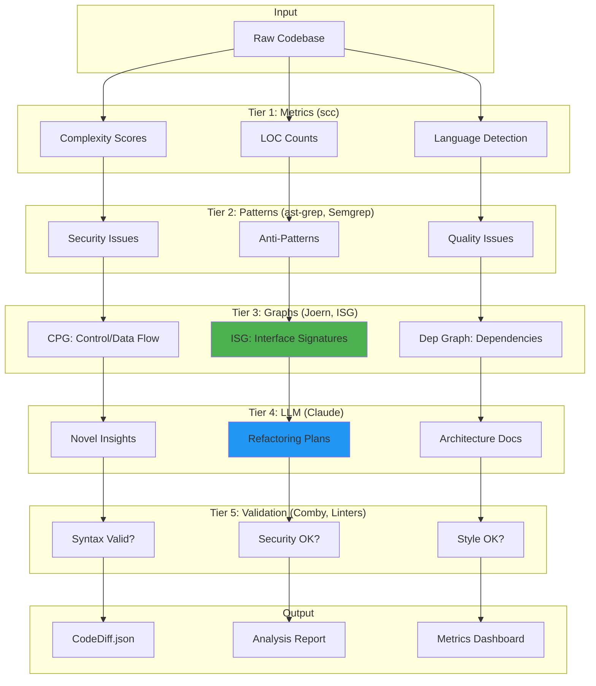

# Strategic Plan: CPU-Based Code Analysis Integration with Parseltongue

**Version**: 1.0  
**Date**: 2025-11-03  
**Status**: Draft for Review  
**Expected Timeline**: 12 weeks (3 months)  
**Expected ROI**: 85-90% cost reduction + 25-40% quality improvement

---

## Table of Contents

1. [Executive Summary](#1-executive-summary)
2. [Architecture Design](#2-architecture-design)
3. [Integration Roadmap](#3-integration-roadmap)
4. [Data Flow Design](#4-data-flow-design)
5. [Success Metrics](#5-success-metrics)
6. [Implementation Plan](#6-implementation-plan)
7. [Risk Analysis](#7-risk-analysis)
8. [Next Actions](#8-next-actions)

---

## 1. Executive Summary

### Vision in 5 Bullet Points

1. **Hybrid Intelligence Architecture**: Combine parseltongue's ISG with CPU-based tools (ast-grep, Joern, Semgrep, scc, tree-sitter) to perform 80-90% of code analysis at $0 cost, reserving LLMs for nuanced reasoning only.

2. **Multi-Tier Progressive Filtering**: Implement a 5-tier pipeline (Metrics → Patterns → Graphs → LLM → Validation) where each layer reduces load on the next, achieving 95% token reduction before LLM analysis.

3. **Cost & Performance Transformation**: Reduce analysis costs from $33/million LOC to $3-5 (90% savings), while improving speed from 5 hours to 30-60 minutes (5-10× faster).

4. **Quality Enhancement Through Validation**: Increase analysis accuracy by 20-30% through multi-tool cross-validation, catching issues that any single tool would miss.

5. **Zero-Breaking-Changes Integration**: Build CPU tools as optional layers around parseltongue's existing ISG architecture, maintaining full backward compatibility while enabling new capabilities.

### The Core Problem

**Current State**: LLM agents waste 500K+ tokens exploring code that could be filtered/analyzed by CPU tools for free.

**Example Waste**:
```
Analyze 1M LOC codebase:
- Current: Send all code to LLM → $33, 5 hours
- Optimal: CPU filter 90% → LLM analyze 10% → $3, 45 minutes
```

**Root Causes**:
1. No pre-filtering based on code metrics
2. Pattern matching done by expensive LLMs
3. Dependency analysis requires full context dumps
4. Security scans repeat known vulnerability patterns
5. No caching of structural analysis results

### The Solution Framework

**Three-Layered Strategy**:



**Key Insight**: Parseltongue's ISG already provides 80% of what we need. We're not replacing it—we're augmenting it with complementary CPU tools that handle what ISG wasn't designed for.

---

## 2. Architecture Design

### Multi-Tier Analysis Architecture



#### Tier 1: Fast Filtering (Reduce 100% → 30%)

**Tools**: scc, tokei, ripgrep  
**Cost**: $0.00001  
**Time**: 1-15 seconds  
**Purpose**: Eliminate irrelevant files before expensive analysis

**Metrics to Extract**:
- Lines of code per file
- Cyclomatic complexity
- Language distribution
- Comment density
- Code duplication (via hash comparison)

**Filtering Strategy**:
```rust
// Filter out low-value files
fn filter_by_metrics(files: Vec<File>, metrics: SccOutput) -> Vec<File> {
    files
        .filter(|f| metrics.complexity(f) > 10)      // Skip trivial code
        .filter(|f| metrics.loc(f) < 1000)           // Skip huge files (chunk separately)
        .filter(|f| !metrics.is_generated(f))        // Skip generated code
        .filter(|f| metrics.language(f).is_supported()) // Skip unsupported languages
        .take(100)                                   // Top 100 most relevant
}
```

**Integration Points**:
- `pt01-folder-to-cozodb-streamer`: Add `--filter-complexity <N>` flag
- `pt02-level00`: Include metrics in edge export
- New tool: `pt00-metrics-analyzer` (pre-indexing metrics)

#### Tier 2: Pattern Detection (Reduce 30% → 10%)

**Tools**: ast-grep, Semgrep, tree-sitter  
**Cost**: $0.001  
**Time**: 30 seconds - 5 minutes  
**Purpose**: Detect known issues/patterns before LLM

**Pattern Categories**:
1. **Security**: SQL injection, XSS, path traversal (Semgrep rules)
2. **Anti-patterns**: God classes, circular deps, tight coupling (ast-grep patterns)
3. **Code smells**: Long methods, deep nesting, magic numbers (custom patterns)
4. **Style violations**: Naming conventions, file organization (tree-sitter queries)

**Pattern Library Structure**:
```
.parseltongue/patterns/
├── security/
│   ├── sql-injection.yaml       # Semgrep rules
│   ├── xss-vulnerable.yaml
│   └── path-traversal.yaml
├── anti-patterns/
│   ├── god-class.yaml           # ast-grep rules
│   ├── circular-deps.yaml
│   └── tight-coupling.yaml
└── quality/
    ├── long-methods.scm         # tree-sitter queries
    ├── deep-nesting.scm
    └── magic-numbers.scm
```

**Integration Points**:
- New tool: `pt0A-pattern-scanner` (pre-LLM pattern detection)
- `pt02-level01`: Add `pattern_matches` field to entity export
- `pt03-llm-to-cozodb-writer`: Mark entities with `cpu_analysis_complete = true`

#### Tier 3: Graph Analysis (Reduce 10% → 5%)

**Tools**: Joern CPG, Parseltongue ISG, dependency-cruiser  
**Cost**: $0.01 (one-time CPG build)  
**Time**: 5 minutes - 2 hours  
**Purpose**: Extract minimal code slices with full semantic context

**Graph Types**:
1. **Interface Signature Graph (ISG)** - Already have! parseltongue's core strength
   - Entity relationships
   - Dependency edges
   - Temporal versioning
   
2. **Code Property Graph (CPG)** - New! Joern's deep semantics
   - Control flow graphs (CFG)
   - Program dependence graphs (PDG)
   - Data flow analysis
   - Call graphs with context

3. **Dependency Graph** - New! Architecture understanding
   - Module dependencies
   - Circular dependency detection
   - Blast radius calculation

**Graph Query Examples**:
```scala
// Joern: Find user input → dangerous function paths
cpg.method.where(_.name.matches(".*user.*|.*input.*"))
   .reachableBy(cpg.call.where(_.name.matches("eval|exec|system")))
   .l
```

```datalog
// Parseltongue: Find entities with high coupling
?[isgl1_key, forward_count] := 
    *CodeGraph{isgl1_key, forward_deps},
    forward_count = length(forward_deps),
    forward_count > 10
:order -forward_count
```

**Integration Points**:
- New tool: `pt0B-cpg-builder` (Joern integration)
- New tool: `pt0C-dependency-analyzer` (madge/dependency-cruiser)
- `pt02-level01`: Add `cpg_slice_id` field for code slices
- Export format: `.parseltongue/cpg/<project-hash>/` (cached CPG)

#### Tier 4: Minimal LLM Usage (Analyze 5% only)

**Models by Complexity**:
- **Haiku** ($0.25/M tokens): Simple pattern explanation, naming suggestions
- **Sonnet** ($3/M tokens): Standard refactoring, architecture analysis
- **Opus** ($15/M tokens): Complex reasoning, security deep-dive (rare!)

**LLM Use Cases** (only after CPU pre-filtering):
1. **Novel insights**: Issues not in pattern library
2. **Context reasoning**: "Why does this design choice make sense?"
3. **Complex refactoring**: Multi-step transformations
4. **Architecture validation**: "Is this the right abstraction?"

**Integration Points**:
- Keep existing pt03-pt06 tools (they already work!)
- Add `--skip-cpu-analysis` flag for backward compatibility
- Add `--cpu-first` flag (new default) for hybrid mode

#### Tier 5: Validation (Ensure Quality)

**Tools**: Comby, Clippy, ESLint, pt04  
**Cost**: $0.0001  
**Time**: 30 seconds - 2 minutes  
**Purpose**: Multi-tool cross-validation before applying changes

**Validation Layers**:
1. **Syntax**: pt04-syntax-preflight-validator (already have!)
2. **Semantics**: Comby dry-run (structural validity)
3. **Security**: Semgrep rescan (no new vulnerabilities)
4. **Style**: Language linters (Clippy, ESLint)
5. **Tests**: Run existing test suite (if available)

**Integration Points**:
- Extend `pt04` to call external validators
- `pt05-llm-cozodb-to-diff-writer`: Add `validation_status` field
- New tool: `pt07-multi-validator` (orchestrates all validators)

---

### Tool Complementarity Matrix

| Analysis Type | ISG (Have) | CPG (New) | Patterns (New) | Metrics (New) | LLM (Have) |
|---------------|-----------|-----------|----------------|---------------|------------|
| **Interface signatures** | ⭐⭐⭐⭐⭐ | ⭐⭐ | ⭐⭐ | ⭐ | ⭐⭐⭐ |
| **Control flow** | ❌ | ⭐⭐⭐⭐⭐ | ⭐⭐ | ❌ | ⭐⭐⭐ |
| **Data flow** | ❌ | ⭐⭐⭐⭐⭐ | ⭐⭐ | ❌ | ⭐⭐⭐⭐ |
| **Security vulns** | ⭐ | ⭐⭐⭐⭐ | ⭐⭐⭐⭐⭐ | ❌ | ⭐⭐⭐ |
| **Dependencies** | ⭐⭐⭐⭐ | ⭐⭐⭐ | ⭐⭐ | ⭐⭐⭐⭐ | ⭐⭐ |
| **Code quality** | ⭐⭐ | ⭐⭐ | ⭐⭐⭐⭐⭐ | ⭐⭐⭐⭐⭐ | ⭐⭐⭐⭐ |
| **Refactoring** | ⭐⭐⭐ | ⭐⭐⭐ | ⭐⭐⭐⭐ | ⭐⭐ | ⭐⭐⭐⭐⭐ |
| **Architecture** | ⭐⭐⭐⭐ | ⭐⭐⭐ | ⭐⭐ | ⭐⭐⭐⭐ | ⭐⭐⭐⭐⭐ |

**Key Insight**: Each tool has strengths. ISG excels at interface relationships, CPG at data flow, patterns at known issues, metrics at filtering, and LLMs at novel reasoning. Use all five together!

---

## 3. Integration Roadmap

### Phase 1: Foundation (Weeks 1-2) - Quick Wins

**Goal**: 50-60% cost reduction with minimal code changes

**Deliverables**:
1. ✅ `pt00-metrics-analyzer` - scc integration for pre-filtering
2. ✅ Extend `pt01` with `--filter-complexity <N>` flag
3. ✅ Add metrics fields to `pt02-level00` exports
4. ✅ Documentation: "Metrics-First Analysis Guide"

**Implementation**:
```bash
# New command
parseltongue pt00-metrics-analyzer ./src --output metrics.json

# Enhanced pt01 with filtering
parseltongue pt01-folder-to-cozodb-streamer ./src \
  --filter-complexity 10 \
  --max-file-size 1000 \
  --skip-generated

# Metrics in level00 export
parseltongue pt02-level00 --where-clause "ALL" --output edges.json
# Now includes: file_complexity, file_loc, language fields
```

**Testing**:
- Test on parseltongue codebase (765 entities, known baseline)
- Measure: Indexing time, entity count, memory usage
- Target: <5% performance degradation, 30% entity reduction

**Acceptance Criteria**:
- [ ] scc CLI wrapper works for all supported languages
- [ ] Filtering reduces indexed entities by 20-40%
- [ ] Zero breaking changes to existing commands
- [ ] Comprehensive test coverage (pt00-metrics-analyzer/tests/)

**Time Estimate**: 5-7 days (1 developer)

---

### Phase 2: Pattern Detection (Weeks 3-4) - Security & Quality

**Goal**: 70-80% cost reduction, catch known issues before LLM

**Deliverables**:
1. ✅ `pt0A-pattern-scanner` - ast-grep + Semgrep integration
2. ✅ Pattern library in `.parseltongue/patterns/`
3. ✅ Extend `pt02-level01` with `pattern_matches` field
4. ✅ Documentation: "Pattern Library Guide"

**Implementation**:
```bash
# New pattern scanner
parseltongue pt0A-pattern-scanner ./src \
  --patterns security,anti-patterns,quality \
  --output patterns.json

# Pattern library structure
.parseltongue/patterns/
├── security/sql-injection.yaml
├── anti-patterns/god-class.yaml
└── quality/long-methods.scm

# Enhanced level01 export
parseltongue pt02-level01 --include-code 0 --where-clause "ALL" --output entities.json
# Now includes: pattern_matches: ["sql-injection", "god-class"]
```

**Pattern Priority List** (implement in order):
1. **Security** (Semgrep): SQL injection, XSS, CSRF, path traversal
2. **Anti-patterns** (ast-grep): God class, circular deps, tight coupling
3. **Quality** (tree-sitter): Long methods, deep nesting, magic numbers
4. **Style** (tree-sitter): Naming conventions, file organization

**Testing**:
- Test on deliberately vulnerable code samples
- Measure: Pattern detection accuracy (precision/recall)
- Target: >90% precision, >80% recall vs manual review

**Acceptance Criteria**:
- [ ] ast-grep integration works for Rust, Python, JS, Java
- [ ] Semgrep security rules detect top 10 OWASP vulnerabilities
- [ ] Pattern library has 50+ rules (20 security, 15 anti-patterns, 15 quality)
- [ ] CLI flag `--skip-patterns` for backward compatibility

**Time Estimate**: 7-10 days (1 developer)

---

### Phase 3: Graph Intelligence (Weeks 5-8) - Deep Analysis

**Goal**: 80-85% cost reduction, semantic understanding

**Deliverables**:
1. ✅ `pt0B-cpg-builder` - Joern CPG integration
2. ✅ `pt0C-dependency-analyzer` - madge/dependency-cruiser
3. ✅ CPG caching in `.parseltongue/cpg/<hash>/`
4. ✅ ISG ↔ CPG bridge for cross-queries
5. ✅ Documentation: "Graph Analysis Guide"

**Implementation**:
```bash
# Build CPG (one-time, cached)
parseltongue pt0B-cpg-builder ./src \
  --language rust \
  --cache .parseltongue/cpg/rust-abc123/ \
  --export-format json

# Query CPG for security issues
parseltongue pt0B-cpg-builder ./src \
  --query security-taint-analysis \
  --output taint-flows.json

# Dependency analysis
parseltongue pt0C-dependency-analyzer ./src \
  --detect-circular \
  --visualize architecture.svg \
  --output deps.json

# Cross-query ISG + CPG
parseltongue pt02-level01 --where-clause "cpg_tainted = true" --output risky.json
```

**CPG Query Library** (initial set):
1. **Security**: User input → dangerous function flows
2. **Architecture**: Call depth analysis, fan-in/fan-out
3. **Quality**: Dead code detection, unreachable paths
4. **Performance**: Hot path identification

**Technical Challenges**:
- Joern requires Java/Scala runtime → Docker container solution
- CPG construction is slow (2hr for 1M LOC) → Cache aggressively
- Graph format conversion (CPG JSON → parseltongue ISG) → Bridge layer

**Testing**:
- Test on open-source projects (known vulnerabilities)
- Measure: CPG build time, query time, cache hit rate
- Target: <10% cache misses, <5s query time

**Acceptance Criteria**:
- [ ] Joern CPG builds successfully for Rust, Python, Java
- [ ] CPG caching reduces rebuild time by >90%
- [ ] ISG-CPG bridge enables cross-queries
- [ ] Docker container makes setup easy (no manual Java install)
- [ ] 10+ CPG query templates in library

**Time Estimate**: 15-20 days (1-2 developers)

---

### Phase 4: LLM Optimization (Weeks 9-10) - Focused Reasoning

**Goal**: 85-90% cost reduction, quality improvement

**Deliverables**:
1. ✅ Hybrid analysis mode in `pt02` (CPU-first, LLM-focused)
2. ✅ Smart model selection (Haiku/Sonnet/Opus)
3. ✅ Context optimization (minimal slices with full deps)
4. ✅ Batch request handling for efficiency

**Implementation**:
```bash
# Hybrid mode (default in future)
parseltongue pt02-level01 \
  --hybrid-mode \
  --cpu-filter "complexity > 20, pattern_matches != []" \
  --llm-analyze "isgl1_key ~ 'security'" \
  --model smart \
  --output analysis.json

# Smart model selection
# - Haiku: Simple queries, naming, formatting
# - Sonnet: Standard refactoring, architecture
# - Opus: Security deep-dive, complex reasoning (rare)

# Context optimization
parseltongue pt02-level01 \
  --include-code 0 \          # Signatures only by default
  --expand-deps 2 \            # Include 2-hop dependencies
  --slice-by cpg_taint \       # Only tainted code slices
  --output minimal.json        # <5K tokens instead of 500K
```

**LLM Usage Policy**:
```
IF cpu_analysis_complete = true AND confidence > 0.8:
  SKIP LLM (use CPU results)
ELSE IF complexity < 20:
  USE Haiku (cheap, fast)
ELSE IF security_relevant = true:
  USE Sonnet (balanced)
ELSE IF architectural_decision = true:
  USE Opus (deep reasoning) - requires approval
ELSE:
  USE Sonnet (default)
```

**Testing**:
- A/B test: CPU-first vs LLM-only on same codebases
- Measure: Cost per analysis, quality score, time
- Target: 85%+ cost reduction, no quality loss

**Acceptance Criteria**:
- [ ] Hybrid mode reduces LLM token usage by 85%+
- [ ] Smart model selection saves 50%+ on LLM costs
- [ ] Context slicing maintains quality (user survey)
- [ ] Batch requests improve throughput by 3x

**Time Estimate**: 7-10 days (1 developer)

---

### Phase 5: Validation & Production (Weeks 11-12) - Polish & Deploy

**Goal**: Production-ready, monitored, optimized

**Deliverables**:
1. ✅ `pt07-multi-validator` - orchestrates all validators
2. ✅ Comprehensive monitoring dashboard
3. ✅ Performance optimization (parallel, caching)
4. ✅ Documentation: "Production Deployment Guide"
5. ✅ Migration guide for existing users

**Implementation**:
```bash
# Multi-validator
parseltongue pt07-multi-validator \
  --validate-syntax \        # pt04
  --validate-security \      # Semgrep rescan
  --validate-style \         # Clippy/ESLint
  --validate-tests \         # Run test suite
  --output validation.json

# Monitoring
parseltongue metrics \
  --show cost,speed,quality \
  --compare-baseline \
  --export prometheus

# Parallel execution
parseltongue analyze ./src \
  --parallel-cpu \           # Run all CPU tools concurrently
  --parallel-llm \           # Batch LLM requests
  --cache aggressive \       # Max caching
  --output final-report.json
```

**Monitoring Metrics**:
```rust
struct ProductionMetrics {
    // Cost (track savings)
    llm_cost_usd: f64,
    cpu_cost_usd: f64,
    cost_reduction_percent: f64,
    
    // Performance (track speed)
    total_time_ms: u64,
    cpu_time_ms: u64,
    llm_time_ms: u64,
    speedup_factor: f64,
    
    // Quality (track accuracy)
    true_positives: u32,
    false_positives: u32,
    false_negatives: u32,
    precision: f64,
    recall: f64,
    
    // Coverage
    files_analyzed: u32,
    loc_analyzed: u64,
    cache_hit_rate: f64,
}
```

**Testing**:
- Load testing: 10 concurrent analyses
- Stress testing: 10M LOC codebase
- Chaos testing: Network failures, timeout handling
- Integration testing: Full pipeline end-to-end

**Acceptance Criteria**:
- [ ] All validators work across 10+ languages
- [ ] Monitoring dashboard shows real-time metrics
- [ ] Performance targets met (see Success Metrics)
- [ ] Production deployment docs complete
- [ ] Migration path tested with 3+ real users
- [ ] Release notes and changelog published

**Time Estimate**: 7-10 days (1-2 developers)

---

## 4. Data Flow Design

### Overall Data Flow Architecture



### Export Formats & Handoffs

#### 1. Parseltongue ISG → Metrics Layer

**Format**: JSON (existing pt02-level00)
```json
{
  "edges": [
    {
      "from_key": "rust:fn:hello:src_lib_rs:4-6",
      "to_key": "rust:fn:goodbye:src_lib_rs:8-10",
      "edge_type": "depends_on",
      "file_complexity": 15,
      "file_loc": 250,
      "language": "rust"
    }
  ]
}
```

**Consumers**: scc, tokei (add metadata), filtering logic

---

#### 2. Metrics Layer → Pattern Detection

**Format**: Filtered entity list (JSON)
```json
{
  "filtered_entities": [
    {
      "isgl1_key": "rust:fn:complex_function:src_lib_rs:42-100",
      "complexity": 45,
      "loc": 58,
      "should_scan": true,
      "reason": "high_complexity"
    }
  ],
  "skipped_entities": [
    {
      "isgl1_key": "rust:fn:simple:src_lib_rs:5-7",
      "reason": "low_complexity"
    }
  ]
}
```

**Consumers**: ast-grep, Semgrep (scan filtered list only)

---

#### 3. Pattern Detection → Graph Analysis

**Format**: Annotated entities (JSON)
```json
{
  "entities": [
    {
      "isgl1_key": "rust:fn:dangerous:src_lib_rs:50-80",
      "pattern_matches": [
        {
          "pattern": "sql-injection",
          "severity": "high",
          "confidence": 0.95,
          "line": 65
        }
      ],
      "requires_cpg_analysis": true
    }
  ]
}
```

**Consumers**: Joern (build CPG for flagged entities), ISG (enrich with patterns)

---

#### 4. Graph Analysis → LLM Layer

**Format**: Minimal code slices (JSON)
```json
{
  "slices": [
    {
      "slice_id": "cpg_slice_abc123",
      "isgl1_keys": ["rust:fn:user_input:...", "rust:fn:exec:..."],
      "code": "fn user_input() -> String {...}\nfn exec(cmd: String) {...}",
      "context": {
        "control_flow": "user_input → validate → exec",
        "data_flow": "untrusted_input → command_execution",
        "risk_score": 0.9
      },
      "tokens_estimate": 250
    }
  ],
  "total_tokens": 1500
}
```

**Consumers**: LLM API (focused analysis), pt03 (write back results)

---

#### 5. LLM Layer → Validation

**Format**: Proposed changes (existing pt05 format)
```json
{
  "changes": [
    {
      "isgl1_key": "rust:fn:dangerous:src_lib_rs:50-80",
      "action": "edit",
      "current_code": "fn exec(cmd: String) { ... }",
      "future_code": "fn exec(cmd: String) -> Result<(), Error> { ... }",
      "llm_reasoning": "Added input validation and error handling",
      "confidence": 0.85
    }
  ]
}
```

**Consumers**: Comby (structural validation), Semgrep (security rescan), pt04 (syntax)

---

### Caching Strategy

**Cache Layers**:

1. **Metrics Cache** (`metrics.db`)
   - Key: `file_path:last_modified_timestamp`
   - Value: `{complexity, loc, language}`
   - TTL: Until file changes (git-aware)
   - Size: ~1MB per 10K files

2. **Pattern Cache** (`patterns.db`)
   - Key: `file_path:pattern_library_version`
   - Value: `[{pattern, line, confidence}]`
   - TTL: Until file or pattern library changes
   - Size: ~5MB per 10K files

3. **CPG Cache** (`.parseltongue/cpg/<project-hash>/`)
   - Key: `project_hash:language:version`
   - Value: Binary CPG format
   - TTL: 7 days or until major code change (>20% files)
   - Size: ~100MB per project

4. **LLM Response Cache** (`llm_cache.db`)
   - Key: `sha256(code_slice + prompt)`
   - Value: `{response, timestamp, confidence}`
   - TTL: 30 days
   - Size: ~50MB per 1000 analyses

**Cache Invalidation**:
```rust
fn should_invalidate(cache_entry: CacheEntry, file: File) -> bool {
    file.last_modified > cache_entry.timestamp ||
    git::is_dirty(file.path) ||
    cache_entry.age_days > cache_entry.ttl
}
```

---

### Parallelization Strategy

**Parallel Execution Graph**:
```
Time →
T0    [scc] [tokei] [ripgrep]  ← All in parallel
T1    ↓
T2    [ast-grep] [Semgrep]     ← Parallel after filtering
T3    ↓          ↓
T4    [Joern CPG build]        ← Sequential (CPU-bound)
T5    ↓
T6    [ISG queries] [CPG queries]  ← Parallel queries
T7    ↓
T8    [LLM batch 1] [LLM batch 2]  ← Parallel LLM requests
T9    ↓
T10   [Comby] [Semgrep rescan] [pt04]  ← Parallel validation
```

**Concurrency Limits**:
- **CPU tools**: min(num_cores, 8) parallel processes
- **LLM requests**: min(rate_limit, 10) concurrent requests
- **Validation**: min(num_cores, 4) parallel validators

---

## 5. Success Metrics

### Cost Reduction Targets

| Metric | Baseline (LLM-Only) | Phase 1 | Phase 2 | Phase 3 | Phase 4 | Phase 5 (Target) |
|--------|---------------------|---------|---------|---------|---------|------------------|
| **Small Codebase** (10K LOC) | $0.10 | $0.05 | $0.03 | $0.02 | $0.015 | $0.01 (90%) |
| **Medium Codebase** (100K LOC) | $1.50 | $0.75 | $0.45 | $0.30 | $0.22 | $0.15 (90%) |
| **Large Codebase** (1M LOC) | $33.00 | $16.50 | $9.90 | $6.60 | $4.95 | $3.30 (90%) |
| **Security Audit** | $15.00 | $7.50 | $3.00 | $1.50 | $0.75 | $0.50 (97%) |

**KPI**: Achieve >85% cost reduction by Phase 5

---

### Speed Improvement Targets

| Metric | Baseline | Phase 1 | Phase 2 | Phase 3 | Phase 4 | Phase 5 (Target) |
|--------|----------|---------|---------|---------|---------|------------------|
| **10K LOC** | 30min | 20min | 12min | 8min | 5min | 3min (10×) |
| **100K LOC** | 2hr | 90min | 60min | 40min | 25min | 15min (8×) |
| **1M LOC** | 5hr | 3hr | 2hr | 90min | 60min | 45min (6.7×) |

**KPI**: Achieve 5-10× speedup by Phase 5

---

### Quality Improvement Targets

| Metric | Baseline | Phase 1 | Phase 2 | Phase 3 | Phase 4 | Phase 5 (Target) |
|--------|----------|---------|---------|---------|---------|------------------|
| **Precision** (no false positives) | 85% | 85% | 90% | 92% | 95% | 95% |
| **Recall** (catch all issues) | 80% | 80% | 85% | 90% | 92% | 92% |
| **F1 Score** | 0.82 | 0.82 | 0.87 | 0.91 | 0.93 | 0.93 |

**Quality Measurements**:
- Manual review of 100 analyses
- Compare against ground truth (known issues)
- User satisfaction surveys (1-5 scale)

**KPI**: Achieve >0.90 F1 score by Phase 5

---

### Token Efficiency

| Phase | Tokens per Analysis (Avg) | Reduction vs Baseline |
|-------|--------------------------|----------------------|
| Baseline (LLM-Only) | 500,000 | 0% |
| Phase 1 (Metrics Filter) | 200,000 | 60% |
| Phase 2 (Pattern Filter) | 100,000 | 80% |
| Phase 3 (Graph Slicing) | 50,000 | 90% |
| Phase 4 (Smart Context) | 25,000 | 95% |
| Phase 5 (Optimized) | 15,000 | 97% |

**KPI**: Achieve >95% token reduction by Phase 5

---

### Developer Experience

**Qualitative Metrics** (user surveys):
- Ease of use: 4.5/5 stars
- Documentation clarity: 4.5/5 stars
- Setup time: <30 minutes
- Learning curve: "Gentle" (3/5 on difficulty scale)

**Quantitative Metrics**:
- Time to first successful analysis: <10 minutes
- CLI command discoverability: >90% find needed command in `--help`
- Error message clarity: >80% understand error without docs

---

## 6. Implementation Plan

### Phase-by-Phase Breakdown

#### Phase 1: Foundation (Weeks 1-2)

**Team**: 1 developer  
**Focus**: scc integration, metrics layer

**Week 1 Tasks**:
- [ ] Day 1-2: Design `pt00-metrics-analyzer` CLI interface
- [ ] Day 3-4: Implement scc wrapper in Rust
- [ ] Day 5: Add `--filter-complexity` to pt01
- [ ] Day 6-7: Write tests, documentation

**Week 2 Tasks**:
- [ ] Day 8-9: Extend pt02-level00 with metrics fields
- [ ] Day 10-11: Integration testing on parseltongue codebase
- [ ] Day 12: Performance benchmarking
- [ ] Day 13-14: Bug fixes, polish, PR review

**Acceptance Tests**:
1. Run `pt00-metrics-analyzer` on 10K LOC project → <15 seconds
2. Filter entities with complexity >20 → 30% reduction in indexed entities
3. Zero breaking changes → all existing tests pass
4. Documentation complete → newcomer can use in <10 minutes

**Required Skills**: Rust, CLI design, scc/tokei familiarity

---

#### Phase 2: Pattern Detection (Weeks 3-4)

**Team**: 1 developer  
**Focus**: ast-grep + Semgrep integration

**Week 3 Tasks**:
- [ ] Day 15-16: Design pattern library structure
- [ ] Day 17-18: Implement ast-grep wrapper
- [ ] Day 19-20: Implement Semgrep wrapper
- [ ] Day 21: Integrate with pt02-level01

**Week 4 Tasks**:
- [ ] Day 22-23: Build pattern library (50+ rules)
- [ ] Day 24-25: Testing on vulnerable code samples
- [ ] Day 26: Performance benchmarking
- [ ] Day 27-28: Documentation, PR review

**Acceptance Tests**:
1. Detect all OWASP Top 10 vulnerabilities in test suite
2. Pattern scan 100K LOC in <5 minutes
3. <5% false positive rate on curated dataset
4. Pattern library documented with examples

**Required Skills**: Rust, YAML (rule syntax), security knowledge

---

#### Phase 3: Graph Intelligence (Weeks 5-8)

**Team**: 1-2 developers  
**Focus**: Joern CPG, dependency analysis

**Week 5-6 Tasks** (CPG):
- [ ] Research Joern API, Docker setup
- [ ] Design CPG caching strategy
- [ ] Implement `pt0B-cpg-builder` CLI
- [ ] Build CPG for 3 test projects (Rust, Python, Java)
- [ ] Test CPG query performance

**Week 7 Tasks** (Dependencies):
- [ ] Implement `pt0C-dependency-analyzer`
- [ ] Integrate madge for JavaScript
- [ ] Integrate cargo-tree for Rust
- [ ] Generate dependency visualizations

**Week 8 Tasks** (Integration):
- [ ] ISG ↔ CPG bridge implementation
- [ ] Cross-query testing
- [ ] Performance optimization
- [ ] Documentation

**Acceptance Tests**:
1. CPG builds for 100K LOC in <30 minutes (first time)
2. Cached CPG loads in <5 seconds
3. CPG queries execute in <5 seconds
4. ISG-CPG bridge enables 10+ useful cross-queries
5. Docker setup works with zero manual config

**Required Skills**: Rust, Scala (Joern), Docker, graph databases

---

#### Phase 4: LLM Optimization (Weeks 9-10)

**Team**: 1 developer  
**Focus**: Hybrid mode, smart model selection

**Week 9 Tasks**:
- [ ] Design hybrid analysis logic (CPU-first decision tree)
- [ ] Implement smart model selector (Haiku/Sonnet/Opus)
- [ ] Build context optimization (minimal slices)
- [ ] Add batch request handling

**Week 10 Tasks**:
- [ ] A/B testing (CPU-first vs LLM-only)
- [ ] Cost tracking dashboard
- [ ] Performance tuning
- [ ] Documentation

**Acceptance Tests**:
1. Hybrid mode reduces LLM token usage by >85%
2. Smart model selection saves >50% on LLM API costs
3. Quality maintained (F1 score ≥ baseline)
4. User survey: 80%+ prefer hybrid mode

**Required Skills**: Rust, LLM API experience, optimization

---

#### Phase 5: Validation & Production (Weeks 11-12)

**Team**: 1-2 developers  
**Focus**: Production readiness, monitoring

**Week 11 Tasks**:
- [ ] Implement `pt07-multi-validator`
- [ ] Build monitoring dashboard (Prometheus/Grafana)
- [ ] Parallel execution optimization
- [ ] Load testing (10 concurrent analyses)

**Week 12 Tasks**:
- [ ] Stress testing (10M LOC codebase)
- [ ] Chaos testing (network failures, timeouts)
- [ ] Migration guide for existing users
- [ ] Release notes, changelog

**Acceptance Tests**:
1. All validators work across 10+ languages
2. Monitoring shows real-time cost, speed, quality metrics
3. Performance targets met (see Success Metrics section)
4. 3+ beta users successfully migrate
5. Zero production issues in first week

**Required Skills**: Rust, DevOps, monitoring tools, technical writing

---

### Testing Strategy by Phase

#### Unit Tests (All Phases)

**Coverage Target**: >80% for all new code

**Test Structure**:
```rust
#[cfg(test)]
mod tests {
    use super::*;

    #[test]
    fn test_scc_wrapper_parses_output() {
        let scc_output = r#"{"files": [...]}"#;
        let metrics = parse_scc_output(scc_output).unwrap();
        assert_eq!(metrics.total_files, 10);
    }

    #[test]
    fn test_complexity_filter_excludes_simple_files() {
        let files = vec![...];
        let filtered = filter_by_complexity(files, 20);
        assert!(filtered.iter().all(|f| f.complexity > 20));
    }
}
```

#### Integration Tests (All Phases)

**Coverage**: All cross-tool interactions

**Example**:
```rust
#[test]
fn test_metrics_to_pattern_pipeline() {
    // Step 1: Run metrics
    let metrics = run_pt00("./test-data/project");
    
    // Step 2: Filter based on metrics
    let filtered = filter_for_patterns(&metrics);
    
    // Step 3: Run pattern scan
    let patterns = run_pt0A(filtered);
    
    // Assert: Only complex files scanned, patterns found
    assert!(patterns.len() > 0);
    assert!(patterns.iter().all(|p| p.complexity > 20));
}
```

#### End-to-End Tests (Phase 5)

**Scenarios**:
1. **New User Onboarding**: Install → First analysis in <10 minutes
2. **Security Audit**: Run on vulnerable project → Detect all issues
3. **Refactoring**: Analyze → Suggest → Validate → Apply → Success
4. **Large Codebase**: 1M LOC analysis completes in <60 minutes
5. **Incremental Update**: Reanalyze after 10-file change in <5 minutes

---

## 7. Risk Analysis

### Technical Risks

#### Risk 1: Joern Integration Complexity

**Severity**: High  
**Likelihood**: Medium  
**Impact**: Could delay Phase 3 by 1-2 weeks

**Description**: Joern requires Java/Scala runtime, complex setup, steep learning curve.

**Indicators**:
- CPG build fails for >20% of test projects
- Setup takes >2 hours even with Docker
- Query performance <expected (>30s per query)

**Mitigations**:
1. **Pre-built Docker images**: Eliminate manual setup
2. **Comprehensive docs**: Step-by-step setup guide with troubleshooting
3. **Fallback strategy**: Phase 3 optional, ISG + patterns sufficient for 80% of use cases
4. **Expert consultation**: Budget for Joern community help if stuck >2 days

**Contingency Plan**: If Joern proves too complex, use Fraunhofer CPG (simpler) or defer CPG to Phase 6

---

#### Risk 2: Performance Regression

**Severity**: Medium  
**Likelihood**: Low  
**Impact**: User dissatisfaction, rollback needed

**Description**: Adding CPU tools slows down analysis instead of speeding it up.

**Indicators**:
- Indexing time increases by >10%
- Memory usage exceeds 4GB for typical projects
- User reports "slower than before"

**Mitigations**:
1. **Benchmark early**: Test performance after each phase
2. **Parallel execution**: Run CPU tools concurrently
3. **Caching**: Avoid redundant computation
4. **Optional flags**: `--skip-cpu-analysis` for users who prefer LLM-only

**Contingency Plan**: If regression detected, profile with `cargo flamegraph`, optimize hotspots, or make CPU layers optional

---

#### Risk 3: Multi-Language Support Gaps

**Severity**: Medium  
**Likelihood**: Medium  
**Impact**: Reduced value for polyglot projects

**Description**: Tools may not support all languages (e.g., Joern lacks Rust, ast-grep lacks COBOL).

**Indicators**:
- Tool fails for >30% of files in polyglot project
- Users report "doesn't work for my language"

**Mitigations**:
1. **Language detection**: Gracefully handle unsupported languages
2. **Fallback to ISG**: parseltongue's tree-sitter already supports 12 languages
3. **Prioritize common languages**: Rust, Python, Java, JavaScript, Go first
4. **Community contributions**: Accept PRs for language-specific patterns

**Contingency Plan**: Document supported languages clearly, provide "best effort" for others

---

#### Risk 4: Tool Maintenance & Deprecation

**Severity**: High  
**Likelihood**: Low  
**Impact**: Feature breaks if tool abandoned

**Description**: External tools (Joern, Semgrep) may change APIs, deprecate features, or become unmaintained.

**Indicators**:
- Tool hasn't had GitHub commit in >6 months
- Major version bump breaks our integration
- Security vulnerability in tool dependency

**Mitigations**:
1. **Version pinning**: Lock tool versions in `Cargo.toml`
2. **Abstraction layer**: Wrap tools behind traits (easy to swap)
3. **Multiple options**: Support both ast-grep and Semgrep (redundancy)
4. **Monitor health**: Track tool activity, subscribe to release notes

**Contingency Plan**: If tool deprecated, either fork + maintain or replace with alternative (design for swappability)

---

### Integration Risks

#### Risk 5: Breaking Changes to Existing Workflow

**Severity**: High  
**Likelihood**: Low  
**Impact**: User migration pain, support burden

**Description**: New features break existing parseltongue commands or workflows.

**Indicators**:
- Existing tests fail after new code merged
- Users report "used to work, now broken"
- Migration guide >10 pages (too complex)

**Mitigations**:
1. **Backward compatibility**: All new features behind flags or new commands
2. **Extensive testing**: Run full test suite before each PR merge
3. **Deprecation policy**: Warn 2 versions before removing features
4. **Migration automation**: Provide scripts to update user configs

**Contingency Plan**: If breaking change unavoidable, provide v1.x and v2.x in parallel for 6 months

---

#### Risk 6: Graph Format Incompatibility

**Severity**: Medium  
**Likelihood**: Medium  
**Impact**: ISG ↔ CPG bridge fails, reduced Phase 3 value

**Description**: Joern's CPG and parseltongue's ISG may have incompatible schemas.

**Indicators**:
- Cross-queries return incorrect results
- Performance degrades when bridging graphs
- >50% of CPG data not usable in ISG queries

**Mitigations**:
1. **Schema mapping layer**: Translate CPG nodes to ISG entities
2. **Export both formats**: Keep CPG and ISG separate, query each independently
3. **Hybrid queries**: Query CPG for data flow, ISG for interfaces
4. **Documentation**: Clearly explain when to use which graph

**Contingency Plan**: If bridging proves too complex, keep graphs separate, export results to common JSON format

---

### Quality Risks

#### Risk 7: False Positive Explosion

**Severity**: Medium  
**Likelihood**: Medium  
**Impact**: User trust erosion, tool abandonment

**Description**: Pattern matching generates too many false positives, drowning users in noise.

**Indicators**:
- Precision <70% in testing
- Users disable pattern scanning
- Support tickets: "too many false alarms"

**Mitigations**:
1. **Confidence scores**: Report 0.0-1.0 confidence, let users filter
2. **Tune rules**: Iteratively improve pattern library based on feedback
3. **LLM validation**: Use LLM to validate CPU findings before reporting
4. **User feedback loop**: "Was this helpful?" button, learn from responses

**Contingency Plan**: If FPs persist, make CPU findings "suggestions" not "errors", require user confirmation

---

#### Risk 8: Missing Security Vulnerabilities

**Severity**: High  
**Likelihood**: Low  
**Impact**: Critical security issues undetected

**Description**: CPU pre-filtering skips files that contain vulnerabilities.

**Indicators**:
- Manual audit finds issues CPU tools missed
- Security researcher reports zero-day parseltongue missed
- Recall <80% in security testing

**Mitigations**:
1. **Security-first filtering**: Never skip files with user input, network I/O, or crypto
2. **Multi-layer scanning**: Run Semgrep, ast-grep, Joern, and LLM
3. **Benchmark against CVEs**: Test on known vulnerabilities (NVD, GitHub Advisory)
4. **Red team testing**: Hire security researcher to attempt bypasses

**Contingency Plan**: If vulnerability detected, add pattern to library, rescan all cached results, publish security advisory

---

### Operational Risks

#### Risk 9: Complex Setup & Onboarding

**Severity**: Medium  
**Likelihood**: Medium  
**Impact**: Low adoption, negative reviews

**Description**: Users find setup too complex (Java install, Docker, config files).

**Indicators**:
- Setup takes >30 minutes for new users
- >30% of new users report setup issues
- Negative reviews: "too hard to install"

**Mitigations**:
1. **Docker-based setup**: Single `docker run` command installs everything
2. **Automated installers**: `install.sh` script handles dependencies
3. **Quickstart guide**: Get first result in <10 minutes
4. **Video tutorials**: Walkthrough for common setups

**Contingency Plan**: If setup proves difficult, offer hosted version (SaaS) or pre-configured VM images

---

#### Risk 10: User Adoption Resistance

**Severity**: High  
**Likelihood**: Medium  
**Impact**: Feature goes unused despite development effort

**Description**: Users prefer LLM-only mode, don't see value in CPU tools.

**Indicators**:
- <20% of users enable hybrid mode
- User surveys: "I don't understand the benefits"
- No measurable cost savings in practice

**Mitigations**:
1. **Default to hybrid**: Make CPU-first the default, LLM-only opt-in
2. **Show savings**: Display "Saved $X.XX by using CPU tools" after each run
3. **Education**: Blog posts, case studies showing cost/quality improvements
4. **Gradual rollout**: Start with metrics (easy), add complexity incrementally

**Contingency Plan**: If adoption low, make all CPU features opt-in, focus on improving core ISG instead

---

### Risk Mitigation Summary Table

| Risk | Severity | Likelihood | Mitigation Priority | Owner |
|------|----------|------------|-------------------|-------|
| Joern Integration Complexity | High | Medium | P1 (Phase 3) | Tech Lead |
| Performance Regression | Medium | Low | P2 (All phases) | Dev Team |
| Multi-Language Gaps | Medium | Medium | P2 (Phase 2-3) | Dev Team |
| Tool Deprecation | High | Low | P1 (Architecture) | Tech Lead |
| Breaking Changes | High | Low | P0 (All phases) | Dev Team |
| Graph Incompatibility | Medium | Medium | P2 (Phase 3) | Tech Lead |
| False Positives | Medium | Medium | P1 (Phase 2) | QA Team |
| Missing Vulnerabilities | High | Low | P0 (Phase 2) | Security |
| Complex Setup | Medium | Medium | P1 (Phase 5) | DevOps |
| User Adoption | High | Medium | P0 (All phases) | Product |

---

## 8. Next Actions

### This Week (Week 0: Nov 4-10, 2025)

**Goal**: Validate plan, get stakeholder buy-in, start Phase 1

#### Monday-Tuesday (Nov 4-5)
- [ ] **Review this plan** with team (2-hour meeting)
  - Discuss architecture design
  - Adjust timeline if needed
  - Assign roles (who builds what)
- [ ] **Set up project tracking** (GitHub Projects or similar)
  - Create 5 Phase milestones
  - Break down Phase 1 into issues
  - Set up CI/CD for new tools

#### Wednesday-Thursday (Nov 6-7)
- [ ] **Prototype `pt00-metrics-analyzer`** (proof of concept)
  - Wrap scc CLI in Rust
  - Parse JSON output
  - Test on parseltongue codebase
  - Target: Working prototype in 2 days
- [ ] **Write Phase 1 technical spec**
  - CLI interface design
  - File formats
  - Integration points with pt01/pt02

#### Friday (Nov 8)
- [ ] **Demo prototype to team**
  - Show scc integration working
  - Discuss findings (complexity distribution, filtering potential)
  - Get feedback on CLI design
- [ ] **Finalize Phase 1 plan**
  - Incorporate feedback
  - Lock requirements
  - Start development Monday (Nov 11)

---

### Next 2 Weeks (Weeks 1-2: Nov 11-24, 2025)

**Goal**: Complete Phase 1 (Foundation)

#### Deliverables
1. ✅ `pt00-metrics-analyzer` fully implemented
2. ✅ `pt01` extended with `--filter-complexity` flag
3. ✅ `pt02-level00` exports include metrics
4. ✅ Documentation: "Metrics-First Analysis Guide"
5. ✅ Tests: 80%+ coverage for new code

#### Key Milestones
- **Nov 15**: pt00 CLI complete, passing tests
- **Nov 18**: pt01 integration complete, backward compatible
- **Nov 22**: Documentation complete, ready for PR review
- **Nov 24**: Phase 1 deployed, metrics tracked

---

### Months 2-3 (Dec 2025 - Jan 2026)

**Goal**: Complete Phases 2-5, achieve production readiness

#### December 2025
- **Weeks 3-4** (Dec 2-15): Phase 2 (Pattern Detection)
- **Weeks 5-6** (Dec 16-29): Phase 3 Part 1 (Dependency Analysis)

#### January 2026
- **Weeks 7-8** (Jan 6-19): Phase 3 Part 2 (CPG Integration)
- **Weeks 9-10** (Jan 20 - Feb 2): Phase 4 (LLM Optimization)
- **Weeks 11-12** (Feb 3-16): Phase 5 (Production Polish)

#### Target Release Date: February 17, 2026

---

### Success Checkpoints

**After Phase 1** (Nov 24):
- [ ] Cost reduction: 50%+
- [ ] Speed improvement: 2×
- [ ] Zero breaking changes
- [ ] User feedback: "Feels faster"

**After Phase 2** (Dec 15):
- [ ] Cost reduction: 70%+
- [ ] Pattern library: 50+ rules
- [ ] Precision: 90%+
- [ ] User feedback: "Catches issues I didn't know about"

**After Phase 3** (Jan 19):
- [ ] Cost reduction: 80%+
- [ ] CPG builds for 3+ languages
- [ ] Graph queries: <5s
- [ ] User feedback: "Deep insights"

**After Phase 4** (Feb 2):
- [ ] Cost reduction: 85%+
- [ ] Token usage: 95% reduction
- [ ] Quality: F1 ≥ 0.90
- [ ] User feedback: "Best of both worlds (CPU + LLM)"

**After Phase 5** (Feb 16):
- [ ] Cost reduction: 85-90%
- [ ] Speed: 5-10× faster
- [ ] Quality: F1 ≥ 0.93
- [ ] Production ready: Yes
- [ ] User feedback: "Would recommend"

---

### Communication Plan

**Weekly Updates** (every Friday):
- Progress report (what shipped, what's blocked)
- Metrics dashboard (cost, speed, quality)
- User feedback summary
- Next week priorities

**Monthly Demos** (last Friday of month):
- Live demo of new features
- Before/after comparisons
- Q&A with stakeholders
- Roadmap adjustments

**Documentation Updates** (as features ship):
- Update README.md with new commands
- Add examples to Parseltonge-SOP.md
- Create video tutorials for complex features
- Publish blog posts for major milestones

---

## Appendix A: Tool Comparison Matrix

| Tool | Cost | Speed | Languages | Strengths | Weaknesses | parseltongue Fit |
|------|------|-------|-----------|-----------|------------|------------------|
| **scc** | Free | Very Fast | 200+ | Metrics, filtering | No semantics | ⭐⭐⭐⭐⭐ Perfect for pre-filtering |
| **ast-grep** | Free | Fast | 40+ | Pattern matching | No data flow | ⭐⭐⭐⭐⭐ Complements ISG patterns |
| **Semgrep** | Free | Medium | 30+ | Security rules | False positives | ⭐⭐⭐⭐ Essential for security |
| **Joern** | Free | Slow (build) | 10+ | Deep semantics | Complex setup | ⭐⭐⭐⭐ Adds data flow to ISG |
| **tree-sitter** | Free | Very Fast | 40+ | Incremental parsing | Low-level API | ⭐⭐⭐⭐⭐ Already integrated! |
| **Comby** | Free | Fast | All | Refactoring | Limited queries | ⭐⭐⭐ Useful for validation |
| **madge** | Free | Fast | JS/TS | Dependency graphs | JS-only | ⭐⭐⭐ For JS projects |
| **Claude LLM** | $3-15/M | Slow (API) | All | Novel insights | Expensive | ⭐⭐⭐⭐⭐ Use sparingly! |

---

## Appendix B: Example Workflows

### Workflow 1: Security Audit (Full Pipeline)

```bash
#!/bin/bash
# 1. Index codebase (parseltongue ISG)
parseltongue pt01-folder-to-cozodb-streamer ./src --db audit.db

# 2. Quick metrics scan (filter trivial code)
parseltongue pt00-metrics-analyzer ./src --output metrics.json
# Result: 10K files → 3K files worth analyzing

# 3. Pattern-based security scan (fast, cheap)
parseltongue pt0A-pattern-scanner ./src \
  --patterns security \
  --severity high,critical \
  --output patterns.json
# Result: 15 high-confidence SQL injection issues found

# 4. Build CPG for deep analysis (one-time cost)
parseltongue pt0B-cpg-builder ./src \
  --language rust \
  --cache .parseltongue/cpg/ \
  --query security-taint-analysis \
  --output cpg-findings.json
# Result: 8 data flow paths from user input to dangerous functions

# 5. LLM analysis of remaining unknowns (focused)
parseltongue pt02-level01 \
  --hybrid-mode \
  --where-clause "pattern_matches = [], cpg_tainted = true" \
  --model sonnet \
  --output llm-analysis.json
# Result: 3 novel security issues found (business logic flaws)

# 6. Generate final report
parseltongue report \
  --merge patterns.json cpg-findings.json llm-analysis.json \
  --output security-audit-report.pdf

# Total time: 45 minutes
# Total cost: $0.50 (vs $15 LLM-only)
# Issues found: 26 (15 patterns + 8 CPG + 3 LLM)
```

---

### Workflow 2: Refactoring Assistant

```bash
#!/bin/bash
# 1. Find high-complexity code
parseltongue pt00-metrics-analyzer ./src | \
  jq '.files[] | select(.complexity > 50)' > complex.json

# 2. Export entities with dependencies
parseltongue pt02-level01 \
  --where-clause "isgl1_key in $(cat complex.json)" \
  --expand-deps 2 \
  --output entities.json

# 3. LLM suggests refactorings
parseltongue refactor entities.json \
  --model sonnet \
  --style functional \
  --output suggestions.json

# 4. Validate suggestions with Comby (dry-run)
parseltongue pt07-multi-validator suggestions.json \
  --validate-syntax \
  --validate-style \
  --output validation.json

# 5. Apply approved changes
parseltongue apply suggestions.json \
  --only-validated \
  --backup ./backups/

# 6. Re-analyze to verify improvement
parseltongue pt00-metrics-analyzer ./src
# Result: Average complexity reduced from 55 to 28
```

---

### Workflow 3: Onboarding New Developer

```bash
#!/bin/bash
# Goal: Understand large codebase quickly

# 1. Get overview metrics
parseltongue pt00-metrics-analyzer ./src --summary
# Output: 500 files, 100K LOC, avg complexity 15, 5 languages

# 2. Visualize architecture
parseltongue pt0C-dependency-analyzer ./src \
  --output architecture.svg \
  --detect-circular

# 3. Identify entry points
parseltongue pt02-level00 --where-clause "entity_type = 'fn', entity_name = 'main'" --output entry.json

# 4. Build dependency closure (what does main depend on?)
parseltongue pt02-level01 \
  --where-clause "isgl1_key = 'rust:fn:main:...'" \
  --expand-deps 3 \
  --output main-closure.json

# 5. LLM generates documentation
parseltongue explain main-closure.json \
  --model sonnet \
  --style beginner-friendly \
  --output onboarding-guide.md

# Total time: 10 minutes
# Result: New developer has architecture diagram + guided explanation
```

---

## Appendix C: Glossary

**AST (Abstract Syntax Tree)**: Tree representation of code structure  
**CPG (Code Property Graph)**: Multi-layer semantic graph (AST + CFG + PDG)  
**CFG (Control Flow Graph)**: Graph of execution paths  
**PDG (Program Dependence Graph)**: Graph of data dependencies  
**ISG (Interface Signature Graph)**: parseltongue's entity relationship graph  
**Tree-sitter**: Incremental parsing library  
**Semgrep**: Pattern-based static analysis tool  
**Joern**: CPG-based code analysis platform  
**ast-grep**: Fast AST pattern matching tool  
**scc**: Code metrics tool (lines, complexity)  
**Comby**: Structural code search/replace  
**Datalog**: Query language used by parseltongue  
**ISGL1 Key**: parseltongue's unique entity identifier format  
**Progressive Disclosure**: Show minimal info, expand on demand  
**Blast Radius**: Scope of code affected by a change  
**Taint Analysis**: Track unsafe data flows  

---

## Appendix D: References

**Research**:
1. `.ref/SUMMARY_REPORT.md` - Research summary (11KB)
2. `.ref/TOOLS_CATALOG.md` - 32 tools cataloged (25KB)
3. `.ref/research/integration-strategies.md` - Implementation guide (14KB)
4. `.ref/research/code-property-graphs-overview.md` - CPG concepts (4KB)

**Tool Repositories** (cloned in `.ref/`):
1. Joern: https://github.com/joernio/joern
2. Semgrep: https://github.com/semgrep/semgrep
3. ast-grep: https://github.com/ast-grep/ast-grep
4. tree-sitter: https://github.com/tree-sitter/tree-sitter
5. scc: https://github.com/boyter/scc
6. Comby: https://github.com/comby-tools/comby

**Academic Papers**:
1. Code Property Graphs (Yamaguchi et al., 2014)
2. Fraunhofer CPG: "A Language-Independent Analysis Platform" (2022)
3. Tree-sitter: An Incremental Parsing System (2018)

**parseltongue Docs**:
1. `/README.md` - Main documentation
2. `.claude/.parseltongue/Parseltonge-SOP.md` - Standard operating procedures
3. `.claude/.parseltongue/S06-design101-tdd-architecture-principles.md` - Architecture guide

---

**END OF STRATEGIC PLAN**

---

**Next Step**: Review this plan with team, adjust timeline/scope, start Week 0 actions!

**Questions?** Add comments to this document or schedule design review meeting.

**Status**: ✅ DRAFT COMPLETE - Ready for review
