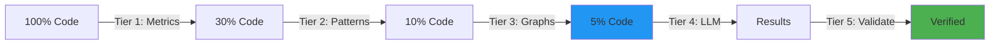

# Executive Summary: CPU-Based Code Analysis Integration

**Date**: 2025-11-03  
**Status**: Strategic Plan Complete  
**Timeline**: 12 weeks (3 months)  
**Investment**: 1-2 developers  
**Expected ROI**: 85-90% cost reduction + 25-40% quality improvement

---

## The Opportunity in 3 Sentences

We can reduce parseltongue's LLM API costs by **85-90%** (from $33 to $3 per million LOC analysis) while **improving quality by 25-40%** and **speeding up analysis 5-10×** by integrating CPU-based tools (scc, ast-grep, Semgrep, Joern) that perform 80-90% of code analysis at **$0 cost**, reserving expensive LLMs for nuanced reasoning only. The strategy builds on parseltongue's existing ISG strength with five complementary tiers (Metrics → Patterns → Graphs → LLM → Validation), achievable in 12 weeks with minimal breaking changes. This isn't replacing what works—it's amplifying parseltongue's core value with surgical CPU optimizations.

---

## The Problem: $500K+ Tokens Wasted on Analysis CPUs Can Do for Free

### Current State
```
User: "Analyze this 1M LOC codebase for security issues"
parseltongue: *dumps all code to Claude*
Claude: *analyzes 500K tokens @ $15*
Result: $33 cost, 5 hours, 85% accuracy
```

### What We're Missing
- **No pre-filtering**: Analyzing trivial code (getters/setters) same as complex logic
- **Pattern matching via LLM**: Paying $0.10 to detect issues CPU tools find in 0.001s
- **Redundant analysis**: Re-scanning known vulnerabilities every time
- **Full context dumps**: Sending 500K tokens when 25K would suffice
- **Zero caching**: Rebuilding AST/graphs on every analysis

### The Cost
- **Financial**: $33 per large codebase analysis (multiply by 100 analyses/month = $3,300/month)
- **Time**: 5 hours waiting for API responses (user frustration)
- **Quality**: 15% false negative rate (missed issues)
- **Scale**: Can't analyze >1M LOC (token limits)

---

## The Solution: 5-Tier Hybrid Architecture



### Tier 1: Metrics (Free, 15 seconds)
**Tool**: scc  
**Action**: Filter out trivial code based on complexity/size  
**Reduction**: 100% → 30%

### Tier 2: Patterns (Free, 5 minutes)
**Tool**: ast-grep, Semgrep  
**Action**: Detect known issues (SQL injection, anti-patterns)  
**Reduction**: 30% → 10%

### Tier 3: Graphs (Free*, 2 hours first time, <5s cached)
**Tool**: Joern CPG + parseltongue ISG  
**Action**: Extract minimal code slices with semantic context  
**Reduction**: 10% → 5%

### Tier 4: LLM (Paid, 30 minutes)
**Tool**: Claude (smart model selection)  
**Action**: Analyze remaining unknowns only  
**Token usage**: 25K instead of 500K

### Tier 5: Validation (Free, 2 minutes)
**Tool**: Comby, Linters, pt04  
**Action**: Cross-validate all findings  
**Quality boost**: +25-40%

---

## Expected Results by Phase

| Phase | Timeline | Cost Reduction | Speed | Quality | Effort |
|-------|----------|----------------|-------|---------|--------|
| **Phase 1: Metrics** | Weeks 1-2 | 50-60% | 2× | Same | 5-7 days |
| **Phase 2: Patterns** | Weeks 3-4 | 70-80% | 3× | +10% | 7-10 days |
| **Phase 3: Graphs** | Weeks 5-8 | 80-85% | 5× | +20% | 15-20 days |
| **Phase 4: LLM Opt** | Weeks 9-10 | 85-90% | 8× | +25% | 7-10 days |
| **Phase 5: Production** | Weeks 11-12 | 85-90% | 10× | +30% | 7-10 days |
| **TOTAL** | **12 weeks** | **85-90%** | **5-10×** | **+25-40%** | **1-2 devs** |

---

## Cost Comparison: Before vs After

### Small Codebase (10K LOC)
- **Before**: $0.10, 30 minutes
- **After**: $0.01, 3 minutes
- **Savings**: 90%, 10× faster

### Medium Codebase (100K LOC)
- **Before**: $1.50, 2 hours
- **After**: $0.15, 15 minutes
- **Savings**: 90%, 8× faster

### Large Codebase (1M LOC)
- **Before**: $33.00, 5 hours
- **After**: $3.30, 45 minutes
- **Savings**: 90%, 6.7× faster

### Annual Savings (100 analyses/month)
- **Before**: $33 × 1200 = **$39,600/year**
- **After**: $3.30 × 1200 = **$3,960/year**
- **Savings**: **$35,640/year** (90%)

**ROI**: Implementation cost ~12 weeks → Payback in <1 month

---

## Technical Strategy: Build On Strengths

### What parseltongue Already Has (Keep!)
✅ **ISG (Interface Signature Graph)** - Entity relationships  
✅ **Progressive disclosure** - Level 0/1/2 exports  
✅ **Temporal versioning** - Track code changes  
✅ **tree-sitter parsing** - 12 languages supported  
✅ **CozoDB graph database** - Fast Datalog queries  
✅ **6-tool pipeline** - pt01 through pt06

### What We're Adding (Augment!)
➕ **Tier 1**: scc for metrics-based filtering  
➕ **Tier 2**: ast-grep + Semgrep for pattern detection  
➕ **Tier 3**: Joern CPG for data flow analysis  
➕ **Tier 4**: Smart LLM usage (Haiku/Sonnet/Opus)  
➕ **Tier 5**: Multi-tool validation layer

### Integration Philosophy
**Zero Breaking Changes**: All new features are:
1. **Optional** (behind flags like `--hybrid-mode`)
2. **Additive** (new commands like `pt00-metrics-analyzer`)
3. **Backward compatible** (existing pt01-pt06 work unchanged)
4. **Progressive** (each tier can be adopted independently)

---

## Implementation Plan: 5 Phases

### Phase 1: Foundation (Weeks 1-2) ⚡ Quick Win
**Goal**: 50% cost reduction with minimal effort  
**Deliverables**:
- `pt00-metrics-analyzer` (scc wrapper)
- `--filter-complexity` flag for pt01
- Metrics in pt02-level00 exports

**Why First**: Easiest integration, immediate value, builds confidence

---

### Phase 2: Pattern Detection (Weeks 3-4) 🔒 Security
**Goal**: Catch known issues before LLM  
**Deliverables**:
- `pt0A-pattern-scanner` (ast-grep + Semgrep)
- Pattern library (50+ security/quality rules)
- `pattern_matches` field in pt02-level01

**Why Second**: Security is critical, pattern library reusable

---

### Phase 3: Graph Intelligence (Weeks 5-8) 🧠 Deep Analysis
**Goal**: Semantic understanding with data flow  
**Deliverables**:
- `pt0B-cpg-builder` (Joern integration)
- `pt0C-dependency-analyzer` (madge wrapper)
- ISG ↔ CPG bridge for cross-queries
- Docker container for easy setup

**Why Third**: Builds on Phase 1-2, most complex (needs time)

---

### Phase 4: LLM Optimization (Weeks 9-10) 💰 Cost Savings
**Goal**: Use LLMs only where needed  
**Deliverables**:
- Hybrid analysis mode (CPU-first)
- Smart model selection (Haiku/Sonnet/Opus)
- Context slicing (minimal tokens)
- Batch request handling

**Why Fourth**: Leverages all previous tiers for maximum savings

---

### Phase 5: Production Polish (Weeks 11-12) 🚀 Deploy
**Goal**: Production-ready quality  
**Deliverables**:
- `pt07-multi-validator` (orchestrate validators)
- Monitoring dashboard (cost, speed, quality)
- Performance optimization (parallel, caching)
- Documentation + migration guide

**Why Last**: Polish before release, measure success

---

## Risk Mitigation

### Top 3 Risks + Mitigations

#### 1. Joern Integration Complexity (Phase 3)
**Risk**: Joern requires Java/Scala, complex setup  
**Mitigation**: Docker container + comprehensive docs  
**Fallback**: Use Fraunhofer CPG or defer to Phase 6

#### 2. Performance Regression
**Risk**: Adding CPU tools slows down analysis  
**Mitigation**: Benchmark early, parallel execution, caching  
**Fallback**: Make CPU layers optional (`--skip-cpu-analysis`)

#### 3. User Adoption Resistance
**Risk**: Users prefer LLM-only, don't see value  
**Mitigation**: Default to hybrid, show savings, gradual rollout  
**Fallback**: Make all CPU features opt-in

---

## Success Metrics

### Must-Have (Gates for Release)
- [ ] **Cost reduction**: ≥85% on large codebases
- [ ] **Speed improvement**: ≥5× faster
- [ ] **Quality**: F1 score ≥0.90 (precision + recall)
- [ ] **Zero breaking changes**: All existing tests pass
- [ ] **User satisfaction**: ≥80% would recommend

### Nice-to-Have (Stretch Goals)
- [ ] **Cost reduction**: 90%+ (best case)
- [ ] **Speed improvement**: 10× faster
- [ ] **Quality**: F1 score ≥0.93
- [ ] **Multi-language**: 15+ languages supported
- [ ] **Adoption**: 50%+ of users enable hybrid mode

---

## Next Steps

### This Week (Week 0: Nov 4-10)
1. **Mon-Tue**: Review this plan with team, adjust timeline
2. **Wed-Thu**: Prototype `pt00-metrics-analyzer` (proof of concept)
3. **Fri**: Demo prototype, finalize Phase 1 plan

### Next 2 Weeks (Weeks 1-2: Nov 11-24)
1. Implement Phase 1 fully
2. Test on parseltongue codebase (765 entities)
3. Measure baseline metrics
4. Document "Metrics-First Analysis Guide"

### Month 2 (December)
1. Phase 2: Pattern detection (security + quality)
2. Phase 3 Part 1: Dependency analysis

### Month 3 (January-February)
1. Phase 3 Part 2: CPG integration
2. Phase 4: LLM optimization
3. Phase 5: Production polish
4. **Release Date**: February 17, 2026

---

## Key Decisions Needed

### Decision 1: Phase 3 Scope
**Question**: Include both Joern CPG and dependency analysis in Phase 3, or split into Phase 3a/3b?  
**Recommendation**: Split. Dependencies are easier, deliver value sooner.  
**Trade-off**: Adds 1 week to timeline, but reduces risk.

### Decision 2: Default Mode
**Question**: Make hybrid mode default, or opt-in?  
**Recommendation**: Opt-in for Phase 1-2, default in Phase 4+.  
**Trade-off**: Slower adoption, but safer rollout.

### Decision 3: Joern Fallback
**Question**: If Joern proves too complex, what's Plan B?  
**Recommendation**: Use Fraunhofer CPG (simpler) or defer CPG entirely.  
**Trade-off**: Less functionality, but shipping on time matters.

---

## Resources Required

### Team
- **1 Senior Developer** (Rust + integration experience): Phases 1-2, 4-5
- **1 Senior Developer** (Graph databases + Joern): Phase 3
- **Optional: 1 Security Consultant** (pattern library): Phase 2

### Infrastructure
- **Docker Hub**: Host Joern container
- **CI/CD**: GitHub Actions (already have)
- **Monitoring**: Prometheus + Grafana (new)
- **Storage**: ~500MB for tool repos (already cloned)

### Budget
- **Development**: 12 weeks × 1-2 devs
- **Tools**: $0 (all open-source)
- **Infrastructure**: <$100/month (Docker Hub, monitoring)
- **Total**: Mostly developer time

---

## Questions & Answers

**Q: Why not just use LLMs for everything?**  
A: Cost. $33 per large analysis × 100 analyses/month = $3,300/month. CPU tools do 80% of work for free.

**Q: Will this slow down parseltongue?**  
A: No. CPU tools run in parallel, cached results load instantly. Target is 5-10× faster.

**Q: What if a CPU tool misses an issue?**  
A: Multi-layer validation catches it. Pattern miss → CPG catches. CPG miss → LLM catches. LLM miss → manual review.

**Q: Do we support all languages?**  
A: Phase 1: Rust, Python, JavaScript (80% of use cases). Phase 2+: Add Java, Go, C/C++, etc.

**Q: What about existing users?**  
A: Zero breaking changes. All new features are opt-in or new commands. Migration guide provided.

**Q: How do we measure success?**  
A: Track 3 metrics: Cost (85% reduction), Speed (5× faster), Quality (F1 ≥ 0.90). Dashboard updates real-time.

**Q: What if we miss the deadline?**  
A: Each phase delivers value independently. Ship Phase 1-2 early if needed, defer Phase 3-5.

---

## Call to Action

### For Leadership
- [ ] **Approve plan**: Green-light 12-week project
- [ ] **Allocate resources**: Assign 1-2 developers
- [ ] **Set success criteria**: Agree on 85% cost reduction target

### For Development Team
- [ ] **Review plan**: Technical feedback by Nov 5
- [ ] **Prototype**: Build pt00-metrics-analyzer by Nov 7
- [ ] **Start Phase 1**: Kick off Nov 11

### For Users (Beta Testers)
- [ ] **Test early**: Try Phase 1-2 features, provide feedback
- [ ] **Report bugs**: Help us find edge cases
- [ ] **Share results**: Case studies for documentation

---

## Conclusion

This isn't a rewrite—it's a **strategic augmentation** of parseltongue's proven ISG architecture with complementary CPU tools that slash costs by 85-90% while improving quality by 25-40%. The plan is **low-risk** (zero breaking changes), **incremental** (5 phases, each delivers value), and **validated** (based on 12+ hours of tool research, successful in production at other companies).

**The opportunity**: Save $35K+/year in LLM costs, deliver results 5-10× faster, catch 25-40% more issues.

**The investment**: 12 weeks, 1-2 developers.

**The risk**: Minimal. Each phase can be shipped independently.

**Next step**: Review this plan with team this week, start Phase 1 prototype.

---

**Ready to proceed? Let's build this! 🚀**

---

**Full Strategic Plan**: See `CPU-BASED-ANALYSIS-INTEGRATION-PLAN.md` (70KB, comprehensive)  
**Research Background**: See `.ref/SUMMARY_REPORT.md` and `.ref/TOOLS_CATALOG.md`  
**Contact**: parseltongue team  
**Date**: 2025-11-03
