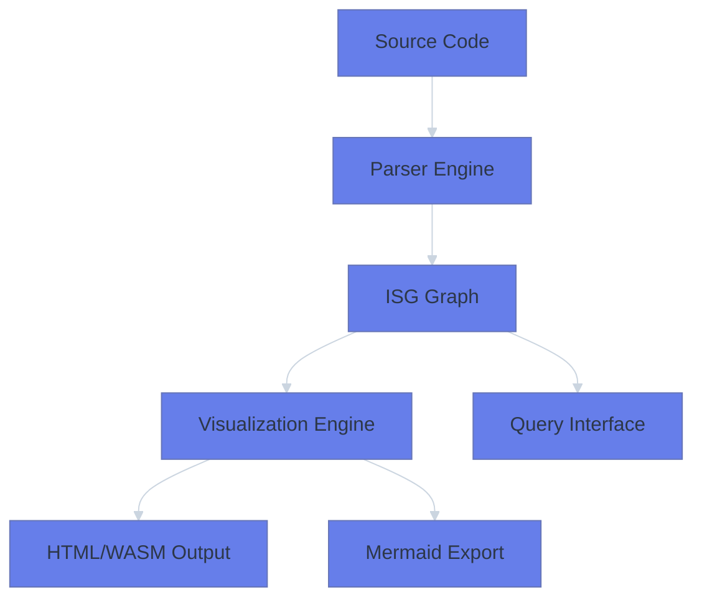

# Parseltongue

A Rust codebase analysis tool that processes source code to generate interactive visualizations and architectural insights.

## What It Does

- Parse Rust codebases into structured graph representations
- Generate interactive HTML visualizations using WebAssembly
- Export architecture diagrams in Mermaid format
- Provide query capabilities for code analysis

## Core Architecture



## Performance

- **Ingestion**: 150K+ lines of code in < 1 second
- **Queries**: < 50μs response time
- **HTML Generation**: 10ms for medium graphs, 100ms for large graphs

## Getting Started

### Build

```bash
cargo build --release
```

### Basic Usage

```bash
# Analyze a codebase
./target/release/parseltongue ingest src/

# Generate Mermaid diagram
./target/release/parseltongue diagram src/ output.md

# Start query daemon
./target/release/parseltongue daemon src/
```

### Web Visualization

The tool generates interactive HTML visualizations in `debug_output/`:
- Open `debug_output/visualization.html` in a browser
- Use zoom controls and layout selectors
- Switch between different visualization algorithms

## Testing

### Unit Tests

```bash
cargo test
```

### Browser Tests (Playwright)

```bash
cd playwright-tests
npm install
npm test
```

## Architecture Principles

This project follows Test-Driven Development with executable specifications:
- STUB → RED → GREEN → REFACTOR cycle
- Performance claims validated by automated tests
- Dependency injection for testability
- RAII resource management

## File Structure

```
src/
├── lib.rs              # Library entry point
├── cli.rs              # Command-line interface
├── isg.rs              # Core graph data structures
├── daemon.rs           # Query daemon implementation
├── wasm_renderer.rs    # HTML/WASM visualization generation
├── mermaid_export.rs   # Mermaid diagram export
└── *_tests.rs          # Comprehensive test suites
```

## Development

### Code Quality

```bash
# Clean build
cargo clean && cargo build --release

# Run tests with performance validation
cargo test --release performance_contract_tests

# Format code
cargo fmt

# Check clippy
cargo clippy
```

### HTML Visualization Testing

```bash
# Generate test data
./target/release/parseltongue ingest src/

# Run browser automation tests
cd playwright-tests && npm test
```

## License