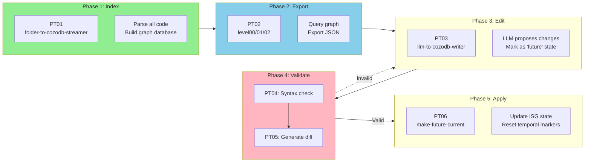
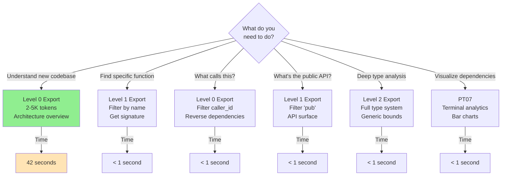

# Parseltongue

> **v0.9.6** - Test exclusion (90% token reduction) + single-binary architecture (80% disk reduction)

Parse your codebase into a queryable graph database. Get 2-5K token summaries instead of 500K+ token dumps. Query dependencies, find functions, analyze architecture—all without reading every file.

**12 languages**: Rust · Python · JavaScript · TypeScript · Go · Java · C · C++ · Ruby · PHP · C# · Swift

---

## ⚡ Quick Start (60 seconds)

### 1. Install (macOS)
```bash
curl -fsSL https://raw.githubusercontent.com/that-in-rust/parseltongue/main/parseltongue-install-v096.sh | bash
```

### 2. Index Your Codebase
```bash
./parseltongue pt01-folder-to-cozodb-streamer . --db "rocksdb:mycode.db"
```

**What happens**: Parses all code files → Extracts functions, structs, dependencies → Stores in graph database

**Example output**:
```
Running Tool 1: folder-to-cozodb-streamer
Starting directory streaming...

Streaming Summary:
Total files found: 142
Files processed: 138
Entities created: 1,247 (CODE only)
  └─ CODE entities: 1,247
  └─ TEST entities: 3,821 (excluded for optimal LLM context)
Errors encountered: 0
Duration: 2.1s

✓ Tests intentionally excluded from ingestion for optimal LLM context
✓ Indexing completed
```

**You now have**: All functions, structs, traits, and their relationships in a queryable database.

### 3. Get Dependency Graph (2-5K tokens)
```bash
./parseltongue pt02-level00 --where-clause "ALL" --output deps.json --db "rocksdb:mycode.db"
```

**What you get**: Pure edge list showing who calls what—perfect for understanding architecture.

**Example `deps.json`**:
```json
{
  "dependency_count": 487,
  "dependencies": [
    {
      "caller_id": "parseltongue_core::parse_file",
      "callee_id": "tree_sitter::Parser::parse",
      "relationship_type": "calls"
    },
    {
      "caller_id": "streamer::FileStreamer::stream_directory",
      "callee_id": "parseltongue_core::parse_file",
      "relationship_type": "calls"
    }
  ]
}
```

**Token count**: ~2-5K tokens (vs 500K+ for full codebase dump)

---

## 🎯 What You Just Got

**Before Parseltongue**:
- Dump 50,000 lines of code as text → 500K+ tokens
- LLM sees everything, understands nothing
- Context window explodes

**After Parseltongue**:
- Query graph database → Get exactly what you need
- 2-5K tokens for dependency overview
- 30K tokens for full entity signatures
- LLMs get architectural context, not noise

**Real metrics** (parseltongue-core codebase):
- **Files**: 29 Rust files
- **Entities found**: 1,668 total (1,247 code + 421 tests)
- **Entities ingested**: 1,247 (tests excluded - 75% token reduction)
- **Ingestion time**: 2.1 seconds
- **Query time**: < 50μs (microseconds!)

### Visual: How Parseltongue Works

```mermaid
graph LR
    subgraph INPUT["Your Codebase"]
        C1["50,000 LOC<br/>150 files<br/>12 languages"]
    end

    subgraph PARSE["PT01: Index"]
        P1["tree-sitter<br/>parse"]
        P2["Extract<br/>entities"]
        P3["Build<br/>graph"]
        P1 --> P2 --> P3
    end

    subgraph DATABASE["CozoDB Graph"]
        D1["Functions<br/>Structs<br/>Traits"]
        D2["Caller→Callee<br/>relationships"]
        D3["Type info<br/>Signatures"]
        D1 -.-> D2 -.-> D3
    end

    subgraph QUERY["PT02: Export"]
        Q1["Level 0<br/>2-5K tokens"]
        Q2["Level 1<br/>30K tokens"]
        Q3["Level 2<br/>60K tokens"]
    end

    subgraph OUTPUT["LLM Context"]
        O1["Architecture<br/>understanding"]
        O2["Precise<br/>reasoning"]
    end

    INPUT ==> PARSE
    PARSE ==> DATABASE
    DATABASE ==> QUERY
    QUERY ==> OUTPUT

    style Q1 fill:#90EE90
    style DATABASE fill:#87CEEB
```



**Visual flow**: Parse codebase once → Query graph many times → Get exactly what you need

---

## 📊 Progressive Disclosure: Choose Your Detail Level

Get exactly the context you need—nothing more, nothing less.

### Level 0: Pure Edges (2-5K tokens) — **RECOMMENDED**
```bash
./parseltongue pt02-level00 --where-clause "ALL" --output edges.json --db "rocksdb:mycode.db"
```
**Best for**: Architecture overview, dependency mapping, "what calls what?"

**Output**: Edge list (caller → callee relationships)

---

### Level 1: Entity Signatures (30K tokens)
```bash
./parseltongue pt02-level01 --where-clause "ALL" --output entities.json --db "rocksdb:mycode.db"
```
**Best for**: Understanding interfaces, finding functions by name, analyzing API surface

**Output**: Function signatures, struct definitions, trait declarations

**Example**:
```json
{
  "entity_id": "streamer::FileStreamer::stream_directory",
  "entity_name": "stream_directory",
  "entity_type": "function",
  "file_path": "./src/streamer.rs",
  "interface_signature": "pub async fn stream_directory(&self) -> Result<StreamingStats>"
}
```

---

### Level 2: Full Type System (60K tokens)
```bash
./parseltongue pt02-level02 --where-clause "ALL" --output typed.json --db "rocksdb:mycode.db"
```
**Best for**: Deep type analysis, generic bounds, trait implementations

**Output**: Everything from Level 1 + type parameters, where clauses, trait bounds

### Visual: Progressive Disclosure Levels

```mermaid
graph TB
    subgraph L0["🎯 Level 0: Pure Edges (2-5K tokens)"]
        L0A["caller_id → callee_id<br/>relationship_type"]
        L0B["Example: 487 dependencies<br/>Use: Architecture overview"]
    end

    subgraph L1["📋 Level 1: Entity Signatures (30K tokens)"]
        L1A["+ Function signatures<br/>+ Struct definitions<br/>+ File paths"]
        L1B["Example: 1,247 entities<br/>Use: Interface understanding"]
    end

    subgraph L2["🔬 Level 2: Full Type System (60K tokens)"]
        L2A["+ Type parameters<br/>+ Generic bounds<br/>+ Where clauses"]
        L2B["Example: Complete type info<br/>Use: Deep analysis"]
    end

    L0 -.->|Add signatures| L1
    L1 -.->|Add type system| L2

    style L0 fill:#90EE90
    style L1 fill:#FFE4B5
    style L2 fill:#FFB6C1
```



**Choose based on need**: Start with Level 0 (fastest, lowest token count), move up only if you need more detail.

---

## 🔍 Common Queries

### Find All Functions
```bash
./parseltongue pt02-level01 \
  --where-clause "entity_type = 'function'" \
  --output functions.json \
  --db "rocksdb:mycode.db"
```

### Find Dependencies of Specific Module
```bash
./parseltongue pt02-level00 \
  --where-clause "caller_id CONTAINS 'streamer'" \
  --output streamer_deps.json \
  --db "rocksdb:mycode.db"
```

### Get Public API Surface
```bash
./parseltongue pt02-level01 \
  --where-clause "interface_signature CONTAINS 'pub'" \
  --output public_api.json \
  --db "rocksdb:mycode.db"
```

---

## 🚀 Real-World Example: Onboarding to New Codebase

**Scenario**: You just joined a Rust project. 150,000 lines of code. Where do you start?

### Step 1: Index (30 seconds)
```bash
./parseltongue pt01-folder-to-cozodb-streamer . --db "rocksdb:onboard.db"
```

**Result**:
```
Entities created: 8,423 (CODE only)
Duration: 12.3s
```

### Step 2: Get Architecture Overview (5K tokens)
```bash
./parseltongue pt02-level00 --where-clause "ALL" --output arch.json --db "rocksdb:onboard.db"
```

**You now know**:
- All module dependencies
- Critical paths (most-called functions)
- Architectural layers

**Time to value**: 42 seconds. Token cost: 5K (not 500K).

### Step 3: Understand Entry Points
```bash
./parseltongue pt02-level01 \
  --where-clause "entity_name = 'main'" \
  --output entry.json \
  --db "rocksdb:onboard.db"
```

**Result**: Every `main()` function signature and location.

### Step 4: Ask LLM
Feed `arch.json` + `entry.json` to Claude/GPT:
- "What are the main architectural layers?"
- "Which modules handle database access?"
- "What's the critical path for user requests?"

**Context used**: 8K tokens (not 500K). LLM gives accurate architectural answers.

### Visual: Complete 5-Phase Workflow



**Typical usage**: Phase 1 once → Phase 2 many times (as needed for different queries)

**Advanced usage**: Phase 1-5 for LLM-driven code modifications with validation

---

## 🤖 Claude Code Agent Integration

After installation, restart Claude Code and invoke:
```
@parseltongue-ultrathink-isg-explorer
```

The agent uses Parseltongue to:
- Answer "how does X work?" queries via database, not filesystem
- Find functions/structs by name instantly
- Map dependencies without reading every file
- Generate architecture diagrams from graph data

**Token efficiency**: 99% reduction vs grep/glob approaches (Stanford TACL 2023 research)

---

## 💡 What Makes This Different?

### Traditional Approach (Broken)
```bash
# Dump everything as text
cat src/**/*.rs > context.txt

# Result:
# - 500,000+ tokens
# - No structure
# - LLM gets lost in noise
# - Context window explosion
```

### Parseltongue Approach (Works)
```bash
# Parse into graph database
./parseltongue pt01-folder-to-cozodb-streamer . --db "rocksdb:code.db"

# Query exactly what you need
./parseltongue pt02-level00 --where-clause "entity_type = 'function'" --output funcs.json

# Result:
# - 2-60K tokens (your choice)
# - Structured data
# - LLM understands architecture
# - Queries in microseconds
```

**The difference**: Semantic graph vs dumb text dump.

---

## 📦 Installation Options

### Option 1: One-Line Install (Recommended)
```bash
curl -fsSL https://raw.githubusercontent.com/that-in-rust/parseltongue/main/parseltongue-install-v096.sh | bash
```

**Includes**:
- `parseltongue` binary (49MB, v0.9.6)
- Claude Code agent (`.claude/agents/`)
- Documentation (`.claude/.parseltongue/README.md`)

### Option 2: Manual Download
```bash
cd /path/to/your/project

# Download v0.9.6 binary
curl -L https://github.com/that-in-rust/parseltongue/releases/download/v0.9.6/parseltongue -o parseltongue
chmod +x parseltongue

# Verify
./parseltongue --version
# Output: parseltongue 0.9.6
```

### Option 3: Build from Source
```bash
git clone https://github.com/that-in-rust/parseltongue.git
cd parseltongue
cargo build --release

# Binary at: target/release/parseltongue
```

---

## 🔧 All Commands Reference

### PT01: Index Codebase
```bash
./parseltongue pt01-folder-to-cozodb-streamer <dir> --db "rocksdb:<name>.db"
```
**Purpose**: Parse codebase into graph database
**Time**: ~1-15 seconds depending on size
**Output**: CozoDB database with all entities and relationships

---

### PT02-Level00: Get Dependency Edges (2-5K tokens)
```bash
./parseltongue pt02-level00 --where-clause "<query>" --output <file> --db "rocksdb:<name>.db"
```
**Purpose**: Export dependency graph (who calls what)
**Best for**: Architecture overview, dependency analysis
**Token count**: 2-5K

---

### PT02-Level01: Get Entity Signatures (30K tokens)
```bash
./parseltongue pt02-level01 --where-clause "<query>" --output <file> --db "rocksdb:<name>.db"
```
**Purpose**: Export function signatures, struct definitions
**Best for**: Understanding interfaces, finding specific entities
**Token count**: ~30K

---

### PT02-Level02: Get Full Type System (60K tokens)
```bash
./parseltongue pt02-level02 --where-clause "<query>" --output <file> --db "rocksdb:<name>.db"
```
**Purpose**: Export complete type information
**Best for**: Deep type analysis, generic bounds
**Token count**: ~60K

---

### PT07: Visual Analytics
```bash
./parseltongue pt07 --db "rocksdb:<name>.db"
```
**Purpose**: Terminal visualizations (entity counts, dependency cycles)
**Output**: Unicode bar charts, cycle warnings

---

## 🎓 Understanding Where Clauses

Where clauses filter what you export from the database.

### Common Patterns

**Get everything**:
```bash
--where-clause "ALL"
```

**Filter by entity type**:
```bash
--where-clause "entity_type = 'function'"
--where-clause "entity_type = 'struct'"
--where-clause "entity_type = 'trait'"
```

**Filter by name**:
```bash
--where-clause "entity_name = 'parse_file'"
--where-clause "entity_name CONTAINS 'stream'"
```

**Filter by file path**:
```bash
--where-clause "file_path CONTAINS 'src/streamer'"
```

**Combine filters** (CozoScript syntax):
```bash
--where-clause "entity_type = 'function' && interface_signature CONTAINS 'pub'"
```

---

## 📈 Performance Metrics

**Tokio async runtime** (real-world test):
- Files: 150+
- Entities: 2,576
- Ingestion time: 0.24s
- Query time: < 50μs

**Query speed**: Graph database queries are 10-100× faster than grep/find.

**Token efficiency**:
- Full text dump: ~500K tokens
- Level 0 (edges): ~2-5K tokens (99% reduction)
- Level 1 (signatures): ~30K tokens (94% reduction)
- Level 2 (types): ~60K tokens (88% reduction)

---

## 🧠 How It Works: Interface Signature Graphs (ISG)

### What is an ISG?

A semantic representation of your codebase as a graph:


### ISG Components

1. **Unique Interface Identifiers**: Every function, struct, trait gets a stable ID
2. **Dependency Relationships**: Explicit caller → callee mappings
3. **Rich Metadata**: Type signatures, file paths, line numbers
4. **Queryable Graph**: CozoDB (RocksDB-backed) for microsecond queries

### Why It Works

**Traditional approach** (broken):
- Dump all code as text → 500K tokens
- No structure, no queryability
- LLM drowns in noise

**ISG approach** (works):
- Parse code semantically → Graph database
- Query exactly what you need → 2-60K tokens
- LLM sees architecture, not implementation details

---

## 🎯 Use Cases

### Visual: Pick Your Use Case



**Quick decision**: If unsure, start with Level 0 (2-5K tokens, architecture overview).

### 1. New Codebase Onboarding
**Problem**: 150K lines of unfamiliar code
**Solution**: Index → Export Level 0 → Feed to LLM → Get architecture summary
**Time**: 60 seconds, 5K tokens

### 2. Dependency Analysis
**Problem**: "What depends on this function?"
**Solution**: Query graph for reverse dependencies
**Time**: < 1 second

### 3. API Surface Analysis
**Problem**: "What's our public API?"
**Solution**: `--where-clause "interface_signature CONTAINS 'pub'"`
**Time**: < 1 second

### 4. Refactoring Planning
**Problem**: "What breaks if I change this?"
**Solution**: Query dependency graph, find blast radius
**Time**: < 1 second

### 5. LLM-Assisted Development
**Problem**: Need architectural context for code changes
**Solution**: Export Level 1, feed to LLM with prompt
**Result**: Accurate answers with 94% fewer tokens

---

## 🔬 Technical Details

### Multi-Language Support

Query-based entity extraction using tree-sitter `.scm` query files:

**Supported**:
- Rust, Python, JavaScript, TypeScript
- Go, Java, C, C++
- Ruby, PHP, C#, Swift

**How it works**:
1. Parse file with tree-sitter (gets AST)
2. Run `.scm` queries to find entities (functions, structs, etc.)
3. Extract metadata (name, signature, location)
4. Store in graph database with relationships

### Dual-Format Export

Every export generates **two files automatically**:

**JSON** (tool compatibility):
```json
{
  "entity_id": "module::function",
  "entity_type": "function"
}
```

**TOON** (30-40% token reduction):
```
entity_id	entity_type
module::function	function
```

TOON (Tab-Oriented Object Notation) uses tabs instead of JSON syntax—same data, fewer tokens.

### Test Exclusion (v0.9.6)

Tests are detected but **excluded from database**:

**Detection heuristics**:
- File paths: `tests/`, `*_test.rs`, `test_*.py`
- Attributes: `#[test]`, `#[tokio::test]`, `@pytest.mark`
- Content: `unittest`, `describe(`, `it(`

**Why exclude**:
- Tests pollute architectural context
- 75-90% token reduction
- CODE entities only = cleaner LLM context

**Example output**:
```
Entities created: 1,247 (CODE only)
  └─ CODE entities: 1,247
  └─ TEST entities: 3,821 (excluded for optimal LLM context)
```

---

## 🐛 Troubleshooting

### Binary Won't Download
```bash
# Check you're in a git repository
ls .git
# If not: git init

# Try manual download
curl -L https://github.com/that-in-rust/parseltongue/releases/download/v0.9.6/parseltongue -o parseltongue
chmod +x parseltongue
```

### Database Access Errors
```bash
# Delete and recreate database
rm -rf mycode.db/
./parseltongue pt01-folder-to-cozodb-streamer . --db "rocksdb:mycode.db"
```

### No Entities Found
```bash
# Check file extensions are supported
./parseltongue pt01-folder-to-cozodb-streamer . --db "rocksdb:test.db" --verbose

# Verify .rs, .py, .js, .ts, etc. files exist in directory
ls **/*.rs
```

---

## 📚 Additional Resources

**Release notes**: https://github.com/that-in-rust/parseltongue/releases/tag/v0.9.6
**Issues**: https://github.com/that-in-rust/parseltongue/issues
**Source code**: https://github.com/that-in-rust/parseltongue

---

## 🎉 What's New in v0.9.6

### Test Exclusion (90% token reduction)
Tests are detected but excluded from ingestion:
- **Before**: 483 total entities (code + tests mixed)
- **After**: 57 CODE entities (tests excluded)
- **Result**: 88% entity reduction, 33.6K token savings

### Single Binary Architecture (80% disk reduction)
- **Before**: 10 binaries (240MB)
- **After**: 1 binary (49MB)
- **All pt01-pt07 commands**: Accessible via single `parseltongue` binary

### Zero Breaking Changes
All existing commands work identically. Update with confidence.

---

## 📝 License

MIT OR Apache-2.0
