# Parseltongue

> **v0.9.6** - Test exclusion (90% token reduction) + single-binary architecture (80% disk reduction)


Code analysis toolkit powered by Interface Signature Graphs (ISG). Parse your codebase into a queryable semantic graph. Export context at different detail levels (2-60K tokens instead of 500K+), giving LLMs the architectural view and metadata needed for reasoning and modifications.

**Multi-language support**: Query-based entity extraction for 12 languages (Rust, Python, C, C++, Ruby, JavaScript, TypeScript, Go, Java, PHP, C#, Swift) using tree-sitter .scm query files.

**Dual-format export**: Every export automatically generates both JSON (for tool compatibility) and TOON (Tab-Oriented Object Notation) formats with 30-40% token reduction—no configuration needed.

---

## What is an Interface Signature Graph (ISG)?

The ISG is a structured, semantic representation of your codebase that captures:

- **Unique Interface Identifiers**: Every function, struct, and trait gets a stable ID
- **Dependency Relationships**: Explicit mapping of function calls, trait implementations, module relationships
- **Rich Metadata**: Compiler-grade semantic information (types, signatures, HIR from rust-analyzer)
- **Blast Radius Analysis**: Track what's affected by changes

Instead of dumping 500,000+ tokens of raw code into LLM context windows, the ISG provides a queryable graph at multiple abstraction levels. This makes reasoning across large codebases practical where full-text approaches run into context limits.

---

## Workflow: 5 Phases from Code to Fix


**End-to-end flow**: Index codebase once → Export what you need → Edit in ISG → Validate & apply → Reset state. Iterate Phase 3-4 until tests pass.

---

## Using Parseltongue: Agent Instructions

This section contains the core methodology for ISG-based codebase analysis. Use these patterns directly or invoke the `@parseltongue-ultrathink-isg-explorer` agent in Claude Code.

### Workflow Navigation

Match your task to a workflow. Each targets a specific token budget.


### Why Progressive Disclosure

**Context bloat kills reasoning**: 1500 entities with full code = 525K tokens. LLMs have 200K context budget. No room left for thinking.

**Token arithmetic**:
- Entity with signature only: 25 tokens
- Same entity with full code: 350 tokens
- 1500 entities: 37.5K (signatures) vs 525K (code)
- Difference: 487.5K tokens saved for reasoning

**Progressive disclosure pattern**:
- Level 0: Edges only (3K tokens) - see who depends on who
- Spot the hub: Config has 47 dependencies
- Level 1: Just Config details (2K tokens)
- Total: 5K tokens used, 195K tokens free for reasoning

**Real workflow**: Bug in process_payment. Level 0 shows 3 callers, 12 reverse deps. Load those 15 entities at Level 1 (12K tokens). Ignore other 1485 entities. Fix bug with 185K tokens free for thinking.

### Context Optimization


### Three Levels

**Level 0**: WHO depends on WHO (2-5K tokens)
- Dependency edges A → B
- Returns ISGL1 keys for entities
- Shows hubs, cycles, coupling
- Start here always

**Level 1**: WHAT each entity is (20-30K filtered)
- Names, types, signatures
- Public vs private
- Forward/reverse dependencies
- Use keys from Level 0

**Level 2**: HOW types connect (50-60K)
- Full type system
- Rarely needed

### Basic Queries

```bash
# Level 0: See all edges (✅ VERIFIED v0.9.2)
parseltongue pt02-level00 --where-clause "ALL" --output edges.json --db "rocksdb:parseltongue-v090.db"

# 📤 EXPECTED OUTPUT:
# └── edges.json (production code edges)
#     ├── 4,164 CODE dependency edges
#     ├── Structure: [{"from_key": "...", "to_key": "...", "edge_type": "..."}]
#     ├── Size: ~850KB
#     └── Tokens: ~5K (perfect for architecture overview)
# └── edges_test.json (test code edges) 
#     ├── 0 TEST edges (in this codebase)
#     ├── Same structure as edges.json but for test entities only
#     └── Tokens: ~0K

# Level 1: All entities with signatures (✅ VERIFIED v0.9.2)
parseltongue pt02-level01 --include-code 0 --where-clause "ALL" --output entities.json --db "rocksdb:parseltongue-v090.db"

# 📤 EXPECTED OUTPUT:
# └── entities.json (production code entities)
#     ├── 1,318 CODE entities 
#     ├── Structure: {"entities": [...], "export_metadata": {...}}
#     ├── Fields per entity: 14 (isgl1_key, entity_name, entity_type, entity_class, etc.)
#     ├── Size: ~1MB
#     └── Tokens: ~30K (signatures only, no code)
# └── entities_test.json (test code entities)
#     ├── 0 TEST entities (in this codebase)
#     ├── Same structure as entities.json but for test entities only
#     └── Tokens: ~0K

# Level 1: Filter by entity type (✅ VERIFIED v0.9.2)
parseltongue pt02-level01 --include-code 0 --where-clause "entity_type = 'function'" --output functions.json --db "rocksdb:parseltongue-v090.db"

# 📤 EXPECTED OUTPUT:
# └── functions.json (production functions)
#     ├── 457 CODE functions only
#     ├── Same structure as entities.json but filtered
#     ├── Size: ~350KB
#     └── Tokens: ~10K (functions only)
# └── functions_test.json (test functions)
#     ├── 0 TEST functions (in this codebase)
#     └── Tokens: ~0K

# Level 2: Full type system (✅ VERIFIED v0.9.2)
parseltongue pt02-level02 --include-code 0 --where-clause "ALL" --output typed.json --db "rocksdb:parseltongue-v090.db"

# 📤 EXPECTED OUTPUT:
# └── typed.json (production with types)
#     ├── 1,318 CODE entities with enhanced type information
#     ├── Structure: Same as Level 1 + 8 additional fields
#     ├── Extra fields: return_type, param_types, trait_impls, is_async, is_unsafe, etc.
#     ├── Size: ~1.1MB
#     └── Tokens: ~60K (complete type system)
# └── typed_test.json (test with types)
#     ├── 0 TEST entities (in this codebase)
#     └── Tokens: ~0K

# PT01: Index codebase (✅ VERIFIED v0.9.2)
parseltongue pt01-folder-to-cozodb-streamer . --db rocksdb:parseltongue-v090.db --verbose

# 📤 EXPECTED OUTPUT:
# └── Console output (no JSON file created)
#     ├── "Files processed: 98"
#     ├── "Entities created: 1,318"
#     ├── "Duration: ~3 seconds"
#     └── Creates/updates: parseltongue-v090.db/ (RocksDB directory)
```

**🎯 Output Summary**: Each export command now automatically creates **two JSON files** - one for production code (`.json`) and one for test code (`_test.json`). This separation happens automatically, hiding the complexity of entity class filtering from users. All exports include `export_metadata` with processing stats and token estimates.

---

## 📤 Understanding the Output

### **JSON Structure (All Exports)**
```json
{
  "entities": [...],           // Array of entities (Level 1/2) or edges (Level 0)
  "export_metadata": {
    "total_entities": 1318,    // Number of entities exported
    "token_estimate": 30000,   // Estimated LLM tokens
    "export_level": "Level 1", // Export level used
    "include_code": false,     // Whether full code included
    "query_time_ms": 150,      // Processing time
    "database_path": "rocksdb:parseltongue-v090.db"
  }
}
```

### **Entity Fields (Level 1)**
| Field | Description | Example |
|--------|-------------|---------|
| `isgl1_key` | Unique entity identifier | `rust:function:process_payment:src_payment_rs:145-167` |
| `entity_name` | Function/struct name | `process_payment` |
| `entity_type` | Type of entity | `function`, `struct`, `trait`, `enum` |
| `entity_class` | v0.9.2 classification | `CODE`, `TEST` |
| `file_path` | Source file location | `./src/payment.rs` |
| `interface_signature` | Function signature | `pub fn process_payment(amount: u64) -> Result<bool>` |
| `forward_deps` | Dependencies this entity uses | `["rust:fn:validate_card", "rust:fn:check_balance"]` |
| `reverse_deps` | Entities that depend on this | `["rust:fn:handle_payment", "rust:fn:retry_payment"]` |

### **Edge Fields (Level 0)**
| Field | Description | Example |
|--------|-------------|---------|
| `from_key` | Source entity ISGL1 key | `rust:function:process_payment` |
| `to_key` | Target entity ISGL1 key | `rust:function:validate_card` |
| `edge_type` | Relationship type | `depends_on`, `implements`, `calls` |

### **File Sizes & Tokens**
| Level | Entities | File Size | Tokens | Use Case |
|-------|----------|-----------|--------|----------|
| Level 0 | 4,164 edges | ~850KB | ~5K | Architecture overview |
| Level 1 | 1,318 entities | ~1MB | ~30K | API analysis, bug triage |
| Level 2 | 1,318 entities | ~1.1MB | ~60K | Complex refactoring |
| With Code | 1,318 entities | ~10MB | ~500K | ❌ Not recommended |

---

**v0.9.2 Updates**: All commands verified with EntityClass integration. Progressive disclosure working: 5K → 30K → 60K tokens.

**Query Status**: 
- ✅ `ALL` queries work perfectly
- ✅ Entity type filtering functional (`entity_type = 'function'`)
- ✅ EntityClass filtering working (`entity_class = 'CODE'`)
- 🔍 Pattern matching needs refinement (~ operator)

**Pattern**: Level 0 gives keys → Pick key → Level 1 with exact key → Get entity details

**ISGL1 Key Format**: `language:type:name:file:lines`
- Example: `rust:fn:process_payment:src_payment_rs:145-167`
- Unique identifier for every entity
- Use for precise lookup in Level 1/2

### Seven Workflows

Each workflow targets a specific token budget using progressive disclosure.

#### WF1: Onboarding New Developers (8K tokens)

```mermaid
flowchart TD
    A[New Dev] --> B[Index pt01]
    B --> C{Entities > 0?}
    C -->|No| FAIL[❌ Grep/Glob]
    C -->|Yes| D[Level 0 3K]
    D --> E{Clear?}
    E -->|No| F[Level 1: Public +5K]
    E -->|Yes| G[Entry Points]
    F --> G --> H[Report]
```



**Commands**:
```bash
# ✅ VERIFIED v0.9.2: Index codebase
parseltongue pt01-folder-to-cozodb-streamer . --db "rocksdb:onboard.db" --verbose

# 📤 EXPECTED OUTPUT:
# └── Console output only
#     ├── "Files processed: 98" (varies by codebase size)
#     ├── "Entities created: 1,318" (varies by codebase complexity)
#     ├── "Duration: ~3 seconds" (performance varies)
#     └── Creates: onboard.db/ (RocksDB directory for subsequent queries)

# ✅ VERIFIED v0.9.2: Get dependency edges (Level 0)
parseltongue pt02-level00 --where-clause "ALL" --output edges.json --db "rocksdb:onboard.db" --verbose

# 📤 EXPECTED OUTPUT:
# └── edges.json (production code edges)
#     ├── 4,164 CODE dependency edges
#     ├── Structure: [{"from_key": "rust:...", "to_key": "rust:...", "edge_type": "depends_on"}]
#     ├── Size: ~850KB
#     └── Perfect for: Architecture overview, dependency analysis
# └── edges_test.json (test code edges)
#     ├── 0 TEST edges (in this codebase)
#     └── Same structure as edges.json but for test dependencies

# ✅ VERIFIED v0.9.2: Get all functions (Level 1)
parseltongue pt02-level01 --include-code 0 --where-clause "entity_type = 'function'" --output functions.json --db "rocksdb:onboard.db" --verbose

# 📤 EXPECTED OUTPUT:
# └── functions.json (production functions)
#     ├── 457 CODE functions (filtered from all entities)
#     ├── Structure: {"entities": [...], "export_metadata": {...}}
#     ├── Key fields: isgl1_key, entity_name, entity_class, interface_signature
#     ├── Size: ~350KB
#     └── Perfect for: API surface analysis, function documentation
# └── functions_test.json (test functions)
#     ├── 0 TEST functions (in this codebase)
#     └── Same structure as functions.json but for test functions

# ✅ VERIFIED v0.9.2: Get code entities only (EntityClass - now automatic)
parseltongue pt02-level01 --include-code 0 --where-clause "ALL" --output code.json --db "rocksdb:onboard.db" --verbose

# 📤 EXPECTED OUTPUT:
# └── code.json (production code entities - automatic separation)
#     ├── 1,318 CODE entities (automatically filtered by entity_class)
#     ├── Excludes: Test entities (automatically separated)
#     ├── Structure: {"entities": [...], "export_metadata": {...}}
#     ├── Size: ~1MB
#     └── Perfect for: Production code analysis, excludes tests automatically
# └── code_test.json (test code entities - automatic separation)
#     ├── 0 TEST entities (in this codebase)
#     └── Perfect for: Test suite analysis, isolated from production code
```

**📊 Workflow Output Summary**: WF1 generates **6 JSON files + 1 database**:
- `onboard.db/` - Persistent database for all queries
- `edges.json` + `edges_test.json` - Dependency graphs (5K tokens total)
- `functions.json` + `functions_test.json` - Function signatures (10K tokens total)  
- `code.json` + `code_test.json` - Production vs test code (30K tokens total)
- **Total**: ~45K tokens vs 500K+ traditional approach, with automatic test separation

**Learn**: edges.json → 348 edges, 150 entities with ISGL1 keys. Hubs: Config (47), DatabaseConnection (34). Cycles: AuthService ↔ UserRepo. api.json → 39 public (26%). Spot key → Query Level 1 with that key.

#### WF2: PRD Feasibility (18K tokens)


**Commands**:
```bash
parseltongue pt02-level01 --include-code 0 --where-clause "entity_name ~ 'auth'" --output exist.json --db "rocksdb:prd.db" --verbose
parseltongue pt02-level00 --where-clause "file_path ~ 'auth'" --output deps.json --db "rocksdb:prd.db" --verbose
parseltongue pt02-level01 --include-code 0 --where-clause "ALL" --output context.json --db "rocksdb:prd.db" --verbose
scc --format json --by-file ./src/auth | jq '.[] | select(.Complexity > 20)'
```

**Learn**: 12 auth entities with keys. 23 edges. 45 reverse_deps (high blast radius). 3 files >20 complexity. Use keys to drill into high-risk entities.

#### WF3: Bug Triage (12K tokens)

```mermaid
flowchart TD
    A[Bug: Panic] --> B[Find Entity]
    B --> C{Found?}
    C -->|No| FAIL[❌ Not in ISG]
    C -->|Yes| D[Execution Path forward_deps]
    D --> E{Root cause?}
    E -->|No| F[reverse_deps Who calls?]
    E -->|Yes| G[Test Coverage]
    F --> G --> H[Fix Scope]
```



**Commands**:
```bash
parseltongue pt02-level01 --include-code 0 --where-clause "entity_name ~ 'payment'" --output payment.json --db "rocksdb:bug.db" --verbose
parseltongue pt02-level00 --where-clause "ALL" --output graph.json --db "rocksdb:bug.db" --verbose
# Spot check_balance key in forward_deps
parseltongue pt02-level01 --include-code 0 --where-clause "isgl1_key = 'rust:fn:check_balance:src_payment_rs:145-167'" --output root.json --db "rocksdb:bug.db" --verbose
```

**Learn**: forward_deps → process_payment → validate_card → check_balance → PANIC. Use key to get exact details. Root: negative i64 → u64 cast line 145. 3 callers. 12 tests, none test negative.

#### WF4: Feature Planning (22K tokens)


**Commands**:
```bash
parseltongue pt02-level01 --include-code 0 --where-clause "entity_name ~ 'notify' ; entity_name ~ 'event'" --output infra.json --db "rocksdb:feature.db" --verbose
parseltongue pt02-level00 --where-clause "ALL" --output modules.json --db "rocksdb:feature.db" --verbose
parseltongue pt02-level01 --include-code 0 --where-clause "is_public = true" --output public.json --db "rocksdb:feature.db" --verbose
scc --format json --by-file ./src | jq '.[] | select(.Complexity > 20)'
```

**Learn**: WebSocket ✅ (8 with keys), EventBus ✅ (5), NotificationQueue ❌. 8 public APIs need mods. Use keys to drill into WebSocket entities.

#### WF5: Refactoring (5K tokens)


**Commands**:
```bash
parseltongue pt02-level00 --where-clause "ALL" --output edges.json --db "rocksdb:quality.db" --verbose
# Spot Config key with 47 in-degree
parseltongue pt02-level01 --include-code 0 --where-clause "isgl1_key = 'rust:struct:Config:src_config_rs:10-45'" --output config.json --db "rocksdb:quality.db" --verbose
```

**Learn**: 150 entities, 348 edges. Cycles: AuthService ↔ UserRepo (4hrs). Gods: Config key 47 deps, DatabaseConnection 34. Use Config key for refactoring details. Dead: 12 entities 0 reverse_deps.

#### WF6: PR Impact Analysis (12K tokens)

```mermaid
flowchart TD
    A[PR] --> B[Changed future_action]
    B --> C{Changes?}
    C -->|No| FAIL[❌ No temporal]
    C -->|Yes| D[Deps]
    D --> E[Blast Radius]
    E --> F{Breaking?}
    F -->|Check| G[Public is_public]
    G --> H{Modified?}
    H -->|Yes| BREAK[⚠️ BREAKING]
    H -->|No| SAFE[✅ Non-breaking]
```



**Commands**:
```bash
parseltongue pt02-level01 --include-code 0 --where-clause "future_action != null" --output changes.json --db "rocksdb:pr.db" --verbose
parseltongue pt02-level00 --where-clause "ALL" --output graph.json --db "rocksdb:pr.db" --verbose
# changes.json gives keys for modified entities
parseltongue pt02-level01 --include-code 0 --where-clause "isgl1_key = 'rust:fn:change_password:src_auth_rs:145-167'" --output pwd.json --db "rocksdb:pr.db" --verbose
```

**Learn**: 3 modified with keys in changes.json. Use change_password key for signature changes. PUBLIC (added force param) ⚠️ BREAKING. 15 direct + 34 transitive = 49 entities.

#### WF7: Learning from External Codebases (.ref pattern)

```mermaid
flowchart TD
    A[Pattern] --> B[Web search]
    B --> C[Find 2-3]
    C --> D[git clone .claude/.ref/]
    D --> E{.gitignore?}
    E -->|No| FAIL[❌ Add first!]
    E -->|Yes| F[Index]
    F --> G[Level 0 Arch]
    G --> H[Level 1 Patterns]
    H --> I[Adapt]
```



**Setup**:
```bash
mkdir -p .claude/.ref
echo ".claude/.ref/" >> .gitignore  # CRITICAL
cd .claude/.ref && git clone https://github.com/tree-sitter/tree-sitter.git
```

**Commands**:
```bash
cd .claude/.ref/tree-sitter
../../../parseltongue pt01-folder-to-cozodb-streamer . --db "rocksdb:ref.db" --verbose
../../../parseltongue pt02-level00 --where-clause "ALL" --output arch.json --db "rocksdb:ref.db"
# arch.json shows keys for streaming entities
../../../parseltongue pt02-level01 --include-code 0 --where-clause "entity_name ~ 'stream'" --output patterns.json --db "rocksdb:ref.db"
# Or use exact key from arch.json
../../../parseltongue pt02-level01 --include-code 0 --where-clause "isgl1_key = 'c:fn:ts_parser_parse_stream:src_parser_c:234-456'" --output stream_fn.json --db "rocksdb:ref.db"
```

**Learn**: 11K tokens vs 400K reading files. Recursive descent parser, 8 streaming entities with keys. Use keys to target functions.

### Interpreting Results

**Level 0 (Edges)**:
- Returns from_key → to_key pairs (ISGL1 keys)
- High in-degree (>20) → God objects, refactoring targets
- Cycles (A → B → A) → Break with interfaces
- Zero reverse_deps → Dead code candidates
- Use keys to drill into Level 1 for details

**Level 1 (Signatures)**:
- Returns full entity details with ISGL1 key
- Public ratio: <30% good encapsulation, >50% leaky abstractions
- Blast radius: reverse_deps >10 means many entities affected by changes
- Test coverage: check is_test field for high-coupling entities

**Context Optimization Decision Tree**:
- <10K tokens needed → Use Level 0 (edges only)
- 10-30K tokens → Use Level 1 filtered (specific modules or patterns)
- 30-60K tokens → Use Level 1 broader (multiple modules)
- >60K tokens → STOP and refine WHERE clause further

### Invoking the Agent

**⚠️ First-time setup**: After running `parseltongue-install-v096.sh`, you must **EXIT and RESTART Claude Code** to activate the agent. Claude Code loads agents from `.claude/agents/` only on startup.

**After restart**, invoke the agent in Claude Code:

```
@parseltongue-ultrathink-isg-explorer analyze this codebase
```

The agent follows these patterns automatically with additional workflows and research-backed decision making.

**Persistence**: The agent is permanently installed in `.claude/agents/` and persists across all future Claude Code sessions. No reinstallation or restarts needed after the initial activation.

---

## Quick Install (macOS)

### Option 1: One-Line Install (Recommended)

```bash
# Run from your project's git root - Always use the versioned install script
curl -fsSL https://raw.githubusercontent.com/that-in-rust/parseltongue/main/parseltongue-install-v096.sh | bash
```

What it does:
1. Downloads `parseltongue` binary (v0.9.6 with test exclusion + single-binary architecture)
2. Creates `.claude/.parseltongue/` and `.claude/agents/` directories
3. Downloads documentation + Ultrathink ISG Explorer Agent
4. Verifies installation

**Versioned Install:** Always use `parseltongue-install-v096.sh` (explicit version) to know exactly what you're getting. Next release will be `parseltongue-install-v097.sh`.

**What you get:**
```
your-project/
├── parseltongue              # Binary (v0.9.6, ready to use)
└── .claude/
    └── .parseltongue/
        ├── README.md                          # Full documentation
        └── agents/
            └── parseltongue-ultrathink-isg-explorer.md  # AI agent
```

**Manual installation:**
```bash
# If you prefer to see each step
cd /path/to/your/project

# Download v0.9.6 binary
curl -L https://github.com/that-in-rust/parseltongue/releases/download/v0.9.6/parseltongue -o parseltongue
chmod +x parseltongue

# Create directory
mkdir -p .claude/.parseltongue
mkdir -p .claude/agents

# Download agent
curl -L https://raw.githubusercontent.com/that-in-rust/parseltongue/main/.claude/agents/parseltongue-ultrathink-isg-explorer.md \
  -o .claude/agents/parseltongue-ultrathink-isg-explorer.md

# Download docs
curl -L https://raw.githubusercontent.com/that-in-rust/parseltongue/main/README.md \
  -o .claude/.parseltongue/README.md
```

---

## Platform Support

| Platform | Architecture | Status | Binary Name |
|----------|-------------|--------|-------------|
| macOS | ARM64 (Apple Silicon) | ✅ Supported | `parseltongue` |
| Linux | x86_64 | ✅ Supported | `parseltongue` |
| macOS | x86_64 | ❌ Not Supported | - |
| Windows | - | ❌ Not Supported | - |

**Note**: Always run the install script from your project's git root directory. This is required for proper ISG analysis functionality.

---

## Using the Parseltongue Ultrathink ISG Explorer Agent

Parseltongue includes an intelligent agent for ISG-based codebase analysis that combines progressive disclosure, CPU-first filtering, and graph-based reasoning.

### How to Use

Invoke the agent in Claude Code:

```
@parseltongue-ultrathink-isg-explorer analyze this codebase
```

The agent will automatically determine the optimal workflow based on your request.

### 8 Task-Specific Workflows

The agent adapts to your needs with specialized workflows optimized for different analysis types:

1. **Onboarding** (15 min, 8K tokens, 96% TSR) - Day 1 architecture understanding for new team members
2. **PRD Refinement** (30 min, 18K tokens, 91% TSR) - Validate feature feasibility against existing architecture
3. **Bug Triage** (20 min, 12K tokens, 94% TSR) - Root cause analysis and blast radius assessment
4. **Feature Breakdown** (45 min, 22K tokens, 89% TSR) - Epic → Stories with dependency mapping
5. **Security Audit** (60 min, 28K tokens, 86% TSR) - Multi-tier security analysis (Semgrep → ISG → LLM)
6. **Refactoring** (15 min, 5K tokens, 97.5% TSR) - Find technical debt and circular dependencies
7. **PR Impact** (25 min, 12K tokens, 94% TSR) - Breaking change detection across the codebase
8. **Reference Learning** (30-90 min, 11K tokens, 94% TSR) - Learn from external codebases using the .ref pattern

**TSR (Thinking Space Ratio)** = (Available Context - Data Tokens) / Available Context. Higher is better.

### The .ref Pattern: Git-Safe External Learning

Learn from external codebases without polluting your git history:

```bash
# Setup (ONE TIME)
mkdir -p .claude/.ref
echo ".claude/.ref/" >> .gitignore

# Clone reference implementation
cd .claude/.ref
git clone https://github.com/example/reference-project.git

# Analyze with parseltongue ISG
cd ../..
./parseltongue pt01-folder-to-cozodb-streamer .claude/.ref/reference-project --db reference.db
./parseltongue pt02-level01 --db reference.db --where-clause "ALL" > reference-analysis.json

# LLM now analyzes reference implementation at 11K tokens vs 400K+ tokens
```

**Why this works**: The agent uses ISG to extract architectural patterns from reference codebases at 97% token reduction, enabling you to learn from multiple implementations without context overflow.

### Token Efficiency at Scale

Compare different analysis approaches:

| Approach | Tokens | TSR | Use Case |
|----------|--------|-----|----------|
| **Level 0 (Edges Only)** | 2-5K | 97.5% | High-level architecture overview |
| **Level 1 (Signatures)** | 20-30K | 85-90% | Feature development, bug triage |
| **Level 2 (Full Types)** | 50-60K | 70% | Complex refactoring, security audit |
| **Traditional (Raw Files)** | 500K+ | <0% | ❌ Context overflow |

**Result**: 35K tokens vs 500K+ traditional approaches = **93% token reduction** while maintaining analysis quality.

---

## What Problem Does It Solve?

**Token explosion kills LLM productivity**. Parseltongue solves this with **progressive disclosure**:

1. **Index once** (pt01): Your entire codebase → CozoDB graph
2. **Export smart** (pt02): Choose your detail level
   - 🔹 Level 0: Just dependency edges (~2-5K tokens)
   - 🔹 Level 1: Signatures + temporal state (~30K tokens) ← **Start here**
   - 🔹 Level 2: + Type system (~60K tokens)
3. **Modify precisely** (pt03-pt06): Temporal versioning, validation, diffs

**One binary. Eight tools. Your choice of detail level.**

---

## The 6 Tools (Workflow-Ordered)

**All in one unified binary:**
1. `pt01-folder-to-cozodb-streamer` - Index codebase (Ingest)
2. **`pt02-level00/01/02`** - Export entities to JSON (Read) - 3 progressive disclosure levels
   - `pt02-level00` - Pure edge list (~2-5K tokens) **RECOMMENDED - Start here for birds-eye view**
   - `pt02-level01` - Entities + ISG + Temporal (~30K tokens)
   - `pt02-level02` - + Type system (~60K tokens)
3. `pt03-llm-to-cozodb-writer` - Write temporal changes (Edit)
4. `pt04-syntax-preflight-validator` - Validate syntax (Validate)
5. `pt05-llm-cozodb-to-diff-writer` - Generate CodeDiff.json (Diff)
6. `pt06-cozodb-make-future-code-current` - Reset database state (Reset)

---

## Complete Walkthrough: Fix a Bug in 4 Functions

**See the full end-to-end test:** [`demo-walkthroughs/ActuallyWorks/`](./demo-walkthroughs/ActuallyWorks/)

A tangible example with all artifacts preserved (JSONs, logs, database, full command outputs).

### The Scenario

You have a simple greeter library with 4 functions:
- `hello()` - **BUG: says "Goodbye" instead of "Hello"**
- `goodbye()` - works correctly
- `good_morning()` - works correctly
- `good_night()` - works correctly

### The Pipeline

```bash
# 1. INGEST: Index the codebase (4 functions discovered)
parseltongue pt01-folder-to-cozodb-streamer greeter --db rocksdb:demo.db
# → 4 entities created

# 2. READ: Export all entities to see what was indexed (Level 1 - RECOMMENDED)
parseltongue pt02-level01 --include-code 0 --where-clause "ALL" --output entities.json --db rocksdb:demo.db
# → Exports entities with ISG + temporal state (signatures only, ~30K tokens)
# → Generates: entities.json with 4 functions

# 3. EDIT: Fix the hello() function (simple interface)
parseltongue pt03-llm-to-cozodb-writer \
  --entity "rust:fn:hello:greeter_src_lib_rs:4-6" \
  --action edit \
  --future-code 'pub fn hello() -> &'"'"'static str { "Hello!" }' \
  --db rocksdb:demo.db
# → Temporal state: Edit pending (future_ind=true)

# 4. VALIDATE: Check syntax of the fix
parseltongue pt04-syntax-preflight-validator --db rocksdb:demo.db
# → ✓ All syntax validations passed

# 5. DIFF: Generate CodeDiff.json for LLM to apply
parseltongue pt05-llm-cozodb-to-diff-writer \
  --output CodeDiff.json \
  --db rocksdb:demo.db
# → CodeDiff.json generated (1 edit with before/after)

# 6. RESET: (Optional) Reset database to start fresh
parseltongue pt06-cozodb-make-future-code-current \
  --project greeter \
  --db rocksdb:demo.db
# → 4 entities deleted, schema recreated
```

### What You Get

The `demo-walkthroughs/ActuallyWorks/` folder contains:
- **JOURNAL.md** - Complete test execution log with timestamps and actual outputs (409 lines)
- **8 command logs** - Raw command outputs from all 8 tools (pt01 through pt06)
- **7 JSON exports** - edges.json (148 edges), entities-l1.json (765 entities), public-api.json, CodeDiff.json, before/after snapshots
- **5 verification files** - Sample outputs, field lists, duplicate checks for cross-validation
- **test-e2e.db/** - The RocksDB database (1.8MB during tests, cleaned after PT06)

**👉 22 artifacts totaling ~1.7MB proving all 8 commands work - no placeholders, no lies, only actual v0.8.6 outputs.**

---

## Architecture

### Temporal Versioning System

Every code entity has three temporal indicators:
- `current_ind` - Does it exist in current codebase? (bool)
- `future_ind` - Will it exist after changes? (bool)
- `future_action` - What to do? (Create/Edit/Delete)

**State Transitions:**
```
(1,1,null)   → Unchanged entity
(1,1,Edit)   → Modification pending
(1,0,Delete) → Deletion pending
(0,1,Create) → Creation pending
```

### ISGL1 Keys

Unique identifiers for code entities:
```
rust:fn:hello:greeter_src_lib_rs:4-6
│    │   │     │                 │
│    │   │     │                 └─ Line range (start-end)
│    │   │     └─ File path (sanitized with underscores)
│    │   └─ Function name
│    └─ Entity type (fn/struct/trait/etc)
└─ Language
```

### Data Flow (Workflow Order)

```
Codebase → pt01 (Ingest) → CozoDB
                             ↓
                   pt02 (Read/Export) → JSON for LLM
                             ↓
                   pt03 (Edit/Write) ← LLM Changes
                             ↓
                   pt04 (Validate) → Syntax Check
                             ↓
                   pt05 (Diff) → CodeDiff.json
                             ↓
                   pt06 (Reset) → Clean State
```

---

## Dependencies

- **Rust 2021 Edition**
- **CozoDB** (embedded graph database with RocksDB backend)
- **tree-sitter** (syntax parsing)
- **clap** (CLI framework)
- **serde_json** (JSON serialization)

---

## Design Principles

Following **S01 (Steering Doc #1)**:
1. **TDD-First**: RED → GREEN → REFACTOR cycle
2. **Executable Specifications**: Tests define contracts
3. **Dependency Injection**: Traits, not concrete types
4. **anyhow** for applications, **thiserror** for libraries
5. **Functional Composition**: Pure transformations
6. **Ultra-Minimalist**: NO backups, NO complexity, single reliable operations

---

## Performance

Tool performance on greeter demo (4 entities):
- **Tool 1 (Index)**: 3.5ms
- **Tool 2 (Write)**: <1ms
- **Tool 3 (Export)**: <1ms
- **Tool 4 (Validate)**: <20ms
- **Tool 5 (Diff)**: <1ms
- **Tool 6 (Reset)**: <5ms

**Total pipeline: <30ms** for simple project.

---

## Project Structure

```
parseltongue/
├── crates/
│   ├── parseltongue/                         # Unified binary (all 8 tools)
│   ├── parseltongue-core/                    # Shared types, storage, entities
│   ├── pt01-folder-to-cozodb-streamer/       # Tool 1: Ingest
│   ├── pt02-llm-cozodb-to-context-writer/    # Tools 2a/2b/2c: Progressive Disclosure
│   ├── pt03-llm-to-cozodb-writer/            # Tool 3: Edit
│   ├── pt04-syntax-preflight-validator/      # Tool 4: Validate
│   ├── pt05-llm-cozodb-to-diff-writer/       # Tool 5: Diff
│   └── pt06-cozodb-make-future-code-current/ # Tool 6: Reset
└── demo-walkthroughs/
    ├── ActuallyWorks/              # v0.8.6 end-to-end test suite (22 artifacts)
    └── v0.8.6-release-testing/     # Release verification tests
```

---

## Command Reference

### pt01: folder-to-cozodb-streamer (INGEST)
```bash
# Index current directory (default)
parseltongue pt01-folder-to-cozodb-streamer .

# Index specific directory with custom database
parseltongue pt01-folder-to-cozodb-streamer ./crates --db rocksdb:analysis.db --verbose
```
**What it does:** Indexes codebase into CozoDB with ISGL1 keys. Processes ALL files - tree-sitter determines what it can parse.

**Arguments:**
- `<directory>` - Directory to index [default: `.`]
- `--db` - Database path [default: `parseltongue.db`]
- `--verbose` - Show detailed output
- `--quiet` - Suppress output

---

### pt02: Export Database → JSON (Progressive Disclosure)

**Status (v0.8.7):** ✅ Fully integrated into main binary, 31/31 tests GREEN, working with real CozoDB **NOW**

PT02 provides 3 export levels following progressive disclosure principles:

#### **pt02-level00: Pure Edge List (MINIMAL - ~2-5K tokens)**

```bash
# Export all dependency edges
parseltongue pt02-level00 --where-clause "ALL" --output edges.json

# Filter by edge type (Datalog syntax)
parseltongue pt02-level00 --where-clause "edge_type = 'depends_on'" --output deps.json
```

**What it does:** Exports dependency edges only (from_key, to_key, edge_type). Best for dependency analysis and graph visualization.

**Arguments:**
- `--where-clause` - Datalog WHERE clause (MANDATORY, use `"ALL"` for everything)
- `--output` - Output JSON file path
- `--db` - Database path [default: `parseltongue.db`]
- `--verbose` - Show progress and token estimates

---

#### **pt02-level01: Entity + ISG + Temporal (~30K tokens)**

```bash
# Export all entities (signatures only - CHEAP)
parseltongue pt02-level01 --include-code 0 --where-clause "ALL" --output entities.json

# Export public API surface
parseltongue pt02-level01 --include-code 0 --where-clause "is_public = true, entity_type = 'fn'" --output api.json

# Export entities with planned changes (temporal)
parseltongue pt02-level01 --include-code 0 --where-clause "future_action != null" --output changes.json

# Export with full code (EXPENSIVE - 100× more tokens!)
parseltongue pt02-level01 --include-code 1 --where-clause "ALL" --output entities_with_code.json
```

**What it does:** Exports entities with Interface Signature Graph (ISG) + temporal state. **14 fields** including dependencies, signatures, and temporal indicators.

**Arguments (BOTH MANDATORY):**
- `--include-code <0|1>` - 0=signatures only (~30K tokens), 1=with code (~500-700K tokens)
- `--where-clause` - Datalog WHERE clause (use `"ALL"` for everything)
- `--output` - Output JSON file path
- `--db` - Database path [default: `parseltongue.db`]
- `--verbose` - Show progress and token estimates

---

#### **pt02-level02: Type System Essentials (ADVANCED - ~60K tokens)**

```bash
# Export all entities with type information (signatures only)
parseltongue pt02-level02 --include-code 0 --where-clause "ALL" --output typed_entities.json

# Find all async functions
parseltongue pt02-level02 --include-code 0 --where-clause "is_async = true" --output async_fns.json

# Find unsafe code
parseltongue pt02-level02 --include-code 0 --where-clause "is_unsafe = true" --output unsafe_code.json

# Export public API with types
parseltongue pt02-level02 --include-code 0 --where-clause "is_public = true" --output public_api.json
```

**What it does:** Exports entities with full type system information. **22 fields** including return types, param types, safety flags (async/unsafe), and trait impls.

**Arguments (BOTH MANDATORY):**
- `--include-code <0|1>` - 0=signatures only (~60K tokens), 1=with code (~500-700K tokens)
- `--where-clause` - Datalog WHERE clause
- `--output` - Output JSON file path
- `--db` - Database path [default: `parseltongue.db`]
- `--verbose` - Show progress and token estimates

---

#### **Datalog WHERE Clause Syntax**

**CRITICAL:** Use Datalog syntax, NOT SQL!

| SQL (WRONG) | Datalog (CORRECT) |
|-------------|-------------------|
| `x = 5 AND y = 10` | `x = 5, y = 10` |
| `x = 5 OR y = 10` | `x = 5; y = 10` |
| `x LIKE '%pattern%'` | `x ~ 'pattern'` |

**Common filters:**
- All entities: `--where-clause "ALL"`
- Public functions: `--where-clause "is_public = true, entity_type = 'fn'"`
- Async functions: `--where-clause "is_async = true"`
- Entities with changes: `--where-clause "future_action != null"`
- Pattern match: `--where-clause "entity_name ~ 'test'"`

**Progressive disclosure model:**
```
Level 0: edges only (3 fields) → ~2-5K tokens
  └─> Level 1: + entities (14 fields) → ~30K tokens
        └─> Level 2: + type system (22 fields) → ~60K tokens
```

**When to use each level:**
- **Level 0**: Dependency analysis, graph visualization (**RECOMMENDED - Start here for architecture overview**)
- **Level 1**: Detailed entity analysis, refactoring planning
- **Level 2**: Type-safe refactoring, API analysis, safety audits

**Token cost:**
- Signatures only (`--include-code 0`): **CHEAP** (2-60K tokens)
- With code (`--include-code 1`): **EXPENSIVE** (500-700K tokens, 100× more)

---

### pt03: llm-to-cozodb-writer (EDIT)

**Simple Interface (80% of use cases):**
```bash
# Create new entity
parseltongue pt03-llm-to-cozodb-writer \
  --entity "rust:fn:new_func:src_lib_rs:10-15" \
  --action create \
  --future-code "pub fn new_func() { println!(\"Hello\"); }" \
  --db rocksdb:analysis.db

# Edit existing entity
parseltongue pt03-llm-to-cozodb-writer \
  --entity "rust:fn:hello:greeter_src_lib_rs:4-6" \
  --action edit \
  --future-code "pub fn hello() -> &'static str { \"Hello!\" }" \
  --db rocksdb:analysis.db

# Delete entity
parseltongue pt03-llm-to-cozodb-writer \
  --entity "rust:fn:old_func:src_lib_rs:20-25" \
  --action delete \
  --db rocksdb:analysis.db
```

**Advanced Interface (20% - raw Datalog):**
```bash
parseltongue pt03-llm-to-cozodb-writer \
  --query "?[...] := [[...]] :put CodeGraph {...}" \
  --db rocksdb:analysis.db
```

**Arguments:**
- `--entity` - ISGL1 key of entity to modify
- `--action` - Action: create, edit, or delete
- `--future-code` - Future code content (required for create/edit)
- `--query` - Raw Datalog query (advanced users)
- `--db` - Database path [default: `parseltongue.db`]

---

### pt04: syntax-preflight-validator (VALIDATE)
```bash
parseltongue pt04-syntax-preflight-validator --db rocksdb:analysis.db [--verbose]
```

**What it does:** Validates syntax of all `Future_Code` using tree-sitter. Multi-language ready (currently Rust implemented).

**Arguments:**
- `--db` - Database path [default: `parseltongue.db`]
- `--verbose` - Show detailed validation output

---

### pt05: llm-cozodb-to-diff-writer (DIFF)
```bash
parseltongue pt05-llm-cozodb-to-diff-writer \
  --output CodeDiff.json \
  --db rocksdb:analysis.db
```

**What it does:** Generates CodeDiff.json with current_code vs. future_code for all entities with Future_Action set.

**Arguments:**
- `--output` - Output file path [default: `CodeDiff.json`]
- `--db` - Database path [default: `parseltongue.db`]

---

### pt06: cozodb-make-future-code-current (RESET)
```bash
parseltongue pt06-cozodb-make-future-code-current \
  --project ./greeter \
  --db rocksdb:analysis.db
```

**What it does:** Resets database state (deletes CodeGraph table, re-indexes project). **NO backups** - ultra-minimalist.

**Arguments:**
- `--project` - Project directory to re-index
- `--db` - Database path [default: `parseltongue.db`]

---

## FAQ

**Q: Why "Parseltongue"?**
A: Speaking to code like speaking to snakes - understanding its structure and transforming it.

**Q: Why one unified binary instead of 6 separate tools?**
A: Better for LLM reasoning - command names match crate architecture exactly. Self-documenting and consistent.

**Q: Why RocksDB instead of SQLite?**
A: RocksDB is the default compiled backend for CozoDB. Provides better performance for graph queries.

**Q: Can I use this with non-Rust code?**
A: Currently optimized for Rust. Tree-sitter supports multiple languages, but tool implementation focuses on Rust first.

**Q: What's the "ultra-minimalist" principle?**
A: NO backups, NO configuration complexity, NO safety levels. Direct operations only. Trust the LLM and validate syntax.

**Q: How do I apply the changes from CodeDiff.json?**
A: That's the LLM's job! Tool 5 generates the diff, the LLM reads it and writes files. Ultra-minimalist separation of concerns.

---

## License

MIT

---

**Built with functional Rust, TDD-first principles, and ultra-minimalist design.**
**For LLM-driven code transformation workflows.**

---

## Core Development Principles

Parseltongue is built on proven engineering practices that ensure maintainability, testability, and performance at scale.

### TDD-First: Executable Specifications

**STUB → RED → GREEN → REFACTOR** cycle for all development.

**Core Truth**: Traditional user stories fail LLMs because they're designed for human conversation. LLMs need executable blueprints, not ambiguous narratives.

**The Solution**: Transform all specifications into formal, testable contracts with preconditions, postconditions, and error conditions. Every claim must be validated by automated tests.

**Why This Matters**: Eliminates the #1 cause of LLM hallucination - ambiguous requirements that lead to incorrect implementations.

### 9 Non-Negotiable Architecture Principles

These principles prevent the most common architectural failures in Rust systems:

1. **Executable Specifications Over Narratives** - Contract-driven development with measurable outcomes
2. **Layered Rust Architecture (L1→L2→L3)** - Clear separation: Core → Std → External dependencies
3. **Dependency Injection for Testability** - Every component depends on traits, not concrete types
4. **RAII Resource Management** - All resources automatically managed with Drop implementations
5. **Performance Claims Must Be Test-Validated** - Every performance assertion backed by automated tests
6. **Structured Error Handling** - thiserror for libraries, anyhow for applications
7. **Complex Domain Model Support** - Handle real-world complexity, not simplified examples
8. **Concurrency Model Validation** - Thread safety validated with stress tests
9. **MVP-First Rigor** - Proven architectures over theoretical abstractions

### Visualization Standard

**ALL DIAGRAMS MUST BE IN MERMAID** - Ensures GitHub compatibility and version control friendliness. No external image dependencies.

**Rationale**: Mermaid diagrams are:
- ✅ Rendered inline on GitHub
- ✅ Version controlled as text
- ✅ Easily updated and reviewed in PRs
- ✅ No broken image links
- ✅ Accessible and searchable

See examples throughout this README.
