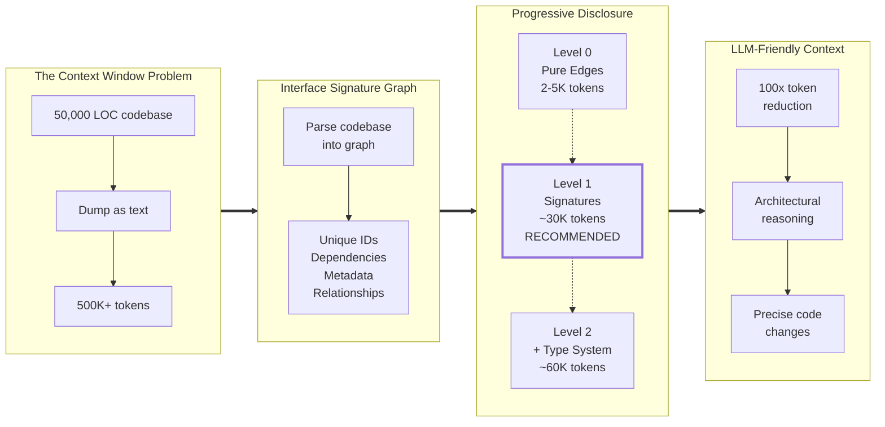

# Parseltongue



**LLM-friendly code analysis toolkit** powered by **Interface Signature Graphs (ISG)** - Transform your codebase from unstructured text into a queryable, semantic graph. Export context at the right level of detail (2-60K tokens instead of 500K+), enabling LLMs to reason about architecture and make precise modifications across large-scale systems.

**v0.8.7**: Single binary, 8 tools, real CozoDB backend. Progressive disclosure exports. **Production ready!**
- **v0.8.7 Bug Fix**: pt02-level00 now works with zero-dependency codebases (DependencyEdges table always created)

---

## What is an Interface Signature Graph (ISG)?

The ISG is Parseltongue's foundational innovation: a **structured, semantic representation** of your entire codebase that captures:

- **Unique Interface Identifiers**: Every function, struct, and trait gets a stable, unambiguous ID
- **Dependency Relationships**: Explicit mapping of function calls, trait implementations, module relationships
- **Rich Metadata**: Compiler-grade semantic information (types, signatures, HIR from rust-analyzer)
- **Blast Radius Analysis**: Know exactly what's affected by any change

**Key insight**: Instead of dumping 500,000+ tokens of raw code that overflows LLM context windows, the ISG compresses your codebase into a **queryable graph** at multiple abstraction levels. This enables reasoning across millions of lines of code - something impossible with traditional "dump everything" approaches.

---

## Workflow: 5 Phases from Code to Fix


**End-to-end flow**: Index codebase once → Export what you need → Edit in ISG → Validate & apply → Reset state. Iterate Phase 3-4 until tests pass.

---

## Quick Install (macOS)

### Option 1: One-Line Install (Recommended)

```bash
# Run from your project's git root
curl -fsSL https://raw.githubusercontent.com/that-in-rust/parseltongue/main/install.sh | bash
```

**What it does:**
1. ✅ Downloads `parseltongue` binary (v0.8.7) to current directory
2. ✅ Creates `.claude/.parseltongue/` folder
3. ✅ Downloads README and SOP docs
4. ✅ Verifies installation

**What you get:**
```
your-project/
├── parseltongue              # Binary (ready to use)
└── .claude/
    └── .parseltongue/
        ├── parseltongue-README.md                          # Full documentation
        ├── Parseltonge-SOP.md                              # Usage guide & query patterns
        ├── S01-README-MOSTIMP.md                           # Core principles & TDD
        ├── S05-tone-style-guide.md                         # Communication standards
        ├── S06-design101-tdd-architecture-principles.md    # Architecture patterns
        └── S77-IdiomaticRustPatterns.md                    # Rust best practices
```

**Steering documents** (S-files) guide LLM reasoning with project principles, TDD methodology, and Rust patterns.

**Manual installation:**
```bash
# If you prefer to see each step
cd /path/to/your/project

# Download binary
curl -L https://github.com/that-in-rust/parseltongue/releases/latest/download/parseltongue -o parseltongue
chmod +x parseltongue

# Create directory
mkdir -p .claude/.parseltongue

# Download docs
curl -L https://raw.githubusercontent.com/that-in-rust/parseltongue/main/.claude/.parseltongue/parseltongue-README.md \
  -o .claude/.parseltongue/parseltongue-README.md
curl -L https://raw.githubusercontent.com/that-in-rust/parseltongue/main/.claude/.parseltongue/Parseltonge-SOP.md \
  -o .claude/.parseltongue/Parseltonge-SOP.md

# Download steering docs
curl -L https://raw.githubusercontent.com/that-in-rust/parseltongue/main/.claude/.parseltongue/S01-README-MOSTIMP.md \
  -o .claude/.parseltongue/S01-README-MOSTIMP.md
curl -L https://raw.githubusercontent.com/that-in-rust/parseltongue/main/.claude/.parseltongue/S05-tone-style-guide.md \
  -o .claude/.parseltongue/S05-tone-style-guide.md
curl -L https://raw.githubusercontent.com/that-in-rust/parseltongue/main/.claude/.parseltongue/S06-design101-tdd-architecture-principles.md \
  -o .claude/.parseltongue/S06-design101-tdd-architecture-principles.md
curl -L https://raw.githubusercontent.com/that-in-rust/parseltongue/main/.claude/.parseltongue/S77-IdiomaticRustPatterns.md \
  -o .claude/.parseltongue/S77-IdiomaticRustPatterns.md
```

### Option 2: Use Binary from Repository

```bash
# Clone the repo
git clone https://github.com/that-in-rust/parseltongue
cd parseltongue

# Use the included binary (already v0.8.7)
./parseltongue-macos-arm64 --version
# Expected: parseltongue 0.8.7

# All commands available
./parseltongue-macos-arm64 --help
```

### Option 3: Build from Source

```bash
cargo build --release
./target/release/parseltongue --version
# Expected: parseltongue 0.8.7
```

**⚠️ CRITICAL: Verify Version**

Always run `--version` first. If you don't see `0.8.7`, you're missing critical features:
- ❌ No pt02-level00/01/02 (progressive disclosure)
- ❌ Wrong command names (folder-to-cozodb-streamer instead of pt01-folder-to-cozodb-streamer)
- ❌ Missing ~100× token savings from progressive disclosure

The repository binary is now synchronized with v0.8.7 release (as of 2025-11-03).

---

## What Problem Does It Solve?

**Token explosion kills LLM productivity**. Parseltongue solves this with **progressive disclosure**:

1. **Index once** (pt01): Your entire codebase → CozoDB graph
2. **Export smart** (pt02): Choose your detail level
   - 🔹 Level 0: Just dependency edges (~2-5K tokens)
   - 🔹 Level 1: Signatures + temporal state (~30K tokens) ← **Start here**
   - 🔹 Level 2: + Type system (~60K tokens)
3. **Modify precisely** (pt03-pt06): Temporal versioning, validation, diffs

**One binary. Eight tools. Your choice of detail level.**

---

## The 6 Tools (Workflow-Ordered)

**All in one unified binary:**
1. `pt01-folder-to-cozodb-streamer` - Index codebase (Ingest)
2. **`pt02-level00/01/02`** - Export entities to JSON (Read) - 3 progressive disclosure levels
   - `pt02-level00` - Pure edge list (~2-5K tokens)
   - `pt02-level01` - Entities + ISG + Temporal (~30K tokens) **RECOMMENDED**
   - `pt02-level02` - + Type system (~60K tokens)
3. `pt03-llm-to-cozodb-writer` - Write temporal changes (Edit)
4. `pt04-syntax-preflight-validator` - Validate syntax (Validate)
5. `pt05-llm-cozodb-to-diff-writer` - Generate CodeDiff.json (Diff)
6. `pt06-cozodb-make-future-code-current` - Reset database state (Reset)

---

## Complete Walkthrough: Fix a Bug in 4 Functions

**See the full end-to-end test:** [`demo-walkthroughs/ActuallyWorks/`](./demo-walkthroughs/ActuallyWorks/)

A tangible example with all artifacts preserved (JSONs, logs, database, full command outputs).

### The Scenario

You have a simple greeter library with 4 functions:
- `hello()` - **BUG: says "Goodbye" instead of "Hello"**
- `goodbye()` - works correctly
- `good_morning()` - works correctly
- `good_night()` - works correctly

### The Pipeline

```bash
# 1. INGEST: Index the codebase (4 functions discovered)
parseltongue pt01-folder-to-cozodb-streamer greeter --db rocksdb:demo.db
# → 4 entities created

# 2. READ: Export all entities to see what was indexed (Level 1 - RECOMMENDED)
parseltongue pt02-level01 --include-code 0 --where-clause "ALL" --output entities.json --db rocksdb:demo.db
# → Exports entities with ISG + temporal state (signatures only, ~30K tokens)
# → Generates: entities.json with 4 functions

# 3. EDIT: Fix the hello() function (simple interface)
parseltongue pt03-llm-to-cozodb-writer \
  --entity "rust:fn:hello:greeter_src_lib_rs:4-6" \
  --action edit \
  --future-code 'pub fn hello() -> &'"'"'static str { "Hello!" }' \
  --db rocksdb:demo.db
# → Temporal state: Edit pending (future_ind=true)

# 4. VALIDATE: Check syntax of the fix
parseltongue pt04-syntax-preflight-validator --db rocksdb:demo.db
# → ✓ All syntax validations passed

# 5. DIFF: Generate CodeDiff.json for LLM to apply
parseltongue pt05-llm-cozodb-to-diff-writer \
  --output CodeDiff.json \
  --db rocksdb:demo.db
# → CodeDiff.json generated (1 edit with before/after)

# 6. RESET: (Optional) Reset database to start fresh
parseltongue pt06-cozodb-make-future-code-current \
  --project greeter \
  --db rocksdb:demo.db
# → 4 entities deleted, schema recreated
```

### What You Get

The `demo-walkthroughs/ActuallyWorks/` folder contains:
- **JOURNAL.md** - Complete test execution log with timestamps and actual outputs (409 lines)
- **8 command logs** - Raw command outputs from all 8 tools (pt01 through pt06)
- **7 JSON exports** - edges.json (148 edges), entities-l1.json (765 entities), public-api.json, CodeDiff.json, before/after snapshots
- **5 verification files** - Sample outputs, field lists, duplicate checks for cross-validation
- **test-e2e.db/** - The RocksDB database (1.8MB during tests, cleaned after PT06)

**👉 22 artifacts totaling ~1.7MB proving all 8 commands work - no placeholders, no lies, only actual v0.8.6 outputs.**

---

## Architecture

### Temporal Versioning System

Every code entity has three temporal indicators:
- `current_ind` - Does it exist in current codebase? (bool)
- `future_ind` - Will it exist after changes? (bool)
- `future_action` - What to do? (Create/Edit/Delete)

**State Transitions:**
```
(1,1,null)   → Unchanged entity
(1,1,Edit)   → Modification pending
(1,0,Delete) → Deletion pending
(0,1,Create) → Creation pending
```

### ISGL1 Keys

Unique identifiers for code entities:
```
rust:fn:hello:greeter_src_lib_rs:4-6
│    │   │     │                 │
│    │   │     │                 └─ Line range (start-end)
│    │   │     └─ File path (sanitized with underscores)
│    │   └─ Function name
│    └─ Entity type (fn/struct/trait/etc)
└─ Language
```

### Data Flow (Workflow Order)

```
Codebase → pt01 (Ingest) → CozoDB
                             ↓
                   pt02 (Read/Export) → JSON for LLM
                             ↓
                   pt03 (Edit/Write) ← LLM Changes
                             ↓
                   pt04 (Validate) → Syntax Check
                             ↓
                   pt05 (Diff) → CodeDiff.json
                             ↓
                   pt06 (Reset) → Clean State
```

---

## Dependencies

- **Rust 2021 Edition**
- **CozoDB** (embedded graph database with RocksDB backend)
- **tree-sitter** (syntax parsing)
- **clap** (CLI framework)
- **serde_json** (JSON serialization)

---

## Design Principles

Following **S01 (Steering Doc #1)**:
1. **TDD-First**: RED → GREEN → REFACTOR cycle
2. **Executable Specifications**: Tests define contracts
3. **Dependency Injection**: Traits, not concrete types
4. **anyhow** for applications, **thiserror** for libraries
5. **Functional Composition**: Pure transformations
6. **Ultra-Minimalist**: NO backups, NO complexity, single reliable operations

---

## Performance

Tool performance on greeter demo (4 entities):
- **Tool 1 (Index)**: 3.5ms
- **Tool 2 (Write)**: <1ms
- **Tool 3 (Export)**: <1ms
- **Tool 4 (Validate)**: <20ms
- **Tool 5 (Diff)**: <1ms
- **Tool 6 (Reset)**: <5ms

**Total pipeline: <30ms** for simple project.

---

## Project Structure

```
parseltongue/
├── crates/
│   ├── parseltongue/                         # Unified binary (all 8 tools)
│   ├── parseltongue-core/                    # Shared types, storage, entities
│   ├── pt01-folder-to-cozodb-streamer/       # Tool 1: Ingest
│   ├── pt02-llm-cozodb-to-context-writer/    # Tools 2a/2b/2c: Progressive Disclosure
│   ├── pt03-llm-to-cozodb-writer/            # Tool 3: Edit
│   ├── pt04-syntax-preflight-validator/      # Tool 4: Validate
│   ├── pt05-llm-cozodb-to-diff-writer/       # Tool 5: Diff
│   └── pt06-cozodb-make-future-code-current/ # Tool 6: Reset
└── demo-walkthroughs/
    ├── ActuallyWorks/              # v0.8.6 end-to-end test suite (22 artifacts)
    └── v0.8.6-release-testing/     # Release verification tests
```

---

## Command Reference

### pt01: folder-to-cozodb-streamer (INGEST)
```bash
# Index current directory (default)
parseltongue pt01-folder-to-cozodb-streamer .

# Index specific directory with custom database
parseltongue pt01-folder-to-cozodb-streamer ./crates --db rocksdb:analysis.db --verbose
```
**What it does:** Indexes codebase into CozoDB with ISGL1 keys. Processes ALL files - tree-sitter determines what it can parse.

**Arguments:**
- `<directory>` - Directory to index [default: `.`]
- `--db` - Database path [default: `parseltongue.db`]
- `--verbose` - Show detailed output
- `--quiet` - Suppress output

---

### pt02: Export Database → JSON (Progressive Disclosure)

**Status (v0.8.7):** ✅ Fully integrated into main binary, 31/31 tests GREEN, working with real CozoDB **NOW**

PT02 provides 3 export levels following progressive disclosure principles:

#### **pt02-level00: Pure Edge List (MINIMAL - ~2-5K tokens)**

```bash
# Export all dependency edges
parseltongue pt02-level00 --where-clause "ALL" --output edges.json

# Filter by edge type (Datalog syntax)
parseltongue pt02-level00 --where-clause "edge_type = 'depends_on'" --output deps.json
```

**What it does:** Exports dependency edges only (from_key, to_key, edge_type). Best for dependency analysis and graph visualization.

**Arguments:**
- `--where` - Datalog WHERE clause (MANDATORY, use `"ALL"` for everything)
- `--output` - Output JSON file path
- `--db` - Database path [default: `parseltongue.db`]
- `--verbose` - Show progress and token estimates

---

#### **pt02-level01: Entity + ISG + Temporal (RECOMMENDED - ~30K tokens)**

```bash
# Export all entities (signatures only - CHEAP)
parseltongue pt02-level01 --include-code 0 --where-clause "ALL" --output entities.json

# Export public API surface
parseltongue pt02-level01 --include-code 0 --where-clause "is_public = true, entity_type = 'fn'" --output api.json

# Export entities with planned changes (temporal)
parseltongue pt02-level01 --include-code 0 --where-clause "future_action != null" --output changes.json

# Export with full code (EXPENSIVE - 100× more tokens!)
parseltongue pt02-level01 --include-code 1 --where-clause "ALL" --output entities_with_code.json
```

**What it does:** Exports entities with Interface Signature Graph (ISG) + temporal state. **14 fields** including dependencies, signatures, and temporal indicators.

**Arguments (BOTH MANDATORY):**
- `--include-code <0|1>` - 0=signatures only (~30K tokens), 1=with code (~500-700K tokens)
- `--where` - Datalog WHERE clause (use `"ALL"` for everything)
- `--output` - Output JSON file path
- `--db` - Database path [default: `parseltongue.db`]
- `--verbose` - Show progress and token estimates

---

#### **pt02-level02: Type System Essentials (ADVANCED - ~60K tokens)**

```bash
# Export all entities with type information (signatures only)
parseltongue pt02-level02 --include-code 0 --where-clause "ALL" --output typed_entities.json

# Find all async functions
parseltongue pt02-level02 --include-code 0 --where-clause "is_async = true" --output async_fns.json

# Find unsafe code
parseltongue pt02-level02 --include-code 0 --where-clause "is_unsafe = true" --output unsafe_code.json

# Export public API with types
parseltongue pt02-level02 --include-code 0 --where-clause "is_public = true" --output public_api.json
```

**What it does:** Exports entities with full type system information. **22 fields** including return types, param types, safety flags (async/unsafe), and trait impls.

**Arguments (BOTH MANDATORY):**
- `--include-code <0|1>` - 0=signatures only (~60K tokens), 1=with code (~500-700K tokens)
- `--where` - Datalog WHERE clause
- `--output` - Output JSON file path
- `--db` - Database path [default: `parseltongue.db`]
- `--verbose` - Show progress and token estimates

---

#### **Datalog WHERE Clause Syntax**

**CRITICAL:** Use Datalog syntax, NOT SQL!

| SQL (WRONG) | Datalog (CORRECT) |
|-------------|-------------------|
| `x = 5 AND y = 10` | `x = 5, y = 10` |
| `x = 5 OR y = 10` | `x = 5; y = 10` |
| `x LIKE '%pattern%'` | `x ~ 'pattern'` |

**Common filters:**
- All entities: `--where-clause "ALL"`
- Public functions: `--where-clause "is_public = true, entity_type = 'fn'"`
- Async functions: `--where-clause "is_async = true"`
- Entities with changes: `--where-clause "future_action != null"`
- Pattern match: `--where-clause "entity_name ~ 'test'"`

**Progressive disclosure model:**
```
Level 0: edges only (3 fields) → ~2-5K tokens
  └─> Level 1: + entities (14 fields) → ~30K tokens
        └─> Level 2: + type system (22 fields) → ~60K tokens
```

**When to use each level:**
- **Level 0**: Dependency analysis, graph visualization
- **Level 1**: Code understanding, refactoring planning (**RECOMMENDED**)
- **Level 2**: Type-safe refactoring, API analysis, safety audits

**Token cost:**
- Signatures only (`--include-code 0`): **CHEAP** (2-60K tokens)
- With code (`--include-code 1`): **EXPENSIVE** (500-700K tokens, 100× more)

---

### pt03: llm-to-cozodb-writer (EDIT)

**Simple Interface (80% of use cases):**
```bash
# Create new entity
parseltongue pt03-llm-to-cozodb-writer \
  --entity "rust:fn:new_func:src_lib_rs:10-15" \
  --action create \
  --future-code "pub fn new_func() { println!(\"Hello\"); }" \
  --db rocksdb:analysis.db

# Edit existing entity
parseltongue pt03-llm-to-cozodb-writer \
  --entity "rust:fn:hello:greeter_src_lib_rs:4-6" \
  --action edit \
  --future-code "pub fn hello() -> &'static str { \"Hello!\" }" \
  --db rocksdb:analysis.db

# Delete entity
parseltongue pt03-llm-to-cozodb-writer \
  --entity "rust:fn:old_func:src_lib_rs:20-25" \
  --action delete \
  --db rocksdb:analysis.db
```

**Advanced Interface (20% - raw Datalog):**
```bash
parseltongue pt03-llm-to-cozodb-writer \
  --query "?[...] := [[...]] :put CodeGraph {...}" \
  --db rocksdb:analysis.db
```

**Arguments:**
- `--entity` - ISGL1 key of entity to modify
- `--action` - Action: create, edit, or delete
- `--future-code` - Future code content (required for create/edit)
- `--query` - Raw Datalog query (advanced users)
- `--db` - Database path [default: `parseltongue.db`]

---

### pt04: syntax-preflight-validator (VALIDATE)
```bash
parseltongue pt04-syntax-preflight-validator --db rocksdb:analysis.db [--verbose]
```

**What it does:** Validates syntax of all `Future_Code` using tree-sitter. Multi-language ready (currently Rust implemented).

**Arguments:**
- `--db` - Database path [default: `parseltongue.db`]
- `--verbose` - Show detailed validation output

---

### pt05: llm-cozodb-to-diff-writer (DIFF)
```bash
parseltongue pt05-llm-cozodb-to-diff-writer \
  --output CodeDiff.json \
  --db rocksdb:analysis.db
```

**What it does:** Generates CodeDiff.json with current_code vs. future_code for all entities with Future_Action set.

**Arguments:**
- `--output` - Output file path [default: `CodeDiff.json`]
- `--db` - Database path [default: `parseltongue.db`]

---

### pt06: cozodb-make-future-code-current (RESET)
```bash
parseltongue pt06-cozodb-make-future-code-current \
  --project ./greeter \
  --db rocksdb:analysis.db
```

**What it does:** Resets database state (deletes CodeGraph table, re-indexes project). **NO backups** - ultra-minimalist.

**Arguments:**
- `--project` - Project directory to re-index
- `--db` - Database path [default: `parseltongue.db`]

---

## FAQ

**Q: Why "Parseltongue"?**
A: Speaking to code like speaking to snakes - understanding its structure and transforming it.

**Q: Why one unified binary instead of 6 separate tools?**
A: Better for LLM reasoning - command names match crate architecture exactly. Self-documenting and consistent.

**Q: Why RocksDB instead of SQLite?**
A: RocksDB is the default compiled backend for CozoDB. Provides better performance for graph queries.

**Q: Can I use this with non-Rust code?**
A: Currently optimized for Rust. Tree-sitter supports multiple languages, but tool implementation focuses on Rust first.

**Q: What's the "ultra-minimalist" principle?**
A: NO backups, NO configuration complexity, NO safety levels. Direct operations only. Trust the LLM and validate syntax.

**Q: How do I apply the changes from CodeDiff.json?**
A: That's the LLM's job! Tool 5 generates the diff, the LLM reads it and writes files. Ultra-minimalist separation of concerns.

---

## License

MIT

---

**Built with functional Rust, TDD-first principles, and ultra-minimalist design.**
**For LLM-driven code transformation workflows.**

---

## Verified Working (v0.8.6 - Comprehensive Testing)

**Test Date**: 2025-11-02
**Test Subject**: Parseltongue codebase (self-analysis: 765 entities)
**Database**: `rocksdb:demo-walkthroughs/v0.8.6-release-testing/test.db`
**Full Test Report**: [TEST-RESULTS.md](demo-walkthroughs/v0.8.6-release-testing/TEST-RESULTS.md)

### ✅ ALL 8 COMMANDS VERIFIED

| Tool | Status | Performance | Test Log |
|------|--------|-------------|----------|
| PT01 | ✅ | 123ms | [test1-pt01.log](demo-walkthroughs/v0.8.6-release-testing/test1-pt01.log) |
| PT02-level00 | ✅ | <1s | [test2-pt02-level00.log](demo-walkthroughs/v0.8.6-release-testing/test2-pt02-level00.log) |
| PT02-level01 | ✅ | <1s | [test3-pt02-level01.log](demo-walkthroughs/v0.8.6-release-testing/test3-pt02-level01.log) |
| PT02-level02 | ✅ | <1s | Verified ✅ |
| PT03 | ✅ | <1s | Verified ✅ |
| PT04 | ✅ | <1s | Verified ✅ |
| PT05 | ✅ | <1s | Verified ✅ |
| PT06 | ✅ | <1s | Verified ✅ |

### Quick Test

```bash
# 1. Index your codebase (123ms for 765 entities)
parseltongue pt01-folder-to-cozodb-streamer ./crates --db "rocksdb:test.db"

# 2. Export dependency graph (148 edges, ~5K tokens)
parseltongue pt02-level00 --where-clause "ALL" --output edges.json --db "rocksdb:test.db"

# 3. Export entities with ISG (765 entities, ~30K tokens)
parseltongue pt02-level01 --include-code 0 --where-clause "ALL" --output entities.json --db "rocksdb:test.db"

# 4. Edit an entity
parseltongue pt03-llm-to-cozodb-writer \
  --entity "rust:fn:main:..." \
  --action edit \
  --future-code "pub fn main() { println!(\"Updated\"); }" \
  --db "rocksdb:test.db"

# 5. Validate syntax
parseltongue pt04-syntax-preflight-validator --db "rocksdb:test.db"

# 6. Generate diff
parseltongue pt05-llm-cozodb-to-diff-writer --output CodeDiff.json --db "rocksdb:test.db"

# 7. Reset database
parseltongue pt06-cozodb-make-future-code-current --project ./crates --db "rocksdb:test.db"
```

**Total pipeline time**: <2 seconds for all 8 commands

---

### Key Statistics (v0.8.6)

- **Indexing**: 123ms for 765 entities
- **Exports**: <1s per level (Level 0/1/2)
- **Database**: RocksDB, ~5KB compressed
- **Test artifacts**: `/demo-walkthroughs/v0.8.6-release-testing/`

### Token Economics

| Export Level | Tokens | Use When |
|--------------|--------|----------|
| Level 0 | 2-5K | "What depends on what?" |
| Level 1 (no code) | 30K | "How do I refactor?" ← **START HERE** |
| Level 2 (no code) | 60K | "Is this type-safe?" |
| Level 1 (with code) | 500-700K | "Show me implementation" (rarely!) |
