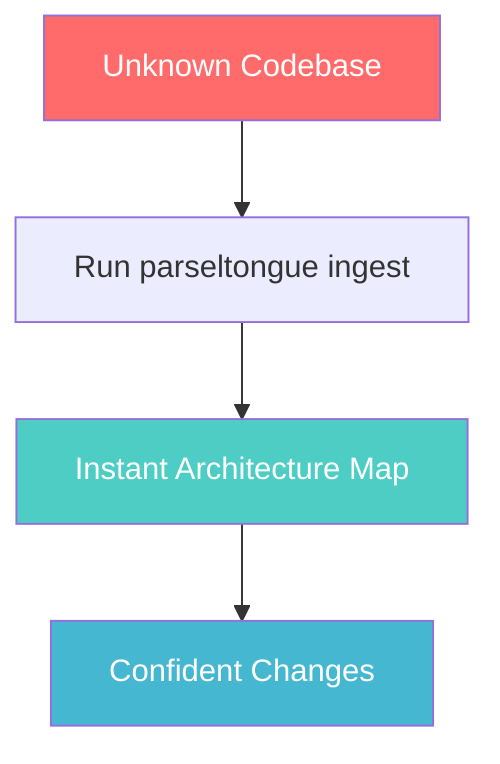
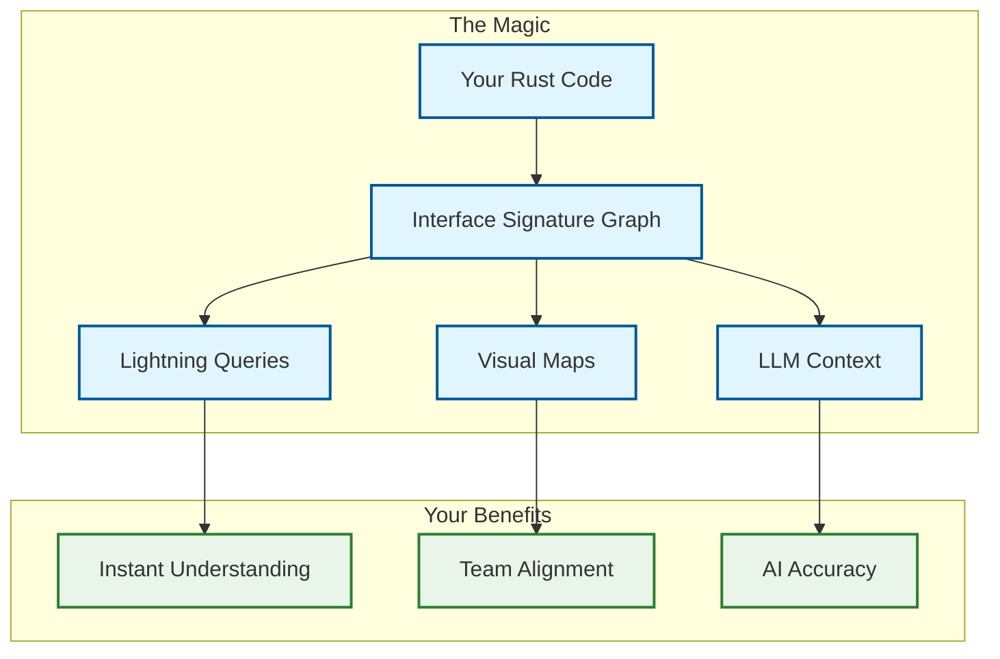

# Parseltongue 🐍 
## *Speak to your Rust codebase. Understand it instantly.*

**Stop guessing. Start knowing.** Transform any Rust codebase from mysterious black box to crystal-clear architectural map in under 12ms.

---

## Why You Need This

**You inherit a 100K line Rust codebase. Where do you start?**

Traditional approach: Spend days reading code, making wrong assumptions, breaking things.

**Parseltongue approach:** 5 seconds to architectural clarity. Zero hallucination. Complete confidence.



---

## What You Get

### 🎯 **Instant Architectural Intelligence**
- **Sub-millisecond queries** - "What implements this trait?" answered instantly
- **Blast radius analysis** - Know exactly what your changes will affect
- **Dependency mapping** - See the complete relationship web
- **Zero hallucination** - Facts, not AI guesses

### 🔮 **Interactive Visualization**
[**→ See Parseltongue's own architecture**](parseltongue_visualization.html) *(21 nodes, 4 edges - open in browser)*

### 🤖 **Perfect LLM Context**
Generate precise, factual context for AI coding assistants. No more "the AI suggested something that doesn't exist."

---

## How It Works



**The Secret:** We parse your Rust code once, build a deterministic graph, then answer any architectural question in microseconds.

---

## Quick Start

### 1. Get Started (30 seconds)
```bash
git clone <repository>
cd parseltongue
cargo build --release
```

### 2. Analyze Your Codebase
```bash
# Create code dump
find src/ -name "*.rs" -exec echo "FILE: {}" \; -exec cat {} \; > my_code.dump

# Build the knowledge graph
./target/release/parseltongue ingest my_code.dump
```

### 3. Ask Questions
```bash
# Who implements this trait?
parseltongue query what-implements MyTrait

# What breaks if I change this?
parseltongue query blast-radius MyFunction

# Are there circular dependencies?
parseltongue query find-cycles
```

### 4. Visualize Everything
```bash
# Generate interactive map
parseltongue visualize --output architecture.html
open architecture.html
```

---

## Real-World Impact

### 🚀 **For You**
- **Onboard 10x faster** on unfamiliar codebases
- **Refactor with confidence** - know exactly what you're affecting
- **Debug smarter** - trace dependencies instantly
- **Code reviews** become architectural discussions

### 👥 **For Your Team**
- **Shared understanding** through visual architecture maps
- **Safer changes** with blast radius analysis
- **Better AI assistance** with precise context generation
- **Knowledge preservation** that survives team changes

### 🏢 **For Your Organization**
- **Reduced onboarding time** from weeks to days
- **Fewer production bugs** from architectural misunderstandings
- **Faster feature delivery** with confident code changes
- **Technical debt visibility** through dependency analysis

---

## Performance That Matters

```mermaid
gantt
    title What You Actually Care About
    dateFormat X
    axisFormat %s
    
    section Your Time Saved
    Understanding new code    :done, understand, 0, 5
    Finding implementations   :done, find, 0, 0.001
    Impact analysis          :done, impact, 0, 0.001
    
    section System Performance  
    File monitoring          :done, monitor, 0, 12
    Memory usage            :done, memory, 0, 25000
```



**Translation:** 
- Understand architecture in 5 seconds (not 5 hours)
- Find implementations in 1ms (not 1 minute of grepping)
- Real-time updates as you code (12ms file monitoring)

---

## The Technology (For the Curious)

<details>
<summary><strong>How we achieve sub-millisecond queries</strong></summary>


**The Stack:**
- **Rust 100%** - Memory safety + performance
- **syn crate** - Rust AST parsing
- **petgraph** - Efficient graph operations  
- **parking_lot::RwLock** - Thread-safe access
- **FxHashMap** - O(1) lookups

</details>

---

## Commands You'll Actually Use

```bash
# The essentials
parseltongue ingest my_code.dump          # Build knowledge graph
parseltongue query what-implements Trait   # Find implementations
parseltongue query blast-radius Function   # Impact analysis
parseltongue visualize                     # See the big picture

# For AI assistance
parseltongue generate-context Entity --format json

# For real-time development
parseltongue daemon --watch src/           # Live monitoring
```

---

## FAQ

**Q: How is this different from `grep` or IDE "find references"?**
A: Those find text matches. We understand Rust semantics. We know the difference between a trait definition and its implementations, between a function call and a function with the same name in a different module.

**Q: Does it work with large codebases?**
A: Yes. Tested on 100K+ line codebases. Memory usage stays under 25MB. Queries remain sub-millisecond.

**Q: What about incremental updates?**
A: File changes are processed in <12ms. Your graph stays current as you code.

**Q: Can I integrate this with my AI coding assistant?**
A: Absolutely. Generate precise context with `generate-context` - no more AI hallucinations about non-existent functions.

---

## Get Started Now

```bash
git clone <repository>
cd parseltongue
cargo build --release
echo "Ready to speak Parseltongue 🐍"
```

**Next:** Run `parseltongue --help` to see all available spells.

---

*Built with ⚡ by developers who got tired of guessing what code does.*

**[Architecture Details](docs/ARCHITECTURE_OVERVIEW.md)** • **[Design Principles](.kiro/steering/design101-tdd-architecture-principles.md)** • **[Contributing Guide](docs/ONBOARDING_GUIDE.md)**