# Parseltongue AIM Daemon

**Rust-only architectural intelligence daemon** providing deterministic, graph-based code analysis with sub-millisecond query performance.

## 🎯 The Problem We Solve

**Rust Codebase Discovery Bottleneck**: Finding entity names and understanding architecture in unfamiliar codebases takes minutes to hours.

**Our Solution**: Parse once, query forever. Build an Interface Signature Graph that gives you:

- Complete entity discovery in milliseconds
- Instant architectural impact analysis
- Deterministic, sub-millisecond queries

## 🚀 Features

- **Real-time File Monitoring**: Watch Rust codebases with <12ms update latency
- **Code Dump Analysis**: Process large code dumps in <5 seconds
- **Graph-based Queries**: Sub-millisecond architectural queries
- **LLM Integration**: Generate structured context for AI code assistance
- **High Performance**: 6μs node operations, concurrent-safe architecture
- **Production Ready**: Comprehensive error handling and crash recovery

## 🎯 Common Workflows

```mermaid
%%{init: {'theme':'base', 'themeVariables': {'primaryColor':'#e1f5fe', 'primaryTextColor':'#01579b', 'lineColor':'#0277bd', 'fontFamily':'Arial', 'fontSize':'13px'}, 'flowchart': {'nodeSpacing': 60, 'rankSpacing': 80, 'wrappingWidth': 140}}}%%
flowchart TD
    %% Workflow 1: Trait Analysis
    subgraph "🔍 Trait Implementation Analysis"
        direction TB
        W1A["📄 Ingest Codebase<br/><i>parseltongue ingest code.txt</i>"]
        W1A --> W1B["🎯 Query Implementors<br/><i>query what-implements Trait</i>"]
        W1B --> W1C["📊 Get Results<br/><i>JSON or human format</i>"]
    end

    %% Workflow 2: Impact Analysis
    subgraph "💥 Change Impact Analysis"
        direction TB
        W2A["🎯 Select Entity<br/><i>UserStruct, Function</i>"]
        W2A --> W2B["📈 Calculate Blast Radius<br/><i>query blast-radius Entity</i>"]
        W2B --> W2C["📋 Generate Context<br/><i>generate-context Entity</i>"]
    end

    %% Workflow 3: LLM Integration
    subgraph "🤖 LLM Context Generation"
        direction TB
        W3A["📋 Analyze Entity<br/><i>Function, Struct, Trait</i>"]
        W3A --> W3B["📄 Export JSON Context<br/><i>--format json</i>"]
        W3B --> W3C["🔗 Send to LLM<br/><i>Zero-hallucination context</i>"]
    end

    %% Workflow 4: Visualization
    subgraph "🎨 Graph Visualization"
        direction TB
        W4A["🔍 Debug Graph<br/><i>debug --graph</i>"]
        W4A --> W4B["📐 Export DOT Format<br/><i>debug --dot</i>"]
        W4B --> W4C["🎯 Generate Visualization<br/><i>Graphviz + DOT</i>"]
    end

    %% Styling
    classDef workflow fill:#e8f5e8,stroke:#2e7d32,stroke-width:2px,color:#1b5e20
    classDef process fill:#e1f5fe,stroke:#01579b,stroke-width:2px,color:#0d47a1
    classDef output fill:#fff3e0,stroke:#ef6c00,stroke-width:2px,color:#e65100

    class W1A,W2A,W3A,W4A workflow
    class W1C,W2C,W3C,W4C output
```



### Query Architecture

```bash
# Find all implementors of a trait
parseltongue query what-implements Greeter

# Calculate blast radius of changes
parseltongue query blast-radius Person

# Find circular dependencies
parseltongue query find-cycles
```

## 🎯 Use Cases

### For Developers

- **Code Navigation**: Understand complex Rust codebases quickly
- **Impact Analysis**: Assess blast radius of proposed changes
- **Architecture Review**: Validate trait implementations and dependencies
- **Refactoring**: Safe code restructuring with dependency analysis
- **Robust Processing**: Handles malformed files gracefully without stopping analysis

### For AI/LLM Integration

- **Context Generation**: Provide accurate architectural context to AI tools
- **Code Assistance**: Enable AI to understand project structure
- **Documentation**: Generate architectural summaries automatically

### For Teams

- **Code Reviews**: Architectural impact assessment
- **Onboarding**: Help new team members understand codebase structure
- **Technical Debt**: Identify circular dependencies and architectural issues
