# Parseltongue AIM Daemon

**Rust-only architectural intelligence daemon** providing deterministic, graph-based code analysis with sub-millisecond query performance.

## 🎯 The Problem We Solve

**Rust Codebase Discovery Bottleneck**: Finding entity names and understanding architecture in unfamiliar codebases takes minutes to hours.

**Our Solution**: Parse once, query forever. Build an Interface Signature Graph that gives you:

- Complete entity discovery in milliseconds
- Instant architectural impact analysis
- Deterministic, sub-millisecond queries

## 🚀 Features

- **Real-time File Monitoring**: Watch Rust codebases with <12ms update latency
- **Code Dump Analysis**: Process large code dumps in <5 seconds
- **Graph-based Queries**: Sub-millisecond architectural queries
- **LLM Integration**: Generate structured context for AI code assistance
- **High Performance**: 6μs node operations, concurrent-safe architecture
- **Production Ready**: Comprehensive error handling and crash recovery

## 🏗️ Architecture


### Core Components

- **OptimizedISG**: High-performance Interface Signature Graph using petgraph + parking_lot
- **ParseltongueAIM**: Main daemon with file monitoring and code parsing
- **CLI Interface**: Complete command-line interface with clap
- **Persistence Layer**: JSON serialization with crash recovery

### Validated Performance Characteristics

```mermaid
%%{init: {'theme':'base', 'themeVariables': {'primaryColor':'#f3e5f5', 'primaryTextColor':'#7b1fa2', 'lineColor':'#9c27b0', 'fontFamily':'Arial', 'fontSize':'12px'}, 'flowchart': {'nodeSpacing': 50, 'rankSpacing': 60, 'wrappingWidth': 120}}}%%
flowchart LR
    %% Performance Tiers
    subgraph "⚡ Microsecond Operations"
        direction TB
        P1["🏗️ Node Ops<br/><b>~6μs</b><br/>Graph construction"]
        P2["🔍 Simple Queries<br/><b>&lt;500μs</b><br/>Entity lookups"]
        P3["📊 Complex Queries<br/><b>&lt;1ms</b><br/>Blast radius"]
    end

    subgraph "📁 File Operations"
        direction TB
        P4["📝 File Updates<br/><b>&lt;12ms</b><br/>Real-time monitoring"]
        P5["📥 Code Ingestion<br/><b>&lt;5s</b><br/>Large codebases"]
    end

    subgraph "💾 Memory Efficiency"
        direction TB
        P6["🎯 Compact Storage<br/><b>Arc&lt;str&gt;</b><br/>String interning"]
    end

    %% Styling
    classDef micro fill:#e8f5e8,stroke:#4caf50,stroke-width:2px,color:#1b5e20
    classDef file fill:#e3f2fd,stroke:#2196f3,stroke-width:2px,color:#0d47a1
    classDef memory fill:#fff3e0,stroke:#ff9800,stroke-width:2px,color:#e65100

    class P1,P2,P3 micro
    class P4,P5 file
    class P6 memory
```



- **Node Operations**: ~6μs (verified ✅)
- **Simple Queries**: <500μs (verified ✅)
- **Complex Queries**: <1ms (verified ✅)
- **File Updates**: <12ms
- **Code Ingestion**: <5s for large dumps (verified ✅)
- **Memory Usage**: Efficient for real codebases

### Technical Stack

- **Language**: Rust (100%)
- **Graph Library**: petgraph with StableDiGraph
- **Concurrency**: parking_lot RwLock for thread safety
- **Parsing**: syn crate for Rust AST analysis
- **File Monitoring**: notify crate for cross-platform file watching
- **CLI**: clap with derive macros
- **Serialization**: serde with JSON format

## 📦 Installation

```bash
git clone <repository>
cd parseltongue
cargo build --release
```

## 🚀 30-Second Demo

See the system in action with the built-in example:

```bash
# Build and run the visualization example
cargo run --example visualize_isg
```

This demonstrates:

- ✅ Code ingestion from `example_dump.txt`
- ✅ ISG structure creation (4 nodes, 1 edge)
- ✅ Graph queries (what-implements, blast-radius)
- ✅ LLM context generation
- ✅ Graphviz DOT export for visualization

## 🎯 Quick Start

### Analyze a Code Dump

```bash
# Using the provided example
parseltongue ingest example_dump.txt

# Query the generated graph
parseltongue query what-implements Display
parseltongue generate-context User --format json
```

### Real-time Monitoring

```bash
# Monitor a Rust project directory
parseltongue daemon --watch src/
```

### Query Architecture

```bash
# Find all implementors of a trait
parseltongue query what-implements Greeter

# Calculate blast radius of changes
parseltongue query blast-radius Person

# Find circular dependencies
parseltongue query find-cycles
```

### Generate LLM Context

```bash
# Human-readable context
parseltongue generate-context Person

# JSON format for LLM consumption
parseltongue generate-context Person --format json
```

## 🎯 Common Workflows

```mermaid
%%{init: {'theme':'base', 'themeVariables': {'primaryColor':'#e1f5fe', 'primaryTextColor':'#01579b', 'lineColor':'#0277bd', 'fontFamily':'Arial', 'fontSize':'13px'}, 'flowchart': {'nodeSpacing': 60, 'rankSpacing': 80, 'wrappingWidth': 140}}}%%
flowchart TD
    %% Workflow 1: Trait Analysis
    subgraph "🔍 Trait Implementation Analysis"
        direction TB
        W1A["📄 Ingest Codebase<br/><i>parseltongue ingest code.txt</i>"]
        W1A --> W1B["🎯 Query Implementors<br/><i>query what-implements Trait</i>"]
        W1B --> W1C["📊 Get Results<br/><i>JSON or human format</i>"]
    end

    %% Workflow 2: Impact Analysis
    subgraph "💥 Change Impact Analysis"
        direction TB
        W2A["🎯 Select Entity<br/><i>UserStruct, Function</i>"]
        W2A --> W2B["📈 Calculate Blast Radius<br/><i>query blast-radius Entity</i>"]
        W2B --> W2C["📋 Generate Context<br/><i>generate-context Entity</i>"]
    end

    %% Workflow 3: LLM Integration
    subgraph "🤖 LLM Context Generation"
        direction TB
        W3A["📋 Analyze Entity<br/><i>Function, Struct, Trait</i>"]
        W3A --> W3B["📄 Export JSON Context<br/><i>--format json</i>"]
        W3B --> W3C["🔗 Send to LLM<br/><i>Zero-hallucination context</i>"]
    end

    %% Workflow 4: Visualization
    subgraph "🎨 Graph Visualization"
        direction TB
        W4A["🔍 Debug Graph<br/><i>debug --graph</i>"]
        W4A --> W4B["📐 Export DOT Format<br/><i>debug --dot</i>"]
        W4B --> W4C["🎯 Generate Visualization<br/><i>Graphviz + DOT</i>"]
    end

    %% Styling
    classDef workflow fill:#e8f5e8,stroke:#2e7d32,stroke-width:2px,color:#1b5e20
    classDef process fill:#e1f5fe,stroke:#01579b,stroke-width:2px,color:#0d47a1
    classDef output fill:#fff3e0,stroke:#ef6c00,stroke-width:2px,color:#e65100

    class W1A,W2A,W3A,W4A workflow
    class W1B,W2B,W3B,W4B process
    class W1C,W2C,W3C,W4C output
```



### Understand Trait Implementations

```bash
# Ingest a codebase and find trait implementors
parseltongue ingest codebase.txt
parseltongue query what-implements Clone --format json
```

### Assess Change Impact

```bash
# Calculate blast radius for proposed changes
parseltongue query blast-radius UserStruct
parseltongue generate-context UserStruct
```

### Generate LLM Context

```bash
# Export context for AI code assistance
parseltongue generate-context EntityName --format json > context.json
```

### Debug Architecture

```bash
# Visualize the graph structure
parseltongue debug --graph
parseltongue debug --dot > graph.dot
```

## 🧪 Testing

The project maintains 97.5% test coverage with comprehensive TDD approach:

```bash
# Run all tests
cargo test

# Run specific test categories
cargo test --lib isg      # Core graph tests
cargo test --lib daemon   # Daemon functionality
cargo test --lib cli      # CLI interface tests
```

### Test Categories

- **Unit Tests**: Core functionality validation
- **Integration Tests**: End-to-end workflow testing
- **Performance Tests**: Timing constraint validation
- **Concurrency Tests**: Thread safety verification

## 📊 Performance Validation

All performance contracts are automatically validated:

```bash
# Performance test results
Node operations: ~6μs ✅
Simple queries: <500μs ✅
Complex queries: <1ms ✅
File updates: <12ms ✅
Persistence: <500ms ✅
```

## 🔧 Configuration

### Environment Variables

- `RUST_LOG` : Set logging level (debug, info, warn, error)
- `PARSELTONGUE_SNAPSHOT_PATH` : Custom snapshot file location

### File Formats

- **Input**: Code dumps use `FILE: path`
  markers:

```
FILE: src/lib.rs
pub trait Display {
    fn fmt(&self) -> String;
}
================================================
FILE: src/main.rs
fn main() {
    // code
}
```

Separators like `====` are automatically ignored.

- **Output**: JSON or human-readable formats
- **Persistence**: JSON snapshots for crash recovery
- **Error Handling**: Malformed Rust files are logged and skipped, allowing processing to continue

### Robust Processing

- **Graceful Error Recovery**: Malformed files are logged and skipped
- **Partial Processing**: Continues analysis even with some file errors
- **Error Reporting**: Clear error messages for debugging

## 🎯 Use Cases

### For Developers

- **Code Navigation**: Understand complex Rust codebases quickly
- **Impact Analysis**: Assess blast radius of proposed changes
- **Architecture Review**: Validate trait implementations and dependencies
- **Refactoring**: Safe code restructuring with dependency analysis
- **Robust Processing**: Handles malformed files gracefully without stopping analysis

### For AI/LLM Integration

- **Context Generation**: Provide accurate architectural context to AI tools
- **Code Assistance**: Enable AI to understand project structure
- **Documentation**: Generate architectural summaries automatically

### For Teams

- **Code Reviews**: Architectural impact assessment
- **Onboarding**: Help new team members understand codebase structure
- **Technical Debt**: Identify circular dependencies and architectural issues

## License
