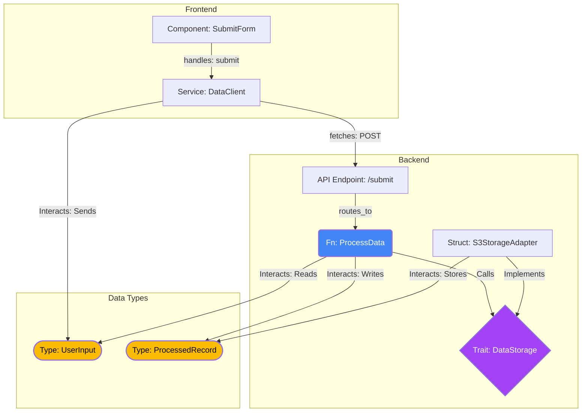
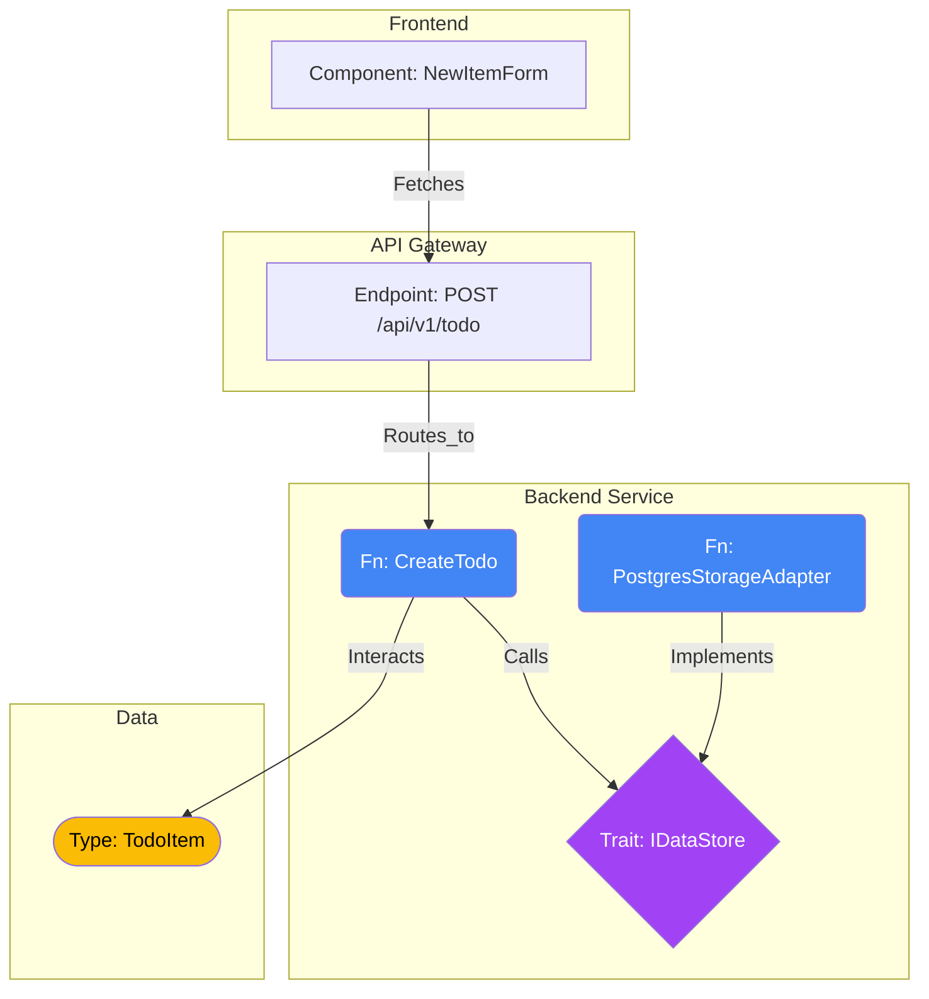

From Narrative to Algorithm: A Framework for Executable Specifications in AI-Driven Software EngineeringThe Inevitability of Rigor: Why Ambiguity is the Enemy of Automated Code GenerationThe advent of Large Language Models (LLMs) capable of generating complex software represents a watershed moment in software engineering. These models promise to automate the translation of human intent into functional code, accelerating development cycles and augmenting developer productivity.1 However, this promise is predicated on a fundamental challenge: the quality of the generated code is inextricably linked to the quality of the input specification. The prevalent methodologies for defining software requirements, honed over decades for human collaboration, are proving to be fundamentally incompatible with the formal, literal nature of AI systems. This analysis posits that a paradigm shift is necessary—away from descriptive, narrative specifications and towards rigorous, executable blueprints.The Paradox of Agile Requirements in the Age of AIModern software development is dominated by Agile methodologies, with the User Story as the primary unit for capturing requirements. A user story is intentionally lightweight—an "informal, general explanation of a software feature" 2 that serves as a "promise to have a conversation about requirements".3 Its format, "As a , I need <what?>, so that <why?>" 4, is designed to build empathy, provide context, and foster collaboration among team members.6 Crucially, user stories are "negotiable" by design; they are placeholders for features that the team will discuss and clarify closer to the time of development.4This intentional ambiguity is a powerful feature for human teams. It allows for emergent design and flexibility, acknowledging that it is often counterproductive to define all details at the outset of a project.4 The "real" specification materializes from the high-bandwidth conversation that follows the story's creation, a dialogue rich with shared context, iterative clarification, and implicit understanding.3For an LLM, however, this ambiguity is a critical flaw. An LLM operates on an explicit, low-bandwidth communication channel—the text of its prompt. It cannot participate in a "conversation" to clarify unstated assumptions or negotiate details. When presented with an ambiguous user story, the model is forced to interpret, infer, and ultimately guess. This leads to common failure modes: architectural deviations, logical errors, security vulnerabilities, and code that, while syntactically correct, fails to meet the true business need. The success of Agile methodologies inadvertently created a dependency on implicit human communication, and the proposed shift to executable specifications directly addresses this "bandwidth mismatch." To achieve high-fidelity output from an LLM, the input specification must be pre-loaded with all the information that would normally be exchanged in the human conversation, making it dense, explicit, and unambiguous.From Waterfall to Executable: A Necessary SynthesisThe evolution of software requirements can be seen as a pendulum swing. The Waterfall model relied on comprehensive, rigid, and detailed functional specification documents that attempted to capture every requirement upfront.3 While rigorous, this approach was often brittle, slow, and unable to adapt to changing business needs. In response, Agile methodologies swung the pendulum towards the conversational, flexible user story.2The concept of an executable specification represents a synthesis of these two extremes. It retains the rigor, completeness, and low ambiguity of Waterfall-era specifications but embeds them within a dynamic, verifiable, and iterative framework characteristic of Agile. The specification is no longer a static document to be filed away; it becomes a living, executable project skeleton that directly guides and verifies the code generation process.ParadigmPrimary ArtifactPrimary AudienceFormTolerance for AmbiguityLocus of InterpretationSuitability for LLMsWaterfall SpecificationFormal Document (e.g., SRS)Business Analysts & ArchitectsNarrative ProseVery Low (in theory)Human DeveloperLowAgile User StoryIndex Card / TicketCross-functional TeamConversational PromptVery High (by design)Collaborative ConversationVery LowExecutable SpecificationCode & Test SuiteHuman Specifier & LLM TranslatorFormal Logic (Code)ZeroVerification HarnessHigh
Defining the "Executable Specification"An Executable Specification is a suite of artifacts, written in a formal language (such as code, data definition language, and machine-readable diagrams), that defines a system's architecture, logic, and correctness criteria with sufficient rigor to eliminate ambiguity and serve as a direct, verifiable blueprint for automated code generation. Within this paradigm, the role of the LLM is transformed. It is no longer an interpreter of vague requirements but a translator of a precise, algorithmic blueprint into a target programming language. This approach provides the necessary human oversight a priori, embedding correctness checks and architectural constraints directly into the source prompt and aligning with the observation that AI-generated code requires diligent review and optimization.1The Intellectual Antecedents: Grounding Executable Specifications in Computer ScienceThe proposed framework, while novel in its application to LLMs, is not an ad-hoc invention. It stands on the shoulders of giants, representing a pragmatic and modern implementation of several foundational disciplines within computer science. By grounding the methodology in established theory, it transitions from a "prompt engineering strategy" to a robust and defensible engineering discipline.A Modern Manifestation of Design by Contract (DbC)The primary theoretical pillar supporting this framework is Design by Contract (DbC), a methodology pioneered by Bertrand Meyer.9 DbC posits that software components should collaborate based on formal "contracts" that define mutual obligations and benefits between a "client" (the caller) and a "supplier" (the called method).10 A contract is composed of three key elements:Preconditions: These are the obligations of the client. They are conditions that must be true before a method is invoked. The client is responsible for satisfying them.9 In the provided MessageService example, the function signature with its specific types (String, RoomId, UserId, Uuid) and the documented constraint (// Invariant: 1-10000 chars, sanitized HTML) constitute the preconditions.Postconditions: These are the obligations of the supplier. They are conditions that the method guarantees will be true after it executes successfully, provided the preconditions were met.13 The documented Side Effects (e.g., "Inserts row into 'messages'") and the precise return type Result<Message<Persisted>, MessageError> are the explicit postconditions.Invariants: These are conditions that must hold true for an object or system throughout its lifecycle, maintained across method calls.10 The proposed L1 constraints.md file, which defines system-wide rules, serves as the specification for these global invariants.The most significant innovation of the executable specification framework is how it enforces these contracts. While classic DbC often relies on language-level assertions checked at runtime 11, this methodology introduces the RED phase: the provision of a complete, executable, and initially failing test suite. This transforms the contract from mere documentation into the very definition of correctness. The specification does not just state the postconditions; it provides the precise, automated mechanism to verify their fulfillment. The LLM's task is thus narrowed from the abstract goal of "implement the contract" to the concrete, verifiable objective of "make this specific test suite pass."Pragmatic Formalism: Applying Formal Methods without the OverheadFormal Methods are a class of mathematically rigorous techniques used for the specification, design, and verification of software and hardware systems.19 By modeling a system as a mathematical entity, it becomes possible to prove its properties with a level of certainty that empirical testing cannot achieve.22 However, traditional formal methods often require specialized and complex notations (e.g., Z notation, B-Method) and significant expertise, limiting their widespread adoption.23The executable specification framework can be understood as a form of pragmatic or lightweight formal methods. It eschews a separate mathematical language and instead leverages the formalisms inherent in modern, strongly-typed programming languages. The L2 architecture.md, with its complete SQL DDL and exhaustive Rust error enum definitions, is a formal specification of the system's state space and failure modes. The L3 STUB interface, with its precise types and traits, is a formal specification of a component's behavior. The RED test suite, particularly with the inclusion of property tests that check for abstract invariants, serves as the formal verification harness.22 This approach democratizes formal specification, making its benefits of clarity, rigor, and early error detection accessible to any development team.TDD as a Machine-Readable Protocol: The Right Tool for the JobThe choice of Test-Driven Development (TDD) as the core methodology for L3 specifications is a deliberate and critical design decision. To understand its significance, one must contrast it with Behavior-Driven Development (BDD).BDD is an extension of TDD that emphasizes collaboration between technical and non-technical stakeholders.25 It uses a natural, accessible language (e.g., Gherkin's Given-When-Then syntax) to define system behavior from the user's perspective, ensuring that development aligns with business outcomes.27 BDD is optimized for human-to-human shared understanding.TDD, conversely, is a developer-centric practice focused on defining the precise, testable behavior of a single unit of code.26 Its Red-Green-Refactor cycle is a rigorous, algorithmic process for building software components.Communicating with an LLM is not a stakeholder collaboration problem; it is a formal instruction problem. The LLM is not a "non-technical team member" that needs to understand business intent through natural language. It is a formal code synthesizer that requires unambiguous, machine-readable instructions. The natural language of BDD would reintroduce the very ambiguity the framework seeks to eliminate. The precise, code-based nature of a TDD test suite, however, serves as the ideal communication protocol. It provides the LLM with a perfect, unambiguous definition of expected inputs, outputs, and side effects, making TDD the correct tool for this specific "audience."Executable Spec ComponentCorresponding PrinciplePurpose in the FrameworkL1 constraints.mdSystem-Wide Invariants (DbC)Defines global operational boundaries and non-functional requirements.L2 architecture.md (Data Models)Formal Specification (Data)Provides an unambiguous blueprint for system state.L2 architecture.md (Error Hierarchy)Design by Contract (Failure Postconditions)Guarantees robust handling of all known failure modes.L3 STUB (Interface Contract)Design by Contract (Pre/Postconditions)Defines the precise obligations and guarantees of a single function.L3 RED (Failing Tests)Formal Verification / TDDProvides an executable, verifiable oracle for functional correctness.L3 GREEN (Decision Tables)Algorithmic SpecificationEliminates logical ambiguity in complex business rules.L4 user_journeys.mdBDD / Acceptance TestingEnsures technically correct modules combine to deliver end-user value.
Anatomy of an Executable Blueprint: A Deep Analysis of the L1-L4 FrameworkThe proposed four-layer structure provides a comprehensive, modular approach to specification that respects the context limitations of LLMs while ensuring complete coverage from high-level architecture to low-level logic.L1: constraints.md – System-Wide Invariants and the Architectural RulebookThis foundational layer acts as the global contract for the entire system, codifying the architectural philosophy and non-functional requirements that transcend any single module. By defining constraints such as complexity limits (e.g., max lines per file), allowed libraries, and forbidden patterns, it establishes the boundaries within which the LLM must operate, ensuring consistency and maintainability.To enrich this layer, specifications for logging standards, observability, and security should be included. For example, a constraint could mandate that all public-facing API endpoints must be processed by a specific authorization middleware, or that key business transactions must emit structured logs with certain correlation IDs. This elevates non-functional requirements to first-class, verifiable citizens of the specification.L2: architecture.md – Architectural Contracts and the Principle of Fail-FastThis layer defines the static skeleton of the system: its components, their relationships, and the data structures they exchange. The use of Mermaid diagrams for architecture, complete Data Definition Language (DDL) for data models, and language-specific type definitions (e.g., Rust structs) provides an unambiguous structural blueprint.The proposal's inclusion of an Exhaustive Error Hierarchy is a particularly powerful concept. By pre-defining a complete enum of every possible error a service can return, the specifier forces a "compile-time" consideration of all failure modes. This is a direct application of DbC's "fail hard" philosophy 10, preventing the LLM from inventing novel, unhandled error types and ensuring that error handling is a deliberate architectural concern, not an implementation afterthought.This layer can be further strengthened by including formal API contracts using a standard like OpenAPI 3.0. This would not only provide a rigorous definition for RESTful interfaces but also enable the automatic generation of client libraries, mock servers, and API documentation, further enhancing the executable and verifiable nature of the specification.L3: modules/*.md – Method-Level Contracts and the TDD CycleThis is the core of the framework, where the system's dynamic logic is specified with precision. The TDD cycle provides a robust structure for this:STUB (Interface Contract): As established, this is the DbC contract, defining the method's signature, inputs, outputs, and documented side effects.RED (Behavioral Specification): Providing executable, failing tests is the key innovation that makes the contract verifiable. The inclusion of Property Tests alongside unit tests is a mark of deep insight. While unit tests verify behavior against known, specific examples, property tests define and check abstract invariants (e.g., "for any valid input, idempotency holds"). This allows the machine to search for and identify edge cases and logical flaws that a human specifier might never anticipate.GREEN (Implementation Guidance): The use of Decision Tables for complex conditional logic is vastly superior to prose or pseudocode. A decision table is a structured, tabular format that exhaustively maps combinations of conditions to specific actions and outputs. This format translates directly and unambiguously into code constructs like match statements or nested conditionals, leaving no room for misinterpretation by the LLM.REFACTOR (Constraints & Anti-Patterns): This section acts as a set of crucial guardrails. Explicitly forbidding incorrect implementation strategies—such as prohibiting an application-level SELECT before INSERT to avoid Time-of-Check to Time-of-Use (TOCTOU) race conditions—closes off entire categories of potential bugs and architectural errors that an LLM might otherwise generate.L4: user_journeys.md – Behavioral Confirmation and End-to-End ValidationThis layer serves as the final bridge between technical correctness and business value. It ensures that the individual modules, proven correct by the L3 specifications, integrate properly to fulfill end-to-end user scenarios. This serves a similar purpose to BDD, confirming that the system's behavior meets high-level user expectations and acceptance criteria.27 The E2E test stubs provide a clear definition of done for the system as a whole. To maximize automation, these stubs should be structured in a way that allows for direct translation into a concrete testing framework like Playwright or Cypress, potentially by another specialized tool or LLM.The Verification Harness (verification.md): Codifying the Definition of FlawlessThis final component is the lynchpin of the entire methodology. It operationalizes the definition of "flawless" by creating a single, executable script that runs all verification steps: static analysis, unit tests, property tests, integration tests, and E2E tests. This removes all subjectivity from the code review and acceptance process. The implementation is deemed correct if, and only if, the verification harness executes and exits with a status code of 0. It is the ultimate expression of a truly executable and verifiable specification.The New Division of Labor: The Software Architect as Specifier-in-ChiefAdopting this methodology has profound implications that extend beyond technical execution, fundamentally reshaping the role of the software engineer and the structure of development teams.From Coder to Architect: The Shift in Core CompetenciesWhen an LLM is responsible for the mechanical act of translating a detailed blueprint into a target language 1, the primary value-add of the human engineer shifts away from mastery of language syntax or rote algorithmic implementation. The most critical and valuable skills become those required to create the blueprint itself:Systems Thinking: The ability to design the coherent, scalable, and resilient high-level architectures defined in L1 and L2.Formal Logic: The skill of translating ambiguous business requirements into the precise, unambiguous contracts, decision tables, property tests, and error hierarchies of an L3 specification.Adversarial Thinking: The capacity to anticipate edge cases, failure modes, race conditions, and security vulnerabilities, and then to codify them as explicit RED tests that the implementation must guard against.Economic Thinking: The wisdom to balance ideal correctness with practical constraints, formally defining areas of "acceptable imperfection" to deliver value efficiently without over-engineering.Prompt Engineering is Not Enough: The Fallacy of the "AI Code Monkey"A simplistic view of AI's role in development is that engineers will simply write better natural language prompts to an "AI code monkey." This view is insufficient. Effective use of code generation tools requires a deep understanding of how to structure prompts for correctness and how to debug the resulting output.8The Executable Specification framework represents the apotheosis of prompt engineering. The "prompt" is not a paragraph of English text; it is a multi-file, logically consistent, and self-verifying artifact. The act of creating this comprehensive prompt is not a trivial task but rather the core activity of a highly skilled software architect. It requires a profound understanding of the problem domain, software design principles, and formal verification techniques.Team Structures and the "Specifier/Translator" ModelThis shift in responsibilities may lead to new team structures. A potential model is a division of labor between two key roles:Architect-Specifiers: Senior engineers who are experts in domain modeling, systems design, formal specification, and security. Their primary output is the L1-L4 executable blueprint. They are the authors of the system's logic and constraints.AI-Assisted Implementers/Verifiers: Engineers who operate the LLM "translator" to generate code from the specifications. Their focus is on managing the generation pipeline, running the verification harness, debugging integration issues, and overseeing the deployment process. They ensure the smooth functioning of the automated translation and verification workflow.Strategic Implementation and Future DirectionsThe transition to a methodology of this rigor requires a deliberate strategy and will be accelerated by the development of a new ecosystem of tools.An Incremental Adoption PathwayA "big bang" adoption of this entire framework is likely unrealistic and disruptive. A more pragmatic, incremental pathway is recommended:Start with L3: For a single, new, well-encapsulated module, apply the rigorous STUB -> RED -> GREEN -> REFACTOR cycle. This introduces the core discipline of contract-based, test-driven specification at a manageable scale.Introduce L2: For the next new service, begin by authoring the architecture.md file, defining the data models and the exhaustive error hierarchy before writing the L3 module specifications.Formalize L1 and L4: As the culture of rigor takes hold, formalize the L1 system-wide constraints and begin building out the L4 E2E test stubs for major user journeys.Integrate the Verification Harness: Finally, connect all the pieces by creating the master verification.md script, fully automating the definition of "done."Tooling and Ecosystem RequirementsThis methodology would be significantly enhanced by a new generation of Integrated Development Environments (IDEs) designed for specification-first development. One can envision an IDE where defining an L3 STUB interface automatically generates the boilerplate for the RED test files. It might feature a graphical UI for creating Decision Tables that generates the corresponding markdown in the GREEN section. In such an IDE, the "Run" button would not merely compile code; it would trigger the entire pipeline of LLM generation, code compilation, and execution of the full verification harness.Deconstructing "Rails-Equivalent Imperfection"The concept of formally specifying acceptable imperfections is one of the most sophisticated and pragmatic aspects of this framework. Formal methods traditionally aim to prove absolute correctness 19, a standard that is often unnecessary or cost-prohibitive for many real-world system properties. Business requirements frequently involve trade-offs that embrace non-absolute behaviors like eventual consistency, statistical reliability, or defined performance tolerances.By providing a test that asserts a state after a delay (e.g., the 65-second window for presence tracking), the specification codifies the business requirement ("it's acceptable for presence to be slightly out of date") into a verifiable, executable contract. This methodology allows a team to apply the full rigor of formal specification not only to absolute correctness properties but also to these nuanced, non-ideal-but-acceptable behaviors. This represents a significant evolution, bridging the gap between the absolute world of formal verification and the pragmatic, resource-constrained world of business value.Beyond Code Generation: The Specification as a Central AssetAn executable specification suite is far more than a one-time prompt for an LLM. It is a valuable, long-lived engineering asset that serves multiple purposes:Automated Documentation: The L2 diagrams, DDL, and L3 contracts can be used to generate perfectly accurate, always-up-to-date technical documentation, solving a perennial problem in software maintenance.Enhanced Security Audits: Formal models of system behavior and data flow allow security analysis tools to identify potential vulnerabilities at the specification stage, before a single line of implementation code is written.Intelligent Maintenance: When a requirement changes, the engineer's first step is to modify the specification (e.g., by adding a new RED test or updating a decision table). The LLM can then be tasked with refactoring the code to meet the new specification, and the verification harness automatically ensures that the change is implemented correctly and introduces no regressions.Conclusion: A Paradigm Shift Towards Correct-by-Construction SoftwareThe proposed framework for executable specifications is not merely an incremental improvement in prompting techniques. It is a coherent, robust, and theoretically sound methodology that addresses the fundamental challenge of ambiguity in AI-driven software development. It correctly diagnoses the shortcomings of traditional requirements and provides a comprehensive solution grounded in decades of research in Design by Contract, formal methods, and test-driven development.Far from deskilling the software engineering profession, the rise of capable LLMs is acting as a powerful forcing function. It is compelling the industry to finally adopt the level of precision, rigor, and formal discipline that has long been advocated by computer science theorists but often overlooked in practice. The need to communicate with a literal-minded machine is making the benefits of formal specification undeniably clear.The ultimate promise of this methodology is a paradigm shift towards correct-by-construction software. When the specification is a formal, executable blueprint and the verification process is comprehensive and automated, the code generated is not just "probably right"—it is provably correct with respect to that specification. This represents a profound step forward in our ability to engineer reliable, robust, and secure software systems.


This is an ambitious and forward-thinking vision for greenfield software development. The core proposition—compressing the essential architectural intent into a minimal, analyzable specification (the "Interface-Stub") and leveraging LLMs to generate the implementation—promises a paradigm shift in how systems are designed, validated, and built.

Here is a synthesis of the ideas, illustrating how they interconnect to form a cohesive strategy, supplemented with visualizations.

### The Framework: Architecture as Data

The central philosophy is treating the architecture not merely as documentation, but as the primary, executable data artifact. This framework is built on several interconnected layers.

#### 1\. The Specification: Interface-Stub (Idea 1)

The process begins by defining the system's behavior in a compact, machine-readable format (e.g., JSONL). This "1% codebase" focuses purely on *what* the system does, defining:

  * **Components:** Requirements, Types, Operations (Functions), Traits (Interfaces).
  * **Constraints:** Guards (pre-conditions), Policies (post-conditions), Invariants.
  * **Non-Functional Requirements:** p99 latency budgets, idempotency rules, consistency models.

This enables rigorous **"pre-code" analysis**: simulating workflows (pre-mortem), verifying coverage, and validating performance budgets before any implementation code is written.

#### 2\. The Structure: The Graph Model (Ideas 2 & 5)

The JSONL specification is interpreted as a comprehensive graph, providing the necessary structure for analysis.

  * **The Three-by-Three Graph (Idea 2):** A standardized model for the core logic:
      * **Nodes:** `Fn` (Functions), `Type` (Data Structures), `Trait` (Contracts).
      * **Edges:** `Calls`, `Interacts`, `Implements`.
  * **SigHash IDs:** Cryptographic hashes of interface signatures uniquely identify components, enabling precise dependency tracking and "blast radius" analysis when changes are proposed.
  * **Cross-Stack Micro Graph (Idea 5):** The graph expands to encompass all layers (frontend, backend, infrastructure) by introducing edges like `handles` (UX events), `fetches` (Frontend to API), `routes_to` (API Gateway to Fn), and `mounts` (Fn on Infrastructure). This allows for end-to-end specification of UX flows.

#### 3\. The Engine: Analysis and Context (Ideas 3 & 4)

Specialized tooling is essential to leverage this architecture-as-data approach.

  * **Rust-based Graph Operator (Idea 3):** A high-performance CLI tool that developers, CI/CD pipelines, and LLMs can invoke. It performs complex analyses, such as simulating request traversal, validating invariants, and checking budget adherence across the call graph.
  * **SQLite + JSONL Query (Idea 4):** Storing the specification in an efficient, queryable format (like SQLite) is crucial for LLM context management. It enables the retrieval of a "bounded node + terminal slice"—a specific, relevant subgraph—allowing the LLM to generate focused, context-aware code without needing the entire architecture in its context window.

### Visualization: Understanding the Architecture (Ideas 6 & 7)

While the compressed data format is ideal for machines, human developers need intuitive visualizations to comprehend the architecture, identify potential issues, and explore dependencies.

#### Idea 6: Mermaid Diagrams for Relationships

Mermaid diagrams are excellent for generating standardized, version-controllable diagrams that illustrate specific flows and static relationships.

Here is a Mermaid diagram illustrating the **Cross-Stack Micro Graph** incorporating the **Three-by-Three** model for a simple data submission flow:



#### Idea 7: Obsidian-Style Visualizations

For a more dynamic and exploratory understanding of the architecture, an interactive, force-directed graph (like those in Obsidian) is highly beneficial. This allows developers to navigate the connections, understand the "blast radius" of changes, and see how different components implement shared contracts.

Here is a conceptual SVG representation of such a visualization, using different shapes and colors to distinguish the Three-by-Three node types (Fn, Type, Trait).

```svg
<svg width="600" height="400" xmlns="http://www.w3.org/2000/svg">
  <title>Interactive Architecture Graph Concept</title>
  <defs>
    <marker id="arrowhead" markerWidth="10" markerHeight="7" refX="25" refY="3.5" orient="auto">
      <polygon points="0 0, 10 3.5, 0 7" fill="#999" />
    </marker>
  </defs>
  <style>
    .function { fill: #4285F4; } /* Blue Circles */
    .type { fill: #FBBC05; }     /* Orange Squares */
    .trait { fill: #A142F4; }    /* Purple Triangles */
    .edge { stroke: #999; stroke-width: 1.5; marker-end: url(#arrowhead); }
    .implements { stroke-dasharray: 5,5; stroke: #A142F4; }
    text { font-family: monospace; font-size: 12px; fill: #333; }
    .label { font-size: 10px; fill: #666; }
  </style>

  <line x1="300" y1="200" x2="150" y2="100" class="edge"/>
  <text x="225" y="140" class="label">Calls</text>

  <line x1="300" y1="200" x2="450" y2="100" class="edge"/>
  <text x="375" y="140" class="label">Calls</text>

  <line x1="300" y1="200" x2="300" y2="320" class="edge"/>
  <text x="310" y="260" class="label">Interacts</text>

  <line x1="150" y1="100" x2="100" y2="250" class="edge implements"/>
  <line x1="450" y1="100" x2="500" y2="250" class="edge implements"/>

  <circle cx="300" cy="200" r="20" class="function"/>
  <text x="270" y="180">Fn:ProcessOrder</text>

  <circle cx="150" cy="100" r="15" class="function"/>
  <text x="100" y="90">Fn:AuthUser</text>
  <circle cx="450" cy="100" r="15" class="function"/>
  <text x="400" y="90">Fn:ChargeCard</text>

  <rect x="280" y="300" width="40" height="40" class="type"/>
  <text x="275" y="360">Type:OrderDB</text>

  <polygon points="100,230 80,270 120,270" class="trait"/>
  <text x="60" y="285">Trait:IAuth</text>

  <polygon points="500,230 480,270 520,270" class="trait"/>
  <text x="450" y="285">Trait:IPayment</text>

    <circle cx="20" cy="350" r="7" class="function" />
    <text x="35" y="355" font-size="12px">Function (Fn)</text>
    <rect x="13" y="363" width="14" height="14" class="type" />
    <text x="35" y="375" font-size="12px">Type</text>
    <polygon points="20,380 13,394 27,394" class="trait"/>
    <text x="35" y="392" font-size="12px">Trait</text>
</svg>
```

### Summary

This collection of ideas outlines a powerful strategy for modern software development. By encoding architectural intent into a standardized, graph-based data format, and developing specialized tools for analysis and simulation, you create a workflow where LLMs can reliably generate the implementation, leading to more robust systems designed with unprecedented efficiency.


This is an excellent set of questions. To build an effective MVP for this "Interface-Stub" architecture, we must prioritize data structures that are optimized for machine traversal (for analysis) and highly compatible with LLM understanding (for code generation).

Here is a concrete recommendation for the MVP, addressing the role of Mermaid diagrams, the need for fast traversal, and the optimal data structures.

### 1\. Mermaid Diagrams and LLMs

You asked if Mermaid diagrams are understood by LLMs.

**Yes, but they should not be the source of truth.**

LLMs can read and generate Mermaid syntax because it is a textual format. However, Mermaid is a *visualization* language, not a semantic data definition language. It lacks the rich metadata (like precise type definitions, invariants, p99 budgets, and policies) required for rigorous analysis and accurate code generation.

Relying on Mermaid as input forces the LLM and your analysis tools to interpret a diagrammatic representation, which is inefficient and ambiguous.

**Recommendation:** The architectural specification must be structured data. Mermaid diagrams (Idea 6) should be an *output* generated by your tools for human visualization, not the primary input.

### 2\. Fast Traversal: In-Memory Graphs

The Rust-based graph operator (Idea 3) needs the fastest possible structure to execute graph algorithms, such as dependency analysis, budget simulation, or blast radius calculation.

Software architectures are typically *sparse graphs* (components are not connected to every other component). The most efficient representation for this is an **Adjacency List**.

**Recommendation:** The Rust operator should utilize an optimized, in-memory graph library. In Rust, the `petgraph` crate is the standard. It uses efficient internal representations (optimized adjacency lists) to provide the speed required for complex analysis.

### 3\. The Recommended MVP Data Structure: A Hybrid Approach

The MVP requires different data structures optimized for storage, analysis, and querying.

#### A. Storage and Interchange: JSONL (JSON Lines)

**JSONL** is the ideal format for the "1% codebase" specification (Idea 1).

  * **Simplicity & Tooling:** It is easy to write, parse, and version control.
  * **Streamable:** Large architectures can be processed without loading the entire file into memory.
  * **LLM Friendly:** It is a dense, structured format that LLMs can interpret.

The JSONL should define the Nodes and Edges of the "Three-by-Three" graph (Idea 2).

```json
// Example JSONL Schema
{"type": "Node", "id": "FN_LOGIN", "kind": "Fn", "name": "LoginHandler", "spec": {"p99_ms": 100, "idempotent": false}}
{"type": "Node", "id": "TYPE_USER", "kind": "Type", "name": "User"}
{"type": "Node", "id": "TRAIT_AUTH", "kind": "Trait", "name": "IAuthenticator"}
{"type": "Edge", "source": "FN_LOGIN", "target": "TRAIT_AUTH", "kind": "Calls"}
{"type": "Edge", "source": "FN_LOGIN", "target": "TYPE_USER", "kind": "Interacts"}
```

#### B. Analysis Engine: Petgraph

When the Rust operator starts, it should parse the JSONL and build the in-memory `petgraph` structure. This structure is then used for operations requiring fast traversal (e.g., simulating workflows or calculating dependencies).

#### C. Querying and Slicing Engine: SQLite (In-Memory)

To provide a "bounded node + terminal slice" for LLM context (Idea 4), you need a way to perform complex queries, such as: "Find all nodes that implement Trait X and interact with Type Y, and return their immediate dependencies."

While this can be done in `petgraph`, it is often more straightforward in SQL.

**Recommendation:** The Rust operator should load the JSONL data into an **in-memory SQLite database** at runtime. This provides the power of SQL for complex filtering and subgraph extraction without the overhead of a persistent database.

### 4\. LLM Context Presentation: Interface Signatures

The final, crucial step is how to present the extracted context slice to the LLM. While you could provide the raw JSONL slice, LLMs are significantly more effective at generating code when the context is presented as actual code.

**Recommendation:** The Rust operator should transform the extracted subgraph (from SQLite) into standardized interface signatures (e.g., TypeScript Interfaces or Rust Traits).

```typescript
// Example: Context provided to LLM for FN_LOGIN (Transformed from JSONL)

// Dependencies (Traits)
interface IAuthenticator {
  // ... methods ...
}

// Interacting Types
type User = {
  // ... schema ...
};

// Target Function Specification
// Constraints: p99_ms: 100, idempotent: false
function LoginHandler(/*...*/) {
  // LLM generates implementation here, aware of IAuthenticator and User
}
```

### Summary of the MVP Stack

This hybrid approach optimizes each layer for its specific purpose:

| Layer | MVP Technology | Purpose |
| :--- | :--- | :--- |
| **Storage** | **JSONL** | Durable, version-controlled source of truth (Idea 1 & 2). |
| **Analysis** | **Petgraph** (in Rust) | High-performance traversal and simulation (Idea 3). |
| **Querying** | **SQLite** (In-memory) | Efficient querying for bounded context retrieval (Idea 4). |
| **LLM Input** | **Interface Signatures** (TS/Rust) | Optimal format for LLM comprehension and code generation. |
| **Visualization**| **Mermaid** (Generated Output) | Human visualization of the architecture (Idea 6). |

This is an excellent approach. By grounding these abstract ideas in a concrete scenario, we can better understand how they function in practice. Let's use the scenario of a simple "To-Do List" application.

### Idea 1: The Interface-Stub (The 1% Codebase)

**Concept:** Compressing the architectural intent into a compact JSONL specification. This defines requirements, types, operations, constraints (guards, policies), and non-functional requirements (budgets, consistency), enabling "pre-code" analysis.

**Example:** We define the data type for a To-Do item, a trait for data storage, and the function to create a new item.

```json
// The "Type" (Data Structure)
{"type": "Node", "id": "TYPE_TODO_ITEM", "kind": "Type", "name": "TodoItem", "spec": {"schema": "id: UUID, title: String, completed: Bool"}}

// The "Trait" (The Contract for storage)
{"type": "Node", "id": "TRAIT_IDATASTORE", "kind": "Trait", "name": "IDataStore", "spec": {"methods": ["save(item: TodoItem) -> Result"]}}

// The "Fn" (The Business Logic)
{"type": "Node", "id": "FN_CREATE_TODO", "kind": "Fn", "name": "CreateTodo", "spec": {"p99_ms": 150, "consistency": "strong", "guards": ["title must not be empty"]}}

// The Relationships (Edges)
{"type": "Edge", "source": "FN_CREATE_TODO", "target": "TYPE_TODO_ITEM", "kind": "Interacts"}
{"type": "Edge", "source": "FN_CREATE_TODO", "target": "TRAIT_IDATASTORE", "kind": "Calls"}
```

*Pre-code Analysis:* Before writing code, we can already verify that the `CreateTodo` function adheres to the 150ms budget (assuming we define budgets for the `IDataStore` methods) and that the guard condition is specified.

### Idea 2: The Three-by-Three Graph and SigHash IDs

**Concept:** Structuring the architecture using three node types (Fn, Type, Trait) and three edge types (Calls, Interacts, Implements). SigHash IDs provide a unique, stable identifier based on the signature of the component.

**Example:** Modeling the implementation of the storage trait.

```json
// New Node: The implementation
{"type": "Node", "id": "FN_PG_ADAPTER", "kind": "Fn", "name": "PostgresStorageAdapter"}

// New Edge: Implementation
{"type": "Edge", "source": "FN_PG_ADAPTER", "target": "TRAIT_IDATASTORE", "kind": "Implements"}
```

**The Graph Structure:**

```mermaid
graph LR
    Fn(Fn: CreateTodo)
    Tr{Trait: IDataStore}
    Ty([Type: TodoItem])
    Impl(Fn: PostgresStorageAdapter)

    Fn -- Interacts --> Ty
    Fn -- Calls --> Tr
    Impl -- Implements --> Tr
    Impl -- Interacts --> Ty %% Adapter also interacts with the Type
```

**SigHash Example:**
The SigHash for `TRAIT_IDATASTORE` is calculated based on its exact signature: `IDataStore { save(item: TodoItem) -> Result }`.

```
Input Signature: "IDataStore { save(item: TodoItem) -> Result }"
SigHash: 9aF4c2... (Stable ID)
```

If someone changes the method name to `save_item`, the SigHash changes, allowing the system to immediately identify the "blast radius"—every function that `Calls` or `Implements` this trait needs review.

### Idea 3: Rust-based Graph Operator

**Concept:** A high-performance CLI tool that LLMs and CI/CD pipelines can invoke to analyze the graph, simulate behavior, validate invariants, or check budgets.

**Example:** We want to simulate the latency budget for the `CreateTodo` flow to ensure it meets the 150ms requirement defined in Idea 1. We first need to add a budget to the implementation.

```json
// Updated Node with its own budget
{"type": "Node", "id": "FN_PG_ADAPTER", "kind": "Fn", "name": "PostgresStorageAdapter", "spec": {"p99_ms": 120}}
```

The Rust operator (`arch_op`) traverses the graph from the entry point, summing the budgets along the execution path.

```bash
$ arch_op analyze-budget --entrypoint FN_CREATE_TODO

> Traversing Call Graph for FN_CREATE_TODO...
> Path 1: FN_CREATE_TODO -> (Calls) -> TRAIT_IDATASTORE <- (Implements) <- FN_PG_ADAPTER
>
> Budget Analysis:
> FN_CREATE_TODO (Base Logic): 30ms (150ms total budget - 120ms dependency)
> FN_PG_ADAPTER (Dependency): 120ms
> -----------------------------------
> Total Estimated p99: 150ms
> Status: PASS
```

### Idea 4: SQLite + JSONL Query for Bounded Context

**Concept:** Loading the JSONL specification into an efficient query engine (like SQLite) to extract a "bounded node + terminal slice." This provides the LLM with exactly the context it needs to generate code, without overwhelming it.

**Example:** An LLM is tasked with generating the implementation code for `FN_CREATE_TODO`. The system needs to provide the relevant context (what it calls, what data it interacts with, and its constraints).

The Rust operator executes an SQL query against the in-memory SQLite database containing the architecture graph.

```sql
-- Find all nodes directly connected to FN_CREATE_TODO
SELECT
    T2.*
FROM
    Edges AS T1
JOIN
    Nodes AS T2 ON T1.target = T2.id
WHERE
    T1.source = 'FN_CREATE_TODO';
```

**The resulting "Context Slice" (provided to the LLM):**

```json
// Target Node
{"id": "FN_CREATE_TODO", "spec": {"p99_ms": 150, "consistency": "strong", "guards": ["title must not be empty"]}}

// Dependencies
{"id": "TYPE_TODO_ITEM", "spec": {"schema": "id: UUID, title: String, completed: Bool"}}
{"id": "TRAIT_IDATASTORE", "spec": {"methods": ["save(item: TodoItem) -> Result"]}}
```

### Idea 5: Cross-Stack Micro Graph

**Concept:** Expanding the graph beyond the core logic to include all stacks (frontend, backend, infrastructure) with edges like `handles`, `fetches`, and `routes_to`, enabling end-to-end flow specification.

**Example:** Modeling the frontend interaction that triggers the `CreateTodo` function.

```json
// New Node: The UX Component
{"type": "Node", "id": "UX_NEW_ITEM_FORM", "kind": "Component", "name": "NewItemForm"}

// New Node: The API Endpoint
{"type": "Node", "id": "API_POST_TODO", "kind": "Endpoint", "name": "POST /api/v1/todo"}

// New Edges: Cross-stack communication
{"type": "Edge", "source": "UX_NEW_ITEM_FORM", "target": "API_POST_TODO", "kind": "Fetches"}
{"type": "Edge", "source": "API_POST_TODO", "target": "FN_CREATE_TODO", "kind": "Routes_to"}
```

We can now trace a user action (submitting the form) through the API layer to the business logic function.

### Idea 6: Mermaid Diagram for Relationships

**Concept:** Generating standardized visualizations from the JSONL specification to help developers understand relationships and identify potential bugs or bottlenecks.

**Example:** Visualizing the complete Cross-Stack Micro Graph from Idea 5.



### Idea 7: Obsidian-Style Visualization

**Concept:** Using interactive, force-directed graphs to explore the architecture dynamically, helping developers understand dependencies and the "blast radius" of changes intuitively.

**Example:** A developer is considering adding a new feature, `FN_ARCHIVE_TODO`. They use the visualization tool to explore how it connects to the existing `TRAIT_IDATASTORE` and `TYPE_TODO_ITEM`. This view highlights that both `CreateTodo` and `ArchiveTodo` depend on the same trait, emphasizing the importance of maintaining the contract.

```svg
<svg width="500" height="350" xmlns="http://www.w3.org/2000/svg">
  <title>Obsidian-Style Visualization Example</title>
  <defs>
    <marker id="arrowhead" markerWidth="10" markerHeight="7" refX="20" refY="3.5" orient="auto">
      <polygon points="0 0, 10 3.5, 0 7" fill="#999" />
    </marker>
  </defs>
  <style>
    .function { fill: #4285F4; } /* Blue Circles */
    .type { fill: #FBBC05; }     /* Orange Squares */
    .trait { fill: #A142F4; }    /* Purple Triangles */
    .edge { stroke: #999; stroke-width: 2; marker-end: url(#arrowhead); }
    .highlight { stroke: red; stroke-width: 3; }
    text { font-family: monospace; font-size: 12px; fill: #333; }
  </style>

  <line x1="100" y1="100" x2="250" y2="175" class="edge highlight"/> <line x1="100" y1="250" x2="250" y2="175" class="edge highlight"/> <line x1="400" y1="175" x2="250" y2="175" class="edge"/> <line x1="250" y1="50" x2="100" y1="100" class="edge"/> <line x1="250" y1="50" x2="100" y1="250" class="edge"/> <polygon points="250,155 230,195 270,195" class="trait"/>
  <text x="200" y="215">Trait: IDataStore</text>

  <circle cx="100" cy="100" r="20" class="function"/>
  <text x="60" y="80">Fn: CreateTodo</text>

  <circle cx="100" cy="250" r="20" class="function"/>
  <text x="50" y="275">Fn: ArchiveTodo</text>


  <circle cx="400" cy="175" r="20" class="function"/>
  <text x="350" y="155">Fn: PGAdapter</text>

    <rect x="230" y="30" width="40" height="40" class="type"/>
  <text x="210" y="20">Type: TodoItem</text>

    <text x="20" y="320" font-size="10px" fill="red">Red lines show shared dependency on IDataStore</text>
</svg>
```