# Architecture Overview - Level 1 (30,000ft view)

This is the highest-level view of the codebase structure.
See [explore.md](explore.md) for detailed exploration.

```mermaid
flowchart TD
    Entry0["🚀 test_fail<br/><i>Entry: lib.rs</i>"]
    Entry1["🚀 main<br/><i>Entry: simple_echo_tcp.rs</i>"]
    Entry2["🚀 Greeter<br/><i>Entry: lib.rs</i>"]
    Entry3["🚀 main<br/><i>Entry: udp-codec.rs</i>"]
    Entry4["🚀 main<br/><i>Entry: main.rs</i>"]
    Dirbenches["📁 benches<br/><i>94 items</i>"]
    Direxamples["📁 examples<br/><i>34 items</i>"]
    Dirsrc["📁 src<br/><i>7 items</i>"]
    Dir.["📁 .<br/><i>2 items</i>"]
    Dirtokio_tests["📁 tokio/tests<br/><i>1140 items</i>"]
    Dirtokio_util_tests["📁 tokio-util/tests<br/><i>260 items</i>"]
    Dirtokio_stream_tests["📁 tokio-stream/tests<br/><i>81 items</i>"]
    Dirtokio_util_src["📁 tokio-util/src<br/><i>6 items</i>"]
    Dirtests_integration_tests["📁 tests-integration/tests<br/><i>22 items</i>"]
    Dirtokio_test_src["📁 tokio-test/src<br/><i>9 items</i>"]
    Dirtokio_test_tests["📁 tokio-test/tests<br/><i>35 items</i>"]
    Dirtokio_macros_src["📁 tokio-macros/src<br/><i>25 items</i>"]
    Dirstress_test_examples["📁 stress-test/examples<br/><i>1 items</i>"]
    Dirtokio_stream_src["📁 tokio-stream/src<br/><i>11 items</i>"]
    Dirtests_build_tests["📁 tests-build/tests<br/><i>2 items</i>"]
    Dirtokio_src["📁 tokio/src<br/><i>1 items</i>"]
    Entry0 --> Dirtokio_macros_src
    Entry1 --> Dirstress_test_examples
    Entry2 --> Dirsrc

    %% Styling
    classDef entry fill:#e1f5fe,stroke:#0277bd,stroke-width:3px,color:#01579b
    classDef directory fill:#f3e5f5,stroke:#7b1fa2,stroke-width:2px,color:#4a148c
    class Entry0 entry
    class Entry1 entry
    class Entry2 entry
    class Entry3 entry
    class Entry4 entry
    class Dirbenches directory
    class Direxamples directory
    class Dirsrc directory
    class Dir. directory
    class Dirtokio_tests directory
    class Dirtokio_util_tests directory
    class Dirtokio_stream_tests directory
    class Dirtokio_util_src directory
    class Dirtests_integration_tests directory
    class Dirtokio_test_src directory
    class Dirtokio_test_tests directory
    class Dirtokio_macros_src directory
    class Dirstress_test_examples directory
    class Dirtokio_stream_src directory
    class Dirtests_build_tests directory
    class Dirtokio_src directory
```

---

*📊 Next Level: [Detailed Exploration](explore.md) | 🗂️ Full Data: [JSON Export](data/full_isg.json)*
