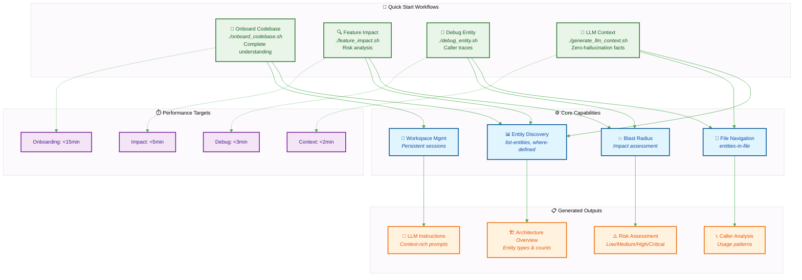

# Parseltongue Dungeon: Ready-to-Use Scripts and LLM Instructions

This directory contains production-ready scripts and LLM instruction files for common Parseltongue workflows.



## Quick Start

1. **Onboard to a new codebase**: `./onboard_codebase.sh /path/to/codebase`
2. **Feature impact analysis**: `./feature_impact.sh EntityName`
3. **Debug workflow**: `./debug_entity.sh FunctionName`
4. **Generate LLM context**: `./generate_llm_context.sh /path/to/codebase`

## Directory Structure

```
parseltongue_dungeon/
├── scripts/                    # Executable workflow scripts
│   ├── onboard_codebase.sh    # Complete onboarding workflow
│   ├── feature_impact.sh      # Feature planning workflow
│   ├── debug_entity.sh        # Debug workflow
│   └── generate_llm_context.sh # LLM context generation
├── llm_instructions/          # LLM instruction templates
│   ├── codebase_analysis.md   # Instructions for codebase analysis
│   ├── refactor_planning.md   # Instructions for refactor planning
│   └── architecture_review.md # Instructions for architecture review
├── demo_outputs/              # Example outputs from real codebases
│   ├── axum_exploration/      # Axum codebase exploration results
│   └── parseltongue_self/     # Parseltongue self-analysis results
└── README.md                  # This file
```

## Performance Expectations

- **Onboarding**: <15 minutes for codebases up to 1000 files
- **Feature Impact**: <5 minutes for impact analysis
- **Debug Workflow**: <3 minutes for caller traces
- **LLM Context**: <2 minutes for context generation

All scripts include timing measurements and success validation.