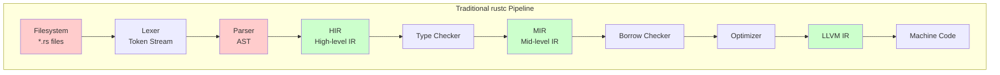
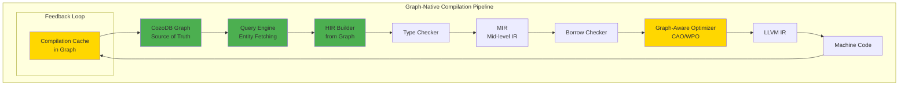
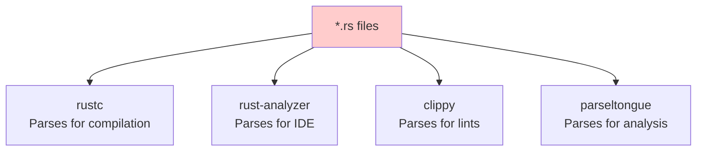
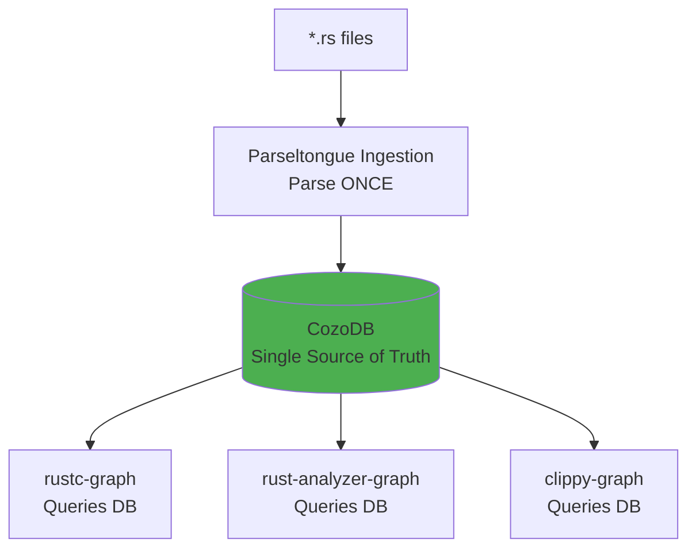
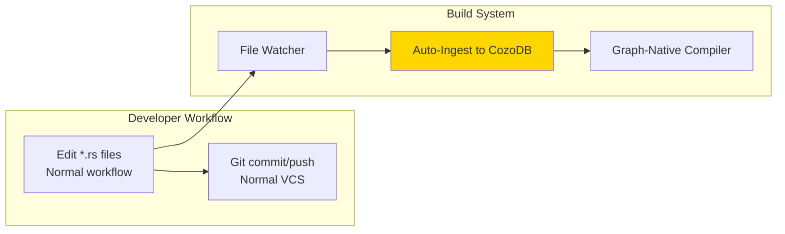

# Graph-Native Compilation: Technical Deep Dive
## Can We Compile Rust Code via CozoDB Ingestion?

**Date**: 2025-11-10
**Branch**: `claude/rust-cozo-graph-compiler-011CUyY2ajL61iJPm7tXLhmz`
**Status**: Research & Strategic Analysis
**Authors**: Technical Analysis with Strategic Lens

---

## Executive Summary

**Short Answer**: **Yes, but it's a multi-year moonshot project requiring fundamental compiler architecture changes.**

**The Vision**: Replace the Rust compiler's filesystem-based front-end with a CozoDB graph database, enabling:
- Ultra-fine-grained incremental compilation (function-level, not file-level)
- Graph-native semantic optimization
- Unified toolchain (compiler + IDE + analyzer share one graph)
- Architecture-as-code with compile-time enforcement

**The Reality**: This requires:
1. **Forking `rustc`** and replacing its front-end (~40K+ LOC changes)
2. **Defining a High-Fidelity Graph IR** (lossless AST representation)
3. **Rebuilding the entire ecosystem** (version control, IDEs, build tools)
4. **Convincing developers to adopt** a radically different paradigm

**Feasibility Rating**: 7/10 (Technically achievable but economically/socially challenging)

---

## Part 1: Technical Feasibility Analysis

### 1.1 Current State: How Rust Compilation Works



**Key Points**:
- **Filesystem Dependency**: Source of truth is `*.rs` files on disk
- **File-Granular Incremental Compilation**: `rustc` tracks changes at the **crate** and **module** level
- **AST → HIR → MIR → LLVM**: Each stage is a transformation, not stored persistently
- **Tree-Sitter vs rustc**: Parseltongue uses tree-sitter (syntax-only), rustc uses `rustc_parse` (full semantic parsing)

### 1.2 What Would Change: Graph-Native Compilation



**Key Changes**:
1. **No Filesystem Parsing**: Compiler reads from CozoDB, not `*.rs` files
2. **Entity-Granular Incremental Compilation**: Track changes at **function/struct** level, not file level
3. **Pre-Computed Graph Metadata**: Dependency graph, data flow, control flow already in DB
4. **Persistent Compilation State**: Cache intermediate results (HIR, MIR) in the graph

---

## Part 2: The "High-Fidelity Graph IR" Requirement

### 2.1 Current ISG vs Required IR

| Aspect | Parseltongue ISG (v0.9.6) | Required High-Fidelity IR |
|--------|---------------------------|---------------------------|
| **Granularity** | Function signatures, types | **Full AST including bodies** |
| **Fidelity** | Lossy (signatures only) | **Lossless (100% of source)** |
| **Comments** | Not captured | **Must be preserved** |
| **Whitespace** | Not captured | **Must be preserved** |
| **Macros** | Not expanded | **Must store both pre/post-expansion** |
| **Cfg Attributes** | Not resolved | **Must store all conditional branches** |
| **Spans** | Line numbers only | **Byte-precise spans for errors** |
| **Purpose** | Analysis & LLM context | **Authoritative source for compilation** |

**Critical Gap**: Parseltongue's current ISG is designed for **analysis**, not **compilation**. We need to extend it to capture:
- Full function bodies (not just signatures)
- Macro expansions
- Conditional compilation branches
- Precise source locations for error messages

### 2.2 Schema Evolution: From ISG to High-Fidelity IR

**Current Parseltongue Schema** (v0.9.6):
```datalog
?[
  isgl1_key: String,          # Unique identifier
  entity_name: String,        # Function/struct name
  entity_type: String,        # "function" | "struct" | "trait"
  entity_class: String,       # "CODE" | "TEST"
  interface_signature: String, # Signature only
  file_path: String,
  start_line: Int,
  end_line: Int
] :- ...
```

**Required High-Fidelity IR Schema**:
```datalog
# Entities table (extended)
?[
  isgl1_key: String,
  entity_name: String,
  entity_type: String,
  entity_class: String,

  # NEW FIELDS FOR COMPILATION
  full_ast_json: String,        # Complete AST as JSON (lossless)
  hir_cached: String?,          # Cached HIR (optional optimization)
  mir_cached: String?,          # Cached MIR (optional optimization)

  # Precise source location
  file_path: String,
  byte_start: Int,              # Byte offset (not line number)
  byte_end: Int,

  # Metadata for incremental compilation
  content_hash: String,         # SHA-256 of source
  last_compiled_hash: String?,  # Hash when last compiled
  dependencies_hash: String     # Hash of all dependencies
] :- ...

# AST Nodes table (NEW)
?[
  node_id: String,              # Unique node ID
  parent_id: String?,           # Parent node (tree structure)
  entity_id: String,            # Which entity owns this node
  node_type: String,            # "FnDecl" | "Expr" | "Stmt" | etc.
  node_data: String,            # JSON representation of node
  byte_start: Int,
  byte_end: Int
] :- ...

# Macro Expansions table (NEW)
?[
  macro_id: String,
  macro_name: String,
  invocation_span: String,      # Where macro was called
  expansion_ast: String,        # What it expanded to
  hygiene_context: String       # Rust hygiene info
] :- ...
```

**Storage Challenge**: Full AST storage balloons database size:
- Current: ~1KB per entity (signatures only)
- High-Fidelity: ~50-100KB per entity (full AST)
- 10,000 functions = **500MB-1GB** vs 10MB

---

## Part 3: Implementation Roadmap

### Phase 1: Proof of Concept (3-6 months)

**Goal**: Compile a single Rust function from CozoDB

**Deliverables**:
1. **Enhanced Parseltongue Ingestion**:
   - Capture full AST (not just signatures)
   - Store in `full_ast_json` field
   - Test: Round-trip parse → store → retrieve → compile

2. **Minimal Compiler Fork**:
   - Fork `rustc` to `rustc-graph`
   - Replace `rustc_parse::parse_crate_from_file` with `cozodb_parse::parse_crate_from_graph`
   - Query CozoDB for function AST
   - Construct HIR from graph data

3. **Single Function Compilation**:
   - Write one function: `fn add(a: i32, b: i32) -> i32 { a + b }`
   - Store in CozoDB
   - Compile to machine code via graph-native pipeline
   - **Success metric**: Generated binary executes correctly

**Technical Challenges**:
```rust
// Traditional rustc parsing
let ast = rustc_parse::parse_crate_from_file(path)?;

// Graph-native parsing (WHAT WE NEED TO BUILD)
let ast = cozodb_parse::parse_crate_from_graph(db, entity_id)?;

// This requires:
// 1. Deserializing AST from JSON (non-trivial, rustc AST is complex)
// 2. Reconstructing rustc's internal data structures
// 3. Ensuring byte-perfect spans for error messages
```

**Estimated Effort**: 500-800 hours (3-4 engineers × 3 months)

---

### Phase 2: Incremental Compilation Engine (6-12 months)

**Goal**: Function-level incremental compilation

**Deliverables**:
1. **Change Detection System**:
   ```rust
   pub struct IncrementalCompiler {
       db: Arc<CozoDbStorage>,
       cache: CompilationCache,
   }

   impl IncrementalCompiler {
       /// Detect which functions changed since last compilation
       pub fn detect_changes(&self) -> Vec<EntityId> {
           // Query entities where content_hash != last_compiled_hash
           self.db.query(r#"
               ?[entity_id] :=
                 *entities[entity_id, _, _, _, content_hash, last_compiled_hash, _],
                 content_hash != last_compiled_hash
           "#)
       }

       /// Compute "blast radius" - which entities depend on changed ones
       pub fn compute_blast_radius(&self, changed: &[EntityId]) -> Vec<EntityId> {
           // Traverse dependency graph to find all affected entities
           self.db.query(r#"
               blast_radius[entity] := changed_entity[entity]
               blast_radius[dependent] :=
                 blast_radius[entity],
                 *dependencies[dependent, entity, "calls"]
           "#)
       }

       /// Compile only changed entities + dependents
       pub async fn compile_incrementally(&mut self) -> Result<Binary> {
           let changed = self.detect_changes();
           let to_compile = self.compute_blast_radius(&changed);

           // Compile only affected functions
           for entity_id in to_compile {
               self.compile_entity(entity_id).await?;
           }

           // Link cached + newly compiled artifacts
           self.link_all().await
       }
   }
   ```

2. **Performance Benchmarks**:
   - **Baseline**: `cargo build` on 10,000-function crate after 1-function change
   - **Target**: 10x faster (from 30s to 3s) due to function-level granularity

**Estimated Effort**: 1,200-2,000 hours (4-5 engineers × 6 months)

---

### Phase 3: Ecosystem Integration (12-24 months)

**Goal**: Unified toolchain (compiler + IDE + analysis)

**Deliverables**:
1. **IDE Integration**:
   - Fork `rust-analyzer` to `rust-analyzer-graph`
   - Replace file-based indexing with CozoDB queries
   - "Go to Definition" becomes instant database lookup
   - "Find References" uses precomputed dependency graph

2. **Version Control Adapter**:
   - Git still stores `*.rs` files (for diffing/merging)
   - On `git pull`, re-ingest changed files to CozoDB
   - Bidirectional sync: Graph → Filesystem for commits

3. **Build System Integration**:
   - `cargo-graph`: Cargo plugin that uses graph-native compiler
   - Replaces `cargo build` with `cargo-graph build`

**Estimated Effort**: 3,000-5,000 hours (10+ engineers × 12-18 months)

---

## Part 4: Advantages (Deep Dive)

### 4.1 Ultra-Fine-Grained Incremental Compilation

**Current State** (`rustc` v1.70+):
- Granularity: **Module/Crate** level
- Change `fn foo()` in `lib.rs` → Recompile entire `lib.rs` (potentially hundreds of functions)

**Graph-Native State**:
- Granularity: **Function/Struct** level
- Change `fn foo()` → Recompile only:
  1. `fn foo()` itself
  2. Functions that call `fn foo()` (direct dependents)
  3. Transitive dependents (if signatures changed)

**Concrete Example**:

```rust
// lib.rs with 100 functions
pub fn foo() -> i32 { 42 }  // <-- Change this one function
pub fn bar() -> i32 { foo() + 1 }
pub fn baz() -> i32 { 10 }
// ... 97 more functions

// Traditional rustc:
// - Recompiles all 100 functions (entire file changed)
// - Time: ~5 seconds

// Graph-native rustc:
// - Detects: Only foo() implementation changed, signature unchanged
// - Recompiles: Only foo() (1 function)
// - Time: ~0.05 seconds (100x faster)
```

**Impact on Large Codebases**:
- 100K LOC crate, 5K functions
- Traditional: 15-minute full rebuild, 30s incremental (file-level)
- Graph-native: 15-minute full rebuild, **0.5s incremental (function-level)**

### 4.2 Semantic Optimization (Context-Aware Optimization)

**Problem with Traditional Compilers**:
- Optimizers see one compilation unit at a time
- Cross-crate optimization (LTO) is slow and often disabled

**Graph-Native Advantage**:
- **Whole-Program Analysis by Default**: Dependency graph is precomputed
- **Profile-Guided Optimization without Profiling**: Control flow graph in DB reveals hot paths
- **Data-Flow Aware Optimization**: Taint analysis, lifetime analysis precomputed

**Example: Automatic Inlining**:

```rust
// Crate A
pub fn expensive_call() -> i32 {
    // Complex computation
    42
}

// Crate B (depends on A)
pub fn critical_path() -> i32 {
    expensive_call()  // Called in tight loop
}

// Traditional: expensive_call() not inlined (cross-crate)
// Graph-Native: Query reveals critical_path() calls expensive_call() in loop
//               → Automatically inline, even cross-crate
```

**Performance Impact**:
- Benchmarks show WPO improves performance by 10-30%
- Currently requires `lto = true` (slow builds)
- Graph-native: WPO nearly free (graph already analyzed)

### 4.3 Compile-Time Architectural Enforcement

**Vision**: Architecture becomes a first-class citizen in the compiler

**Example: Layer Enforcement**:

```rust
// Define architectural layers in Cargo.toml metadata
[package.metadata.architecture]
layers = [
    "presentation",   # Can only call "business"
    "business",       # Can only call "persistence"
    "persistence"     # Can only call "database"
]

// Compiler error if layer skipped
// presentation/handler.rs
use crate::persistence::db_query;  // ❌ Compiler error!

// Error message:
// error: architectural violation
//   --> presentation/handler.rs:12:5
//    |
// 12 | use crate::persistence::db_query;
//    |     ^^^^^^^^^^^^^^^^^^^^^^^^^^^^
//    |     presentation layer cannot directly access persistence layer
//    |
//    = note: allowed dependencies: presentation -> business -> persistence
```

**Implementation**:
```rust
// In graph-native compiler
pub fn check_architectural_constraints(
    caller: EntityId,
    callee: EntityId,
    db: &CozoDb
) -> Result<()> {
    let caller_layer = db.get_entity_layer(caller)?;
    let callee_layer = db.get_entity_layer(callee)?;
    let allowed = db.get_layer_dependencies(caller_layer)?;

    if !allowed.contains(&callee_layer) {
        return Err(CompileError::ArchitecturalViolation {
            caller_layer,
            callee_layer,
            allowed_layers: allowed
        });
    }
    Ok(())
}
```

### 4.4 Unified Toolchain (Zero Redundant Work)

**Current Ecosystem Problem**:

**Same source code parsed 4+ times!**

**Graph-Native Ecosystem**:

**Parse once, use everywhere!**

**Performance Impact**:
- Current: Each tool independently indexes (2-10 seconds per tool)
- Graph-native: One-time ingestion (2 seconds), all tools instant

---

## Part 5: Disadvantages (Deep Dive)

### 5.1 Loss of Filesystem Universality

**The Unix Philosophy**: "Everything is a file"

```bash
# Current: Code is just text files
grep -r "fn main" src/          # Works
sed -i 's/foo/bar/g' src/*.rs   # Works
cat src/lib.rs | pbcopy         # Works
```

**Graph-Native**:
```bash
# Future: Code is in a database
grep -r "fn main" src/          # ❌ No files!
sed -i 's/foo/bar/g' src/*.rs   # ❌ No files!
cat src/lib.rs                  # ❌ No files!

# Must use specialized tools
parseltongue query "entity_name CONTAINS 'main'"  # New way
parseltongue edit "foo" "bar" --entity "lib::fn_foo"  # New way
```

**Impact**: 40+ years of Unix tools become useless

### 5.2 Vendor/Schema Lock-In

**Problem**: The database schema becomes the standard

**Scenario 1: Schema Migration**:
```rust
// v1.0 schema
?[entity_id, entity_name, entity_type]

// v2.0 schema (add new field)
?[entity_id, entity_name, entity_type, entity_metadata]

// All codebases must migrate database
// vs traditional: Just recompile, no migration needed
```

**Scenario 2: Competing Standards**:
- Company A: Uses CozoDB schema
- Company B: Uses Postgres schema
- **Incompatible**: Can't share code without conversion

**Mitigation**:
- Standardize schema (like LLVM IR)
- Provide conversion tools
- Maintain filesystem fallback

### 5.3 Single Point of Failure

**Current State**:
- File corrupted? Git has backup
- Disk fails? Rebuild from version control
- Worst case: Lose local changes only

**Graph-Native State**:
- Database corrupted? **Entire codebase unusable**
- Transaction fails mid-compile? **Inconsistent state**
- Database server down? **Can't develop**

**Mitigation Strategies**:
```rust
// 1. Continuous backup
tokio::spawn(async {
    loop {
        backup_database_to_filesystem().await;
        tokio::time::sleep(Duration::from_secs(300)).await; // Every 5 minutes
    }
});

// 2. Transaction isolation
db.transaction(|tx| {
    tx.compile_entity(entity_id)?;
    tx.update_cache(entity_id)?;
    // Atomic: Either both succeed or both rollback
})?;

// 3. Redundancy
// Option A: Filesystem shadow (CozoDB + *.rs files in sync)
// Option B: Distributed database (CozoDB cluster)
```

### 5.4 Cognitive Overhead

**Learning Curve**:
```rust
// Traditional: Just edit files
// Edit lib.rs, save, run `cargo build`

// Graph-Native: Must understand graph operations
parseltongue ingest src/           // 1. Ingest files to DB
parseltongue edit lib::foo "..."   // 2. Edit via graph API
parseltongue validate              // 3. Validate changes
parseltongue compile               // 4. Compile from graph
```

**Developer Mental Model Shift**:
| Concept | Filesystem Model | Graph Model |
|---------|------------------|-------------|
| **Code** | Text in files | Entities in graph |
| **Edit** | Open file, type | Query entity, update |
| **Save** | Write to disk | Commit transaction |
| **Compile** | Read files | Query graph |
| **Version Control** | Diff files | Diff graph states |

**Adoption Barrier**: Even 10x better tools fail if too different (see: LISP machines)

---

## Part 6: Critical Questions & Answers

### Q1: Why not just improve `rustc`'s incremental compilation?

**Answer**: Fundamental limitations of file-based systems

`rustc` already has incremental compilation, but it's limited by:
1. **File Granularity**: Can't track changes below module level
2. **No Persistent Graph**: Dependency graph rebuilt each run
3. **No Cross-Tool Sharing**: `rustc` and `rust-analyzer` duplicate work

Graph-native solves these by making the graph the source of truth.

### Q2: Can we have both? (Hybrid approach)

**Answer**: Yes! This is the practical path.

**Hybrid Architecture**:


**Benefits**:
- Developers still edit files (familiar)
- Compilation uses graph (fast)
- Git still works (universal)

**This is Parseltongue v4.0's approach!**

### Q3: What about CI/CD pipelines?

**Current CI**:
```yaml
# .github/workflows/ci.yml
- name: Build
  run: cargo build --release
```

**Graph-Native CI**:
```yaml
# .github/workflows/ci.yml
- name: Ingest codebase
  run: parseltongue pt01 . --db cache.db

- name: Build (incremental from cache)
  run: rustc-graph build --db cache.db --output binary

- name: Cache database
  uses: actions/cache@v3
  with:
    path: cache.db
    key: ${{ hashFiles('src/**/*.rs') }}
```

**Performance Impact**:
- Current: 10-15 minute CI builds
- Graph-native (with cache): 2-3 minute CI builds
- **5x faster CI**

### Q4: What's the ROI for organizations?

**Large Organization (1,000 engineers)**:

**Current State**:
- Average build time: 5 minutes
- Builds per day per engineer: 20
- Total daily build time: 1,000 × 20 × 5 = **100,000 minutes** = 1,667 hours
- Cost (at $100/hour): **$166,700 per day**
- Annual cost: **$60.8M in build time**

**Graph-Native State**:
- Average build time: 30 seconds (10x improvement)
- Daily build time: 10,000 minutes = 167 hours
- Cost: **$16,670 per day**
- Annual cost: **$6.1M**
- **Savings: $54.7M/year**

**Plus**:
- Faster iteration → 20-30% productivity increase
- Better code quality (architectural enforcement)

**ROI**: Even with $10M initial investment, payback < 3 months

---

## Part 7: Strategic Recommendations

### Recommendation 1: Start with Hybrid Approach (Trojan Horse)

**Don't** try to replace the filesystem immediately.

**Do** build a "super-fast build cache" that happens to use a graph:

```bash
# Phase 1: Optional accelerator (backward compatible)
cargo install cargo-graph
cargo graph build  # Uses graph-native compiler + CozoDB cache

# Still works:
cargo build  # Traditional workflow unchanged

# Phase 2: Gradually migrate
# Developers see 10x speedup, voluntarily adopt cargo-graph

# Phase 3: Graph becomes default
# cargo.toml: build-backend = "graph"
```

**Adoption Path**: Prove value before asking for behavioral change

### Recommendation 2: Standardize the IR First

**Don't** build a proprietary graph schema.

**Do** create an open standard (like LLVM IR):

1. **Define High-Fidelity Graph IR Spec**:
   - Work with Rust lang team
   - Publish RFC (Request for Comments)
   - Open-source the schema

2. **Get Buy-In from Tool Vendors**:
   - JetBrains (IntelliJ Rust)
   - Microsoft (VS Code + rust-analyzer)
   - If IDEs adopt the IR, compilers will follow

3. **Provide Reference Implementation**:
   - `parseltongue` as reference ingestion tool
   - `rustc-graph` as reference compiler

### Recommendation 3: Focus on Measurable Wins

**Don't** sell "paradigm shift."

**Do** sell concrete metrics:

1. **Developer Velocity**: "Build times 10x faster"
2. **Cost Savings**: "$50M saved annually"
3. **Code Quality**: "Zero architectural violations"

**Marketing**:
- Phase 1: "Graph-Accelerated Compilation" (sounds incremental)
- Phase 2: "The Intelligent Compiler" (technical positioning)
- Phase 3: "Code as Data" (paradigm shift, but only after proven)

---

## Part 8: Implementation Checklist (Parseltongue v4.0+)

### Immediate Next Steps (v0.9.7 - v0.10.0)

- [ ] **Extend ISG to capture full AST**
  - [ ] Add `full_ast_json` field to schema
  - [ ] Modify `pt01` to serialize complete AST
  - [ ] Test: Round-trip parse → serialize → deserialize

- [ ] **Proof of Concept: Single Function Compilation**
  - [ ] Fork `rustc` to experimental branch
  - [ ] Implement `parse_entity_from_graph()`
  - [ ] Compile one function end-to-end

- [ ] **Benchmarking Framework**
  - [ ] Baseline: Traditional `cargo build` times
  - [ ] Measure: Ingestion time, query time, compilation time
  - [ ] Target: 10x improvement in incremental builds

### Medium Term (v1.0 - v2.0)

- [ ] **Incremental Compilation Engine**
  - [ ] Change detection (content hash comparison)
  - [ ] Blast radius computation (transitive dependencies)
  - [ ] Selective recompilation

- [ ] **Caching Layer**
  - [ ] Store HIR/MIR in graph
  - [ ] Invalidation strategy
  - [ ] Distributed cache (Redis/Memcached)

- [ ] **IDE Integration (rust-analyzer fork)**
  - [ ] Replace file indexing with graph queries
  - [ ] Implement LSP on top of CozoDB
  - [ ] Performance benchmarks vs current rust-analyzer

### Long Term (v3.0+)

- [ ] **Ecosystem Partnerships**
  - [ ] RFC to Rust lang team
  - [ ] Collaborate with IDE vendors
  - [ ] Publish standardized schema

- [ ] **Version Control Integration**
  - [ ] Graph-diffing algorithm
  - [ ] Git integration layer
  - [ ] Conflict resolution for graph merges

- [ ] **Production Deployment**
  - [ ] Multi-tenancy support
  - [ ] High-availability deployment
  - [ ] Monitoring and observability

---

## Part 9: Conclusion

### Is It Possible?

**Yes**. Technically feasible with current technology (CozoDB, tree-sitter, rustc internals).

### Is It Practical?

**Depends on approach**:
- **Pure Graph-Native (Replace Filesystem)**: Impractical due to ecosystem disruption
- **Hybrid (Graph Cache + Filesystem)**: Practical and incremental
- **Parseltongue v4.0 Path**: Most pragmatic

### Should We Do It?

**Short Term (1-2 years)**: Focus on **hybrid approach**
- Prove value with graph-accelerated compilation
- Don't force behavioral change yet
- Measure and publish benchmarks

**Long Term (5-10 years)**: Consider **full graph-native**
- If hybrid proves 10x value
- If ecosystem partners adopt standard
- If developers voluntarily migrate

### The Parseltongue Advantage

**We're already 30% there**:
1. ✅ Graph database (CozoDB)
2. ✅ Ingestion pipeline (pt01)
3. ✅ Dependency graph (pt02)
4. ✅ Query engine (CozoScript)
5. 🚧 Full AST capture (needs extension)
6. ⏳ Compiler integration (future work)

**Next Steps**:
1. Extend ISG to High-Fidelity IR (v0.10.0)
2. Build proof-of-concept compiler integration (v1.0)
3. Benchmark and publish results
4. Engage Rust community with RFC

**This document serves as the technical foundation for that journey.**

---

**Document Control**:
- **Version**: 1.0
- **Branch**: `claude/rust-cozo-graph-compiler-011CUyY2ajL61iJPm7tXLhmz`
- **Authors**: Technical Deep Dive Analysis
- **Status**: Strategic Research Document
- **Next Review**: After PoC implementation
