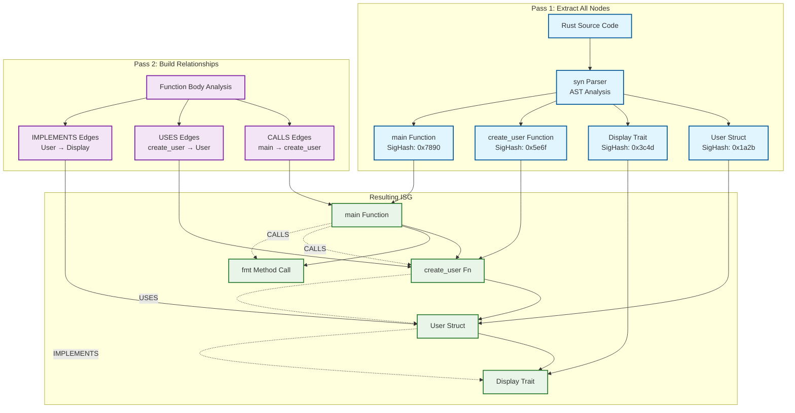
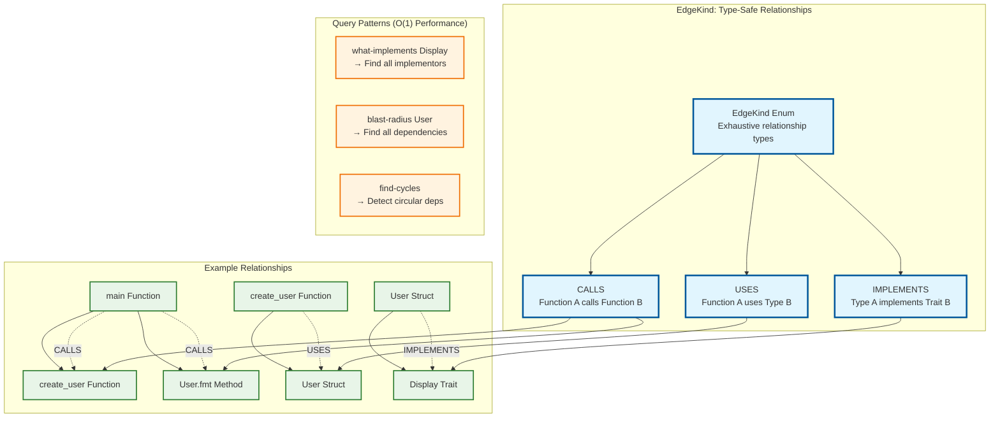
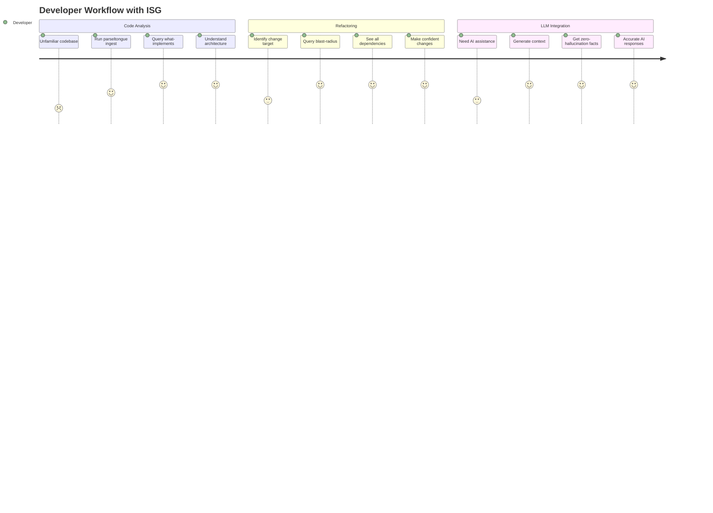

# Understanding the Interface Signature Graph (ISG)

## What is an ISG?

Following the **Complex Domain Model Support** principle from our [design guidelines](../.kiro/steering/design101-tdd-architecture-principles.md), the ISG handles real-world Rust complexity, not simplified examples.

```mermaid
graph TD
    %% Core concept
    subgraph "ISG: Interface Signature Graph"
        direction TB
        A[Code Architecture Map<br/>Deterministic & Fast]
        A --> B[What Exists<br/>Functions, Structs, Traits]
        A --> C[How They Connect<br/>Calls, Uses, Implements]
        A --> D[Where They Live<br/>Files, Modules, Lines]
    end
    
    %% Key benefits
    subgraph "Benefits Over Text Search"
        direction LR
        E[❌ grep/ripgrep<br/>Probabilistic results] --> F[✅ ISG Queries<br/>Deterministic facts]
        G[❌ Manual analysis<br/>Hours of work] --> H[✅ Sub-millisecond<br/>Instant answers]
        I[❌ LLM hallucination<br/>Unreliable context] --> J[✅ Zero hallucination<br/>Factual relationships]
    end
    
    %% Real-world complexity
    subgraph "Handles Real Rust Complexity"
        direction TB
        K[Generics & Lifetimes<br/>impl&lt;T: Clone&gt; Trait&lt;T&gt;]
        L[Macro Expansions<br/>derive, procedural]
        M[Module Hierarchies<br/>pub(crate), visibility]
        N[Trait Objects<br/>dyn Trait, Box&lt;dyn&gt;]
    end
    
    B --> K
    C --> L
    D --> M
    A --> N
    
    %% Styling
    classDef core fill:#e1f5fe,stroke:#01579b,stroke-width:3px
    classDef benefits fill:#e8f5e8,stroke:#2e7d32,stroke-width:2px
    classDef complexity fill:#fff3e0,stroke:#ef6c00,stroke-width:2px
    
    class A core
    class F,H,J benefits
    class K,L,M,N complexity
```

Think of the ISG as a **family tree for code** - but one that understands Rust's unique features like ownership, traits, and zero-cost abstractions.

## Real Example

Let's look at this simple Rust code:

```rust
// A struct representing a user
pub struct User {
    pub name: String,
    pub age: u32,
}

// A trait for displaying things
pub trait Display {
    fn fmt(&self) -> String;
}

// User implements Display
impl Display for User {
    fn fmt(&self) -> String {
        format!("{} (age {})", self.name, self.age)
    }
}

// A function that creates users
pub fn create_user(name: String, age: u32) -> User {
    User { name, age }
}

// Main function
fn main() {
    let user = create_user("Alice".to_string(), 30);
    println!("{}", user.fmt());
}
```

## How ISG Sees This Code

Following **Two-Pass Ingestion Architecture** from our [design principles](../.kiro/steering/design101-tdd-architecture-principles.md), the ISG processes code in two phases for accurate relationship extraction:



### NODES (The "Things")

The ISG creates **deterministic nodes** with **FxHasher** for cross-platform consistency:

```mermaid
graph TD
    %% Node types with memory-optimized storage
    subgraph "NodeData Structure"
        direction TB
        A[NodeData<br/>Memory-optimized with Arc&lt;str&gt;]
        A --> B[hash: SigHash<br/>Deterministic ID]
        A --> C[kind: NodeKind<br/>Function/Struct/Trait/Enum]
        A --> D[name: Arc&lt;str&gt;<br/>String interning]
        A --> E[signature: Arc&lt;str&gt;<br/>Full type signature]
        A --> F[file_path: Arc&lt;str&gt;<br/>Source location]
        A --> G[line: u32<br/>Line number]
    end
    
    %% Example nodes from our code
    subgraph "Example Nodes"
        direction LR
        H[User Struct<br/>hash: 0x1a2b<br/>name: "User"<br/>signature: "pub struct User"]
        I[Display Trait<br/>hash: 0x3c4d<br/>name: "Display"<br/>signature: "pub trait Display"]
        J[create_user Fn<br/>hash: 0x5e6f<br/>name: "create_user"<br/>signature: "pub fn create_user(...)"]
    end
    
    %% Node kinds
    subgraph "NodeKind Variants"
        direction TB
        K[Function<br/>Regular functions]
        L[Struct<br/>Data structures]
        M[Trait<br/>Behavior contracts]
        N[Enum<br/>Sum types]
        O[Impl<br/>Implementation blocks]
        P[Module<br/>Code organization]
    end
    
    C --> K
    C --> L
    C --> M
    C --> N
    C --> O
    C --> P
    
    %% Styling
    classDef nodeData fill:#e1f5fe,stroke:#01579b,stroke-width:3px
    classDef examples fill:#e8f5e8,stroke:#2e7d32,stroke-width:2px
    classDef kinds fill:#fff3e0,stroke:#ef6c00,stroke-width:2px
    
    class A,B,C,D,E,F,G nodeData
    class H,I,J examples
    class K,L,M,N,O,P kinds
```
```
1. main (Function)
   - Signature: fn main()
   - File: src/main.rs:1

2. User (Struct) 
   - Signature: struct User { name: String, age: u32 }
   - File: src/lib.rs:5

3. Display (Trait)
   - Signature: trait Display { fn fmt(&self) -> String; }
   - File: src/lib.rs:10

4. create_user (Function)
   - Signature: fn create_user(name: String, age: u32) -> User
   - File: src/lib.rs:15
```

### EDGES (The "Relationships")
```
User --Implements--> Display
  (User struct implements the Display trait)

main --Calls--> create_user  
  (main function calls create_user function)

create_user --Uses--> User
  (create_user function returns/uses User struct)
```

## Visual Representation

```
    main()
      |
      | Calls
      ↓
  create_user()
      |
      | Uses
      ↓
    User ---------> Display
         Implements
```

## What Can You Do With This?

### 1. **Find Implementors**
Question: "What implements the Display trait?"
Answer: "User struct"

### 2. **Blast Radius Analysis**
Question: "If I change the User struct, what else might break?"
Answer: "create_user function and anything that implements Display"

### 3. **Dependency Analysis**
Question: "What does the User struct depend on?"
Answer: "Display trait (because it implements it)"

### 4. **LLM Context Generation**
When you ask an AI about User, it gets:
- The User struct definition
- That it implements Display
- That create_user() returns it
- That main() uses it indirectly

## Why This Matters

Instead of searching through text files, you can:
- **Instantly find** all implementations of a trait
- **Understand impact** of changes before making them  
- **Navigate code** by following relationships
- **Generate perfect context** for AI tools (no hallucinations!)

## Performance

The ISG is super fast because it's all in memory:
- **Node operations**: ~6 microseconds
- **Simple queries**: <500 microseconds  
- **Complex queries**: <1 millisecond
- **File updates**: <12 milliseconds

## Try It Yourself

1. **See the sample**: `./target/debug/parseltongue debug --sample`
2. **Analyze real code**: `./target/debug/parseltongue ingest your_code.dump`
3. **Query relationships**: `./target/debug/parseltongue query what-implements Display`
4. **Generate context**: `./target/debug/parseltongue generate-context User --format json`

The ISG turns your code from a pile of text files into a **queryable knowledge graph**!
### EDGES
 (The "Relationships")

Following **Type Safety Through Design** principles, relationships are encoded as strongly-typed edges:



## Performance Architecture

The ISG implements **O(1) Performance Guarantees** through indexed data structures:

```mermaid
graph TD
    %% Core performance architecture
    subgraph "Arc&lt;RwLock&lt;ISGState&gt;&gt;"
        direction TB
        A[ISGState<br/>Thread-safe graph storage]
        A --> B[graph: StableDiGraph<br/>Efficient graph operations]
        A --> C[id_map: FxHashMap<br/>SigHash → NodeIndex]
        A --> D[name_map: FxHashMap<br/>String → Set&lt;SigHash&gt;]
        A --> E[file_index: FxHashMap<br/>File → Set&lt;SigHash&gt;]
    end
    
    %% Performance contracts
    subgraph "Performance Contracts (Test-Validated)"
        direction LR
        F[Node Operations<br/>&lt; 50μs] --> G[Simple Queries<br/>&lt; 1ms]
        G --> H[File Updates<br/>&lt; 12ms]
        H --> I[Memory Usage<br/>&lt; 25MB @ 100K LOC]
    end
    
    %% Query optimization
    subgraph "Query Optimization"
        direction TB
        J[O(1) Node Lookup<br/>id_map[hash]]
        K[O(1) Name Search<br/>name_map[name]]
        L[O(1) File Removal<br/>file_index[path]]
        M[Bounded BFS<br/>Early termination]
    end
    
    %% Connect performance to implementation
    C --> J
    D --> K
    E --> L
    B --> M
    
    %% Test validation
    J --> F
    K --> G
    L --> H
    M --> I
    
    %% Styling
    classDef storage fill:#e1f5fe,stroke:#01579b,stroke-width:3px
    classDef contracts fill:#fce4ec,stroke:#c2185b,stroke-width:2px
    classDef optimization fill:#e8f5e8,stroke:#2e7d32,stroke-width:2px
    
    class A,B,C,D,E storage
    class F,G,H,I contracts
    class J,K,L,M optimization
```

## Real-World Usage Patterns



The ISG transforms code analysis from **probabilistic text searches** to **deterministic graph queries**, enabling confident refactoring and reliable LLM context generation.