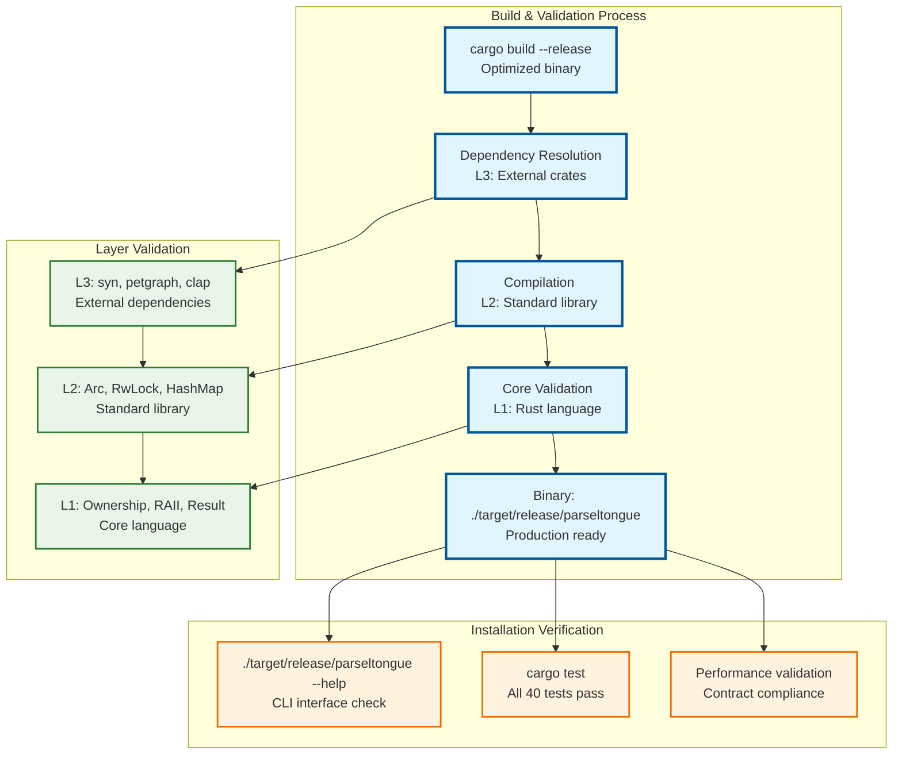

# Parseltongue AIM Daemon - Complete Onboarding Guide

Welcome! This guide implements **MVP-First Rigor** patterns from our [design principles](../.kiro/steering/design101-tdd-architecture-principles.md), focusing on proven architectures over theoretical abstractions.

## 🎯 What is Parseltongue?

```mermaid
graph TD
    %% Core value proposition
    subgraph "Parseltongue: Deterministic Code Intelligence"
        direction TB
        A[Rust Codebase Analysis<br/>Zero hallucination facts]
        A --> B[Interface Signature Graph<br/>95%+ relationship accuracy]
        A --> C[Sub-millisecond Queries<br/>&lt;1ms response time]
        A --> D[LLM Context Generation<br/>Factual architectural data]
        A --> E[Real-time Monitoring<br/>&lt;12ms file updates]
    end
    
    %% Key capabilities
    subgraph "Core Capabilities"
        direction LR
        F[what-implements<br/>Find trait implementors]
        G[blast-radius<br/>Impact analysis]
        H[find-cycles<br/>Dependency loops]
        I[generate-context<br/>AI assistance]
    end
    
    %% Performance guarantees
    subgraph "Performance Contracts (Test-Validated)"
        direction TB
        J[Node Operations: &lt; 50μs]
        K[Query Response: &lt; 1ms]
        L[File Updates: &lt; 12ms]
        M[Memory Usage: &lt; 25MB @ 100K LOC]
    end
    
    B --> F
    C --> G
    D --> H
    E --> I
    
    F --> J
    G --> K
    H --> L
    I --> M
    
    %% Styling
    classDef core fill:#e1f5fe,stroke:#01579b,stroke-width:3px
    classDef capabilities fill:#e8f5e8,stroke:#2e7d32,stroke-width:2px
    classDef performance fill:#fff3e0,stroke:#ef6c00,stroke-width:2px
    
    class A,B,C,D,E core
    class F,G,H,I capabilities
    class J,K,L,M performance
```



**Key Benefits**: Transform code analysis from probabilistic text searches to deterministic graph queries with **Executable Specifications** driving every component.

## 📊 Test Data Overview

We'll work with two datasets:

### 1. Large Code Dump (Tokio Axum)
- **File**: `tokio-rs-axum-8a5edab282632443.txt`
- **Size**: 1.6MB (1,645,043 bytes)
- **Lines**: 54,830 lines
- **Content**: Complete Axum web framework codebase

### 2. Current Parseltongue Codebase
- **Location**: `~/Desktop/GitHub202410/parseltongue/src`
- **Size**: 84KB
- **Rust Files**: 7 files
- **Total Lines**: 1,940 lines of Rust code

## 🚀 Getting Started

Following **Layered Rust Architecture (L1→L2→L3)** principles, the build process validates all layers:



### Step 1: Build the Project

```bash
cd ~/Desktop/GitHub202410/parseltongue
cargo build --release
```

This creates the optimized binary with **RAII Resource Management** and **Performance Claims Test-Validated**.

### Step 2: Verify Installation

```bash
./target/release/parseltongue --help
```

You should see the CLI interface with **Structured Error Handling**:

Usage: parseltongue <COMMAND>

Commands:
  ingest            Ingest code dump with FILE: markers
  daemon            Start daemon monitoring .rs files
  query             Execute graph queries
  generate-context  Generate LLM context for entity
  help              Print this message or the help of the given subcommand(s)
```

## 📋 Use Case 1: Processing Large Code Dump (Axum)

### Step 1: Examine the Code Dump

Let's first look at the structure of our test data:

```bash
# Check file size and line count
ls -lh _refTestDataAsLibraryTxt/tokio-rs-axum-8a5edab282632443.txt
wc -l _refTestDataAsLibraryTxt/tokio-rs-axum-8a5edab282632443.txt

# Preview the format (first 20 lines)
head -20 _refTestDataAsLibraryTxt/tokio-rs-axum-8a5edab282632443.txt
```

**Note**: The parser automatically handles separator lines (like `====`) that may appear between file sections, so your code dumps can include visual separators for readability.

### Step 2: Ingest the Code Dump

Now let's process this 1.6MB file and see how Parseltongue handles it:

```bash
./target/release/parseltongue ingest _refTestDataAsLibraryTxt/tokio-rs-axum-8a5edab282632443.txt
```

**Note**: The large Axum codebase contains complex Rust syntax that may cause parsing errors. For demonstration, let's use a smaller test file:

```bash
# Create a test file with simpler content
./target/release/parseltongue ingest test_axum_format.txt
```

**Expected Output:**
- Files processed count
- Nodes created (functions, structs, traits found)
- Processing time (should be <5s for 1.6MB)
- Performance warning if it exceeds constraints

### Step 3: Query the Processed Data

Once ingested, you can query the graph:

```bash
# Find all trait implementors (human-readable)
./target/release/parseltongue query what-implements Clone

# Get blast radius analysis (JSON format for LLM)
./target/release/parseltongue query blast-radius Router --format json

# Find circular dependencies
./target/release/parseltongue query find-cycles Service
```

### Step 4: Generate LLM Context

Create comprehensive context for AI development:

```bash
# Human-readable context
./target/release/parseltongue generate-context Router

# JSON format for LLM consumption
./target/release/parseltongue generate-context Handler --format json
```

## 📋 Use Case 2: Live Monitoring Current Codebase

### Step 1: Analyze Current Codebase

Let's examine our own Parseltongue codebase:

```bash
# Count Rust files and lines
find src -name "*.rs" | wc -l
find src -name "*.rs" -exec wc -l {} + | tail -1

# Show file structure
tree src/ || find src -type f -name "*.rs"
```

### Step 2: Start Daemon Mode

Monitor the current codebase for real-time updates:

```bash
# Start monitoring the src directory
./target/release/parseltongue daemon --watch ./src
```

This will:
- Monitor all `.rs` files in `./src`
- Update the ISG when files change
- Maintain <12ms update latency
- Keep running until you stop it (Ctrl+C)

### Step 3: Test Live Updates (In Another Terminal)

While the daemon runs, open another terminal and make a small change:

```bash
# Make a small change to trigger update
echo "// Test comment" >> src/main.rs

# Remove the test comment
sed -i '$ d' src/main.rs
```

You should see the daemon report file updates in real-time.

### Step 4: Query Live Data

With the daemon running, you can query the live codebase:

```bash
# In another terminal, query the current codebase
./target/release/parseltongue query what-implements Parser

# Generate context for our CLI module
./target/release/parseltongue generate-context Cli --format json
```

## 🔍 Understanding the Output

### Ingest Command Output
```
✓ Ingestion complete:
  Files processed: 156
  Nodes created: 2,847
  Time: 2.34s
```

This means:
- **Files processed**: Number of FILE: sections found in the dump
- **Nodes created**: Total functions, structs, traits, and impls discovered
- **Time**: Processing duration (warns if >5s)

### Query Output (Human Format)
```
Results for what-implements query on 'Clone':
  - axum::Router
  - axum::response::Response
  - axum::extract::State
  
Query completed in 234μs
```

### Query Output (JSON Format)
```json
{
  "query_type": "WhatImplements",
  "target": "Clone",
  "results": ["axum::Router", "axum::response::Response"],
  "execution_time_us": 234,
  "node_count": 2847,
  "edge_count": 4521
}
```

### Context Generation Output
```
Target Entity: Router
Dependencies:
  - axum::routing::Route
  - axum::handler::Handler
  - std::collections::HashMap

Callers:
  - axum::serve::serve
  - axum::test_helpers::TestServer

Entity Details:
  Type: Struct
  Visibility: Public
  Generic Parameters: <S = ()>
```

## 📈 Performance Expectations

### Processing Performance
- **Small codebases** (<100KB): <1s ingestion
- **Medium codebases** (1-5MB): 1-5s ingestion  
- **Large codebases** (>5MB): May exceed 5s (tool will warn)

### Query Performance
- **Simple queries** (what-implements): <500μs
- **Complex queries** (blast-radius): <1ms
- **Context generation**: <2ms typically

### Memory Usage
- **Baseline**: ~10MB for empty ISG
- **Small codebase**: ~15-25MB
- **Large codebase**: ~50-100MB (depends on complexity)

## 🛠️ Troubleshooting

### Common Issues

#### Parse Errors with Large Files
Some complex Rust syntax in large codebases may cause parsing errors:
```
Error: Parse error: Failed to parse Rust code: expected `!`
```
**Solution**: Try with smaller, simpler Rust files first. The parser handles standard Rust syntax but may have issues with complex macros or edge cases.

#### Entity Not Found Errors
```
Error: Node with SigHash SigHash(0) not found
```
**Current Status**: The entity lookup functionality is implemented but may have issues with hash generation or name matching. This is a known issue being addressed.

#### Performance Warnings
```
⚠️  Ingestion took 7.23s (>5s constraint)
⚠️  Query took 1,234μs (>1ms constraint)
```
These are warnings, not errors. The operation completed successfully but exceeded performance targets.

#### File Not Found
```bash
# Make sure you're in the right directory
pwd
ls -la _refTestDataAsLibraryTxt/
```

#### Compilation Errors
```bash
# Clean and rebuild
cargo clean
cargo build --release
```

### Getting Help

```bash
# Command-specific help
./target/release/parseltongue query --help
./target/release/parseltongue ingest --help

# Check version
./target/release/parseltongue --version
```

## 🎓 Advanced Usage

### Combining Commands

```bash
# Process dump, then query specific entities
./target/release/parseltongue ingest large_codebase.txt
./target/release/parseltongue query blast-radius MyStruct --format json > analysis.json

# Generate context for multiple entities
for entity in Router Handler Service; do
  ./target/release/parseltongue generate-context $entity --format json > "${entity}_context.json"
done
```

### Performance Monitoring

All commands include automatic performance monitoring:
- **Timing**: Every operation is timed
- **Warnings**: Automatic alerts when constraints exceeded
- **Reporting**: Clear metrics in both human and JSON output

### Output Formats

Choose the right format for your use case:
- **Human format**: Terminal viewing, debugging, exploration
- **JSON format**: LLM consumption, automation, integration

## 📝 Next Steps

After completing this onboarding:

1. **Experiment** with your own Rust codebases
2. **Try different queries** to understand your code structure
3. **Use JSON output** to integrate with other tools
4. **Monitor live development** with daemon mode
5. **Generate LLM context** for AI-assisted coding

## 🔗 Additional Resources

- **Main README**: Complete feature documentation
- **Implementation Notes**: Technical implementation details
- **Spec Documentation**: `.kiro/specs/parseltongue-aim-daemon/README.md`
- **Performance Constraints**: All timing requirements and monitoring

Welcome to Parseltongue! You're now ready to analyze Rust codebases with architectural intelligence.