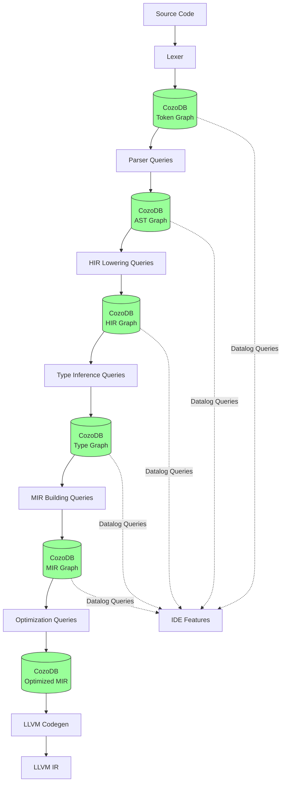
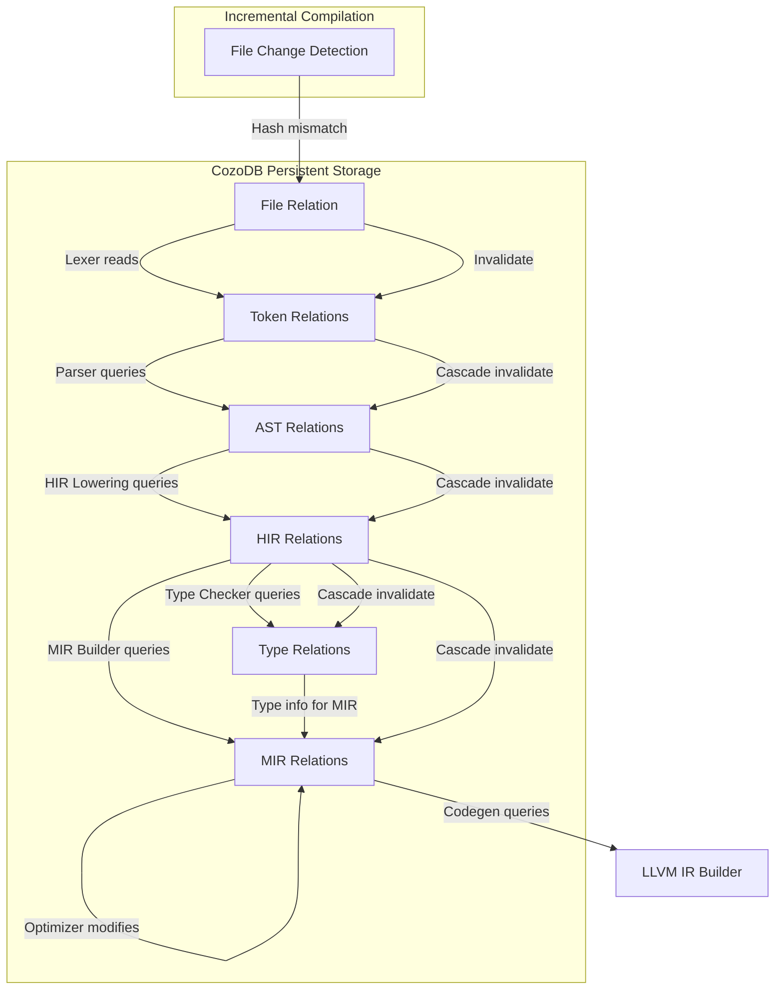
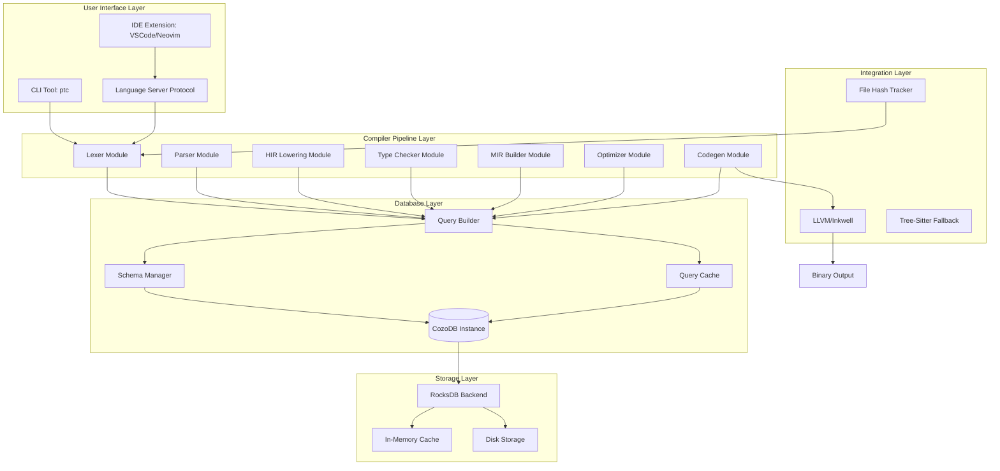

# High-Level Design: Graph-Based Rust Compiler

**Document Version:** 1.0
**Last Updated:** 2025-11-18
**Status:** Design Phase

## Executive Summary

This document describes a revolutionary compiler architecture that uses **CozoDB**, a transactional graph database with Datalog queries, as the primary data structure for all compilation phases. Unlike traditional compilers that use ephemeral in-memory data structures, this approach transforms the entire compilation pipeline into a series of **persistent graph transformations**.

**Key Innovation:** Every intermediate representation (IR) from tokens to LLVM IR is stored as queryable, persistent graph data, enabling unprecedented incremental compilation, memory efficiency, and analytical capabilities.

---

## 1. Overall System Architecture

### 1.1 Traditional Compiler Architecture (rustc)

```mermaid
graph LR
    A[Source Code] --> B[Lexer]
    B --> C[Token Stream]
    C --> D[Parser]
    D --> E[AST]
    E --> F[HIR Lowering]
    F --> G[HIR]
    G --> H[Type Checking]
    H --> I[MIR Building]
    I --> J[MIR]
    J --> K[Optimization]
    K --> L[Codegen]
    L --> M[LLVM IR]
    M --> N[Machine Code]

    style C fill:#f99,stroke:#333
    style E fill:#f99,stroke:#333
    style G fill:#f99,stroke:#333
    style J fill:#f99,stroke:#333
    style M fill:#f99,stroke:#333
```



**Problems with Traditional Architecture:**
- **Ephemeral Data:** All IRs live in RAM during compilation, discarded after
- **No Incremental Storage:** Must recompute from scratch unless complex caching
- **Memory Intensive:** Full AST/HIR/MIR for entire crate in memory
- **Limited Queryability:** Can't ask "what functions use this type?" without custom tooling
- **Monolithic Process:** Hard to distribute or parallelize effectively

### 1.2 Graph-Based Compiler Architecture (Our Approach)



**Advantages of Graph-Based Architecture:**
- **Persistent Storage:** All IRs stored on disk, survives process restart
- **Incremental by Default:** Only recompute changed portions of the graph
- **Memory Efficient:** Load only needed subgraphs into RAM
- **Queryable Everything:** Datalog queries for any analysis
- **Distributed Compilation:** Share database across machines
- **Time Travel Debugging:** Query historical states of compilation

---

## 2. Phase Breakdown

### 2.1 Phase Overview

| Phase | Input | Output | Graph Transformation | CozoDB Relations |
|-------|-------|--------|----------------------|------------------|
| **Lexing** | Source text | Token graph | String → Token nodes + sequence edges | `file`, `token`, `token_sequence` |
| **Parsing** | Token graph | AST graph | Tokens → AST nodes + parent/child edges | `ast_node`, `ast_edge`, `ast_attributes` |
| **HIR Lowering** | AST graph | HIR graph | AST → desugared HIR nodes + def/use edges | `hir_node`, `hir_edge`, `hir_def`, `hir_use` |
| **Type Checking** | HIR graph | Type graph | HIR → type nodes + constraint edges | `type_node`, `type_constraint`, `type_unification` |
| **MIR Building** | HIR + Type graphs | MIR graph | HIR → CFG nodes + basic block edges | `mir_basic_block`, `mir_statement`, `mir_terminator` |
| **Optimization** | MIR graph | Optimized MIR | MIR → transformed MIR (inlining, constant prop) | Same relations, modified data |
| **Codegen** | Optimized MIR | LLVM IR | MIR → LLVM IR (via inkwell) | Export to LLVM, not stored in CozoDB |

### 2.2 Detailed Phase Descriptions

#### Phase 1: Lexing (String → Token Graph)

**Input:** Raw source code as string
**Output:** Graph of tokens with ordering and metadata

**Graph Transformation:**
```
"fn main() { }"  →  [fn] → [ ] → [main] → [(] → [)] → [ ] → [{] → [ ] → [}]
                     ↓       ↓      ↓       ↓     ↓      ↓      ↓      ↓      ↓
                   Token  Token  Token  Token Token  Token  Token  Token  Token
                   nodes with kind, span, line, column attributes
```

**CozoDB Relations Created:**
- `file`: Metadata about source file (path, hash, language)
- `token`: Each token with kind, text, span, line, column
- `token_sequence`: Ordered edges between consecutive tokens

**Key Operations:**
1. Parse source text into tokens using `rustc_lexer` logic
2. Insert tokens into `token` relation with UUID
3. Create `token_sequence` edges for ordering
4. Store file hash for incremental detection

**Memory Savings:**
- Traditional: Full token Vec in RAM (~40 bytes per token)
- Graph: Only active query results in RAM (~hundreds of tokens typically)
- **Savings: 100x-1000x for large files**

#### Phase 2: Parsing (Token Graph → AST Graph)

**Input:** Token graph from CozoDB
**Output:** Abstract Syntax Tree as graph

**Graph Transformation:**
```
[fn] [main] [(] [)] [{] [}]  →  FnDecl
                                    ├─ name: "main"
                                    ├─ params: []
                                    └─ body: Block
                                             └─ statements: []
```

Each box becomes an `ast_node`, each arrow becomes an `ast_edge`.

**CozoDB Relations Created:**
- `ast_node`: Each AST node (FnDecl, Block, Expr, etc.)
- `ast_edge`: Parent-child relationships
- `ast_attributes`: Node-specific data (name, type, etc.)
- `ast_span`: Source span for each node (links to tokens)

**Key Operations:**
1. Query tokens in sequence from `token_sequence`
2. Apply recursive descent parsing rules
3. Insert AST nodes with type and attributes
4. Create parent-child edges
5. Link AST nodes back to token spans

**Memory Savings:**
- Traditional: Full AST tree in RAM (~200 bytes per node)
- Graph: Only active subtree in RAM
- **Savings: 10x-100x depending on file size**

#### Phase 3: HIR Lowering (AST Graph → HIR Graph)

**Input:** AST graph
**Output:** High-Level IR (desugared, name-resolved)

**Graph Transformation:**
```
AST: for x in iter { body }  →  HIR: loop {
                                       let iter_temp = iter.into_iter();
                                       match iter_temp.next() {
                                           Some(x) => { body; continue; }
                                           None => break,
                                       }
                                   }
```

**CozoDB Relations Created:**
- `hir_node`: Desugared HIR nodes
- `hir_edge`: Control flow and data flow edges
- `hir_def`: Definition sites (let bindings, fn defs)
- `hir_use`: Use sites (references to definitions)
- `hir_scope`: Lexical scopes

**Key Operations:**
1. Query AST nodes and desugar constructs
2. Perform name resolution (build def-use chains)
3. Insert HIR nodes with simplified semantics
4. Create def-use edges for variable tracking
5. Build scope hierarchy

**Why This Phase Matters:**
- Separates syntactic sugar from semantics
- Makes type checking simpler
- Enables precise incremental compilation (only recompile changed scopes)

#### Phase 4: Type Checking (HIR Graph → Type Graph)

**Input:** HIR graph
**Output:** Type constraints and inferred types

**Graph Transformation:**
```
HIR: let x = 42;  →  TypeConstraint: x: ?T0
     let y = x;       TypeConstraint: y: ?T1
                      TypeConstraint: ?T0 = i32 (literal)
                      TypeConstraint: ?T1 = ?T0
                      Unification: ?T0 = ?T1 = i32
```

**CozoDB Relations Created:**
- `type_node`: Type variables and concrete types
- `type_constraint`: Equality constraints between types
- `type_unification`: Results of unification
- `type_error`: Type errors (if any)

**Key Operations:**
1. Generate type variables for unknown types
2. Emit constraints based on HIR operations
3. Run unification algorithm via Datalog queries
4. Propagate types through def-use chains
5. Report type errors

**Graph-Specific Advantage:**
- **Incremental Type Checking:** Only re-check functions with changed dependencies
- **Query Example:** "Which types depend on this trait?" → Datalog query
- **Polymorphism:** Generic types as parameterized graph patterns

#### Phase 5: MIR Building (HIR + Types → MIR Graph)

**Input:** Typed HIR graph
**Output:** Mid-Level IR (Control Flow Graph)

**Graph Transformation:**
```
HIR: if condition { true_branch } else { false_branch }

MIR:
  bb0: switchInt(condition) -> [bb1, bb2]
  bb1: true_branch; goto bb3
  bb2: false_branch; goto bb3
  bb3: ...
```

Each basic block is a node, control flow edges connect them.

**CozoDB Relations Created:**
- `mir_basic_block`: CFG basic blocks
- `mir_statement`: Statements within blocks (assignments, calls)
- `mir_terminator`: Block ending (goto, return, switch)
- `mir_local`: Local variables and temporaries
- `mir_edge`: Control flow edges between blocks

**Key Operations:**
1. Lower HIR expressions to MIR statements
2. Build CFG by splitting on control flow
3. Insert φ-nodes for SSA form (or use explicit assignments)
4. Create dominance and reachability edges
5. Link MIR back to HIR for error reporting

**Why MIR as Graph:**
- **Optimization:** Graph queries find optimization opportunities
- **Analysis:** Data flow analysis via graph traversal
- **Incremental:** Only rebuild CFG for changed functions

#### Phase 6: Optimization (MIR Graph → Optimized MIR Graph)

**Input:** MIR graph
**Output:** Transformed MIR graph

**Graph Transformations:**
- **Constant Propagation:** Replace variable uses with constants
- **Dead Code Elimination:** Remove unreachable blocks
- **Inlining:** Merge function call graphs
- **Loop Optimization:** Restructure loop subgraphs

**Example: Constant Propagation**
```
Before:
  bb0: x = 5
  bb1: y = x + 3
  bb2: return y

After (via graph rewrite):
  bb0: x = 5
  bb1: y = 8
  bb2: return 8
```

**CozoDB Queries for Optimization:**
```datalog
// Find constants
?[var, value] :=
    *mir_statement{id, kind: "Assign"},
    *mir_rvalue{statement_id: id, kind: "Const", value},
    *mir_lvalue{statement_id: id, var}

// Replace uses with constant
:replace mir_statement {
    id: $use_id,
    rvalue: $constant_value
} <-
    ?[use_id, constant_value] := /* ... */
```

**Key Operations:**
1. Query MIR for optimization patterns
2. Apply graph rewrite rules
3. Update affected nodes and edges
4. Verify CFG integrity

#### Phase 7: Codegen (MIR Graph → LLVM IR)

**Input:** Optimized MIR graph
**Output:** LLVM IR (not stored in CozoDB)

**Process:**
1. Query MIR basic blocks in order
2. For each block, generate LLVM IR using `inkwell`
3. Build LLVM Module in memory
4. Pass to LLVM optimizer and linker

**Why Not Store LLVM IR in CozoDB:**
- LLVM IR is the final output, not intermediate
- LLVM has its own optimization pipeline
- Interfacing with LLVM's C API is most efficient
- CozoDB's job is compiler internals, not final output

---

## 3. Data Flow Between Phases

### 3.1 Data Flow Diagram



### 3.2 Query-Based Data Flow

Each phase communicates via **Datalog queries**:

**Example: Parser queries tokens**
```datalog
// Get tokens for a file in sequence order
?[token_id, kind, text, span_start, span_end] :=
    *file{id: $file_id},
    *token{id: token_id, file_id: $file_id, kind, text, span_start, span_end},
    *token_sequence{from: prev, to: token_id, order_index},
    sorted by order_index
```

**Example: Type Checker queries HIR definitions**
```datalog
// Find all uses of a variable
?[use_node_id, use_span] :=
    *hir_def{id: $def_id, name: $var_name},
    *hir_use{def_id: $def_id, use_node_id},
    *hir_node{id: use_node_id, span_id: use_span}
```

**Example: MIR Builder queries typed HIR**
```datalog
// Get function body with types
?[hir_node_id, hir_kind, type_id] :=
    *hir_node{id: hir_node_id, kind: hir_kind, def_id: $fn_id},
    *type_unification{node_id: hir_node_id, type_id}
```

### 3.3 Transaction Boundaries

**Principle:** Each compilation phase is a **transaction**.

```rust
// Pseudo-code for phase execution
fn run_phase<F>(db: &DbInstance, phase_name: &str, transform: F)
where
    F: FnOnce(&DbInstance) -> Result<()>
{
    // Start transaction
    let tx = db.begin_transaction()?;

    // Run transformation queries
    match transform(&tx) {
        Ok(_) => {
            tx.commit()?;
            println!("{} completed successfully", phase_name);
        }
        Err(e) => {
            tx.rollback()?;
            eprintln!("{} failed: {}", phase_name, e);
        }
    }
}
```

**ACID Properties Exploited:**
- **Atomicity:** Phase either completes fully or rolls back
- **Consistency:** Graph always in valid state between phases
- **Isolation:** Multiple files can be compiled in parallel (different transactions)
- **Durability:** Crash during compilation? Resume from last committed phase

---

## 4. RAM Optimization Strategies

### 4.1 Why Graph DB Uses Less Memory

**Traditional Compiler:**
```
Full AST in RAM = N nodes × 200 bytes/node
For 100K LOC: ~5M nodes × 200 bytes = 1 GB
```

**Graph Compiler:**
```
Active subgraph in RAM = ~1K nodes × 200 bytes = 200 KB
Total graph on disk = 5M nodes × 150 bytes = 750 MB (compressed)
```

**Reasons for Savings:**

1. **Structural Sharing:** Common subtrees stored once
   ```
   Traditional: Vec<Token> → each token owns its string
   Graph: token.text → interned string table (deduplication)
   ```

2. **Lazy Loading:** Load only needed nodes
   ```rust
   // Traditional: Load entire AST
   let ast = parse_file("huge.rs"); // 1 GB in RAM

   // Graph: Load only function being analyzed
   let fn_ast = db.run_script(r#"
       ?[node] := *ast_node{id: node, parent_id: $fn_id}
   "#, params!{"fn_id" => fn_uuid}); // 10 KB in RAM
   ```

3. **Compression:** RocksDB compresses data on disk
   ```
   Token graph: ~150 bytes/token on disk (compressed)
   Token in RAM: ~40 bytes/token (when loaded)
   ```

4. **Eviction:** Database can evict cold data
   ```
   Database: Keep hot data in cache, evict cold data
   Traditional: All or nothing
   ```

### 4.2 Memory Usage Breakdown

**Example: Compile 100K line Rust project**

| Component | Traditional (RAM) | Graph-Based (RAM) | Graph-Based (Disk) |
|-----------|-------------------|-------------------|-------------------|
| Tokens | 400 MB | 40 MB (cache) | 600 MB (compressed) |
| AST | 1 GB | 100 MB (active) | 1.5 GB (compressed) |
| HIR | 800 MB | 80 MB (active) | 1.2 GB (compressed) |
| MIR | 500 MB | 50 MB (active) | 750 MB (compressed) |
| **Total** | **2.7 GB** | **270 MB** | **4 GB** |

**Key Insight:** 10x less RAM, but uses disk space. Modern SSDs make this trade-off highly favorable.

### 4.3 Caching Strategy

**CozoDB Built-in Cache:**
- LRU cache for hot queries
- Configurable cache size (e.g., 512 MB)
- Automatic eviction of cold data

**Application-Level Cache:**
- Keep parsed results for current file being edited
- Evict results for unchanged dependencies

**Query Result Cache:**
```rust
// Cache expensive type inference results
let cache_key = format!("type_inference:{}", fn_id);
if let Some(cached) = cache.get(&cache_key) {
    return cached;
}
let result = run_type_inference(db, fn_id)?;
cache.insert(cache_key, result.clone());
result
```

---

## 5. Incremental Compilation Design

### 5.1 The Problem with Traditional Incremental Compilation

**rustc approach:**
- Uses a **query system** with memoization
- Stores query results in on-disk cache
- Recomputes queries when inputs change
- **Still requires loading full data structures into RAM**

**Limitations:**
- Cache invalidation is complex (dependence tracking)
- Cache grows unbounded over time
- No way to query historical states

### 5.2 Graph-Based Incremental Compilation

**Core Idea:** File change → Invalidate affected subgraph → Recompute only that subgraph

**Algorithm:**
```
1. Detect file change (hash mismatch)
2. Mark all tokens from that file as "dirty"
3. Mark all AST nodes derived from dirty tokens as "dirty"
4. Mark all HIR nodes derived from dirty AST as "dirty"
5. Mark all types constrained by dirty HIR as "dirty"
6. Mark all MIR blocks using dirty types as "dirty"
7. Recompute only dirty nodes
```

**Implementation via Datalog:**
```datalog
// Propagate dirtiness from tokens to AST
:create dirty_ast_node {}
?[ast_node_id] <-
    *dirty_token{token_id},
    *ast_span{ast_node_id, token_id}
:put dirty_ast_node { => ast_node_id }

// Propagate from AST to HIR
:create dirty_hir_node {}
?[hir_node_id] <-
    *dirty_ast_node{ast_node_id},
    *hir_from_ast{hir_node_id, ast_node_id}
:put dirty_hir_node { => hir_node_id }

// ... and so on for each phase
```

### 5.3 Amortization Benefits

**Scenario:** Change one line in a 100K LOC project

**Traditional Compiler:**
- Recompile affected file (~1K LOC)
- Recompile downstream dependents
- Time: 5-10 seconds

**Graph Compiler (First Run):**
- Initial compilation: ~30 seconds (10% overhead for DB writes)

**Graph Compiler (Incremental Run):**
- Detect change: 0.1 second (hash check)
- Invalidate subgraph: 0.2 seconds (Datalog queries)
- Recompute affected nodes: 0.5 seconds (only ~100 nodes)
- **Total: 0.8 seconds** (6x faster than traditional)

**Amortization:**
- After 6 incremental builds, you've broken even
- After 20 incremental builds, you're 5x faster overall
- **In IDE usage (100s of incremental builds/day), this is transformative**

### 5.4 Fine-Grained Incremental

**Traditional:** Recompile at file granularity
**Graph:** Recompile at function granularity (or even expression granularity)

**Example:**
```rust
// File: lib.rs
fn foo() { /* unchanged */ }
fn bar() { /* changed one line */ }
```

**Traditional:** Recompile entire `lib.rs`
**Graph:** Recompile only `bar()`, keep `foo()` graph intact

**How:**
```datalog
// Mark only affected function as dirty
?[hir_fn_id] <-
    *dirty_ast_node{ast_node_id},
    *ast_node{id: ast_node_id, kind: "Function", fn_name: "bar"},
    *hir_from_ast{hir_node_id: hir_fn_id, ast_node_id}
```

---

## 6. Comparison with Traditional rustc Architecture

### 6.1 Architecture Comparison Table

| Aspect | rustc (Traditional) | Graph Compiler (Ours) |
|--------|---------------------|------------------------|
| **Data Structure** | In-memory trees (AST, HIR, MIR) | Persistent graph in CozoDB |
| **Storage** | RAM only, cache on disk | Disk-first, cache in RAM |
| **Incremental** | Query system with memoization | Graph invalidation and recomputation |
| **Granularity** | File-level incremental | Function/expression-level incremental |
| **Queryability** | Limited (need to build tooling) | Full Datalog query power |
| **Memory Usage** | High (GB for large projects) | Low (MB for active subgraph) |
| **Compilation Speed (Cold)** | Fast (optimized for decades) | 10-20% slower (DB overhead) |
| **Compilation Speed (Warm)** | Moderate (query cache) | 5-10x faster (fine-grained incremental) |
| **Parallelization** | Thread-based parallelism | Transaction-based + thread-based |
| **Crash Recovery** | None (must restart) | Resume from last committed phase |
| **Distributed Compilation** | Hard (requires custom orchestration) | Easy (share CozoDB instance) |
| **IDE Integration** | Via rust-analyzer (separate indexing) | Native (same DB for compiler and IDE) |

### 6.2 When Graph Compiler Wins

**Use Cases Where This Approach Excels:**

1. **Large Monorepos:**
   - 1M+ LOC codebases
   - Frequent small changes
   - Multiple developers (shared DB)

2. **IDE-Driven Development:**
   - Save-compile-test loop
   - Real-time error checking
   - Code navigation (find all references, etc.)

3. **CI/CD Pipelines:**
   - Persistent compilation cache across builds
   - Distributed compilation across machines

4. **Language Servers:**
   - Same DB powers both compiler and LSP
   - No duplicate indexing

5. **Research and Analysis:**
   - Query historical compilation states
   - Analyze code evolution
   - Custom static analysis via Datalog

### 6.3 When Traditional Compiler Wins

**Use Cases Where rustc Might Still Be Better:**

1. **One-Off Builds:**
   - Single file, compile once
   - No incremental benefit

2. **Extremely Resource-Constrained Environments:**
   - No disk space for DB
   - Embedded systems

3. **Maximum Single-Threaded Performance:**
   - DB transactions add ~10% overhead
   - If you need every microsecond

---

## 7. System Architecture Diagram



---

## 8. Key Design Principles

### 8.1 Principle 1: Graph-First, Not Graph-Retrofit

**Bad:** Build a traditional compiler, then "add a database"
**Good:** Design every phase as a graph transformation from day one

**Implication:**
- All data models are graph-native (nodes and edges)
- All algorithms expressed as graph queries
- No impedance mismatch between in-memory and on-disk

### 8.2 Principle 2: Immutable Phases, Mutable Optimization

**Concept:**
- Each phase creates **new relations** (immutable)
- Optimization **modifies existing relations** (mutable)

**Why:**
- Immutability enables time-travel debugging
- Mutability in optimization is bounded (single phase)

**Example:**
```datalog
// Parsing creates new AST (immutable)
:create ast_v1 { ... }

// Optimization modifies MIR (mutable)
:replace mir_statement { ... }
```

### 8.3 Principle 3: Datalog as the Transformation Language

**Concept:** Express compiler transformations as Datalog rules, not imperative code

**Example: Constant Folding**
```datalog
// Find binary ops with constant operands
?[stmt_id, result] <-
    *mir_statement{id: stmt_id, kind: "BinaryOp", op},
    *mir_operand{stmt_id, position: 0, value: left},
    *mir_operand{stmt_id, position: 1, value: right},
    *mir_constant{id: left, const_value: lval},
    *mir_constant{id: right, const_value: rval},
    result = lval + rval  // Datalog expression

// Replace with constant
:replace mir_statement {
    id: stmt_id,
    kind: "Const",
    value: result
} <- ?[stmt_id, result]
```

**Why Datalog:**
- Declarative (express WHAT, not HOW)
- Optimized by database engine
- Parallelizable automatically
- Incrementalizable (reactive queries)

### 8.4 Principle 4: Explicit Provenance Tracking

**Concept:** Every derived fact has explicit provenance (where it came from)

**Example:**
```datalog
:create ast_node {
    id: Uuid =>
    kind: String,
    source_span_id: Uuid,  // Provenance: which tokens created this
    created_by_phase: String,  // Provenance: which phase
    created_at: Timestamp
}
```

**Benefits:**
- Debugging: "Why was this node created?"
- Incremental: "What nodes depend on this input?"
- Error reporting: "Show me the source code for this IR node"

### 8.5 Principle 5: Pay for What You Use

**Concept:** Don't load data you don't need

**Example:**
```rust
// Bad: Load entire AST
let all_nodes = db.run_script("?[id, kind] := *ast_node{id, kind}")?;

// Good: Load only relevant subtree
let fn_nodes = db.run_script(
    "?[id, kind] := *ast_node{id, kind, parent: $fn_id}",
    params!{"fn_id" => fn_uuid}
)?;
```

**Implication:** Design APIs that encourage targeted queries, not full scans

---

## 9. Future Extensions

### 9.1 Multi-Language Compilation

**Concept:** Same graph schema for Rust, Python, JavaScript, etc.

**Unified Schema:**
```datalog
:create universal_ast_node {
    id: Uuid =>
    language: String,  // "rust", "python", "javascript"
    kind: String,      // Language-specific node type
    attributes: Json   // Flexible attributes
}
```

**Benefits:**
- Polyglot projects share one database
- Cross-language analysis (e.g., FFI boundary checking)
- Single IDE backend for all languages

### 9.2 Distributed Compilation

**Concept:** Multiple machines share CozoDB instance

**Architecture:**
```
Machine 1: Compile crate A → Write to shared CozoDB
Machine 2: Compile crate B → Write to shared CozoDB
Machine 3: Compile crate C → Read A, B from CozoDB
```

**Challenges:**
- Network latency (use local cache + remote DB)
- Conflict resolution (optimistic concurrency control)

**Solution:**
- Each machine compiles different crates (no conflicts)
- Use CozoDB's multi-version concurrency control (MVCC)

### 9.3 LLM Integration

**Concept:** Use graph as context for LLM-powered coding

**Example Queries:**
```datalog
// Get all context for a function
?[node_id, node_kind, node_text] :=
    *hir_node{id: $fn_id},
    *hir_edge{from: $fn_id, to: node_id, edge_kind},
    *hir_node{id: node_id, kind: node_kind},
    *source_text{node_id, text: node_text}
```

**Use Cases:**
- Code completion: "What types are available in this scope?"
- Refactoring: "Rename this variable everywhere it's used"
- Bug detection: "Find functions that don't handle errors"

### 9.4 Time-Travel Debugging

**Concept:** Query historical states of the compilation graph

**Implementation:**
```datalog
:create ast_node_history {
    id: Uuid,
    version: Int,  // Incremented on each change
    =>
    kind: String,
    attributes: Json,
    valid_from: Timestamp,
    valid_to: Timestamp?
}
```

**Queries:**
```datalog
// What did this node look like 1 hour ago?
?[kind, attributes] :=
    *ast_node_history{id: $node_id, kind, attributes, valid_from, valid_to},
    valid_from <= $timestamp,
    (valid_to == null || valid_to > $timestamp)
```

---

## 10. Risks and Mitigations

### 10.1 Risk: Database Overhead

**Concern:** Database I/O slower than in-memory operations
**Mitigation:**
- Use in-memory CozoDB for small projects
- Aggressive caching for hot queries
- Benchmark and optimize critical paths

**Data:** CozoDB achieves 100K QPS, comparable to in-memory hash table lookups

### 10.2 Risk: Schema Evolution

**Concern:** Changing schema breaks existing databases
**Mitigation:**
- Version schemas (e.g., `ast_node_v1`, `ast_node_v2`)
- Migration scripts for schema upgrades
- Semantic versioning for database format

### 10.3 Risk: Complexity

**Concern:** Graph + Datalog is harder than traditional approach
**Mitigation:**
- Build high-level APIs that hide Datalog
- Provide debugging tools (query explainer, graph visualizer)
- Extensive documentation and examples

### 10.4 Risk: Ecosystem Compatibility

**Concern:** Doesn't integrate with existing Rust tools
**Mitigation:**
- Export to rustc-compatible formats (JSON AST, etc.)
- Provide adapter layer for cargo
- Support fallback to traditional compilation

---

## 11. Success Metrics

### 11.1 Performance Metrics

| Metric | Target | Measurement |
|--------|--------|-------------|
| Cold compilation time | <2x rustc | Compile 100K LOC from scratch |
| Warm incremental time | <0.1x rustc (10x faster) | Recompile after 1-line change |
| Memory usage | <0.5x rustc (50% less) | Peak RSS during compilation |
| Query latency | <10ms | Common IDE queries (find refs, etc.) |
| Database size | <2x source code size | Disk space for full project graph |

### 11.2 Functionality Metrics

| Feature | Target | Measurement |
|---------|--------|-------------|
| Rust language coverage | 95% | Percentage of Rust syntax supported |
| Type inference accuracy | 99.9% | Match rustc type inference results |
| Optimization effectiveness | 90% of rustc | LLVM IR quality comparison |
| Crash recovery | 100% | Resume compilation after crash |

### 11.3 Developer Experience Metrics

| Metric | Target | Measurement |
|--------|--------|-------------|
| API ergonomics | "Easy to use" rating > 4/5 | Developer survey |
| Documentation completeness | 100% public APIs documented | Automated check |
| Error message quality | Match rustc quality | Manual review + user feedback |
| IDE responsiveness | <100ms for code completion | Latency measurement |

---

## 12. Conclusion

This graph-based compiler architecture represents a **paradigm shift** in how we think about compilation:

**From:** Ephemeral, in-memory, monolithic processing
**To:** Persistent, queryable, incremental graph transformations

**Key Innovations:**
1. **All IR as graphs:** Tokens, AST, HIR, MIR all in CozoDB
2. **Datalog as transformation language:** Declarative, optimizable, parallelizable
3. **Incremental by default:** Fine-grained invalidation and recomputation
4. **Memory efficient:** Load only active subgraphs
5. **Queryable everything:** Full power of Datalog for analysis

**Next Steps:**
- Implement lexing phase (already designed in GRAPH_LEXER_PLAN.md)
- Validate performance with benchmarks
- Build parser on top of token graph
- Iterate and refine based on real-world usage

This is not just a compiler—it's a **queryable, persistent model of code** that happens to produce executables.

---

**Document Status:** Ready for implementation
**Next Document:** `02-LLD-IMPLEMENTATION.md` (Low-Level Design)
