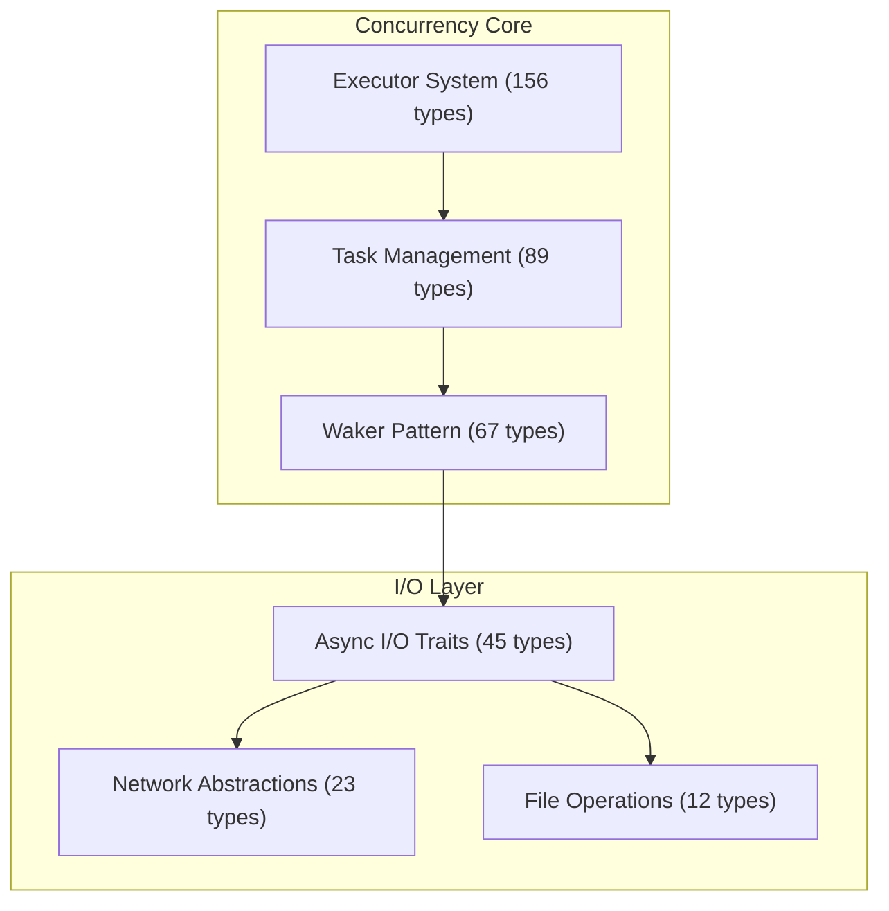

# ISG Visualization Strategy Ideation
## Diverse Approaches to Large-Scale Codebase Architecture Diagrams

**Created:** 2025-10-06
**Context:** 2,575-node Tokio ISG diagrams failing to render in GitHub/browsers
**Goal:** Strategic thinking about visualization that serves diverse user needs

---

## Executive Summary: The Core Problem

### Current State Analysis
- **Problem**: 2,575-node Mermaid diagrams crash browsers and exceed GitHub rendering limits
- **Root Cause**: "Show everything at once" approach violates information design principles
- **Impact**: Users cannot access the architectural insights they need for decision-making

### Jobs To Be Done (from README.md)
1. **Onboard to New Codebase** - "See structure in 30 seconds vs 5+ minutes"
2. **Plan Changes Safely** - "Check impact, assess risks before modifying"
3. **Debug Without Fear** - "See who calls it, understand scope"
4. **Document Architecture** - "Clear diagrams for team sharing"
5. **Export for AI Context** - "Structured information for LLM assistants"

### The Visualization Trilemma
We must balance three competing priorities:
1. **Completeness** - Show everything that might be relevant
2. **Clarity** - Make the information immediately understandable
3. **Performance** - Ensure diagrams actually render and load quickly

---

## Persona Deep Dive: Seven Different Needs

### 1. **New Hire Onboarding Persona: "Alex"**
**Background**: Junior developer, first week at company
**Primary Need**: Quick orientation without overwhelming detail
**Mental Model**: "Where do I even start reading this codebase?"
**Ideal Visualization**:
- 30-second architectural overview
- Major entry points and key modules
- Clear pathways from high-level to detailed views
- **Success Metric**: Can explain the codebase structure to another dev after 15 minutes

### 2. **Senior Architect Persona: "Priya"**
**Background**: Senior engineer designing major refactoring
**Primary Need**: Impact analysis and change planning
**Mental Model**: "If I change X, what breaks? What are the risks?"
**Ideal Visualization**:
- Dependency chains and ripple effects
- Interface boundaries and contracts
- Critical paths and single points of failure
- **Success Metric**: Can confidently scope a 3-month refactoring project

### 3. **Junior Developer Persona: "Carlos"**
**Background**: Developer debugging production issue
**Primary Need**: Understand specific call chains and data flow
**Mental Model**: "How did we get here? What should I look at next?"
**Ideal Visualization**:
- Call graph traces from symptoms to root causes
- Data flow visualization through the system
- State transitions and mutation points
- **Success Metric**: Can identify the likely root cause within 30 minutes

### 4. **Tech Lead Persona: "Samira"**
**Background**: Team lead creating documentation for onboarding
**Primary Need**: Team communication and knowledge sharing
**Mental Model**: "How do I explain this architecture clearly?"
**Ideal Visualization**:
- Printable diagrams for presentations
- Layered complexity for different audiences
- Clear module boundaries and responsibilities
- **Success Metric**: Team members can understand architecture without extensive explanation

### 5. **Security Auditor Persona: "David"**
**Background**: Security professional reviewing codebase
**Primary Need**: Identify attack surfaces and data flows
**Mental Model**: "Where does sensitive data flow? What are the trust boundaries?"
**Ideal Visualization**:
- Data flow graphs and trust boundaries
- External interface attack surfaces
- Authentication and authorization flows
- **Success Metric**: Can identify all potential security vectors in the system

### 6. **Performance Engineer Persona: "Lisa"**
**Background**: Performance specialist optimizing bottlenecks
**Primary Need**: Identify hot paths and resource constraints
**Mental Model**: "Where are we spending time? What are the contention points?"
**Ideal Visualization**:
- Call frequency and timing overlays
- Resource usage heat maps
- Critical paths and bottlenecks
- **Success Metric**: Can identify the top 3 performance bottlenecks

### 7. **API Designer Persona: "Jamal"**
**Background**: Library author designing extension points
**Primary Need**: Understand extensibility and plugin points
**Mental Model**: "Where can users extend this system safely?"
**Ideal Visualization**:
- Trait hierarchies and implementation patterns
- Lifecycle hooks and extension points
- Public vs private API boundaries
- **Success Metric**: Can design a compatible extension without breaking changes

---

## Visualization Strategy Matrix

### Strategy 1: Hierarchical Filtering (Progressive Disclosure)

#### Core Concept
Multiple view levels that users can drill down through:
- **Level 1**: 30,000ft overview (5-7 major components)
- **Level 2**: 10,000ft details (major interfaces and relationships)
- **Level 3**: 1,000ft implementation (full details for specific areas)

#### Implementation Approach
```
Level 1: "Tokio Runtime Architecture"
├── Async Task Management
├── I/O Event Loop
├── Synchronization Primitives
├── Timer & Scheduling System
└── Error Handling & Recovery

Level 2: "Task Management Details"
├── Future Trait (48 implementations)
├── Executor System (12 types)
├── Waker Pattern (89 implementations)
└── Context & Spawning (23 types)

Level 3: "Executor System Deep Dive"
├── ThreadPoolExecutor
├── LocalPoolExecutor
├── BlockingExecutor
└── Custom Executor Patterns
```

#### Strengths
- Matches how humans naturally explore complex systems
- Provides context before diving into details
- Each level renders quickly and is GitHub-compatible

#### Weaknesses
- Requires users to manually navigate between levels
- Hard to maintain consistency across levels
- Complex implementation in the exporter

### Strategy 2: Semantic Clustering (Responsibility-Based Grouping)

#### Core Concept
Group nodes by what they DO, not where they are in the file system:
- **Concurrency Core**: Tasks, executors, wakers
- **I/O Layer**: Network, files, timers, events
- **Data Structures**: Channels, mutexes, atomic types
- **Macros & Utilities**: Pin!, select!, join!, async/await sugar

#### Implementation Approach


#### Strengths
- Maps to mental models of how the system actually works
- Reduces complexity by hiding implementation details
- Provides meaningful abstractions for different tasks

#### Weaknesses
- Requires deep understanding of the codebase to categorize correctly
- May hide important cross-cutting concerns
- Classification can be subjective

### Strategy 3: Importance Weighting (Centrality-Based Filtering)

#### Core Concept
Calculate importance scores and filter by thresholds:
- **Centrality**: How many other nodes depend on this node?
- **Interface Significance**: Is this a key trait or type?
- **Usage Frequency**: How often is this in the codebase?
- **Change Impact**: What would break if this changed?

#### Implementation Approach
```rust
// Pseudo-code for importance calculation
fn calculate_importance(node: &Node) -> f64 {
    let centrality = calculate_centrality(node);
    let interface_bonus = if node.is_trait() { 1.5 } else { 1.0 };
    let usage_factor = log10(node.usage_count() + 1);
    let impact_score = calculate_change_impact(node);

    centrality * interface_bonus * usage_factor * impact_score
}

// Filter nodes by importance threshold
fn filter_by_importance(nodes: Vec<Node>, threshold: f64) -> Vec<Node> {
    nodes.into_iter()
        .filter(|n| calculate_importance(n) >= threshold)
        .collect()
}
```

#### Strengths
- Mathematically grounded approach
- Adaptable to different codebase sizes
- Can be tuned per user needs

#### Weaknesses
- Complex to implement correctly
- May miss important but rarely-used nodes
- Requires good metrics for accurate scoring

### Strategy 4: Task-Specific Views (JTBD-Tailored Diagrams)

#### Core Concept
Create different diagrams for different jobs-to-be-done:
- **Onboarding View**: Architecture overview with entry points
- **Debugging View**: Call chains and error paths
- **Planning View**: Dependencies and impact analysis
- **Documentation View**: Clean, printable architecture

#### Implementation Approach
```bash
# CLI commands for different views
parseltongue export mermaid --view onboarding --output onboarding.md
parseltongue export html --view debugging --output debugging.html
parseltongue export mermaid --view planning --output planning.md
parseltongue export mermaid --view documentation --output docs.md
```

#### View Specifications

**Onboarding View** (30-50 nodes max):
- Major traits and their key implementations
- Entry points and main workflows
- Clear module boundaries
- Success metrics: New hire can navigate after 15 minutes

**Debugging View** (100-200 nodes max):
- Call chains from symptoms to causes
- Error propagation paths
- State mutation points
- Success metrics: Developer can find root cause in 30 minutes

**Planning View** (150-300 nodes max):
- Dependency relationships
- Interface boundaries
- Impact radii for major changes
- Success metrics: Architect can scope refactoring accurately

**Documentation View** (50-100 nodes max):
- Clean architectural patterns
- Printable layouts
- Audience-appropriate detail levels
- Success metrics: Team can understand without extensive explanation

#### Strengths
- Directly addresses user needs
- Each diagram optimized for its specific use case
- Clear purpose and success metrics

#### Weaknesses
- Requires multiple exports to cover all use cases
- More complex CLI interface
- Need to maintain consistency across views

### Strategy 5: Interactive Layering (Dynamic Filtering)

#### Core Concept
Single interactive HTML with multiple overlay layers:
- **Base Layer**: Core architecture (always visible)
- **Detail Layers**: Toggle different aspects on/off
- **Focus Layers**: Highlight specific components
- **Annotation Layers**: Add custom notes and highlights

#### Implementation Approach
```javascript
// Layer management system
const layers = {
    core: { visible: true, nodes: coreNodes },
    details: { visible: false, nodes: detailNodes },
    performance: { visible: false, nodes: performanceNodes },
    security: { visible: false, nodes: securityNodes }
};

function toggleLayer(layerName) {
    layers[layerName].visible = !layers[layerName].visible;
    updateVisualization();
}

function updateVisualization() {
    const visibleNodes = Object.values(layers)
        .filter(layer => layer.visible)
        .flatMap(layer => layer.nodes);

    renderGraph(visibleNodes);
}
```

#### Layer Types
1. **Architecture Layer**: Core components and relationships
2. **Performance Layer**: Timing and frequency data
3. **Security Layer**: Trust boundaries and data flows
4. **Debugging Layer**: Call chains and error paths
5. **Documentation Layer**: Descriptions and annotations

#### Strengths
- Single file serves multiple needs
- Users can customize their view
- Powerful for exploratory analysis
- Can handle complexity without overwhelming users

#### Weaknesses
- Complex JavaScript implementation
- Larger file sizes
- Requires browser interactivity
- Not suitable for static documentation

### Strategy 6: Performance-Aware Rendering

#### Core Concept
Design diagrams with rendering constraints in mind:
- **Node Count Limits**: Different targets for different formats
- **Edge Bundling**: Reduce visual clutter
- **Progressive Loading**: Load important parts first
- **Fallback Modes**: Graceful degradation for limited environments

#### Rendering Targets
```yaml
formats:
  mermaid_markdown:
    max_nodes: 300      # GitHub rendering limits
    max_edges: 500
    loading_time: 1s

  interactive_html:
    max_nodes: 2000     # Browser performance limits
    max_edges: 5000
    loading_time: 3s

  static_svg:
    max_nodes: 1000     # File size limits
    max_edges: 2000
    file_size: 5MB
```

#### Optimization Techniques
1. **Edge Bundling**: Group parallel edges between same node clusters
2. **Node Collapse**: Replace dense subgraphs with summary nodes
3. **Virtual Scrolling**: Only render visible portion for large graphs
4. **Level of Detail**: Show less detail when zoomed out
5. **Lazy Loading**: Load details on demand

#### Strengths
- Ensures diagrams actually render and load quickly
- Provides consistent user experience across environments
- Prevents browser crashes and timeouts

#### Weaknesses
- May hide important information to meet constraints
- Complex optimization logic
- Hard to balance completeness with performance

---

## Diversity of Thought: Alternative Approaches Considered

### Approach 1: Chronological Storytelling
**Idea**: Show the codebase evolution over time
**Rationale**: Help users understand why architectural decisions were made
**Abandoned**: Git history is noisy and doesn't necessarily reflect current understanding

### Approach 2: Data Flow Centric
**Idea**: Start with data types and show how they flow through the system
**Rationale**: Many users think in terms of "what happens to X"
**Abandoned**: Too focused on one aspect; misses structural relationships

### Approach 3: User Journey Mapping
**Idea**: Trace paths through the system from user perspective
**Rationale**: Connects code to actual user behavior
**Abandoned**: Library codebases often don't have clear user journeys

### Approach 4: Risk-Based Visualization
**Idea**: Highlight dangerous or risky parts of the codebase
**Rationale**: Help teams focus technical debt and security efforts
**Abandoned**: Too negative framing; doesn't help with general understanding

### Approach 5: Performance Profile Visualization
**Idea**: Size nodes by performance impact (CPU, memory, latency)
**Rationale**: Performance is often a key concern
**Abandoned**: Requires profiling data; not always available or relevant

---

## Strategic Recommendations

### Phase 1: Immediate Wins (1-2 weeks)
**Priority**: Solve the current rendering failure
**Actions**:
1. Implement hierarchical filtering with 3 levels
2. Add importance-based filtering with configurable thresholds
3. Create task-specific view presets (onboarding, debugging, planning)
4. Update CLI with `--level` and `--view` flags

**Success Criteria**:
- Mermaid diagrams render properly in GitHub (<300 nodes)
- HTML exports load quickly (<3 seconds for 2000+ nodes)
- Users can generate diagrams for their specific needs

### Phase 2: Enhanced Interactivity (2-3 weeks)
**Priority**: Add powerful exploration capabilities
**Actions**:
1. Implement interactive layering in HTML exports
2. Add search and filtering capabilities
3. Create annotation and highlighting features
4. Add performance overlays where data is available

**Success Criteria**:
- Single HTML file serves multiple user needs
- Users can drill down from overview to implementation
- Interactive features work smoothly with large graphs

### Phase 3: Intelligence and Automation (3-4 weeks)
**Priority**: Smart diagram generation
**Actions**:
1. Implement semantic clustering algorithms
2. Add automatic importance scoring
3. Create adaptive detail adjustment based on user behavior
4. Add export to multiple formats from single command

**Success Criteria**:
- Diagrams automatically highlight what's most important
- Users get relevant insights without manual configuration
- System adapts to different codebase characteristics

### Phase 4: Advanced Features (4-6 weeks)
**Priority**: Specialized visualizations
**Actions**:
1. Add security-focused data flow diagrams
2. Create performance profiling visualizations
3. Implement temporal evolution views
4. Add comparison views (before/after changes)

**Success Criteria**:
- Specialized users get tailored visualizations
- Can track architectural changes over time
- Performance and security insights are clearly visible

---

## Success Metrics and Validation

### User Success Metrics
- **Time to Understanding**: Can users explain the architecture after 15 minutes?
- **Task Completion**: Can users complete their specific JTBD efficiently?
- **Error Reduction**: Do users make fewer architectural mistakes?
- **Confidence Levels**: Do users feel confident making changes?

### Technical Metrics
- **Rendering Success**: 100% of diagrams render without errors
- **Performance Targets**: <1s for Mermaid, <3s for HTML (2000 nodes)
- **User Engagement**: Time spent exploring interactive diagrams
- **Adoption Rate**: Percentage of users using new visualization features

### Business Metrics
- **Onboarding Time**: Reduced time for new developers to become productive
- **Development Speed**: Faster impact analysis and change planning
- **Quality Improvements**: Fewer architectural bugs and regressions
- **Knowledge Sharing**: Better team understanding and communication

---

## Conclusion: The Path Forward

The core insight from this strategic thinking exercise is that **one size does not fit all** for large-scale codebase visualization. Different users have different needs, different mental models, and different tasks to accomplish.

The optimal solution combines:
1. **Hierarchical filtering** for progressive disclosure
2. **Task-specific views** for focused needs
3. **Interactive layering** for exploration
4. **Smart importance scoring** for relevance
5. **Performance-aware rendering** for reliability

By implementing this multi-faceted approach, we can transform the current "show everything and crash" problem into a powerful tool that helps developers understand, navigate, and safely modify complex codebases.

The key is to start with the immediate wins (fixing the rendering failure) and progressively add more sophisticated features based on user feedback and real-world usage patterns.

---

**Next Steps**: Begin Phase 1 implementation with hierarchical filtering and task-specific views to immediately solve the rendering failure while providing the foundation for more advanced capabilities.