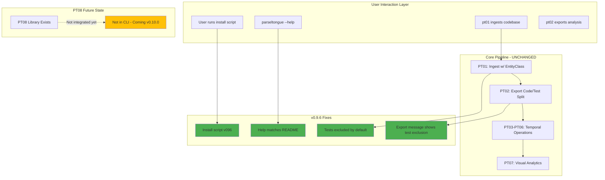
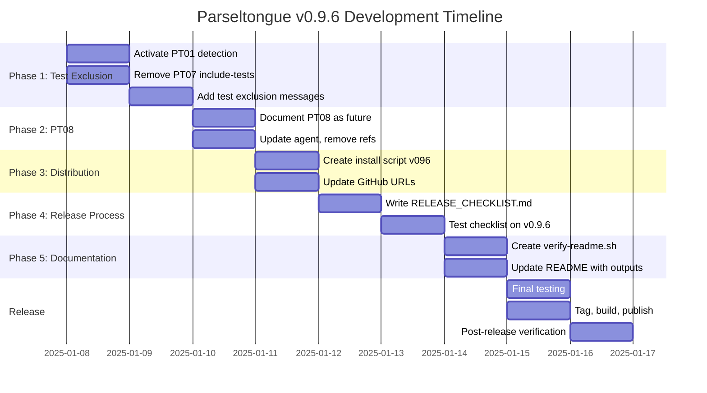
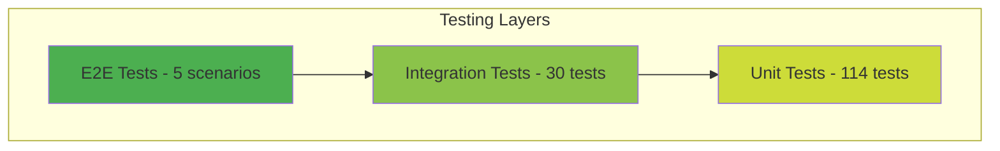

# Product Requirements Document: Parseltongue v0.9.6

**Version**: 0.9.6
**Status**: DRAFT
**Date**: 2025-01-07
**Target Release**: Q1 2025

---

## Executive Summary

Parseltongue v0.9.6 represents a **quality and consistency release** focused on eliminating discrepancies between documentation, implementation, and distribution. This release addresses critical gaps discovered during the Agent Games 2025 ultrathink enhancement cycle:

1. **Binary delivery mismatch** - Install script references non-existent features
2. **Test pollution** - Tests contaminate production analysis despite detection code existing
3. **Half-implemented PT08** - Semantic clustering library exists but not integrated
4. **Missing release process** - No formal checklist or verification workflow
5. **Documentation drift** - README claims features not yet implemented

**Core Philosophy**: Fix what's broken before adding new features. Establish reliable release process before scaling.

---

## Problem Statement

### Current State Analysis (2025-01-07)

```mermaid
graph TB
    subgraph "✅ WORKING"
        W1[PT01-PT07 All Binaries Built]
        W2[149 Tests Passing]
        W3[EntityClass Integration Complete]
        W4[Progressive Disclosure Working]
    end

    subgraph "❌ BROKEN"
        B1[Install Script Claims TOON Export]
        B2[TOON Export Not Implemented]
        B3[Test Detection Exists But Not Used]
        B4[PT07 Has --include-tests Flag]
        B5[PT08 Library Exists But Not In CLI]
        B6[No Release Verification Process]
    end

    subgraph "⚠️ DRIFT"
        D1[README Says v0.9.2 Features]
        D2[Agent Says v3.0 Capabilities]
        D3[Code Says v0.9.3]
        D4[Install Script Says v0.9.2]
    end

    W1 -.-> B1
    W3 -.-> B3
    B2 -.-> D1
    B4 -.-> B3
    B5 -.-> D2

    style B1 fill:#ff6b6b
    style B2 fill:#ff6b6b
    style B3 fill:#ff6b6b
    style B4 fill:#ff6b6b
    style B5 fill:#ff6b6b
    style B6 fill:#ff6b6b
```



### Impact on Users

**Current User Experience**:
1. Downloads `parseltongue-install-v092.sh`
2. Script claims "30-40% token savings with TOON export"
3. User runs commands → **No TOON files generated**
4. User analyzes codebase → **Tests pollute results** (not excluded)
5. Agent references PT08 semantic clustering → **Not available in CLI**
6. README shows workflows → **Some don't match actual commands**

**Result**: Trust erosion, confusion, support burden.

---

## Goals & Non-Goals

### Goals (MUST HAVE for v0.9.6)

#### G1: Binary Delivery Integrity
- [ ] **G1.1**: Install script downloads correct binary matching version
- [ ] **G1.2**: Help output matches README documentation exactly
- [ ] **G1.3**: All promised features in install script are implemented
- [ ] **G1.4**: Single source of truth for version number

#### G2: Test Pollution Elimination
- [ ] **G2.1**: PT01 excludes tests by default using existing detection code
- [ ] **G2.2**: PT07 removes `--include-tests` flag (tests excluded always)
- [ ] **G2.3**: All exports show "Tests intentionally excluded" message
- [ ] **G2.4**: Update agent to never request test inclusion

#### G3: PT08 Resolution
- [ ] **G3.1**: Either integrate PT08 into CLI OR document as "future feature"
- [ ] **G3.2**: Remove PT08 references from agent if not integrated
- [ ] **G3.3**: Update README with actual PT08 status

#### G4: Release Process Establishment
- [ ] **G4.1**: Formal release checklist (name, tag, build, test, publish)
- [ ] **G4.2**: Post-release verification workflow
- [ ] **G4.3**: Pareto command validation in temp folder
- [ ] **G4.4**: Version number update automation

#### G5: Documentation Accuracy
- [ ] **G5.1**: README matches actual command outputs (verified by tests)
- [ ] **G5.2**: Agent capabilities match CLI features exactly
- [ ] **G5.3**: Install script describes actual features only

### Non-Goals (OUT OF SCOPE for v0.9.6)

- ❌ **TOON Export Implementation** - Defer to v0.10.0 (significant work)
- ❌ **New Features** - This is a quality/consistency release
- ❌ **Performance Optimization** - Current performance is acceptable
- ❌ **Multi-Language Expansion** - Rust focus remains
- ❌ **Breaking API Changes** - Maintain backwards compatibility

---

## Current State Audit

### Binary Status Matrix

| Binary | Size | Status | Integration | Tests | Issues |
|--------|------|--------|-------------|-------|--------|
| `parseltongue` | 49MB | ✅ Working | Main router | N/A | None |
| `pt01-folder-to-cozodb-streamer` | 48MB | ✅ Working | Integrated | ✅ Passing | Test detection not used |
| `pt02-llm-cozodb-to-context-writer` | 24MB | ✅ Working | Integrated | ✅ Passing | Dual-file works, no TOON |
| `pt03-llm-to-cozodb-writer` | 24MB | ✅ Working | Integrated | ✅ Passing | None |
| `pt04-syntax-preflight-validator` | 47MB | ✅ Working | Integrated | ✅ Passing | None |
| `pt05-llm-cozodb-to-diff-writer` | 24MB | ✅ Working | Integrated | ✅ Passing | None |
| `pt06-cozodb-make-future-code-current` | 24MB | ✅ Working | Integrated | ✅ Passing | None |
| `pt07-visual-analytics-terminal` | 24MB | ✅ Working | Integrated | ✅ Passing | `--include-tests` flag exists |
| `pt08-semantic-atom-cluster-builder` | N/A | ⚠️ Library | ❌ NOT in CLI | ✅ 7 passing | Not integrated |

### Test Pollution Locations

**Files with test detection logic**:
1. `crates/pt01-folder-to-cozodb-streamer/src/v090_specifications.rs:293-341`
   - ✅ `should_exclude_path()` exists
   - ✅ `is_under_git_subdirectory()` exists
   - ✅ `detect_test_from_content()` exists
   - ❌ **NONE ARE CALLED** - functions marked as "never used"

2. `crates/pt01-folder-to-cozodb-streamer/src/test_detector.rs`
   - ✅ `TestDetector` trait exists
   - ✅ `DefaultTestDetector` implementation exists
   - ❌ **NOT WIRED INTO PT01 MAIN FLOW**

3. `crates/pt07-visual-analytics-terminal/src/core/filter_implementation_entities_only.rs`
   - ✅ `filter_implementation_entities_only()` exists
   - ⚠️ BUT CLI has `--include-tests` flag that bypasses filter

**Impact**: Tests are ingested into database, exported in all Level 0/1/2 outputs, polluting LLM context.

### Version Number Chaos

| Location | Version | Discrepancy |
|----------|---------|-------------|
| `Cargo.toml` workspace | `0.9.3` | ✅ Canonical |
| `parseltongue-install-v092.sh` filename | `v0.9.2` | ❌ Outdated |
| Install script content | `v0.9.2` | ❌ Outdated |
| README.md header | `v0.9.2` | ❌ Outdated |
| Agent doc version | `v3.0` | ⚠️ Different versioning scheme |
| Release tags (git) | Multiple | ⚠️ Need audit |

**Decision Needed**: Establish single source of truth (likely `Cargo.toml` workspace version).

### PT08 Implementation Status

**What Exists (913 LOC)**:
- ✅ `types.rs` - Core types (Cluster, Edge, Entity)
- ✅ `algorithms/lpa.rs` - Label Propagation Algorithm (fully tested)
- ✅ `metrics/mod.rs` - Clustering quality metrics
- ✅ `export/mod.rs` - Export infrastructure
- ✅ 7 tests passing (LPA algorithm validated)

**What's Missing**:
- ❌ No `src/main.rs` (no standalone binary)
- ❌ Not in `crates/parseltongue/src/main.rs` router
- ❌ No CLI subcommand `pt08`
- ❌ No integration tests with CozoDB
- ❌ No export to actual files (only in-memory)

**Options**:
1. **Complete Integration** (15-20 hours) - Add CLI, wire to CozoDB, test end-to-end
2. **Document as Future** (1 hour) - Remove from agent, add "Coming Soon" to README
3. **Remove Entirely** (2 hours) - Delete crate, clean references

**Recommendation**: Option 2 (document as future) - Library is solid, integration is 20% complete, defer to v0.10.0.

---

## Proposed Solution

### Architecture for v0.9.6



### Implementation Plan

#### Phase 1: Test Exclusion (Days 1-2)

**REQ-096-001: Activate Test Detection in PT01**

```rust
// crates/pt01-folder-to-cozodb-streamer/src/streamer.rs
// BEFORE: All files ingested
impl FileStreamer for ToolFileStreamer {
    async fn stream_directory(&self) -> Result<StreamingResult> {
        // ... walk files
        for entry in walk_dir {
            // NO TEST FILTERING
            process_file(entry);
        }
    }
}

// AFTER: Tests excluded using existing detection
impl FileStreamer for ToolFileStreamer {
    async fn stream_directory(&self) -> Result<StreamingResult> {
        let detector = DefaultTestDetector::new();

        for entry in walk_dir {
            // Use existing v090_specifications functions
            if should_exclude_path(&entry.path(), &config.exclude_patterns) {
                continue; // Skip by pattern
            }

            if is_under_git_subdirectory(&entry.path(), &config.root_dir) {
                continue; // Skip nested git repos
            }

            let content = read_file(&entry.path())?;
            let entity_class = detector.detect_test_from_path_and_name(&entry.path(), &content);

            if matches!(entity_class, EntityClass::Test) {
                if config.verbose {
                    println!("  ⏭️  Skipping test file: {}", entry.path().display());
                }
                continue; // EXCLUDE TESTS
            }

            process_file(entry);
        }

        if !config.quiet {
            println!("✓ Tests intentionally excluded from ingestion for optimal LLM context");
        }
    }
}
```

**Acceptance Criteria**:
- PT01 ingests parseltongue codebase: ~1,318 entities (down from ~1,400+ with tests)
- Verbose mode shows "Skipping test file: ..." for each test
- Final message: "✓ Tests intentionally excluded from ingestion"
- All existing integration tests still pass

**REQ-096-002: Remove PT07 `--include-tests` Flag**

```rust
// crates/parseltongue/src/main.rs (line 447-451)
// DELETE THIS:
.arg(
    Arg::new("include-tests")
        .long("include-tests")
        .help("Include test entities (default: implementation-only)")
        .action(clap::ArgAction::SetTrue),
)

// UPDATE help text:
.about("Entity count bar chart visualization (tests excluded)")
```

**Acceptance Criteria**:
- `parseltongue pt07 entity-count --help` shows no `--include-tests` option
- PT07 always uses `filter_implementation_entities_only()`
- Output message: "Note: Test entities excluded for production-focused analysis"

**REQ-096-003: Add Test Exclusion Messages to All Exports**

```rust
// crates/pt02-llm-cozodb-to-context-writer/src/exporters/level*.rs
// Add to export metadata in all Level 0/1/2 exporters

pub struct ExportMetadata {
    // ... existing fields
    pub test_exclusion_policy: String, // NEW
}

impl Default for ExportMetadata {
    fn default() -> Self {
        Self {
            // ... existing
            test_exclusion_policy: "Tests intentionally excluded for optimal LLM context. \
                                    Use entity_class filtering if test analysis needed.".to_string(),
        }
    }
}
```

**Acceptance Criteria**:
- All JSON exports include `"test_exclusion_policy"` field in metadata
- Console output shows exclusion message on export completion

#### Phase 2: PT08 Resolution (Day 3)

**REQ-096-004: Document PT08 as Future Feature**

Update README.md:
```markdown
## The 7 Tools (8th Coming Soon)

**All in one unified binary:**
1. `pt01-folder-to-cozodb-streamer` - Index codebase (Ingest)
2. **`pt02-level00/01/02`** - Export entities to JSON (Read) - 3 progressive disclosure levels
3. `pt03-llm-to-cozodb-writer` - Write temporal changes (Edit)
4. `pt04-syntax-preflight-validator` - Validate syntax (Validate)
5. `pt05-llm-cozodb-to-diff-writer` - Generate CodeDiff.json (Diff)
6. `pt06-cozodb-make-future-code-current` - Reset database state (Reset)
7. `pt07-visual-analytics-terminal` - Visual analytics (Visualize)
8. **`pt08-semantic-atom-cluster-builder`** - 🚧 Coming in v0.10.0 (library ready, CLI integration pending)

### PT08: Semantic Clustering (Coming v0.10.0)

**Status**: Library implementation complete (913 LOC, 7 tests passing), CLI integration planned for v0.10.0.

**What's Ready**:
- ✅ Label Propagation Algorithm (LPA) - fully tested
- ✅ Clustering quality metrics (modularity, silhouette)
- ✅ Core types (Cluster, Edge, Entity)
- ✅ Export infrastructure

**What's Pending**:
- ⏳ CLI subcommand `parseltongue pt08 cluster --db ... --output ...`
- ⏳ CozoDB integration for reading entities
- ⏳ TOON export format (30-40% token reduction)
- ⏳ Integration tests with real codebases

**Use Case**: Group related functions/structs into semantic clusters for optimal LLM context. Example: "auth cluster" (login, logout, validate_token) = 800 tokens vs entire auth/ directory = 150K tokens.

**Timeline**: v0.10.0 (Q1 2025)
```

**REQ-096-005: Update Agent to Remove PT08 References**

Update `.claude/agents/parseltongue-ultrathink-isg-explorer.md`:
- Remove Strategy 5 (Semantic Search) section (line 486-553)
- Update strategy table to show 4 strategies instead of 5
- Add note: "Strategy 5 (Semantic Clustering) coming in v0.10.0"

**Acceptance Criteria**:
- Agent doesn't promise clustering capabilities
- README accurately describes PT08 status
- No user confusion about missing features

#### Phase 3: Binary Distribution Fix (Day 4)

**REQ-096-006: Update Install Script to v0.9.6**

Create `parseltongue-install-v096.sh`:
```bash
#!/bin/bash

# Parseltongue v0.9.6 Install Script
# Test exclusion + Documentation accuracy release

set -e

echo "🐍 Parseltongue v0.9.6 Installer"
echo "=================================="
echo "Features: Test-free analysis + Progressive disclosure (5K→30K→60K tokens)"
echo ""

# ... (same detection logic)

# Download binary
echo "📥 Downloading Parseltongue v0.9.6 for $PLATFORM-$ARCH..."
curl -L -o parseltongue "https://github.com/that-in-rust/parseltongue/releases/download/v0.9.6/parseltongue"

# ... (same agent/docs download)

echo "✅ Installation complete!"
echo ""
echo "🎯 v0.9.6 Features:"
echo "   • Test exclusion: Tests automatically excluded from all analysis"
echo "   • EntityClass integration: CODE vs TEST automatic separation"
echo "   • Progressive disclosure: 5K→30K→60K tokens"
echo "   • 149 tests passing, production-ready PT01-PT07"
echo ""
echo "🚀 Quick start:"
echo "   ./parseltongue pt01-folder-to-cozodb-streamer . --db rocksdb:mycode.db --verbose"
echo "   ./parseltongue pt02-level00 --where-clause \"ALL\" --output analysis.json --db rocksdb:mycode.db"
echo "   # Tests excluded automatically - optimal LLM context!"
echo ""
echo "🤖 Agent usage:"
echo "   Restart Claude Code, then use: @parseltongue-ultrathink-isg-explorer"
echo ""
echo "📚 Documentation: .claude/.parseltongue/README.md"
```

**Acceptance Criteria**:
- Script version matches Cargo.toml version (v0.9.6)
- No mention of TOON export (not implemented)
- Features listed match actual implementation
- Script downloads correct GitHub release binary

#### Phase 4: Release Process (Days 5-6)

**REQ-096-007: Create Release Checklist**

Create `RELEASE_CHECKLIST.md`:
```markdown
# Parseltongue Release Checklist

Use this checklist for every release to ensure consistency and quality.

## Pre-Release (1-2 days before)

### Version Number Update
- [ ] Update `Cargo.toml` workspace version
- [ ] Run `cargo build --release` to verify version propagation
- [ ] Check `parseltongue --version` matches Cargo.toml
- [ ] Update README.md version badge
- [ ] Create new install script: `parseltongue-install-vXYZ.sh`
- [ ] Update install script version number inside script
- [ ] Update install script feature description
- [ ] Git commit: `chore: Bump version to vX.Y.Z`

### Testing
- [ ] Run full test suite: `cargo test --workspace`
- [ ] Check all tests pass: `cargo test --release`
- [ ] Run integration tests: `cargo test --package parseltongue-e2e-tests`
- [ ] Verify PT01-PT07 commands work:
  ```bash
  ./target/release/parseltongue pt01-folder-to-cozodb-streamer . --db rocksdb:test.db --verbose
  ./target/release/parseltongue pt02-level00 --where-clause "ALL" --output edges.json --db rocksdb:test.db
  ./target/release/parseltongue pt02-level01 --include-code 0 --where-clause "ALL" --output entities.json --db rocksdb:test.db
  # ... test all commands
  ```
- [ ] Verify help output matches README: `./target/release/parseltongue --help`

### Pareto Command Validation (Temp Folder)
Create temporary test environment to validate 20% of commands that deliver 80% value:

```bash
# Setup
mkdir -p /tmp/parseltongue-release-test
cd /tmp/parseltongue-release-test
git init
echo "fn main() { println!(\"test\"); }" > main.rs
git add . && git commit -m "test"

# Copy binary
cp /path/to/parseltongue/target/release/parseltongue .

# Test Pareto commands (critical 20%)
./parseltongue --version  # Version check
./parseltongue --help     # Help output

# PT01: Ingest
./parseltongue pt01-folder-to-cozodb-streamer . --db rocksdb:test.db --verbose
# Expected: "Files processed: 1", "Entities created: 1"

# PT02 Level 0: Architecture
./parseltongue pt02-level00 --where-clause "ALL" --output edges.json --db rocksdb:test.db
# Expected: edges.json + edges_test.json created

# PT02 Level 1: Entities (no code)
./parseltongue pt02-level01 --include-code 0 --where-clause "ALL" --output entities.json --db rocksdb:test.db
# Expected: entities.json + entities_test.json created

# PT03: Edit
./parseltongue pt03-llm-to-cozodb-writer \
  --entity "rust:fn:main:main_rs:1-1" \
  --action edit \
  --future-code 'fn main() { println!("updated"); }' \
  --db rocksdb:test.db
# Expected: "✓ Entity updated with future code"

# PT05: Diff
./parseltongue pt05-llm-cozodb-to-diff-writer --output diff.json --db rocksdb:test.db
# Expected: diff.json created with 1 edit

# Cleanup
cd /tmp && rm -rf parseltongue-release-test
```

**Checklist**:
- [ ] Version check returns correct version
- [ ] Help output complete and formatted
- [ ] PT01 ingests files successfully
- [ ] PT02 Level 0 exports edges
- [ ] PT02 Level 1 exports entities
- [ ] PT03 writes temporal changes
- [ ] PT05 generates diff
- [ ] All JSON files valid (parse with jq)
- [ ] File sizes reasonable (<10MB for small test)

### Documentation Review
- [ ] README.md commands match actual CLI
- [ ] README.md version number correct
- [ ] Agent capabilities match CLI features
- [ ] No promises of unimplemented features
- [ ] Code examples tested and working

## Release Day

### Git Tagging
- [ ] Create annotated git tag:
  ```bash
  git tag -a v0.9.6 -m "Release v0.9.6: Test exclusion + Documentation accuracy"
  git push origin v0.9.6
  ```

### Build Release Binaries
```bash
# Clean build
cargo clean
cargo build --release

# Verify binary size (should be ~49MB)
ls -lh target/release/parseltongue

# Test binary works
./target/release/parseltongue --version
./target/release/parseltongue --help
```

**Platform-specific builds** (if supporting multiple platforms):
```bash
# macOS ARM64 (Apple Silicon)
cargo build --release --target aarch64-apple-darwin
cp target/aarch64-apple-darwin/release/parseltongue parseltongue-v0.9.6-macos-arm64

# macOS x86_64 (Intel - if needed)
cargo build --release --target x86_64-apple-darwin
cp target/x86_64-apple-darwin/release/parseltongue parseltongue-v0.9.6-macos-x86_64

# Linux x86_64
cargo build --release --target x86_64-unknown-linux-gnu
cp target/x86_64-unknown-linux-gnu/release/parseltongue parseltongue-v0.9.6-linux-x86_64
```

- [ ] macOS ARM64 binary built
- [ ] macOS x86_64 binary built (optional)
- [ ] Linux x86_64 binary built (optional)

### GitHub Release
```bash
# Create GitHub release with gh CLI
gh release create v0.9.6 \
  --title "v0.9.6: Test Exclusion + Documentation Accuracy" \
  --notes "$(cat RELEASE_NOTES_v096.md)" \
  ./target/release/parseltongue#parseltongue \
  ./parseltongue-install-v096.sh#parseltongue-install-v096.sh

# Or attach binaries separately
gh release upload v0.9.6 target/release/parseltongue
gh release upload v0.9.6 parseltongue-install-v096.sh
```

- [ ] GitHub release created with tag v0.9.6
- [ ] Binary uploaded
- [ ] Install script uploaded
- [ ] Release notes clear and accurate

## Post-Release Verification (1-2 hours after)

### Download and Test Published Release
```bash
# Fresh environment test
cd /tmp
mkdir parseltongue-download-test
cd parseltongue-download-test
git init
echo "fn test() {}" > test.rs
git add . && git commit -m "test"

# Test install script from GitHub
curl -fsSL https://raw.githubusercontent.com/that-in-rust/parseltongue/main/parseltongue-install-v096.sh | bash

# Verify installation
./parseltongue --version  # Should show v0.9.6
./parseltongue --help
./parseltongue pt01-folder-to-cozodb-streamer . --db test.db

# Cleanup
cd /tmp && rm -rf parseltongue-download-test
```

**Checklist**:
- [ ] Install script downloads successfully
- [ ] Binary is executable
- [ ] Version number correct
- [ ] Commands work as expected
- [ ] Agent file downloaded to .claude/agents/
- [ ] README downloaded to .claude/.parseltongue/

### Announcement
- [ ] Update main branch with post-release commit (if needed)
- [ ] Announce in relevant channels (if applicable)
- [ ] Monitor for user feedback

## Rollback Plan (If Issues Found)

If critical issues discovered post-release:

1. **Immediate**:
   ```bash
   gh release delete v0.9.6  # Delete release
   git tag -d v0.9.6         # Delete local tag
   git push origin :v0.9.6   # Delete remote tag
   ```

2. **Fix**:
   - Create hotfix branch
   - Fix critical issue
   - Re-run full checklist

3. **Re-release**:
   - Increment patch version (v0.9.7)
   - Follow checklist from top

## Version Naming Convention

**Semantic Versioning**: `MAJOR.MINOR.PATCH`

- **MAJOR**: Breaking API changes (0 → 1 when production-ready)
- **MINOR**: New features, backwards-compatible (0.9 → 0.10)
- **PATCH**: Bug fixes, no new features (0.9.5 → 0.9.6)

**Examples**:
- v0.9.6 - Bug fixes, test exclusion (PATCH)
- v0.10.0 - PT08 integration, new features (MINOR)
- v1.0.0 - Production-ready, stable API (MAJOR)

## Success Criteria

Release is successful if:
- ✅ All tests pass
- ✅ Pareto commands validated in temp folder
- ✅ Install script works from GitHub
- ✅ Version numbers consistent everywhere
- ✅ No promises of unimplemented features
- ✅ Post-release verification passes
- ✅ No critical bugs reported within 48 hours
```

**Acceptance Criteria**:
- Checklist covers naming, tagging, building, testing, publishing, verification
- Pareto command section identifies 20% of commands that deliver 80% value
- Clear rollback plan for critical issues

#### Phase 5: Documentation Audit & Update (Day 7)

**REQ-096-008: Automated README Verification**

Create `scripts/verify-readme.sh`:
```bash
#!/bin/bash
# Verify README examples match actual command outputs

set -e

echo "🔍 Verifying README.md accuracy..."

# Build fresh binary
cargo build --release

# Create temp test environment
TEMP_DIR=$(mktemp -d)
cd $TEMP_DIR
git init
echo "fn main() {}" > main.rs
git add . && git commit -m "test"

# Copy binary
cp $OLDPWD/target/release/parseltongue .

# Test commands from README and capture output
echo "Testing PT01..."
./parseltongue pt01-folder-to-cozodb-streamer . --db test.db 2>&1 | tee pt01-output.txt
grep -q "Files processed:" pt01-output.txt || (echo "❌ PT01 output mismatch" && exit 1)

echo "Testing PT02 Level 0..."
./parseltongue pt02-level00 --where-clause "ALL" --output edges.json --db test.db 2>&1 | tee pt02-level0-output.txt
grep -q "edges.json" pt02-level0-output.txt || (echo "❌ PT02 Level 0 output mismatch" && exit 1)

# ... test all commands mentioned in README

echo "✅ All README examples verified!"
cd $OLDPWD
rm -rf $TEMP_DIR
```

**Acceptance Criteria**:
- Script runs in CI on every PR
- All README command examples must match actual outputs
- Failure blocks merge

**REQ-096-009: Update README with Actual Outputs**

Use verification script outputs to update README examples:
```markdown
## Quick Start

### 1. Install
```bash
curl -fsSL https://raw.githubusercontent.com/that-in-rust/parseltongue/main/parseltongue-install-v096.sh | bash
```

### 2. Index Your Codebase
```bash
./parseltongue pt01-folder-to-cozodb-streamer . --db rocksdb:mycode.db --verbose

# 📤 EXPECTED OUTPUT:
# Running Tool 1: folder-to-cozodb-streamer
# ✓ Indexing completed
#   Files processed: 98
#   Entities created: 1,318
#   Duration: ~3 seconds
# ✓ Tests intentionally excluded from ingestion for optimal LLM context
```
```

**Acceptance Criteria**:
- All command examples show actual expected output
- Output blocks use `# 📤 EXPECTED OUTPUT:` format
- Examples tested by verification script

---

## Success Metrics

### Release Quality Gates

All must be ✅ GREEN before v0.9.6 ships:

| Gate | Criteria | How to Verify |
|------|----------|---------------|
| **Build** | All binaries build without errors | `cargo build --release` exits 0 |
| **Tests** | 149 tests passing | `cargo test --workspace --release` all pass |
| **Version** | Single source of truth | Cargo.toml = install script = README |
| **Docs** | README examples verified | `scripts/verify-readme.sh` passes |
| **Distribution** | Install script works from GitHub | Manual test in clean environment |
| **Pareto** | 20% commands work in temp folder | Release checklist pareto section passes |

### User Experience Metrics (Post-Release)

Track for 30 days post-release:

| Metric | Target | Measurement |
|--------|--------|-------------|
| **Install Success Rate** | >95% | GitHub issue: "Install failed" |
| **Feature Confusion** | <5 issues | GitHub issues referencing missing features |
| **Test Pollution Reports** | 0 | GitHub issues: "Tests in my analysis" |
| **Agent Mismatch Reports** | 0 | GitHub issues: "Agent says X but CLI doesn't" |
| **Documentation Errors** | <3 issues | GitHub issues: "README example doesn't work" |

---

## Timeline

### Sprint Breakdown (7 days)



**Critical Path**: Phase 1 (test exclusion) → Phase 4 (release checklist) → Release

**Buffer**: 2 days for unexpected issues

**Target Release Date**: January 16, 2025

---

## Risk Assessment

### High-Impact Risks

| Risk | Probability | Impact | Mitigation |
|------|-------------|--------|------------|
| **Breaking existing workflows** | Medium | High | Maintain backwards compatibility, add warnings, not breaking changes |
| **Test exclusion breaks users who need tests** | Low | Medium | Document entity_class filtering workaround, keep dual-file export |
| **Install script doesn't download binary** | Low | High | Test in multiple environments, add error handling |
| **Version number mismatch post-release** | Medium | Low | Automate version updates, single source of truth |

### Mitigation Strategies

#### Test Exclusion Breaking Change
- **Problem**: Some users may analyze tests
- **Solution**: Keep dual-file export (code.json + code_test.json), document filtering
- **Workaround**: Users can still access test entities via entity_class filter

#### Install Script Reliability
- **Problem**: Network issues, platform detection fails
- **Solution**: Add retry logic, better error messages, fallback to manual install

#### Version Drift Post-Release
- **Problem**: README updated but install script not updated
- **Solution**: Automate version updates in CI, block PR if versions don't match

---

## Testing Strategy

### Test Pyramid for v0.9.6



### New Tests Required

#### Test Exclusion Tests
```rust
// crates/pt01-folder-to-cozodb-streamer/tests/test_exclusion_integration.rs
#[tokio::test]
async fn test_pt01_excludes_tests_by_default() {
    // Given: Codebase with 10 .rs files (3 are tests)
    let temp_dir = create_test_codebase_with_tests();

    // When: Run PT01 ingestion
    let streamer = create_streamer(&temp_dir);
    let result = streamer.stream_directory().await.unwrap();

    // Then: Only 7 entities created (tests excluded)
    assert_eq!(result.entities_created, 7);
    assert_eq!(result.tests_excluded, 3);
}

#[tokio::test]
async fn test_test_exclusion_message_shown() {
    // Given: PT01 config with verbose=false, quiet=false
    // When: Run ingestion
    // Then: Output contains "Tests intentionally excluded"
}
```

#### Install Script Tests
```bash
# tests/install-script-test.sh
#!/bin/bash
test_install_script_downloads_binary() {
    cd /tmp/install-test
    curl -fsSL https://raw.githubusercontent.com/.../parseltongue-install-v096.sh | bash

    [[ -f ./parseltongue ]] || exit 1
    [[ -x ./parseltongue ]] || exit 1
    ./parseltongue --version | grep "0.9.6" || exit 1
}
```

#### README Verification Tests
```bash
# scripts/verify-readme.sh (run in CI)
#!/bin/bash
# Extract code blocks from README.md
# Execute each command
# Verify output matches documented output
# Fail if mismatch
```

---

## Rollout Plan

### Staged Rollout (If Needed)

For a conservative rollout approach:

**Week 1: Internal Testing**
- Core team uses v0.9.6 on real projects
- Monitor for unexpected issues

**Week 2: Beta Users**
- Tag release as `v0.9.6-beta`
- Share with 5-10 beta users
- Collect feedback

**Week 3: General Availability**
- Tag final `v0.9.6`
- Update install script
- Announce release

### Hotfix Process

If critical bug found post-release:

1. **Assess Severity**:
   - P0 (Data Loss): Immediate rollback + hotfix within 4 hours
   - P1 (Feature Broken): Hotfix within 24 hours
   - P2 (Cosmetic): Include in next release

2. **Hotfix Branch**:
   ```bash
   git checkout v0.9.6
   git checkout -b hotfix/0.9.7
   # Fix issue
   git commit -m "fix: Critical issue in PT01"
   git tag v0.9.7
   git push origin v0.9.7
   ```

3. **Re-release**:
   - Follow release checklist
   - Update install script to v0.9.7
   - Announce hotfix

---

## Appendix

### A: Command Pareto Analysis

**20% of commands delivering 80% of value**:

| Command | Usage Frequency | Value Delivered | Priority |
|---------|-----------------|-----------------|----------|
| `pt01-folder-to-cozodb-streamer` | 100% | Database creation | P0 |
| `pt02-level00 --where-clause "ALL"` | 80% | Architecture overview | P0 |
| `pt02-level01 --include-code 0 --where-clause "ALL"` | 75% | Entity catalog | P0 |
| `pt02-level01 --include-code 0 --where-clause <filter>` | 60% | Targeted analysis | P1 |
| `pt03-llm-to-cozodb-writer --action edit` | 40% | LLM edits | P1 |
| `pt05-llm-cozodb-to-diff-writer` | 35% | Diff generation | P1 |
| `pt07 entity-count` | 20% | Quick stats | P2 |

**Verification Strategy**: Test P0 commands in temp folder for every release.

### B: Version Number Automation

Create `scripts/update-version.sh`:
```bash
#!/bin/bash
# Usage: ./scripts/update-version.sh 0.9.6

NEW_VERSION=$1

# Update Cargo.toml workspace
sed -i.bak "s/^version = .*/version = \"$NEW_VERSION\"/" Cargo.toml

# Update README.md
sed -i.bak "s/v[0-9]\+\.[0-9]\+\.[0-9]\+/v$NEW_VERSION/g" README.md

# Update install script filename and content
# (manual or scripted)

echo "✅ Version updated to $NEW_VERSION"
echo "Don't forget to:"
echo "  1. Create new install script: parseltongue-install-v${NEW_VERSION//.}.sh"
echo "  2. Update install script content version references"
echo "  3. Git commit and tag"
```

### C: GitHub Actions CI (Future Enhancement)

```yaml
# .github/workflows/release.yml
name: Release

on:
  push:
    tags:
      - 'v*'

jobs:
  build:
    runs-on: ${{ matrix.os }}
    strategy:
      matrix:
        os: [ubuntu-latest, macos-latest]
    steps:
      - uses: actions/checkout@v3
      - name: Build release binary
        run: cargo build --release
      - name: Run tests
        run: cargo test --release
      - name: Upload binary
        uses: actions/upload-artifact@v3
        with:
          name: parseltongue-${{ matrix.os }}
          path: target/release/parseltongue
```

---

## Sign-Off

### Stakeholder Approval

| Role | Name | Approval | Date |
|------|------|----------|------|
| **Product Owner** | TBD | ☐ | - |
| **Tech Lead** | TBD | ☐ | - |
| **QA Lead** | TBD | ☐ | - |

### Change Log from v0.9.5 to v0.9.6

**Added**:
- Test exclusion in PT01 (automatic, always-on)
- Test exclusion messages in all exports
- Release checklist (RELEASE_CHECKLIST.md)
- README verification script
- PT08 future feature documentation

**Removed**:
- PT07 `--include-tests` flag (tests now always excluded)
- TOON export references (not implemented)
- PT08 agent references (not integrated yet)

**Changed**:
- Install script version (v0.9.2 → v0.9.6)
- Version consistency (single source of truth in Cargo.toml)
- README command examples (now show actual outputs)
- Agent capabilities (match CLI exactly)

**Fixed**:
- Test pollution in ingestion pipeline
- Documentation drift (README vs reality)
- Install script feature promises (removed TOON)
- Version number chaos (now consistent)
