# Simple Example - User Management System

This is a working example of Parseltongue's Mermaid export functionality with a small, manageable codebase.

## Code Structure

```rust
// src/lib.rs
pub struct User {
    name: String,
    email: String,
}

pub trait Display {
    fn format(&self) -> String;
}

impl Display for User {
    fn format(&self) -> String {
        format!("User: {} ({})", self.name, self.email)
    }
}

// src/main.rs
fn main() {
    let user = User {
        name: "Alice".to_string(),
        email: "alice@example.com".to_string()
    };
    println!("{}", user.format());
}
```

## Generated Architecture Diagram

```mermaid
flowchart TD
    Display["🎯 Display<br/>(Trait)<br/><i>src/lib.rs</i>"]
    User["📦 User<br/>(Struct)<br/><i>src/lib.rs</i>"]
    main["🔧 main<br/>(Function)<br/><i>src/main.rs</i>"]

    main --> User
    User -.-> Display

    %% Styling
    classDef trait fill:#e1f5fe,stroke:#0277bd,stroke-width:3px,color:#01579b
    classDef struct fill:#f3e5f5,stroke:#7b1fa2,stroke-width:2px,color:#4a148c
    classDef function fill:#e8f5e8,stroke:#388e3c,stroke-width:2px,color:#1b5e20

    class Display trait
    class User struct
    class main function
```



## How It Was Generated

```bash
# Parse the codebase
parseltongue ingest simple-code.txt

# Export to both HTML and markdown automatically
parseltongue export --output simple-example
# Creates: simple-example.html (interactive) + simple-example.md (overview)
```

## What This Shows

- **Clean Architecture**: Clear separation between data structures and functionality
- **Trait Implementation**: How User implements the Display trait
- **Module Structure**: Relationship between lib.rs and main.rs
- **GitHub Compatible**: Renders perfectly in GitHub's Mermaid viewer

## Performance

- **Generation Time**: < 1ms
- **File Size**: Small, loads instantly
- **GitHub Rendering**: ✅ Works perfectly
- **Browser Performance**: Excellent

This demonstrates Parseltongue working optimally with small, focused codebases.