# Parseltongue Dungeon: Ready-to-Use Scripts and LLM Instructions

This directory contains production-ready scripts and LLM instruction files for common Parseltongue workflows.

```mermaid
%%{init: {'theme':'base', 'themeVariables': {'primaryColor':'#e8f5e8', 'primaryTextColor':'#2e7d32', 'lineColor':'#4caf50', 'fontFamily':'Arial', 'fontSize':'13px'}, 'flowchart': {'nodeSpacing': 70, 'rankSpacing': 80, 'wrappingWidth': 140}}}%%
flowchart TD
    %% Entry points
    subgraph "🚀 Quick Start Workflows"
        direction TB
        A["🎯 Onboard Codebase<br/><i>./onboard_codebase.sh</i><br/>Complete understanding"]
        B["🔍 Feature Impact<br/><i>./feature_impact.sh</i><br/>Risk analysis"]
        C["🐛 Debug Entity<br/><i>./debug_entity.sh</i><br/>Caller traces"]
        D["🤖 LLM Context<br/><i>./generate_llm_context.sh</i><br/>Zero-hallucination facts"]
    end
    
    %% Core capabilities
    subgraph "⚙️ Core Capabilities"
        direction TB
        E["📊 Entity Discovery<br/><i>list-entities, where-defined</i>"]
        F["💥 Blast Radius<br/><i>Impact assessment</i>"]
        G["📁 File Navigation<br/><i>entities-in-file</i>"]
        H["🔄 Workspace Mgmt<br/><i>Persistent sessions</i>"]
    end
    
    %% Outputs
    subgraph "📋 Generated Outputs"
        direction TB
        I["🏗️ Architecture Overview<br/><i>Entity types & counts</i>"]
        J["⚠️ Risk Assessment<br/><i>Low/Medium/High/Critical</i>"]
        K["📞 Caller Analysis<br/><i>Usage patterns</i>"]
        L["📝 LLM Instructions<br/><i>Context-rich prompts</i>"]
    end
    
    %% Workflow connections
    A --> E
    A --> H
    B --> F
    B --> E
    C --> G
    C --> F
    D --> E
    D --> G
    
    %% Output connections
    E --> I
    F --> J
    G --> K
    H --> L
    
    %% Performance targets
    subgraph "⏱️ Performance Targets"
        direction LR
        P1["Onboarding: &lt;15min"]
        P2["Impact: &lt;5min"]
        P3["Debug: &lt;3min"]
        P4["Context: &lt;2min"]
    end
    
    A -.-> P1
    B -.-> P2
    C -.-> P3
    D -.-> P4
    
    %% Styling
    classDef workflow fill:#e8f5e8,stroke:#2e7d32,stroke-width:2px,color:#1b5e20
    classDef capability fill:#e1f5fe,stroke:#01579b,stroke-width:2px,color:#0d47a1
    classDef output fill:#fff3e0,stroke:#ef6c00,stroke-width:2px,color:#e65100
    classDef performance fill:#f3e5f5,stroke:#7b1fa2,stroke-width:2px,color:#4a148c
    
    class A,B,C,D workflow
    class E,F,G,H capability
    class I,J,K,L output
    class P1,P2,P3,P4 performance
```



## Quick Start

1. **Onboard to a new codebase**: `./onboard_codebase.sh /path/to/codebase`
2. **Feature impact analysis**: `./feature_impact.sh EntityName`
3. **Debug workflow**: `./debug_entity.sh FunctionName`
4. **Generate LLM context**: `./generate_llm_context.sh /path/to/codebase`

## Directory Structure

```
parseltongue_dungeon/
├── scripts/                    # Executable workflow scripts
│   ├── onboard_codebase.sh    # Complete onboarding workflow
│   ├── feature_impact.sh      # Feature planning workflow
│   ├── debug_entity.sh        # Debug workflow
│   └── generate_llm_context.sh # LLM context generation
├── llm_instructions/          # LLM instruction templates
│   ├── codebase_analysis.md   # Instructions for codebase analysis
│   ├── refactor_planning.md   # Instructions for refactor planning
│   └── architecture_review.md # Instructions for architecture review
├── demo_outputs/              # Example outputs from real codebases
│   ├── axum_exploration/      # Axum codebase exploration results
│   └── parseltongue_self/     # Parseltongue self-analysis results
└── README.md                  # This file
```

## Performance Expectations

- **Onboarding**: <15 minutes for codebases up to 1000 files
- **Feature Impact**: <5 minutes for impact analysis
- **Debug Workflow**: <3 minutes for caller traces
- **LLM Context**: <2 minutes for context generation

All scripts include timing measurements and success validation.