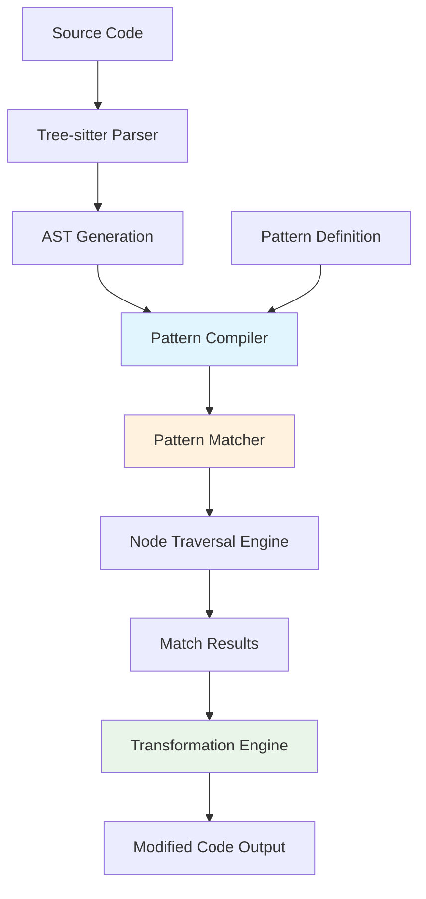

# TI-001: Isomorphic Pattern Matching Architecture

## Overview
**Description**: Pattern syntax that mirrors actual code structure, eliminating abstraction layers between developer intent and implementation.
**Source**: Chunk 2, Lines 301-600
**Priority**: Critical - Core Innovation
**Complexity**: High

## Technical Architecture

### Core Components


### Pattern Matching Pipeline
1. **Pattern Parsing**: Convert human-readable patterns into internal AST representation
2. **AST Alignment**: Map pattern AST nodes to target code AST nodes
3. **Wildcard Resolution**: Resolve `$VARIABLE` wildcards to actual code segments
4. **Context Validation**: Ensure pattern matches respect language semantics
5. **Result Extraction**: Extract matched nodes and variable bindings

## Technology Stack

### Core Technologies
- **Language**: Rust (performance, memory safety, concurrency)
- **Parser**: Tree-sitter (robust, incremental, multi-language)
- **Concurrency**: Rayon for parallel processing
- **Pattern Engine**: Custom AST matching algorithm
- **CLI Framework**: Clap for command-line interface

### Performance Characteristics
- **Time Complexity**: O(n*m) where n = AST nodes, m = pattern complexity
- **Space Complexity**: O(n) for AST storage + O(k) for pattern cache
- **Parallelization**: File-level parallelism with work-stealing scheduler
- **Memory Usage**: Streaming processing for large files

## Performance Requirements

### Latency Targets
- **Simple Patterns**: <100ms for files up to 10K LOC
- **Complex Patterns**: <500ms for files up to 10K LOC
- **Batch Processing**: <5s for 100K LOC with simple patterns
- **Memory Footprint**: <100MB for typical usage patterns

### Scalability Metrics
- **Multi-core Scaling**: Linear scaling up to available CPU cores
- **File Size Limits**: Efficient processing up to 1MB source files
- **Pattern Complexity**: Support for nested patterns up to 10 levels deep
- **Concurrent Operations**: Handle 100+ concurrent pattern matches

## Integration Patterns

### API Design
```rust
// Core pattern matching interface
pub trait PatternMatcher {
    fn compile_pattern(&self, pattern: &str, language: Language) -> Result<CompiledPattern>;
    fn find_matches(&self, ast: &AST, pattern: &CompiledPattern) -> Vec<Match>;
    fn apply_transformation(&self, matches: Vec<Match>, replacement: &str) -> Result<String>;
}
```

### Language Integration
- **Tree-sitter Grammars**: Dynamic loading of language parsers
- **Language Detection**: Automatic language detection from file extensions
- **Custom Grammars**: Support for custom tree-sitter grammars
- **Grammar Updates**: Hot-swapping of updated grammar files

## Security Considerations

### Input Validation
- **Pattern Sanitization**: Validate patterns for malicious constructs
- **Resource Limits**: Prevent DoS through pattern complexity limits
- **File Access**: Sandboxed file system access for security
- **Memory Bounds**: Prevent memory exhaustion attacks

### Safe Execution
- **AST Validation**: Ensure AST integrity before processing
- **Pattern Compilation**: Safe compilation of user-provided patterns
- **Error Handling**: Graceful handling of malformed input
- **Privilege Separation**: Minimal privilege execution model

## Implementation Details

### Pattern Syntax Design
```javascript
// Example: Function call pattern
function_call($FUNCTION, $ARGS)

// Wildcard types:
// $VAR - Single AST node wildcard
// $$$VAR - Multiple node wildcard  
// $$VAR - Statement sequence wildcard
```

### Optimization Strategies
- **Pattern Caching**: Cache compiled patterns for reuse
- **AST Reuse**: Reuse parsed ASTs for multiple patterns
- **Incremental Processing**: Process only changed portions of files
- **Memory Pooling**: Reuse memory allocations for performance

## Cross-References
- **User Journeys**: UJ-001 (Library Migration), UJ-002 (Code Standardization), UJ-003 (Security Rules)
- **Strategic Themes**: ST-001 (AST Democratization)
- **Related Insights**: TI-002 (Multi-Language Support), TI-003 (YAML Configuration)

## Parseltongue Integration Opportunities

### Semantic Enhancement
- **Context-Aware Matching**: Use parseltongue's semantic understanding for smarter pattern matching
- **Relationship-Based Patterns**: Extend patterns to include semantic relationships
- **Impact Analysis**: Combine pattern matching with ISG for change impact analysis
- **Intelligent Suggestions**: Use semantic context for pattern suggestion and validation

### Performance Synergies
- **Shared AST Processing**: Reuse AST parsing between ast-grep and parseltongue
- **Parallel Analysis**: Coordinate parallel processing between tools
- **Cache Sharing**: Share parsed AST caches between systems
- **Memory Optimization**: Unified memory management for better resource utilization

## Verification Questions
1. What is the actual performance comparison with regex-based tools on large codebases?
2. How does pattern matching accuracy degrade with increasing pattern complexity?
3. What are the memory usage patterns for different types of AST operations?
4. How does tree-sitter grammar quality affect pattern matching reliability?
5. What is the compilation time for complex patterns with multiple wildcards?