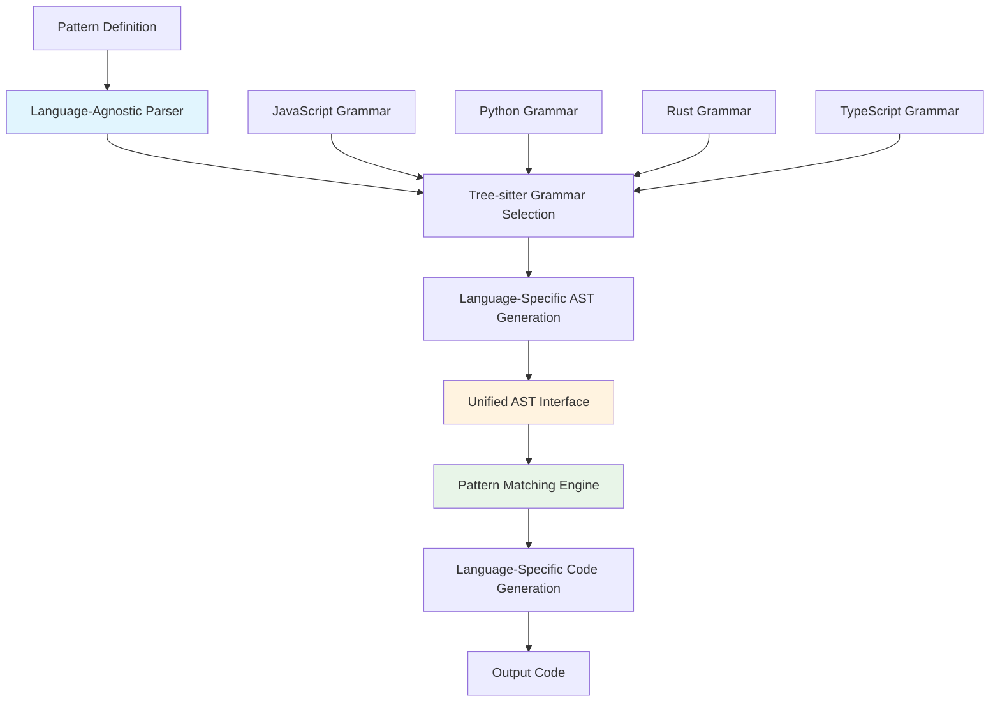

# TI-002: Multi-Language Abstraction Layer

## Overview
**Description**: Unified API for AST manipulation across different programming languages through tree-sitter integration.
**Source**: Chunk 2, Lines 301-600
**Priority**: High - Ecosystem Enabler
**Complexity**: High

## Technical Architecture

### Language Abstraction Stack


### Abstraction Layers
1. **Syntax Layer**: Language-specific parsing and AST generation
2. **Semantic Layer**: Unified node type mapping and traversal
3. **Pattern Layer**: Language-agnostic pattern matching
4. **Transformation Layer**: Language-specific code generation

## Technology Stack

### Core Components
- **Grammar Engine**: Tree-sitter with dynamic grammar loading
- **AST Unification**: Custom trait system for language abstraction
- **Pattern Compiler**: Language-aware pattern compilation
- **Code Generator**: Language-specific output formatting

### Language Support Matrix
| Language | Grammar Quality | Pattern Support | Transformation Support |
|----------|----------------|-----------------|----------------------|
| JavaScript | Excellent | Full | Full |
| TypeScript | Excellent | Full | Full |
| Python | Excellent | Full | Full |
| Rust | Excellent | Full | Full |
| Go | Good | Full | Full |
| Java | Good | Full | Partial |
| C++ | Fair | Partial | Partial |

## Performance Requirements

### Language Switching Performance
- **Grammar Loading**: <50ms for cached grammars, <200ms for cold load
- **AST Conversion**: <10ms overhead for abstraction layer
- **Pattern Compilation**: Language-agnostic compilation with <5% overhead
- **Memory Usage**: Shared grammar cache to minimize memory footprint

### Scalability Metrics
- **Concurrent Languages**: Support 10+ languages simultaneously
- **Grammar Updates**: Hot-swapping without service interruption
- **Memory Efficiency**: Shared AST node pools across languages
- **Processing Speed**: <10% performance penalty for abstraction

## Integration Patterns

### Language Detection
```rust
pub enum Language {
    JavaScript,
    TypeScript,
    Python,
    Rust,
    Go,
    // ... other languages
}

pub trait LanguageDetector {
    fn detect_from_extension(&self, path: &Path) -> Option<Language>;
    fn detect_from_content(&self, content: &str) -> Option<Language>;
    fn detect_from_shebang(&self, content: &str) -> Option<Language>;
}
```

### Unified AST Interface
```rust
pub trait ASTNode {
    fn node_type(&self) -> NodeType;
    fn children(&self) -> Vec<&dyn ASTNode>;
    fn text(&self) -> &str;
    fn range(&self) -> Range;
    fn language(&self) -> Language;
}

pub enum NodeType {
    Function,
    Variable,
    Expression,
    Statement,
    // ... unified node types
}
```

## Architecture Patterns

### Grammar Management
- **Dynamic Loading**: Runtime loading of tree-sitter grammars
- **Version Management**: Support multiple grammar versions
- **Fallback Strategy**: Graceful degradation for unsupported languages
- **Custom Grammars**: Plugin system for custom language support

### AST Normalization
- **Node Type Mapping**: Map language-specific nodes to unified types
- **Semantic Equivalence**: Handle semantic differences between languages
- **Pattern Translation**: Translate patterns between language contexts
- **Error Handling**: Consistent error reporting across languages

## Security Considerations

### Grammar Security
- **Grammar Validation**: Validate tree-sitter grammars before loading
- **Resource Limits**: Prevent DoS through malicious grammars
- **Sandboxing**: Isolate grammar execution from main process
- **Update Verification**: Cryptographic verification of grammar updates

### Cross-Language Safety
- **Type Safety**: Ensure type safety across language boundaries
- **Memory Safety**: Prevent memory corruption in multi-language contexts
- **Input Validation**: Validate input for each supported language
- **Error Isolation**: Isolate language-specific errors

## Implementation Details

### Language-Specific Optimizations
```rust
// Language-specific pattern optimizations
impl PatternOptimizer for JavaScriptOptimizer {
    fn optimize_function_patterns(&self, pattern: &Pattern) -> Pattern {
        // JavaScript-specific function pattern optimizations
    }
}

impl PatternOptimizer for PythonOptimizer {
    fn optimize_function_patterns(&self, pattern: &Pattern) -> Pattern {
        // Python-specific function pattern optimizations
    }
}
```

### Grammar Plugin System
- **Plugin Interface**: Standardized interface for language plugins
- **Registration System**: Dynamic registration of new languages
- **Dependency Management**: Handle grammar dependencies and conflicts
- **Performance Monitoring**: Track per-language performance metrics

## Cross-References
- **User Journeys**: UJ-001 (Library Migration), UJ-002 (Code Standardization)
- **Strategic Themes**: ST-001 (AST Democratization), ST-002 (Enterprise Platform)
- **Related Insights**: TI-001 (Pattern Matching), TI-003 (YAML Configuration)

## Parseltongue Integration Opportunities

### Semantic Language Understanding
- **Cross-Language Relationships**: Track relationships across different languages in polyglot codebases
- **Language-Specific Semantics**: Enhance parseltongue with language-specific semantic understanding
- **Unified Analysis**: Provide unified analysis across multi-language projects
- **Migration Assistance**: Support cross-language migration and refactoring

### Performance Optimization
- **Shared Grammar Cache**: Share tree-sitter grammars between ast-grep and parseltongue
- **Parallel Language Processing**: Coordinate multi-language analysis
- **Memory Optimization**: Unified memory management for multi-language ASTs
- **Incremental Updates**: Efficient updates for multi-language codebases

## Verification Questions
1. What is the performance overhead of the abstraction layer for each supported language?
2. How does grammar quality affect pattern matching accuracy across languages?
3. What is the memory usage pattern when processing polyglot codebases?
4. How frequently do tree-sitter grammar updates break existing functionality?
5. What is the learning curve for adding support for new languages?
6. How does the system handle language-specific semantic differences?
7. What are the failure modes when processing malformed or ambiguous code?
8. How does performance scale with the number of simultaneously supported languages?