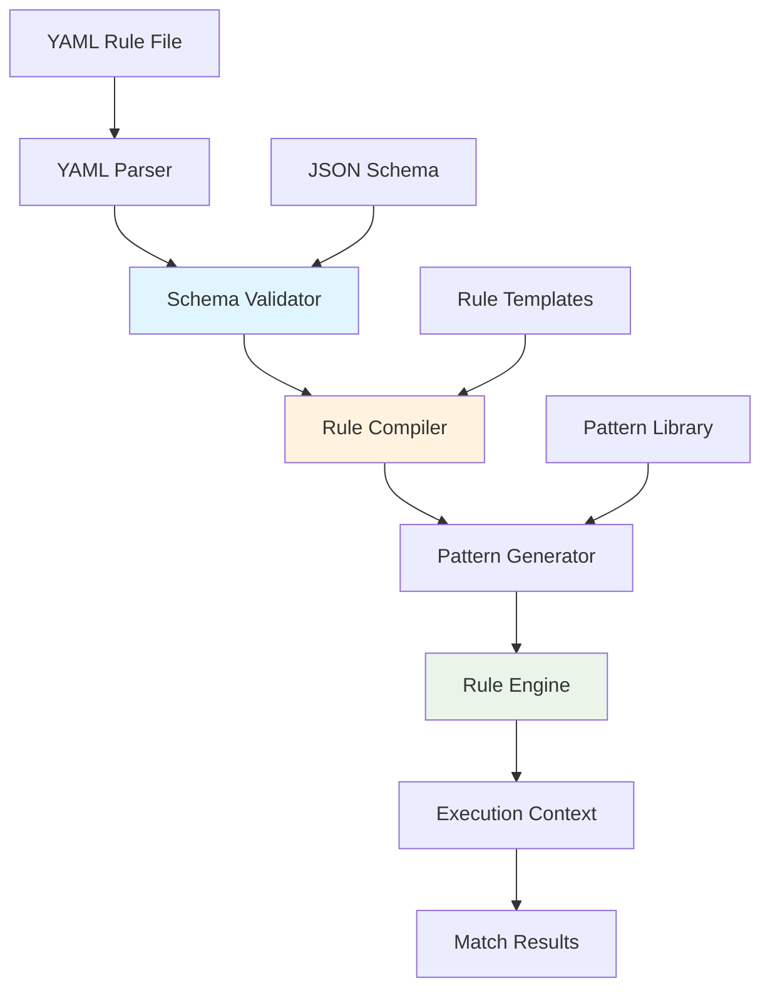

# TI-003: YAML-Based Rule Configuration System

## Overview
**Description**: Declarative rule definition system enabling non-programmers to create complex AST manipulation rules through YAML configuration.
**Source**: Chunk 2, Lines 301-600
**Priority**: High - Accessibility Enabler
**Complexity**: Medium

## Technical Architecture

### Configuration Processing Pipeline


### Rule Definition Structure
```yaml
# Example rule configuration
rules:
  - id: enforce-error-handling
    name: "Enforce Error Handling"
    description: "All async functions must include error handling"
    language: typescript
    severity: error
    pattern: |
      async function $NAME($ARGS) {
        $BODY
      }
    constraints:
      - not-contains: "try"
      - not-contains: "catch"
    message: "Async function '$NAME' must include error handling"
    fix: |
      async function $NAME($ARGS) {
        try {
          $BODY
        } catch (error) {
          console.error('Error in $NAME:', error);
          throw error;
        }
      }
    metadata:
      category: "error-handling"
      tags: ["async", "safety", "best-practice"]
      author: "team-lead"
      created: "2024-01-15"
```

## Technology Stack

### Core Components
- **YAML Parser**: serde_yaml for robust YAML processing
- **Schema Validation**: JSON Schema validation for rule structure
- **Rule Compiler**: Custom compiler for rule-to-pattern translation
- **Template Engine**: Handlebars-like templating for rule generation
- **Configuration Management**: Hot-reloading and validation

### Validation Framework
- **Schema Definition**: JSON Schema for rule structure validation
- **Semantic Validation**: Rule logic and pattern consistency checks
- **Performance Validation**: Rule complexity and performance impact analysis
- **Security Validation**: Rule safety and privilege checks

## Performance Requirements

### Configuration Processing
- **Rule Loading**: <100ms for typical rule sets (100 rules)
- **Schema Validation**: <10ms per rule validation
- **Rule Compilation**: <50ms for complex rules with multiple patterns
- **Hot Reload**: <200ms for configuration updates
- **Memory Usage**: <10MB for large rule sets (1000+ rules)

### Runtime Performance
- **Rule Execution**: <1ms per rule evaluation
- **Pattern Matching**: Leverage compiled pattern cache
- **Batch Processing**: Efficient processing of multiple rules
- **Incremental Updates**: Only recompile changed rules

## Integration Patterns

### Rule Management API
```rust
pub trait RuleManager {
    fn load_rules(&mut self, config_path: &Path) -> Result<Vec<Rule>>;
    fn validate_rule(&self, rule: &Rule) -> Result<ValidationReport>;
    fn compile_rule(&self, rule: &Rule) -> Result<CompiledRule>;
    fn hot_reload(&mut self) -> Result<ReloadReport>;
}

pub struct Rule {
    pub id: String,
    pub name: String,
    pub pattern: String,
    pub language: Language,
    pub severity: Severity,
    pub constraints: Vec<Constraint>,
    pub fix: Option<String>,
    pub metadata: RuleMetadata,
}
```

### Configuration Schema
```json
{
  "$schema": "http://json-schema.org/draft-07/schema#",
  "type": "object",
  "properties": {
    "rules": {
      "type": "array",
      "items": {
        "type": "object",
        "required": ["id", "pattern", "language"],
        "properties": {
          "id": {"type": "string"},
          "pattern": {"type": "string"},
          "language": {"enum": ["javascript", "typescript", "python", "rust"]},
          "severity": {"enum": ["error", "warning", "info"]},
          "constraints": {"type": "array"},
          "fix": {"type": "string"}
        }
      }
    }
  }
}
```

## Architecture Patterns

### Rule Categories
- **Linting Rules**: Code quality and style enforcement
- **Security Rules**: Vulnerability detection and prevention
- **Migration Rules**: Automated code transformation
- **Architecture Rules**: Architectural constraint enforcement
- **Performance Rules**: Performance optimization patterns

### Template System
```yaml
# Rule template for common patterns
templates:
  function-wrapper:
    pattern: |
      function $NAME($ARGS) {
        $BODY
      }
    constraints:
      - parameter: "wrapper-type"
        values: ["try-catch", "logging", "timing"]
    fix-templates:
      try-catch: |
        function $NAME($ARGS) {
          try {
            $BODY
          } catch (error) {
            handleError(error);
          }
        }
```

## Security Considerations

### Rule Safety
- **Pattern Validation**: Ensure patterns cannot execute arbitrary code
- **Resource Limits**: Prevent DoS through complex rule patterns
- **Privilege Separation**: Rules execute with minimal privileges
- **Input Sanitization**: Sanitize user-provided rule content

### Configuration Security
- **File Access Control**: Restrict access to configuration files
- **Schema Enforcement**: Strict schema validation prevents malicious rules
- **Audit Logging**: Log all rule changes and executions
- **Cryptographic Verification**: Optional signing of rule configurations

## Implementation Details

### Rule Compilation Process
1. **YAML Parsing**: Parse YAML into internal rule representation
2. **Schema Validation**: Validate against JSON schema
3. **Semantic Analysis**: Check rule logic and dependencies
4. **Pattern Compilation**: Compile patterns into executable form
5. **Optimization**: Optimize rule execution order and caching
6. **Deployment**: Deploy compiled rules to execution engine

### Hot Reload Mechanism
```rust
pub struct ConfigWatcher {
    watcher: RecommendedWatcher,
    rule_manager: Arc<Mutex<RuleManager>>,
}

impl ConfigWatcher {
    pub fn watch_config(&mut self, path: &Path) -> Result<()> {
        self.watcher.watch(path, RecursiveMode::Recursive)?;
        // Handle file change events and trigger rule recompilation
        Ok(())
    }
}
```

## Cross-References
- **User Journeys**: UJ-002 (Code Standardization), UJ-003 (Security Rules)
- **Strategic Themes**: ST-001 (AST Democratization), ST-003 (Security Framework)
- **Related Insights**: TI-001 (Pattern Matching), TI-002 (Multi-Language Support)

## Parseltongue Integration Opportunities

### Semantic Rule Enhancement
- **Context-Aware Rules**: Use parseltongue's semantic understanding for smarter rule evaluation
- **Relationship-Based Constraints**: Define rules based on code relationships and dependencies
- **Impact-Aware Rules**: Consider change impact when applying rule fixes
- **Architectural Rules**: Define rules based on architectural patterns and constraints

### Configuration Intelligence
- **Rule Suggestion**: Suggest rules based on codebase analysis
- **Rule Optimization**: Optimize rule performance based on codebase characteristics
- **Rule Validation**: Validate rules against actual codebase patterns
- **Rule Analytics**: Provide insights on rule effectiveness and usage

## Verification Questions
1. What is the performance impact of complex rule sets on large codebases?
2. How does rule compilation time scale with rule complexity?
3. What are the memory usage patterns for different types of rules?
4. How effective is the hot reload mechanism under high-frequency changes?
5. What is the learning curve for non-technical users to create effective rules?
6. How does rule validation prevent common configuration errors?
7. What are the failure modes when processing malformed YAML configurations?
8. How does the system handle conflicting or contradictory rules?