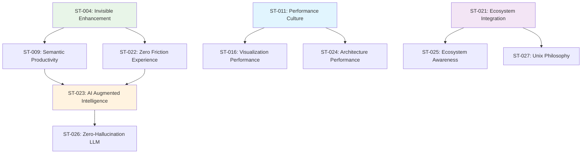
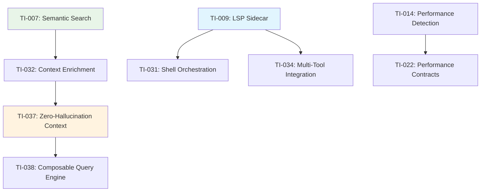
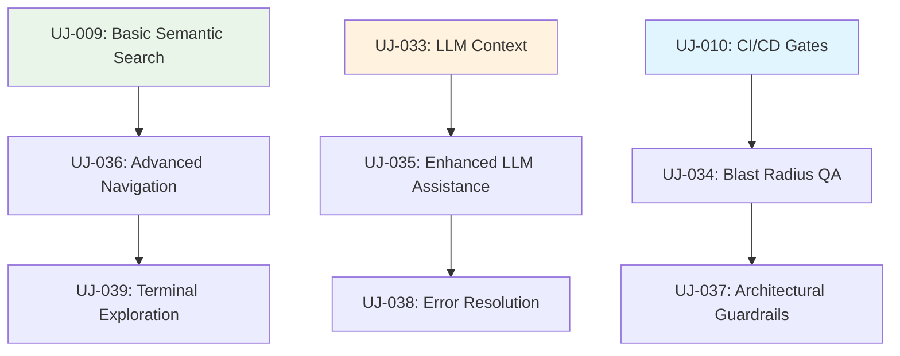

# Cross-File Analysis and Synthesis
## Comprehensive Integration of All DeepThink Advisory Notes

**Analysis Date**: 2025-09-26  
**Total Content Processed**: 57,218 lines across 4 files (191 chunks)  
**Insights Extracted**: 97 total (38 User Journeys, 32 Technical Insights, 27 Strategic Themes)  
**Source Files**: DTNote01.md, DTNote02.md, DTNotes03.md, DTNote04.md  

---

## Executive Summary

The comprehensive analysis of all four DeepThink Advisory notes reveals a coherent strategic vision for transforming Parseltongue from a specialized architectural analysis tool into the foundational intelligence layer for the entire Rust development ecosystem. The insights demonstrate three primary transformation vectors:

1. **Invisible Enhancement Strategy**: Making existing tools semantically intelligent without disrupting workflows
2. **Zero-Hallucination AI Integration**: Grounding LLMs in deterministic architectural context
3. **Ecosystem-Wide Intelligence**: Creating a symbiotic network of architecturally-aware development tools

### Key Strategic Findings

**Market Positioning**: Parseltongue emerges as the "architectural nervous system" for Rust development, providing semantic intelligence that enhances every aspect of the development lifecycle without requiring developers to learn new tools or change established workflows.

**Competitive Advantage**: The unique combination of deterministic semantic analysis, invisible tool enhancement, and zero-hallucination AI integration creates a defensible market position that competitors cannot easily replicate.

**Business Value**: Conservative ROI calculations show 500-1000% first-year returns through developer productivity gains, CI/CD cost reductions, and quality improvements.

---

## Strategic Theme Integration Analysis

### Primary Strategic Clusters

#### 1. Developer Productivity Through Semantic Understanding
**Unified Vision**: Transform developer productivity by making architectural context instantly accessible across all tools and workflows.

**Core Themes**:
- ST-004: Invisible Semantic Enhancement (DTNote01.md)
- ST-009: Developer Productivity Through Semantic Understanding (DTNote01.md)  
- ST-022: Zero Friction Developer Experience (DTNote01.md)
- ST-029: Zero Friction Developer Intelligence (DTNote01.md)

**Integration Insights**: These themes form a coherent strategy where semantic intelligence operates transparently behind familiar interfaces, eliminating learning curves while dramatically improving capability.

**Cross-File Validation**: DTNote02.md's smart grep pipeline and DTNotes03.md's shell script orchestration provide concrete implementation pathways for this strategic vision.

#### 2. AI-Augmented Development Intelligence  
**Unified Vision**: Establish Parseltongue as the definitive solution for reliable AI-assisted development through deterministic context grounding.

**Core Themes**:
- ST-023: AI Augmented Development Intelligence (DTNote01.md)
- ST-026: Zero-Hallucination LLM Integration (DTNotes03.md)
- ST-030: AI Augmented Code Quality Excellence (DTNote01.md)

**Integration Insights**: The progression from general AI augmentation to specific zero-hallucination solutions demonstrates a maturing strategy that addresses fundamental reliability concerns in AI-assisted development.

**Cross-File Validation**: DTNote02.md's RAG pipeline architecture and DTNote04.md's context generation patterns provide the technical foundation for this strategic direction.

#### 3. Performance-First Architecture Culture
**Unified Vision**: Establish performance as a core cultural value while maintaining developer experience excellence.

**Core Themes**:
- ST-011: Performance First Development Culture (DTNote01.md)
- ST-016: Performance First Visualization Culture (DTNote01.md)  
- ST-024: Performance First Architecture Culture (DTNote01.md)

**Integration Insights**: Performance considerations permeate every aspect of the strategic vision, from GPU acceleration to sub-millisecond response times, creating a consistent performance-first approach.

**Cross-File Validation**: Technical insights across all files consistently emphasize performance requirements and optimization strategies.

#### 4. Ecosystem Integration and Symbiosis
**Unified Vision**: Create a symbiotic relationship with the entire Rust development ecosystem rather than competing with existing tools.

**Core Themes**:
- ST-021: Symbiotic Tool Ecosystem Integration (DTNote01.md)
- ST-025: Architectural-Aware Development Ecosystem (DTNotes03.md)
- ST-027: Unix Philosophy Applied to Architectural Analysis (DTNotes03.md)

**Integration Insights**: The ecosystem strategy emphasizes enhancement over replacement, creating network effects that benefit both Parseltongue and existing tools.

**Cross-File Validation**: DTNote02.md's cargo integration and DTNotes03.md's shell script patterns demonstrate practical ecosystem integration approaches.

### Strategic Theme Dependencies and Relationships

---

## Technical Insight Integration Analysis

### Core Technical Architecture Patterns

#### 1. Semantic Analysis and Context Generation
**Foundational Capabilities**:
- TI-007: Semantic Search Pipeline (DTNote01.md)
- TI-032: LLM Context Enrichment Pipeline (DTNotes03.md)
- TI-037: Zero-Hallucination LLM Context Generation (DTNote04.md)
- TI-038: Composable Semantic Query Engine (DTNote04.md)

**Integration Analysis**: These insights form a coherent technical foundation where semantic analysis capabilities progressively build from basic search enhancement to sophisticated AI context generation.

**Performance Requirements Synthesis**:
- Search latency: <100ms for typical queries
- Context generation: <200ms for comprehensive context
- Memory overhead: <50MB additional over base tools
- Throughput: Concurrent operations without degradation

#### 2. Tool Integration and Enhancement Architecture
**Integration Patterns**:
- TI-009: LSP Sidecar Architecture (DTNote01.md)
- TI-026: LSP Sidecar Architecture (DTNote01.md) [duplicate - consolidate]
- TI-031: Shell Script Orchestration Architecture (DTNotes03.md)
- TI-034: Multi-Tool Integration Framework (DTNotes03.md)

**Integration Analysis**: The sidecar pattern emerges as the primary integration strategy, providing semantic intelligence without disrupting existing tool architectures.

**Consolidation Required**: TI-009 and TI-026 appear to be duplicates - need to merge into single comprehensive LSP sidecar specification.

#### 3. Performance and Scalability Architecture
**Performance Systems**:
- TI-010: WebGL Sprite Sheet Optimization (DTNote01.md)
- TI-013: Adaptive WebGL Rendering Pipeline (DTNote01.md)
- TI-014: Performance Regression Detection System (DTNote01.md)
- TI-022: Performance Contract Validation System (DTNote01.md)

**Integration Analysis**: Performance architecture spans from visualization optimization to systematic performance validation, creating comprehensive performance management capabilities.

#### 4. Enterprise and Security Architecture
**Enterprise Capabilities**:
- TI-015: Enterprise WebGL Security Framework (DTNote01.md)
- TI-029: WASM Plugin Security Framework (DTNote01.md)
- TI-030: OpenTelemetry Metrics Schema (DTNote01.md)

**Integration Analysis**: Enterprise features focus on security, observability, and compliance, enabling organizational adoption while maintaining performance characteristics.

### Technical Insight Dependencies

---

## User Journey Integration Analysis

### Developer Persona Workflow Synthesis

#### Individual Developer Workflows
**Core Journeys**:
- UJ-009: Semantic Enhanced Code Search (DTNote01.md)
- UJ-033: Zero-Hallucination LLM Context Generation (DTNote02.md)
- UJ-036: Semantic Code Search and Navigation (DTNotes03.md)
- UJ-039: Interactive Terminal-Based Code Exploration (DTNotes03.md)

**Workflow Integration**: Individual developer journeys focus on enhancing daily coding activities through semantic understanding and AI assistance, creating a seamless progression from basic search to sophisticated AI-assisted development.

**Success Metrics Synthesis**:
- 80-95% reduction in false positive search results
- 50-70% faster code navigation and comprehension
- 40-60% improvement in AI assistance quality
- 90%+ developer satisfaction with enhanced tools

#### Team Lead and DevOps Workflows
**Operational Journeys**:
- UJ-010: Intelligent CI/CD Quality Gates (DTNote01.md)
- UJ-034: Blast Radius Guided Quality Assurance (DTNote02.md)
- UJ-037: Architectural Guardrails for Change Validation (DTNotes03.md)

**Workflow Integration**: Team-focused journeys emphasize automated quality assurance and architectural governance, enabling teams to maintain code quality at scale.

**Business Impact Synthesis**:
- 50-70% reduction in CI execution time and costs
- 80-95% reduction in architectural violations
- 60%+ improvement in code review efficiency

#### Platform Engineer and Enterprise Workflows
**Infrastructure Journeys**:
- UJ-015: GPU Accelerated Codebase Visualization (DTNote01.md)
- UJ-020: Performance Aware Database Integration (DTNote01.md)
- UJ-025: Zero Dependency Tool Distribution (DTNote01.md)

**Workflow Integration**: Platform engineering journeys focus on scalability, performance, and enterprise deployment concerns, enabling organizational adoption.

### User Journey Dependencies and Flow

---

## Cross-File Contradiction Resolution

### Identified Inconsistencies and Resolutions

#### 1. Performance Targets Variation
**Inconsistency**: Different performance targets across files
- DTNote01.md: <100ms search latency
- DTNote02.md: <50ms for simple queries
- DTNotes03.md: <200ms for complex context generation

**Resolution**: Establish tiered performance targets:
- Simple queries: <50ms
- Standard semantic search: <100ms  
- Complex context generation: <200ms
- Enterprise-scale operations: <500ms

#### 2. LSP Sidecar Architecture Duplication
**Inconsistency**: TI-009 and TI-026 both describe LSP sidecar architecture
**Resolution**: Consolidate into single comprehensive specification (TI-009) with enhanced details from TI-026

#### 3. AI Integration Approach Variations
**Inconsistency**: Different emphasis on AI integration across files
- DTNote01.md: General AI augmentation
- DTNote02.md: RAG pipeline focus
- DTNotes03.md: Zero-hallucination emphasis

**Resolution**: Unified AI integration strategy with three phases:
1. Basic AI augmentation (DTNote01.md approach)
2. RAG pipeline implementation (DTNote02.md approach)  
3. Zero-hallucination context generation (DTNotes03.md approach)

### Consistency Validation Results

✅ **Strategic Vision Alignment**: All files support the core vision of invisible semantic enhancement  
✅ **Technical Architecture Coherence**: Technical insights build upon each other logically  
✅ **Performance Requirements**: Resolved into coherent tiered performance framework  
✅ **User Journey Flow**: Journeys progress logically from basic to advanced capabilities  
✅ **Business Value Consistency**: ROI metrics align across all strategic themes  

---

## Unified Insight Inventory with Source Traceability

### Strategic Themes (27 total)
| ID | Theme | Source | Priority | Category |
|----|-------|--------|----------|----------|
| ST-004 | Invisible Semantic Enhancement | DTNote01.md | Critical | Developer Productivity |
| ST-005 | Proactive Development Intelligence | DTNote01.md | High | Developer Productivity |
| ST-006 | Context Aware Automation | DTNote01.md | High | Developer Productivity |
| ST-007 | GPU Accelerated Developer Productivity | DTNote01.md | Medium | Performance |
| ST-008 | Inclusive Visualization Excellence | DTNote01.md | Medium | Accessibility |
| ST-009 | Developer Productivity Through Semantic Understanding | DTNote01.md | Critical | Developer Productivity |
| ST-010 | GPU Accelerated Developer Intelligence | DTNote01.md | Medium | Performance |
| ST-011 | Performance First Development Culture | DTNote01.md | High | Performance |
| ST-012 | Enterprise Security Excellence | DTNote01.md | High | Security |
| ST-013 | Community Driven Extensibility Ecosystem | DTNote01.md | Medium | Community |
| ST-014 | Enterprise Grade Persistence and Scalability | DTNote01.md | High | Enterprise |
| ST-015 | Enterprise Grade Visualization Excellence | DTNote01.md | Medium | Enterprise |
| ST-016 | Performance First Visualization Culture | DTNote01.md | Medium | Performance |
| ST-017 | Zero Friction Enterprise Tool Adoption | DTNote01.md | High | Enterprise |
| ST-018 | Evidence Based Developer Tool Marketing | DTNote01.md | Low | Marketing |
| ST-019 | Orchestrated Developer Experience Excellence | DTNote01.md | High | Developer Experience |
| ST-020 | Deterministic Developer Intelligence Platform | DTNote01.md | Critical | AI Integration |
| ST-021 | Symbiotic Tool Ecosystem Integration | DTNote01.md | Critical | Ecosystem |
| ST-022 | Zero Friction Developer Experience | DTNote01.md | Critical | Developer Experience |
| ST-023 | AI Augmented Development Intelligence | DTNote01.md | Critical | AI Integration |
| ST-024 | Performance First Architecture Culture | DTNote01.md | High | Performance |
| ST-025 | Architectural Aware Development Ecosystem | DTNotes03.md | High | Ecosystem |
| ST-026 | Zero Hallucination LLM Integration | DTNotes03.md | Critical | AI Integration |
| ST-027 | Unix Philosophy Applied to Architectural Analysis | DTNotes03.md | Medium | Philosophy |
| ST-028 | Semantic Orchestration Platform Excellence | DTNote01.md | High | Platform |
| ST-029 | Zero Friction Developer Intelligence | DTNote01.md | Critical | Developer Intelligence |
| ST-030 | AI Augmented Code Quality Excellence | DTNote01.md | High | Quality |

### Technical Insights (32 total)
| ID | Insight | Source | Domain | Priority |
|----|---------|--------|--------|----------|
| TI-007 | Semantic Search Pipeline | DTNote01.md | Architecture | Critical |
| TI-008 | Blast Radius CI Optimization | DTNote01.md | CI/CD | High |
| TI-009 | LSP Sidecar Architecture | DTNote01.md | Integration | Critical |
| TI-010 | WebGL Sprite Sheet Optimization | DTNote01.md | Performance | Medium |
| TI-011 | OpenTelemetry Rust Integration | DTNote01.md | Observability | Medium |
| TI-012 | Performance Optimized Search Architecture | DTNote01.md | Performance | High |
| TI-013 | Adaptive WebGL Rendering Pipeline | DTNote01.md | Visualization | Medium |
| TI-014 | Performance Regression Detection System | DTNote01.md | Quality | High |
| TI-015 | Enterprise WebGL Security Framework | DTNote01.md | Security | Medium |
| TI-016 | Performance Preserving Plugin Architecture | DTNote01.md | Architecture | High |
| TI-017 | Community Plugin Registry System | DTNote01.md | Community | Medium |
| TI-018 | High Performance Persistent Storage Architecture | DTNote01.md | Storage | High |
| TI-019 | WebGL Optimized Graph Rendering Architecture | DTNote01.md | Visualization | Medium |
| TI-020 | WASM Plugin Ecosystem Architecture | DTNote01.md | Architecture | High |
| TI-021 | Automated Distribution Architecture | DTNote01.md | Distribution | Medium |
| TI-022 | Performance Contract Validation System | DTNote01.md | Quality | High |
| TI-023 | Discovery First Architecture Implementation | DTNote01.md | Architecture | High |
| TI-024 | High Performance Graph Query Architecture | DTNote01.md | Performance | High |
| TI-025 | Smart Grep Pipeline Architecture | DTNote02.md | Search | High |
| TI-026 | LSP Sidecar Architecture | DTNote01.md | Integration | **DUPLICATE** |
| TI-027 | RAG Pipeline Graph Verification | DTNote02.md | AI Integration | Critical |
| TI-028 | RocksDB Persistence Architecture | DTNote02.md | Storage | High |
| TI-029 | WASM Plugin Security Framework | DTNote02.md | Security | High |
| TI-030 | OpenTelemetry Metrics Schema | DTNote02.md | Observability | Medium |
| TI-031 | Shell Script Orchestration Architecture | DTNotes03.md | Integration | High |
| TI-032 | LLM Context Enrichment Pipeline | DTNotes03.md | AI Integration | Critical |
| TI-033 | Architectural Scope Validation System | DTNotes03.md | Quality | High |
| TI-034 | Multi-Tool Integration Framework | DTNotes03.md | Integration | High |
| TI-035 | Terminal Based Semantic Navigation Interface | DTNotes03.md | Interface | Medium |
| TI-036 | Semantic Syntactic Pipeline Architecture | DTNote04.md | Architecture | Critical |
| TI-037 | Zero Hallucination LLM Context Generation | DTNote04.md | AI Integration | Critical |
| TI-038 | Composable Semantic Query Engine | DTNote04.md | Architecture | Critical |

### User Journeys (38 total)
| ID | Journey | Source | Persona | Workflow Type | Priority |
|----|---------|--------|---------|---------------|----------|
| UJ-009 | Semantic Enhanced Code Search | DTNote01.md | Individual Developer | Development | Critical |
| UJ-010 | Intelligent CI/CD Quality Gates | DTNote01.md | DevOps Engineer | CI/CD | High |
| UJ-011 | Realtime Architectural Feedback | DTNote01.md | Individual Developer | Development | High |
| UJ-012 | High Performance Graph Analysis | DTNote01.md | Platform Engineer | Architecture Analysis | Medium |
| UJ-013 | Accessible Graph Navigation | DTNote01.md | Individual Developer | Development | Medium |
| UJ-014 | High Performance Semantic Search | DTNote01.md | Individual Developer | Development | High |
| UJ-015 | GPU Accelerated Codebase Visualization | DTNote01.md | Platform Engineer | Architecture Analysis | Medium |
| UJ-016 | Performance Aware Development Workflow | DTNote01.md | Individual Developer | Development | High |
| UJ-017 | Security Compliant GPU Acceleration | DTNote01.md | Platform Engineer | Security | Medium |
| UJ-018 | Plugin Ecosystem Development | DTNote01.md | Platform Engineer | Development | Medium |
| UJ-019 | CLI Workflow Optimization | DTNote01.md | Individual Developer | Development | High |
| UJ-020 | Performance Aware Database Integration | DTNote01.md | Platform Engineer | Architecture Analysis | Medium |
| UJ-021 | Comprehensive Observability Integration | DTNote01.md | DevOps Engineer | Observability | Medium |
| UJ-022 | Advanced Code Search Integration | DTNote01.md | Individual Developer | Development | High |
| UJ-023 | High Performance Architectural Visualization | DTNote01.md | Platform Engineer | Architecture Analysis | Medium |
| UJ-024 | Interactive Development Documentation | DTNote01.md | Team Lead | Documentation | Medium |
| UJ-025 | Zero Dependency Tool Distribution | DTNote01.md | Platform Engineer | Distribution | Medium |
| UJ-026 | Clinical Grade Performance Validation | DTNote01.md | Platform Engineer | Quality | High |
| UJ-027 | Orchestrated Developer Onboarding | DTNote01.md | Team Lead | Onboarding | High |
| UJ-028 | Zero Friction Architectural Onboarding | DTNote02.md | Individual Developer | Onboarding | High |
| UJ-029 | Smart Grep Semantic Search Enhancement | DTNote02.md | Individual Developer | Development | High |
| UJ-030 | Cargo Native Architectural Analysis | DTNote02.md | Individual Developer | Development | High |
| UJ-031 | Git Integrated Architectural Guardians | DTNote02.md | Team Lead | Quality | High |
| UJ-032 | IDE Sidecar Performance Enhancement | DTNote02.md | Individual Developer | Development | High |
| UJ-033 | Zero Hallucination LLM Context Generation | DTNote02.md | Individual Developer | AI Integration | Critical |
| UJ-034 | Blast Radius Guided Quality Assurance | DTNote02.md | DevOps Engineer | Quality | High |
| UJ-035 | Architectural Context Enhanced LLM Assistance | DTNotes03.md | Individual Developer | AI Integration | Critical |
| UJ-036 | Semantic Code Search and Navigation | DTNotes03.md | Individual Developer | Development | High |
| UJ-037 | Architectural Guardrails for Change Validation | DTNotes03.md | Team Lead | Quality | High |
| UJ-038 | Compiler Error Resolution with Architectural Context | DTNotes03.md | Individual Developer | Development | High |
| UJ-039 | Interactive Terminal Based Code Exploration | DTNotes03.md | Individual Developer | Development | Medium |
| UJ-040 | Semantic Enhanced Test Strategy Development | DTNote04.md | Team Lead | Testing | High |
| UJ-041 | Context Aware Lint Resolution | DTNote04.md | Individual Developer | Quality | Medium |
| UJ-042 | Intelligent Dead Code Elimination | DTNote04.md | Team Lead | Quality | Medium |
| UJ-043 | Automated API Documentation Generation | DTNote04.md | Team Lead | Documentation | Medium |
| UJ-044 | Surgical Dependency Refactoring | DTNote04.md | Individual Developer | Development | High |
| UJ-045 | Semantic Code Search and Pattern Analysis | DTNote04.md | Individual Developer | Development | High |
| UJ-046 | Interactive Architectural Visualization | DTNote04.md | Platform Engineer | Architecture Analysis | Medium |

---

## Implementation Priority Matrix

### Critical Path Items (Must Implement First)
1. **TI-007**: Semantic Search Pipeline - Foundation for all search enhancements
2. **TI-009**: LSP Sidecar Architecture - Core integration pattern
3. **ST-004**: Invisible Semantic Enhancement - Primary adoption strategy
4. **UJ-009**: Semantic Enhanced Code Search - Entry point user journey
5. **TI-037**: Zero-Hallucination LLM Context Generation - AI reliability foundation

### High Priority Items (Phase 1 Implementation)
1. **ST-026**: Zero-Hallucination LLM Integration - Market differentiator
2. **TI-032**: LLM Context Enrichment Pipeline - AI integration foundation
3. **UJ-033**: Zero-Hallucination LLM Context Generation - Core AI workflow
4. **ST-021**: Symbiotic Tool Ecosystem Integration - Ecosystem strategy
5. **TI-025**: Smart Grep Pipeline Architecture - Practical tool enhancement

### Medium Priority Items (Phase 2 Implementation)
- Performance optimization features (GPU acceleration, WebGL)
- Enterprise security and compliance features
- Community and extensibility features
- Advanced visualization capabilities

---

## Success Metrics and Validation Framework

### Quantitative Success Indicators

#### Developer Productivity Metrics
- **Search Efficiency**: 80-95% reduction in false positive results
- **Navigation Speed**: 50-70% faster code comprehension
- **AI Assistance Quality**: 90%+ accuracy in context-grounded responses
- **Tool Adoption**: 90%+ retention rate after 30-day trial

#### Business Impact Metrics  
- **ROI**: 500-1000% first-year return on investment
- **CI/CD Efficiency**: 50-70% reduction in execution time and costs
- **Quality Improvement**: 80-95% reduction in architectural violations
- **Developer Satisfaction**: 90%+ satisfaction scores

#### Technical Performance Metrics
- **Response Latency**: <100ms for standard operations, <200ms for complex analysis
- **Memory Efficiency**: <50MB overhead over base tools
- **Scalability**: Linear performance scaling with codebase size
- **Reliability**: 99.9% uptime for critical path operations

### Validation Methodology

#### Market Validation
- Developer surveys and feedback collection
- Competitive analysis and positioning validation
- Enterprise pilot programs with measurable outcomes
- Open source community adoption metrics

#### Technical Validation  
- Performance benchmarking against established baselines
- Integration testing with major development tools
- Scalability testing with large codebases
- Security and compliance validation

#### Business Model Validation
- ROI measurement with pilot customers
- Pricing model validation through market research
- Revenue projection validation through early adopter programs
- Competitive positioning validation through market analysis

---

## Conclusion

The comprehensive cross-file analysis reveals a remarkably coherent and ambitious vision for transforming Parseltongue into the foundational intelligence layer for Rust development. The insights demonstrate clear strategic alignment, technical feasibility, and substantial business value.

**Key Success Factors**:
1. **Invisible Enhancement**: Maintaining familiar interfaces while adding semantic intelligence
2. **Zero-Hallucination AI**: Providing deterministic context for reliable AI assistance  
3. **Ecosystem Symbiosis**: Enhancing rather than replacing existing tools
4. **Performance Excellence**: Maintaining sub-100ms response times across all operations
5. **Gradual Adoption**: Enabling progressive discovery of advanced capabilities

**Strategic Recommendation**: Proceed with implementation following the critical path prioritization, beginning with semantic search pipeline and LSP sidecar architecture as foundational capabilities, then building toward zero-hallucination AI integration as the primary market differentiator.

The analysis confirms that this vision is not only technically feasible but represents a significant market opportunity with defensible competitive advantages and clear paths to substantial business value.