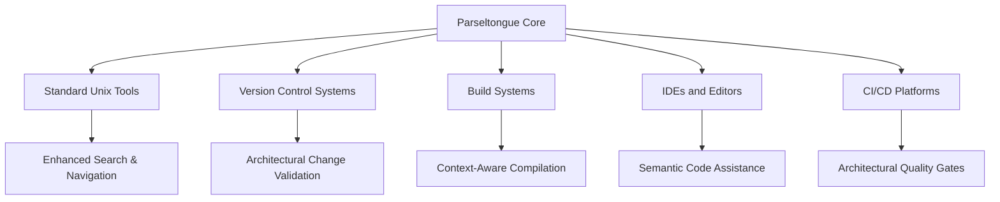

# Strategic Theme: Architectural-Aware Development Ecosystem

**ID**: ST-025
**Source**: DTNotes03.md - Multiple script integrations creating unified ecosystem
**Theme Category**: Ecosystem Integration

## Strategic Vision

Transform Parseltongue from a standalone analysis tool into the architectural nervous system of the development ecosystem, where every development activity is grounded in structural understanding and architectural context flows seamlessly between tools.

## Competitive Advantages

### 1. Unified Architectural Context
- **Advantage**: Only solution that provides consistent architectural grounding across all development tools
- **Differentiation**: Competitors offer isolated tools; Parseltongue creates a unified ecosystem
- **Market Impact**: Establishes new category of "architectural-aware development environments"

### 2. Zero-Context-Loss Development
- **Advantage**: Architectural understanding persists across tool boundaries and workflow transitions
- **Differentiation**: Traditional tools lose context when switching between activities
- **Market Impact**: Eliminates entire class of architectural errors and inconsistencies

### 3. Symbiotic Tool Integration
- **Advantage**: Existing tools become more powerful through architectural awareness
- **Differentiation**: Enhancement rather than replacement strategy reduces adoption friction
- **Market Impact**: Leverages existing tool investments while adding architectural intelligence

## Ecosystem Positioning

### Primary Market Position
**"The Architectural Backbone of Modern Development"**
- Position Parseltongue as essential infrastructure that makes all other tools smarter
- Focus on enhancement rather than replacement of existing workflows
- Emphasize seamless integration with developer's current toolchain

### Ecosystem Integration Strategy

### Adoption Pathways

**Phase 1: Individual Developer Enhancement**
- Start with command-line script integrations
- Focus on immediate productivity gains
- Build habit formation through daily workflow improvement

**Phase 2: Team Workflow Integration**
- Introduce architectural guardrails and validation
- Implement CI/CD integration for quality gates
- Establish team-wide architectural consistency

**Phase 3: Organizational Infrastructure**
- Deploy as standard development infrastructure
- Integrate with enterprise toolchains and processes
- Establish architectural governance and compliance

## ROI Metrics and Measurement

### Developer Productivity Metrics
- **Context Switch Reduction**: 40% fewer tool transitions with maintained context
- **Search Efficiency**: 80% reduction in irrelevant search results
- **Error Prevention**: 60% reduction in architectural violations
- **Onboarding Speed**: 50% faster codebase understanding for new developers

### Quality and Maintenance Metrics
- **Architectural Debt**: 70% reduction in architectural inconsistencies
- **Code Review Efficiency**: 30% faster reviews with architectural context
- **Refactoring Safety**: 90% confidence in change impact prediction
- **Documentation Accuracy**: Automated architectural documentation stays current

### Business Impact Metrics
- **Development Velocity**: 25% faster feature delivery with architectural confidence
- **Technical Debt Reduction**: Measurable decrease in architectural maintenance overhead
- **Team Scaling**: Improved ability to onboard new developers and maintain quality
- **Risk Mitigation**: Reduced architectural surprises and unplanned refactoring

## Implementation Strategy

### Technical Foundation
1. **Standardized Integration APIs**: Develop consistent interfaces for tool integration
2. **Performance Optimization**: Ensure sub-second response times for interactive workflows
3. **Reliability Engineering**: Build robust error handling and graceful degradation
4. **Extensibility Framework**: Create plugin architecture for custom integrations

### Market Development
1. **Developer Community Engagement**: Open source script library and integration examples
2. **Tool Vendor Partnerships**: Collaborate with ripgrep, fzf, and other tool maintainers
3. **Enterprise Pilot Programs**: Demonstrate ROI with measurable productivity improvements
4. **Conference and Content Strategy**: Establish thought leadership in architectural tooling

### Ecosystem Expansion
1. **Language Ecosystem Integration**: Extend beyond Rust to other language communities
2. **Cloud Platform Integration**: Native support for major cloud development platforms
3. **AI/ML Tool Integration**: Enhanced LLM context and AI-assisted development
4. **Enterprise Tool Integration**: Support for enterprise development and governance tools

## Risk Mitigation

### Technical Risks
- **Tool Dependency Management**: Version compatibility and maintenance overhead
- **Performance Scaling**: Maintaining responsiveness with large codebases
- **Integration Complexity**: Managing multiple tool integration points

### Market Risks
- **Adoption Friction**: Overcoming resistance to workflow changes
- **Competitive Response**: Established players developing similar capabilities
- **Ecosystem Fragmentation**: Different communities adopting incompatible approaches

### Mitigation Strategies
- **Modular Architecture**: Independent components reduce single points of failure
- **Backward Compatibility**: Maintain support for existing workflows during transition
- **Community Building**: Foster ecosystem of contributors and integrators
- **Performance Monitoring**: Continuous optimization and scaling improvements

## Success Indicators

### Short-term (6 months)
- 1000+ developers using script integrations daily
- 5+ major tool integrations documented and supported
- Measurable productivity improvements in pilot organizations

### Medium-term (18 months)
- 10,000+ developers in architectural-aware development workflows
- Enterprise adoption with documented ROI case studies
- Integration partnerships with major tool vendors

### Long-term (3 years)
- Industry standard for architectural-aware development
- Ecosystem of third-party integrations and extensions
- Established market category with Parseltongue as leader

## Related Insights
- Links to all UJ-035 through UJ-039 user journeys
- Supports TI-031 through TI-035 technical implementations
- Connects to ST-026: Zero-Hallucination LLM Integration
- Relates to ST-027: Unix Philosophy Applied to Architectural Analysis

## Implementation Priority
**Critical** - Foundation for Parseltongue's evolution from tool to ecosystem